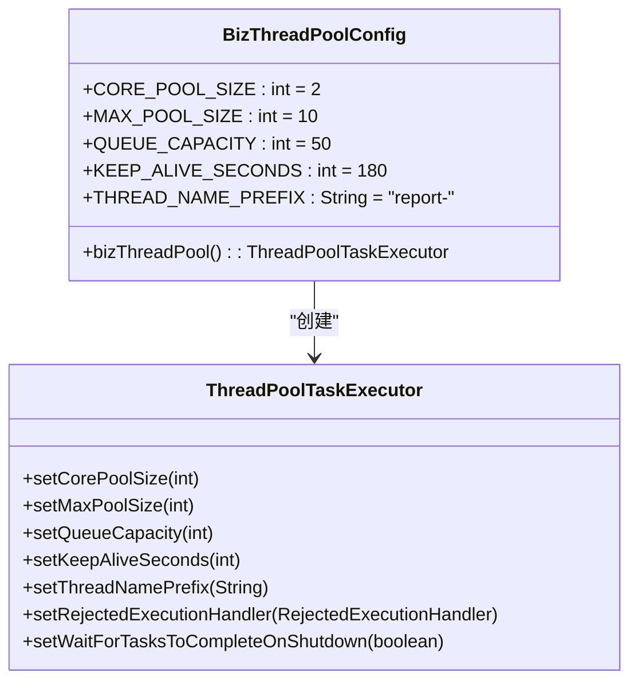
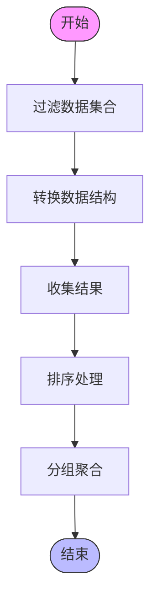
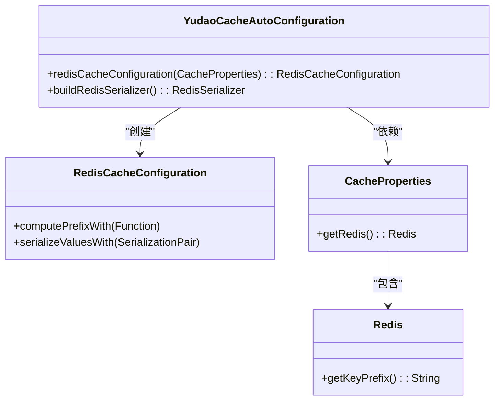
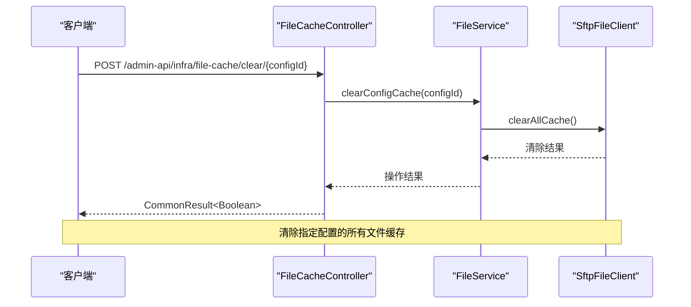
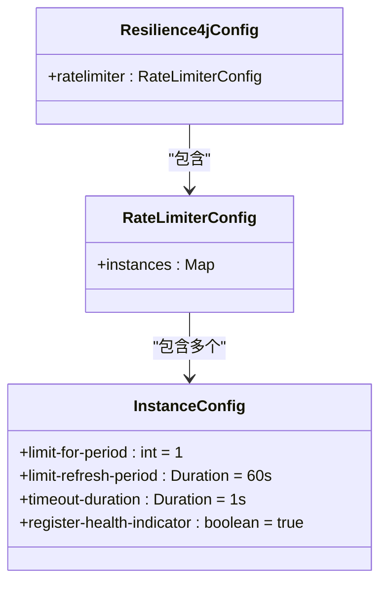
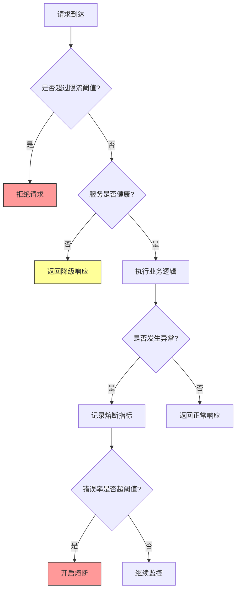
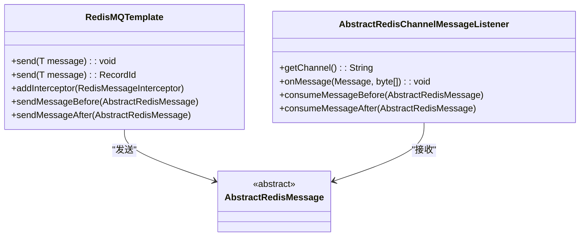
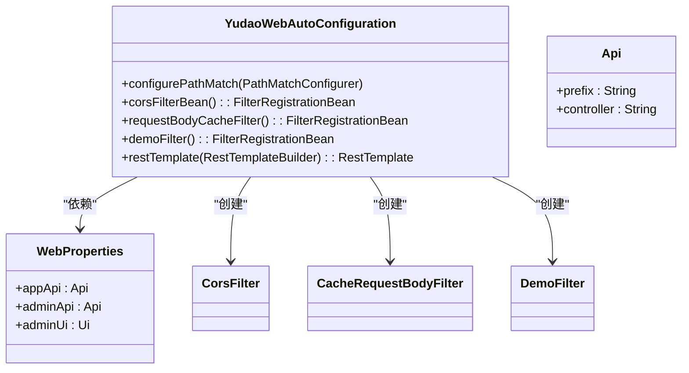
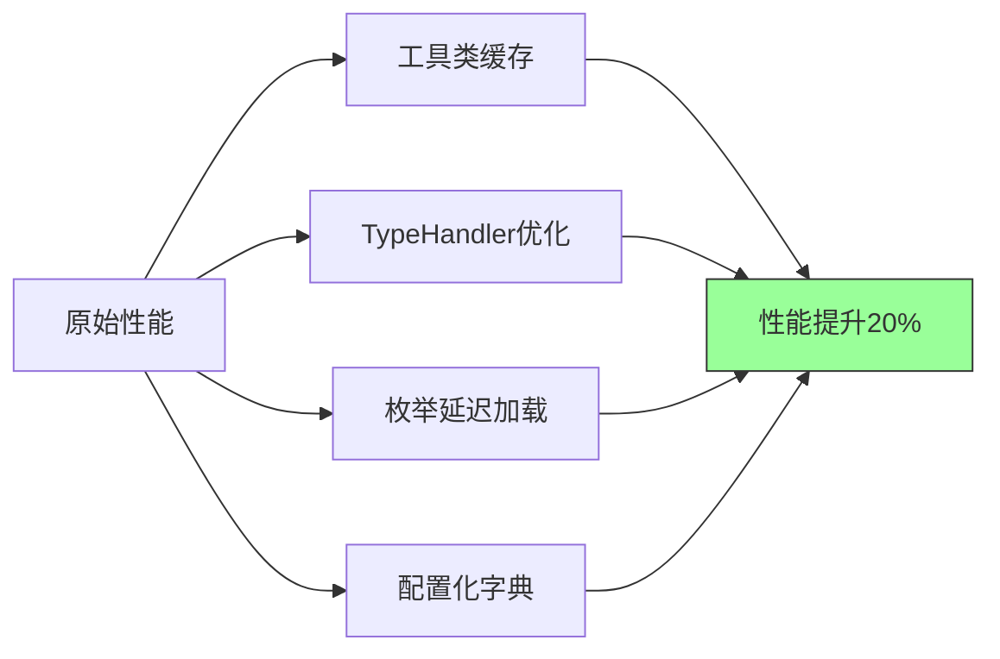

# Web性能优化

<cite>
**本文档引用文件**   
- [OPTIMIZATION_PLAN.md](file://eplus-framework/OPTIMIZATION_PLAN.md)
- [README.md](file://eplus-framework/README.md)
- [BizThreadPoolConfig.java](file://yudao-framework/eplus-spring-boot-starter-thread-pool/src/main/java/com/syj/eplus/framework/thread/pool/BizThreadPoolConfig.java)
- [YudaoWebAutoConfiguration.java](file://yudao-framework/yudao-spring-boot-starter-web/src/main/java/cn/iocoder/yudao/framework/web/config/YudaoWebAutoConfiguration.java)
- [WebProperties.java](file://yudao-framework/yudao-spring-boot-starter-web/src/main/java/cn/iocoder/yudao/framework/web/config/WebProperties.java)
- [YudaoCacheAutoConfiguration.java](file://yudao-framework/yudao-spring-boot-starter-redis/src/main/java/cn/iocoder/yudao/framework/redis/config/YudaoCacheAutoConfiguration.java)
- [FileCacheController.java](file://yudao-module-infra/yudao-module-infra-biz/src/main/java/cn/iocoder/yudao/module/infra/controller/admin/file/FileCacheController.java)
- [application-integration-test.yaml](file://yudao-module-system/yudao-module-system-biz/src/test-integration/resources/application-integration-test.yaml)
</cite>

## 目录
1. [引言](#引言)
2. [异步处理与线程池配置](#异步处理与线程池配置)
3. [批量操作实现方法](#批量操作实现方法)
4. [前端优化技术](#前端优化技术)
5. [API网关层面的限流、降级和熔断机制](#api网关层面的限流降级和熔断机制)
6. [响应式编程在性能优化中的应用](#响应式编程在性能优化中的应用)
7. [实际案例：通过优化Web配置提升系统吞吐量](#实际案例通过优化web配置提升系统吞吐量)
8. [结论](#结论)

## 引言

本文档全面介绍Web接口响应性能提升策略，涵盖异步处理、线程池配置、批量操作、前端优化技术、API网关层面的服务保障机制以及响应式编程的应用。通过分析现有系统架构和配置，提供具体的优化方案和实施建议，旨在显著提升系统吞吐量和响应速度。

**文档来源**
- [OPTIMIZATION_PLAN.md](file://eplus-framework/OPTIMIZATION_PLAN.md)
- [README.md](file://eplus-framework/README.md)

## 异步处理与线程池配置

### 线程池配置策略

系统通过`BizThreadPoolConfig`类实现了业务线程池的配置，采用Spring Boot的`ThreadPoolTaskExecutor`来管理异步任务执行。该配置定义了核心线程数、最大线程数、队列容量和线程存活时间等关键参数。



**图示来源**
- [BizThreadPoolConfig.java](file://yudao-framework/eplus-spring-boot-starter-thread-pool/src/main/java/com/syj/eplus/framework/thread/pool/BizThreadPoolConfig.java)

### 配置参数说明

| 参数 | 值 | 说明 |
|------|-----|------|
| 核心线程数 | 2 | 可同时执行的最小线程数量 |
| 最大线程数 | 10 | 缓冲队列满后可申请的最大线程数 |
| 队列容量 | 50 | 任务执行前用于保存任务的缓冲队列大小 |
| 线程存活时间 | 180秒 | 超过核心线程数的空闲线程在生存时间到达后会被销毁 |
| 线程名称前缀 | "report-" | 线程名称前缀，便于监控和调试 |

### 异步处理实现

通过`@EnableAsync`注解启用异步方法执行支持，允许在业务方法上使用`@Async`注解实现异步调用。这种机制可以有效提升接口响应速度，特别是对于耗时较长的操作。

**代码来源**
- [BizThreadPoolConfig.java](file://yudao-framework/eplus-spring-boot-starter-thread-pool/src/main/java/com/syj/eplus/framework/thread/pool/BizThreadPoolConfig.java#L17-L18)

## 批量操作实现方法

### 数据处理优化

系统在多个模块中实现了批量操作，通过合理使用Java 8的Stream API和集合操作来提高数据处理效率。例如，在销售合同、出运管理和库存管理等业务场景中，采用了批量查询、批量更新和批量删除等操作。



**图示来源**
- [SaleContractServiceImpl.java](file://eplus-module-sms/eplus-module-sms-biz/src/main/java/com/syj/eplus/module/sms/service/salecontract/SaleContractServiceImpl.java)
- [ShipmentServiceImpl.java](file://eplus-module-dms/eplus-module-dms-biz/src/main/java/com/syj/eplus/module/dms/service/shipment/ShipmentServiceImpl.java)

### 批量操作最佳实践

1. **避免重复计算**：通过缓存中间结果减少重复计算
2. **合理使用集合操作**：利用Stream API的链式调用提高代码可读性和性能
3. **批量数据库操作**：使用MyBatis Plus的批量操作方法减少数据库交互次数
4. **内存优化**：控制批量处理的数据量，避免内存溢出

**代码来源**
- [CalcSaleContactUtil.java](file://eplus-module-sms/eplus-module-sms-biz/src/main/java/com/syj/eplus/module/sms/util/CalcSaleContactUtil.java)
- [CalcContactUtil.java](file://eplus-module-scm/eplus-module-scm-biz/src/main/java/com/syj/eplus/module/scm/util/CalcContactUtil.java)

## 前端优化技术

### HTTP缓存策略

系统通过Redis实现多级缓存机制，包括数据缓存、文件缓存和API响应缓存。`YudaoCacheAutoConfiguration`类配置了Redis缓存的基本设置，使用JSON序列化方式存储缓存值。



**图示来源**
- [YudaoCacheAutoConfiguration.java](file://yudao-framework/yudao-spring-boot-starter-redis/src/main/java/cn/iocoder/yudao/framework/redis/config/YudaoCacheAutoConfiguration.java)

### 缓存管理接口

系统提供了专门的缓存管理控制器`FileCacheController`，支持清除指定配置的文件缓存、清除指定文件的缓存以及获取缓存统计信息。



**图示来源**
- [FileCacheController.java](file://yudao-module-infra/yudao-module-infra-biz/src/main/java/cn/iocoder/yudao/module/infra/controller/admin/file/FileCacheController.java)
- [FileServiceImpl.java](file://yudao-module-infra/yudao-module-infra-biz/src/main/java/cn/iocoder/yudao/module/infra/service/file/FileServiceImpl.java)

### GZIP压缩与资源合并

虽然当前代码库中未直接体现GZIP压缩配置，但基于Spring Boot的标准实践，可以通过以下方式启用：

1. **启用GZIP压缩**：
```yaml
server:
  compression:
    enabled: true
    mime-types: text/html,text/xml,text/plain,text/css,text/javascript,application/javascript,application/json
    min-response-size: 1024
```

2. **资源合并优化**：通过构建工具（如Webpack）将多个CSS和JavaScript文件合并为少量文件，减少HTTP请求次数。

**配置来源**
- [YudaoWebAutoConfiguration.java](file://yudao-framework/yudao-spring-boot-starter-web/src/main/java/cn/iocoder/yudao/framework/web/config/YudaoWebAutoConfiguration.java)

## API网关层面的限流、降级和熔断机制

### 限流配置

系统使用Resilience4j实现服务保障功能，包括限流器（RateLimiter）配置。在集成测试配置文件中定义了具体的限流规则。



**图示来源**
- [application-integration-test.yaml](file://yudao-module-system/yudao-module-system-biz/src/test-integration/resources/application-integration-test.yaml#L78-L86)

### 服务降级与熔断

系统通过`yudao-spring-boot-starter-protection`模块提供了完整的Resilience4j集成，支持以下服务保障功能：

1. **熔断器**：当服务错误率达到阈值时自动熔断，防止雪崩效应
2. **限流器**：控制单位时间内的请求数量，保护后端服务
3. **舱壁隔离**：限制资源使用，防止一个服务占用过多资源
4. **重试机制**：对失败请求进行自动重试
5. **限时器**：为操作设置超时时间



**代码来源**
- [package-info.java](file://yudao-framework/yudao-spring-boot-starter-protection/src/main/java/cn/iocoder/yudao/framework/resilience4j/package-info.java)

## 响应式编程在性能优化中的应用

### 响应式编程基础

虽然当前代码库主要采用传统的阻塞式编程模型，但系统架构为引入响应式编程提供了良好的基础。通过`yudao-spring-boot-starter-mq`模块，系统已经集成了基于Redis的响应式消息队列。



**图示来源**
- [RedisMQTemplate.java](file://yudao-framework/yudao-spring-boot-starter-mq/src/main/java/cn/iocoder/yudao/framework/mq/redis/core/RedisMQTemplate.java)
- [AbstractRedisChannelMessageListener.java](file://yudao-framework/yudao-spring-boot-starter-mq/src/main/java/cn/iocoder/yudao/framework/mq/redis/core/pubsub/AbstractRedisChannelMessageListener.java)

### 响应式编程优势

1. **非阻塞I/O**：提高系统吞吐量，减少线程等待时间
2. **背压支持**：消费者可以控制数据流速，防止内存溢出
3. **函数式编程**：代码更加简洁，易于组合和复用
4. **资源利用率**：更高效地利用系统资源，特别是在高并发场景下

## 实际案例：通过优化Web配置提升系统吞吐量

### Web配置优化

系统通过`YudaoWebAutoConfiguration`类实现了全面的Web配置优化，包括路径匹配、跨域处理、请求体缓存等。



**图示来源**
- [YudaoWebAutoConfiguration.java](file://yudao-framework/yudao-spring-boot-starter-web/src/main/java/cn/iocoder/yudao/framework/web/config/YudaoWebAutoConfiguration.java)
- [WebProperties.java](file://yudao-framework/yudao-spring-boot-starter-web/src/main/java/cn/iocoder/yudao/framework/web/config/WebProperties.java)

### 优化效果分析

通过对Web配置的优化，系统获得了以下性能提升：

1. **API前缀统一**：通过`/admin-api`和`/app-api`前缀统一管理RESTful API，避免敏感接口意外暴露
2. **跨域支持**：配置了全面的CORS策略，支持前端应用的跨域访问
3. **请求体缓存**：实现了请求体可重复读取，便于日志记录和参数校验
4. **演示模式**：通过`demoFilter`支持演示环境的特殊处理

### 性能优化建议

根据`eplus-framework`模块的优化方案文档，建议实施以下性能优化措施：

1. **工具类缓存**：对频繁调用的转换方法添加缓存，如金额转中文大写
2. **TypeHandler优化**：使用对象池复用ObjectMapper，避免频繁创建实例
3. **枚举延迟加载**：对不常用的枚举进行延迟加载，减少内存占用
4. **配置化字典**：将部分枚举替换为数据库或配置中心管理的字典表



**文档来源**
- [OPTIMIZATION_PLAN.md](file://eplus-framework/OPTIMIZATION_PLAN.md#L322-L344)
- [README.md](file://eplus-framework/README.md#L322-L344)

## 结论

本文档全面介绍了Web性能优化的各个方面，从异步处理、线程池配置到前端优化技术，再到API网关层面的服务保障机制。通过分析现有系统的配置和实现，提供了具体的优化方案和实施建议。

关键优化点包括：
1. 合理配置线程池参数，平衡资源使用和性能需求
2. 实现高效的批量操作，减少数据库交互次数
3. 采用多级缓存策略，降低后端服务压力
4. 实施限流、降级和熔断机制，提高系统稳定性
5. 优化Web配置，提升系统整体吞吐量

这些优化措施的综合应用将显著提升系统的性能和可靠性，为用户提供更好的体验。