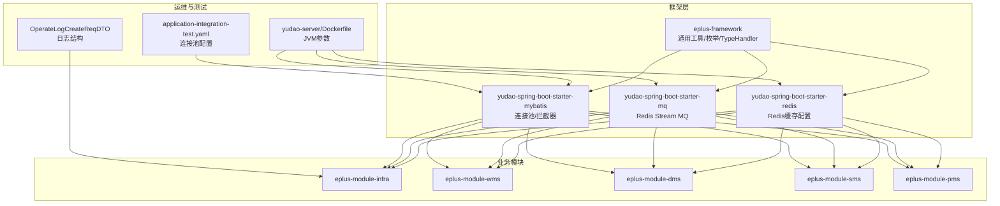
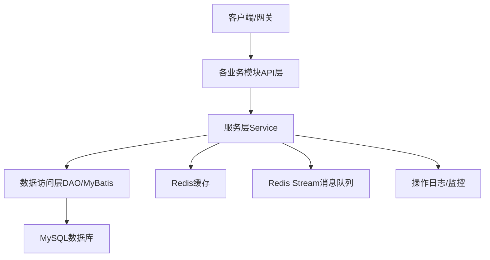
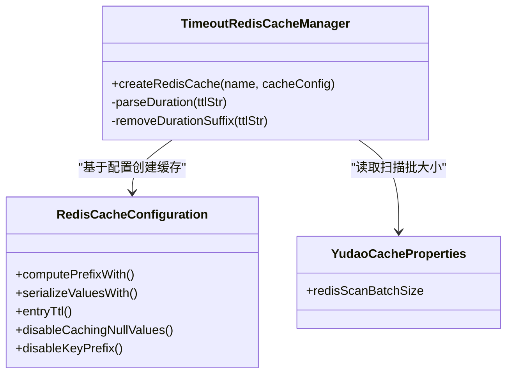
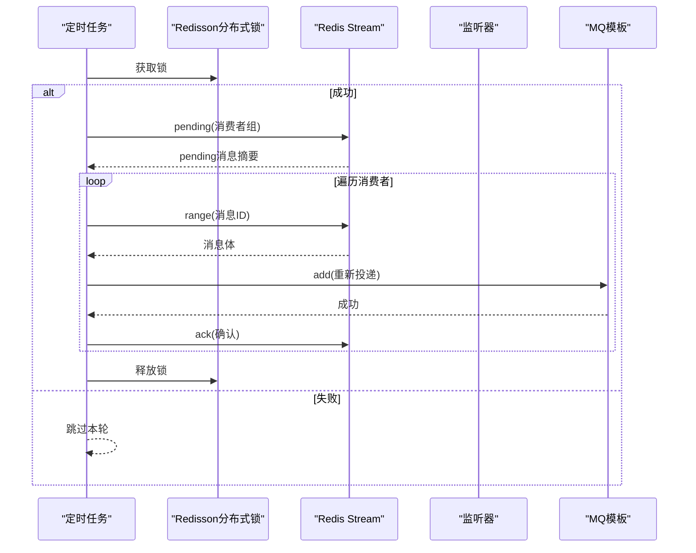
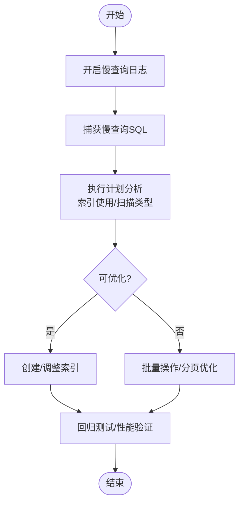
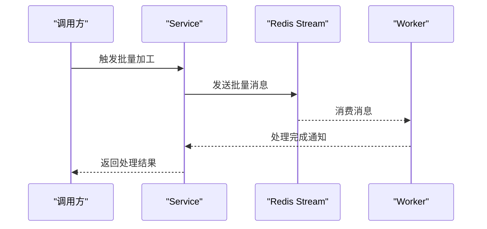
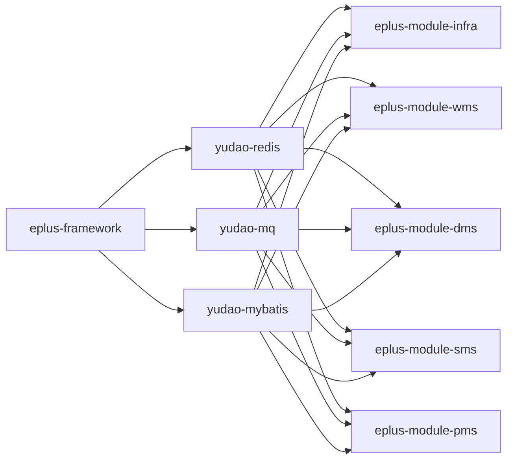

# 性能优化建议

<cite>
**本文引用的文件**
- [eplus-framework/OPTIMIZATION_PLAN.md](file://eplus-framework/OPTIMIZATION_PLAN.md)
- [eplus-framework/README.md](file://eplus-framework/README.md)
- [yudao-framework/yudao-spring-boot-starter-redis/src/main/java/cn/iocoder/yudao/framework/redis/config/YudaoCacheAutoConfiguration.java](file://yudao-framework/yudao-spring-boot-starter-redis/src/main/java/cn/iocoder/yudao/framework/redis/config/YudaoCacheAutoConfiguration.java)
- [yudao-framework/yudao-spring-boot-starter-redis/src/main/java/cn/iocoder/yudao/framework/redis/core/TimeoutRedisCacheManager.java](file://yudao-framework/yudao-spring-boot-starter-redis/src/main/java/cn/iocoder/yudao/framework/redis/core/TimeoutRedisCacheManager.java)
- [yudao-framework/yudao-spring-boot-starter-redis/src/main/java/cn/iocoder/yudao/framework/redis/config/YudaoCacheProperties.java](file://yudao-framework/yudao-spring-boot-starter-redis/src/main/java/cn/iocoder/yudao/framework/redis/config/YudaoCacheProperties.java)
- [yudao-framework/yudao-spring-boot-starter-mq/src/main/java/cn/iocoder/yudao/framework/mq/redis/core/job/RedisPendingMessageResendJob.java](file://yudao-framework/yudao-spring-boot-starter-mq/src/main/java/cn/iocoder/yudao/framework/mq/redis/core/job/RedisPendingMessageResendJob.java)
- [eplus-module-infra/eplus-module-infra-biz/src/test/java/com/syj/eplus/module/infra/service/orderlink/OrderLinkServiceImplTest.java](file://eplus-module-infra/eplus-module-infra-biz/src/test/java/com/syj/eplus/module/infra/service/orderlink/OrderLinkServiceImplTest.java)
- [eplus-module-infra/OPTIMIZATION_PLAN.md](file://eplus-module-infra/OPTIMIZATION_PLAN.md)
- [yudao-module-system/yudao-module-system-api/src/main/java/cn/iocoder/yudao/module/system/api/logger/dto/OperateLogCreateReqDTO.java](file://yudao-module-system/yudao-module-system-api/src/main/java/cn/iocoder/yudao/module/system/api/logger/dto/OperateLogCreateReqDTO.java)
- [yudao-module-system/yudao-module-system-biz/src/test-integration/resources/application-integration-test.yaml](file://yudao-module-system/yudao-module-system-biz/src/test-integration/resources/application-integration-test.yaml)
- [yudao-server/Dockerfile](file://yudao-server/Dockerfile)
- [eplus-framework/eplus-common/src/main/java/com/syj/eplus/framework/common/util/ImageUtils.java](file://eplus-framework/eplus-common/src/main/java/com/syj/eplus/framework/common/util/ImageUtils.java)
- [eplus-module-pms/eplus-module-pms-biz/src/main/java/com/syj/eplus/module/pms/service/sku/SkuServiceImpl.java](file://eplus-module-pms/eplus-module-pms-biz/src/main/java/com/syj/eplus/module/pms/service/sku/SkuServiceImpl.java)
- [eplus-module-wms/eplus-module-wms-biz/src/main/java/com/syj/eplus/module/wms/service/bill/BillServiceImpl.java](file://eplus-module-wms/eplus-module-wms-biz/src/main/java/com/syj/eplus/module/wms/service/bill/BillServiceImpl.java)
- [eplus-module-dms/eplus-module-dms-biz/src/main/java/com/syj/eplus/module/dms/convert/shipment/ShipmentConvert.java](file://eplus-module-dms/eplus-module-dms-biz/src/main/java/com/syj/eplus/module/dms/convert/shipment/ShipmentConvert.java)
- [eplus-module-sms/eplus-module-sms-biz/src/main/java/com/syj/eplus/module/sms/service/salecontract/SaleContractServiceImpl.java](file://eplus-module-sms/eplus-module-sms-biz/src/main/java/com/syj/eplus/module/sms/service/salecontract/SaleContractServiceImpl.java)
- [eplus-flyway/src/main/resources/db/migration/common/V1_0_0_001__框架初始化.sql](file://eplus-flyway/src/main/resources/db/migration/common/V1_0_0_001__框架初始化.sql)
</cite>

## 目录
1. [简介](#简介)
2. [项目结构](#项目结构)
3. [核心组件](#核心组件)
4. [架构总览](#架构总览)
5. [详细组件分析](#详细组件分析)
6. [依赖分析](#依赖分析)
7. [性能考量](#性能考量)
8. [故障排查指南](#故障排查指南)
9. [结论](#结论)
10. [附录](#附录)

## 简介
本文件面向系统性能优化，提供从缓存策略、数据库查询优化、接口响应时间优化、JVM调优与内存泄漏排查、前端性能优化到不同负载场景下的性能测试与容量规划的实用指南。文档结合仓库中已有的Redis缓存配置、消息队列重投机制、数据库连接池配置、容器化运行参数、图片压缩工具、批量操作与异步处理实践等进行深入分析，并给出可落地的优化建议与最佳实践。

## 项目结构
- 框架与基础设施：eplus-framework 提供通用工具、枚举、TypeHandler等；yudao-* 模块提供Redis、MyBatis、MQ等增强能力。
- 业务模块：按领域划分的模块（如 CRM、DMS、WMS、SMS 等），包含 API、Biz、DAL 层。
- 测试与监控：集成测试配置、操作日志结构、性能测试样例。
- 运维与容器：Dockerfile 中的JVM参数与运行时配置。

图表来源
- [eplus-framework/README.md](file://eplus-framework/README.md#L1-L200)
- [yudao-framework/yudao-spring-boot-starter-redis/src/main/java/cn/iocoder/yudao/framework/redis/config/YudaoCacheAutoConfiguration.java](file://yudao-framework/yudao-spring-boot-starter-redis/src/main/java/cn/iocoder/yudao/framework/redis/config/YudaoCacheAutoConfiguration.java#L32-L82)
- [yudao-framework/yudao-spring-boot-starter-mq/src/main/java/cn/iocoder/yudao/framework/mq/redis/core/job/RedisPendingMessageResendJob.java](file://yudao-framework/yudao-spring-boot-starter-mq/src/main/java/cn/iocoder/yudao/framework/mq/redis/core/job/RedisPendingMessageResendJob.java#L1-L101)
- [yudao-module-system/yudao-module-system-api/src/main/java/cn/iocoder/yudao/module/system/api/logger/dto/OperateLogCreateReqDTO.java](file://yudao-module-system/yudao-module-system-api/src/main/java/cn/iocoder/yudao/module/system/api/logger/dto/OperateLogCreateReqDTO.java#L72-L123)
- [yudao-module-system/yudao-module-system-biz/src/test-integration/resources/application-integration-test.yaml](file://yudao-module-system/yudao-module-system-biz/src/test-integration/resources/application-integration-test.yaml#L39-L58)
- [yudao-server/Dockerfile](file://yudao-server/Dockerfile#L1-L23)

章节来源
- [eplus-framework/README.md](file://eplus-framework/README.md#L1-L200)

## 核心组件
- Redis缓存配置与管理
  - 自动配置：默认缓存配置、JSON序列化、TTL、空值缓存开关、Key前缀策略。
  - 自定义过期时间：通过“缓存名#ttl”语法动态设置过期时间。
  - 批量扫描大小：通过配置项控制SCAN批大小，平衡CPU与内存。
- 消息队列（Redis Stream）重投机制
  - 定时任务扫描消费者pending队列，对超时未确认消息进行重投，保障可靠性。
- 数据库连接池与监控
  - 连接池参数：最小空闲、最大空闲、最小生存时间、最大生存时间、校验语句、空闲检测。
- 图片压缩与懒加载
  - 图片压缩工具：支持尺寸、质量、格式校验与压缩流程日志。
  - 业务侧懒加载：按需生成缩略图，避免冗余处理。
- 批量操作与异步处理
  - 批量删除/更新：通过批量接口减少往返次数。
  - 异步调用：跨模块批量加工触发，降低同步等待。

章节来源
- [yudao-framework/yudao-spring-boot-starter-redis/src/main/java/cn/iocoder/yudao/framework/redis/config/YudaoCacheAutoConfiguration.java](file://yudao-framework/yudao-spring-boot-starter-redis/src/main/java/cn/iocoder/yudao/framework/redis/config/YudaoCacheAutoConfiguration.java#L32-L82)
- [yudao-framework/yudao-spring-boot-starter-redis/src/main/java/cn/iocoder/yudao/framework/redis/core/TimeoutRedisCacheManager.java](file://yudao-framework/yudao-spring-boot-starter-redis/src/main/java/cn/iocoder/yudao/framework/redis/core/TimeoutRedisCacheManager.java#L1-L84)
- [yudao-framework/yudao-spring-boot-starter-redis/src/main/java/cn/iocoder/yudao/framework/redis/config/YudaoCacheProperties.java](file://yudao-framework/yudao-spring-boot-starter-redis/src/main/java/cn/iocoder/yudao/framework/redis/config/YudaoCacheProperties.java#L1-L28)
- [yudao-framework/yudao-spring-boot-starter-mq/src/main/java/cn/iocoder/yudao/framework/mq/redis/core/job/RedisPendingMessageResendJob.java](file://yudao-framework/yudao-spring-boot-starter-mq/src/main/java/cn/iocoder/yudao/framework/mq/redis/core/job/RedisPendingMessageResendJob.java#L1-L101)
- [yudao-module-system/yudao-module-system-biz/src/test-integration/resources/application-integration-test.yaml](file://yudao-module-system/yudao-module-system-biz/src/test-integration/resources/application-integration-test.yaml#L39-L58)
- [eplus-framework/eplus-common/src/main/java/com/syj/eplus/framework/common/util/ImageUtils.java](file://eplus-framework/eplus-common/src/main/java/com/syj/eplus/framework/common/util/ImageUtils.java#L76-L352)
- [eplus-module-pms/eplus-module-pms-biz/src/main/java/com/syj/eplus/module/pms/service/sku/SkuServiceImpl.java](file://eplus-module-pms/eplus-module-pms-biz/src/main/java/com/syj/eplus/module/pms/service/sku/SkuServiceImpl.java#L187-L211)
- [eplus-module-wms/eplus-module-wms-biz/src/main/java/com/syj/eplus/module/wms/service/bill/BillServiceImpl.java](file://eplus-module-wms/eplus-module-wms-biz/src/main/java/com/syj/eplus/module/wms/service/bill/BillServiceImpl.java#L986-L1012)
- [eplus-module-dms/eplus-module-dms-biz/src/main/java/com/syj/eplus/module/dms/convert/shipment/ShipmentConvert.java](file://eplus-module-dms/eplus-module-dms-biz/src/main/java/com/syj/eplus/module/dms/convert/shipment/ShipmentConvert.java#L367-L385)
- [eplus-module-sms/eplus-module-sms-biz/src/main/java/com/syj/eplus/module/sms/service/salecontract/SaleContractServiceImpl.java](file://eplus-module-sms/eplus-module-sms-biz/src/main/java/com/syj/eplus/module/sms/service/salecontract/SaleContractServiceImpl.java#L1242-L1258)

## 架构总览
系统采用“框架层 + 业务模块 + 运维测试”的分层架构。框架层提供通用工具与基础设施（缓存、消息、MyBatis增强），业务模块围绕领域模型构建API与服务，测试与监控贯穿开发与运维阶段。

图表来源
- [eplus-framework/README.md](file://eplus-framework/README.md#L1-L200)
- [yudao-framework/yudao-spring-boot-starter-redis/src/main/java/cn/iocoder/yudao/framework/redis/config/YudaoCacheAutoConfiguration.java](file://yudao-framework/yudao-spring-boot-starter-redis/src/main/java/cn/iocoder/yudao/framework/redis/config/YudaoCacheAutoConfiguration.java#L32-L82)
- [yudao-framework/yudao-spring-boot-starter-mq/src/main/java/cn/iocoder/yudao/framework/mq/redis/core/job/RedisPendingMessageResendJob.java](file://yudao-framework/yudao-spring-boot-starter-mq/src/main/java/cn/iocoder/yudao/framework/mq/redis/core/job/RedisPendingMessageResendJob.java#L1-L101)
- [yudao-module-system/yudao-module-system-api/src/main/java/cn/iocoder/yudao/module/system/api/logger/dto/OperateLogCreateReqDTO.java](file://yudao-module-system/yudao-module-system-api/src/main/java/cn/iocoder/yudao/module/system/api/logger/dto/OperateLogCreateReqDTO.java#L72-L123)

## 详细组件分析

### 缓存策略与Redis配置
- 默认缓存配置
  - Key前缀策略：统一使用冒号分隔，避免工具显示问题。
  - JSON序列化：统一使用JSON序列化器，确保跨语言/工具兼容。
  - TTL与空值缓存：支持全局TTL、禁用空值缓存、禁用Key前缀。
- 自定义过期时间
  - 通过“缓存名#ttl”语法动态设置过期时间，支持单位：天(d)、小时(h)、分钟(m)、秒(s)。
- 批量扫描
  - 通过配置项控制SCAN批大小，平衡CPU与内存占用，适合大规模Key场景。

图表来源
- [yudao-framework/yudao-spring-boot-starter-redis/src/main/java/cn/iocoder/yudao/framework/redis/config/YudaoCacheAutoConfiguration.java](file://yudao-framework/yudao-spring-boot-starter-redis/src/main/java/cn/iocoder/yudao/framework/redis/config/YudaoCacheAutoConfiguration.java#L32-L82)
- [yudao-framework/yudao-spring-boot-starter-redis/src/main/java/cn/iocoder/yudao/framework/redis/core/TimeoutRedisCacheManager.java](file://yudao-framework/yudao-spring-boot-starter-redis/src/main/java/cn/iocoder/yudao/framework/redis/core/TimeoutRedisCacheManager.java#L1-L84)
- [yudao-framework/yudao-spring-boot-starter-redis/src/main/java/cn/iocoder/yudao/framework/redis/config/YudaoCacheProperties.java](file://yudao-framework/yudao-spring-boot-starter-redis/src/main/java/cn/iocoder/yudao/framework/redis/config/YudaoCacheProperties.java#L1-L28)

章节来源
- [yudao-framework/yudao-spring-boot-starter-redis/src/main/java/cn/iocoder/yudao/framework/redis/config/YudaoCacheAutoConfiguration.java](file://yudao-framework/yudao-spring-boot-starter-redis/src/main/java/cn/iocoder/yudao/framework/redis/config/YudaoCacheAutoConfiguration.java#L32-L82)
- [yudao-framework/yudao-spring-boot-starter-redis/src/main/java/cn/iocoder/yudao/framework/redis/core/TimeoutRedisCacheManager.java](file://yudao-framework/yudao-spring-boot-starter-redis/src/main/java/cn/iocoder/yudao/framework/redis/core/TimeoutRedisCacheManager.java#L1-L84)
- [yudao-framework/yudao-spring-boot-starter-redis/src/main/java/cn/iocoder/yudao/framework/redis/config/YudaoCacheProperties.java](file://yudao-framework/yudao-spring-boot-starter-redis/src/main/java/cn/iocoder/yudao/framework/redis/config/YudaoCacheProperties.java#L1-L28)

### 消息队列重投机制（Redis Stream）
- 定时任务扫描消费者pending队列，识别超时未确认消息（默认5分钟）。
- 加分布式锁避免并发冲突，逐条重新投递并ack。
- 适用于消费者崩溃或长时间处理导致的消息积压。

图表来源
- [yudao-framework/yudao-spring-boot-starter-mq/src/main/java/cn/iocoder/yudao/framework/mq/redis/core/job/RedisPendingMessageResendJob.java](file://yudao-framework/yudao-spring-boot-starter-mq/src/main/java/cn/iocoder/yudao/framework/mq/redis/core/job/RedisPendingMessageResendJob.java#L1-L101)

章节来源
- [yudao-framework/yudao-spring-boot-starter-mq/src/main/java/cn/iocoder/yudao/framework/mq/redis/core/job/RedisPendingMessageResendJob.java](file://yudao-framework/yudao-spring-boot-starter-mq/src/main/java/cn/iocoder/yudao/framework/mq/redis/core/job/RedisPendingMessageResendJob.java#L1-L101)

### 数据库连接池与慢查询分析
- 连接池参数
  - 最小空闲、最大空闲、最小/最大生存时间、校验语句、空闲检测开关。
- 慢查询分析与执行计划
  - 建议开启慢查询日志，定位耗时SQL；结合执行计划（EXPLAIN/EXPLAIN ANALYZE）分析索引使用情况与扫描类型。
  - 针对高频查询建立合适索引，避免全表扫描；对批量操作使用批量插入/更新。
- 测试与验证
  - 单元测试中记录查询耗时，设定阈值（如100ms），发现异常及时告警。

图表来源
- [yudao-module-system/yudao-module-system-biz/src/test-integration/resources/application-integration-test.yaml](file://yudao-module-system/yudao-module-system-biz/src/test-integration/resources/application-integration-test.yaml#L39-L58)
- [eplus-module-infra/eplus-module-infra-biz/src/test/java/com/syj/eplus/module/infra/service/orderlink/OrderLinkServiceImplTest.java](file://eplus-module-infra/eplus-module-infra-biz/src/test/java/com/syj/eplus/module/infra/service/orderlink/OrderLinkServiceImplTest.java#L124-L153)

章节来源
- [yudao-module-system/yudao-module-system-biz/src/test-integration/resources/application-integration-test.yaml](file://yudao-module-system/yudao-module-system-biz/src/test-integration/resources/application-integration-test.yaml#L39-L58)
- [eplus-module-infra/eplus-module-infra-biz/src/test/java/com/syj/eplus/module/infra/service/orderlink/OrderLinkServiceImplTest.java](file://eplus-module-infra/eplus-module-infra-biz/src/test/java/com/syj/eplus/module/infra/service/orderlink/OrderLinkServiceImplTest.java#L124-L153)

### 接口响应时间优化模式
- 异步处理
  - 跨模块批量加工触发，降低同步等待时间。
- 批量操作
  - 批量删除/更新减少网络往返与事务开销。
- 懒加载与按需处理
  - 仅在需要时生成缩略图，避免不必要的图片处理。

图表来源
- [eplus-module-sms/eplus-module-sms-biz/src/main/java/com/syj/eplus/module/sms/service/salecontract/SaleContractServiceImpl.java](file://eplus-module-sms/eplus-module-sms-biz/src/main/java/com/syj/eplus/module/sms/service/salecontract/SaleContractServiceImpl.java#L1242-L1258)
- [eplus-module-wms/eplus-module-wms-biz/src/main/java/com/syj/eplus/module/wms/service/bill/BillServiceImpl.java](file://eplus-module-wms/eplus-module-wms-biz/src/main/java/com/syj/eplus/module/wms/service/bill/BillServiceImpl.java#L986-L1012)
- [eplus-module-dms/eplus-module-dms-biz/src/main/java/com/syj/eplus/module/dms/convert/shipment/ShipmentConvert.java](file://eplus-module-dms/eplus-module-dms-biz/src/main/java/com/syj/eplus/module/dms/convert/shipment/ShipmentConvert.java#L367-L385)

章节来源
- [eplus-module-sms/eplus-module-sms-biz/src/main/java/com/syj/eplus/module/sms/service/salecontract/SaleContractServiceImpl.java](file://eplus-module-sms/eplus-module-sms-biz/src/main/java/com/syj/eplus/module/sms/service/salecontract/SaleContractServiceImpl.java#L1242-L1258)
- [eplus-module-wms/eplus-module-wms-biz/src/main/java/com/syj/eplus/module/wms/service/bill/BillServiceImpl.java](file://eplus-module-wms/eplus-module-wms-biz/src/main/java/com/syj/eplus/module/wms/service/bill/BillServiceImpl.java#L986-L1012)
- [eplus-module-dms/eplus-module-dms-biz/src/main/java/com/syj/eplus/module/dms/convert/shipment/ShipmentConvert.java](file://eplus-module-dms/eplus-module-dms-biz/src/main/java/com/syj/eplus/module/dms/convert/shipment/ShipmentConvert.java#L367-L385)

### 前端性能优化建议
- 资源压缩与懒加载
  - 图片压缩：在服务端对图片进行压缩与格式转换，降低带宽与渲染压力。
  - 懒加载：仅在需要时加载资源，减少首屏负担。
- 代码层面的优化
  - 使用统一的图片处理工具，确保参数校验与日志记录，避免无效处理。

章节来源
- [eplus-framework/eplus-common/src/main/java/com/syj/eplus/framework/common/util/ImageUtils.java](file://eplus-framework/eplus-common/src/main/java/com/syj/eplus/framework/common/util/ImageUtils.java#L76-L352)
- [eplus-module-pms/eplus-module-pms-biz/src/main/java/com/syj/eplus/module/pms/service/sku/SkuServiceImpl.java](file://eplus-module-pms/eplus-module-pms-biz/src/main/java/com/syj/eplus/module/pms/service/sku/SkuServiceImpl.java#L187-L211)

### JVM调优参数与内存泄漏排查
- 容器化运行参数
  - 通过环境变量设置JVM堆大小与安全熵源，确保容器运行稳定性。
- JVM调优建议
  - 堆大小：根据业务峰值与GC行为调整-Xms/-Xmx，避免频繁扩容。
  - GC策略：结合应用特征选择合适的GC算法，关注Full GC频率与停顿时间。
  - 监控指标：堆使用率、GC时间、线程数、阻塞队列长度。
- 内存泄漏排查
  - 使用内存分析工具（如Heap Dump + 分析器）定位异常增长的对象与引用链。
  - 关注静态集合、线程池、缓存、日志与第三方库的潜在泄漏点。

章节来源
- [yudao-server/Dockerfile](file://yudao-server/Dockerfile#L1-L23)

## 依赖分析
- 框架与业务模块的耦合
  - 框架层提供通用工具与基础设施，业务模块通过依赖注入使用缓存、消息、MyBatis增强。
- 外部依赖与集成点
  - Redis：缓存与消息队列。
  - MySQL：持久化存储，配合连接池与索引优化。
  - 日志与监控：操作日志结构化，便于性能追踪与问题定位。

图表来源
- [eplus-framework/README.md](file://eplus-framework/README.md#L1-L200)

章节来源
- [eplus-framework/README.md](file://eplus-framework/README.md#L1-L200)

## 性能考量
- 缓存命中率与热点数据
  - 通过“缓存名#ttl”灵活设置过期时间，结合热点数据预热与淘汰策略提升命中率。
- 数据库查询优化
  - 建立复合索引，避免SELECT *，使用LIMIT与分页；批量写入减少事务开销。
- 接口响应时间
  - 异步化高频操作，批量处理减少往返；懒加载与压缩降低前端压力。
- JVM与容器
  - 合理设置JVM参数，监控GC与堆使用；容器内资源限制与健康检查保障稳定性。

## 故障排查指南
- 操作日志结构
  - 结构化记录请求开始时间、结束时间、执行时长、结果码与提示，便于定位慢请求。
- 性能测试与阈值
  - 单元测试中记录查询耗时，设定阈值（如100ms），发现异常及时告警。
- 缓存与消息
  - 检查Redis键前缀、TTL、空值缓存策略；确认消息队列pending队列是否堆积，重投任务是否正常执行。

章节来源
- [yudao-module-system/yudao-module-system-api/src/main/java/cn/iocoder/yudao/module/system/api/logger/dto/OperateLogCreateReqDTO.java](file://yudao-module-system/yudao-module-system-api/src/main/java/cn/iocoder/yudao/module/system/api/logger/dto/OperateLogCreateReqDTO.java#L72-L123)
- [eplus-module-infra/eplus-module-infra-biz/src/test/java/com/syj/eplus/module/infra/service/orderlink/OrderLinkServiceImplTest.java](file://eplus-module-infra/eplus-module-infra-biz/src/test/java/com/syj/eplus/module/infra/service/orderlink/OrderLinkServiceImplTest.java#L124-L153)
- [yudao-framework/yudao-spring-boot-starter-mq/src/main/java/cn/iocoder/yudao/framework/mq/redis/core/job/RedisPendingMessageResendJob.java](file://yudao-framework/yudao-spring-boot-starter-mq/src/main/java/cn/iocoder/yudao/framework/mq/redis/core/job/RedisPendingMessageResendJob.java#L1-L101)

## 结论
通过Redis缓存与消息队列的合理配置、数据库查询与连接池的优化、接口异步化与批量处理、前端资源压缩与懒加载，以及JVM与容器化运行参数的调优，可以在不同负载场景下显著提升系统性能与稳定性。建议持续以测试驱动优化，结合操作日志与监控指标，形成闭环的性能治理流程。

## 附录
- 数据库初始化脚本
  - 包含操作日志表结构，可用于记录请求耗时与结果，辅助性能分析。

章节来源
- [eplus-flyway/src/main/resources/db/migration/common/V1_0_0_001__框架初始化.sql](file://eplus-flyway/src/main/resources/db/migration/common/V1_0_0_001__框架初始化.sql#L2693-L2703)