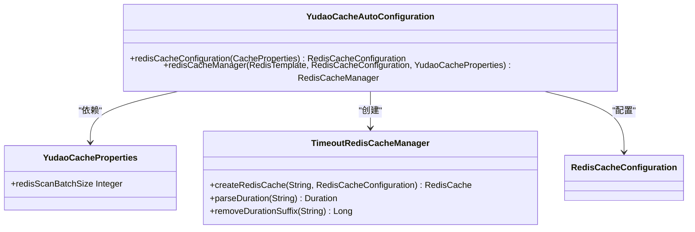
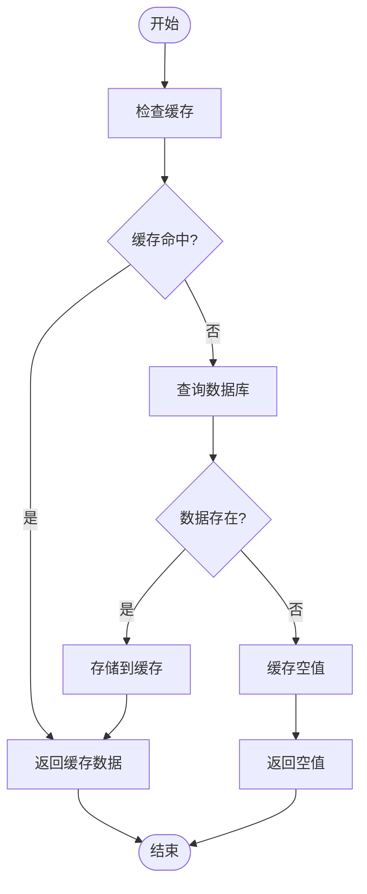
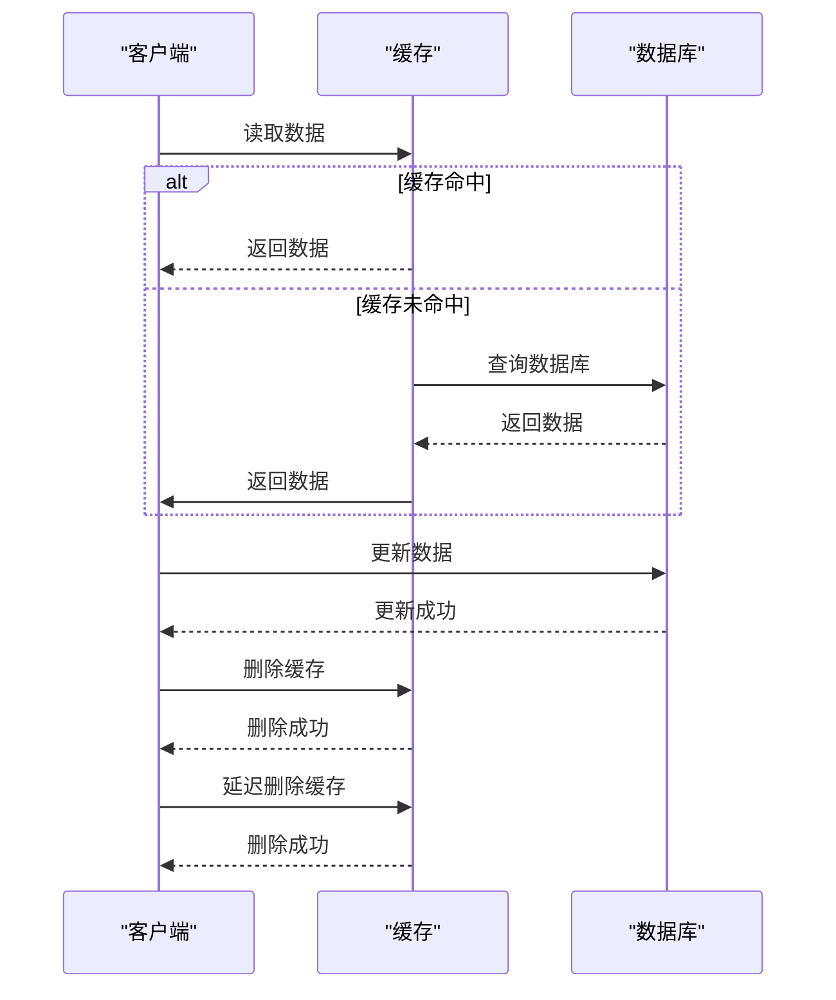
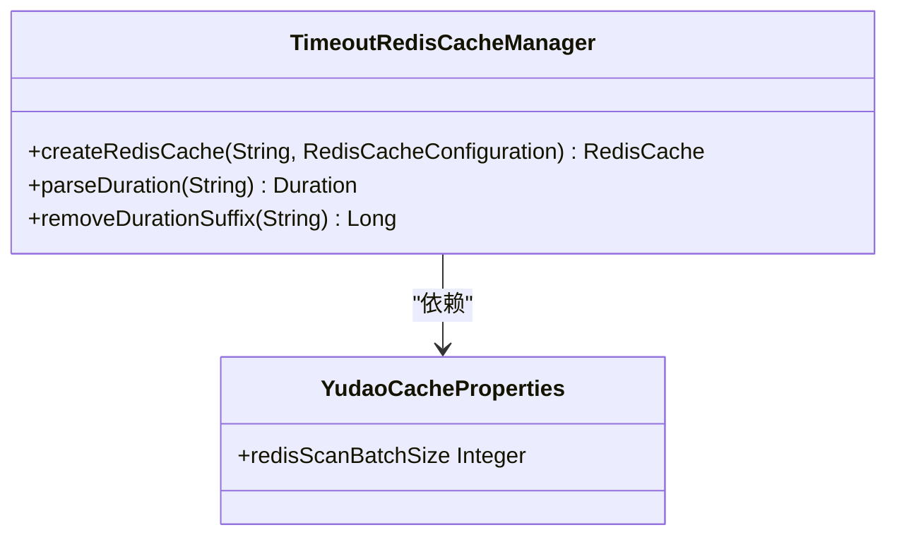
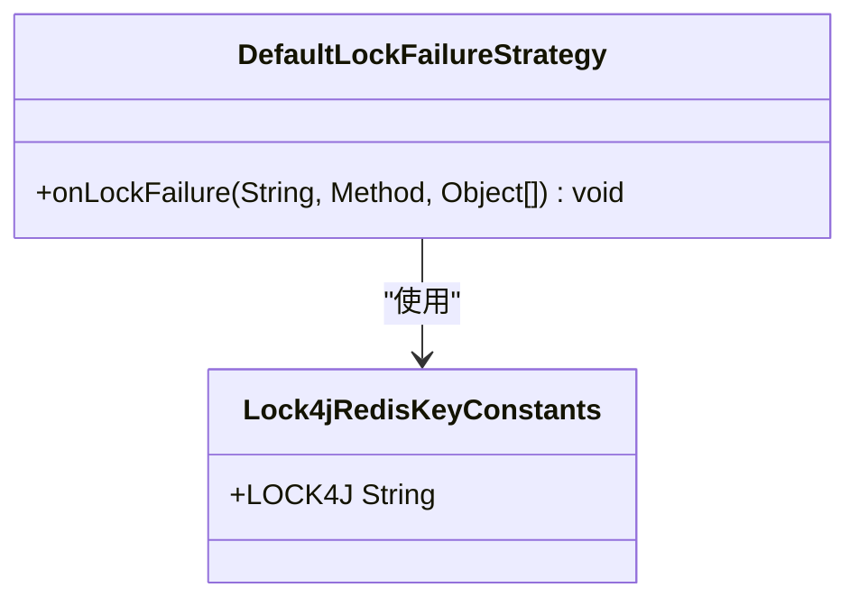
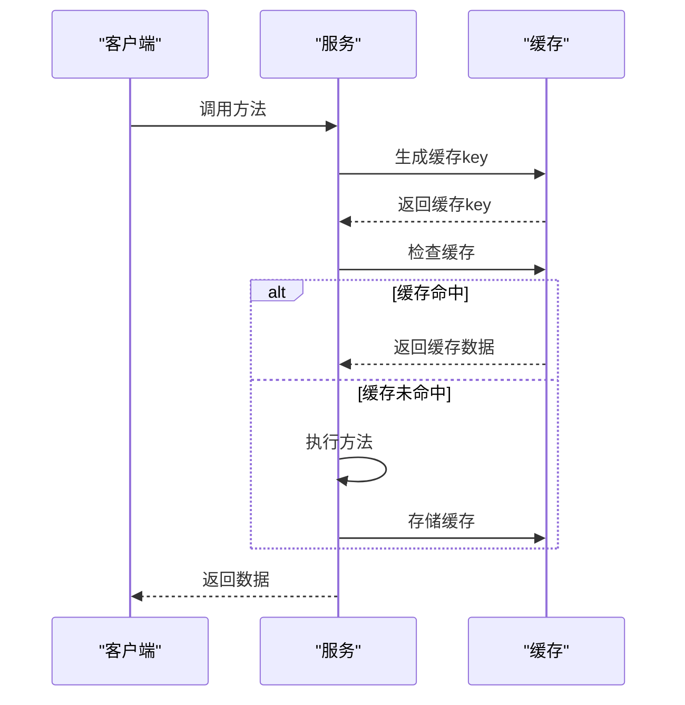

# 缓存优化

<cite>
**本文档引用的文件**   
- [YudaoCacheAutoConfiguration.java](file://yudao-framework/yudao-spring-boot-starter-redis/src/main/java/cn/iocoder/yudao/framework/redis/config/YudaoCacheAutoConfiguration.java)
- [TimeoutRedisCacheManager.java](file://yudao-framework/yudao-spring-boot-starter-redis/src/main/java/cn/iocoder/yudao/framework/redis/core/TimeoutRedisCacheManager.java)
- [YudaoCacheProperties.java](file://yudao-framework/yudao-spring-boot-starter-redis/src/main/java/cn/iocoder/yudao/framework/redis/config/YudaoCacheProperties.java)
- [CacheUtils.java](file://yudao-framework/yudao-common/src/main/java/cn/iocoder/yudao/framework/common/util/cache/CacheUtils.java)
- [Lock4jRedisKeyConstants.java](file://yudao-framework/yudao-spring-boot-starter-protection/src/main/java/cn/iocoder/yudao/framework/lock4j/core/Lock4jRedisKeyConstants.java)
- [DefaultLockFailureStrategy.java](file://yudao-framework/yudao-spring-boot-starter-protection/src/main/java/cn/iocoder/yudao/framework/lock4j/core/DefaultLockFailureStrategy.java)
- [CodeGeneratorApiImpl.java](file://eplus-module-infra/eplus-module-infra-biz/src/main/java/com/syj/eplus/module/infra/api/code/CodeGeneratorApiImpl.java)
- [OPTIMIZATION_PLAN.md](file://eplus-module-infra/OPTIMIZATION_PLAN.md)
</cite>

## 目录
1. [简介](#简介)
2. [缓存配置与使用策略](#缓存配置与使用策略)
3. [缓存问题解决方案](#缓存问题解决方案)
4. [缓存数据一致性保证机制](#缓存数据一致性保证机制)
5. [缓存失效策略和过期时间设置](#缓存失效策略和过期时间设置)
6. [分布式锁在缓存更新中的应用](#分布式锁在缓存更新中的应用)
7. [缓存注解使用与自定义缓存key生成](#缓存注解使用与自定义缓存key生成)
8. [结论](#结论)

## 简介
本文档详细说明了基于Redis的缓存优化策略，包括缓存配置、使用策略以及常见缓存问题（缓存穿透、缓存击穿、缓存雪崩）的解决方案。文档还介绍了缓存数据一致性保证机制，如双写一致性和延迟双删模式，以及缓存失效策略和过期时间设置的最佳实践。此外，文档涵盖了分布式锁在缓存更新中的应用，并提供了实际代码示例展示缓存注解的使用方法和自定义缓存key生成策略。

**本文档引用的文件**   
- [YudaoCacheAutoConfiguration.java](file://yudao-framework/yudao-spring-boot-starter-redis/src/main/java/cn/iocoder/yudao/framework/redis/config/YudaoCacheAutoConfiguration.java)
- [TimeoutRedisCacheManager.java](file://yudao-framework/yudao-spring-boot-starter-redis/src/main/java/cn/iocoder/yudao/framework/redis/core/TimeoutRedisCacheManager.java)
- [YudaoCacheProperties.java](file://yudao-framework/yudao-spring-boot-starter-redis/src/main/java/cn/iocoder/yudao/framework/redis/config/YudaoCacheProperties.java)
- [CacheUtils.java](file://yudao-framework/yudao-common/src/main/java/cn/iocoder/yudao/framework/common/util/cache/CacheUtils.java)
- [Lock4jRedisKeyConstants.java](file://yudao-framework/yudao-spring-boot-starter-protection/src/main/java/cn/iocoder/yudao/framework/lock4j/core/Lock4jRedisKeyConstants.java)
- [DefaultLockFailureStrategy.java](file://yudao-framework/yudao-spring-boot-starter-protection/src/main/java/cn/iocoder/yudao/framework/lock4j/core/DefaultLockFailureStrategy.java)
- [CodeGeneratorApiImpl.java](file://eplus-module-infra/eplus-module-infra-biz/src/main/java/com/syj/eplus/module/infra/api/code/CodeGeneratorApiImpl.java)
- [OPTIMIZATION_PLAN.md](file://eplus-module-infra/OPTIMIZATION_PLAN.md)

## 缓存配置与使用策略
在本项目中，Redis缓存的配置通过`YudaoCacheAutoConfiguration`类实现。该类配置了`RedisCacheConfiguration` Bean，设置了使用单冒号（:）作为键前缀分隔符，避免了Redis Desktop Manager中的多余空格问题。此外，配置中使用JSON序列化方式对缓存值进行序列化，确保了数据的一致性和可读性。

**图源**
- [YudaoCacheAutoConfiguration.java](file://yudao-framework/yudao-spring-boot-starter-redis/src/main/java/cn/iocoder/yudao/framework/redis/config/YudaoCacheAutoConfiguration.java)
- [YudaoCacheProperties.java](file://yudao-framework/yudao-spring-boot-starter-redis/src/main/java/cn/iocoder/yudao/framework/redis/config/YudaoCacheProperties.java)
- [TimeoutRedisCacheManager.java](file://yudao-framework/yudao-spring-boot-starter-redis/src/main/java/cn/iocoder/yudao/framework/redis/core/TimeoutRedisCacheManager.java)

**本节源码**
- [YudaoCacheAutoConfiguration.java](file://yudao-framework/yudao-spring-boot-starter-redis/src/main/java/cn/iocoder/yudao/framework/redis/config/YudaoCacheAutoConfiguration.java#L32-L68)
- [YudaoCacheProperties.java](file://yudao-framework/yudao-spring-boot-starter-redis/src/main/java/cn/iocoder/yudao/framework/redis/config/YudaoCacheProperties.java#L1-L27)

## 缓存问题解决方案
### 缓存穿透
缓存穿透是指查询一个不存在的数据，由于缓存中没有，请求会直接打到数据库，导致数据库压力增大。解决方案包括使用布隆过滤器或缓存空值。

### 缓存击穿
缓存击穿是指某个热点数据在缓存过期的瞬间，大量请求同时访问数据库，导致数据库压力骤增。解决方案包括使用互斥锁或永不过期策略。

### 缓存雪崩
缓存雪崩是指大量缓存数据在同一时间过期，导致大量请求直接访问数据库。解决方案包括设置不同的过期时间或使用缓存预热。

**图源**
- [YudaoCacheAutoConfiguration.java](file://yudao-framework/yudao-spring-boot-starter-redis/src/main/java/cn/iocoder/yudao/framework/redis/config/YudaoCacheAutoConfiguration.java)
- [TimeoutRedisCacheManager.java](file://yudao-framework/yudao-spring-boot-starter-redis/src/main/java/cn/iocoder/yudao/framework/redis/core/TimeoutRedisCacheManager.java)

**本节源码**
- [YudaoCacheAutoConfiguration.java](file://yudao-framework/yudao-spring-boot-starter-redis/src/main/java/cn/iocoder/yudao/framework/redis/config/YudaoCacheAutoConfiguration.java#L32-L68)
- [TimeoutRedisCacheManager.java](file://yudao-framework/yudao-spring-boot-starter-redis/src/main/java/cn/iocoder/yudao/framework/redis/core/TimeoutRedisCacheManager.java#L29-L49)

## 缓存数据一致性保证机制
### 双写一致性
双写一致性是指在更新数据库的同时更新缓存，确保数据的一致性。可以通过事务或消息队列来实现。

### 延迟双删
延迟双删是指在更新数据库后，先删除缓存，然后延迟一段时间再次删除缓存，以防止在更新数据库和删除缓存之间有其他请求读取到旧数据。

**图源**
- [YudaoCacheAutoConfiguration.java](file://yudao-framework/yudao-spring-boot-starter-redis/src/main/java/cn/iocoder/yudao/framework/redis/config/YudaoCacheAutoConfiguration.java)
- [TimeoutRedisCacheManager.java](file://yudao-framework/yudao-spring-boot-starter-redis/src/main/java/cn/iocoder/yudao/framework/redis/core/TimeoutRedisCacheManager.java)

**本节源码**
- [YudaoCacheAutoConfiguration.java](file://yudao-framework/yudao-spring-boot-starter-redis/src/main/java/cn/iocoder/yudao/framework/redis/config/YudaoCacheAutoConfiguration.java#L32-L68)
- [TimeoutRedisCacheManager.java](file://yudao-framework/yudao-spring-boot-starter-redis/src/main/java/cn/iocoder/yudao/framework/redis/core/TimeoutRedisCacheManager.java#L29-L49)

## 缓存失效策略和过期时间设置
### 缓存失效策略
缓存失效策略包括主动失效和被动失效。主动失效是指在数据更新时主动删除缓存，被动失效是指缓存过期后自动失效。

### 过期时间设置
过期时间设置应根据数据的访问频率和重要性来决定。对于热点数据，可以设置较长的过期时间，对于冷数据，可以设置较短的过期时间。

**图源**
- [TimeoutRedisCacheManager.java](file://yudao-framework/yudao-spring-boot-starter-redis/src/main/java/cn/iocoder/yudao/framework/redis/core/TimeoutRedisCacheManager.java)
- [YudaoCacheProperties.java](file://yudao-framework/yudao-spring-boot-starter-redis/src/main/java/cn/iocoder/yudao/framework/redis/config/YudaoCacheProperties.java)

**本节源码**
- [TimeoutRedisCacheManager.java](file://yudao-framework/yudao-spring-boot-starter-redis/src/main/java/cn/iocoder/yudao/framework/redis/core/TimeoutRedisCacheManager.java#L29-L49)
- [YudaoCacheProperties.java](file://yudao-framework/yudao-spring-boot-starter-redis/src/main/java/cn/iocoder/yudao/framework/redis/config/YudaoCacheProperties.java#L1-L27)

## 分布式锁在缓存更新中的应用
分布式锁用于在分布式环境中确保同一时间只有一个节点可以执行某个操作。在缓存更新中，分布式锁可以防止多个节点同时更新缓存，导致数据不一致。

**图源**
- [DefaultLockFailureStrategy.java](file://yudao-framework/yudao-spring-boot-starter-protection/src/main/java/cn/iocoder/yudao/framework/lock4j/core/DefaultLockFailureStrategy.java)
- [Lock4jRedisKeyConstants.java](file://yudao-framework/yudao-spring-boot-starter-protection/src/main/java/cn/iocoder/yudao/framework/lock4j/core/Lock4jRedisKeyConstants.java)

**本节源码**
- [DefaultLockFailureStrategy.java](file://yudao-framework/yudao-spring-boot-starter-protection/src/main/java/cn/iocoder/yudao/framework/lock4j/core/DefaultLockFailureStrategy.java#L1-L21)
- [Lock4jRedisKeyConstants.java](file://yudao-framework/yudao-spring-boot-starter-protection/src/main/java/cn/iocoder/yudao/framework/lock4j/core/Lock4jRedisKeyConstants.java#L1-L19)

## 缓存注解使用与自定义缓存key生成
### 缓存注解使用
通过`@Cacheable`注解可以方便地实现缓存功能。在`Cacheable`注解中，可以通过`cacheNames`属性指定缓存名称，并使用`#`分隔符指定过期时间。

### 自定义缓存key生成
自定义缓存key生成策略可以通过实现`KeyGenerator`接口来实现。在本项目中，`CodeGeneratorApiImpl`类使用了自定义的缓存key生成策略。

**图源**
- [CodeGeneratorApiImpl.java](file://eplus-module-infra/eplus-module-infra-biz/src/main/java/com/syj/eplus/module/infra/api/code/CodeGeneratorApiImpl.java)
- [YudaoCacheAutoConfiguration.java](file://yudao-framework/yudao-spring-boot-starter-redis/src/main/java/cn/iocoder/yudao/framework/redis/config/YudaoCacheAutoConfiguration.java)

**本节源码**
- [CodeGeneratorApiImpl.java](file://eplus-module-infra/eplus-module-infra-biz/src/main/java/com/syj/eplus/module/infra/api/code/CodeGeneratorApiImpl.java#L34-L59)
- [YudaoCacheAutoConfiguration.java](file://yudao-framework/yudao-spring-boot-starter-redis/src/main/java/cn/iocoder/yudao/framework/redis/config/YudaoCacheAutoConfiguration.java#L32-L68)

## 结论
本文档详细介绍了基于Redis的缓存优化策略，包括缓存配置、使用策略、常见问题解决方案、数据一致性保证机制、失效策略、过期时间设置、分布式锁应用以及缓存注解和自定义缓存key生成。通过这些策略，可以有效提升系统的性能和稳定性。

**本文档引用的文件**   
- [YudaoCacheAutoConfiguration.java](file://yudao-framework/yudao-spring-boot-starter-redis/src/main/java/cn/iocoder/yudao/framework/redis/config/YudaoCacheAutoConfiguration.java)
- [TimeoutRedisCacheManager.java](file://yudao-framework/yudao-spring-boot-starter-redis/src/main/java/cn/iocoder/yudao/framework/redis/core/TimeoutRedisCacheManager.java)
- [YudaoCacheProperties.java](file://yudao-framework/yudao-spring-boot-starter-redis/src/main/java/cn/iocoder/yudao/framework/redis/config/YudaoCacheProperties.java)
- [CacheUtils.java](file://yudao-framework/yudao-common/src/main/java/cn/iocoder/yudao/framework/common/util/cache/CacheUtils.java)
- [Lock4jRedisKeyConstants.java](file://yudao-framework/yudao-spring-boot-starter-protection/src/main/java/cn/iocoder/yudao/framework/lock4j/core/Lock4jRedisKeyConstants.java)
- [DefaultLockFailureStrategy.java](file://yudao-framework/yudao-spring-boot-starter-protection/src/main/java/cn/iocoder/yudao/framework/lock4j/core/DefaultLockFailureStrategy.java)
- [CodeGeneratorApiImpl.java](file://eplus-module-infra/eplus-module-infra-biz/src/main/java/com/syj/eplus/module/infra/api/code/CodeGeneratorApiImpl.java)
- [OPTIMIZATION_PLAN.md](file://eplus-module-infra/OPTIMIZATION_PLAN.md)