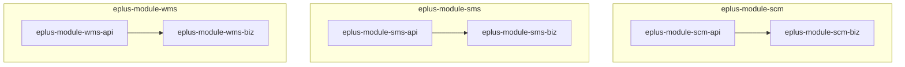
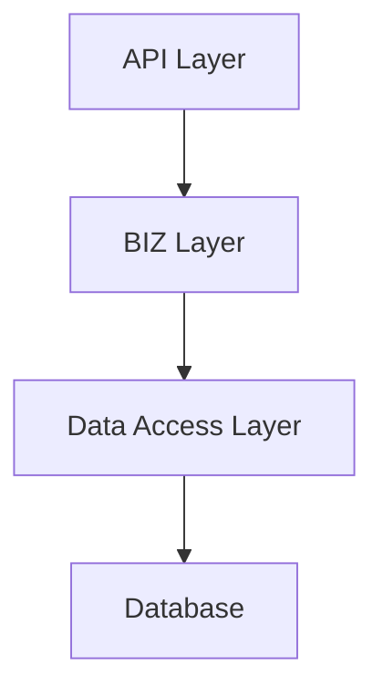
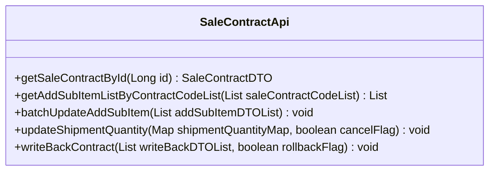
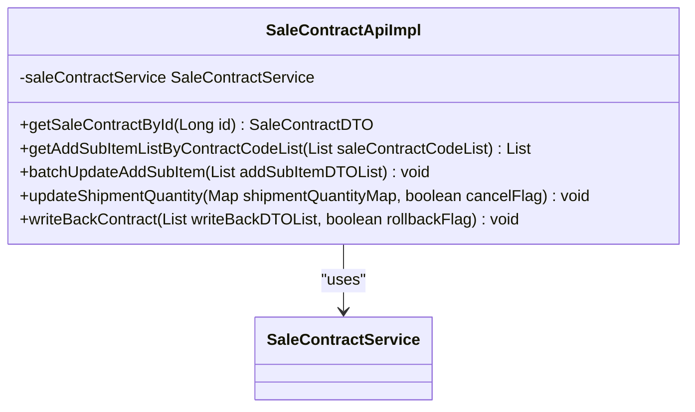
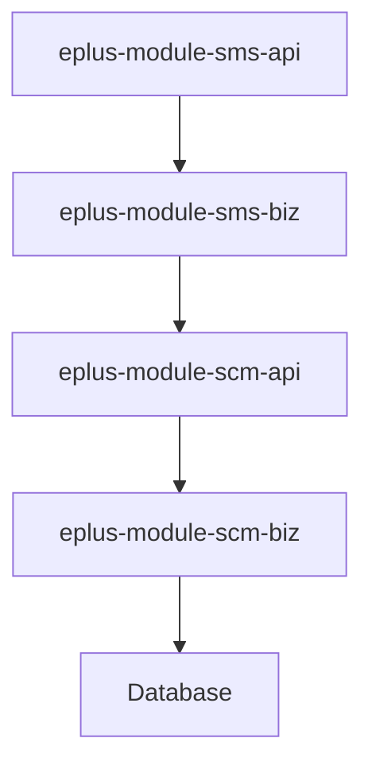

# 分层架构设计

<cite>
**本文档引用的文件**   
- [SaleContractApi.java](file://eplus-module-sms/eplus-module-sms-api/src/main/java/com/syj/eplus/module/sms/api/SaleContractApi.java)
- [SaleContractApiImpl.java](file://eplus-module-sms/eplus-module-sms-biz/src/main/java/com/syj/eplus/module/sms/api/SaleContractApiImpl.java)
- [ErrorCodeConstants.java](file://eplus-module-wms/eplus-module-wms-api/src/main/java/com/syj/eplus/module/wms/enums/ErrorCodeConstants.java)
- [eplus-module-scm/pom.xml](file://eplus-module-scm/pom.xml)
- [eplus-module-sms/pom.xml](file://eplus-module-sms/pom.xml)
- [eplus-module-wms/pom.xml](file://eplus-module-wms/pom.xml)
</cite>

## 目录
1. [引言](#引言)
2. [项目结构](#项目结构)
3. [核心组件](#核心组件)
4. [架构概述](#架构概述)
5. [详细组件分析](#详细组件分析)
6. [依赖分析](#依赖分析)
7. [性能考虑](#性能考虑)
8. [故障排除指南](#故障排除指南)
9. [结论](#结论)

## 引言
eplus-admin-server项目采用清晰的分层架构设计，通过将API层与BIZ层分离，实现了高内聚、低耦合的系统架构。这种设计模式不仅提高了系统的可维护性和可扩展性，还支持独立开发、测试和部署。本文档详细阐述了该分层架构的设计原则、优势以及在各业务模块中的具体实现。

## 项目结构
eplus-admin-server项目采用模块化设计，每个业务模块（如SCM、SMS、WMS等）都包含独立的API和BIZ子模块。这种结构确保了各模块之间的隔离性，同时便于团队协作和独立部署。

**图示来源**
- [eplus-module-scm/pom.xml](file://eplus-module-scm/pom.xml)
- [eplus-module-sms/pom.xml](file://eplus-module-sms/pom.xml)
- [eplus-module-wms/pom.xml](file://eplus-module-wms/pom.xml)

**本节来源**
- [eplus-module-scm/pom.xml](file://eplus-module-scm/pom.xml)
- [eplus-module-sms/pom.xml](file://eplus-module-sms/pom.xml)
- [eplus-module-wms/pom.xml](file://eplus-module-wms/pom.xml)

## 核心组件
eplus-admin-server的核心组件包括API层和BIZ层。API层负责定义接口、DTO和VO，而BIZ层则实现具体的业务逻辑。这种分离设计使得API层可以作为服务契约，供其他系统或前端调用，而BIZ层专注于业务规则的实现。

**本节来源**
- [SaleContractApi.java](file://eplus-module-sms/eplus-module-sms-api/src/main/java/com/syj/eplus/module/sms/api/SaleContractApi.java)
- [SaleContractApiImpl.java](file://eplus-module-sms/eplus-module-sms-biz/src/main/java/com/syj/eplus/module/sms/api/SaleContractApiImpl.java)

## 架构概述
eplus-admin-server的分层架构设计遵循了清晰的职责分离原则。API层仅包含数据传输对象（DTO）、值对象（VO）和接口定义，而BIZ层则负责实现具体的业务逻辑。这种设计模式的优势在于降低了模块间的耦合度，提高了系统的可维护性和可测试性。

**图示来源**
- [SaleContractApi.java](file://eplus-module-sms/eplus-module-sms-api/src/main/java/com/syj/eplus/module/sms/api/SaleContractApi.java)
- [SaleContractApiImpl.java](file://eplus-module-sms/eplus-module-sms-biz/src/main/java/com/syj/eplus/module/sms/api/SaleContractApiImpl.java)

## 详细组件分析

### API层分析
API层的设计原则是仅包含DTO、VO和接口定义，不包含任何业务逻辑。以`SaleContractApi`为例，该接口定义了销售合同相关的所有操作，但具体的实现由BIZ层完成。

#### 接口定义

**图示来源**
- [SaleContractApi.java](file://eplus-module-sms/eplus-module-sms-api/src/main/java/com/syj/eplus/module/sms/api/SaleContractApi.java)

**本节来源**
- [SaleContractApi.java](file://eplus-module-sms/eplus-module-sms-api/src/main/java/com/syj/eplus/module/sms/api/SaleContractApi.java)

### BIZ层分析
BIZ层负责实现API层定义的接口，包含具体的业务逻辑。以`SaleContractApiImpl`为例，该类实现了`SaleContractApi`接口，并通过依赖注入的方式使用`SaleContractService`来完成业务操作。

#### 实现类

**图示来源**
- [SaleContractApiImpl.java](file://eplus-module-sms/eplus-module-sms-biz/src/main/java/com/syj/eplus/module/sms/api/SaleContractApiImpl.java)

**本节来源**
- [SaleContractApiImpl.java](file://eplus-module-sms/eplus-module-sms-biz/src/main/java/com/syj/eplus/module/sms/api/SaleContractApiImpl.java)

## 依赖分析
eplus-admin-server的依赖关系清晰，各模块之间通过API层进行通信，避免了直接的业务逻辑耦合。通过Maven的模块化管理，确保了各子模块的独立性和可复用性。

**图示来源**
- [eplus-module-sms/pom.xml](file://eplus-module-sms/pom.xml)
- [eplus-module-scm/pom.xml](file://eplus-module-scm/pom.xml)

**本节来源**
- [eplus-module-sms/pom.xml](file://eplus-module-sms/pom.xml)
- [eplus-module-scm/pom.xml](file://eplus-module-scm/pom.xml)

## 性能考虑
分层架构设计虽然提高了系统的可维护性和可扩展性，但也可能引入额外的性能开销。为了优化性能，建议在BIZ层中合理使用缓存机制，并对频繁调用的接口进行性能监控和优化。

## 故障排除指南
在开发和维护过程中，可能会遇到接口调用失败、数据不一致等问题。建议通过日志记录和监控工具来追踪问题根源，并确保API层和BIZ层的版本一致性。

**本节来源**
- [SaleContractApi.java](file://eplus-module-sms/eplus-module-sms-api/src/main/java/com/syj/eplus/module/sms/api/SaleContractApi.java)
- [SaleContractApiImpl.java](file://eplus-module-sms/eplus-module-sms-biz/src/main/java/com/syj/eplus/module/sms/api/SaleContractApiImpl.java)

## 结论
eplus-admin-server的分层架构设计通过API层与BIZ层的分离，实现了高内聚、低耦合的系统架构。这种设计模式不仅提高了系统的可维护性和可扩展性，还支持独立开发、测试和部署。未来可以进一步优化性能，提升系统的整体表现。