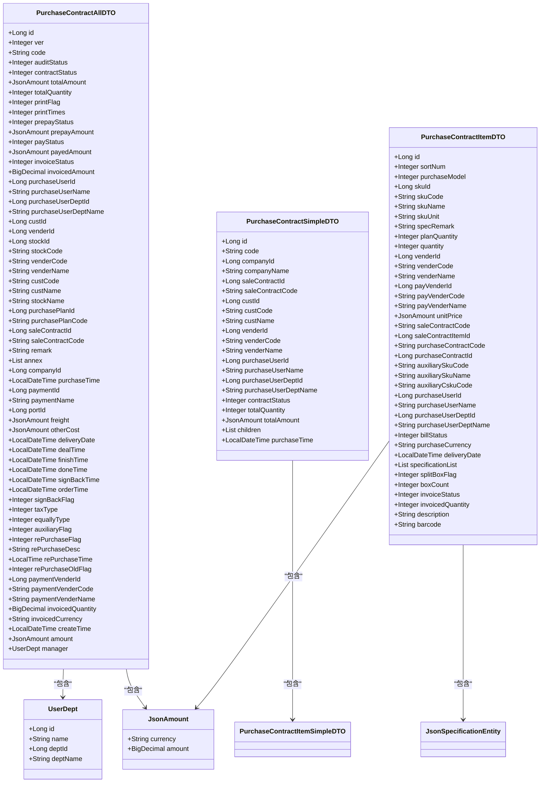
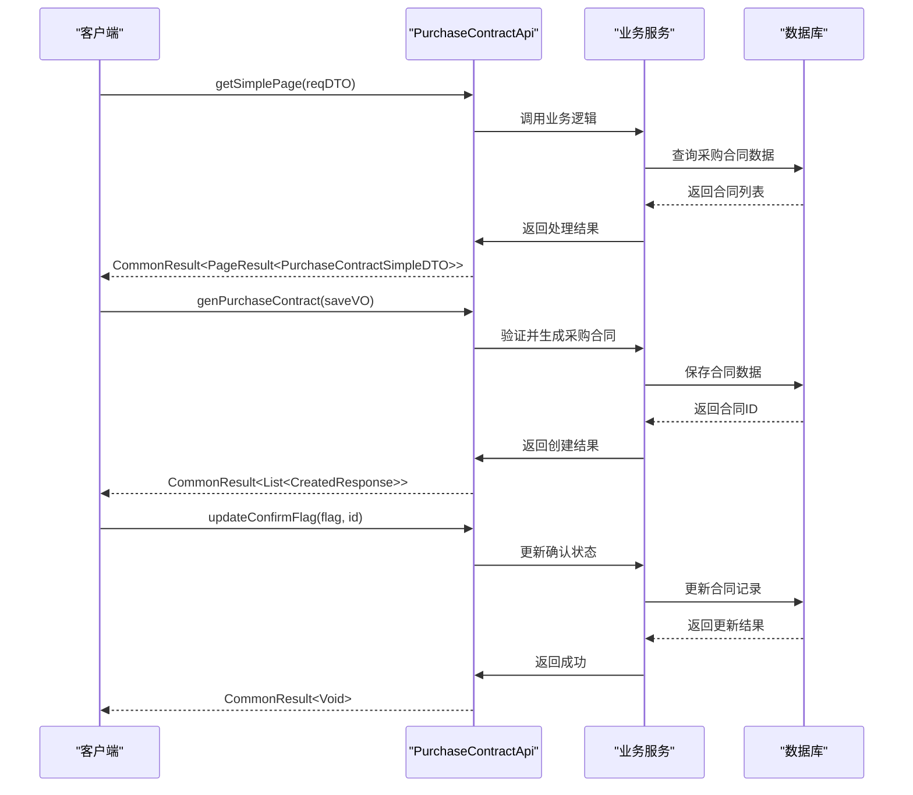
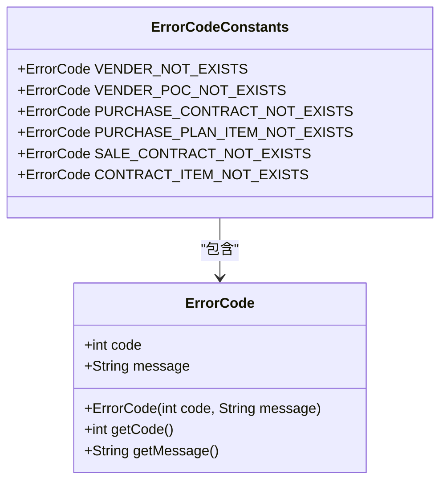

# 接口与数据模型定义

<cite>
**本文档引用文件**  
- [PurchaseContractApi.java](file://eplus-module-scm/eplus-module-scm-api/src/main/java/com/syj/eplus/module/scm/api/purchasecontract/PurchaseContractApi.java)
- [PurchaseContractAllDTO.java](file://eplus-module-scm/eplus-module-scm-api/src/main/java/com/syj/eplus/module/scm/api/purchasecontract/dto/PurchaseContractAllDTO.java)
- [PurchaseContractSimpleDTO.java](file://eplus-module-scm/eplus-module-scm-api/src/main/java/com/syj/eplus/module/scm/api/purchasecontract/dto/PurchaseContractSimpleDTO.java)
- [PurchaseContractItemDTO.java](file://eplus-module-scm/eplus-module-scm-api/src/main/java/com/syj/eplus/module/scm/api/purchasecontract/dto/PurchaseContractItemDTO.java)
- [SaleContractApi.java](file://eplus-module-sms/eplus-module-sms-api/src/main/java/com/syj/eplus/module/sms/api/SaleContractApi.java)
- [SaleContractDTO.java](file://eplus-module-sms/eplus-module-sms-api/src/main/java/com/syj/eplus/module/sms/api/dto/SaleContractDTO.java)
- [StockDTO.java](file://eplus-module-wms/eplus-module-wms-api/src/main/java/com/syj/eplus/module/wms/api/stock/dto/StockDTO.java)
- [ErrorCodeConstants.java](file://eplus-module-scm/eplus-module-scm-api/src/main/java/com/syj/eplus/module/scm/enums/ErrorCodeConstants.java)
- [ErrorCodeConstants.java](file://eplus-module-sms/eplus-module-sms-api/src/main/java/com/syj/eplus/module/sms/enums/ErrorCodeConstants.java)
</cite>

## 目录
1. [引言](#引言)
2. [数据传输对象（DTO）设计规范](#数据传输对象dto设计规范)
3. [核心数据模型分析](#核心数据模型分析)
4. [API接口定义](#api接口定义)
5. [枚举类型在接口中的作用](#枚举类型在接口中的作用)
6. [接口版本控制与向后兼容性](#接口版本控制与向后兼容性)
7. [结论](#结论)

## 引言
本文档详细说明eplus-admin-server项目中API模块的接口与数据模型定义。重点分析采购合同、销售合同和库存等核心数据模型的设计，以及相关API接口的定义方式。文档涵盖DTO设计规范、字段命名规则、数据类型选择、嵌套结构设计等内容，并解释枚举类型在错误处理中的作用和接口版本控制策略。

## 数据传输对象（DTO）设计规范
eplus-admin-server项目中的数据传输对象（DTO）遵循统一的设计规范，确保数据在不同系统组件间传输的一致性和可维护性。

### 字段命名规范
DTO中的字段命名采用驼峰命名法（camelCase），与Java编程规范保持一致。每个字段都有清晰的语义名称，如`purchaseContractCode`表示采购合同编号，`totalQuantity`表示总数量。字段命名避免使用缩写，确保可读性。

### 数据类型选择
项目中DTO使用标准Java数据类型：
- 数值类型：`Integer`用于整数，`BigDecimal`用于高精度计算，`JsonAmount`用于金额数据
- 字符串类型：`String`用于文本数据
- 时间类型：`LocalDateTime`用于日期时间，`LocalTime`用于时间
- 布尔类型：`Boolean`或`Integer`（0/1表示false/true）
- 集合类型：`List<T>`用于数组，`Map<K,V>`用于键值对

### 嵌套结构设计
DTO支持嵌套结构以表示复杂的数据关系。例如，`PurchaseContractAllDTO`包含多个子对象，如`UserDept`表示跟单员信息，`JsonAmount`表示金额信息。这种设计避免了扁平化数据结构带来的字段爆炸问题，提高了数据组织的层次性和可维护性。

### 注解使用
DTO类广泛使用Lombok注解`@Data`来自动生成getter、setter、toString等方法，减少样板代码。同时使用`@Schema`注解（来自Swagger）为字段提供描述信息，便于API文档生成。

**Section sources**
- [PurchaseContractAllDTO.java](file://eplus-module-scm/eplus-module-scm-api/src/main/java/com/syj/eplus/module/scm/api/purchasecontract/dto/PurchaseContractAllDTO.java#L1-L297)
- [PurchaseContractItemDTO.java](file://eplus-module-scm/eplus-module-scm-api/src/main/java/com/syj/eplus/module/scm/api/purchasecontract/dto/PurchaseContractItemDTO.java#L1-L155)

## 核心数据模型分析
本节详细分析采购合同、销售合同和库存等核心数据模型的结构和业务含义。

### 采购合同数据模型
采购合同数据模型由多个DTO组成，形成层次化的数据结构。

#### PurchaseContractAllDTO
`PurchaseContractAllDTO`是采购合同的完整数据模型，包含合同的所有信息：
- 基本信息：主键`id`、版本`ver`、合同编号`code`
- 状态信息：审核状态`auditStatus`、合同状态`contractStatus`、打印状态`printFlag`
- 金额信息：总金额`totalAmount`、预付款金额`prepayAmount`、已付款金额`payedAmount`
- 参与方信息：采购员`purchaseUserId`、供应商`venderId`、客户`custId`
- 时间信息：采购时间`purchaseTime`、交货日期`deliveryDate`、完成时间`doneTime`
- 业务信息：付款方式`paymentId`、目的口岸`portId`、发票类型`taxType`

该DTO通过`UserDept`对象嵌套存储跟单员信息，通过`JsonAmount`对象存储金额数据，实现了数据的结构化组织。

#### PurchaseContractSimpleDTO
`PurchaseContractSimpleDTO`是采购合同的简化版本，用于列表展示和快速查询场景。它包含核心字段如合同编号、公司信息、客户信息、供应商信息和合同状态，以及`children`字段存储合同明细列表。这种设计减少了数据传输量，提高了接口性能。

#### PurchaseContractItemDTO
`PurchaseContractItemDTO`表示采购合同的明细项，包含：
- 产品信息：产品ID`skuId`、产品编号`skuCode`、产品名称`skuName`
- 数量信息：计划采购量`planQuantity`、实际采购量`quantity`
- 价格信息：供应商报价`unitPrice`
- 状态信息：入库状态`billStatus`、开票状态`invoiceStatus`
- 关联信息：销售合同`saleContractCode`、采购合同`purchaseContractCode`

**Diagram sources**
- [PurchaseContractAllDTO.java](file://eplus-module-scm/eplus-module-scm-api/src/main/java/com/syj/eplus/module/scm/api/purchasecontract/dto/PurchaseContractAllDTO.java#L1-L297)
- [PurchaseContractSimpleDTO.java](file://eplus-module-scm/eplus-module-scm-api/src/main/java/com/syj/eplus/module/scm/api/purchasecontract/dto/PurchaseContractSimpleDTO.java#L1-L76)
- [PurchaseContractItemDTO.java](file://eplus-module-scm/eplus-module-scm-api/src/main/java/com/syj/eplus/module/scm/api/purchasecontract/dto/PurchaseContractItemDTO.java#L1-L155)

**Section sources**
- [PurchaseContractAllDTO.java](file://eplus-module-scm/eplus-module-scm-api/src/main/java/com/syj/eplus/module/scm/api/purchasecontract/dto/PurchaseContractAllDTO.java#L1-L297)
- [PurchaseContractSimpleDTO.java](file://eplus-module-scm/eplus-module-scm-api/src/main/java/com/syj/eplus/module/scm/api/purchasecontract/dto/PurchaseContractSimpleDTO.java#L1-L76)
- [PurchaseContractItemDTO.java](file://eplus-module-scm/eplus-module-scm-api/src/main/java/com/syj/eplus/module/scm/api/purchasecontract/dto/PurchaseContractItemDTO.java#L1-L155)

### 销售合同数据模型
销售合同数据模型与采购合同类似，但包含不同的业务字段。

#### SaleContractDTO
`SaleContractDTO`是销售合同的主要数据模型，包含：
- 合同基本信息：编号`code`、确认状态`confirmFlag`、公司信息`companyId`
- 客户信息：客户ID`custId`、客户编号`custCode`、客户名称`custName`
- 财务信息：交易币别`currency`、价格条款`settlementTermType`、收款方式`settlementId`
- 运输信息：运输方式`transportType`、20尺柜数量`twentyFootCabinetNum`
- 金额信息：佣金`commission`、平台费`platformFee`、保险费`insuranceFee`
- 状态信息：审核状态`auditStatus`、变更状态`changeStatus`

该DTO通过`UserDept`对象存储销售人员信息，通过`JsonAmount`对象存储各种费用金额，实现了复杂财务数据的结构化表示。

```mermaid
classDiagram
class SaleContractDTO {
+List<SaleContractItemDTO> children
+Long id
+String code
+Integer confirmFlag
+Long companyId
+String companyName
+JsonCompanyPath companyPath
+Long custId
+String custCode
+String custName
+Long internalCustId
+String internalCustCode
+String internalCustName
+String currency
+String settlementTermType
+Long settlementId
+String settlementName
+Long custCountryId
+String custCountryName
+String custPo
+Integer agentFlag
+Long collectedCustId
+String collectedCustCode
+String collectedCustName
+Long receiveCustId
+String receiveCustCode
+String receiveCustName
+UserDept sales
+List<SimpleFile> annex
+LocalDateTime inputDate
+Long tradeCountryId
+String tradeCountryName
+String tradeCountryArea
+Long departureCountryId
+String departureCountryName
+String departureCountryArea
+Long departurePortId
+String departurePortName
+Long destinationPortId
+String destinationPortName
+Integer transportType
+LocalDateTime custDeliveryDate
+Integer twentyFootCabinetNum
+Integer fortyFootCabinetNum
+Integer fortyFootContainerNum
+BigDecimal bulkHandlingVolume
+JsonAmount trailerFee
+JsonAmount estimatedTotalFreight
+Integer bookingFlag
+JsonAmount commission
+JsonAmount platformFee
+JsonAmount insuranceFee
+JsonAmount lumpSumFee
+JsonAmount sinosureFee
+JsonAmount additionAmount
+JsonAmount deductionAmount
+JsonAmount inspectionFee
+JsonAmount estimatedPackingMaterials
+JsonAmount accessoriesPurchaseTotal
+Integer totalBoxes
+JsonWeight totalGrossweight
+JsonWeight totalWeight
+BigDecimal totalVolume
+JsonAmount totalGoodsValue
+List<JsonAmount> totalPurchase
+JsonAmount totalVatRefund
+Integer totalQuantity
+JsonAmount orderGrossProfit
+BigDecimal grossProfitMargin
+JsonAmount receivableExchange
+Integer saleType
+Integer auditStatus
+Integer convertPurchaseFlag
+LocalDateTime convertPurchaseTime
+String processInstanceId
+UserDept signBackUser
+LocalDateTime signBackDate
+Integer status
+Integer changeStatus
+Integer autoFlag
+List<String> linkCodeList
+List<SimpleFile> designDraftList
+List<SimpleFile> signBackAnnex
+Integer signBackFlag
+String signBackDesc
+Long collectionAccountId
+String collectionAccountBankCode
+BigDecimal exchangeRate
+Long sourceContractId
+String sourceContractCode
+String deliveryAddress
}
class SaleContractItemDTO {
+Long id
+Integer sortNum
+Long skuId
+String skuCode
+String skuName
+String cskuCode
+String cskuName
+String skuUnit
+String specRemark
+Integer quantity
+JsonAmount withTaxPrice
+JsonAmount withoutTaxPrice
+BigDecimal taxRate
+JsonAmount taxAmount
+JsonAmount totalWithTaxAmount
+JsonAmount totalWithoutTaxAmount
+JsonAmount totalTaxAmount
+String currency
+String currencyRate
+String outerBoxSpec
+Integer outerBoxNum
+Integer boxCount
+JsonWeight grossWeight
+JsonWeight netWeight
+BigDecimal volume
+String remark
+String barcode
+Integer purchaseFlag
+Integer shipmentFlag
+Integer invoiceFlag
+Integer cancelFlag
+String uniqueCode
+String saleContractCode
+Long saleContractId
+String auxiliarySkuCode
+String auxiliarySkuName
+String auxiliaryCskuCode
+String auxiliaryCskuName
+String auxiliarySkuUnit
+String auxiliarySpecRemark
+Integer auxiliaryQuantity
+JsonAmount auxiliaryWithTaxPrice
+JsonAmount auxiliaryWithoutTaxPrice
+BigDecimal auxiliaryTaxRate
+JsonAmount auxiliaryTaxAmount
+JsonAmount auxiliaryTotalWithTaxAmount
+JsonAmount auxiliaryTotalWithoutTaxAmount
+JsonAmount auxiliaryTotalTaxAmount
+String auxiliaryCurrency
+String auxiliaryCurrencyRate
+String auxiliaryOuterBoxSpec
+Integer auxiliaryOuterBoxNum
+Integer auxiliaryBoxCount
+JsonWeight auxiliaryGrossWeight
+JsonWeight auxiliaryNetWeight
+BigDecimal auxiliaryVolume
+String auxiliaryRemark
+String auxiliaryBarcode
+Integer auxiliaryPurchaseFlag
+Integer auxiliaryShipmentFlag
+Integer auxiliaryInvoiceFlag
+Integer auxiliaryCancelFlag
+String auxiliaryUniqueCode
+String auxiliarySaleContractCode
+Long auxiliarySaleContractId
}
class JsonAmount {
+String currency
+BigDecimal amount
}
class UserDept {
+Long id
+String name
+Long deptId
+String deptName
}
class JsonCompanyPath {
+List<CompanyPathNode> nodes
}
class CompanyPathNode {
+Long companyId
+String companyName
+String companyShortName
+Integer nodeType
+String nodeTypeName
}
SaleContractDTO --> SaleContractItemDTO : "包含"
SaleContractDTO --> UserDept : "包含"
SaleContractDTO --> JsonAmount : "包含"
SaleContractDTO --> JsonCompanyPath : "包含"
SaleContractDTO --> SimpleFile : "包含"
SaleContractItemDTO --> JsonAmount : "包含"
```

**Diagram sources**
- [SaleContractDTO.java](file://eplus-module-sms/eplus-module-sms-api/src/main/java/com/syj/eplus/module/sms/api/dto/SaleContractDTO.java#L1-L423)
- [SaleContractItemDTO.java](file://eplus-module-sms/eplus-module-sms-api/src/main/java/com/syj/eplus/module/sms/api/dto/SaleContractItemDTO.java#L1-L200)

**Section sources**
- [SaleContractDTO.java](file://eplus-module-sms/eplus-module-sms-api/src/main/java/com/syj/eplus/module/sms/api/dto/SaleContractDTO.java#L1-L423)

### 库存数据模型
库存数据模型用于管理仓库中的物料信息。

#### StockDTO
`StockDTO`表示库存信息，包含：
- 库存基本信息：库存ID`id`、库存编号`code`、仓库ID`stockId`
- 产品信息：产品ID`skuId`、产品编号`skuCode`、产品名称`skuName`
- 数量信息：可用数量`availableQuantity`、锁定数量`lockedQuantity`、在途数量`inTransitQuantity`
- 状态信息：库存状态`status`、库存类型`type`
- 位置信息：库位`location`、批次号`batchNumber`
- 时间信息：入库时间`inboundTime`、过期时间`expiryTime`

该DTO通过`JsonAmount`对象存储库存金额，通过`JsonWeight`对象存储重量信息，实现了库存数据的全面管理。

**Section sources**
- [StockDTO.java](file://eplus-module-wms/eplus-module-wms-api/src/main/java/com/syj/eplus/module/wms/api/stock/dto/StockDTO.java#L1-L100)

## API接口定义
本节分析采购合同和销售合同API接口的定义方式，包括方法签名、参数类型和返回值。

### 采购合同API
`PurchaseContractApi`接口定义了采购合同相关的所有操作。

#### 方法签名分析
接口方法遵循统一的命名规范，使用动词+名词的形式，如`getSimplePage`、`genPurchaseContract`。方法参数使用DTO对象封装，如`PurchaseContractGetSimplePageReqDTO`用于分页查询请求。

#### 参数类型
接口方法的参数类型主要包括：
- DTO对象：用于封装复杂的请求数据，如`SavePurchaseContractReqVO`
- 基本类型：`String`、`Long`、`Integer`等用于简单参数
- 集合类型：`List<T>`、`Map<K,V>`用于批量操作
- 泛型类型：`Collection<T>`用于不确定具体类型的集合

#### 返回值类型
接口方法的返回值统一使用`CommonResult<T>`包装，其中`T`是具体的返回数据类型。`CommonResult`包含状态码、消息和数据体，便于前端统一处理响应。

**Diagram sources**
- [PurchaseContractApi.java](file://eplus-module-scm/eplus-module-scm-api/src/main/java/com/syj/eplus/module/scm/api/purchasecontract/PurchaseContractApi.java#L1-L352)

**Section sources**
- [PurchaseContractApi.java](file://eplus-module-scm/eplus-module-scm-api/src/main/java/com/syj/eplus/module/scm/api/purchasecontract/PurchaseContractApi.java#L1-L352)

### 销售合同API
`SaleContractApi`接口定义了销售合同相关的所有操作。

#### 方法签名分析
与采购合同API类似，销售合同API也遵循统一的命名规范。接口提供了丰富的操作方法，包括查询、更新、生成合同等。

#### 批量操作支持
销售合同API特别强调批量操作的支持，如`batchUpdateBillStatus`方法可以批量更新多个合同的入库状态，`getUnCompletedSaleContractByCustCode`方法可以查询客户的所有未完成合同。这种设计提高了系统的处理效率。

#### 复杂业务逻辑
接口中包含复杂的业务逻辑方法，如`generateSaleContract`用于生成销售合同，`calcRealPurchasePrice`用于计算真实采购价。这些方法封装了核心业务规则，确保了业务逻辑的一致性。

**Section sources**
- [SaleContractApi.java](file://eplus-module-sms/eplus-module-sms-api/src/main/java/com/syj/eplus/module/sms/api/SaleContractApi.java#L1-L475)

## 枚举类型在接口中的作用
枚举类型在eplus-admin-server项目中主要用于错误码定义和状态管理。

### 错误码常量
`ErrorCodeConstants`接口定义了系统中所有模块的错误码，采用分层编码方式：
- 采购模块：1-003-xxx-xxx
- 销售模块：1-009-xxx-xxx
- 通用错误：1-001-xxx-xxx

每个错误码包含一个唯一的数字编码和描述信息，如`PURCHASE_CONTRACT_NOT_EXISTS = new ErrorCode(1_003_002_001, "采购合同不存在")`。这种设计便于错误的快速定位和国际化处理。

### 状态枚举
系统中使用枚举类型表示各种状态，如合同状态、审核状态、付款状态等。枚举值通常用整数表示，如0表示"未审核"，1表示"已审核"。这种设计节省了存储空间，提高了查询效率。

### 业务类型枚举
枚举类型还用于表示业务类型，如运输方式、发票类型、价格条款等。这些枚举值在系统中作为配置项存在，便于业务规则的统一管理。

**Diagram sources**
- [ErrorCodeConstants.java](file://eplus-module-scm/eplus-module-scm-api/src/main/java/com/syj/eplus/module/scm/enums/ErrorCodeConstants.java#L1-L215)
- [ErrorCodeConstants.java](file://eplus-module-sms/eplus-module-sms-api/src/main/java/com/syj/eplus/module/sms/enums/ErrorCodeConstants.java#L1-L114)

**Section sources**
- [ErrorCodeConstants.java](file://eplus-module-scm/eplus-module-scm-api/src/main/java/com/syj/eplus/module/scm/enums/ErrorCodeConstants.java#L1-L215)
- [ErrorCodeConstants.java](file://eplus-module-sms/eplus-module-sms-api/src/main/java/com/syj/eplus/module/sms/enums/ErrorCodeConstants.java#L1-L114)

## 接口版本控制与向后兼容性
eplus-admin-server项目通过多种策略实现接口版本控制和向后兼容性。

### 版本控制策略
项目采用语义化版本控制（Semantic Versioning），版本号格式为`主版本号.次版本号.修订号`：
- 主版本号：当进行不兼容的API修改时递增
- 次版本号：当以向后兼容的方式添加功能时递增
- 修订号：当进行向后兼容的问题修正时递增

### 向后兼容性保证
项目通过以下方式保证向后兼容性：
1. **字段兼容**：新增字段采用可选方式，不影响旧客户端
2. **接口兼容**：不删除已存在的接口方法，废弃方法标记为`@Deprecated`
3. **数据兼容**：数据库变更遵循渐进式原则，确保新旧版本共存
4. **默认值**：为新增字段提供合理的默认值

### 兼容性测试
项目建立了完善的兼容性测试机制，包括：
- 单元测试：验证接口行为的一致性
- 集成测试：验证跨版本调用的正确性
- 回归测试：确保新版本不破坏旧功能

## 结论
eplus-admin-server项目的接口与数据模型设计体现了良好的软件工程实践。通过统一的DTO设计规范、清晰的数据模型分层、合理的API定义和严格的版本控制策略，系统实现了高内聚、低耦合的架构目标。这些设计不仅提高了代码的可维护性和可扩展性，也为系统的稳定运行提供了保障。