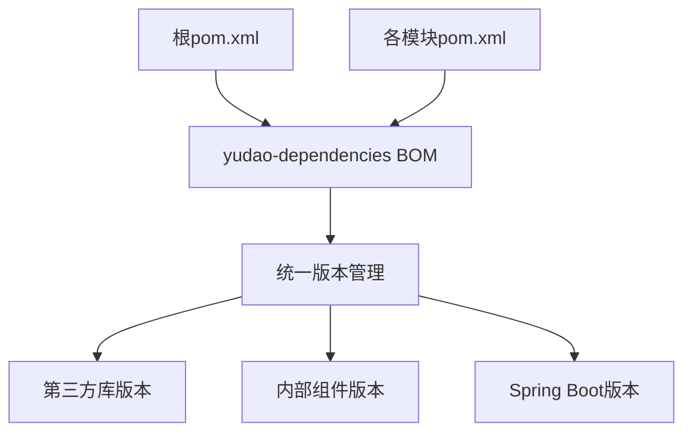
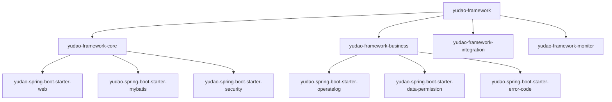
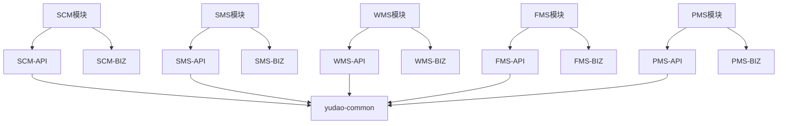
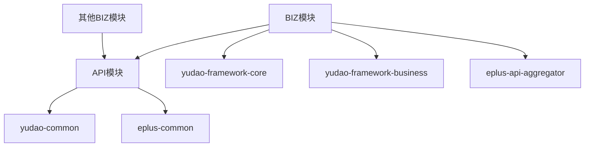
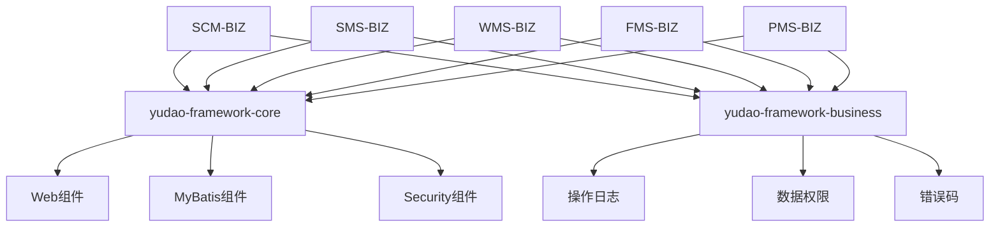
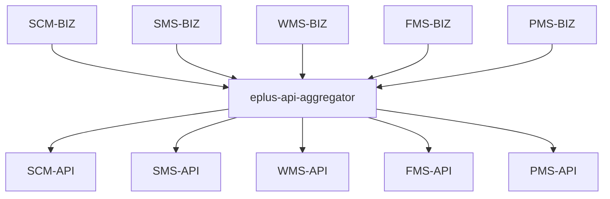
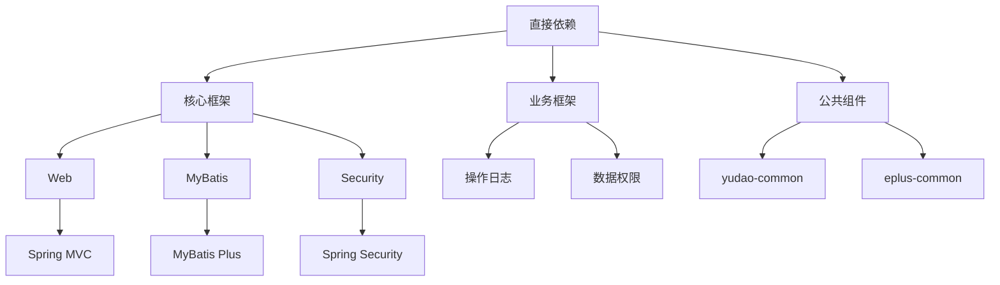

# 模块依赖图谱

<cite>
**本文档引用的文件**  
- [pom.xml](file://pom.xml)
- [yudao-framework/pom.xml](file://yudao-framework/pom.xml)
- [yudao-dependencies/pom.xml](file://yudao-dependencies/pom.xml)
- [eplus-api-aggregator/pom.xml](file://eplus-api-aggregator/pom.xml)
- [eplus-module-scm/pom.xml](file://eplus-module-scm/pom.xml)
- [eplus-module-scm/eplus-module-scm-api/pom.xml](file://eplus-module-scm/eplus-module-scm-api/pom.xml)
- [eplus-module-scm/eplus-module-scm-biz/pom.xml](file://eplus-module-scm/eplus-module-scm-biz/pom.xml)
- [eplus-module-sms/pom.xml](file://eplus-module-sms/pom.xml)
- [eplus-module-sms/eplus-module-sms-api/pom.xml](file://eplus-module-sms/eplus-module-sms-api/pom.xml)
- [eplus-module-sms/eplus-module-sms-biz/pom.xml](file://eplus-module-sms/eplus-module-sms-biz/pom.xml)
- [eplus-module-wms/pom.xml](file://eplus-module-wms/pom.xml)
- [eplus-module-wms/eplus-module-wms-api/pom.xml](file://eplus-module-wms/eplus-module-wms-api/pom.xml)
- [eplus-module-wms/eplus-module-wms-biz/pom.xml](file://eplus-module-wms/eplus-module-wms-biz/pom.xml)
- [eplus-module-fms/pom.xml](file://eplus-module-fms/pom.xml)
- [eplus-module-fms/eplus-module-fms-api/pom.xml](file://eplus-module-fms/eplus-module-fms-api/pom.xml)
- [eplus-module-fms/eplus-module-fms-biz/pom.xml](file://eplus-module-fms/eplus-module-fms-biz/pom.xml)
- [eplus-module-pms/pom.xml](file://eplus-module-pms/pom.xml)
- [eplus-module-pms/eplus-module-pms-api/pom.xml](file://eplus-module-pms/eplus-module-pms-api/pom.xml)
- [eplus-module-pms/eplus-module-pms-biz/pom.xml](file://eplus-module-pms/eplus-module-pms-biz/pom.xml)
</cite>

## 目录
1. [项目结构概述](#项目结构概述)
2. [核心依赖管理机制](#核心依赖管理机制)
3. [基础框架层分析](#基础框架层分析)
4. [业务模块依赖关系](#业务模块依赖关系)
5. [API与BIZ模块依赖模式](#api与biz模块依赖模式)
6. [核心业务模块对框架层的依赖](#核心业务模块对框架层的依赖)
7. [模块间通信设计](#模块间通信设计)
8. [依赖传递性与系统稳定性](#依赖传递性与系统稳定性)
9. [依赖冲突解决策略](#依赖冲突解决策略)
10. [版本管理最佳实践](#版本管理最佳实践)

## 项目结构概述

eplus-admin-server项目采用Maven多模块架构，通过清晰的模块划分实现功能解耦和职责分离。项目根目录下的pom.xml文件定义了所有子模块，包括核心框架模块、业务功能模块和基础设施模块。每个业务模块（如SCM、SMS、WMS等）都遵循API-BIZ分离的设计模式，确保接口定义与业务实现的解耦。

**模块来源**
- [pom.xml](file://pom.xml#L10-L44)

## 核心依赖管理机制

项目采用BOM（Bill of Materials）模式进行依赖版本管理，通过yudao-dependencies模块统一管理所有第三方库和内部组件的版本号。根pom.xml通过dependencyManagement引入yudao-dependencies，确保整个项目依赖版本的一致性。这种集中式管理方式有效避免了版本冲突，简化了依赖升级流程。

**图谱来源**
- [pom.xml](file://pom.xml#L66-L76)
- [yudao-dependencies/pom.xml](file://yudao-dependencies/pom.xml)

## 基础框架层分析

yudao-framework模块作为整个系统的技术基石，提供了分层的框架组件。该模块包含核心框架（core）、集成框架（integration）、业务框架（business）和监控框架（monitor）四个聚合模块，以及多个独立的starter组件。这种设计实现了技术组件的高内聚、低耦合，便于按需引入和维护。

**图谱来源**
- [yudao-framework/pom.xml](file://yudao-framework/pom.xml#L12-L47)

## 业务模块依赖关系

核心业务模块包括供应链管理（SCM）、销售管理（SMS）、仓储管理（WMS）、财务管理（FMS）和产品管理（PMS）等。这些模块均以eplus-module-前缀命名，每个模块包含API和BIZ两个子模块。通过分析各模块的pom.xml文件，可以清晰地看到它们对基础框架和公共组件的依赖关系。

**图谱来源**
- [pom.xml](file://pom.xml#L22-L39)
- [eplus-module-scm/pom.xml](file://eplus-module-scm/pom.xml)
- [eplus-module-sms/pom.xml](file://eplus-module-sms/pom.xml)
- [eplus-module-wms/pom.xml](file://eplus-module-wms/pom.xml)
- [eplus-module-fms/pom.xml](file://eplus-module-fms/pom.xml)
- [eplus-module-pms/pom.xml](file://eplus-module-pms/pom.xml)

## API与BIZ模块依赖模式

项目采用严格的API-BIZ分离架构，每个业务模块都分为API和BIZ两个子模块。API模块负责定义接口契约，仅依赖基础公共组件；BIZ模块实现业务逻辑，依赖API模块和其他必要的框架组件。这种设计确保了模块间的松耦合，支持独立开发和部署。

**图谱来源**
- [eplus-module-scm/eplus-module-scm-api/pom.xml](file://eplus-module-scm/eplus-module-scm-api/pom.xml#L19-L28)
- [eplus-module-scm/eplus-module-scm-biz/pom.xml](file://eplus-module-scm/eplus-module-scm-biz/pom.xml#L20-L42)

## 核心业务模块对框架层的依赖

核心业务模块通过依赖yudao-framework-core和yudao-framework-business聚合模块，获得Web、MyBatis、Security等核心技术能力以及操作日志、数据权限、错误码等业务组件。这种聚合模块的引入方式简化了依赖声明，确保了技术栈的一致性。

**图谱来源**
- [eplus-module-scm/eplus-module-scm-biz/pom.xml](file://eplus-module-scm/eplus-module-scm-biz/pom.xml#L31-L42)
- [eplus-module-sms/eplus-module-sms-biz/pom.xml](file://eplus-module-sms/eplus-module-sms-biz/pom.xml#L31-L42)
- [eplus-module-wms/eplus-module-wms-biz/pom.xml](file://eplus-module-wms/eplus-module-wms-biz/pom.xml#L31-L42)

## 模块间通信设计

项目通过API接口实现模块间通信，遵循"依赖倒置"原则。BIZ模块通过eplus-api-aggregator聚合模块引入所有业务API，避免了直接依赖其他模块的实现。这种设计支持服务的远程调用和本地调用两种模式，为未来的微服务化改造提供了基础。

**图谱来源**
- [eplus-api-aggregator/pom.xml](file://eplus-api-aggregator/pom.xml)
- [eplus-module-scm/eplus-module-scm-biz/pom.xml](file://eplus-module-scm/eplus-module-scm-biz/pom.xml#L23-L27)

## 依赖传递性与系统稳定性

项目的依赖传递性设计兼顾了便利性和可控性。通过聚合模块引入常用依赖组合，减少了重复声明；同时严格控制传递性依赖的范围，避免不必要的依赖传递。这种设计提高了构建效率，降低了因依赖冲突导致的系统不稳定风险。

**图谱来源**
- [yudao-dependencies/pom.xml](file://yudao-dependencies/pom.xml)
- [eplus-module-scm/eplus-module-scm-biz/pom.xml](file://eplus-module-scm/eplus-module-scm-biz/pom.xml)

## 依赖冲突解决策略

项目通过BOM机制和严格的依赖管理策略解决依赖冲突。yudao-dependencies作为单一版本源，确保所有模块使用一致的依赖版本。对于不可避免的版本冲突，采用dependencyManagement显式声明优先版本，并通过Maven的依赖调解规则（最短路径优先、声明顺序优先）进行控制。

**解决策略来源**
- [yudao-dependencies/pom.xml](file://yudao-dependencies/pom.xml#L78-L655)

## 版本管理最佳实践

项目采用${revision}占位符进行版本管理，结合flatten-maven-plugin插件实现版本的统一管理和发布。这种实践支持一键式版本升级，避免了多模块项目中版本号不一致的问题。同时，通过CI/CD流程自动化版本发布，确保了版本管理的准确性和效率。

**最佳实践来源**
- [pom.xml](file://pom.xml#L8-L9)
- [yudao-dependencies/pom.xml](file://yudao-dependencies/pom.xml#L7-L9)
- [pom.xml](file://pom.xml#L126-L154)