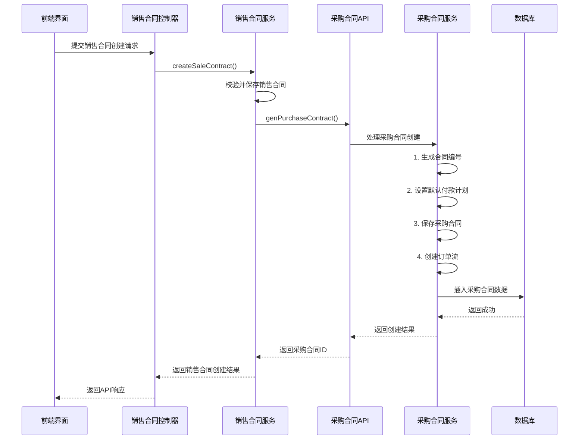
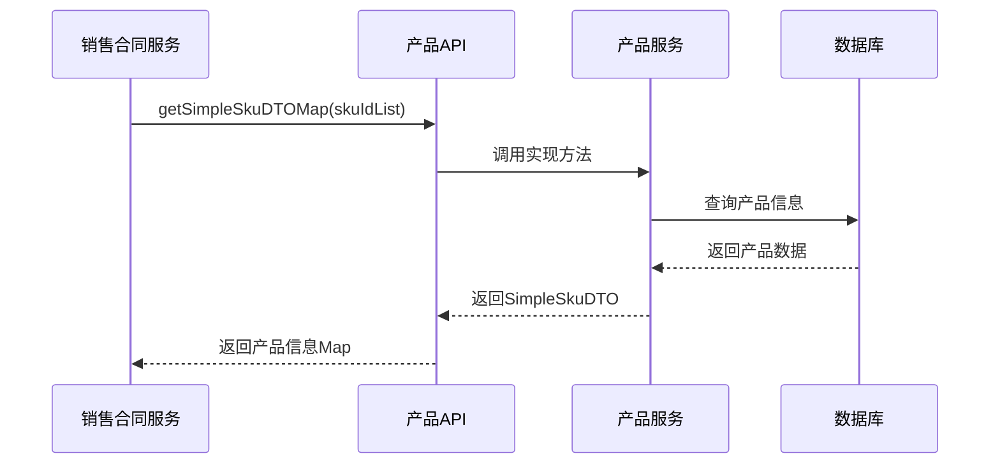

# 模块调用链路

<cite>
**本文档引用文件**  
- [SaleContractServiceImpl.java](file://eplus-module-sms/eplus-module-sms-biz/src/main/java/com/syj/eplus/module/sms/service/salecontract/SaleContractServiceImpl.java)
- [PurchaseContractServiceImpl.java](file://eplus-module-scm/eplus-module-scm-biz/src/main/java/com/syj/eplus/module/scm/service/purchasecontract/PurchaseContractServiceImpl.java)
- [SaleContractApi.java](file://eplus-module-sms/eplus-module-sms-api/src/main/java/com/syj/eplus/module/sms/api/SaleContractApi.java)
- [PurchaseContractApi.java](file://eplus-module-scm/eplus-module-scm-api/src/main/java/com/syj/eplus/module/scm/api/purchasecontract/PurchaseContractApi.java)
- [SkuApi.java](file://eplus-module-pms/eplus-module-pms-api/src/main/java/com/syj/eplus/module/pms/api/sku/SkuApi.java)
- [ModuleLoaderListener.java](file://yudao-server/src/main/java/cn/iocoder/yudao/server/config/ModuleLoaderListener.java)
- [GlobalExceptionHandler.java](file://yudao-framework/yudao-spring-boot-starter-web/src/main/java/cn/iocoder/yudao/framework/web/core/handler/GlobalExceptionHandler.java)
</cite>

## 目录
1. [引言](#引言)
2. [核心模块与调用机制](#核心模块与调用机制)
3. [典型业务流程调用链路](#典型业务流程调用链路)
4. [模块间API调用实现方式](#模块间api调用实现方式)
5. [异常处理与事务管理](#异常处理与事务管理)
6. [调用链路可视化](#调用链路可视化)

## 引言
本文档详细分析eplus-admin-server系统中各业务模块间的调用链路，重点关注销售合同创建触发产品管理查询、采购合同生成引发财务付款计划创建等典型业务场景。文档将说明通过API接口进行模块间调用的具体实现方式，展示关键的调用序列图，并解释调用链路中的异常处理机制和事务边界管理。

## 核心模块与调用机制

系统采用模块化架构设计，各业务模块（如销售管理、采购管理、产品管理、财务管理等）通过定义清晰的API接口进行通信。模块间调用主要通过本地JVM调用实现，调用方通过Spring的依赖注入机制获取被调用方的API实现类实例，从而完成跨模块的功能调用。

模块的启用和加载由`ModuleLoaderListener`监听器在应用启动时根据配置进行管理，确保只有启用的模块才会被加载到运行时环境中。

**Section sources**
- [ModuleLoaderListener.java](file://yudao-server/src/main/java/cn/iocoder/yudao/server/config/ModuleLoaderListener.java)

## 典型业务流程调用链路

### 销售合同创建触发产品管理查询
当创建销售合同时，系统需要查询产品信息以填充合同明细。此过程涉及销售管理模块（SMS）对产品管理模块（PMS）的调用。

1.  **销售合同创建**：`SaleContractServiceImpl`处理销售合同创建请求。
2.  **产品信息查询**：在处理过程中，调用`SkuApi`接口获取产品详情。
3.  **数据返回**：`SkuApiImpl`实现类查询数据库并返回产品数据。

### 采购合同生成引发财务付款计划创建
当销售合同确认后，系统会自动生成对应的采购合同，并随之创建财务付款计划。此过程涉及销售管理模块（SMS）对采购管理模块（SCM）的调用。

1.  **生成采购合同**：`SaleContractServiceImpl`中的`genPurchaseContract`方法被触发。
2.  **调用采购API**：该方法构造`SavePurchaseContractReqVO`对象，并调用`PurchaseContractApi.genPurchaseContract`方法。
3.  **创建付款计划**：在`PurchaseContractServiceImpl`处理采购合同创建时，会检查并生成付款计划。

**Section sources**
- [SaleContractServiceImpl.java](file://eplus-module-sms/eplus-module-sms-biz/src/main/java/com/syj/eplus/module/sms/service/salecontract/SaleContractServiceImpl.java#L1892-L1927)
- [PurchaseContractServiceImpl.java](file://eplus-module-scm/eplus-module-scm-biz/src/main/java/com/syj/eplus/module/scm/service/purchasecontract/PurchaseContractServiceImpl.java#L384-L391)

## 模块间API调用实现方式

系统中的模块间调用主要通过定义在`*-api`模块中的Java接口来实现。每个业务模块（如`eplus-module-sms`）都有一个对应的API模块（如`eplus-module-sms-api`），其中定义了该模块对外暴露的服务接口。

### 本地JVM调用
这是最主要的调用方式。调用流程如下：
1.  **接口定义**：在`*-api`模块中定义服务接口，例如`SaleContractApi`。
2.  **实现注入**：在调用方模块中，通过`@Resource`或`@Autowired`注解注入API接口。
3.  **方法调用**：直接调用注入的接口实例的方法，Spring框架会自动将调用路由到实际的实现类（位于`*-biz`模块中）。

```java
// 示例：在SaleContractServiceImpl中调用采购API
@Resource
private PurchaseContractApi purchaseContractApi;

private List<CreatedResponse> genPurchaseContract(...) {
    // ... 构造请求对象
    return purchaseContractApi.genPurchaseContract(savePurchaseContractReqVO);
}
```

### 潜在的远程调用机制
虽然当前系统主要采用单体架构下的本地调用，但其API设计为未来可能的微服务化改造奠定了基础。通过将`*-api`模块作为独立的依赖，可以方便地将远程调用（如通过HTTP或RPC）的实现替换掉本地实现，而无需修改调用方的业务逻辑。

**Section sources**
- [SaleContractApi.java](file://eplus-module-sms/eplus-module-sms-api/src/main/java/com/syj/eplus/module/sms/api/SaleContractApi.java)
- [PurchaseContractApi.java](file://eplus-module-scm/eplus-module-scm-api/src/main/java/com/syj/eplus/module/scm/api/purchasecontract/PurchaseContractApi.java)

## 异常处理与事务管理

### 异常处理机制
系统采用统一的异常处理机制，通过`GlobalExceptionHandler`全局异常处理器来捕获和处理所有未被业务代码捕获的异常。

- **业务异常**：使用`exception()`方法抛出自定义业务异常，这些异常会被`GlobalExceptionHandler`捕获并转换为标准的API响应格式。
- **系统异常**：对于未预期的系统异常，`GlobalExceptionHandler`提供兜底处理，记录错误日志并返回通用的错误信息。
- **特定异常处理**：例如，`ClientAbortException`（客户端主动断开连接）被视为正常现象，不会记录为错误日志。

### 事务边界管理
事务管理主要通过Spring的`@Transactional`注解来声明。

- **事务边界**：通常在服务实现类（`*-ServiceImpl`）的公共方法上声明事务。例如，`SaleContractServiceImpl.changeSaleContract`方法使用了`@Transactional(rollbackFor = Exception.class)`，确保该方法内的所有数据库操作在一个事务中执行，任何异常都会导致整个事务回滚。
- **事务传播**：当一个事务方法调用另一个事务方法时，遵循Spring默认的事务传播行为（REQUIRED），即在当前事务中执行，如果不存在则创建新事务。

**Section sources**
- [GlobalExceptionHandler.java](file://yudao-framework/yudao-spring-boot-starter-web/src/main/java/cn/iocoder/yudao/framework/web/core/handler/GlobalExceptionHandler.java#L231-L260)
- [SaleContractServiceImpl.java](file://eplus-module-sms/eplus-module-sms-biz/src/main/java/com/syj/eplus/module/sms/service/salecontract/SaleContractServiceImpl.java#L1931)

## 调用链路可视化

### 销售合同创建及采购合同生成序列图
以下序列图展示了从创建销售合同到生成采购合同的关键调用链路。



**Diagram sources**
- [SaleContractServiceImpl.java](file://eplus-module-sms/eplus-module-sms-biz/src/main/java/com/syj/eplus/module/sms/service/salecontract/SaleContractServiceImpl.java#L1892-L1927)
- [PurchaseContractServiceImpl.java](file://eplus-module-scm/eplus-module-scm-biz/src/main/java/com/syj/eplus/module/scm/service/purchasecontract/PurchaseContractServiceImpl.java#L375-L395)

### 产品信息查询序列图
以下序列图展示了销售合同创建过程中查询产品信息的调用链路。



**Diagram sources**
- [SkuApi.java](file://eplus-module-pms/eplus-module-pms-api/src/main/java/com/syj/eplus/module/pms/api/sku/SkuApi.java)
- [SkuServiceImpl.java](file://eplus-module-pms/eplus-module-pms-biz/src/main/java/com/syj/eplus/module/pms/service/sku/SkuServiceImpl.java)