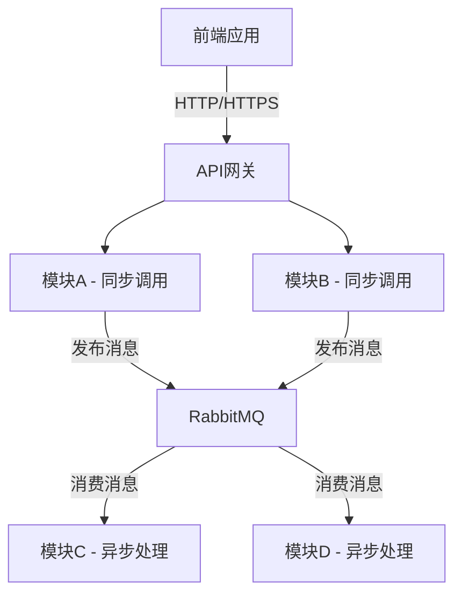
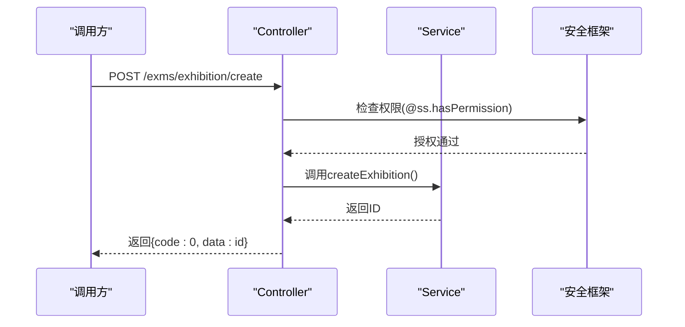
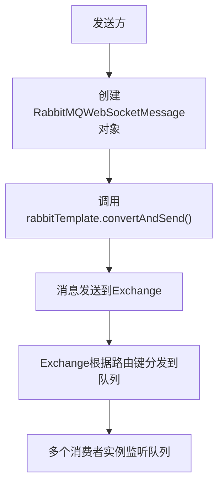
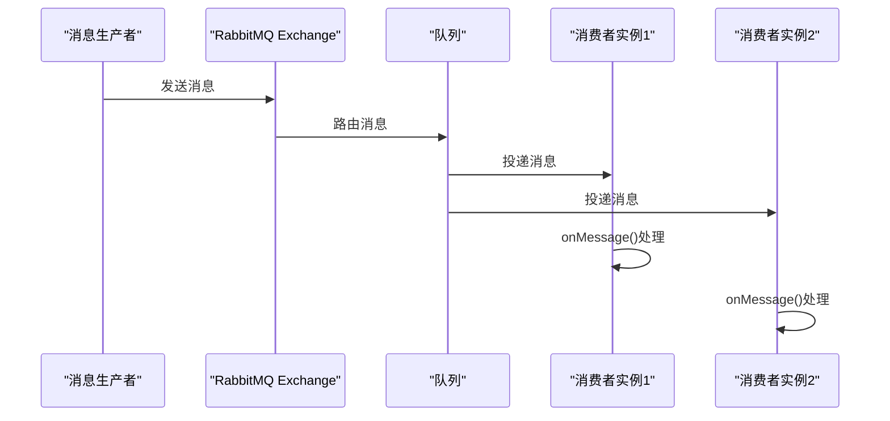
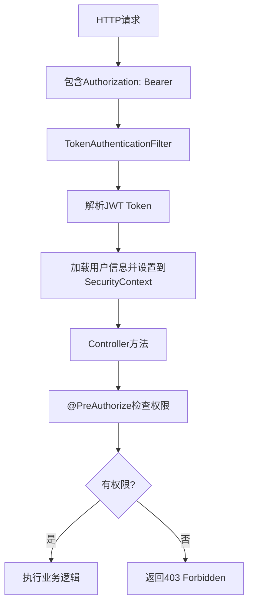

# 模块通信协议

<cite>
**本文档引用文件**  
- [pom.xml](file://pom.xml)
- [application.yaml](file://yudao-server/src/main/resources/application.yaml)
- [YudaoRabbitMQAutoConfiguration.java](file://yudao-framework/yudao-spring-boot-starter-mq/src/main/java/cn/iocoder/yudao/framework/mq/rabbitmq/config/YudaoRabbitMQAutoConfiguration.java)
- [RabbitMQWebSocketMessageSender.java](file://yudao-framework/yudao-spring-boot-starter-websocket/src/main/java/cn/iocoder/yudao/framework/websocket/core/sender/rabbitmq/RabbitMQWebSocketMessageSender.java)
- [RabbitMQWebSocketMessageConsumer.java](file://yudao-framework/yudao-spring-boot-starter-websocket/src/main/java/cn/iocoder/yudao/framework/websocket/core/sender/rabbitmq/RabbitMQWebSocketMessageConsumer.java)
- [YudaoWebSocketAutoConfiguration.java](file://yudao-framework/yudao-spring-boot-starter-websocket/src/main/java/cn/iocoder/yudao/framework/websocket/config/YudaoWebSocketAutoConfiguration.java)
- [YudaoWebSecurityConfigurerAdapter.java](file://yudao-framework/yudao-spring-boot-starter-security/src/main/java/cn/iocoder/yudao/framework/security/config/YudaoWebSecurityConfigurerAdapter.java)
- [YudaoSecurityAutoConfiguration.java](file://yudao-framework/yudao-spring-boot-starter-security/src/main/java/cn/iocoder/yudao/framework/security/config/YudaoSecurityAutoConfiguration.java)
- [SecurityFrameworkUtils.java](file://yudao-framework/yudao-spring-boot-starter-security/src/main/java/cn/iocoder/yudao/framework/security/core/util/SecurityFrameworkUtils.java)
- [OAuth2OpenController.java](file://yudao-module-system/yudao-module-system-biz/src/main/java/cn/iocoder/yudao/module/system/controller/admin/oauth2/OAuth2OpenController.java)
- [Demo02CategoryController.java](file://yudao-module-infra/yudao-module-infra-biz/src/main/java/cn/iocoder/yudao/module/infra/controller/admin/demo/demo02/Demo02CategoryController.java)
- [ExhibitionController.java](file://eplus-module-exms/eplus-module-exms-biz/src/main/java/com/syj/eplus/module/exms/controller/admin/exhibition/ExhibitionController.java)
</cite>

## 目录
1. [引言](#引言)
2. [项目结构与通信概览](#项目结构与通信概览)
3. [基于Spring MVC的RESTful API同步通信](#基于spring-mvc的restful-api同步通信)
4. [基于RabbitMQ的消息队列异步通信](#基于rabbitmq的消息队列异步通信)
5. [通信协议的安全机制](#通信协议的安全机制)
6. [通信性能监控与故障排查](#通信性能监控与故障排查)
7. [总结](#总结)

## 引言

本文档旨在详细说明eplus-admin-server系统内部各模块间的通信协议。系统采用微服务架构，模块间通信主要依赖两种技术：基于Spring MVC的RESTful API进行同步调用，以及基于RabbitMQ的消息队列进行异步通信。本文将阐述这两种通信方式的应用场景、选择依据、安全机制以及性能监控方法。

**本文档引用文件**  
- [pom.xml](file://pom.xml)
- [application.yaml](file://yudao-server/src/main/resources/application.yaml)

## 项目结构与通信概览

eplus-admin-server项目采用模块化设计，核心模块包括`yudao-server`（主服务）、`yudao-module-*`（基础功能模块）和`eplus-module-*`（业务功能模块）。这些模块通过定义清晰的API接口和消息契约进行通信。

从`pom.xml`文件可见，项目通过Maven的`<modules>`标签组织了多个子模块，如`eplus-module-pms`（产品管理）、`eplus-module-scm`（供应链管理）、`eplus-module-oa`（办公自动化）等。这种结构天然支持模块间的松耦合通信。

系统通信主要分为两类：
1.  **同步通信**：前端或一个模块直接调用另一个模块的API，等待其响应。适用于实时性要求高、逻辑简单的操作。
2.  **异步通信**：一个模块将消息发送到消息队列，由另一个模块在稍后时间消费。适用于非关键路径、耗时操作或需要解耦的场景。



**图示来源**  
- [pom.xml](file://pom.xml)

**本节来源**  
- [pom.xml](file://pom.xml)

## 基于Spring MVC的RESTful API同步通信

系统中的模块间同步通信主要通过Spring MVC框架暴露的RESTful API实现。这些API遵循统一的规范，确保了通信的一致性和可维护性。

### API设计与实现

根据项目中的控制器（Controller）代码，如`Demo02CategoryController`和`ExhibitionController`，可以总结出API设计的通用模式：
- **注解驱动**：使用`@RestController`和`@RequestMapping`定义API的根路径。
- **操作映射**：使用`@GetMapping`、`@PostMapping`、`@PutMapping`、`@DeleteMapping`等注解将HTTP方法映射到具体业务方法。
- **参数校验**：使用`@Valid`和`@RequestBody`对请求体进行校验。
- **权限控制**：使用`@PreAuthorize("@ss.hasPermission('xxx')")`注解进行细粒度的权限校验。

例如，创建一个展会的API定义如下：
```java
@PostMapping("/create")
@Operation(summary = "创建展会")
@PreAuthorize("@ss.hasPermission('exms:exhibition:create')")
public CommonResult<Long> createExhibition(@Valid @RequestBody ExhibitionSaveReqVO createReqVO) {
    return success(exhibitionService.createExhibition(createReqVO));
}
```

### 通信流程

1.  客户端（或其他模块）通过HTTP客户端（如RestTemplate或Feign）发起请求。
2.  请求被Spring MVC的DispatcherServlet接收，并根据URL路由到对应的Controller方法。
3.  方法执行前，安全框架（Spring Security）会进行认证和授权检查。
4.  Controller调用Service层处理业务逻辑。
5.  Service层返回结果，Controller将其封装为`CommonResult`对象并返回给客户端。



**图示来源**  
- [ExhibitionController.java](file://eplus-module-exms/eplus-module-exms-biz/src/main/java/com/syj/eplus/module/exms/controller/admin/exhibition/ExhibitionController.java)
- [YudaoSecurityAutoConfiguration.java](file://yudao-framework/yudao-spring-boot-starter-security/src/main/java/cn/iocoder/yudao/framework/security/config/YudaoSecurityAutoConfiguration.java)

**本节来源**  
- [ExhibitionController.java](file://eplus-module-exms/eplus-module-exms-biz/src/main/java/com/syj/eplus/module/exms/controller/admin/exhibition/ExhibitionController.java)
- [Demo02CategoryController.java](file://yudao-module-infra/yudao-module-infra-biz/src/main/java/cn/iocoder/yudao/module/infra/controller/admin/demo/demo02/Demo02CategoryController.java)

## 基于RabbitMQ的消息队列异步通信

对于非实时性要求高或需要解耦的业务场景，系统采用RabbitMQ作为消息中间件进行异步通信。

### 配置与集成

在`application.yaml`配置文件中，可以看到RabbitMQ的相关配置：
```yaml
spring:
  kafka: # Kafka配置
  rabbitmq: # RabbitMQ配置
yudao:
  websocket:
    sender-type: rabbitmq # 指定WebSocket消息发送类型为RabbitMQ
    sender-rabbitmq:
      exchange: ${spring.application.name}-websocket-exchange
      queue: ${spring.application.name}-websocket-queue
```

项目通过`yudao-spring-boot-starter-mq`模块自动配置了RabbitMQ的支持。`YudaoRabbitMQAutoConfiguration`类确保了RabbitMQ的反序列化信任所有类，避免了消息反序列化时的报错。

### 通信模式

系统主要使用RabbitMQ的**发布/订阅（Publish/Subscribe）**模式，特别是用于WebSocket消息的广播。其核心组件包括：
- **RabbitMQWebSocketMessageSender**：消息发送者，负责将消息发送到指定的Exchange。
- **RabbitMQWebSocketMessageConsumer**：消息消费者，监听队列并处理消息。

#### 发送流程

`RabbitMQWebSocketMessageSender`的`send`方法会创建一个`RabbitMQWebSocketMessage`对象，并通过`RabbitTemplate`将其发送到名为`yudao.websocket.sender-rabbitmq.exchange`的Topic Exchange。



**图示来源**  
- [RabbitMQWebSocketMessageSender.java](file://yudao-framework/yudao-spring-boot-starter-websocket/src/main/java/cn/iocoder/yudao/framework/websocket/core/sender/rabbitmq/RabbitMQWebSocketMessageSender.java)

#### 消费流程

`RabbitMQWebSocketMessageConsumer`使用`@RabbitListener`注解监听一个动态生成的队列（队列名包含UUID后缀）。当消息到达时，`onMessage`方法被触发，调用`RabbitMQWebSocketMessageSender`的内部方法将消息真正发送给WebSocket客户端。



**图示来源**  
- [RabbitMQWebSocketMessageConsumer.java](file://yudao-framework/yudao-spring-boot-starter-websocket/src/main/java/cn/iocoder/yudao/framework/websocket/core/sender/rabbitmq/RabbitMQWebSocketMessageConsumer.java)
- [YudaoWebSocketAutoConfiguration.java](file://yudao-framework/yudao-spring-boot-starter-websocket/src/main/java/cn/iocoder/yudao/framework/websocket/config/YudaoWebSocketAutoConfiguration.java)

**本节来源**  
- [application.yaml](file://yudao-server/src/main/resources/application.yaml)
- [YudaoRabbitMQAutoConfiguration.java](file://yudao-framework/yudao-spring-boot-starter-mq/src/main/java/cn/iocoder/yudao/framework/mq/rabbitmq/config/YudaoRabbitMQAutoConfiguration.java)
- [RabbitMQWebSocketMessageSender.java](file://yudao-framework/yudao-spring-boot-starter-websocket/src/main/java/cn/iocoder/yudao/framework/websocket/core/sender/rabbitmq/RabbitMQWebSocketMessageSender.java)
- [RabbitMQWebSocketMessageConsumer.java](file://yudao-framework/yudao-spring-boot-starter-websocket/src/main/java/cn/iocoder/yudao/framework/websocket/core/sender/rabbitmq/RabbitMQWebSocketMessageConsumer.java)

## 通信协议的安全机制

系统的通信安全主要通过认证、授权和数据保护三个层面来保障。

### 认证与授权

系统基于Spring Security框架实现安全控制。
- **认证**：通过`TokenAuthenticationFilter`拦截请求，从`Authorization`头中提取JWT Token进行认证。
- **授权**：使用`@PreAuthorize`注解和`@ss.hasPermission()`表达式进行方法级别的权限校验。`ss`是`SecurityFrameworkService`的Bean别名，它会查询当前用户的角色和权限。



**图示来源**  
- [YudaoWebSecurityConfigurerAdapter.java](file://yudao-framework/yudao-spring-boot-starter-security/src/main/java/cn/iocoder/yudao/framework/security/config/YudaoWebSecurityConfigurerAdapter.java)
- [YudaoSecurityAutoConfiguration.java](file://yudao-framework/yudao-spring-boot-starter-security/src/main/java/cn/iocoder/yudao/framework/security/config/YudaoSecurityAutoConfiguration.java)

### 数据保护

- **传输安全**：所有API通信都应通过HTTPS进行，确保数据在传输过程中的机密性和完整性。
- **数据加密**：敏感数据在存储时可能使用MyBatis Plus的加密插件进行加密。
- **消息安全**：RabbitMQ本身不提供端到端加密，其安全性依赖于网络层（如TLS）和访问控制（用户名/密码、VHost隔离）。

**本节来源**  
- [YudaoWebSecurityConfigurerAdapter.java](file://yudao-framework/yudao-spring-boot-starter-security/src/main/java/cn/iocoder/yudao/framework/security/config/YudaoWebSecurityConfigurerAdapter.java)
- [YudaoSecurityAutoConfiguration.java](file://yudao-framework/yudao-spring-boot-starter-security/src/main/java/cn/iocoder/yudao/framework/security/config/YudaoSecurityAutoConfiguration.java)
- [SecurityFrameworkUtils.java](file://yudao-framework/yudao-spring-boot-starter-security/src/main/java/cn/iocoder/yudao/framework/security/core/util/SecurityFrameworkUtils.java)

## 通信性能监控与故障排查

为了确保通信的稳定性和高效性，系统提供了多种监控和排查手段。

### 性能监控

1.  **API监控**：通过集成Spring Boot Actuator和Prometheus，可以监控HTTP请求的QPS、响应时间、错误率等指标。
2.  **消息队列监控**：通过RabbitMQ Management Plugin，可以实时查看队列的长度、消息的入队/出队速率、消费者状态等，及时发现消息积压问题。
3.  **日志监控**：关键的通信操作（如消息发送、接收）都应有详细的日志记录，便于追踪和分析。

### 故障排查

1.  **API调用失败**：
    *   检查HTTP状态码和返回的错误信息。
    *   查看调用方和被调用方的日志，定位错误发生的具体位置。
    *   使用`knife4j`提供的Swagger UI进行接口测试。
2.  **消息丢失或积压**：
    *   检查RabbitMQ管理界面，确认生产者是否正常发送消息。
    *   确认消费者服务是否正常运行，是否有异常日志。
    *   检查消费者的ACK机制，确保消息被正确处理后才被确认。
3.  **权限问题**：
    *   检查请求头中的Token是否有效。
    *   确认当前用户是否拥有执行该操作所需的权限。

**本节来源**  
- [application.yaml](file://yudao-server/src/main/resources/application.yaml)
- [YudaoWebSecurityConfigurerAdapter.java](file://yudao-framework/yudao-spring-boot-starter-security/src/main/java/cn/iocoder/yudao/framework/security/config/YudaoWebSecurityConfigurerAdapter.java)

## 总结

eplus-admin-server系统通过结合同步的RESTful API和异步的RabbitMQ消息队列，构建了一个灵活、高效且安全的模块通信体系。同步调用保证了核心业务的实时响应，而异步通信则有效解耦了非关键路径，提升了系统的整体性能和可靠性。通过Spring Security框架，系统实现了严格的认证和授权机制，保障了通信安全。完善的监控和日志体系为系统的稳定运行提供了有力支持。