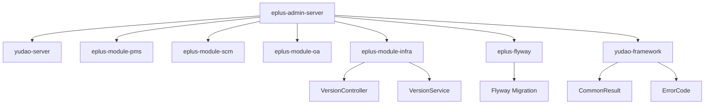
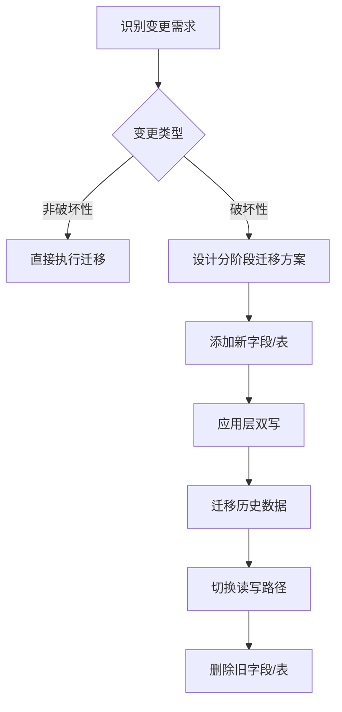
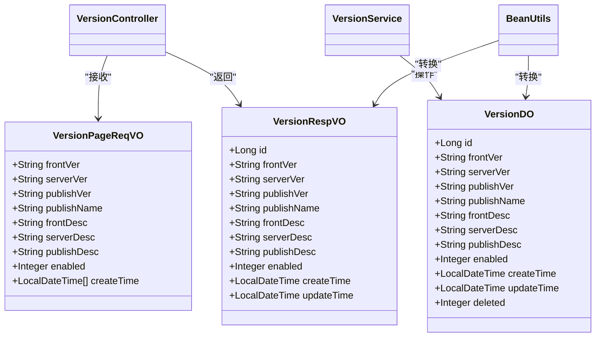
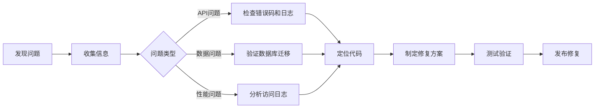

# 兼容性管理

<cite>
**本文档引用文件**  
- [VersionController.java](file://eplus-module-infra/eplus-module-infra-biz/src/main/java/com/syj/eplus/module/infra/controller/admin/version/VersionController.java)
- [VersionService.java](file://eplus-module-infra/eplus-module-infra-biz/src/main/java/com/syj/eplus/module/infra/service/version/VersionService.java)
- [VersionPageReqVO.java](file://eplus-module-infra/eplus-module-infra-biz/src/main/java/com/syj/eplus/module/infra/controller/admin/version/vo/VersionPageReqVO.java)
- [CommonResult.java](file://yudao-framework/yudao-common/src/main/java/cn/iocoder/yudao/framework/common/pojo/CommonResult.java)
- [ErrorCode.java](file://yudao-framework/yudao-common/src/main/java/cn/iocoder/yudao/framework/common/exception/ErrorCode.java)
- [GlobalResponseBodyHandler.java](file://yudao-framework/yudao-spring-boot-starter-web/src/main/java/cn/iocoder/yudao/framework/web/core/handler/GlobalResponseBodyHandler.java)
- [V1_0_0_001__框架初始化.sql](file://eplus-flyway/src/main/resources/db/migration/common/V1_0_0_001__框架初始化.sql)
- [V1_0_0_136__vender表修改ver字段.java](file://eplus-flyway/src/main/java/db/migration/common/V1_0_0_136__vender表修改ver字段.java)
- [V1_0_0_314__让步放行增加验货单详情主键列表.java](file://eplus-flyway/src/main/java/db/migration/common/V1_0_0_314__让步放行增加验货单详情主键列表.java)
- [V1_0_0_202__重建让步放行表.sql](file://eplus-flyway/src/main/resources/db/migration/common/V1_0_0_202__重建让步放行表.sql)
- [V1_0_0_201__新建让步放行表.sql](file://eplus-flyway/src/main/resources/db/migration/common/V1_0_0_201__新建让步放行表.sql)
- [pom.xml](file://pom.xml)
</cite>

## 目录
1. [引言](#引言)
2. [项目结构与版本管理](#项目结构与版本管理)
3. [API兼容性策略](#api兼容性策略)
4. [数据模型迁移方案](#数据模型迁移方案)
5. [向前兼容与向后兼容设计原则](#向前兼容与向后兼容设计原则)
6. [版本号管理机制](#版本号管理机制)
7. [兼容性测试方法与工具](#兼容性测试方法与工具)
8. [版本兼容性问题排查与解决指南](#版本兼容性问题排查与解决指南)
9. [结论](#结论)

## 引言

eplus-admin-server 是一个基于模块化架构的企业级后台管理系统，支持多模块协同开发与部署。随着系统的持续迭代，保障API与数据模型的兼容性成为维护系统稳定性和用户体验的关键。本文档旨在全面阐述eplus-admin-server在版本迭代过程中如何保障兼容性，涵盖接口变更、废弃处理、数据迁移、版本控制、测试验证及问题排查等核心方面，为开发者提供清晰的兼容性管理指导。

## 项目结构与版本管理

eplus-admin-server采用Maven多模块结构，核心模块包括`eplus-module-*`系列业务模块、`yudao-framework`基础框架、`eplus-flyway`数据库迁移模块等。项目通过`pom.xml`文件统一管理版本号，使用`${revision}`占位符实现多模块版本同步。

版本记录功能由`eplus-module-infra`模块提供，通过`VersionController`和`VersionService`接口管理版本信息，包括前端版本、后端版本、发布版本及更新明细。该功能为兼容性管理提供了可视化的历史追踪能力。



**图源**  
- [pom.xml](file://pom.xml)
- [VersionController.java](file://eplus-module-infra/eplus-module-infra-biz/src/main/java/com/syj/eplus/module/infra/controller/admin/version/VersionController.java)
- [VersionService.java](file://eplus-module-infra/eplus-module-infra-biz/src/main/java/com/syj/eplus/module/infra/service/version/VersionService.java)

**本节来源**  
- [pom.xml](file://pom.xml)
- [VersionController.java](file://eplus-module-infra/eplus-module-infra-biz/src/main/java/com/syj/eplus/module/infra/controller/admin/version/VersionController.java)

## API兼容性策略

### 接口变更的兼容性原则

eplus-admin-server遵循RESTful API设计规范，所有接口响应均封装在`CommonResult<T>`对象中，确保了响应结构的统一性和稳定性。该设计是实现向前兼容和向后兼容的基础。

```java
public class CommonResult<T> implements Serializable {
    private Integer code; // 错误码
    private T data;       // 返回数据
    private String msg;   // 错误提示
}
```

当进行接口变更时，系统严格遵守以下原则：
1. **字段添加**：允许在`data`对象中添加新字段，旧客户端会自动忽略未知字段，实现**向前兼容**。
2. **字段删除**：禁止删除已存在的必填字段。对于可选字段，需标记为`@Deprecated`并保留至少两个大版本周期。
3. **字段修改**：禁止修改字段名称或数据类型。如需变更，应新增字段并逐步迁移。
4. **错误码管理**：所有错误码定义在各模块的`ErrorCodeConstants.java`中，采用全局唯一编码（如`1_001_002_000`），确保错误信息的稳定性和可追溯性。

### 废弃接口的处理方式

对于需要废弃的API，系统采用以下流程：
1. **标记废弃**：在接口方法上添加`@Deprecated`注解，并在JavaDoc中说明废弃原因及替代方案。
2. **日志告警**：通过`GlobalResponseBodyHandler`记录所有API访问日志，可配置对废弃接口的调用进行特殊标记和告警。
3. **版本冻结**：在下一个主版本发布时，将废弃接口从API文档中移除，并在代码中保留存根以返回明确的错误信息（如`ErrorCode.NOT_IMPLEMENTED`）。

**本节来源**  
- [CommonResult.java](file://yudao-framework/yudao-common/src/main/java/cn/iocoder/yudao/framework/common/pojo/CommonResult.java)
- [GlobalResponseBodyHandler.java](file://yudao-framework/yudao-spring-boot-starter-web/src/main/java/cn/iocoder/yudao/framework/web/core/handler/GlobalResponseBodyHandler.java)
- [ErrorCode.java](file://yudao-framework/yudao-common/src/main/java/cn/iocoder/yudao/framework/common/exception/ErrorCode.java)

## 数据模型迁移方案

### Flyway数据库迁移机制

eplus-admin-server使用Flyway作为数据库迁移工具，所有数据库变更均通过版本化SQL脚本（如`V1_0_0_001__框架初始化.sql`）或Java迁移类（如`V1_0_0_136__vender表修改ver字段.java`）进行管理。

迁移脚本命名遵循`V{主版本}_{次版本}_{修订版本}_{序号}__{描述}.sql`格式，确保迁移脚本按顺序执行。Flyway通过`flyway_schema_history`表记录已执行的迁移，防止重复执行。

### 迁移类型与兼容性保障

1. **非破坏性变更**：如添加新字段、新表，可直接执行，对现有系统无影响。
   ```sql
   ALTER TABLE scm_concession_release ADD COLUMN quality_inspection_item_ids varchar(100) NULL DEFAULT NULL COMMENT '验货单明细主键列表';
   ```
2. **破坏性变更**：如修改字段类型、删除字段，需分阶段进行：
   - **阶段一**：添加新字段，旧字段标记为`@Deprecated`。
   - **阶段二**：在应用层同时写入新旧字段，确保数据同步。
   - **阶段三**：迁移历史数据，验证无误后，在新版本中停止写入旧字段。
   - **阶段四**：在后续版本中删除旧字段。

3. **表结构重构**：对于重大变更（如`V1_0_0_202__重建让步放行表.sql`），采用“新建-迁移-切换-删除”策略，通过双写和数据校验确保平滑过渡。



**图源**  
- [V1_0_0_136__vender表修改ver字段.java](file://eplus-flyway/src/main/java/db/migration/common/V1_0_0_136__vender表修改ver字段.java)
- [V1_0_0_314__让步放行增加验货单详情主键列表.java](file://eplus-flyway/src/main/java/db/migration/common/V1_0_0_314__让步放行增加验货单详情主键列表.java)
- [V1_0_0_202__重建让步放行表.sql](file://eplus-flyway/src/main/resources/db/migration/common/V1_0_0_202__重建让步放行表.sql)

**本节来源**  
- [V1_0_0_001__框架初始化.sql](file://eplus-flyway/src/main/resources/db/migration/common/V1_0_0_001__框架初始化.sql)
- [V1_0_0_136__vender表修改ver字段.java](file://eplus-flyway/src/main/java/db/migration/common/V1_0_0_136__vender表修改ver字段.java)

## 向前兼容与向后兼容设计原则

### 向前兼容（Forward Compatibility）

向前兼容指新版本的系统能够处理旧版本客户端的请求。eplus-admin-server通过以下方式实现：
- **宽松的请求解析**：使用`@Validated`和`@RequestBody`时，允许请求体包含未知字段。
- **默认值机制**：对于新增的可选参数，提供合理的默认值。
- **版本无关的错误码**：`CommonResult`中的`code`和`msg`字段保持稳定，旧客户端能正确解析错误信息。

### 向后兼容（Backward Compatibility）

向后兼容指旧版本的客户端能够正常使用新版本的系统。实现方式包括：
- **响应结构稳定**：`CommonResult`的`code`、`data`、`msg`三元组结构永不变更。
- **字段只增不减**：API响应中只允许添加新字段，禁止删除或重命名现有字段。
- **数据类型兼容**：避免修改字段的数据类型（如`int`改为`string`），必要时新增字段。

### 兼容性设计模式

系统采用“**版本化数据契约**”模式，将API的请求和响应对象（如`VersionPageReqVO`、`VersionRespVO`）定义在独立的VO包中，与内部数据模型（DO）分离。通过MapStruct等工具进行转换，确保内部重构不影响外部接口。



**图源**  
- [VersionPageReqVO.java](file://eplus-module-infra/eplus-module-infra-biz/src/main/java/com/syj/eplus/module/infra/controller/admin/version/vo/VersionPageReqVO.java)
- [VersionDO.java](file://eplus-module-infra/eplus-module-infra-biz/src/main/java/com/syj/eplus/module/infra/dal/dataobject/version/VersionDO.java)
- [VersionRespVO.java](file://eplus-module-infra/eplus-module-infra-biz/src/main/java/com/syj/eplus/module/infra/controller/admin/version/vo/VersionRespVO.java)

**本节来源**  
- [VersionPageReqVO.java](file://eplus-module-infra/eplus-module-infra-biz/src/main/java/com/syj/eplus/module/infra/controller/admin/version/vo/VersionPageReqVO.java)
- [CommonResult.java](file://yudao-framework/yudao-common/src/main/java/cn/iocoder/yudao/framework/common/pojo/CommonResult.java)

## 版本号管理机制

### 版本号格式

项目采用语义化版本号（Semantic Versioning），格式为`主版本号.次版本号.修订号`（如`1.0.0`），定义如下：
- **主版本号**：当进行不兼容的API变更时递增。
- **次版本号**：当以向后兼容的方式添加功能时递增。
- **修订号**：当进行向后兼容的问题修正时递增。

### 版本号同步

通过Maven的`flatten-maven-plugin`插件，将`${revision}`占位符替换为实际版本号，并同步更新所有模块的`pom.xml`文件，确保整个项目版本一致。

```xml
<plugin>
    <groupId>org.codehaus.mojo</groupId>
    <artifactId>flatten-maven-plugin</artifactId>
    <configuration>
        <flattenMode>resolveCiFriendliesOnly</flattenMode>
        <updatePomFile>true</updatePomFile>
    </configuration>
</plugin>
```

### 版本记录与发布

`VersionController`提供的API允许管理员创建、查询和管理版本记录，包括前端、后端和发布版本。发布新版本时，需在系统中创建对应的版本记录，明确标注变更内容和兼容性影响。

**本节来源**  
- [pom.xml](file://pom.xml)
- [VersionController.java](file://eplus-module-infra/eplus-module-infra-biz/src/main/java/com/syj/eplus/module/infra/controller/admin/version/VersionController.java)

## 兼容性测试方法与工具

### 单元测试与集成测试

每个模块都包含`*-test`子模块，使用JUnit 5进行单元测试。对于涉及数据库变更的迁移脚本，编写集成测试验证其正确性。

```java
@Test
void testGetCount() {
    // 准备参数
    LocalDateTime startTime = LocalDateTime.now().minusDays(1);
    // 调用
    Long count = venderMapper.getCount(startTime, null, null, null, null, null, null, null, null, null, null, null);
    // 断言
    assertNotNull(count);
}
```

### API契约测试

利用Swagger/OpenAPI生成的API文档作为契约，使用工具（如Dredd）进行自动化测试，确保实现与文档一致。`@Operation`和`@Parameter`注解为API提供了丰富的元数据。

### 回归测试

在每次发布前，执行完整的回归测试套件，覆盖所有核心业务流程，确保新变更未破坏现有功能。测试数据通过`clean.sql`等脚本进行初始化。

**本节来源**  
- [WechatServiceImplTest.java](file://eplus-module-social/src/test/java/com/syj/eplus/module/wechat/service/WechatServiceImplTest.java)
- [ApiErrorLogServiceImplTest.java](file://yudao-module-infra/yudao-module-infra-biz/src/test/java/cn/iocoder/yudao/module/infra/service/logger/ApiErrorLogServiceImplTest.java)
- [clean.sql](file://eplus-module-scm/eplus-module-scm-biz/src/test/resources/sql/clean.sql)

## 版本兼容性问题排查与解决指南

### 常见问题类型

1. **API调用失败**：检查`CommonResult`中的`code`和`msg`，对照`ErrorCodeConstants`定位问题。
2. **字段缺失**：确认客户端和服务端版本是否匹配，检查是否有字段被意外删除。
3. **数据类型错误**：检查数据库迁移是否成功，确认Flyway脚本已正确执行。
4. **性能下降**：通过API访问日志分析慢请求，检查新版本是否有性能瓶颈。

### 排查工具与步骤

1. **查看API访问日志**：通过`infra_api_access_log`表分析请求和响应。
2. **检查数据库版本**：查询`flyway_schema_history`表确认所有迁移脚本已应用。
3. **比对版本记录**：通过`/infra/version/page`接口获取当前版本信息，确认部署版本。
4. **启用调试日志**：在`application.yaml`中调整日志级别，获取更详细的执行信息。

### 解决流程



**图源**  
- [ruoyi-vue-pro.sql](file://sql/mysql/ruoyi-vue-pro.sql)
- [V1_0_0_001__框架初始化.sql](file://eplus-flyway/src/main/resources/db/migration/common/V1_0_0_001__框架初始化.sql)

**本节来源**  
- [ruoyi-vue-pro.sql](file://sql/mysql/ruoyi-vue-pro.sql)
- [VersionController.java](file://eplus-module-infra/eplus-module-infra-biz/src/main/java/com/syj/eplus/module/infra/controller/admin/version/VersionController.java)

## 结论

eplus-admin-server通过一套完整的兼容性管理体系，确保了系统在持续迭代过程中的稳定性和可靠性。该体系以`CommonResult`为核心，结合Flyway数据库迁移、语义化版本控制、严格的API变更策略和全面的测试验证，为开发者提供了清晰的指导。遵循本文档的实践，可以有效避免兼容性问题，保障用户体验，实现系统的平滑升级。