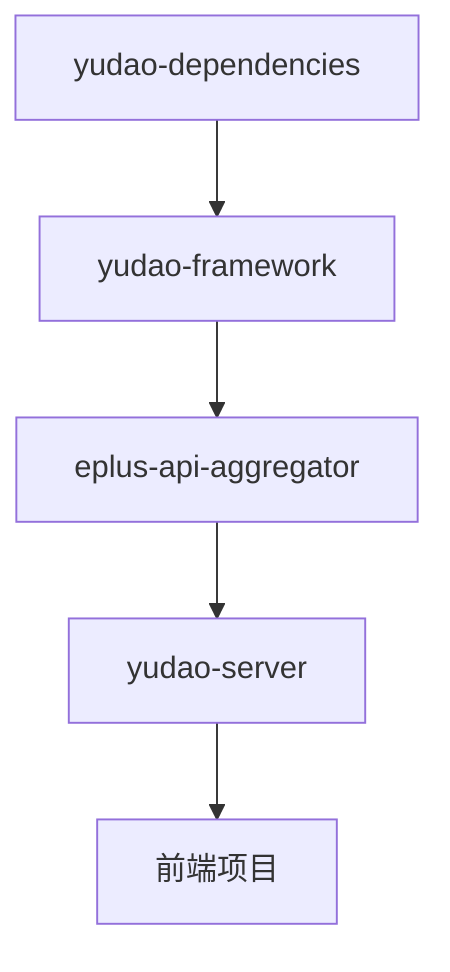
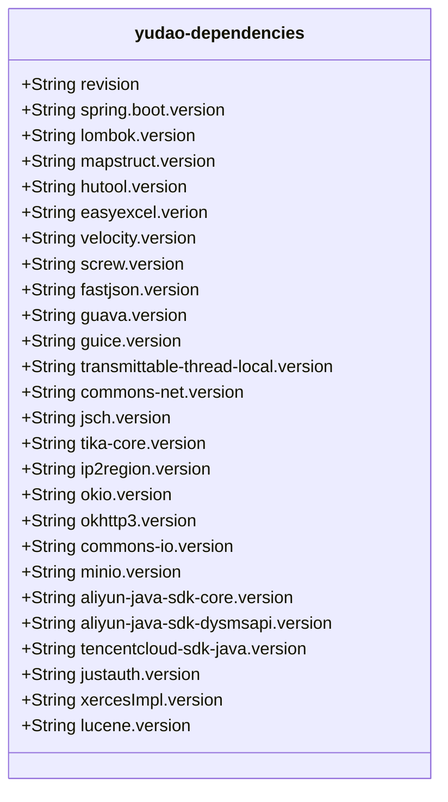
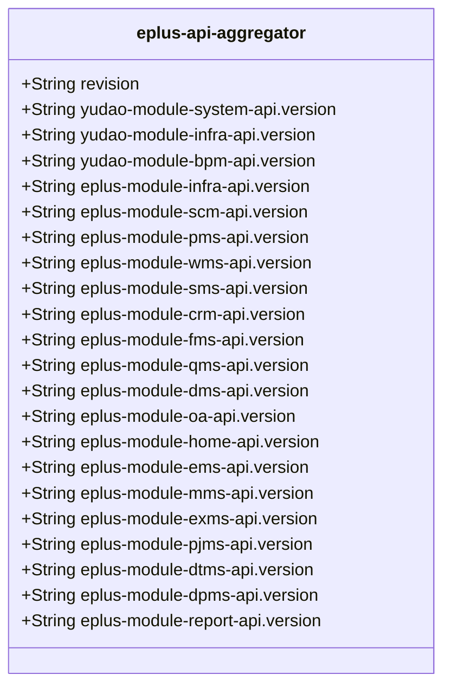
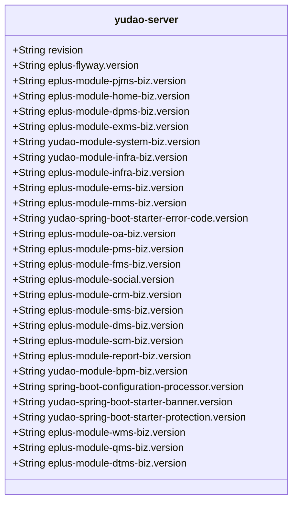

# 升级流程

<cite>
**本文档引用的文件**   
- [pom.xml](file://pom.xml)
- [yudao-dependencies/pom.xml](file://yudao-dependencies/pom.xml)
- [eplus-api-aggregator/pom.xml](file://eplus-api-aggregator/pom.xml)
- [yudao-server/pom.xml](file://yudao-server/pom.xml)
- [yudao-server/Dockerfile](file://yudao-server/Dockerfile)
- [docker-compose.yml](file://docker-compose.yml)
- [eplus-flyway/pom.xml](file://eplus-flyway/pom.xml)
- [README.md](file://README.md)
</cite>

## 目录
1. [简介](#简介)
2. [项目结构](#项目结构)
3. [核心组件](#核心组件)
4. [架构概述](#架构概述)
5. [详细组件分析](#详细组件分析)
6. [依赖分析](#依赖分析)
7. [性能考虑](#性能考虑)
8. [故障排除指南](#故障排除指南)
9. [结论](#结论)

## 简介
eplus-admin-server 是一个基于 Spring Boot 的企业级 ERP 管理系统，涵盖供应链、销售、仓储、财务、CRM 等多个业务领域。本项目基于 ruoyi-vue-pro 框架进行深度定制开发，采用主流技术栈，提供完整的权限管理、工作流审批、数据权限控制等企业级特性。本文档详细描述了从开发到发布的完整升级流程，包括依赖版本的统一管理、模块间的版本协调、自动化构建和部署流程。

**Section sources**
- [README.md](file://README.md#L1-L747)

## 项目结构
eplus-admin-server 采用模块化设计，整体架构清晰，分为核心基础层、系统基础模块、核心业务模块、工具模块和应用启动模块。每个模块都有明确的职责和依赖关系，确保系统的可维护性和可扩展性。

```mermaid
graph TD
subgraph "核心基础层"
A[yudao-dependencies] --> B[yudao-framework]
B --> C[eplus-framework]
end
subgraph "系统基础模块"
D[yudao-module-system]
E[yudao-module-infra]
F[eplus-module-infra]
G[yudao-module-bpm]
end
subgraph "核心业务模块"
H[eplus-module-scm]
I[eplus-module-sms]
J[eplus-module-wms]
K[eplus-module-fms]
L[eplus-module-pms]
M[eplus-module-crm]
N[eplus-module-qms]
O[eplus-module-mms]
P[eplus-module-dms]
Q[eplus-module-oa]
R[eplus-module-home]
S[eplus-module-dpms]
T[eplus-module-dtms]
U[eplus-module-ems]
V[eplus-module-exms]
W[eplus-module-pjms]
X[eplus-module-report]
Y[eplus-module-social]
end
subgraph "工具模块"
Z[eplus-api-aggregator]
AA[eplus-flyway]
end
subgraph "应用启动"
AB[yudao-server]
end
A --> AB
B --> AB
C --> AB
D --> AB
E --> AB
F --> AB
G --> AB
H --> AB
I --> AB
J --> AB
K --> AB
L --> AB
M --> AB
N --> AB
O --> AB
P --> AB
Q --> AB
R --> AB
S --> AB
T --> AB
U --> AB
V --> AB
W --> AB
X --> AB
Y --> AB
Z --> AB
AA --> AB
```

**Diagram sources **
- [README.md](file://README.md#L60-L179)

**Section sources**
- [README.md](file://README.md#L58-L179)

## 核心组件
eplus-admin-server 的核心组件包括 yudao-dependencies、yudao-framework、eplus-api-aggregator 和 yudao-server。这些组件共同构成了系统的基础设施，确保了项目的稳定性和可维护性。

**Section sources**
- [pom.xml](file://pom.xml#L1-L171)
- [yudao-dependencies/pom.xml](file://yudao-dependencies/pom.xml#L1-L689)
- [eplus-api-aggregator/pom.xml](file://eplus-api-aggregator/pom.xml#L1-L151)
- [yudao-server/pom.xml](file://yudao-server/pom.xml#L1-L199)

## 架构概述
eplus-admin-server 采用分层架构，分为核心基础层、系统基础模块、核心业务模块、工具模块和应用启动模块。核心基础层通过 yudao-dependencies 和 yudao-framework 提供统一的依赖管理和基础框架支持。系统基础模块和核心业务模块通过 API 聚合模块 eplus-api-aggregator 统一管理所有业务模块的 API 依赖。应用启动模块 yudao-server 通过引入需要的业务模块依赖，实现提供 RESTful API 给前端项目。

**Diagram sources **
- [pom.xml](file://pom.xml#L66-L76)
- [yudao-dependencies/pom.xml](file://yudao-dependencies/pom.xml#L78-L655)
- [eplus-api-aggregator/pom.xml](file://eplus-api-aggregator/pom.xml#L24-L148)
- [yudao-server/pom.xml](file://yudao-server/pom.xml#L23-L172)

## 详细组件分析
### yudao-dependencies 分析
yudao-dependencies 是 Maven BOM 文件，用于管理整个项目的依赖版本。通过引入 yudao-dependencies，可以确保所有模块使用统一的依赖版本，避免版本冲突。

**Diagram sources **
- [yudao-dependencies/pom.xml](file://yudao-dependencies/pom.xml#L16-L76)

**Section sources**
- [yudao-dependencies/pom.xml](file://yudao-dependencies/pom.xml#L1-L689)

### eplus-api-aggregator 分析
eplus-api-aggregator 是 API 聚合模块，统一管理所有业务模块的 API 依赖。通过引入 eplus-api-aggregator，可以简化业务模块的依赖声明，只需引入本模块即可获得所有 API。

**Diagram sources **
- [eplus-api-aggregator/pom.xml](file://eplus-api-aggregator/pom.xml#L24-L148)

**Section sources**
- [eplus-api-aggregator/pom.xml](file://eplus-api-aggregator/pom.xml#L1-L151)

### yudao-server 分析
yudao-server 是后端 Server 的主项目，通过引入需要的业务模块依赖，实现提供 RESTful API 给前端项目。本质上来说，它就是一个空壳（容器）。

**Diagram sources **
- [yudao-server/pom.xml](file://yudao-server/pom.xml#L23-L172)

**Section sources**
- [yudao-server/pom.xml](file://yudao-server/pom.xml#L1-L199)

## 依赖分析
eplus-admin-server 通过 yudao-dependencies 和 eplus-api-aggregator 实现了依赖版本的集中控制和统一升级。yudao-dependencies 通过 Maven BOM 机制管理所有依赖版本，确保所有模块使用统一的依赖版本。eplus-api-aggregator 通过聚合所有业务模块的 API 依赖，简化了业务模块的依赖声明。

**Diagram sources **
- [pom.xml](file://pom.xml#L66-L76)
- [yudao-dependencies/pom.xml](file://yudao-dependencies/pom.xml#L78-L655)
- [eplus-api-aggregator/pom.xml](file://eplus-api-aggregator/pom.xml#L24-L148)
- [yudao-server/pom.xml](file://yudao-server/pom.xml#L23-L172)

**Section sources**
- [pom.xml](file://pom.xml#L1-L171)
- [yudao-dependencies/pom.xml](file://yudao-dependencies/pom.xml#L1-L689)
- [eplus-api-aggregator/pom.xml](file://eplus-api-aggregator/pom.xml#L1-L151)
- [yudao-server/pom.xml](file://yudao-server/pom.xml#L1-L199)

## 性能考虑
eplus-admin-server 通过多种方式优化性能，包括使用 Redis 缓存、数据库连接池优化、异步任务处理等。这些优化措施确保了系统的高性能和高可用性。

**Section sources**
- [README.md](file://README.md#L594-L648)

## 故障排除指南
eplus-admin-server 提供了详细的故障排除指南，帮助开发者解决常见的问题。例如，启动时报错 "Cannot determine embedded database driver class" 可以通过检查数据库配置是否正确，确保 MySQL 已启动来解决。

**Section sources**
- [README.md](file://README.md#L652-L669)

## 结论
eplus-admin-server 通过模块化设计、依赖版本的集中控制和统一升级、自动化构建和部署流程，实现了从开发到发布的完整升级流程。通过 yudao-dependencies 和 eplus-api-aggregator，确保了项目的稳定性和可维护性。通过详细的测试验证流程，确保了版本发布前的质量。通过版本升级操作指南，提供了依赖更新、冲突解决、回滚机制等关键步骤，确保了版本升级的顺利进行。