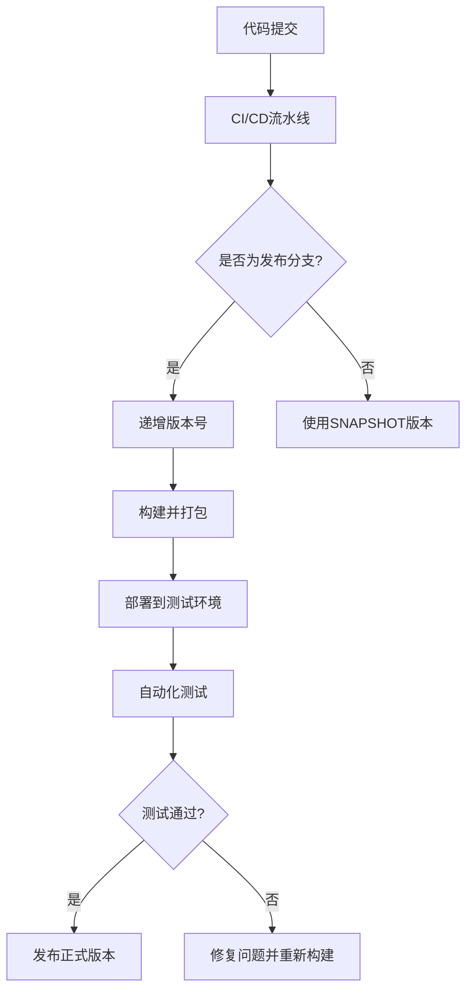
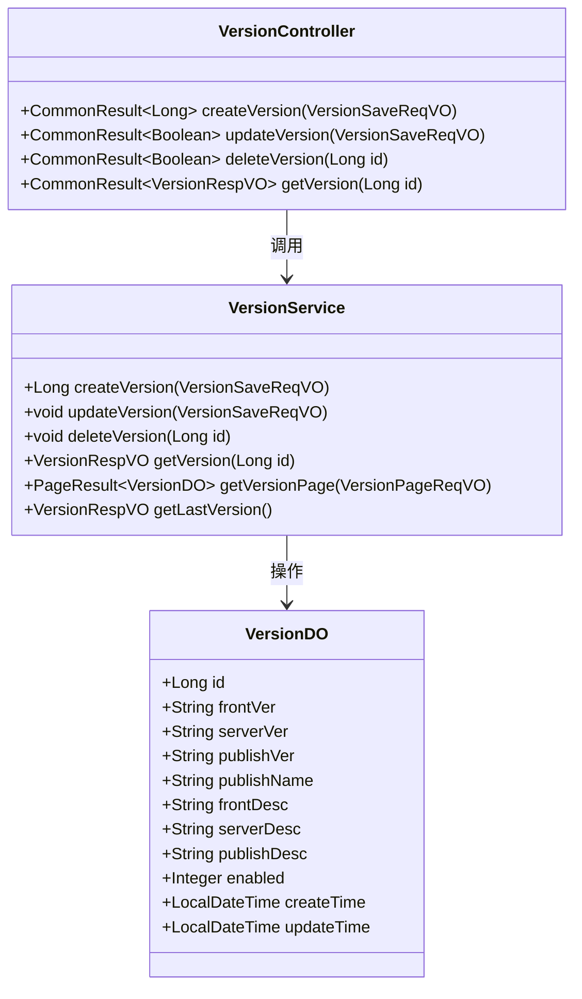

# 版本规范

<cite>
**本文档引用文件**   
- [pom.xml](file://pom.xml)
- [yudao-dependencies/pom.xml](file://yudao-dependencies/pom.xml)
- [eplus-module-infra/eplus-module-infra-biz/src/main/java/com/syj/eplus/module/infra/dal/dataobject/version/VersionDO.java](file://eplus-module-infra/eplus-module-infra-biz/src/main/java/com/syj/eplus/module/infra/dal/dataobject/version/VersionDO.java)
- [eplus-flyway/src/main/resources/db/migration/common/V1_0_0_484__增加版本表.sql](file://eplus-flyway/src/main/resources/db/migration/common/V1_0_0_484__增加版本表.sql)
- [eplus-module-infra/eplus-module-infra-biz/src/main/java/com/syj/eplus/module/infra/service/version/VersionService.java](file://eplus-module-infra/eplus-module-infra-biz/src/main/java/com/syj/eplus/module/infra/service/version/VersionService.java)
- [eplus-module-infra/eplus-module-infra-biz/src/main/java/com/syj/eplus/module/infra/controller/admin/version/VersionController.java](file://eplus-module-infra/eplus-module-infra-biz/src/main/java/com/syj/eplus/module/infra/controller/admin/version/VersionController.java)
</cite>

## 目录
1. [引言](#引言)
2. [语义化版本控制规范](#语义化版本控制规范)
3. [模块版本号命名约定](#模块版本号命名约定)
4. [版本号与功能迭代、Bug修复、架构升级的对应关系](#版本号与功能迭代bug修复架构升级的对应关系)
5. [版本号管理最佳实践](#版本号管理最佳实践)
6. [版本标签与分支管理策略](#版本标签与分支管理策略)
7. [通过版本号快速定位问题](#通过版本号快速定位问题)
8. [结论](#结论)

## 引言

eplus-admin-server项目采用语义化版本控制（Semantic Versioning）规范，以确保版本管理的清晰性和可预测性。该项目是一个基于Spring Boot的企业级ERP管理系统，涵盖供应链、销售、仓储、财务、CRM等多个业务领域。通过遵循语义化版本控制规范，项目团队能够更好地管理功能迭代、Bug修复和架构升级，从而提高开发效率和系统稳定性。

## 语义化版本控制规范

eplus-admin-server项目采用语义化版本控制规范，版本号格式为`主版本号.次版本号.修订号`，例如`1.0.0`。每个部分的具体含义如下：

- **主版本号（Major）**：当进行不兼容的API更改或重大功能更新时递增。这通常意味着引入了新的特性或对现有功能进行了重大修改，可能导致旧版本的客户端无法正常工作。
- **次版本号（Minor）**：当添加向后兼容的功能时递增。这表示新增了功能但不影响现有功能的使用，用户可以安全地升级到新版本。
- **修订号（Patch）**：当进行向后兼容的问题修正时递增。这通常用于修复Bug或进行小的改进，不会引入新功能。

在项目中，版本号通过Maven的`pom.xml`文件进行管理，使用`${revision}`占位符来统一版本号。例如，在根`pom.xml`文件中定义了`<revision>1.0.0</revision>`，所有子模块都继承此版本号。这种集中式管理方式确保了整个项目的版本一致性。

**Section sources**
- [pom.xml](file://pom.xml#L51)
- [yudao-dependencies/pom.xml](file://yudao-dependencies/pom.xml#L17)

## 模块版本号命名约定

eplus-admin-server项目中的各个模块遵循统一的版本号命名约定，以确保模块间的依赖关系清晰且易于管理。每个模块的版本号均继承自根项目的`<revision>`属性，确保所有模块版本同步更新。

模块命名遵循以下格式：
- **Parent模块**：`{project}-module-{name}`，如`eplus-module-scm`
- **API模块**：`{project}-module-{name}-api`，如`eplus-module-scm-api`
- **BIZ模块**：`{project}-module-{name}-biz`，如`eplus-module-scm-biz`

其中，`{project}`为项目名称，`{name}`为模块名称。API模块负责定义接口、DTO和枚举，BIZ模块实现具体的业务逻辑。通过这种分层设计，实现了API与实现的解耦，便于跨模块调用和维护。

此外，项目中还存在SNAPSHOT版本，用于开发过程中的临时构建。SNAPSHOT版本表示当前开发中的不稳定版本，每次构建都会自动更新时间戳，确保开发者获取最新的代码变更。例如，`1.0.0-SNAPSHOT`表示主版本1.0.0的开发中版本。

**Section sources**
- [pom.xml](file://pom.xml#L51)
- [eplus-module-crm/pom.xml](file://eplus-module-crm/pom.xml#L9)
- [eplus-module-dms/pom.xml](file://eplus-module-dms/pom.xml#L9)

## 版本号与功能迭代、Bug修复、架构升级的对应关系

在eplus-admin-server项目中，版本号的变更与功能迭代、Bug修复和架构升级之间存在明确的对应关系：

- **主版本号变更**：当项目进行重大架构升级或引入不兼容的API更改时，主版本号递增。例如，从`1.x.x`升级到`2.0.0`可能涉及数据库结构的重大调整或核心服务的重构。
- **次版本号变更**：当项目添加新的功能模块或扩展现有功能时，次版本号递增。这些变更必须保持向后兼容，确保现有功能不受影响。例如，新增一个报表模块或扩展订单管理功能。
- **修订号变更**：当项目修复Bug或进行小的性能优化时，修订号递增。这类变更不引入新功能，仅解决已知问题。例如，修复某个接口的空指针异常或优化查询性能。

通过这种严格的版本控制策略，项目团队能够清晰地传达每次发布的变更内容，帮助用户和开发者理解升级的影响范围。

**Section sources**
- [README.md](file://README.md#L709-L743)
- [pom.xml](file://pom.xml#L51)

## 版本号管理最佳实践

为了有效管理版本号，eplus-admin-server项目采用了以下最佳实践：

1. **集中式版本管理**：通过根`pom.xml`文件中的`<revision>`属性统一管理所有模块的版本号，避免版本不一致问题。
2. **使用Flatten插件**：利用`flatten-maven-plugin`将复杂的多模块项目扁平化，生成简化的`pom.xml`文件，便于发布和依赖管理。
3. **自动化构建流程**：结合CI/CD工具，实现版本号的自动递增和发布，减少人为错误。
4. **版本记录表**：在数据库中创建`infra_version`表，记录每次发布的版本信息，包括前端版本、后端版本、发布版本及更新明细，便于追溯和审计。

这些实践确保了版本管理的高效性和可靠性，支持项目的持续集成和交付。

**Diagram sources **
- [pom.xml](file://pom.xml#L127-L154)
- [eplus-flyway/src/main/resources/db/migration/common/V1_0_0_484__增加版本表.sql](file://eplus-flyway/src/main/resources/db/migration/common/V1_0_0_484__增加版本表.sql#L1-L47)

## 版本标签与分支管理策略

eplus-admin-server项目采用Git进行版本控制，结合Maven的版本管理机制，实施以下分支和标签管理策略：

- **主分支（main）**：代表生产环境的稳定版本，仅允许通过合并发布分支的方式更新。
- **开发分支（develop）**：集成所有功能开发的主干分支，每日构建使用SNAPSHOT版本。
- **功能分支（feature/*）**：每个新功能或Bug修复都在独立的分支上进行，完成后合并至develop分支。
- **发布分支（release/*）**：当develop分支达到发布标准时，创建发布分支进行最后的测试和修复，完成后合并至main分支并打上版本标签。

版本标签遵循`vX.Y.Z`格式，如`v1.0.0`，并与Git标签关联，确保每个发布版本都有唯一的标识。通过这种方式，团队可以快速回滚到任意历史版本，保障系统的稳定性。

**Section sources**
- [pom.xml](file://pom.xml#L51)
- [README.md](file://README.md#L540-L550)

## 通过版本号快速定位问题

在eplus-admin-server项目中，版本号不仅是发布标识，更是问题定位的重要依据。通过以下方式，团队能够快速定位和解决问题：

1. **版本记录查询**：通过`infra_version`表查询特定版本的发布信息，了解该版本包含的功能和修复的Bug。
2. **日志关联分析**：在系统日志中记录当前运行的版本号，结合时间戳和操作日志，快速定位问题发生的具体版本。
3. **API版本化管理**：对RESTful API进行版本化管理，如`/api/v1/resource`，确保不同版本的客户端可以共存，避免因升级导致的服务中断。
4. **错误码映射**：每个版本维护独立的错误码文档，帮助开发者根据错误码快速查找问题原因。

这些机制共同构成了一个完整的版本追踪体系，提升了问题排查的效率和准确性。

**Diagram sources **
- [eplus-module-infra/eplus-module-infra-biz/src/main/java/com/syj/eplus/module/infra/dal/dataobject/version/VersionDO.java](file://eplus-module-infra/eplus-module-infra-biz/src/main/java/com/syj/eplus/module/infra/dal/dataobject/version/VersionDO.java#L1-L63)
- [eplus-module-infra/eplus-module-infra-biz/src/main/java/com/syj/eplus/module/infra/service/version/VersionService.java](file://eplus-module-infra/eplus-module-infra-biz/src/main/java/com/syj/eplus/module/infra/service/version/VersionService.java#L1-L58)
- [eplus-module-infra/eplus-module-infra-biz/src/main/java/com/syj/eplus/module/infra/controller/admin/version/VersionController.java](file://eplus-module-infra/eplus-module-infra-biz/src/main/java/com/syj/eplus/module/infra/controller/admin/version/VersionController.java#L1-L65)

## 结论

eplus-admin-server项目通过严格的语义化版本控制规范，实现了高效的版本管理。主版本号、次版本号和修订号的明确划分，使得功能迭代、Bug修复和架构升级的变更得以清晰表达。模块化的版本命名约定和SNAPSHOT版本的合理使用，进一步增强了开发过程的灵活性和可控性。结合版本标签、分支管理和问题定位机制，项目团队能够高效协作，确保系统的稳定性和可维护性。未来，建议进一步完善自动化发布流程，提升版本管理的智能化水平。