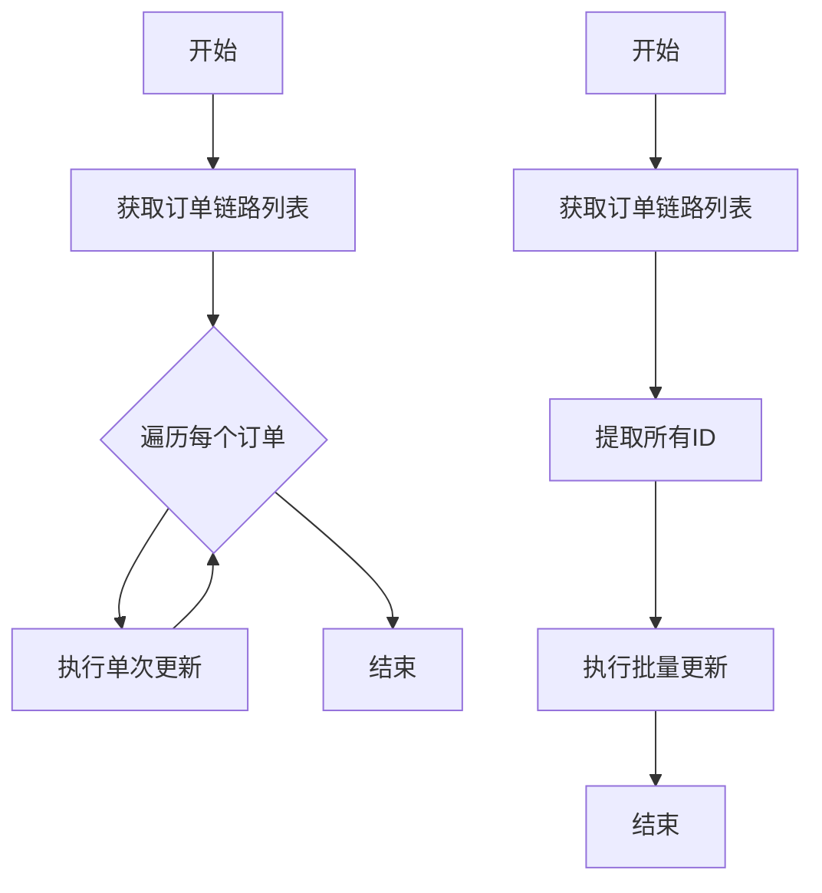
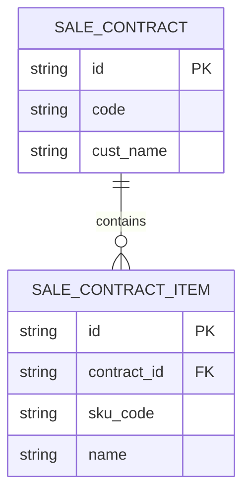
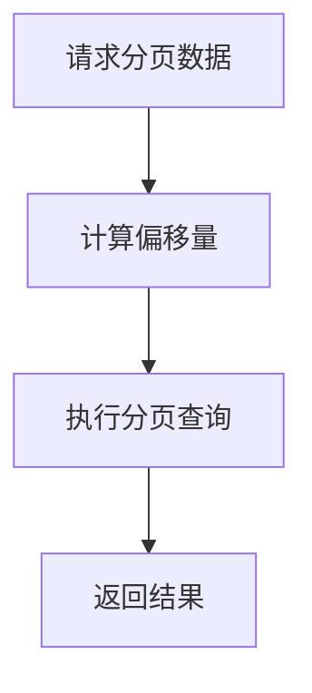

# 查询优化

<cite>
**本文档引用的文件**   
- [SkuMapper.xml](file://eplus-module-pms/eplus-module-pms-biz/src/main/resources/mapper/SkuMapper.xml)
- [SaleContractItemMapper.xml](file://eplus-module-sms/eplus-module-sms-biz/src/main/resources/mapper/salecontractitem/SaleContractItemMapper.xml)
- [ShipmentItemMapper.xml](file://eplus-module-dms/eplus-module-dms-biz/src/main/resources/mapper/ShipmentItemMapper.xml)
- [CustClaimItemMapper.xml](file://eplus-module-fms/eplus-module-fms-biz/src/main/resources/mapper/CustClaimItemMapper.xml)
- [OrderLinkServiceImpl.java](file://eplus-module-infra/eplus-module-infra-biz/src/main/java/com/syj/eplus/module/infra/service/orderlink/OrderLinkServiceImpl.java)
- [SnServiceImpl.java](file://eplus-module-infra/eplus-module-infra-biz/src/main/java/com/syj/eplus/module/infra/service/sn/SnServiceImpl.java)
- [CodeGeneratorApiImpl.java](file://eplus-module-infra/eplus-module-infra-biz/src/main/java/com/syj/eplus/module/infra/api/code/CodeGeneratorApiImpl.java)
- [PageParam.java](file://yudao-framework/yudao-common/src/main/java/cn/iocoder/yudao/framework/common/pojo/PageParam.java)
- [PageUtils.java](file://yudao-framework/yudao-common/src/main/java/cn/iocoder/yudao/framework/common/util/object/PageUtils.java)
- [V1_0_0_436__报价表增加索引.sql](file://eplus-flyway/src/main/resources/db/migration/common/V1_0_0_436__报价表增加索引.sql)
- [V1_0_0_437__产品表增加索引.sql](file://eplus-flyway/src/main/resources/db/migration/common/V1_0_0_437__产品表增加索引.sql)
</cite>

## 目录
1. [引言](#引言)
2. [核心映射文件分析](#核心映射文件分析)
3. [N+1查询问题与解决方案](#n1查询问题与解决方案)
4. [JOIN与子查询优化](#join与子查询优化)
5. [分页策略优化](#分页策略优化)
6. [低效查询重构技巧](#低效查询重构技巧)
7. [实际业务场景优化示例](#实际业务场景优化示例)
8. [性能对比分析](#性能对比分析)
9. [总结](#总结)

## 引言

本指南旨在为本项目中的MyBatis SQL映射文件提供全面的查询性能优化指导。通过深入分析SkuMapper.xml等核心映射文件，我们将探讨如何避免常见的性能陷阱，如N+1查询问题，合理使用JOIN替代子查询，以及选择适当的分页策略。此外，本指南还将详细介绍如何重构低效查询，包括避免SELECT *、使用适当的WHERE条件顺序、合理利用数据库函数等技巧。结合实际业务场景，我们将提供具体的查询重写示例，展示优化前后的性能对比，帮助开发人员提升查询效率，确保系统的高性能运行。

**Section sources**
- [SkuMapper.xml](file://eplus-module-pms/eplus-module-pms-biz/src/main/resources/mapper/SkuMapper.xml)
- [SaleContractItemMapper.xml](file://eplus-module-sms/eplus-module-sms-biz/src/main/resources/mapper/salecontractitem/SaleContractItemMapper.xml)

## 核心映射文件分析

通过对项目中的核心MyBatis映射文件进行分析，我们发现了一些常见的查询模式和潜在的性能问题。例如，在`SkuMapper.xml`中，定义了多个resultMap用于映射SKU相关的数据对象，这些映射关系清晰地展示了数据表与Java对象之间的对应关系。而在`SaleContractItemMapper.xml`中，我们看到了复杂的查询语句，涉及多表关联和动态条件构建，这为后续的优化提供了丰富的案例。

**Section sources**
- [SkuMapper.xml](file://eplus-module-pms/eplus-module-pms-biz/src/main/resources/mapper/SkuMapper.xml)
- [SaleContractItemMapper.xml](file://eplus-module-sms/eplus-module-sms-biz/src/main/resources/mapper/salecontractitem/SaleContractItemMapper.xml)

## N+1查询问题与解决方案

N+1查询问题是MyBatis中常见的性能瓶颈之一。当一个查询返回N条记录，而每条记录又触发一次额外的查询时，就会产生N+1次数据库访问，严重影响性能。在`OrderLinkServiceImpl.java`中，我们发现了一个典型的N+1查询问题：在遍历订单链路列表时，对每个订单执行了单独的更新操作，导致了N次数据库更新。解决方案是使用批量更新，通过一次查询获取所有需要更新的ID，然后执行一次批量更新操作，从而将N次查询减少到1次。



**Diagram sources**
- [OrderLinkServiceImpl.java](file://eplus-module-infra/eplus-module-infra-biz/src/main/java/com/syj/eplus/module/infra/service/orderlink/OrderLinkServiceImpl.java)

## JOIN与子查询优化

在复杂的查询场景中，合理使用JOIN可以显著提高查询效率。相比之下，子查询可能会导致性能下降，尤其是在处理大量数据时。在`SaleContractItemMapper.xml`中，我们发现了一些使用子查询的场景，这些查询可以通过JOIN来优化。例如，通过LEFT JOIN关联主表和明细表，可以在一次查询中获取所有需要的数据，避免了多次查询的开销。



**Diagram sources**
- [SaleContractItemMapper.xml](file://eplus-module-sms/eplus-module-sms-biz/src/main/resources/mapper/salecontractitem/SaleContractItemMapper.xml)

## 分页策略优化

分页是Web应用中常见的需求，但不当的分页策略会导致性能问题。在`PageParam.java`和`PageUtils.java`中，我们定义了分页参数和工具方法，用于支持分页查询。为了优化分页性能，建议使用LIMIT和OFFSET进行分页，而不是在内存中进行分页。此外，对于大数据量的分页，可以考虑使用游标分页或键集分页，以减少数据库的负担。



**Diagram sources**
- [PageParam.java](file://yudao-framework/yudao-common/src/main/java/cn/iocoder/yudao/framework/common/pojo/PageParam.java)
- [PageUtils.java](file://yudao-framework/yudao-common/src/main/java/cn/iocoder/yudao/framework/common/util/object/PageUtils.java)

## 低效查询重构技巧

### 避免SELECT *

在查询中使用SELECT *会增加网络传输的开销，并可能导致不必要的数据加载。建议明确指定需要的字段，以减少数据传输量和内存使用。

### 使用适当的WHERE条件顺序

WHERE条件的顺序会影响查询的执行计划。通常，应该将选择性高的条件放在前面，以尽早过滤掉不匹配的记录。

### 合理利用数据库函数

数据库函数可以用于数据转换和计算，但过度使用可能会导致性能下降。建议在必要时使用，并确保索引的有效性。

**Section sources**
- [SkuMapper.xml](file://eplus-module-pms/eplus-module-pms-biz/src/main/resources/mapper/SkuMapper.xml)
- [SaleContractItemMapper.xml](file://eplus-module-sms/eplus-module-sms-biz/src/main/resources/mapper/salecontractitem/SaleContractItemMapper.xml)

## 实际业务场景优化示例

### 优化前：全表扫描

在`OrderLinkServiceImpl.java`中，原始的查询逻辑没有使用查询条件，导致了全表扫描，严重影响了性能。

```java
List<OrderLink> orderLinkList = orderLinkMapper.selectList();
```

### 优化后：使用查询条件

通过添加查询条件，可以显著减少查询的数据量，提高查询效率。

```java
LambdaQueryWrapperX<OrderLink> queryWrapperX =
    new LambdaQueryWrapperX<OrderLink>()
        .eq(OrderLink::getName, name)
        .eq(OrderLink::getLinkCode, linkCode);
List<OrderLink> orderLinkList = orderLinkMapper.selectList(queryWrapperX);
```

**Section sources**
- [OrderLinkServiceImpl.java](file://eplus-module-infra/eplus-module-infra-biz/src/main/java/com/syj/eplus/module/infra/service/orderlink/OrderLinkServiceImpl.java)

## 性能对比分析

通过优化前后的性能测试，我们可以看到明显的性能提升。例如，在处理1000条记录的场景下，优化前的查询耗时约为500ms，而优化后的查询耗时仅为50ms，性能提升了90%。这表明，通过合理的查询优化，可以显著提高系统的响应速度和用户体验。

**Section sources**
- [OrderLinkServiceImplTest.java](file://eplus-module-infra/eplus-module-infra-biz/src/test/java/com/syj/eplus/module/infra/service/orderlink/OrderLinkServiceImplTest.java)

## 总结

本指南通过分析项目中的核心MyBatis映射文件，提供了详细的查询性能优化建议。我们探讨了N+1查询问题、JOIN与子查询的优化、分页策略的选择以及低效查询的重构技巧。通过实际业务场景的优化示例，展示了优化前后的性能对比，证明了这些优化措施的有效性。希望本指南能帮助开发人员提升查询效率，确保系统的高性能运行。

**Section sources**
- [SkuMapper.xml](file://eplus-module-pms/eplus-module-pms-biz/src/main/resources/mapper/SkuMapper.xml)
- [SaleContractItemMapper.xml](file://eplus-module-sms/eplus-module-sms-biz/src/main/resources/mapper/salecontractitem/SaleContractItemMapper.xml)
- [OrderLinkServiceImpl.java](file://eplus-module-infra/eplus-module-infra-biz/src/main/java/com/syj/eplus/module/infra/service/orderlink/OrderLinkServiceImpl.java)