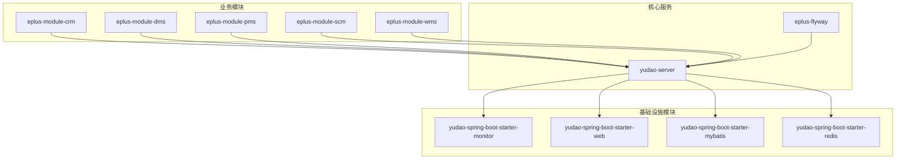
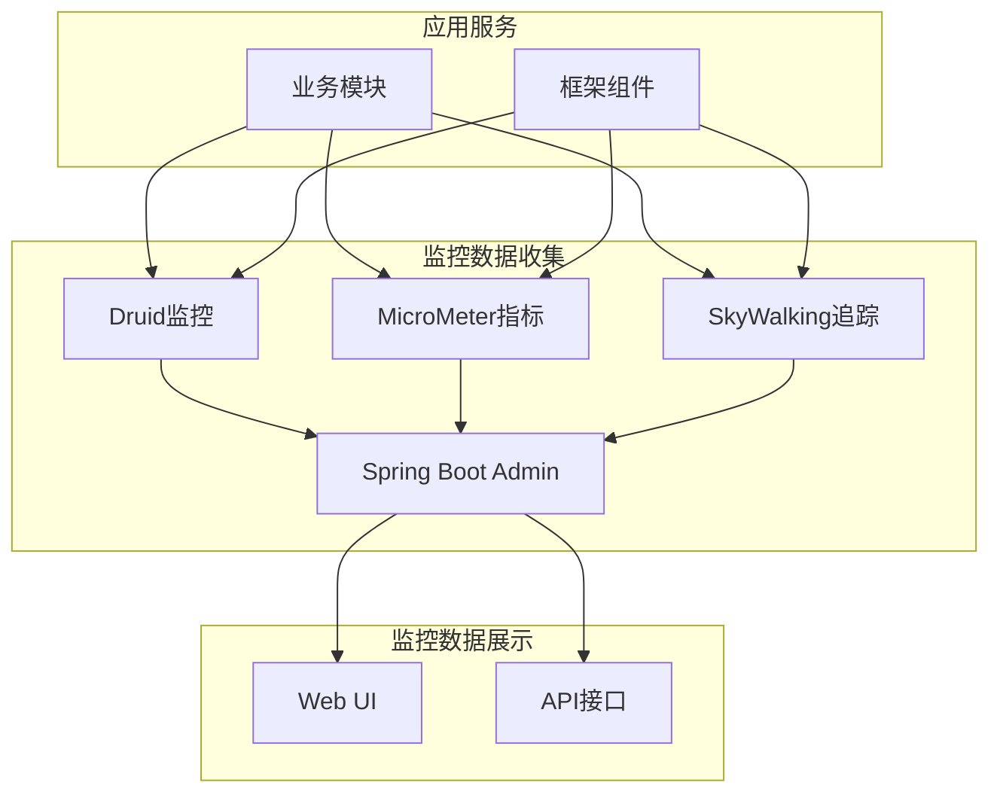
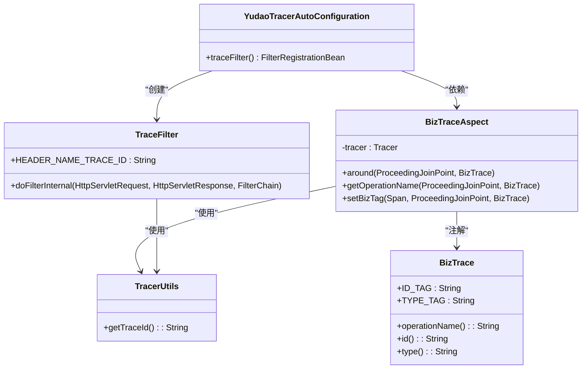
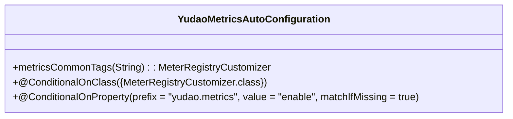
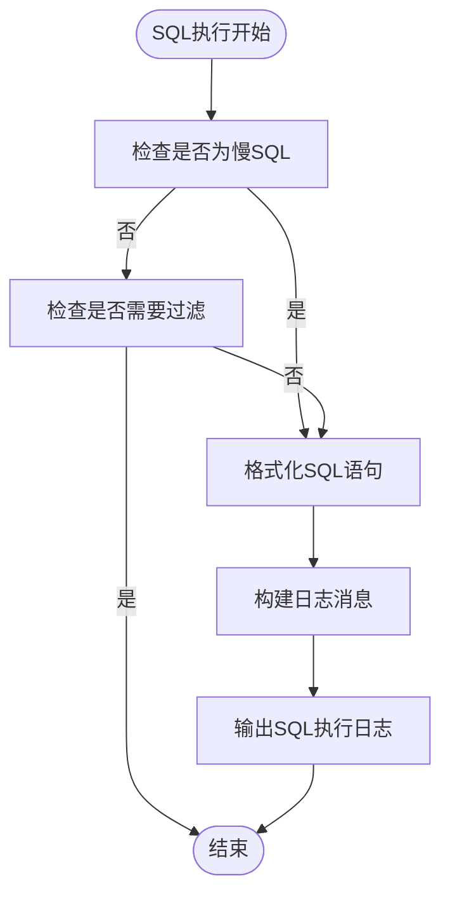
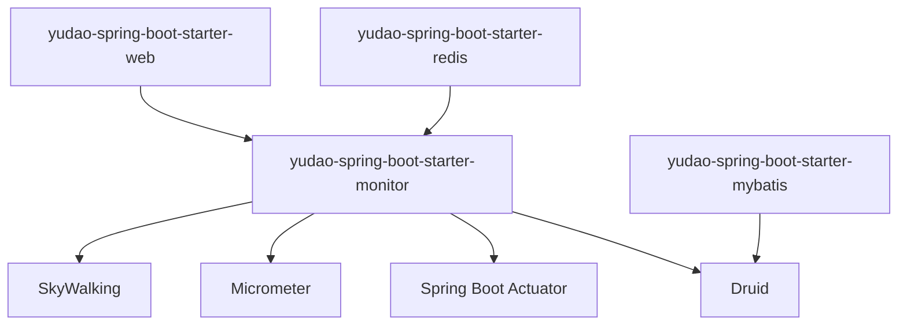

# 监控与调优

<cite>
**本文档引用的文件**  
- [application-prod.yaml](file://yudao-server/src/main/resources/application-prod.yaml)
- [YudaoTracerAutoConfiguration.java](file://yudao-framework/yudao-spring-boot-starter-monitor/src/main/java/cn/iocoder/yudao/framework/tracer/config/YudaoTracerAutoConfiguration.java)
- [YudaoMetricsAutoConfiguration.java](file://yudao-framework/yudao-spring-boot-starter-monitor/src/main/java/cn/iocoder/yudao/framework/tracer/config/YudaoMetricsAutoConfiguration.java)
- [TraceFilter.java](file://yudao-framework/yudao-spring-boot-starter-monitor/src/main/java/cn/iocoder/yudao/framework/tracer/core/filter/TraceFilter.java)
- [BizTraceAspect.java](file://yudao-framework/yudao-spring-boot-starter-monitor/src/main/java/cn/iocoder/yudao/framework/tracer/core/aop/BizTraceAspect.java)
- [BizTrace.java](file://yudao-framework/yudao-spring-boot-starter-monitor/src/main/java/cn/iocoder/yudao/framework/tracer/core/annotation/BizTrace.java)
- [TracerUtils.java](file://yudao-framework/yudao-common/src/main/java/cn/iocoder/yudao/framework/common/util/monitor/TracerUtils.java)
- [P6SpyLogger.java](file://eplus-framework/eplus-common/src/main/java/com/syj/eplus/framework/common/config/P6SpyLogger.java)
- [RedisController.http](file://yudao-module-infra/yudao-module-infra-biz/src/main/java/cn/iocoder/yudao/module/infra/controller/admin/redis/RedisController.http)
- [RedisMonitorRespVO.java](file://yudao-module-infra/yudao-module-infra-biz/src/main/java/cn/iocoder/yudao/module/infra/controller/admin/redis/vo/RedisMonitorRespVO.java)
- [OPTIMIZATION_PLAN.md](file://eplus-module-infra/OPTIMIZATION_PLAN.md)
- [OrderLinkServiceImplTest.java](file://eplus-module-infra/eplus-module-infra-biz/src/test/java/com/syj/eplus/module/infra/service/orderlink/OrderLinkServiceImplTest.java)
- [ruoyi-vue-pro.sql](file://sql/mysql/ruoyi-vue-pro.sql)
</cite>

## 目录
1. [引言](#引言)
2. [项目结构](#项目结构)
3. [核心组件](#核心组件)
4. [架构概述](#架构概述)
5. [详细组件分析](#详细组件分析)
6. [依赖分析](#依赖分析)
7. [性能考虑](#性能考虑)
8. [故障排除指南](#故障排除指南)
9. [结论](#结论)

## 引言
本文档旨在全面介绍芋道框架中的监控与调优体系，重点阐述如何利用框架提供的监控组件收集数据库查询性能指标、配置慢查询日志阈值、设置关键业务操作的性能基线。文档将说明如何解读应用监控数据以识别性能瓶颈，并根据监控结果进行针对性优化。同时涵盖配置管理中的性能相关参数调整，以及如何通过分布式追踪定位跨模块调用的性能问题。

## 项目结构
项目采用模块化设计，主要分为业务模块（eplus-module-*）和基础框架模块（yudao-framework）。监控相关的核心功能集中在`yudao-framework`目录下的`yudao-spring-boot-starter-monitor`模块中，该模块集成了SkyWalking、Micrometer等监控工具。数据库迁移脚本位于`eplus-flyway`模块，而具体的业务实现分布在各个`eplus-module-*`模块中。

**图表来源**
- [yudao-server](file://yudao-server/pom.xml)
- [yudao-spring-boot-starter-monitor](file://yudao-framework/yudao-spring-boot-starter-monitor/pom.xml)
- [eplus-module-crm](file://eplus-module-crm/pom.xml)

**章节来源**
- [yudao-server](file://yudao-server/pom.xml)
- [yudao-framework](file://yudao-framework/pom.xml)

## 核心组件
本项目的核心监控组件包括基于SkyWalking的分布式追踪系统、Micrometer指标收集系统、Druid数据库连接池的监控功能以及自定义的P6Spy SQL监控日志。这些组件共同构成了完整的应用性能监控体系，能够从不同维度收集和分析系统性能数据。

**章节来源**
- [YudaoTracerAutoConfiguration.java](file://yudao-framework/yudao-spring-boot-starter-monitor/src/main/java/cn/iocoder/yudao/framework/tracer/config/YudaoTracerAutoConfiguration.java)
- [YudaoMetricsAutoConfiguration.java](file://yudao-framework/yudao-spring-boot-starter-monitor/src/main/java/cn/iocoder/yudao/framework/tracer/config/YudaoMetricsAutoConfiguration.java)

## 架构概述
系统采用微服务架构，通过Spring Boot Admin进行集中监控管理。监控体系分为三个层次：基础设施监控（数据库、Redis）、应用性能监控（Micrometer指标）和分布式追踪（SkyWalking）。所有监控数据最终汇聚到Spring Boot Admin控制台，提供统一的监控视图。

**图表来源**
- [application-prod.yaml](file://yudao-server/src/main/resources/application-prod.yaml#L137-L158)
- [YudaoTracerAutoConfiguration.java](file://yudao-framework/yudao-spring-boot-starter-monitor/src/main/java/cn/iocoder/yudao/framework/tracer/config/YudaoTracerAutoConfiguration.java)

## 详细组件分析

### 分布式追踪组件分析
分布式追踪组件基于SkyWalking实现，通过AOP切面和过滤器收集链路追踪信息。系统为每个请求生成唯一的traceId，并通过响应头返回给客户端，便于问题追踪。

#### 分布式追踪类图

**图表来源**
- [YudaoTracerAutoConfiguration.java](file://yudao-framework/yudao-spring-boot-starter-monitor/src/main/java/cn/iocoder/yudao/framework/tracer/config/YudaoTracerAutoConfiguration.java)
- [TraceFilter.java](file://yudao-framework/yudao-spring-boot-starter-monitor/src/main/java/cn/iocoder/yudao/framework/tracer/core/filter/TraceFilter.java)
- [BizTraceAspect.java](file://yudao-framework/yudao-spring-boot-starter-monitor/src/main/java/cn/iocoder/yudao/framework/tracer/core/aop/BizTraceAspect.java)
- [BizTrace.java](file://yudao-framework/yudao-spring-boot-starter-monitor/src/main/java/cn/iocoder/yudao/framework/tracer/core/annotation/BizTrace.java)
- [TracerUtils.java](file://yudao-framework/yudao-common/src/main/java/cn/iocoder/yudao/framework/common/util/monitor/TracerUtils.java)

**章节来源**
- [YudaoTracerAutoConfiguration.java](file://yudao-framework/yudao-spring-boot-starter-monitor/src/main/java/cn/iocoder/yudao/framework/tracer/config/YudaoTracerAutoConfiguration.java#L1-L56)
- [TraceFilter.java](file://yudao-framework/yudao-spring-boot-starter-monitor/src/main/java/cn/iocoder/yudao/framework/tracer/core/filter/TraceFilter.java#L1-L34)

### 性能指标收集组件分析
性能指标收集组件基于Micrometer实现，自动收集应用的各类性能指标，并添加应用名称作为公共标签，便于多实例监控。

#### 性能指标收集类图

**图表来源**
- [YudaoMetricsAutoConfiguration.java](file://yudao-framework/yudao-spring-boot-starter-monitor/src/main/java/cn/iocoder/yudao/framework/tracer/config/YudaoMetricsAutoConfiguration.java)

**章节来源**
- [YudaoMetricsAutoConfiguration.java](file://yudao-framework/yudao-spring-boot-starter-monitor/src/main/java/cn/iocoder/yudao/framework/tracer/config/YudaoMetricsAutoConfiguration.java#L1-L28)

### 数据库监控组件分析
数据库监控通过Druid连接池和P6Spy实现，能够记录慢SQL并进行格式化输出，帮助开发人员快速定位数据库性能问题。

#### 数据库监控流程图

**图表来源**
- [P6SpyLogger.java](file://eplus-framework/eplus-common/src/main/java/com/syj/eplus/framework/common/config/P6SpyLogger.java)

**章节来源**
- [P6SpyLogger.java](file://eplus-framework/eplus-common/src/main/java/com/syj/eplus/framework/common/config/P6SpyLogger.java#L1-L40)
- [application-prod.yaml](file://yudao-server/src/main/resources/application-prod.yaml#L37-L38)

## 依赖分析
系统监控功能依赖于多个关键组件，包括SkyWalking用于分布式追踪，Micrometer用于指标收集，Druid用于数据库监控，以及Spring Boot Actuator用于健康检查。这些组件通过Spring Boot的自动配置机制集成到应用中。

**图表来源**
- [pom.xml](file://yudao-framework/yudao-spring-boot-starter-monitor/pom.xml#L43-L71)
- [application-prod.yaml](file://yudao-server/src/main/resources/application-prod.yaml)

**章节来源**
- [pom.xml](file://yudao-framework/yudao-spring-boot-starter-monitor/pom.xml#L37-L73)
- [application-prod.yaml](file://yudao-server/src/main/resources/application-prod.yaml#L25-L39)

## 性能考虑
在性能调优方面，系统提供了多种机制来监控和优化性能。通过配置文件可以调整慢SQL的阈值，目前设置为100毫秒。同时，系统通过单元测试验证性能指标，如序列号生成的QPS应大于1000。对于数据库查询，预期通过优化将响应时间减少80%。

**章节来源**
- [OPTIMIZATION_PLAN.md](file://eplus-module-infra/OPTIMIZATION_PLAN.md#L828-L829)
- [OrderLinkServiceImplTest.java](file://eplus-module-infra/eplus-module-infra-biz/src/test/java/com/syj/eplus/module/infra/service/orderlink/OrderLinkServiceImplTest.java#L150-L151)
- [application-prod.yaml](file://yudao-server/src/main/resources/application-prod.yaml#L38)

## 故障排除指南
当遇到性能问题时，应首先检查慢SQL日志，定位执行时间超过阈值的查询语句。其次，通过分布式追踪查看请求的完整调用链，识别性能瓶颈所在的服务或方法。对于缓存相关问题，可以通过Redis监控接口获取缓存命中率等关键指标。

**章节来源**
- [RedisController.http](file://yudao-module-infra/yudao-module-infra-biz/src/main/java/cn/iocoder/yudao/module/infra/controller/admin/redis/RedisController.http)
- [RedisMonitorRespVO.java](file://yudao-module-infra/yudao-module-infra-biz/src/main/java/cn/iocoder/yudao/module/infra/controller/admin/redis/vo/RedisMonitorRespVO.java)
- [OPTIMIZATION_PLAN.md](file://eplus-module-infra/OPTIMIZATION_PLAN.md#L802-L803)

## 结论
本文档全面介绍了芋道框架的监控与调优体系。通过集成SkyWalking、Micrometer等监控工具，系统能够全面收集应用性能数据。通过合理配置慢查询阈值和性能基线，可以有效识别和解决性能瓶颈。建议定期审查监控数据，持续优化系统性能，确保应用的稳定性和高效性。