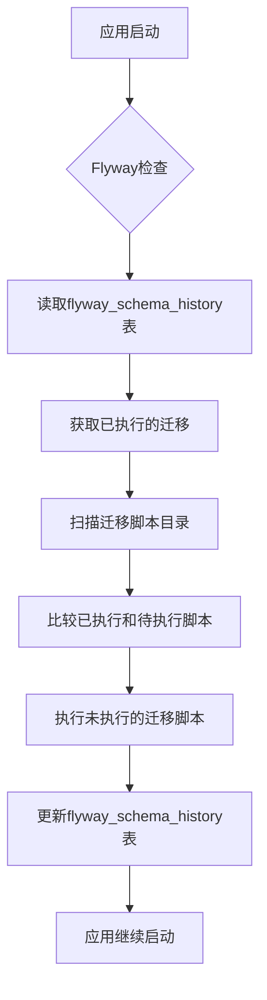
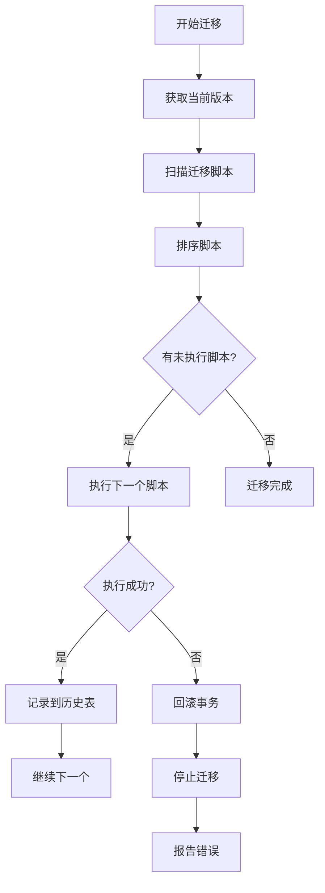
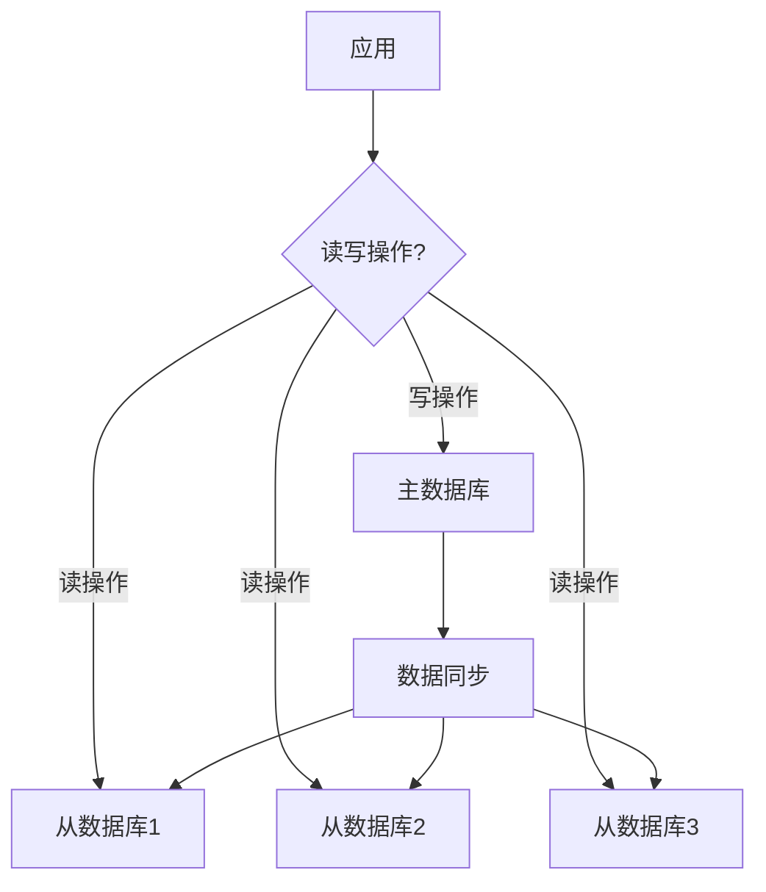
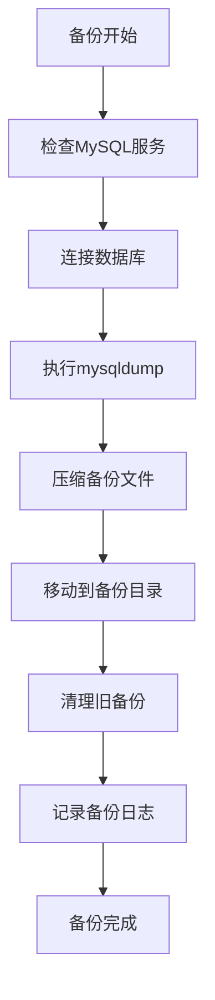
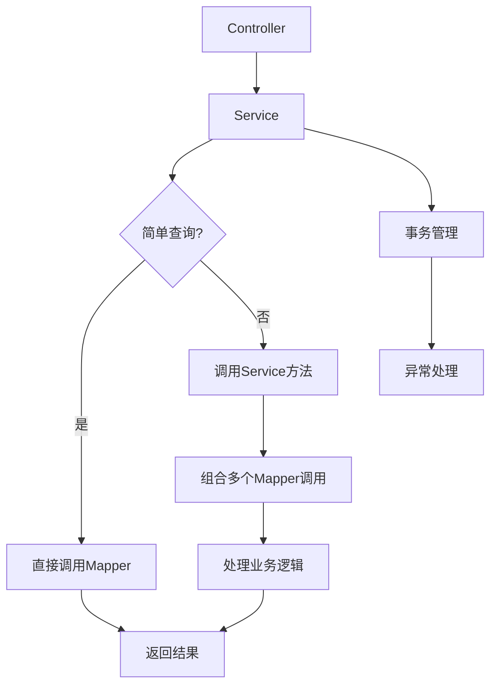

# 数据库管理

<cite>
**本文档引用的文件**   
- [eplus-flyway/pom.xml](file://eplus-flyway/pom.xml)
- [eplus-flyway/src/main/resources/db/migration/common/V1_0_0_001__框架初始化.sql](file://eplus-flyway/src/main/resources/db/migration/common/V1_0_0_001__框架初始化.sql)
- [eplus-flyway/src/main/resources/db/migration/common/V1_0_0_002__Eplus初始化.sql](file://eplus-flyway/src/main/resources/db/migration/common/V1_0_0_002__Eplus初始化.sql)
- [mysql_backup_system/README.md](file://mysql_backup_system/README.md)
- [sql/mysql/清库脚本.sql](file://sql/mysql/清库脚本.sql)
- [eplus-module-infra/eplus-module-infra-biz/src/main/java/cn/iocoder/yudao/module/infra/service/db/DataSourceConfigServiceImpl.java](file://eplus-module-infra/eplus-module-infra-biz/src/main/java/cn/iocoder/yudao/module/infra/service/db/DataSourceConfigServiceImpl.java)
- [eplus-module-oa/eplus-module-oa-biz/src/test/resources/application-unit-test.yaml](file://eplus-module-oa/eplus-module-oa-biz/src/test/resources/application-unit-test.yaml)
- [eplus-module-scm/eplus-module-scm-biz/src/test/resources/application-unit-test.yaml](file://eplus-module-scm/eplus-module-scm-biz/src/test/resources/application-unit-test.yaml)
</cite>

## 目录
1. [数据库存储架构](#数据库存储架构)
2. [Flyway数据库版本控制](#flyway数据库版本控制)
3. [核心数据库表结构](#核心数据库表结构)
4. [数据库迁移脚本规范](#数据库迁移脚本规范)
5. [数据库性能优化](#数据库性能优化)
6. [数据库备份与恢复](#数据库备份与恢复)
7. [SQL编写规范与ORM最佳实践](#sql编写规范与orm最佳实践)

## 数据库存储架构

系统采用MySQL作为主要的关系型数据库，数据库名称为`foreign_trade`。系统通过Spring Boot和MyBatis-Plus框架进行数据库访问，使用Druid作为数据库连接池。数据库设计遵循模块化原则，不同业务模块拥有独立的表空间，同时共享基础数据表。

系统支持多数据源配置，通过`DataSourceConfigServiceImpl`类实现动态数据源管理。主数据源配置在`application-unit-test.yaml`等配置文件中定义，包含数据库连接URL、用户名和密码等信息。系统还实现了数据权限控制，确保不同租户和用户角色的数据隔离。

**Section sources**
- [eplus-module-infra/eplus-module-infra-biz/src/main/java/cn/iocoder/yudao/module/infra/service/db/DataSourceConfigServiceImpl.java](file://eplus-module-infra/eplus-module-infra-biz/src/main/java/cn/iocoder/yudao/module/infra/service/db/DataSourceConfigServiceImpl.java)
- [eplus-module-oa/eplus-module-oa-biz/src/test/resources/application-unit-test.yaml](file://eplus-module-oa/eplus-module-oa-biz/src/test/resources/application-unit-test.yaml)
- [eplus-module-scm/eplus-module-scm-biz/src/test/resources/application-unit-test.yaml](file://eplus-module-scm/eplus-module-scm-biz/src/test/resources/application-unit-test.yaml)

## Flyway数据库版本控制

系统使用Flyway作为数据库版本控制工具，确保数据库结构的演进与代码版本同步。Flyway配置在`eplus-flyway`模块的`pom.xml`文件中，使用版本10.10.0。

### Flyway配置
Flyway的配置信息包括：
- **数据库连接**: 连接到`foreign_trade`数据库，使用root用户和密码`root123`
- **迁移脚本位置**: 配置了两个位置：`classpath:db/migration/common`和`classpath:db/migration/dev`
- **历史表**: 使用`flyway_schema_history`表记录迁移历史
- **编码**: 使用UTF-8编码
- **命名验证**: 启用迁移命名验证

迁移脚本分为两类：以`V`开头的版本化迁移脚本和以`R`开头的可重复执行脚本。版本化脚本按版本号顺序执行，确保数据库结构的有序演进。



**Diagram sources**
- [eplus-flyway/pom.xml](file://eplus-flyway/pom.xml)

**Section sources**
- [eplus-flyway/pom.xml](file://eplus-flyway/pom.xml)

## 核心数据库表结构

系统数据库包含多个核心表，主要分为基础信息表、业务表和系统管理表。

### 基础信息表
- **crm_cust**: 客户资料表，存储客户基本信息、联系方式、银行账户等
- **system_country_info**: 国家信息表，存储国家编码、名称和区域信息
- **system_settlement**: 结汇方式表，定义不同的结汇方式

### 业务表
- **scm_purchase_contract**: 采购合同表，管理采购合同信息
- **sms_sale_contract**: 销售合同表，管理销售合同信息
- **dms_shipment**: 出运单表，管理货物出运信息
- **fms_payment**: 付款单表，管理付款信息

### 系统管理表
- **system_users**: 用户信息表，存储系统用户账号、角色等信息
- **system_dept**: 部门表，管理组织架构
- **system_role**: 角色表，定义系统角色和权限
- **system_menu**: 菜单权限表，定义系统菜单和权限标识

```mermaid
erDiagram
crm_cust ||--o{ crm_cust_bankaccount : "拥有"
crm_cust ||--o{ crm_cust_poc : "联系人"
system_users ||--o{ system_user_role : "角色"
system_role ||--o{ system_role_menu : "菜单"
system_dept ||--o{ system_users : "部门"
scm_purchase_contract ||--o{ scm_purchase_contract_item : "明细"
sms_sale_contract ||--o{ sms_sale_contract_item : "明细"
dms_shipment ||--o{ dms_shipment_item : "明细"
fms_payment ||--o{ fms_payment_item : "明细"
crm_cust {
bigint id PK
varchar(100) name
varchar(10) code
bigint country_id FK
tinyint audit_status
datetime create_time
datetime update_time
}
crm_cust_bankaccount {
bigint id PK
bigint cust_id FK
varchar(100) bank
varchar(100) bank_account
varchar(100) bank_address
tinyint default_flag
}
crm_cust_poc {
bigint id PK
bigint cust_id FK
varchar(100) name
varchar(100) poc_posts
varchar(100) email
varchar(100) mobile
tinyint default_flag
}
system_users {
bigint id PK
varchar(30) username
varchar(100) password
varchar(30) nickname
bigint dept_id FK
bigint status
datetime create_time
datetime update_time
}
system_dept {
bigint id PK
varchar(30) name
bigint parent_id
int sort
tinyint status
}
system_role {
bigint id PK
varchar(30) name
varchar(100) code
tinyint status
}
system_menu {
bigint id PK
varchar(50) name
varchar(100) permission
tinyint type
bigint parent_id FK
}
scm_purchase_contract {
bigint id PK
varchar(50) contract_no
bigint cust_id FK
decimal(19,6) total_amount
varchar(20) currency
tinyint status
datetime create_time
datetime update_time
}
sms_sale_contract {
bigint id PK
varchar(50) contract_no
bigint cust_id FK
decimal(19,6) total_amount
varchar(20) currency
tinyint status
datetime create_time
datetime update_time
}
dms_shipment {
bigint id PK
varchar(50) shipment_no
bigint contract_id FK
varchar(50) vessel
varchar(50) voyage
datetime etd
datetime eta
tinyint status
}
fms_payment {
bigint id PK
varchar(50) payment_no
bigint contract_id FK
decimal(19,6) amount
varchar(20) currency
datetime payment_date
tinyint status
}
```

**Diagram sources**
- [eplus-flyway/src/main/resources/db/migration/common/V1_0_0_001__框架初始化.sql](file://eplus-flyway/src/main/resources/db/migration/common/V1_0_0_001__框架初始化.sql)
- [eplus-flyway/src/main/resources/db/migration/common/V1_0_0_002__Eplus初始化.sql](file://eplus-flyway/src/main/resources/db/migration/common/V1_0_0_002__Eplus初始化.sql)

**Section sources**
- [eplus-flyway/src/main/resources/db/migration/common/V1_0_0_001__框架初始化.sql](file://eplus-flyway/src/main/resources/db/migration/common/V1_0_0_001__框架初始化.sql)
- [eplus-flyway/src/main/resources/db/migration/common/V1_0_0_002__Eplus初始化.sql](file://eplus-flyway/src/main/resources/db/migration/common/V1_0_0_002__Eplus初始化.sql)

## 数据库迁移脚本规范

### 命名规范
迁移脚本遵循严格的命名规范：
- 版本化迁移: `V{主版本号}_{次版本号}_{修订号}_{步进号}__{描述}.sql`
- 可重复迁移: `R__{描述}.sql`

例如：`V1_0_0_001__框架初始化.sql`表示第一个版本的第一个迁移脚本。

### 编写规范
1. **原子性**: 每个迁移脚本应包含一个完整的、可独立执行的变更
2. **幂等性**: 脚本应能安全地重复执行，避免重复创建表或字段
3. **事务性**: 使用`BEGIN;`和`COMMIT;`包裹数据变更操作
4. **兼容性**: 考虑向前和向后兼容性，避免破坏现有数据

### 执行策略
- **自动执行**: 应用启动时自动执行未完成的迁移
- **顺序执行**: 按版本号顺序执行迁移脚本
- **失败处理**: 执行失败时回滚事务，并记录错误信息
- **历史记录**: 在`flyway_schema_history`表中记录每次迁移的执行情况



**Diagram sources**
- [eplus-flyway/pom.xml](file://eplus-flyway/pom.xml)

**Section sources**
- [eplus-flyway/pom.xml](file://eplus-flyway/pom.xml)

## 数据库性能优化

### 查询优化
1. **索引优化**: 为常用查询字段创建索引，如`crm_cust.code`、`scm_purchase_contract.contract_no`等
2. **避免全表扫描**: 确保查询条件能有效利用索引
3. **分页查询**: 大数据量查询使用分页，避免一次性加载过多数据
4. **连接优化**: 合理使用JOIN操作，避免笛卡尔积

### 索引优化
系统在关键字段上创建了索引：
- **唯一索引**: 如`system_users`表的`username`字段
- **复合索引**: 如`bpm_process_instance_ext`表的`process_definition_id`和`status`字段
- **外键索引**: 所有外键字段都应有索引以提高连接查询性能

### 分库分表策略
目前系统采用单库单表架构，但设计上支持分库分表：
- **垂直分表**: 将大表按业务逻辑拆分，如将客户基本信息和交易信息分离
- **水平分表**: 按时间或ID范围拆分大表，如按年份拆分交易记录表
- **读写分离**: 可配置主从数据库，写操作在主库，读操作在从库



**Diagram sources**
- [eplus-module-oa/eplus-module-oa-biz/src/test/resources/application-unit-test.yaml](file://eplus-module-oa/eplus-module-oa-biz/src/test/resources/application-unit-test.yaml)

**Section sources**
- [eplus-module-oa/eplus-module-oa-biz/src/test/resources/application-unit-test.yaml](file://eplus-module-oa/eplus-module-oa-biz/src/test/resources/application-unit-test.yaml)

## 数据库备份与恢复

系统采用定制化的MySQL备份解决方案，确保数据安全。

### 备份方案
- **备份频率**: 每天凌晨2点自动执行备份
- **保留时间**: 保留最近7天的备份文件
- **备份位置**: `/home/db/data/`
- **脚本位置**: `/home/db/script/`
- **备份文件命名**: `foreign_trade_YYYYMMDD_HHMMSS.sql.gz`

### 备份脚本
备份系统包含以下核心脚本：
- `mysql_backup.sh`: 核心备份脚本
- `deploy_foreign_trade_backup.sh`: 快速部署脚本
- `setup_paths.sh`: 路径设置脚本

### 恢复方案
#### 恢复整个数据库
```bash
# 解压备份文件
gunzip foreign_trade_20240101_020000.sql.gz
# 恢复数据库
mysql -u root -p foreign_trade < foreign_trade_20240101_020000.sql
```

#### 恢复特定表
```bash
# 从备份文件中提取特定表
sed -n '/^-- Table structure for table `表名`/,/^-- Table structure for table/p' foreign_trade_20240101_020000.sql > table_backup.sql
# 恢复特定表
mysql -u root -p foreign_trade < table_backup.sql
```



**Diagram sources**
- [mysql_backup_system/README.md](file://mysql_backup_system/README.md)

**Section sources**
- [mysql_backup_system/README.md](file://mysql_backup_system/README.md)

## SQL编写规范与ORM最佳实践

### SQL编写规范
1. **命名规范**: 表名和字段名使用小写字母和下划线分隔
2. **注释规范**: 每个表和重要字段都应有注释说明
3. **避免SELECT ***: 明确指定需要的字段
4. **使用参数化查询**: 防止SQL注入攻击
5. **事务管理**: 明确界定事务边界，避免长时间持有锁

### ORM使用最佳实践
1. **实体类设计**: 实体类应与数据库表结构保持一致，使用Lombok减少样板代码
2. **Mapper接口**: 每个实体对应一个Mapper接口，遵循单一职责原则
3. **Service层**: 业务逻辑集中在Service层，避免在Controller中直接调用Mapper
4. **分页处理**: 使用MyBatis-Plus的分页插件，避免手动拼接分页SQL
5. **缓存策略**: 合理使用Redis缓存，减少数据库访问压力

### MyBatis XML映射
对于复杂查询，使用XML映射文件：
- 将多表关联查询、复杂条件查询放在XML文件中
- 使用`<if>`、`<choose>`等标签实现动态SQL
- 避免在XML中编写业务逻辑，保持SQL的纯粹性



**Diagram sources**
- [eplus-module-infra/eplus-module-infra-biz/src/main/java/cn/iocoder/yudao/module/infra/service/db/DataSourceConfigServiceImpl.java](file://eplus-module-infra/eplus-module-infra-biz/src/main/java/cn/iocoder/yudao/module/infra/service/db/DataSourceConfigServiceImpl.java)

**Section sources**
- [eplus-module-infra/eplus-module-infra-biz/src/main/java/cn/iocoder/yudao/module/infra/service/db/DataSourceConfigServiceImpl.java](file://eplus-module-infra/eplus-module-infra-biz/src/main/java/cn/iocoder/yudao/module/infra/service/db/DataSourceConfigServiceImpl.java)