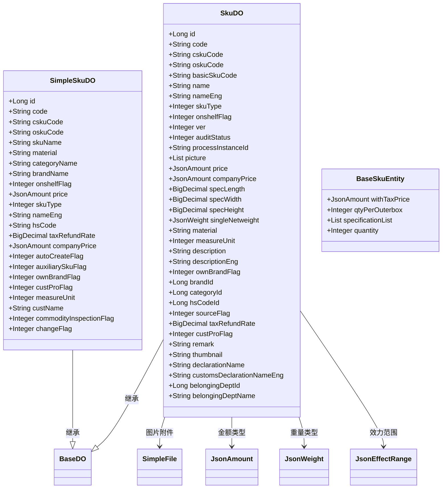
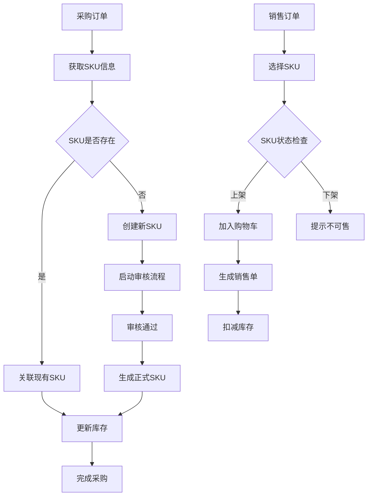
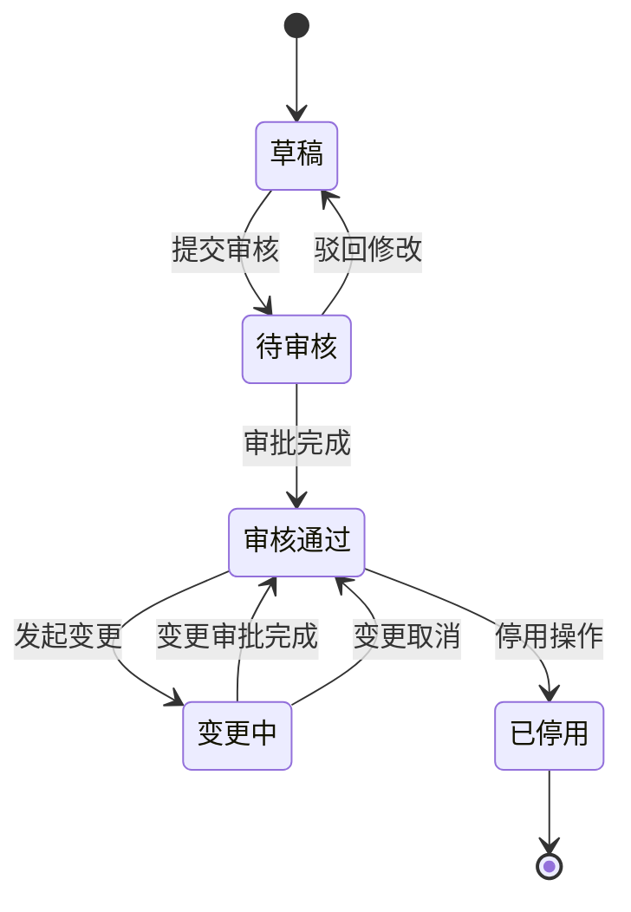

# SKU管理

<cite>
**本文档引用文件**  
- [SkuDO.java](file://eplus-module-pms/eplus-module-pms-biz/src/main/java/com/syj/eplus/module/pms/dal/dataobject/sku/SkuDO.java)
- [SkuMapper.xml](file://eplus-module-pms/eplus-module-pms-biz/src/main/resources/mapper/SkuMapper.xml)
- [SkuServiceImpl.java](file://eplus-module-pms/eplus-module-pms-biz/src/main/java/com/syj/eplus/module/pms/service/sku/SkuServiceImpl.java)
- [SkuRespVO.java](file://eplus-module-pms/eplus-module-pms-biz/src/main/java/com/syj/eplus/module/pms/controller/admin/sku/vo/SkuRespVO.java)
- [SkuBomMapper.xml](file://eplus-module-pms/eplus-module-pms-biz/src/main/resources/mapper/SkuBomMapper.xml)
- [BaseSkuEntity.java](file://eplus-framework/eplus-common/src/main/java/com/syj/eplus/framework/common/entity/BaseSkuEntity.java)
- [ChangeAuxiliarySkuAuditResultListener.java](file://eplus-module-pms/eplus-module-pms-biz/src/main/java/com/syj/eplus/module/pms/listener/sku/ChangeAuxiliarySkuAuditResultListener.java)
</cite>

## 目录
1. [SKU实体设计与实现](#sku实体设计与实现)
2. [SKU编码规则与属性配置](#sku编码规则与属性配置)
3. [SKU与SPU关系解析](#sku与spu关系解析)
4. [业务场景中的SKU使用](#业务场景中的sku使用)
5. [MyBatis Mapper配置与SQL查询](#mybatis-mapper配置与sql查询)
6. [SKU生命周期与版本控制](#sku生命周期与版本控制)
7. [变更记录与审计机制](#变更记录与审计机制)
8. [开发者操作最佳实践](#开发者操作最佳实践)

## SKU实体设计与实现

SKU实体在系统中作为核心商品数据单元，承载了商品的完整信息。其设计遵循领域驱动设计原则，通过分层结构实现数据抽象与业务逻辑分离。



**图示来源**  
- [SkuDO.java](file://eplus-module-pms/eplus-module-pms-biz/src/main/java/com/syj/eplus/module/pms/dal/dataobject/sku/SkuDO.java#L44-L327)
- [SimpleSkuDO.java](file://eplus-module-pms/eplus-module-pms-biz/src/main/java/com/syj/eplus/module/pms/dal/dataobject/sku/SimpleSkuDO.java#L21-L168)
- [BaseSkuEntity.java](file://eplus-framework/eplus-common/src/main/java/com/syj/eplus/framework/common/entity/BaseSkuEntity.java#L7-L28)

**本节来源**  
- [SkuDO.java](file://eplus-module-pms/eplus-module-pms-biz/src/main/java/com/syj/eplus/module/pms/dal/dataobject/sku/SkuDO.java#L1-L327)
- [SimpleSkuDO.java](file://eplus-module-pms/eplus-module-pms-biz/src/main/java/com/syj/eplus/module/pms/dal/dataobject/sku/SimpleSkuDO.java#L1-L168)

## SKU编码规则与属性配置

SKU编码体系采用分层结构设计，确保唯一性和可读性。核心编码字段包括：

### 编码规则
- **商品编码(code)**：系统自动生成的唯一标识，作为主键使用
- **客户货号(cskuCode)**：客户方的产品编号，用于外部系统对接
- **自营产品货号(oskuCode)**：企业内部的产品编号体系
- **基础产品编号(basicSkuCode)**：用于标识产品系列或基础型号

### 核心属性配置
| 属性类别 | 属性名称 | 数据类型 | 说明 |
|---------|--------|--------|------|
| 基础信息 | 名称(name) | String | 中文品名 |
| | 英文名称(nameEng) | String | 英文品名 |
| | 条码(barcode) | String | 商品条形码 |
| 分类信息 | 产品分类(categoryId) | Long | 分类ID |
| | 品牌(brandId) | Long | 品牌ID |
| | 产品类型(skuType) | Integer | 枚举类型 |
| 规格参数 | 规格长(specLength) | BigDecimal | 单位：厘米 |
| | 规格宽(specWidth) | BigDecimal | 单位：厘米 |
| | 规格高(specHeight) | BigDecimal | 单位：厘米 |
| | 单品净重(singleNetweight) | JsonWeight | 净重信息 |
| 价格信息 | 销售单价(price) | JsonAmount | 含税价格 |
| | 公司定价(companyPrice) | JsonAmount | 内部定价 |
| 状态信息 | 产品状态(onshelfFlag) | Integer | 上架状态 |
| | 审核状态(auditStatus) | Integer | 流程审核状态 |
| | 版本号(ver) | Integer | 数据版本 |

**本节来源**  
- [SkuDO.java](file://eplus-module-pms/eplus-module-pms-biz/src/main/java/com/syj/eplus/module/pms/dal/dataobject/sku/SkuDO.java#L49-L327)

## SKU与SPU关系解析

系统中SKU与SPU遵循标准的商品数据模型关系：

```mermaid
erDiagram
SPU {
long id PK
string name
long categoryId
long brandId
}
SKU {
long id PK
string code UK
string cskuCode
string oskuCode
long spuId FK
int ver
int auditStatus
string processInstanceId
}
SPU ||--o{ SKU : "包含"
SKU }o--|| SkuBom : "组成"
SkuBom }o--|| SKU : "子SKU"
SPU {
id
name
categoryId
brandId
}
SKU {
id
code
cskuCode
oskuCode
spuId
ver
auditStatus
processInstanceId
}
SkuBom {
id
skuId FK
parentSkuId FK
qty
skuType
}
```

SPU（Standard Product Unit）作为标准化产品单元，代表一类产品的抽象概念；SKU（Stock Keeping Unit）作为库存计量单元，是SPU的具体实例化。一个SPU可以对应多个SKU，通过不同的属性组合（如颜色、尺寸等）形成具体可销售的商品。

在数据结构上，`SkuDO`实体通过`spuId`字段与SPU建立关联，同时通过`SkuBom`表实现SKU之间的组合关系，支持组合产品、套装产品等复杂业务场景。

**图示来源**  
- [SkuDO.java](file://eplus-module-pms/eplus-module-pms-biz/src/main/java/com/syj/eplus/module/pms/dal/dataobject/sku/SkuDO.java#L87-L327)
- [SkuBomMapper.xml](file://eplus-module-pms/eplus-module-pms-biz/src/main/resources/mapper/SkuBomMapper.xml#L12-L20)

**本节来源**  
- [SkuDO.java](file://eplus-module-pms/eplus-module-pms-biz/src/main/java/com/syj/eplus/module/pms/dal/dataobject/sku/SkuDO.java#L87-L327)

## 业务场景中的SKU使用

SKU在采购、销售、库存等核心业务场景中扮演关键角色：

### 采购场景
在采购流程中，SKU作为采购合同和报价单的基本单位。系统通过`quoteitemDTOList`关联供应商报价信息，支持多供应商比价采购。

### 销售场景
销售合同以SKU为最小计价单位，通过`price`字段确定销售单价，并结合`onshelfFlag`状态控制商品是否可售。

### 库存场景
库存管理基于SKU进行精确 tracking，通过`basicSkuCode`实现批次管理，支持先进先出(FIFO)等库存策略。



**图示来源**  
- [SkuDO.java](file://eplus-module-pms/eplus-module-pms-biz/src/main/java/com/syj/eplus/module/pms/dal/dataobject/sku/SkuDO.java#L129-L327)
- [SkuServiceImpl.java](file://eplus-module-pms/eplus-module-pms-biz/src/main/java/com/syj/eplus/module/pms/service/sku/SkuServiceImpl.java#L955-L1026)

**本节来源**  
- [SkuDO.java](file://eplus-module-pms/eplus-module-pms-biz/src/main/java/com/syj/eplus/module/pms/dal/dataobject/sku/SkuDO.java#L1-L327)

## MyBatis Mapper配置与SQL查询

### Mapper配置

```xml
<?xml version="1.0" encoding="UTF-8"?>
<!DOCTYPE mapper PUBLIC "-//mybatis.org//DTD Mapper 3.0//EN" "http://mybatis.org/dtd/mybatis-3-mapper.dtd">
<mapper namespace="com.syj.eplus.module.pms.dal.mysql.sku.SkuMapper">

    <resultMap id="BaseResultMap" type="com.syj.eplus.module.pms.dal.dataobject.sku.SimpleSkuDO">
        <result column="id" jdbcType="BIGINT" property="id"/>
        <result column="code" jdbcType="VARCHAR" property="code"/>
        <result column="basicSkuCode" jdbcType="VARCHAR" property="basicSkuCode"/>
        <result column="cskuCode" jdbcType="VARCHAR" property="cskuCode"/>
        <result column="oskuCode" jdbcType="VARCHAR" property="oskuCode"/>
        <!-- 其他字段映射 -->
    </resultMap>

    <resultMap id="BaseSkuResultMap" type="com.syj.eplus.module.pms.dal.dataobject.sku.SkuDO">
        <result column="id" jdbcType="BIGINT" property="id"/>
        <result column="code" jdbcType="VARCHAR" property="code"/>
        <!-- 完整字段映射 -->
    </resultMap>

    <resultMap id="ResultMapWithJson" type="com.syj.eplus.module.pms.dal.dataobject.sku.SimpleSkuDO"
               extends="BaseResultMap">
        <result column="companyPrice" property="companyPrice"
                javaType="com.syj.eplus.framework.common.entity.JsonAmount"
                typeHandler="com.syj.eplus.framework.common.config.handler.JsonAmountTypeHandler"/>
        <result column="pictures" property="pictures" javaType="com.syj.eplus.framework.common.entity.SimpleFile"
                typeHandler="com.syj.eplus.framework.common.config.handler.JsonFileListTypeHandler"/>
        <result column="price" property="price" javaType="com.syj.eplus.framework.common.entity.JsonAmount"
                typeHandler="com.syj.eplus.framework.common.config.handler.JsonAmountTypeHandler"/>
    </resultMap>
</mapper>
```

### 关键SQL查询

1. **分页查询SKU列表**
```sql
SELECT * FROM pms_sku 
WHERE deleted = 0 
AND (code LIKE CONCAT('%', #{code}, '%') OR #{code} IS NULL)
AND (cskuCode LIKE CONCAT('%', #{cskuCode}, '%') OR #{cskuCode} IS NULL)
ORDER BY updateTime DESC
```

2. **根据编码查询SKU**
```sql
SELECT * FROM pms_sku 
WHERE code = #{code} 
AND ver = (SELECT MAX(ver) FROM pms_sku WHERE code = #{code})
AND deleted = 0
```

3. **查询变更中的SKU**
```sql
SELECT * FROM pms_sku 
WHERE changeFlag = 1 
AND auditStatus = 1
```

**图示来源**  
- [SkuMapper.xml](file://eplus-module-pms/eplus-module-pms-biz/src/main/resources/mapper/SkuMapper.xml#L1-L75)

**本节来源**  
- [SkuMapper.xml](file://eplus-module-pms/eplus-module-pms-biz/src/main/resources/mapper/SkuMapper.xml#L1-L75)

## SKU生命周期与版本控制

SKU的生命周期管理通过状态机模式实现，包含创建、审核、变更、停用等关键阶段。

### 生命周期状态


### 版本控制机制
系统通过`ver`字段实现SKU数据的版本控制，每次变更都会生成新版本，保留历史记录：

1. 创建新SKU时，`ver`初始化为1
2. 每次成功变更后，`ver`递增1
3. 通过`code`+`ver`组合确保数据版本唯一性
4. 支持按版本号查询历史数据

版本控制与变更审计紧密结合，确保数据变更可追溯。

```java
// 版本控制核心逻辑
public void updateChangeAuditStatus(Long auditableId, Integer auditStatus, String processInstanceId) {
    SkuDO skuDO = validateSkuExists(auditableId);
    skuDO.setAuditStatus(auditStatus);
    if (auditStatus == APPROVE.getResult()) {
        skuDO.setChangeFlag(NO.getValue());
        skuDO.setChangeStatus(CHANGED.getStatus());
        skuDO.setVer(skuDO.getVer() + 1); // 版本递增
        skuMapper.updateById(skuDO);
    } else if (auditStatus == CANCEL.getResult() || auditStatus == BACK.getResult()) {
        skuDO.setChangeFlag(NO.getValue());
        skuMapper.updateById(skuDO);
        skuMapper.deleteById(skuDO);
        // 恢复旧版本
        SkuDO oldSku = skuMapper.selectOne(...);
        oldSku.setChangeFlag(NO.getValue());
        skuMapper.updateById(oldSku);
    }
}
```

**图示来源**  
- [SkuDO.java](file://eplus-module-pms/eplus-module-pms-biz/src/main/java/com/syj/eplus/module/pms/dal/dataobject/sku/SkuDO.java#L72-L327)
- [SkuServiceImpl.java](file://eplus-module-pms/eplus-module-pms-biz/src/main/java/com/syj/eplus/module/pms/service/sku/SkuServiceImpl.java#L1000-L1026)

**本节来源**  
- [SkuDO.java](file://eplus-module-pms/eplus-module-pms-biz/src/main/java/com/syj/eplus/module/pms/dal/dataobject/sku/SkuDO.java#L72-L327)
- [SkuServiceImpl.java](file://eplus-module-pms/eplus-module-pms-biz/src/main/java/com/syj/eplus/module/pms/service/sku/SkuServiceImpl.java#L955-L1026)

## 变更记录与审计机制

系统建立了完整的变更审计体系，确保SKU数据变更的可追溯性。

### 变更监听器
通过Spring事件机制实现变更审计：

```java
@Component
public class ChangeAuxiliarySkuAuditResultListener extends BpmProcessInstanceResultEventListener {
    @Resource
    private SkuService skuService;

    @Override
    protected String getProcessDefinitionKey() {
        return skuService.getChangeAuxiliarySkuProcessDefinitionKey();
    }

    @Override
    protected void onEvent(BpmProcessInstanceResultEvent event) {
        skuService.updateChangeAuditStatus(
            Long.parseLong(event.getBusinessKey()), 
            event.getResult(),
            null
        );
        SkuInfoRespVO sku = skuService.getSku(new SkuDetailReq().setSkuId(Long.parseLong(event.getBusinessKey())));
        if (event.getResult() == APPROVE.getResult() && sku.getVer() > 1) {
            skuService.changeSuccess(sku);
        }
    }
}
```

### 审计字段
关键审计字段包括：
- `changeFlag`：变更标识（0-无变更，1-变更中）
- `changeStatus`：变更状态
- `auditStatus`：审核状态
- `processInstanceId`：流程实例ID
- `creator`：创建人
- `updater`：更新人
- `createTime`：创建时间
- `updateTime`：更新时间

变更流程与工作流引擎集成，确保所有变更都经过审批流程。

**图示来源**  
- [ChangeAuxiliarySkuAuditResultListener.java](file://eplus-module-pms/eplus-module-pms-biz/src/main/java/com/syj/eplus/module/pms/listener/sku/ChangeAuxiliarySkuAuditResultListener.java#L1-L32)
- [SkuDO.java](file://eplus-module-pms/eplus-module-pms-biz/src/main/java/com/syj/eplus/module/pms/dal/dataobject/sku/SkuDO.java#L55-L65)

**本节来源**  
- [ChangeAuxiliarySkuAuditResultListener.java](file://eplus-module-pms/eplus-module-pms-biz/src/main/java/com/syj/eplus/module/pms/listener/sku/ChangeAuxiliarySkuAuditResultListener.java#L1-L32)
- [SkuDO.java](file://eplus-module-pms/eplus-module-pms-biz/src/main/java/com/syj/eplus/module/pms/dal/dataobject/sku/SkuDO.java#L55-L65)

## 开发者操作最佳实践

### 数据查询建议
1. **使用Service层接口**：优先调用`SkuService`提供的业务方法，而非直接操作Mapper
2. **分页查询**：大数据量查询务必使用分页，避免内存溢出
3. **缓存利用**：对于频繁查询的SKU基础信息，考虑使用Redis缓存

### 数据变更规范
1. **事务管理**：批量变更操作需确保事务完整性
2. **版本控制**：变更前验证当前版本，避免并发修改冲突
3. **审计日志**：重要变更操作需记录详细日志

### 性能优化建议
1. **字段选择性查询**：根据实际需求选择合适的ResultMap
2. **批量操作**：使用MyBatis的批量操作接口提高性能
3. **索引优化**：确保`code`、`cskuCode`、`oskuCode`等常用查询字段有适当索引

### 错误处理
1. **空值检查**：对关键字段进行空值校验
2. **异常捕获**：合理捕获并处理`SKU_NOT_EXISTS`等业务异常
3. **数据验证**：变更前验证数据完整性

**本节来源**  
- [SkuServiceImpl.java](file://eplus-module-pms/eplus-module-pms-biz/src/main/java/com/syj/eplus/module/pms/service/sku/SkuServiceImpl.java#L955-L1026)
- [SkuDO.java](file://eplus-module-pms/eplus-module-pms-biz/src/main/java/com/syj/eplus/module/pms/dal/dataobject/sku/SkuDO.java#L1-L327)