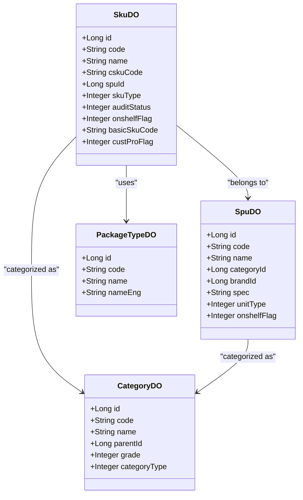
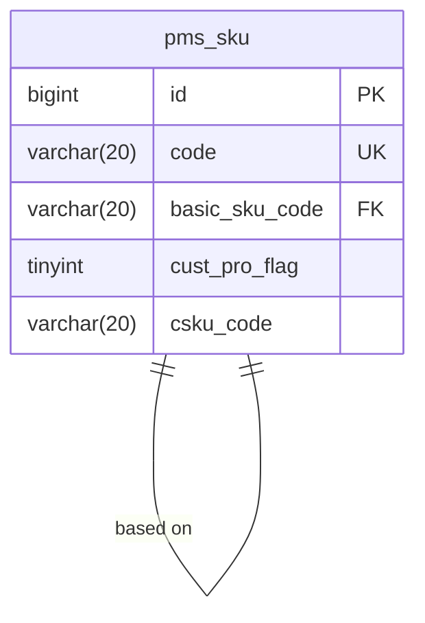

# 产品数据模型

<cite>
**本文档引用文件**   
- [V1_0_0_002__Eplus初始化.sql](file://eplus-flyway/src/main/resources/db/migration/common/V1_0_0_002__Eplus初始化.sql)
- [SpuDO.java](file://eplus-module-pms/eplus-module-pms-biz/src/main/java/com/syj/eplus/module/pms/dal/dataobject/spu/SpuDO.java)
- [SkuDO.java](file://eplus-module-pms/eplus-module-pms-biz/src/main/java/com/syj/eplus/module/pms/dal/dataobject/sku/SkuDO.java)
- [CategoryDO.java](file://eplus-module-pms/eplus-module-pms-biz/src/main/java/com/syj/eplus/module/pms/dal/dataobject/category/CategoryDO.java)
- [PackageTypeDO.java](file://eplus-module-pms/eplus-module-pms-biz/src/main/java/com/syj/eplus/module/pms/dal/dataobject/packagetype/PackageTypeDO.java)
- [SkuMapper.java](file://eplus-module-pms/eplus-module-pms-biz/src/main/java/com/syj/eplus/module/pms/dal/mysql/sku/SkuMapper.java)
</cite>

## 目录
1. [引言](#引言)
2. [核心实体设计](#核心实体设计)
3. [产品主数据架构](#产品主数据架构)
4. [ER图：产品相关表关系](#er图产品相关表关系)
5. [SKU编码规则](#sku编码规则)
6. [产品版本管理](#产品版本管理)
7. [基础产品与客户产品关系](#基础产品与客户产品关系)
8. [SQL建表语句示例](#sql建表语句示例)
9. [MyBatis Mapper配置示例](#mybatis-mapper配置示例)
10. [产品数据建模最佳实践](#产品数据建模最佳实践)

## 引言
本文档详细描述了产品数据模型的核心设计，包括SKU、SPU、产品分类、包装方式等核心实体。文档解释了产品主数据管理的架构设计，包括产品属性、规格、辅助材料等信息的存储方式。通过ER图展示产品相关表之间的关系，重点说明SKU编码规则、产品版本管理、基础产品与客户产品的关系。文档还提供了实际的SQL建表语句和MyBatis Mapper配置示例，解释关键字段的设计意图和业务含义，为开发者提供产品数据建模的最佳实践和扩展建议。

## 核心实体设计

### SKU（库存单位）
SKU（Stock Keeping Unit）是库存管理的最小单位，代表具体可销售的产品。在系统中，SKU表（pms_sku）包含以下关键字段：

- **code**: SKU编码，唯一标识一个SKU
- **name**: 产品名称
- **csku_code**: 客户货号，标识客户特定的产品编号
- **spu_id**: 关联的SPU主键，表示该SKU属于哪个产品系列
- **basic_sku_code**: 基础产品编号，用于标识基础产品
- **cust_pro_flag**: 客户产品标识，标记是否为客户定制产品
- **sku_type**: 产品类型，区分不同类型的产品
- **audit_status**: 审核状态，控制产品是否可被使用
- **onshelf_flag**: 产品状态，标识产品是否上架

**Section sources**
- [SkuDO.java](file://eplus-module-pms/eplus-module-pms-biz/src/main/java/com/syj/eplus/module/pms/dal/dataobject/sku/SkuDO.java#L46-L327)
- [V1_0_0_002__Eplus初始化.sql](file://eplus-flyway/src/main/resources/db/migration/common/V1_0_0_002__Eplus初始化.sql#L1587-L1638)

### SPU（标准产品单元）
SPU（Standard Product Unit）是商品信息聚合的最小单位，代表一组具有相同属性的产品。在系统中，SPU表（pms_spu）包含以下关键字段：

- **code**: 编号，SPU的唯一标识
- **name**: 名称，产品系列的名称
- **category_id**: 商品分类，关联产品分类
- **brand_id**: 品牌编号，关联品牌信息
- **spec**: 产品规格，描述产品的基本规格
- **unit_type**: 计量单位，产品的计量方式
- **onshelf_flag**: 商品状态，标识商品是否可售

**Section sources**
- [SpuDO.java](file://eplus-module-pms/eplus-module-pms-biz/src/main/java/com/syj/eplus/module/pms/dal/dataobject/spu/SpuDO.java#L24-L91)
- [V1_0_0_002__Eplus初始化.sql](file://eplus-flyway/src/main/resources/db/migration/common/V1_0_0_002__Eplus初始化.sql#L866-L889)

### 产品分类
产品分类用于组织和管理产品，支持多级分类结构。在系统中，分类表（pms_category）包含以下关键字段：

- **code**: 商品分类编号，分类的唯一标识
- **name**: 名称，分类的名称
- **parentId**: 父节点编号，实现分类的层级结构
- **grade**: 级别，表示分类的层级深度
- **categoryType**: 种类，区分不同类型的分类
- **hsCodeId**: 海关编码，关联海关编码信息

**Section sources**
- [CategoryDO.java](file://eplus-module-pms/eplus-module-pms-biz/src/main/java/com/syj/eplus/module/pms/dal/dataobject/category/CategoryDO.java#L24-L64)
- [V1_0_0_002__Eplus初始化.sql](file://eplus-flyway/src/main/resources/db/migration/common/V1_0_0_002__Eplus初始化.sql#L1640-L1659)

### 包装方式
包装方式实体用于定义产品的包装规格和方式。在系统中，包装方式表（pms_package_type）包含以下关键字段：

- **code**: 包装方式编号，唯一标识一种包装方式
- **name**: 包装方式名称，包装的描述性名称
- **nameEng**: 包装方式英文名称，英文描述

**Section sources**
- [PackageTypeDO.java](file://eplus-module-pms/eplus-module-pms-biz/src/main/java/com/syj/eplus/module/pms/dal/dataobject/packagetype/PackageTypeDO.java#L24-L43)
- [V1_0_0_002__Eplus初始化.sql](file://eplus-flyway/src/main/resources/db/migration/common/V1_0_0_002__Eplus初始化.sql#L1660-L1679)

## 产品主数据架构

### 产品属性存储
产品属性信息分散存储在多个表中，通过外键关联实现数据完整性。核心属性存储设计如下：

- **基本信息**: 存储在SPU和SKU表中，包括名称、编码、规格等
- **价格信息**: 使用JSON字段存储，支持多币种和含税/不含税价格
- **重量信息**: 使用JSON字段存储单品净重、外箱毛重等
- **图片和附件**: 使用JSON字段存储文件信息，支持多图片和附件

### 规格信息管理
规格信息通过专门的实体进行管理，支持动态规格定义。系统使用JsonSpecificationEntity来存储规格信息，支持：

- 多维度规格定义
- 动态规格扩展
- 规格值的版本控制

### 辅助材料管理
辅助材料作为特殊类型的SKU进行管理，通过auxiliary_sku_flag字段标识。系统支持：

- 通用辅料管理
- 辅料与主产品的BOM关系
- 辅料的独立定价和采购



**Diagram sources**
- [SkuDO.java](file://eplus-module-pms/eplus-module-pms-biz/src/main/java/com/syj/eplus/module/pms/dal/dataobject/sku/SkuDO.java)
- [SpuDO.java](file://eplus-module-pms/eplus-module-pms-biz/src/main/java/com/syj/eplus/module/pms/dal/dataobject/spu/SpuDO.java)
- [CategoryDO.java](file://eplus-module-pms/eplus-module-pms-biz/src/main/java/com/syj/eplus/module/pms/dal/dataobject/category/CategoryDO.java)
- [PackageTypeDO.java](file://eplus-module-pms/eplus-module-pms-biz/src/main/java/com/syj/eplus/module/pms/dal/dataobject/packagetype/PackageTypeDO.java)

## ER图：产品相关表关系

```mermaid
erDiagram
pms_spu ||--o{ pms_sku : "contains"
pms_category ||--o{ pms_spu : "categorizes"
pms_category ||--o{ pms_sku : "categorizes"
pms_brand ||--o{ pms_spu : "brands"
pms_brand ||--o{ pms_sku : "brands"
pms_hsdata ||--o{ pms_spu : "has"
pms_hsdata ||--o{ pms_sku : "has"
pms_package_type ||--o{ pms_sku : "packaged as"
scm_quote_item }o--|| pms_sku : "quotes"
scm_purchase_plan_item }o--|| pms_sku : "plans"
sms_sale_contract_item }o--|| pms_sku : "sells"
dms_shipment_item }o--|| pms_sku : "ships"
wms_notice_item }o--|| pms_sku : "stocks"
pms_spu {
bigint id PK
varchar(100) name
varchar(20) code UK
varchar(100) barcode
varchar(100) spec
varchar(100) name_eng
bigint brand_id FK
bigint category_id FK
tinyint unit_type
tinyint onshelf_flag
tinyint audit_status
varchar(500) description
varchar(500) description_eng
bigint hscode_id FK
integer own_brand_flag
integer hscode_var
}
pms_sku {
bigint id PK
integer audit_status
bigint spu_id FK
bigint source_id
varchar(20) source_code
varchar(100) name
varchar(100) name_eng
varchar(20) code UK
varchar(100) barcode
varchar(20) cust_code
varchar(20) csku_code
varchar(20) osku_code
tinyint onshelf_flag
varchar(500) description
varchar(500) description_eng
integer own_brand_flag
bigint brand_id FK
bigint category_id FK
bigint hscode_id FK
tinyint source_flag
tinyint sku_type
varchar(100) material
tinyint measure_unit
decimal(19,6) spec_length
decimal(19,6) spec_width
decimal(19,6) spec_height
json single_netweight
decimal(19,6) single_process_fee
varchar(500) process_remark
json price
json company_price
json annex
json picture
varchar(500) remark
tinyint cust_pro_flag
integer auxiliary_sku_flag
tinyint auto_create_flag
integer change_flag
integer change_status
integer change_deleted
integer ver
varchar(255) model_key
json effect_range_list
varchar(255) thumbnail
integer advantage_flag
bigint source_id
varchar(20) source_code
varchar(20) basic_sku_code
varchar(100) declaration_name
varchar(100) customs_declaration_name_eng
integer agent_flag
bigint belonging_dept_id
varchar(100) belonging_dept_name
}
pms_category {
bigint id PK
varchar(20) code UK
varchar(100) name
integer code_len
bigint hscode_id FK
bigint parent_id FK
integer category_type
integer grade
varchar(20) hs_data_code
}
pms_package_type {
bigint id PK
varchar(20) code UK
varchar(100) name
varchar(100) name_eng
}
```

**Diagram sources**
- [V1_0_0_002__Eplus初始化.sql](file://eplus-flyway/src/main/resources/db/migration/common/V1_0_0_002__Eplus初始化.sql#L866-L1638)

## SKU编码规则
系统采用灵活的SKU编码规则，支持多种编码策略：

### 编码生成策略
1. **代理产品编码**: 以agent_code_prefix配置为基础，通过codeGeneratorApi生成
2. **客户产品/自主品牌产品**: 使用UUID生成
3. **普通产品**: 基于分类和产品类型生成

### 编码长度
- 初始长度为20位，后通过V1_0_0_070__修改产品编号长度和供应商名称长度.sql脚本修改为50位
- 在V1_0_0_309__报价单产品编号长度修改.sql中进一步修改为100位

### 编码唯一性
系统在生成编码时会检查唯一性，确保不会重复：
```java
while (skuMapper.exists(new LambdaQueryWrapperX<SkuDO>().eq(SkuDO::getCode, code))){
    code = generateCode(createReqVO.getCategoryId(), createReqVO.getSkuType());
}
```

**Section sources**
- [SkuServiceImpl.java](file://eplus-module-pms/eplus-module-pms-biz/src/main/java/com/syj/eplus/module/pms/service/sku/SkuServiceImpl.java#L580-L605)
- [V1_0_0_070__修改产品编号长度和供应商名称长度.java](file://eplus-flyway/src/main/java/db/migration/common/V1_0_0_070__修改产品编号长度和供应商名称长度.java#L24-L33)
- [V1_0_0_309__报价单产品编号长度修改.java](file://eplus-flyway/src/main/java/db/migration/common/V1_0_0_309__报价单产品编号长度修改.java#L13-L15)

## 产品版本管理
系统实现了完整的产品版本管理机制，支持产品信息的变更追踪和版本控制。

### 版本字段
- **ver**: 版本号，从1开始递增
- **changeFlag**: 是否变更标识
- **changeStatus**: 变更状态
- **changeDeleted**: 变更是否删除

### 版本控制流程
1. 新增产品时，版本号初始化为1
2. 产品信息变更时，创建新版本，版本号递增
3. 通过changeFlag标识变更状态
4. 旧版本保留，新版本生效

### 版本查询
系统提供专门的查询方法获取变更版本：
```java
default PageResult<SkuDO> selectChangePage(SkuPageReqVO reqVO, Boolean onlySkuFlag) {
    LambdaQueryWrapperX<SkuDO> queryWrapperX = new LambdaQueryWrapperX<SkuDO>()
        .eqIfPresent(SkuDO::getAuditStatus, reqVO.getAuditStatus())
        // ... 其他条件
        .eqIfPresent(SkuDO::getChangeDeleted, DeletedEnum.NO.getValue())
        .gtIfPresent(SkuDO::getVer, 1)
        .inIfPresent(SkuDO::getDeleted, new ArrayList<>(Arrays.asList(0,1)))
        .orderByDesc(SkuDO::getCreateTime);
    // ... 其他逻辑
}
```

**Section sources**
- [SkuDO.java](file://eplus-module-pms/eplus-module-pms-biz/src/main/java/com/syj/eplus/module/pms/dal/dataobject/sku/SkuDO.java#L46-L66)
- [SkuMapper.java](file://eplus-module-pms/eplus-module-pms-biz/src/main/java/com/syj/eplus/module/pms/dal/mysql/sku/SkuMapper.java#L122-L166)

## 基础产品与客户产品关系
系统通过特定字段和逻辑实现基础产品与客户产品的关系管理。

### 关键字段
- **basic_sku_code**: 基础产品编号，标识该产品基于哪个基础产品
- **cust_pro_flag**: 客户产品标识，标记是否为客户定制产品
- **csku_code**: 客户货号，客户特定的产品编号

### 关系模型
基础产品作为模板，客户产品基于基础产品创建，继承基础产品的大部分属性，同时可以有客户特定的属性。

### 创建逻辑
当创建客户产品时，系统会：
1. 设置basic_sku_code指向基础产品
2. 设置cust_pro_flag为1，标识为客户产品
3. 设置csku_code为客户指定的货号
4. 继承基础产品的关键属性



**Diagram sources**
- [SkuDO.java](file://eplus-module-pms/eplus-module-pms-biz/src/main/java/com/syj/eplus/module/pms/dal/dataobject/sku/SkuDO.java#L298-L301)
- [QualityInspectionItemSaveReqVO.java](file://eplus-module-qms/eplus-module-qms-biz/src/main/java/com/syj/eplus/module/qms/controller/admin/qualityinspection/vo/QualityInspectionItemSaveReqVO.java#L104-L105)

## SQL建表语句示例
以下是核心产品表的SQL建表语句示例：

### SKU表
```sql
CREATE TABLE IF NOT EXISTS `pms_sku` (
    `id`                      bigint UNSIGNED  NOT NULL AUTO_INCREMENT COMMENT '主键',
    `audit_status`            tinyint UNSIGNED NOT NULL DEFAULT 0 COMMENT '审核状态',
    `spu_id`                  bigint UNSIGNED  NULL     DEFAULT NULL COMMENT 'spuid',
    `source_id`               bigint UNSIGNED  NULL     DEFAULT NULL COMMENT '来源id',
    `source_code`             varchar(20)      NOT NULL DEFAULT '' COMMENT '来源编号',
    `name`                    varchar(100)     NOT NULL DEFAULT '' COMMENT '名称',
    `name_eng`                varchar(100)     NOT NULL DEFAULT '' COMMENT '英文名称',
    `code`                    varchar(20)      NOT NULL DEFAULT '' COMMENT '商品编码',
    `barcode`                 varchar(100)     NOT NULL DEFAULT '' COMMENT '条码',
    `cust_code`               varchar(20)      NOT NULL DEFAULT '' COMMENT '客户编号',
    `csku_code`               varchar(20)      NOT NULL DEFAULT '' COMMENT '客户货号',
    `osku_code`               varchar(20)      NOT NULL DEFAULT '' COMMENT '自营产品货号',
    `onshelf_flag`            tinyint UNSIGNED NOT NULL DEFAULT 1 COMMENT '产品状态',
    `description`             varchar(500)     NOT NULL DEFAULT '' COMMENT '产品说明',
    `description_eng`         varchar(500)     NOT NULL DEFAULT '' COMMENT '产品说明英文',
    `own_brand_flag`          tinyint UNSIGNED NOT NULL DEFAULT 0 COMMENT '是否自主品牌',
    `advantage_flag`          tinyint UNSIGNED NOT NULL DEFAULT 0 COMMENT '是否优势产品',
    `brand_id`                bigint UNSIGNED  NULL     DEFAULT NULL COMMENT '品牌id',
    `category_id`             bigint UNSIGNED  NULL     DEFAULT NULL COMMENT '产品分类',
    `hscode_id`               bigint UNSIGNED  NULL     DEFAULT NULL COMMENT '海关编码id',
    `source_flag`             tinyint UNSIGNED NULL     DEFAULT NULL COMMENT '产品来源',
    `sku_type`                tinyint UNSIGNED NULL     DEFAULT NULL COMMENT '产品类型',
    `material`                varchar(100)     NOT NULL DEFAULT '' COMMENT '产品材质',
    `measure_unit`            tinyint UNSIGNED NULL     DEFAULT NULL COMMENT '计量单位',
    `spec_length`             decimal(19,6)   NOT NULL DEFAULT 0 COMMENT '单品规格长',
    `spec_width`              decimal(19,6)   NOT NULL DEFAULT 0 COMMENT '单品规格宽',
    `spec_height`             decimal(19,6)   NOT NULL DEFAULT 0 COMMENT '单品规格高',
    `single_netweight`        json  NOT NULL DEFAULT (JSON_OBJECT()) COMMENT '单品净重',
    `single_process_fee`      decimal(19,6)    NOT NULL DEFAULT 0 COMMENT '单位加工费',
    `process_remark`          varchar(500)     NOT NULL DEFAULT '' COMMENT '加工备注',
    `price`                   json             NOT NULL DEFAULT (JSON_OBJECT()) COMMENT '销售单价',
    `company_price`           json             NOT NULL DEFAULT (JSON_OBJECT()) COMMENT '公司定价',
    `annex`                   json             NULL DEFAULT NULL COMMENT '附件',
    `picture`                 json             NULL DEFAULT NULL COMMENT '图片',
    `remark`                  varchar(500)     NOT NULL DEFAULT '' COMMENT '备注',
    `cust_pro_flag`           tinyint UNSIGNED NOT NULL DEFAULT 0 COMMENT '客户产品标识',
    `auxiliary_sku_flag`      int  NULL DEFAULT NULL COMMENT '是否通用辅料',
    `auto_create_flag`        tinyint UNSIGNED NOT NULL DEFAULT 0 COMMENT '自动创建标识',
    `creator`                 int UNSIGNED     NULL     DEFAULT NULL COMMENT '创建人',
    `create_time`             datetime         NULL     DEFAULT CURRENT_TIMESTAMP COMMENT '创建时间',
    `updater`                 int UNSIGNED     NULL     DEFAULT NULL COMMENT '修改人',
    `update_time`             datetime         NULL     DEFAULT NULL ON UPDATE CURRENT_TIMESTAMP COMMENT '修改时间',
    `deleted`                 tinyint(1)       NOT NULL DEFAULT 0 COMMENT '删除  0：有效 1：删除',
    PRIMARY KEY (`id`) USING BTREE
) ENGINE = InnoDB
  AUTO_INCREMENT = 1
  CHARACTER SET = utf8mb4
  COLLATE = utf8mb4_general_ci COMMENT = 'SKU表'
  ROW_FORMAT = DYNAMIC;
```

**Section sources**
- [V1_0_0_002__Eplus初始化.sql](file://eplus-flyway/src/main/resources/db/migration/common/V1_0_0_002__Eplus初始化.sql#L1587-L1638)

## MyBatis Mapper配置示例
以下是SKU Mapper的配置示例：

### 分页查询
```java
default PageResult<SkuDO> selectPage(SkuPageReqVO reqVO, Boolean onlySkuFlag) {
    MPJLambdaWrapperX<SkuDO> queryWrapperX = new MPJLambdaWrapperX<SkuDO>();
    queryWrapperX.selectAll(SkuDO.class);
    if (StrUtil.isNotEmpty(reqVO.getHsCode()) || Objects.nonNull(reqVO.getTaxRefundRate())){
        queryWrapperX.leftJoin(HsdataDO.class, HsdataDO::getId, SkuDO::getHsCodeId);
    }
    if(StrUtil.isNotEmpty(reqVO.getHsCode())){
        queryWrapperX.like(HsdataDO::getCode,reqVO.getHsCode());
    }
    if(Objects.nonNull(reqVO.getTaxRefundRate())){
        queryWrapperX.eq(HsdataDO::getTaxRefundRate,reqVO.getTaxRefundRate());
    }

    queryWrapperX.eqIfPresent(SkuDO::getAuditStatus, reqVO.getAuditStatus())
            .eqIfPresent(SkuDO::getSpuId, reqVO.getSpuId())
            .likeIfPresent(SkuDO::getNameEng, reqVO.getNameEng())
            .inIfPresent(SkuDO::getName, reqVO.getNameList())
            .likeIfPresent(SkuDO::getCode, reqVO.getCode())
            // ... 其他条件
            .orderByDesc(SkuDO::getCreateTime);
    if (onlySkuFlag) {
        queryWrapperX.ne(SkuDO::getSkuType, SkuTypeEnum.AUXILIARY_MATERIALS.getValue());
    }
    return selectPage(reqVO, queryWrapperX);
}
```

### 自定义SQL查询
```java
@ResultMap(value = "BaseSkuResultMap")
@Select("""
        <script>
        SELECT
            a.id  AS id,
            a.CODE AS code,
            a.source_code AS sourceCode,
            a.price AS price,
            a.csku_code AS cskuCode,
            a.sku_type AS skuType,
            a.picture AS pictures,
            a.thumbnail AS thumbnail,
            a.company_price AS companyPrice,
            a.name AS name,
            a.name_eng AS nameEng,
            a.description AS description,
            a.description_eng AS description_eng,
            a.material AS material,
            a.cust_pro_flag  AS custProFlag,
            a.auxiliary_sku_flag  AS auxiliarySkuFlag,
            a.measure_unit  AS measureUnit,
            a.audit_status AS auditStatus,
            a.cust_code AS custCode,
            a.create_time AS createTime
        FROM
            pms_sku a
            LEFT JOIN scm_quote_item sqi ON a.id = sqi.sku_id and sqi.deleted = 0 and sqi.default_flag = 1
        WHERE
             a.deleted =0 
            <when test='auditStatus!=null'>\s
            AND a.audit_status = #{auditStatus}\s
            </when>\s
             <when test='advantageFlag!=null'>\s
            AND a.advantage_flag = #{advantageFlag}\s
            </when>\s
            <when test='name!="" and name!=null'>\s
            AND a.name like CONCAT('%',#{name},'%')\s
            </when>\s
            <!-- ... 其他条件 -->
         order by a.create_time desc
        LIMIT #{skip,jdbcType=INTEGER} , #{limit,jdbcType=INTEGER} 
        </script>
        """)
List<SkuDO> getSkuPage( @Param("auditStatus") Integer auditStatus,
                       @Param("advantageFlag") Integer advantageFlag,
                       @Param("name") String name,
                       // ... 其他参数
                       @Param("skip") int skip,
                       @Param("limit") int limit);
```

**Section sources**
- [SkuMapper.java](file://eplus-module-pms/eplus-module-pms-biz/src/main/java/com/syj/eplus/module/pms/dal/mysql/sku/SkuMapper.java#L34-L119)

## 产品数据建模最佳实践

### 设计原则
1. **单一职责**: 每个表只负责一个业务实体
2. **数据完整性**: 通过外键约束保证数据一致性
3. **扩展性**: 使用JSON字段存储可扩展属性
4. **性能优化**: 合理使用索引，避免过度关联

### 扩展建议
1. **属性扩展**: 对于不频繁查询的扩展属性，建议使用JSON字段存储
2. **历史追踪**: 对于需要完整历史记录的字段，建议使用独立的历史表
3. **缓存策略**: 对于频繁读取但不常变更的数据（如分类、品牌），建议使用缓存
4. **索引优化**: 根据查询模式创建复合索引，避免全表扫描

### 常见问题处理
1. **SKU编码冲突**: 在生成编码时检查唯一性，使用循环生成直到唯一
2. **大字段查询性能**: 对于JSON字段的查询，考虑使用生成列或独立字段
3. **多语言支持**: 使用独立字段存储不同语言的名称和描述
4. **版本管理**: 保留历史版本，通过版本号和状态字段控制可见性

**Section sources**
- [SkuDO.java](file://eplus-module-pms/eplus-module-pms-biz/src/main/java/com/syj/eplus/module/pms/dal/dataobject/sku/SkuDO.java)
- [SpuDO.java](file://eplus-module-pms/eplus-module-pms-biz/src/main/java/com/syj/eplus/module/pms/dal/dataobject/spu/SpuDO.java)
- [SkuMapper.java](file://eplus-module-pms/eplus-module-pms-biz/src/main/java/com/syj/eplus/module/pms/dal/mysql/sku/SkuMapper.java)