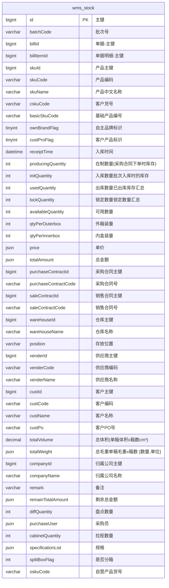
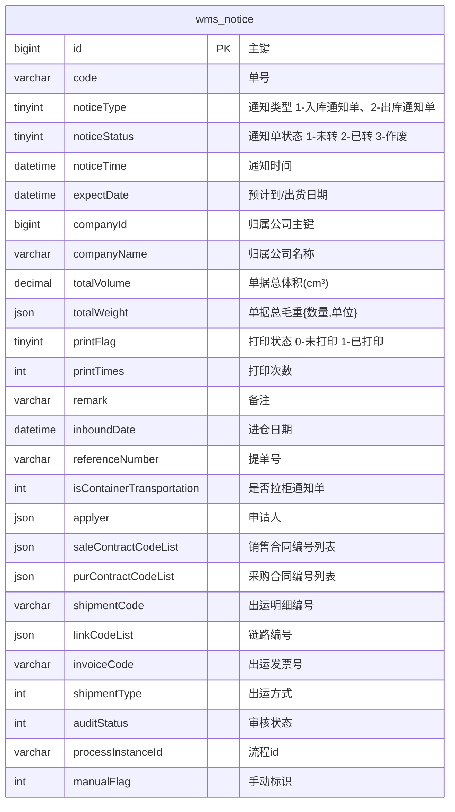
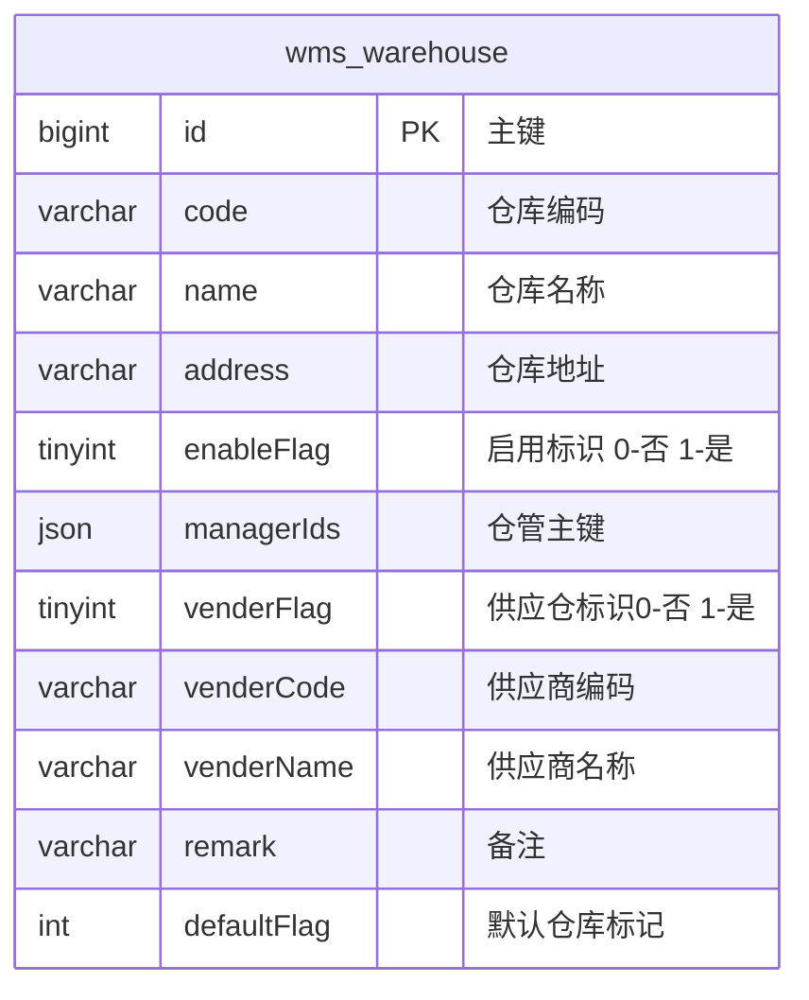
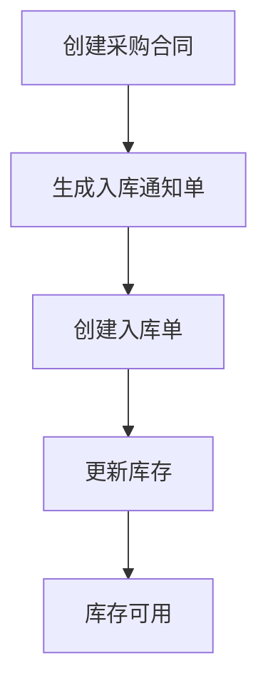
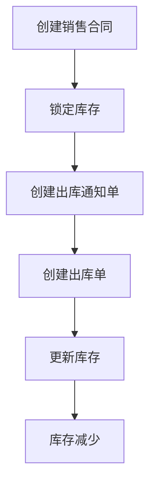
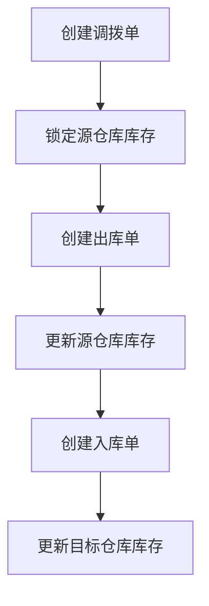
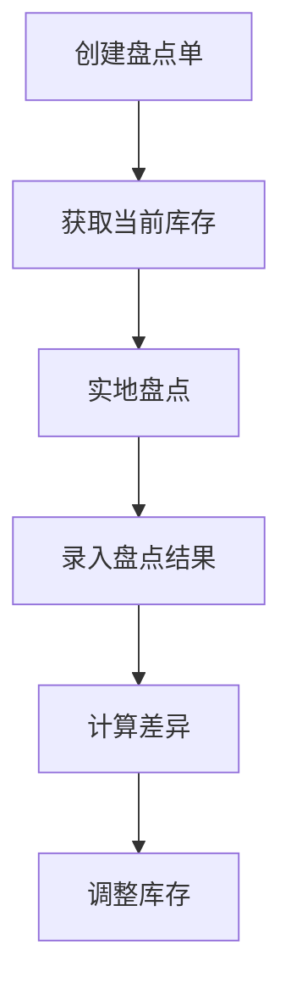
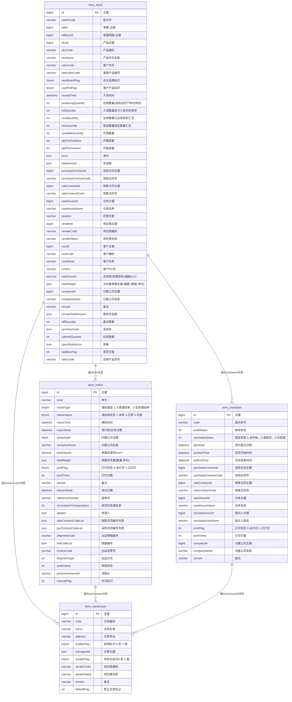
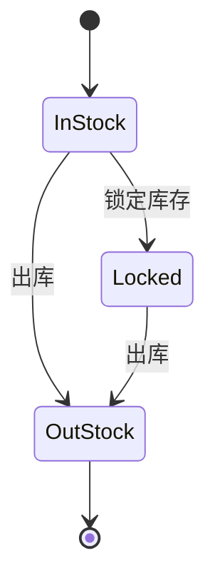

# 仓储数据模型

<cite>
**本文档引用的文件**
- [StockDO.java](file://eplus-module-wms/eplus-module-wms-biz/src/main/java/com/syj/eplus/module/wms/dal/dataobject/stock/StockDO.java)
- [StockNoticeDO.java](file://eplus-module-wms/eplus-module-wms-biz/src/main/java/com/syj/eplus/module/wms/dal/dataobject/stockNotice/StockNoticeDO.java)
- [WarehouseDO.java](file://eplus-module-wms/eplus-module-wms-biz/src/main/java/com/syj/eplus/module/wms/dal/dataobject/warehouse/WarehouseDO.java)
- [StocktakeDO.java](file://eplus-module-wms/eplus-module-wms-biz/src/main/java/com/syj/eplus/module/wms/dal/dataobject/stocktake/StocktakeDO.java)
- [V1_0_0_002__Eplus初始化.sql](file://eplus-flyway/src/main/resources/db/migration/common/V1_0_0_002__Eplus初始化.sql)
- [StockMapper.xml](file://eplus-module-wms/eplus-module-wms-biz/src/main/resources/mapper/stock/StockMapper.xml)
- [StockNoticeMapper.xml](file://eplus-module-wms/eplus-module-wms-biz/src/main/resources/mapper/stockNotice/StockNoticeMapper.xml)
</cite>

## 目录
1. [引言](#引言)
2. [核心实体设计](#核心实体设计)
3. [库存业务流程](#库存业务流程)
4. [ER图](#er图)
5. [库存状态管理](#库存状态管理)
6. [库存锁定机制](#库存锁定机制)
7. [批次管理](#批次管理)
8. [SQL建表语句](#sql建表语句)
9. [MyBatis Mapper配置](#mybatis-mapper配置)
10. [最佳实践](#最佳实践)

## 引言
本文档详细描述了仓储数据模型的设计，重点介绍库存管理、出入库通知单、仓库信息等核心实体。文档解释了库存业务流程的数据结构，包括入库、出库、调拨、盘点等操作的数据流转。通过ER图展示仓储相关表之间的关系，并详细说明库存状态管理、库存锁定、批次管理等关键功能的数据设计。文档还提供了实际的SQL建表语句和MyBatis Mapper配置示例，为开发者提供仓储数据建模的最佳实践。

## 核心实体设计

### 库存实体 (wms_stock)
库存实体是仓储管理的核心，记录了每个产品在仓库中的具体库存信息。该实体包含了批次号、产品信息、数量信息、价格信息以及相关的合同和客户信息。



**图源**
- [StockDO.java](file://eplus-module-wms/eplus-module-wms-biz/src/main/java/com/syj/eplus/module/wms/dal/dataobject/stock/StockDO.java)

**本节源**
- [StockDO.java](file://eplus-module-wms/eplus-module-wms-biz/src/main/java/com/syj/eplus/module/wms/dal/dataobject/stock/StockDO.java)

### 出入库通知单实体 (wms_notice)
出入库通知单实体用于管理入库和出库的通知信息，是连接采购合同、销售合同与实际库存操作的桥梁。



**图源**
- [StockNoticeDO.java](file://eplus-module-wms/eplus-module-wms-biz/src/main/java/com/syj/eplus/module/wms/dal/dataobject/stockNotice/StockNoticeDO.java)

**本节源**
- [StockNoticeDO.java](file://eplus-module-wms/eplus-module-wms-biz/src/main/java/com/syj/eplus/module/wms/dal/dataobject/stockNotice/StockNoticeDO.java)

### 仓库实体 (wms_warehouse)
仓库实体用于管理仓库的基本信息，包括仓库的编码、名称、地址、负责人等。



**图源**
- [WarehouseDO.java](file://eplus-module-wms/eplus-module-wms-biz/src/main/java/com/syj/eplus/module/wms/dal/dataobject/warehouse/WarehouseDO.java)

**本节源**
- [WarehouseDO.java](file://eplus-module-wms/eplus-module-wms-biz/src/main/java/com/syj/eplus/module/wms/dal/dataobject/warehouse/WarehouseDO.java)

## 库存业务流程

### 入库流程
入库流程从采购合同开始，通过创建入库通知单，最终生成库存记录。流程如下：
1. 创建采购合同
2. 生成入库通知单 (wms_notice)
3. 根据通知单创建入库单
4. 更新库存 (wms_stock)



**本节源**
- [StockNoticeDO.java](file://eplus-module-wms/eplus-module-wms-biz/src/main/java/com/syj/eplus/module/wms/dal/dataobject/stockNotice/StockNoticeDO.java)
- [StockDO.java](file://eplus-module-wms/eplus-module-wms-biz/src/main/java/com/syj/eplus/module/wms/dal/dataobject/stock/StockDO.java)

### 出库流程
出库流程从销售合同开始，通过锁定库存，最终完成出库操作。流程如下：
1. 创建销售合同
2. 锁定库存 (wms_stock_lock)
3. 创建出库通知单 (wms_notice)
4. 创建出库单
5. 更新库存 (wms_stock)



**本节源**
- [StockDO.java](file://eplus-module-wms/eplus-module-wms-biz/src/main/java/com/syj/eplus/module/wms/dal/dataobject/stock/StockDO.java)
- [StockNoticeDO.java](file://eplus-module-wms/eplus-module-wms-biz/src/main/java/com/syj/eplus/module/wms/dal/dataobject/stockNotice/StockNoticeDO.java)

### 调拨流程
调拨流程用于管理不同仓库之间的库存转移。



**本节源**
- [StockDO.java](file://eplus-module-wms/eplus-module-wms-biz/src/main/java/com/syj/eplus/module/wms/dal/dataobject/stock/StockDO.java)

### 盘点流程
盘点流程用于核对实际库存与系统库存的差异。



**本节源**
- [StocktakeDO.java](file://eplus-module-wms/eplus-module-wms-biz/src/main/java/com/syj/eplus/module/wms/dal/dataobject/stocktake/StocktakeDO.java)
- [StockDO.java](file://eplus-module-wms/eplus-module-wms-biz/src/main/java/com/syj/eplus/module/wms/dal/dataobject/stock/StockDO.java)

## ER图
以下是仓储相关表的ER图，展示了各实体之间的关系。



**图源**
- [StockDO.java](file://eplus-module-wms/eplus-module-wms-biz/src/main/java/com/syj/eplus/module/wms/dal/dataobject/stock/StockDO.java)
- [StockNoticeDO.java](file://eplus-module-wms/eplus-module-wms-biz/src/main/java/com/syj/eplus/module/wms/dal/dataobject/stockNotice/StockNoticeDO.java)
- [WarehouseDO.java](file://eplus-module-wms/eplus-module-wms-biz/src/main/java/com/syj/eplus/module/wms/dal/dataobject/warehouse/WarehouseDO.java)
- [StocktakeDO.java](file://eplus-module-wms/eplus-module-wms-biz/src/main/java/com/syj/eplus/module/wms/dal/dataobject/stocktake/StocktakeDO.java)

## 库存状态管理
库存状态通过多个字段共同管理，确保库存数据的准确性和一致性。

### 库存数量字段
- **initQuantity**: 入库数量，表示批次入库时的初始库存
- **usedQuantity**: 出库数量，表示已出库的库存汇总
- **lockQuantity**: 锁定数量，表示被锁定的库存汇总
- **availableQuantity**: 可用数量，计算公式为：`可用数量 = 入库数量 - 出库数量 - 锁定数量`

### 库存状态流转
库存状态通过业务操作自动流转，确保数据一致性。



**本节源**
- [StockDO.java](file://eplus-module-wms/eplus-module-wms-biz/src/main/java/com/syj/eplus/module/wms/dal/dataobject/stock/StockDO.java)

## 库存锁定机制
库存锁定机制用于确保在销售合同等业务场景下，库存不会被重复使用。

### 锁定流程
1. 创建销售合同时，根据需求锁定相应库存
2. 库存锁定后，availableQuantity相应减少
3. 出库时，从锁定库存中扣除
4. 取消订单时，释放锁定的库存

### 锁定相关字段
- **lockQuantity**: 记录当前被锁定的库存数量
- **availableQuantity**: 记录可用库存数量，受锁定数量影响

**本节源**
- [StockDO.java](file://eplus-module-wms/eplus-module-wms-biz/src/main/java/com/syj/eplus/module/wms/dal/dataobject/stock/StockDO.java)

## 批次管理
批次管理通过batchCode字段实现，每个批次的库存都有独立的记录。

### 批次号生成规则
批次号由系统自动生成，遵循特定的命名规则，确保唯一性。

### 批次相关字段
- **batchCode**: 批次号，用于标识同一采购批次的库存
- **receiptTime**: 入库时间，记录批次的入库时间
- **initQuantity**: 批次入库时的初始库存数量

**本节源**
- [StockDO.java](file://eplus-module-wms/eplus-module-wms-biz/src/main/java/com/syj/eplus/module/wms/dal/dataobject/stock/StockDO.java)

## SQL建表语句
以下是核心表的SQL建表语句。

```sql
-- ----------------------------
-- Table structure for wms_stock
-- ----------------------------
CREATE TABLE IF NOT EXISTS `wms_stock` (
    `id` bigint unsigned NOT NULL AUTO_INCREMENT COMMENT '主键',
    `batch_code` varchar(20) CHARACTER SET utf8mb4 COLLATE utf8mb4_general_ci DEFAULT NULL COMMENT '批次号',
    `bill_id` bigint DEFAULT NULL COMMENT '单据-主键',
    `bill_item_id` bigint DEFAULT NULL COMMENT '单据明细-主键',
    `sku_id` bigint DEFAULT NULL COMMENT '产品主键',
    `sku_code` varchar(20) NULL DEFAULT NULL COMMENT '产品编号',
    `sku_name` varchar(100) CHARACTER SET utf8mb4 COLLATE utf8mb4_general_ci DEFAULT NULL COMMENT '产品中文名称',
    `csku_code` varchar(20) CHARACTER SET utf8mb4 COLLATE utf8mb4_general_ci DEFAULT NULL COMMENT '客户货号',
    `basic_sku_code` varchar(50)   NULL DEFAULT '' COMMENT '基础产品编号',
    `own_brand_flag` tinyint DEFAULT NULL COMMENT '自主品牌标识',
    `cust_pro_flag` tinyint DEFAULT NULL COMMENT '客户产品标识',
    `receipt_time` datetime DEFAULT NULL COMMENT '入库时间',
    `producing_quantity` int NULL DEFAULT 0 COMMENT '在制数量(采购合同下单时库存)',
    `init_quantity` int DEFAULT '0' COMMENT '入库数量（批次入库时的库存）',
    `used_quantity` int DEFAULT '0' COMMENT '出库数量（已出库库存汇总）',
    `lock_quantity` int DEFAULT '0' COMMENT '锁定数量（锁定数量汇总）',
    `available_quantity` int DEFAULT '0' COMMENT '可用数量（可用数量=在制数量+入库数量-出库数量-锁定数量 无销售合同）',
    `qty_per_outerbox` int DEFAULT NULL COMMENT '外箱装量',
    `qty_per_innerbox` int DEFAULT NULL COMMENT '内盒装量',
    `price` json DEFAULT NULL COMMENT '单价',
    `total_amount` json DEFAULT NULL COMMENT '总金额',
    `purchase_contract_id` bigint DEFAULT NULL COMMENT '采购合同主键',
    `purchase_contract_code` varchar(20) CHARACTER SET utf8mb4 COLLATE utf8mb4_general_ci DEFAULT NULL COMMENT '采购合同号',
    `sale_contract_id` bigint DEFAULT NULL COMMENT '销售合同主键',
    `sale_contract_code` varchar(20) CHARACTER SET utf8mb4 COLLATE utf8mb4_general_ci DEFAULT NULL COMMENT '销售合同号',
    `warehouse_id` bigint DEFAULT NULL COMMENT '仓库主键',
    `warehouse_name` varchar(100) CHARACTER SET utf8mb4 COLLATE utf8mb4_general_ci DEFAULT NULL COMMENT '仓库名称',
    `position` varchar(200) CHARACTER SET utf8mb4 COLLATE utf8mb4_general_ci DEFAULT NULL COMMENT '存放位置',
    `vender_id` bigint DEFAULT NULL COMMENT '供应商主键',
    `vender_code` varchar(20) CHARACTER SET utf8mb4 COLLATE utf8mb4_general_ci DEFAULT NULL COMMENT '供应商编码',
    `vender_name` varchar(100) CHARACTER SET utf8mb4 COLLATE utf8mb4_general_ci DEFAULT NULL COMMENT '供应商名称',
    `cust_id` bigint DEFAULT NULL COMMENT '客户主键',
    `cust_code` varchar(20) CHARACTER SET utf8mb4 COLLATE utf8mb4_general_ci DEFAULT NULL COMMENT '客户编码',
    `cust_name` varchar(100) CHARACTER SET utf8mb4 COLLATE utf8mb4_general_ci DEFAULT NULL COMMENT '客户名称',
    `cust_po` varchar(50) CHARACTER SET utf8mb4 COLLATE utf8mb4_general_ci DEFAULT NULL COMMENT '客户PO号',
    `total_volume` decimal(10,2) DEFAULT NULL COMMENT '总体积(单箱体积x箱数cm³)',
    `total_weight` json DEFAULT NULL COMMENT '总毛重（单箱毛重x箱数 {数量,单位}）',
    `pallet_volume` decimal(10,2) DEFAULT NULL COMMENT '单托体积（cm³）',
    `pallet_weight` json DEFAULT NULL COMMENT '单托毛重（{数量,单位}）',
    `company_id` bigint DEFAULT NULL COMMENT '归属公司主键',
    `company_name` varchar(100) CHARACTER SET utf8mb4 COLLATE utf8mb4_general_ci DEFAULT NULL COMMENT '归属公司名称',
    `remark` varchar(500) CHARACTER SET utf8mb4 COLLATE utf8mb4_general_ci DEFAULT NULL COMMENT '备注',
    `remain_total_amount` json DEFAULT NULL COMMENT '剩余总金额',
    `diff_quantity` int DEFAULT NULL COMMENT '盘点数量',
    `purchase_user` json DEFAULT NULL COMMENT '采购员',
    `cabinet_quantity` int DEFAULT '0' COMMENT '拉柜数量',
    `specification_list` json DEFAULT NULL COMMENT '规格',
    `split_box_flag` tinyint DEFAULT '0' COMMENT '是否分箱',
    `osku_code` varchar(20) CHARACTER SET utf8mb4 COLLATE utf8mb4_general_ci DEFAULT NULL COMMENT '自营产品货号',
    `creator` int unsigned DEFAULT NULL COMMENT '创建人',
    `create_time` datetime DEFAULT CURRENT_TIMESTAMP COMMENT '创建时间',
    `updater` int unsigned DEFAULT NULL COMMENT '修改人',
    `update_time` datetime DEFAULT NULL ON UPDATE CURRENT_TIMESTAMP COMMENT '修改时间',
    `deleted` tinyint NOT NULL DEFAULT '0' COMMENT '删除  0-有效 1-删除',
    PRIMARY KEY (`id`)
) ENGINE=InnoDB DEFAULT CHARSET=utf8mb4 COLLATE=utf8mb4_general_ci COMMENT='仓储管理-库存明细';
```

```sql
-- ----------------------------
-- Table structure for wms_notice
-- ----------------------------
CREATE TABLE IF NOT EXISTS `wms_notice` (
    `id` bigint unsigned NOT NULL AUTO_INCREMENT COMMENT '主键',
    `code` varchar(20) CHARACTER SET utf8mb4 COLLATE utf8mb4_general_ci NOT NULL DEFAULT '' COMMENT '单号',
    `notice_type` tinyint DEFAULT NULL COMMENT '通知类型 1-入库通知单、2-出库通知单',
    `notice_status` tinyint DEFAULT NULL COMMENT '通知单状态 1-未转 2-已转 3-作废',
    `notice_time` datetime DEFAULT NULL COMMENT '通知时间',
    `expect_date` datetime DEFAULT NULL COMMENT '预计到/出货日期',
    `company_id` bigint DEFAULT NULL COMMENT '归属公司主键',
    `company_name` varchar(100) CHARACTER SET utf8mb4 COLLATE utf8mb4_general_ci DEFAULT NULL COMMENT '归属公司名称',
    `total_volume` decimal(10,2) DEFAULT NULL COMMENT '单据总体积(cm³)',
    `total_weight` json DEFAULT NULL COMMENT '单据总毛重（{数量,单位}）',
    `print_flag` tinyint DEFAULT NULL COMMENT '打印状态 0-未打印 1-已打印',
    `print_times` int NOT NULL DEFAULT 0 COMMENT '打印次数',
    `remark` varchar(500) CHARACTER SET utf8mb4 COLLATE utf8mb4_general_ci DEFAULT NULL COMMENT '备注',
    `inbound_date` datetime DEFAULT NULL COMMENT '进仓日期',
    `reference_number` varchar(50) CHARACTER SET utf8mb4 COLLATE utf8mb4_general_ci DEFAULT NULL COMMENT '提单号',
    `is_container_transportation` int DEFAULT NULL COMMENT '是否拉柜通知单',
    `applyer` json DEFAULT NULL COMMENT '申请人',
    `sale_contract_code_list` json DEFAULT NULL COMMENT '销售合同编号列表',
    `pur_contract_code_list` json DEFAULT NULL COMMENT '采购合同编号列表',
    `shipment_code` varchar(20) CHARACTER SET utf8mb4 COLLATE utf8mb4_general_ci DEFAULT NULL COMMENT '出运明细编号',
    `link_code_list` json DEFAULT NULL COMMENT '链路编号',
    `invoice_code` varchar(20) CHARACTER SET utf8mb4 COLLATE utf8mb4_general_ci DEFAULT NULL COMMENT '出运发票号',
    `shipment_type` int DEFAULT NULL COMMENT '出运方式',
    `audit_status` int DEFAULT NULL COMMENT '审核状态',
    `process_instance_id` varchar(50) CHARACTER SET utf8mb4 COLLATE utf8mb4_general_ci DEFAULT NULL COMMENT '流程id',
    `manual_flag` int DEFAULT NULL COMMENT '手动标识',
    `creator` int unsigned DEFAULT NULL COMMENT '创建人',
    `create_time` datetime DEFAULT CURRENT_TIMESTAMP COMMENT '创建时间',
    `updater` int unsigned DEFAULT NULL COMMENT '修改人',
    `update_time` datetime DEFAULT NULL ON UPDATE CURRENT_TIMESTAMP COMMENT '修改时间',
    `deleted` tinyint NOT NULL DEFAULT '0' COMMENT '删除  0-有效 1-删除',
    PRIMARY KEY (`id`)
) ENGINE=InnoDB DEFAULT CHARSET=utf8mb4 COLLATE=utf8mb4_general_ci COMMENT='仓储管理-入(出)库通知单';
```

```sql
-- ----------------------------
-- Table structure for wms_warehouse
-- ----------------------------
CREATE TABLE IF NOT EXISTS `wms_warehouse` (
    `id` bigint unsigned NOT NULL AUTO_INCREMENT COMMENT '主键',
    `code` varchar(20) CHARACTER SET utf8mb4 COLLATE utf8mb4_general_ci NOT NULL DEFAULT '' COMMENT '仓库编码',
    `name` varchar(100) CHARACTER SET utf8mb4 COLLATE utf8mb4_general_ci NOT NULL DEFAULT '' COMMENT '仓库名称',
    `address` varchar(200) CHARACTER SET utf8mb4 COLLATE utf8mb4_general_ci DEFAULT NULL COMMENT '仓库地址',
    `enable_flag` tinyint DEFAULT NULL COMMENT '启用标识  0-否 1-是',
    `manager_ids` json DEFAULT NULL COMMENT '仓管主键',
    `vender_flag` tinyint DEFAULT NULL COMMENT '供应仓标识0-否 1-是',
    `vender_code` varchar(20) CHARACTER SET utf8mb4 COLLATE utf8mb4_general_ci DEFAULT NULL COMMENT '供应商编码',
    `vender_name` varchar(100) CHARACTER SET utf8mb4 COLLATE utf8mb4_general_ci DEFAULT NULL COMMENT '供应商名称',
    `remark` varchar(500) CHARACTER SET utf8mb4 COLLATE utf8mb4_general_ci DEFAULT NULL COMMENT '备注',
    `default_flag` int DEFAULT NULL COMMENT '默认仓库标记',
    `creator` int unsigned DEFAULT NULL COMMENT '创建人',
    `create_time` datetime DEFAULT CURRENT_TIMESTAMP COMMENT '创建时间',
    `updater` int unsigned DEFAULT NULL COMMENT '修改人',
    `update_time` datetime DEFAULT NULL ON UPDATE CURRENT_TIMESTAMP COMMENT '修改时间',
    `deleted` tinyint NOT NULL DEFAULT '0' COMMENT '删除  0-有效 1-删除',
    PRIMARY KEY (`id`)
) ENGINE=InnoDB DEFAULT CHARSET=utf8mb4 COLLATE=utf8mb4_general_ci COMMENT='仓库管理-仓库';
```

**本节源**
- [V1_0_0_002__Eplus初始化.sql](file://eplus-flyway/src/main/resources/db/migration/common/V1_0_0_002__Eplus初始化.sql)

## MyBatis Mapper配置
以下是MyBatis Mapper配置示例。

```xml
<!-- StockMapper.xml -->
<?xml version="1.0" encoding="UTF-8"?>
<!DOCTYPE mapper PUBLIC "-//mybatis.org//DTD Mapper 3.0//EN" "http://mybatis.org/dtd/mybatis-3-mapper.dtd">
<mapper namespace="com.syj.eplus.module.wms.dal.mysql.stock.StockMapper">
    
    <resultMap id="BaseResultMap" type="com.syj.eplus.module.wms.dal.dataobject.stock.StockDO">
        <id column="id" property="id" />
        <result column="batch_code" property="batchCode" />
        <result column="bill_id" property="billId" />
        <result column="bill_item_id" property="billItemId" />
        <result column="sku_id" property="skuId" />
        <result column="sku_code" property="skuCode" />
        <result column="sku_name" property="skuName" />
        <result column="csku_code" property="cskuCode" />
        <result column="basic_sku_code" property="basicSkuCode" />
        <result column="own_brand_flag" property="ownBrandFlag" />
        <result column="cust_pro_flag" property="custProFlag" />
        <result column="receipt_time" property="receiptTime" />
        <result column="producing_quantity" property="producingQuantity" />
        <result column="init_quantity" property="initQuantity" />
        <result column="used_quantity" property="usedQuantity" />
        <result column="lock_quantity" property="lockQuantity" />
        <result column="available_quantity" property="availableQuantity" />
        <result column="qty_per_outerbox" property="qtyPerOuterbox" />
        <result column="qty_per_innerbox" property="qtyPerInnerbox" />
        <result column="price" property="price" typeHandler="com.syj.eplus.framework.common.config.handler.JsonAmountTypeHandler" />
        <result column="total_amount" property="totalAmount" typeHandler="com.syj.eplus.framework.common.config.handler.JsonAmountTypeHandler" />
        <result column="purchase_contract_id" property="purchaseContractId" />
        <result column="purchase_contract_code" property="purchaseContractCode" />
        <result column="sale_contract_id" property="saleContractId" />
        <result column="sale_contract_code" property="saleContractCode" />
        <result column="warehouse_id" property="warehouseId" />
        <result column="warehouse_name" property="warehouseName" />
        <result column="position" property="position" />
        <result column="vender_id" property="venderId" />
        <result column="vender_code" property="venderCode" />
        <result column="vender_name" property="venderName" />
        <result column="cust_id" property="custId" />
        <result column="cust_code" property="custCode" />
        <result column="cust_name" property="custName" />
        <result column="cust_po" property="custPo" />
        <result column="total_volume" property="totalVolume" />
        <result column="total_weight" property="totalWeight" typeHandler="com.syj.eplus.framework.common.config.handler.JsonWeightTypeHandler" />
        <result column="pallet_volume" property="palletVolume" />
        <result column="pallet_weight" property="palletWeight" typeHandler="com.syj.eplus.framework.common.config.handler.JsonWeightTypeHandler" />
        <result column="company_id" property="companyId" />
        <result column="company_name" property="companyName" />
        <result column="remark" property="remark" />
        <result column="remain_total_amount" property="remainTotalAmount" typeHandler="com.syj.eplus.framework.common.config.handler.JsonAmountTypeHandler" />
        <result column="diff_quantity" property="diffQuantity" />
        <result column="purchase_user" property="purchaseUser" typeHandler="com.syj.eplus.framework.common.config.handler.JsonUserDeptTypeHandler" />
        <result column="cabinet_quantity" property="cabinetQuantity" />
        <result column="specification_list" property="specificationList" typeHandler="com.syj.eplus.framework.common.config.handler.JsonSpecificationEntityListHandler" />
        <result column="split_box_flag" property="splitBoxFlag" />
        <result column="osku_code" property="oskuCode" />
        <result column="creator" property="creator" />
        <result column="create_time" property="createTime" />
        <result column="updater" property="updater" />
        <result column="update_time" property="updateTime" />
        <result column="deleted" property="deleted" />
    </resultMap>
    
    <sql id="select_stock">
        SELECT id, batch_code, bill_id, bill_item_id, sku_id, sku_code, sku_name, csku_code, 
               basic_sku_code, own_brand_flag, cust_pro_flag, receipt_time, producing_quantity,
               init_quantity, used_quantity, lock_quantity, available_quantity, qty_per_outerbox,
               qty_per_innerbox, price, total_amount, purchase_contract_id, purchase_contract_code,
               sale_contract_id, sale_contract_code, warehouse_id, warehouse_name, position,
               vender_id, vender_code, vender_name, cust_id, cust_code, cust_name, cust_po,
               total_volume, total_weight, pallet_volume, pallet_weight, company_id, company_name,
               remark, remain_total_amount, diff_quantity, purchase_user, cabinet_quantity,
               specification_list, split_box_flag, osku_code, creator, create_time, updater,
               update_time, deleted
        FROM wms_stock
    </sql>
    
    <select id="selectById" resultMap="BaseResultMap">
        <include refid="select_stock" />
        WHERE id = #{id} AND deleted = 0
    </select>
    
    <select id="selectList" resultMap="BaseResultMap">
        <include refid="select_stock" />
        <where>
            <if test="skuId != null">AND sku_id = #{skuId}</if>
            <if test="batchCode != null">AND batch_code = #{batchCode}</if>
            <if test="warehouseId != null">AND warehouse_id = #{warehouseId}</if>
            <if test="saleContractCode != null">AND sale_contract_code = #{saleContractCode}</if>
            <if test="purchaseContractCode != null">AND purchase_contract_code = #{purchaseContractCode}</if>
            deleted = 0
        </where>
    </select>
    
    <insert id="insert" useGeneratedKeys="true" keyProperty="id">
        INSERT INTO wms_stock (
            batch_code, bill_id, bill_item_id, sku_id, sku_code, sku_name, csku_code,
            basic_sku_code, own_brand_flag, cust_pro_flag, receipt_time, producing_quantity,
            init_quantity, used_quantity, lock_quantity, available_quantity, qty_per_outerbox,
            qty_per_innerbox, price, total_amount, purchase_contract_id, purchase_contract_code,
            sale_contract_id, sale_contract_code, warehouse_id, warehouse_name, position,
            vender_id, vender_code, vender_name, cust_id, cust_code, cust_name, cust_po,
            total_volume, total_weight, pallet_volume, pallet_weight, company_id, company_name,
            remark, remain_total_amount, diff_quantity, purchase_user, cabinet_quantity,
            specification_list, split_box_flag, osku_code, creator, create_time, updater,
            update_time, deleted
        ) VALUES (
            #{batchCode}, #{billId}, #{billItemId}, #{skuId}, #{skuCode}, #{skuName}, #{cskuCode},
            #{basicSkuCode}, #{ownBrandFlag}, #{custProFlag}, #{receiptTime}, #{producingQuantity},
            #{initQuantity}, #{usedQuantity}, #{lockQuantity}, #{availableQuantity}, #{qtyPerOuterbox},
            #{qtyPerInnerbox}, #{price, typeHandler=com.syj.eplus.framework.common.config.handler.JsonAmountTypeHandler},
            #{totalAmount, typeHandler=com.syj.eplus.framework.common.config.handler.JsonAmountTypeHandler},
            #{purchaseContractId}, #{purchaseContractCode}, #{saleContractId}, #{saleContractCode},
            #{warehouseId}, #{warehouseName}, #{position}, #{venderId}, #{venderCode}, #{venderName},
            #{custId}, #{custCode}, #{custName}, #{custPo}, #{totalVolume}, 
            #{totalWeight, typeHandler=com.syj.eplus.framework.common.config.handler.JsonWeightTypeHandler},
            #{palletVolume}, 
            #{palletWeight, typeHandler=com.syj.eplus.framework.common.config.handler.JsonWeightTypeHandler},
            #{companyId}, #{companyName}, #{remark}, 
            #{remainTotalAmount, typeHandler=com.syj.eplus.framework.common.config.handler.JsonAmountTypeHandler},
            #{diffQuantity}, 
            #{purchaseUser, typeHandler=com.syj.eplus.framework.common.config.handler.JsonUserDeptTypeHandler},
            #{cabinetQuantity}, 
            #{specificationList, typeHandler=com.syj.eplus.framework.common.config.handler.JsonSpecificationEntityListHandler},
            #{splitBoxFlag}, #{oskuCode}, #{creator}, #{createTime}, #{updater}, #{updateTime}, #{deleted}
        )
    </insert>
    
    <update id="updateById">
        UPDATE wms_stock
        SET
            <if test="batchCode != null">batch_code = #{batchCode},</if>
            <if test="billId != null">bill_id = #{billId},</if>
            <if test="billItemId != null">bill_item_id = #{billItemId},</if>
            <if test="skuId != null">sku_id = #{skuId},</if>
            <if test="skuCode != null">sku_code = #{skuCode},</if>
            <if test="skuName != null">sku_name = #{skuName},</if>
            <if test="cskuCode != null">csku_code = #{cskuCode},</if>
            <if test="basicSkuCode != null">basic_sku_code = #{basicSkuCode},</if>
            <if test="ownBrandFlag != null">own_brand_flag = #{ownBrandFlag},</if>
            <if test="custProFlag != null">cust_pro_flag = #{custProFlag},</if>
            <if test="receiptTime != null">receipt_time = #{receiptTime},</if>
            <if test="producingQuantity != null">producing_quantity = #{producingQuantity},</if>
            <if test="initQuantity != null">init_quantity = #{initQuantity},</if>
            <if test="usedQuantity != null">used_quantity = #{usedQuantity},</if>
            <if test="lockQuantity != null">lock_quantity = #{lockQuantity},</if>
            <if test="availableQuantity != null">available_quantity = #{availableQuantity},</if>
            <if test="qtyPerOuterbox != null">qty_per_outerbox = #{qtyPerOuterbox},</if>
            <if test="qtyPerInnerbox != null">qty_per_innerbox = #{qtyPerInnerbox},</if>
            <if test="price != null">price = #{price, typeHandler=com.syj.eplus.framework.common.config.handler.JsonAmountTypeHandler},</if>
            <if test="totalAmount != null">total_amount = #{totalAmount, typeHandler=com.syj.eplus.framework.common.config.handler.JsonAmountTypeHandler},</if>
            <if test="purchaseContractId != null">purchase_contract_id = #{purchaseContractId},</if>
            <if test="purchaseContractCode != null">purchase_contract_code = #{purchaseContractCode},</if>
            <if test="saleContractId != null">sale_contract_id = #{saleContractId},</if>
            <if test="saleContractCode != null">sale_contract_code = #{saleContractCode},</if>
            <if test="warehouseId != null">warehouse_id = #{warehouseId},</if>
            <if test="warehouseName != null">warehouse_name = #{warehouseName},</if>
            <if test="position != null">position = #{position},</if>
            <if test="venderId != null">vender_id = #{venderId},</if>
            <if test="venderCode != null">vender_code = #{venderCode},</if>
            <if test="venderName != null">vender_name = #{venderName},</if>
            <if test="custId != null">cust_id = #{custId},</if>
            <if test="custCode != null">cust_code = #{custCode},</if>
            <if test="custName != null">cust_name = #{custName},</if>
            <if test="custPo != null">cust_po = #{custPo},</if>
            <if test="totalVolume != null">total_volume = #{totalVolume},</if>
            <if test="totalWeight != null">total_weight = #{totalWeight, typeHandler=com.syj.eplus.framework.common.config.handler.JsonWeightTypeHandler},</if>
            <if test="palletVolume != null">pallet_volume = #{palletVolume},</if>
            <if test="palletWeight != null">pallet_weight = #{palletWeight, typeHandler=com.syj.eplus.framework.common.config.handler.JsonWeightTypeHandler},</if>
            <if test="companyId != null">company_id = #{companyId},</if>
            <if test="companyName != null">company_name = #{companyName},</if>
            <if test="remark != null">remark = #{remark},</if>
            <if test="remainTotalAmount != null">remain_total_amount = #{remainTotalAmount, typeHandler=com.syj.eplus.framework.common.config.handler.JsonAmountTypeHandler},</if>
            <if test="diffQuantity != null">diff_quantity = #{diffQuantity},</if>
            <if test="purchaseUser != null">purchase_user = #{purchaseUser, typeHandler=com.syj.eplus.framework.common.config.handler.JsonUserDeptTypeHandler},</if>
            <if test="cabinetQuantity != null">cabinet_quantity = #{cabinetQuantity},</if>
            <if test="specificationList != null">specification_list = #{specificationList, typeHandler=com.syj.eplus.framework.common.config.handler.JsonSpecificationEntityListHandler},</if>
            <if test="splitBoxFlag != null">split_box_flag = #{splitBoxFlag},</if>
            <if test="oskuCode != null">osku_code = #{oskuCode},</if>
            updater = #{updater},
            update_time = #{updateTime}
        WHERE id = #{id} AND deleted = 0
    </update>
    
    <update id="deleteById">
        UPDATE wms_stock
        SET deleted = 1, updater = #{updater}, update_time = #{updateTime}
        WHERE id = #{id} AND deleted = 0
    </update>
</mapper>
```

```xml
<!-- StockNoticeMapper.xml -->
<?xml version="1.0" encoding="UTF-8"?>
<!DOCTYPE mapper PUBLIC "-//mybatis.org//DTD Mapper 3.0//EN" "http://mybatis.org/dtd/mybatis-3-mapper.dtd">
<mapper namespace="com.syj.eplus.module.wms.dal.mysql.stockNotice.StockNoticeMapper">
    
    <resultMap id="BaseResultMap" type="com.syj.eplus.module.wms.dal.dataobject.stockNotice.StockNoticeDO">
        <id column="id" property="id" />
        <result column="code" property="code" />
        <result column="notice_type" property="noticeType" />
        <result column="notice_status" property="noticeStatus" />
        <result column="notice_time" property="noticeTime" />
        <result column="expect_date" property="expectDate" />
        <result column="company_id" property="companyId" />
        <result column="company_name" property="companyName" />
        <result column="total_volume" property="totalVolume" />
        <result column="total_weight" property="totalWeight" typeHandler="com.syj.eplus.framework.common.config.handler.JsonWeightTypeHandler" />
        <result column="print_flag" property="printFlag" />
        <result column="print_times" property="printTimes" />
        <result column="remark" property="remark" />
        <result column="inbound_date" property="inboundDate" />
        <result column="reference_number" property="referenceNumber" />
        <result column="is_container_transportation" property="isContainerTransportation" />
        <result column="applyer" property="applyer" typeHandler="com.syj.eplus.framework.common.config.handler.JsonUserDeptTypeHandler" />
        <result column="sale_contract_code_list" property="saleContractCodeList" typeHandler="com.syj.eplus.framework.common.config.handler.StringListTypeHandler" />
        <result column="pur_contract_code_list" property="purContractCodeList" typeHandler="com.syj.eplus.framework.common.config.handler.StringListTypeHandler" />
        <result column="shipment_code" property="shipmentCode" />
        <result column="link_code_list" property="linkCodeList" typeHandler="com.syj.eplus.framework.common.config.handler.StringListTypeHandler" />
        <result column="invoice_code" property="invoiceCode" />
        <result column="shipment_type" property="shipmentType" />
        <result column="audit_status" property="auditStatus" />
        <result column="process_instance_id" property="processInstanceId" />
        <result column="manual_flag" property="manualFlag" />
        <result column="creator" property="creator" />
        <result column="create_time" property="createTime" />
        <result column="updater" property="updater" />
        <result column="update_time" property="updateTime" />
        <result column="deleted" property="deleted" />
    </resultMap>
    
    <sql id="select_stock_notice">
        SELECT id, code, notice_type, notice_status, notice_time, expect_date, company_id,
               company_name, total_volume, total_weight, print_flag, print_times, remark,
               inbound_date, reference_number, is_container_transportation, applyer,
               sale_contract_code_list, pur_contract_code_list, shipment_code, link_code_list,
               invoice_code, shipment_type, audit_status, process_instance_id, manual_flag,
               creator, create_time, updater, update_time, deleted
        FROM wms_notice
    </sql>
    
    <select id="selectById" resultMap="BaseResultMap">
        <include refid="select_stock_notice" />
        WHERE id = #{id} AND deleted = 0
    </select>
    
    <select id="selectList" resultMap="BaseResultMap">
        <include refid="select_stock_notice" />
        <where>
            <if test="noticeType != null">AND notice_type = #{noticeType}</if>
            <if test="noticeStatus != null">AND notice_status = #{noticeStatus}</if>
            <if test="warehouseId != null">AND warehouse_id = #{warehouseId}</if>
            <if test="purchaseContractId != null">AND purchase_contract_id = #{purchaseContractId}</if>
            <if test="saleContractId != null">AND sale_contract_id = #{saleContractId}</if>
            deleted = 0
        </where>
    </select>
    
    <insert id="insert" useGeneratedKeys="true" keyProperty="id">
        INSERT INTO wms_notice (
            code, notice_type, notice_status, notice_time, expect_date, company_id,
            company_name, total_volume, total_weight, print_flag, print_times, remark,
            inbound_date, reference_number, is_container_transportation, applyer,
            sale_contract_code_list, pur_contract_code_list, shipment_code, link_code_list,
            invoice_code, shipment_type, audit_status, process_instance_id, manual_flag,
            creator, create_time, updater, update_time, deleted
        ) VALUES (
            #{code}, #{noticeType}, #{noticeStatus}, #{noticeTime}, #{expectDate}, #{companyId},
            #{companyName}, #{totalVolume}, 
            #{totalWeight, typeHandler=com.syj.eplus.framework.common.config.handler.JsonWeightTypeHandler},
            #{printFlag}, #{printTimes}, #{remark}, #{inboundDate}, #{referenceNumber},
            #{isContainerTransportation}, 
            #{applyer, typeHandler=com.syj.eplus.framework.common.config.handler.JsonUserDeptTypeHandler},
            #{saleContractCodeList, typeHandler=com.syj.eplus.framework.common.config.handler.StringListTypeHandler},
            #{purContractCodeList, typeHandler=com.syj.eplus.framework.common.config.handler.StringListTypeHandler},
            #{shipmentCode}, #{linkCodeList, typeHandler=com.syj.eplus.framework.common.config.handler.StringListTypeHandler},
            #{invoiceCode}, #{shipmentType}, #{auditStatus}, #{processInstanceId}, #{manualFlag},
            #{creator}, #{createTime}, #{updater}, #{updateTime}, #{deleted}
        )
    </insert>
    
    <update id="updateById">
        UPDATE wms_notice
        SET
            <if test="code != null">code = #{code},</if>
            <if test="noticeType != null">notice_type = #{noticeType},</if>
            <if test="noticeStatus != null">notice_status = #{noticeStatus},</if>
            <if test="noticeTime != null">notice_time = #{noticeTime},</if>
            <if test="expectDate != null">expect_date = #{expectDate},</if>
            <if test="companyId != null">company_id = #{companyId},</if>
            <if test="companyName != null">company_name = #{companyName},</if>
            <if test="totalVolume != null">total_volume = #{totalVolume},</if>
            <if test="totalWeight != null">total_weight = #{totalWeight, typeHandler=com.syj.eplus.framework.common.config.handler.JsonWeightTypeHandler},</if>
            <if test="printFlag != null">print_flag = #{printFlag},</if>
            <if test="printTimes != null">print_times = #{printTimes},</if>
            <if test="remark != null">remark = #{remark},</if>
            <if test="inboundDate != null">inbound_date = #{inboundDate},</if>
            <if test="referenceNumber != null">reference_number = #{referenceNumber},</if>
            <if test="isContainerTransportation != null">is_container_transportation = #{isContainerTransportation},</if>
            <if test="applyer != null">applyer = #{applyer, typeHandler=com.syj.eplus.framework.common.config.handler.JsonUserDeptTypeHandler},</if>
            <if test="saleContractCodeList != null">sale_contract_code_list = #{saleContractCodeList, typeHandler=com.syj.eplus.framework.common.config.handler.StringListTypeHandler},</if>
            <if test="purContractCodeList != null">pur_contract_code_list = #{purContractCodeList, typeHandler=com.syj.eplus.framework.common.config.handler.StringListTypeHandler},</if>
            <if test="shipmentCode != null">shipment_code = #{shipmentCode},</if>
            <if test="linkCodeList != null">link_code_list = #{linkCodeList, typeHandler=com.syj.eplus.framework.common.config.handler.StringListTypeHandler},</if>
            <if test="invoiceCode != null">invoice_code = #{invoiceCode},</if>
            <if test="shipmentType != null">shipment_type = #{shipmentType},</if>
            <if test="auditStatus != null">audit_status = #{auditStatus},</if>
            <if test="processInstanceId != null">process_instance_id = #{processInstanceId},</if>
            <if test="manualFlag != null">manual_flag = #{manualFlag},</if>
            updater = #{updater},
            update_time = #{updateTime}
        WHERE id = #{id} AND deleted = 0
    </update>
    
    <update id="deleteById">
        UPDATE wms_notice
        SET deleted = 1, updater = #{updater}, update_time = #{updateTime}
        WHERE id = #{id} AND deleted = 0
    </update>
</mapper>
```

**图源**
- [StockMapper.xml](file://eplus-module-wms/eplus-module-wms-biz/src/main/resources/mapper/stock/StockMapper.xml)
- [StockNoticeMapper.xml](file://eplus-module-wms/eplus-module-wms-biz/src/main/resources/mapper/stockNotice/StockNoticeMapper.xml)

**本节源**
- [StockMapper.xml](file://eplus-module-wms/eplus-module-wms-biz/src/main/resources/mapper/stock/StockMapper.xml)
- [StockNoticeMapper.xml](file://eplus-module-wms/eplus-module-wms-biz/src/main/resources/mapper/stockNotice/StockNoticeMapper.xml)

## 最佳实践
1. **库存一致性**: 在进行库存操作时，必须确保initQuantity、usedQuantity、lockQuantity和availableQuantity四个字段的一致性。
2. **事务管理**: 所有库存相关的操作都应在事务中执行，确保数据的原子性。
3. **批次管理**: 每个批次的库存应独立管理，避免混淆不同批次的产品。
4. **库存锁定**: 在销售合同等场景下，应及时锁定相应库存，防止超卖。
5. **数据冗余**: 适当的数据冗余可以提高查询性能，如在库存表中存储仓库名称、客户名称等信息。
6. **软删除**: 使用deleted字段实现软删除，便于数据恢复和审计。
7. **索引优化**: 为常用查询字段创建索引，如sku_id、batch_code、warehouse_id等。

**本节源**
- [StockDO.java](file://eplus-module-wms/eplus-module-wms-biz/src/main/java/com/syj/eplus/module/wms/dal/dataobject/stock/StockDO.java)
- [StockNoticeDO.java](file://eplus-module-wms/eplus-module-wms-biz/src/main/java/com/syj/eplus/module/wms/dal/dataobject/stockNotice/StockNoticeDO.java)