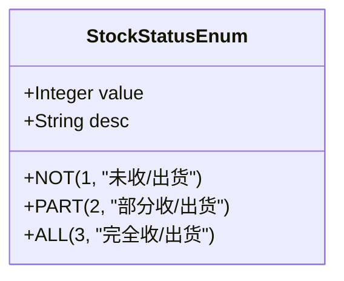
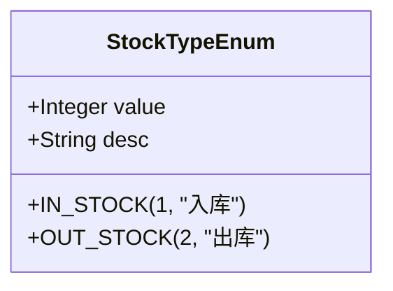
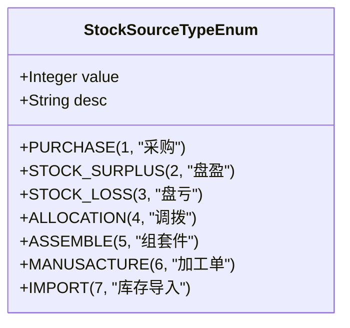
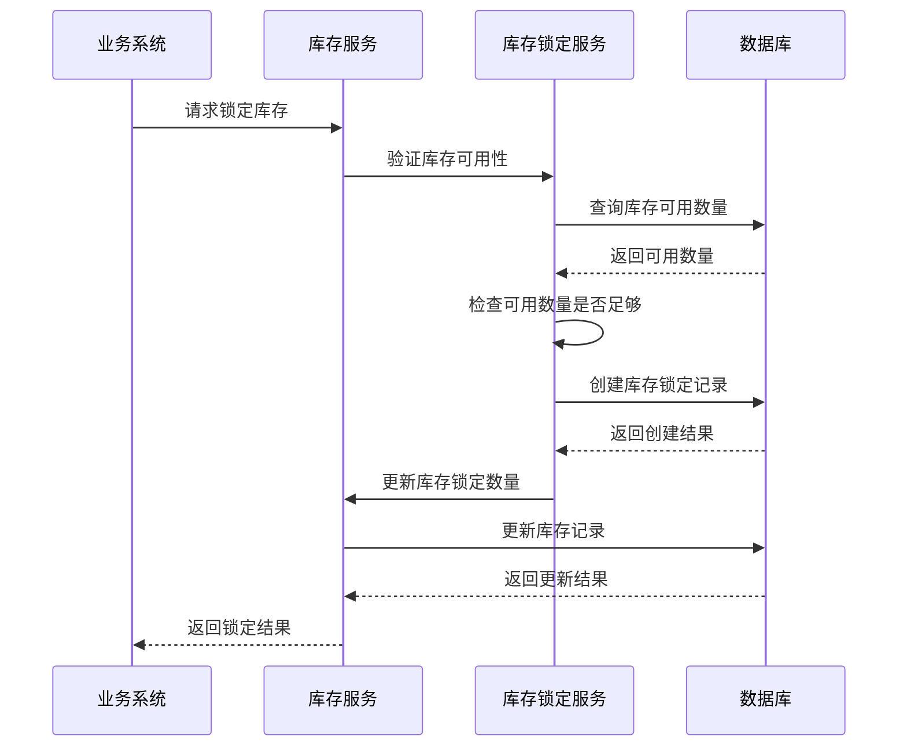
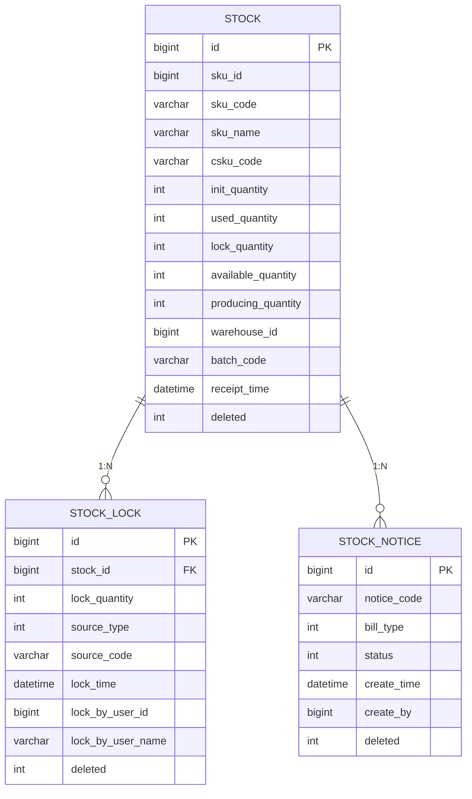
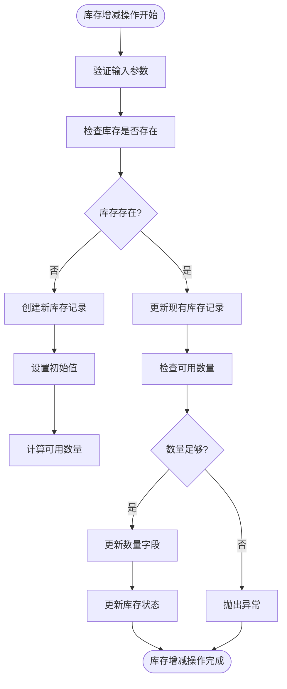

# 库存管理

<cite>
**本文档引用的文件**
- [StockStatusEnum.java](file://eplus-module-wms/eplus-module-wms-api/src/main/java/com/syj/eplus/module/wms/enums/StockStatusEnum.java)
- [StockTypeEnum.java](file://eplus-module-wms/eplus-module-wms-api/src/main/java/com/syj/eplus/module/wms/enums/StockTypeEnum.java)
- [StockSourceTypeEnum.java](file://eplus-module-wms/eplus-module-wms-api/src/main/java/com/syj/eplus/module/wms/enums/StockSourceTypeEnum.java)
- [StockLockSourceTypeEnum.java](file://eplus-module-wms/eplus-module-wms-api/src/main/java/com/syj/eplus/module/wms/enums/StockLockSourceTypeEnum.java)
- [StockDO.java](file://eplus-module-wms/eplus-module-wms-biz/src/main/java/com/syj/eplus/module/wms/dal/dataobject/stock/StockDO.java)
- [StockLockDO.java](file://eplus-module-wms/eplus-module-wms-biz/src/main/java/com/syj/eplus/module/wms/dal/dataobject/stocklock/StockLockDO.java)
- [StockMapper.xml](file://eplus-module-wms/eplus-module-wms-biz/src/main/resources/mapper/stock/StockMapper.xml)
- [StockLockMapper.xml](file://eplus-module-wms/eplus-module-wms-biz/src/main/resources/mapper/stocklock/StockLockMapper.xml)
- [StockApiImpl.java](file://eplus-module-wms/eplus-module-wms-biz/src/main/java/com/syj/eplus/module/wms/api/stock/StockApiImpl.java)
- [StockLockServiceImpl.java](file://eplus-module-wms/eplus-module-wms-biz/src/main/java/com/syj/eplus/module/wms/service/stocklock/StockLockServiceImpl.java)
</cite>

## 目录
1. [引言](#引言)
2. [库存实体设计](#库存实体设计)
3. [库存状态管理](#库存状态管理)
4. [库存类型管理](#库存类型管理)
5. [库存来源管理](#库存来源管理)
6. [库存锁定管理](#库存锁定管理)
7. [库存数据模型ER图](#库存数据模型er图)
8. [SQL建表语句示例](#sql建表语句示例)
9. [MyBatis Mapper配置示例](#mybatis-mapper配置示例)
10. [库存增减业务逻辑](#库存增减业务逻辑)
11. [批次管理功能](#批次管理功能)
12. [最佳实践建议](#最佳实践建议)

## 引言
本文档详细描述了库存管理系统中库存实体的设计与实现。重点阐述了库存状态管理、库存类型管理以及库存来源管理的设计原理。文档详细说明了库存增减、库存锁定、批次管理等功能的数据结构和业务逻辑，提供了库存相关表的ER图，包括库存主表、库存明细表、库存锁定表之间的关系，并包含实际的SQL建表语句和MyBatis Mapper配置示例，为开发者提供库存数据建模的最佳实践。

## 库存实体设计
库存实体是库存管理系统的核心，用于记录和管理仓库中所有产品的库存信息。库存实体设计遵循了高内聚低耦合的原则，将库存相关的属性和行为封装在`StockDO`类中。该类继承自`BaseDO`基类，包含了系统通用的审计字段，如创建时间、更新时间等。

库存实体包含了产品基本信息（如产品主键、产品编码、产品名称）、库存数量信息（如初始数量、已用数量、锁定数量、可用数量、在制数量）、客户信息（如客户ID、客户名称、客户货号）、供应商信息（如供应商ID、供应商名称）以及仓库信息（如仓库ID、仓库名称）等关键属性。

**Section sources**
- [StockDO.java](file://eplus-module-wms/eplus-module-wms-biz/src/main/java/com/syj/eplus/module/wms/dal/dataobject/stock/StockDO.java#L1-L200)

## 库存状态管理
库存状态管理通过`StockStatusEnum`枚举类实现，用于标识库存的出入库状态。该枚举定义了三种状态：未收/出货、部分收/出货和完全收/出货。这种状态管理机制有助于跟踪库存的流转过程，确保库存数据的准确性和实时性。

库存状态的管理对于库存控制至关重要。例如，当采购订单创建时，相关库存的状态为"未收货"；当部分货物到达仓库时，状态变为"部分收货"；当所有货物都到达仓库并完成验收后，状态变为"完全收货"。同样，对于出库操作，状态的变化反映了出库的进度。



**Diagram sources**
- [StockStatusEnum.java](file://eplus-module-wms/eplus-module-wms-api/src/main/java/com/syj/eplus/module/wms/enums/StockStatusEnum.java#L1-L24)

**Section sources**
- [StockStatusEnum.java](file://eplus-module-wms/eplus-module-wms-api/src/main/java/com/syj/eplus/module/wms/enums/StockStatusEnum.java#L1-L24)

## 库存类型管理
库存类型管理通过`StockTypeEnum`枚举类实现，用于区分入库和出库两种基本操作。该枚举定义了两种类型：入库（值为1）和出库（值为2）。这种类型管理机制为库存的增减操作提供了明确的分类，便于进行库存统计和分析。

库存类型的管理是库存业务逻辑的基础。不同的库存类型对应不同的业务流程和数据处理逻辑。例如，入库操作会增加库存数量，而出库操作会减少库存数量。通过明确的类型区分，系统可以正确地执行相应的业务逻辑，确保库存数据的准确性。



**Diagram sources**
- [StockTypeEnum.java](file://eplus-module-wms/eplus-module-wms-api/src/main/java/com/syj/eplus/module/wms/enums/StockTypeEnum.java#L1-L22)

**Section sources**
- [StockTypeEnum.java](file://eplus-module-wms/eplus-module-wms-api/src/main/java/com/syj/eplus/module/wms/enums/StockTypeEnum.java#L1-L22)

## 库存来源管理
库存来源管理通过`StockSourceTypeEnum`枚举类实现，用于标识库存变动的来源单据类型。该枚举定义了多种来源类型，包括采购、盘盈、盘亏、调拨、组套件、加工单和库存导入。这种来源管理机制为库存变动提供了完整的追溯能力，有助于进行库存审计和分析。

库存来源的管理对于理解库存变动的原因至关重要。例如，当库存增加时，可以通过来源类型判断是由于采购入库、盘点盘盈还是其他原因；当库存减少时，可以判断是由于出库、盘点盘亏还是其他原因。这种精细化的管理有助于提高库存管理的透明度和准确性。



**Diagram sources**
- [StockSourceTypeEnum.java](file://eplus-module-wms/eplus-module-wms-api/src/main/java/com/syj/eplus/module/wms/enums/StockSourceTypeEnum.java#L1-L24)

**Section sources**
- [StockSourceTypeEnum.java](file://eplus-module-wms/eplus-module-wms-api/src/main/java/com/syj/eplus/module/wms/enums/StockSourceTypeEnum.java#L1-L24)

## 库存锁定管理
库存锁定管理通过`StockLockDO`实体和`StockLockServiceImpl`服务实现，用于在特定业务场景下锁定库存，防止库存被重复使用。库存锁定通常发生在销售合同创建、加工单生成等场景，确保相关业务有足够的库存支持。

库存锁定机制通过`StockLockDO`实体记录锁定信息，包括被锁定的库存主键、锁定数量、原单据类型、原单据编号、锁定时间和锁定人等。当需要锁定库存时，系统会检查目标库存的可用数量是否足够，如果足够则创建锁定记录并更新库存的锁定数量和可用数量。



**Diagram sources**
- [StockLockDO.java](file://eplus-module-wms/eplus-module-wms-biz/src/main/java/com/syj/eplus/module/wms/dal/dataobject/stocklock/StockLockDO.java#L1-L50)
- [StockLockServiceImpl.java](file://eplus-module-wms/eplus-module-wms-biz/src/main/java/com/syj/eplus/module/wms/service/stocklock/StockLockServiceImpl.java#L152-L179)

**Section sources**
- [StockLockDO.java](file://eplus-module-wms/eplus-module-wms-biz/src/main/java/com/syj/eplus/module/wms/dal/dataobject/stocklock/StockLockDO.java#L1-L50)
- [StockLockServiceImpl.java](file://eplus-module-wms/eplus-module-wms-biz/src/main/java/com/syj/eplus/module/wms/service/stocklock/StockLockServiceImpl.java#L152-L179)

## 库存数据模型ER图
以下ER图展示了库存管理系统中核心表之间的关系，包括库存主表、库存明细表和库存锁定表。



**Diagram sources**
- [StockDO.java](file://eplus-module-wms/eplus-module-wms-biz/src/main/java/com/syj/eplus/module/wms/dal/dataobject/stock/StockDO.java#L1-L200)
- [StockLockDO.java](file://eplus-module-wms/eplus-module-wms-biz/src/main/java/com/syj/eplus/module/wms/dal/dataobject/stocklock/StockLockDO.java#L1-L50)
- [StockNoticeDO.java](file://eplus-module-wms/eplus-module-wms-biz/src/main/java/com/syj/eplus/module/wms/dal/dataobject/stockNotice/StockNoticeDO.java#L1-L50)

**Section sources**
- [StockDO.java](file://eplus-module-wms/eplus-module-wms-biz/src/main/java/com/syj/eplus/module/wms/dal/dataobject/stock/StockDO.java#L1-L200)
- [StockLockDO.java](file://eplus-module-wms/eplus-module-wms-biz/src/main/java/com/syj/eplus/module/wms/dal/dataobject/stocklock/StockLockDO.java#L1-L50)
- [StockNoticeDO.java](file://eplus-module-wms/eplus-module-wms-biz/src/main/java/com/syj/eplus/module/wms/dal/dataobject/stockNotice/StockNoticeDO.java#L1-L50)

## SQL建表语句示例
以下是库存主表`wms_stock`的SQL建表语句示例：

```sql
CREATE TABLE wms_stock (
    id BIGINT NOT NULL COMMENT '主键',
    cust_id BIGINT COMMENT '客户主键',
    cust_name VARCHAR(255) COMMENT '客户名称',
    csku_code VARCHAR(255) COMMENT '客户货号',
    cust_po VARCHAR(255) COMMENT '客户PO',
    sku_id BIGINT COMMENT '产品主键',
    sku_code VARCHAR(255) COMMENT '产品编码',
    sku_name VARCHAR(255) COMMENT '产品中文名称',
    own_brand_flag INT COMMENT '自主品牌标识',
    cust_pro_flag INT COMMENT '客户产品标识',
    init_quantity INT COMMENT '初始数量',
    used_quantity INT COMMENT '已用数量',
    lock_quantity INT COMMENT '锁定数量',
    available_quantity INT COMMENT '可用数量',
    producing_quantity INT COMMENT '在制数量',
    warehouse_id BIGINT COMMENT '仓库主键',
    warehouse_name VARCHAR(255) COMMENT '仓库名称',
    batch_code VARCHAR(255) COMMENT '批次号',
    receipt_time DATETIME COMMENT '入库时间',
    company_id BIGINT COMMENT '公司主键',
    company_name VARCHAR(255) COMMENT '公司名称',
    basic_sku_code VARCHAR(255) COMMENT '基础产品编号',
    purchase_user VARCHAR(255) COMMENT '采购员',
    sale_contract_code VARCHAR(255) COMMENT '销售合同编号',
    purchase_contract_code VARCHAR(255) COMMENT '采购合同编号',
    vender_id BIGINT COMMENT '供应商主键',
    vender_name VARCHAR(255) COMMENT '供应商名称',
    deleted INT DEFAULT 0 COMMENT '删除标志',
    create_time DATETIME DEFAULT CURRENT_TIMESTAMP COMMENT '创建时间',
    update_time DATETIME DEFAULT CURRENT_TIMESTAMP ON UPDATE CURRENT_TIMESTAMP COMMENT '更新时间',
    creator VARCHAR(64) COMMENT '创建者',
    updater VARCHAR(64) COMMENT '更新者',
    PRIMARY KEY (id)
) COMMENT='仓储管理-库存明细';
```

以下是库存锁定表`wms_stock_lock`的SQL建表语句示例：

```sql
CREATE TABLE wms_stock_lock (
    id BIGINT NOT NULL COMMENT '主键',
    stock_id BIGINT NOT NULL COMMENT '库存主键',
    lock_quantity INT NOT NULL COMMENT '锁定数量',
    source_type INT NOT NULL COMMENT '原单据类型',
    source_code VARCHAR(255) NOT NULL COMMENT '原单据编号',
    lock_time DATETIME NOT NULL COMMENT '锁定时间',
    lock_by_user_id BIGINT NOT NULL COMMENT '锁定人ID',
    lock_by_user_name VARCHAR(255) NOT NULL COMMENT '锁定人姓名',
    deleted INT DEFAULT 0 COMMENT '删除标志',
    create_time DATETIME DEFAULT CURRENT_TIMESTAMP COMMENT '创建时间',
    update_time DATETIME DEFAULT CURRENT_TIMESTAMP ON UPDATE CURRENT_TIMESTAMP COMMENT '更新时间',
    creator VARCHAR(64) COMMENT '创建者',
    updater VARCHAR(64) COMMENT '更新者',
    PRIMARY KEY (id),
    INDEX idx_stock_id (stock_id),
    INDEX idx_source_code (source_code)
) COMMENT='仓储管理-库存锁定';
```

**Section sources**
- [StockDO.java](file://eplus-module-wms/eplus-module-wms-biz/src/main/java/com/syj/eplus/module/wms/dal/dataobject/stock/StockDO.java#L1-L200)
- [StockLockDO.java](file://eplus-module-wms/eplus-module-wms-biz/src/main/java/com/syj/eplus/module/wms/dal/dataobject/stocklock/StockLockDO.java#L1-L50)

## MyBatis Mapper配置示例
以下是库存Mapper的XML配置示例，展示了如何使用MyBatis进行复杂的查询操作：

```xml
<?xml version="1.0" encoding="UTF-8"?>
<!DOCTYPE mapper PUBLIC "-//mybatis.org//DTD Mapper 3.0//EN" "http://mybatis.org/dtd/mybatis-3-mapper.dtd">
<mapper namespace="com.syj.eplus.module.wms.dal.mysql.stock.StockMapper">

    <sql id="queryStock">
        SELECT
            MAX(id) id,
            MAX(cust_id) cust_id,
            MAX(cust_name) cust_name,
            MAX(csku_code) csku_code,
            MAX(cust_po) cust_po,
            MAX(sku_id) sku_id,
            MAX(sku_code) sku_code,
            MAX(sku_name) sku_name,
            MAX(own_brand_flag) own_brand_flag,
            MAX(cust_pro_flag) cust_pro_flag,
            SUM( init_quantity ) total_init_quantity,
            SUM( used_quantity ) total_used_quantity,
            SUM( lock_quantity ) total_lock_quantity,
            SUM( producing_quantity ) total_producing_quantity,
            SUM( available_quantity ) total_available_quantity,
            MAX(qty_per_outerbox) qty_per_outerbox,
            MAX(qty_per_innerbox) qty_per_innerbox,
            MAX(company_id) company_id,
            MAX(company_name) company_name,
            MAX(basic_sku_code) basic_sku_code,
            MAX(purchase_user) purchase_user,
            MAX(deleted) deleted
        FROM
            wms_stock
    </sql>

    <select id="listPage" parameterType="com.syj.eplus.module.wms.controller.admin.stock.vo.StockPageReqVO" resultType="com.syj.eplus.module.wms.controller.admin.stock.vo.StockRespVO">
        <include refid="queryStock"/> where deleted = 0
        GROUP BY
            sku_code,
            csku_code,
            company_id
        <trim prefix="having" suffixOverrides="and">
            <if test="reqVO.custName != null and reqVO.custName!=''">
                cust_name LIKE CONCAT('%',#{reqVO.custName},'%') AND
            </if>
            <if test="reqVO.skuCode != null and reqVO.skuCode!=''">
                sku_code = #{reqVO.skuCode} AND
            </if>
            <if test="reqVO.skuName != null and reqVO.skuName!=''">
                sku_name LIKE CONCAT('%',#{reqVO.skuName},'%') AND
            </if>
        </trim>
        ORDER BY id DESC
    </select>

</mapper>
```

以下是库存锁定Mapper的XML配置示例：

```xml
<?xml version="1.0" encoding="UTF-8"?>
<!DOCTYPE mapper PUBLIC "-//mybatis.org//DTD Mapper 3.0//EN" "http://mybatis.org/dtd/mybatis-3-mapper.dtd">
<mapper namespace="com.syj.eplus.module.wms.dal.mysql.stocklock.StockLockMapper">

</mapper>
```

**Section sources**
- [StockMapper.xml](file://eplus-module-wms/eplus-module-wms-biz/src/main/resources/mapper/stock/StockMapper.xml#L1-L82)
- [StockLockMapper.xml](file://eplus-module-wms/eplus-module-wms-biz/src/main/resources/mapper/stocklock/StockLockMapper.xml#L1-L13)

## 库存增减业务逻辑
库存增减业务逻辑是库存管理系统的核心功能，主要通过`StockServiceImpl`和`StockApiImpl`类实现。库存增减操作遵循严格的业务规则，确保库存数据的准确性和一致性。

当发生入库操作时，系统会创建或更新库存记录，增加初始数量和可用数量。同时，系统会记录入库时间、批次号等信息。当发生出库操作时，系统会检查目标库存的可用数量是否足够，如果足够则减少已用数量和可用数量，否则会抛出异常。

库存增减操作还涉及到库存状态的更新。例如，当采购订单的部分货物到达时，相关库存的状态会从"未收货"更新为"部分收货"；当所有货物都到达后，状态会更新为"完全收货"。



**Diagram sources**
- [StockDO.java](file://eplus-module-wms/eplus-module-wms-biz/src/main/java/com/syj/eplus/module/wms/dal/dataobject/stock/StockDO.java#L1-L200)
- [StockApiImpl.java](file://eplus-module-wms/eplus-module-wms-biz/src/main/java/com/syj/eplus/module/wms/api/stock/StockApiImpl.java#L267-L293)

**Section sources**
- [StockDO.java](file://eplus-module-wms/eplus-module-wms-biz/src/main/java/com/syj/eplus/module/wms/dal/dataobject/stock/StockDO.java#L1-L200)
- [StockApiImpl.java](file://eplus-module-wms/eplus-module-wms-biz/src/main/java/com/syj/eplus/module/wms/api/stock/StockApiImpl.java#L267-L293)

## 批次管理功能
批次管理功能是库存管理系统的重要组成部分，用于跟踪和管理不同批次的库存。批次管理通过`batch_code`字段实现，该字段记录了每个库存记录的批次号。

批次管理功能支持按批次进行库存查询、统计和分析。例如，可以查询特定批次的库存数量、可用数量等信息；可以统计某个时间段内所有批次的入库总量；可以分析不同批次的库存周转情况。

批次管理还支持批次相关的业务操作，如按批次出库、批次追溯等。这些功能对于需要严格质量控制的行业（如食品、药品、电子元器件等）尤为重要，可以确保产品的可追溯性和质量一致性。

**Section sources**
- [StockDO.java](file://eplus-module-wms/eplus-module-wms-biz/src/main/java/com/syj/eplus/module/wms/dal/dataobject/stock/StockDO.java#L1-L200)

## 最佳实践建议
基于对库存管理系统的设计和实现分析，提出以下最佳实践建议：

1. **数据一致性**: 在进行库存增减操作时，务必确保所有相关字段（如初始数量、已用数量、锁定数量、可用数量等）的一致性。建议使用事务来保证操作的原子性。

2. **性能优化**: 对于频繁查询的字段（如`sku_code`、`batch_code`、`warehouse_id`等），应建立适当的索引以提高查询性能。同时，避免在查询中使用复杂的计算和函数。

3. **扩展性设计**: 在设计库存实体时，应考虑未来的扩展需求。例如，可以预留一些通用字段用于存储扩展属性，或者使用JSON字段存储非结构化数据。

4. **安全性考虑**: 对于库存锁定等关键操作，应实施严格的权限控制和审计日志记录，确保操作的安全性和可追溯性。

5. **异常处理**: 在库存业务逻辑中，应充分考虑各种异常情况（如库存不足、并发冲突等），并提供清晰的错误信息和恢复机制。

6. **批量操作**: 对于需要处理大量库存记录的场景，应使用批量操作来提高效率，减少数据库交互次数。

7. **缓存策略**: 对于频繁读取但不经常变化的数据（如产品信息、仓库信息等），可以考虑使用缓存来提高系统性能。

**Section sources**
- [StockDO.java](file://eplus-module-wms/eplus-module-wms-biz/src/main/java/com/syj/eplus/module/wms/dal/dataobject/stock/StockDO.java#L1-L200)
- [StockLockDO.java](file://eplus-module-wms/eplus-module-wms-biz/src/main/java/com/syj/eplus/module/wms/dal/dataobject/stocklock/StockLockDO.java#L1-L50)
- [StockApiImpl.java](file://eplus-module-wms/eplus-module-wms-biz/src/main/java/com/syj/eplus/module/wms/api/stock/StockApiImpl.java#L267-L293)
- [StockLockServiceImpl.java](file://eplus-module-wms/eplus-module-wms-biz/src/main/java/com/syj/eplus/module/wms/service/stocklock/StockLockServiceImpl.java#L152-L179)