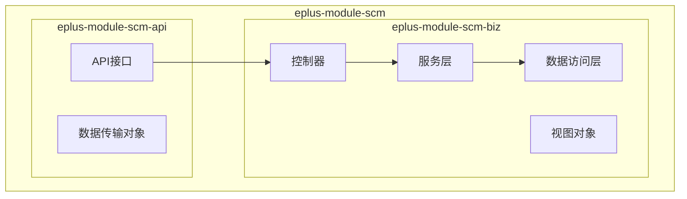
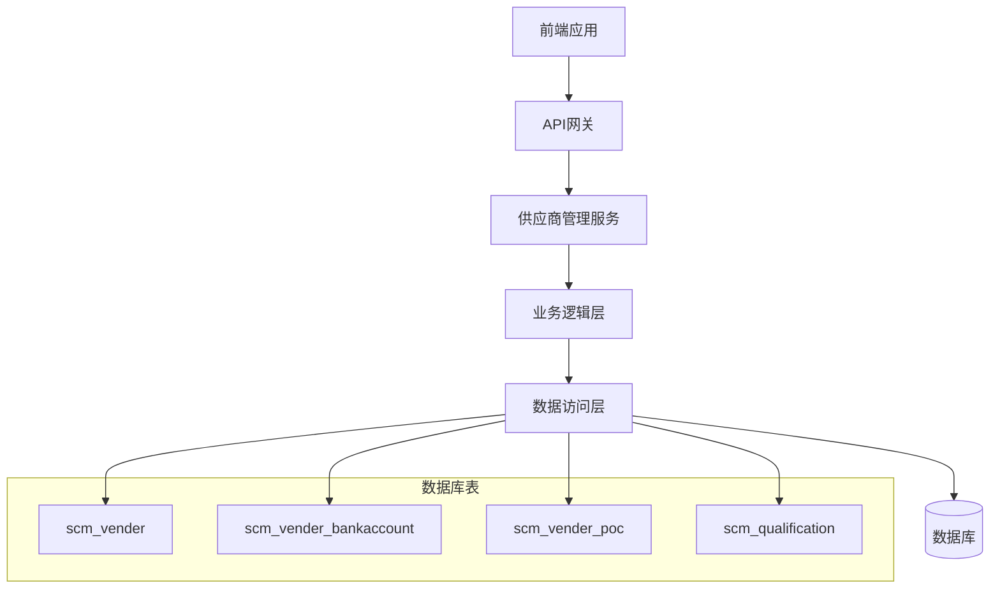
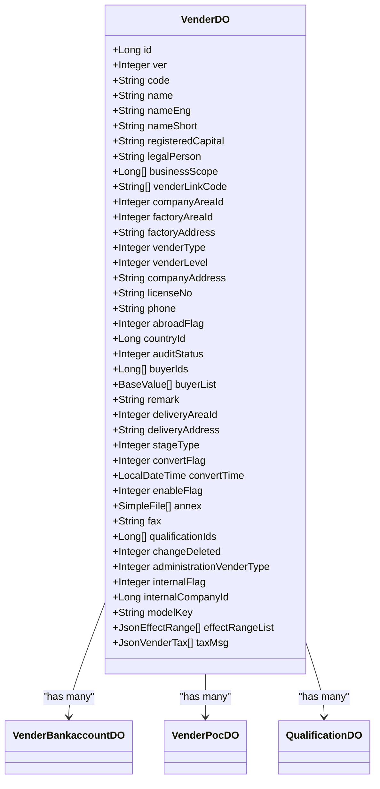
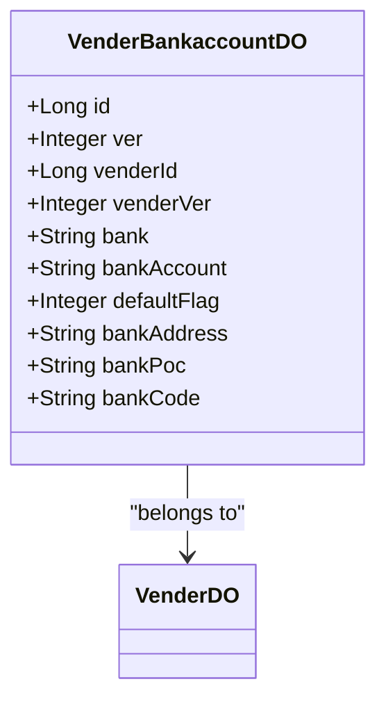
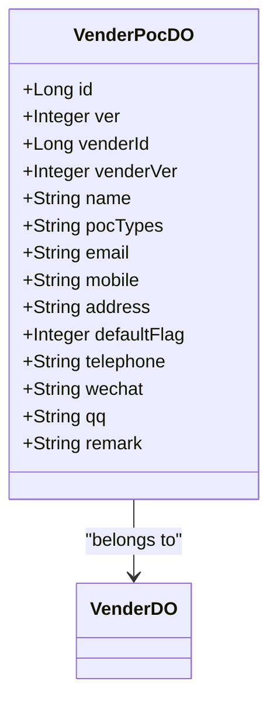
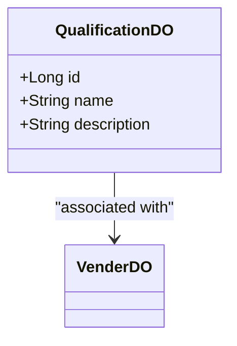
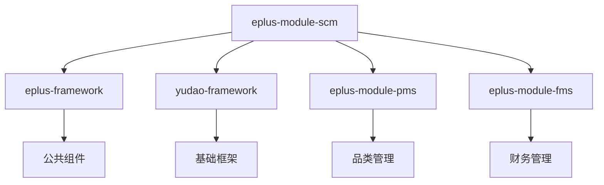

# 供应商管理模型

<cite>
**本文档引用的文件**  
- [VenderDO.java](file://eplus-module-scm/eplus-module-scm-biz/src/main/java/com/syj/eplus/module/scm/dal/dataobject/vender/VenderDO.java)
- [VenderBankaccountDO.java](file://eplus-module-scm/eplus-module-scm-biz/src/main/java/com/syj/eplus/module/scm/dal/dataobject/venderbankaccount/VenderBankaccountDO.java)
- [VenderPocDO.java](file://eplus-module-scm/eplus-module-scm-biz/src/main/java/com/syj/eplus/module/scm/dal/dataobject/venderpoc/VenderPocDO.java)
- [QualificationDO.java](file://eplus-module-scm/eplus-module-scm-biz/src/main/java/com/syj/eplus/module/scm/dal/dataobject/qualification/QualificationDO.java)
- [VenderRespVO.java](file://eplus-module-scm/eplus-module-scm-biz/src/main/java/com/syj/eplus/module/scm/controller/admin/vender/vo/VenderRespVO.java)
- [VenderSaveReqVO.java](file://eplus-module-scm/eplus-module-scm-biz/src/main/java/com/syj/eplus/module/scm/controller/admin/vender/vo/VenderSaveReqVO.java)
- [VenderTypeEnum.java](file://eplus-framework/eplus-common/src/main/java/com/syj/eplus/framework/common/enums/VenderTypeEnum.java)
</cite>

## 目录
1. [引言](#引言)
2. [项目结构](#项目结构)
3. [核心组件](#核心组件)
4. [架构概述](#架构概述)
5. [详细组件分析](#详细组件分析)
6. [依赖分析](#依赖分析)
7. [性能考虑](#性能考虑)
8. [故障排除指南](#故障排除指南)
9. [结论](#结论)

## 引言
本文档详细描述了供应商管理系统的数据模型设计，重点涵盖供应商基本信息、资质信息、财务信息、联系人信息等实体的设计。文档解释了供应商分类、供应商评级、供应商准入等管理流程的数据结构，并详细说明了供应商与采购合同、付款信息、绩效评估的关联关系。同时，文档提供了供应商状态管理（如正常、暂停、禁用）的设计方案，以及供应商资质有效期预警机制的数据实现。

## 项目结构
供应商管理模块位于 `eplus-module-scm` 模块中，主要包含以下子模块：
- `eplus-module-scm-api`：定义供应商管理相关的API接口和DTO
- `eplus-module-scm-biz`：实现供应商管理的业务逻辑，包含控制器、服务、数据访问层等

供应商管理相关的数据模型主要位于 `eplus-module-scm-biz/src/main/java/com/syj/eplus/module/scm/dal/dataobject` 目录下。

**图示来源**
- [VenderDO.java](file://eplus-module-scm/eplus-module-scm-biz/src/main/java/com/syj/eplus/module/scm/dal/dataobject/vender/VenderDO.java)
- [VenderBankaccountDO.java](file://eplus-module-scm/eplus-module-scm-biz/src/main/java/com/syj/eplus/module/scm/dal/dataobject/venderbankaccount/VenderBankaccountDO.java)
- [VenderPocDO.java](file://eplus-module-scm/eplus-module-scm-biz/src/main/java/com/syj/eplus/module/scm/dal/dataobject/venderpoc/VenderPocDO.java)

**章节来源**
- [VenderDO.java](file://eplus-module-scm/eplus-module-scm-biz/src/main/java/com/syj/eplus/module/scm/dal/dataobject/vender/VenderDO.java)
- [VenderBankaccountDO.java](file://eplus-module-scm/eplus-module-scm-biz/src/main/java/com/syj/eplus/module/scm/dal/dataobject/venderbankaccount/VenderBankaccountDO.java)
- [VenderPocDO.java](file://eplus-module-scm/eplus-module-scm-biz/src/main/java/com/syj/eplus/module/scm/dal/dataobject/venderpoc/VenderPocDO.java)

## 核心组件
供应商管理模型的核心组件包括供应商主数据（VenderDO）、供应商银行账户（VenderBankaccountDO）、供应商联系人（VenderPocDO）和供应商资质（QualificationDO）。这些组件共同构成了完整的供应商信息管理体系。

**章节来源**
- [VenderDO.java](file://eplus-module-scm/eplus-module-scm-biz/src/main/java/com/syj/eplus/module/scm/dal/dataobject/vender/VenderDO.java)
- [VenderBankaccountDO.java](file://eplus-module-scm/eplus-module-scm-biz/src/main/java/com/syj/eplus/module/scm/dal/dataobject/venderbankaccount/VenderBankaccountDO.java)
- [VenderPocDO.java](file://eplus-module-scm/eplus-module-scm-biz/src/main/java/com/syj/eplus/module/scm/dal/dataobject/venderpoc/VenderPocDO.java)
- [QualificationDO.java](file://eplus-module-scm/eplus-module-scm-biz/src/main/java/com/syj/eplus/module/scm/dal/dataobject/qualification/QualificationDO.java)

## 架构概述
供应商管理系统的架构采用典型的分层设计，包括表现层、业务逻辑层和数据访问层。系统通过RESTful API提供服务，使用MyBatis作为ORM框架与数据库交互。

**图示来源**
- [VenderDO.java](file://eplus-module-scm/eplus-module-scm-biz/src/main/java/com/syj/eplus/module/scm/dal/dataobject/vender/VenderDO.java)
- [VenderBankaccountDO.java](file://eplus-module-scm/eplus-module-scm-biz/src/main/java/com/syj/eplus/module/scm/dal/dataobject/venderbankaccount/VenderBankaccountDO.java)
- [VenderPocDO.java](file://eplus-module-scm/eplus-module-scm-biz/src/main/java/com/syj/eplus/module/scm/dal/dataobject/venderpoc/VenderPocDO.java)
- [QualificationDO.java](file://eplus-module-scm/eplus-module-scm-biz/src/main/java/com/syj/eplus/module/scm/dal/dataobject/qualification/QualificationDO.java)

## 详细组件分析

### 供应商主数据分析
供应商主数据（VenderDO）是供应商管理的核心实体，包含了供应商的基本信息、财务信息、联系信息等。

**图示来源**
- [VenderDO.java](file://eplus-module-scm/eplus-module-scm-biz/src/main/java/com/syj/eplus/module/scm/dal/dataobject/vender/VenderDO.java)
- [VenderBankaccountDO.java](file://eplus-module-scm/eplus-module-scm-biz/src/main/java/com/syj/eplus/module/scm/dal/dataobject/venderbankaccount/VenderBankaccountDO.java)
- [VenderPocDO.java](file://eplus-module-scm/eplus-module-scm-biz/src/main/java/com/syj/eplus/module/scm/dal/dataobject/venderpoc/VenderPocDO.java)
- [QualificationDO.java](file://eplus-module-scm/eplus-module-scm-biz/src/main/java/com/syj/eplus/module/scm/dal/dataobject/qualification/QualificationDO.java)

**章节来源**
- [VenderDO.java](file://eplus-module-scm/eplus-module-scm-biz/src/main/java/com/syj/eplus/module/scm/dal/dataobject/vender/VenderDO.java)

### 供应商银行账户分析
供应商银行账户（VenderBankaccountDO）实体用于管理供应商的银行账户信息，支持多个银行账户的配置。

**图示来源**
- [VenderBankaccountDO.java](file://eplus-module-scm/eplus-module-scm-biz/src/main/java/com/syj/eplus/module/scm/dal/dataobject/venderbankaccount/VenderBankaccountDO.java)
- [VenderDO.java](file://eplus-module-scm/eplus-module-scm-biz/src/main/java/com/syj/eplus/module/scm/dal/dataobject/vender/VenderDO.java)

**章节来源**
- [VenderBankaccountDO.java](file://eplus-module-scm/eplus-module-scm-biz/src/main/java/com/syj/eplus/module/scm/dal/dataobject/venderbankaccount/VenderBankaccountDO.java)

### 供应商联系人分析
供应商联系人（VenderPocDO）实体用于管理供应商的联系人信息，支持多个联系人的配置。

**图示来源**
- [VenderPocDO.java](file://eplus-module-scm/eplus-module-scm-biz/src/main/java/com/syj/eplus/module/scm/dal/dataobject/venderpoc/VenderPocDO.java)
- [VenderDO.java](file://eplus-module-scm/eplus-module-scm-biz/src/main/java/com/syj/eplus/module/scm/dal/dataobject/vender/VenderDO.java)

**章节来源**
- [VenderPocDO.java](file://eplus-module-scm/eplus-module-scm-biz/src/main/java/com/syj/eplus/module/scm/dal/dataobject/venderpoc/VenderPocDO.java)

### 供应商资质分析
供应商资质（QualificationDO）实体用于管理供应商的资质信息，支持资质的创建、更新和删除。

**图示来源**
- [QualificationDO.java](file://eplus-module-scm/eplus-module-scm-biz/src/main/java/com/syj/eplus/module/scm/dal/dataobject/qualification/QualificationDO.java)
- [VenderDO.java](file://eplus-module-scm/eplus-module-scm-biz/src/main/java/com/syj/eplus/module/scm/dal/dataobject/vender/VenderDO.java)

**章节来源**
- [QualificationDO.java](file://eplus-module-scm/eplus-module-scm-biz/src/main/java/com/syj/eplus/module/scm/dal/dataobject/qualification/QualificationDO.java)

## 依赖分析
供应商管理模块与其他模块存在以下依赖关系：
- 依赖 `eplus-framework` 模块提供的公共组件和工具类
- 依赖 `yudao-framework` 模块提供的基础框架功能
- 与 `eplus-module-pms` 模块交互获取品类信息
- 与 `eplus-module-fms` 模块交互处理财务相关数据

**图示来源**
- [VenderDO.java](file://eplus-module-scm/eplus-module-scm-biz/src/main/java/com/syj/eplus/module/scm/dal/dataobject/vender/VenderDO.java)
- [VenderTypeEnum.java](file://eplus-framework/eplus-common/src/main/java/com/syj/eplus/framework/common/enums/VenderTypeEnum.java)

**章节来源**
- [VenderDO.java](file://eplus-module-scm/eplus-module-scm-biz/src/main/java/com/syj/eplus/module/scm/dal/dataobject/vender/VenderDO.java)
- [VenderTypeEnum.java](file://eplus-framework/eplus-common/src/main/java/com/syj/eplus/framework/common/enums/VenderTypeEnum.java)

## 性能考虑
供应商管理系统的性能优化主要体现在以下几个方面：
- 使用MyBatis的缓存机制减少数据库查询次数
- 对频繁查询的字段建立索引
- 采用分页查询避免一次性加载大量数据
- 使用批量操作提高数据处理效率

## 故障排除指南
在使用供应商管理系统时，可能会遇到以下常见问题：
- 供应商信息无法保存：检查必填字段是否完整，验证数据格式是否正确
- 银行账户信息显示异常：确认银行账户与供应商的关联关系是否正确
- 联系人信息丢失：检查联系人是否被误删除或状态是否正确
- 资质信息无法更新：确认用户权限是否足够，检查资质状态是否允许更新

**章节来源**
- [VenderDO.java](file://eplus-module-scm/eplus-module-scm-biz/src/main/java/com/syj/eplus/module/scm/dal/dataobject/vender/VenderDO.java)
- [VenderRespVO.java](file://eplus-module-scm/eplus-module-scm-biz/src/main/java/com/syj/eplus/module/scm/controller/admin/vender/vo/VenderRespVO.java)
- [VenderSaveReqVO.java](file://eplus-module-scm/eplus-module-scm-biz/src/main/java/com/syj/eplus/module/scm/controller/admin/vender/vo/VenderSaveReqVO.java)

## 结论
本文档详细描述了供应商管理系统的数据模型设计，涵盖了供应商基本信息、资质信息、财务信息、联系人信息等实体的设计。通过合理的数据结构设计和关联关系管理，系统能够有效支持供应商分类、供应商评级、供应商准入等管理流程。同时，系统提供了完善的供应商状态管理和资质有效期预警机制，确保供应商信息的准确性和时效性。