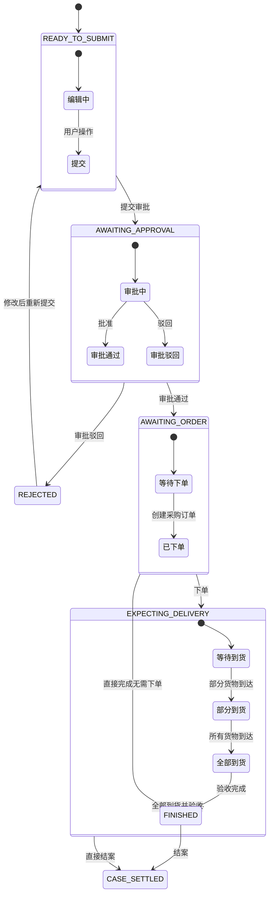
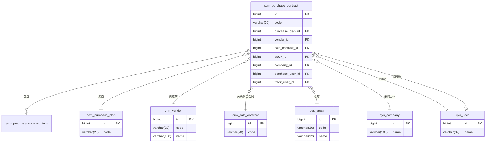

# 采购合同模型

<cite>
**本文档引用的文件**   
- [V1_0_0_002__Eplus初始化.sql](file://eplus-flyway/src/main/resources/db/migration/common/V1_0_0_002__Eplus初始化.sql)
- [PurchaseContractStatusEnum.java](file://eplus-framework/eplus-common/src/main/java/com/syj/eplus/framework/common/enums/PurchaseContractStatusEnum.java)
- [PurchaseContractItemDO.java](file://eplus-module-scm/eplus-module-scm-biz/src/main/java/com/syj/eplus/module/scm/dal/dataobject/purchasecontractitem/PurchaseContractItemDO.java)
- [PurchaseContractApi.java](file://eplus-module-scm/eplus-module-scm-api/src/main/java/com/syj/eplus/module/scm/api/purchasecontract/PurchaseContractApi.java)
- [PurchaseContractApiImpl.java](file://eplus-module-scm/eplus-module-scm-biz/src/main/java/com/syj/eplus/module/scm/api/PurchaseContractApiImpl.java)
- [PurchaseContractController.java](file://eplus-module-scm/eplus-module-scm-biz/src/main/java/com/syj/eplus/module/scm/controller/admin/purchasecontract/PurchaseContractController.java)
- [PurchaseContractItemMapper.java](file://eplus-module-scm/eplus-module-scm-biz/src/main/java/com/syj/eplus/module/scm/dal/mysql/purchasecontractitem/PurchaseContractItemMapper.java)
</cite>

## 目录
1. [引言](#引言)
2. [采购合同主表设计](#采购合同主表设计)
3. [采购合同明细表设计](#采购合同明细表设计)
4. [采购合同生命周期](#采购合同生命周期)
5. [关键商务条款数据结构](#关键商务条款数据结构)
6. [合同状态机设计](#合同状态机设计)
7. [关联关系](#关联关系)
8. [SQL建表语句](#sql建表语句)
9. [MyBatis关联查询配置示例](#mybatis关联查询配置示例)

## 引言

本文档详细描述了采购合同的数据模型设计，包括采购合同主表和明细表的结构设计。文档解释了采购合同的完整生命周期，从创建、审批、签订到执行、结算的全过程。详细说明了合同金额、付款条款、交货日期、质量要求等关键商务条款的数据结构。提供了采购合同状态机设计说明，包括草稿、已审批、已签订、执行中、已完成、已关闭等状态的转换规则。文档还包含了合同与采购计划、供应商、付款计划的关联关系，以及实际的SQL建表语句和MyBatis关联查询配置示例。

**Section sources**
- [V1_0_0_002__Eplus初始化.sql](file://eplus-flyway/src/main/resources/db/migration/common/V1_0_0_002__Eplus初始化.sql#L1811-L1880)

## 采购合同主表设计

采购合同主表（scm_purchase_contract）存储了采购合同的基本信息和状态信息。该表包含了合同编号、审核状态、合同状态、采购主体、采购时间、金额信息、付款信息、交货日期等关键字段。

主表的主要字段包括：
- `id`: 主键，自增
- `code`: 采购合同编号
- `audit_status`: 审核状态
- `contract_status`: 采购合同状态
- `company_id`: 采购主体
- `purchase_time`: 采购时间
- `total_amount`: 采购总金额（JSON格式）
- `total_quantity`: 采购总数量
- `delivery_date`: 交货日期
- `sign_back_flag`: 回签标记
- `prepay_status`: 预付款状态
- `prepay_amount`: 预付款金额（JSON格式）
- `pay_status`: 付款状态
- `payed_amount`: 已付款金额（JSON格式）
- `invoice_status`: 开票状态
- `invoiced_amount`: 已开票金额（JSON格式）
- `track_user_id`: 跟单员id
- `purchase_user_id`: 采购员编码
- `vender_id`: 供应商主键
- `purchase_plan_id`: 采购计划id
- `sale_contract_id`: 销售合同id

**Section sources**
- [V1_0_0_002__Eplus初始化.sql](file://eplus-flyway/src/main/resources/db/migration/common/V1_0_0_002__Eplus初始化.sql#L1811-L1880)

## 采购合同明细表设计

采购合同明细表（scm_purchase_contract_item）存储了采购合同中每个产品的详细信息。该表与主表通过`purchase_contract_id`字段关联，记录了每个产品的采购数量、价格、规格、供应商信息等。

明细表的主要字段包括：
- `id`: 主键，自增
- `purchase_contract_id`: 采购合同单号
- `purchase_contract_code`: 采购合同编号
- `sku_id`: 产品id
- `sku_code`: 产品编号
- `quantity`: 采购数量
- `unit_price`: 采购单价（JSON格式）
- `total_price`: 总价（JSON格式）
- `with_tax_price`: 含税总价（JSON格式）
- `plan_arrive_date`: 预计到料日期
- `check_status`: 验货状态
- `receive_status`: 收货状态
- `vender_id`: 供应商id
- `purchase_user_id`: 采购员id
- `package_length`, `package_width`, `package_height`: 包装规格
- `outerbox_length`, `outerbox_width`, `outerbox_height`: 外箱规格
- `tax_rate`: 税率
- `currency`: 币种

```mermaid
erDiagram
scm_purchase_contract ||--o{ scm_purchase_contract_item : "包含"
scm_purchase_contract {
bigint id PK
varchar(20) code
tinyint audit_status
tinyint contract_status
bigint company_id
datetime purchase_time
json total_amount
int total_quantity
datetime delivery_date
tinyint sign_back_flag
tinyint prepay_status
json prepay_amount
tinyint pay_status
json payed_amount
tinyint invoice_status
json invoiced_amount
bigint track_user_id
bigint purchase_user_id
bigint vender_id
bigint purchase_plan_id
bigint sale_contract_id
datetime create_time
datetime update_time
}
scm_purchase_contract_item {
bigint id PK
bigint purchase_contract_id FK
varchar(20) purchase_contract_code
bigint sku_id
varchar(20) sku_code
int quantity
json unit_price
json total_price
json with_tax_price
datetime plan_arrive_date
tinyint check_status
tinyint receive_status
bigint vender_id
bigint purchase_user_id
decimal(19,6) package_length
decimal(19,6) package_width
decimal(19,6) package_height
decimal(19,6) outerbox_length
decimal(19,6) outerbox_width
decimal(19,6) outerbox_height
decimal(19,6) tax_rate
varchar(10) currency
datetime create_time
datetime update_time
}
```

**Diagram sources**
- [V1_0_0_002__Eplus初始化.sql](file://eplus-flyway/src/main/resources/db/migration/common/V1_0_0_002__Eplus初始化.sql#L1811-L1969)

**Section sources**
- [V1_0_0_002__Eplus初始化.sql](file://eplus-flyway/src/main/resources/db/migration/common/V1_0_0_002__Eplus初始化.sql#L1882-L1969)
- [PurchaseContractItemDO.java](file://eplus-module-scm/eplus-module-scm-biz/src/main/java/com/syj/eplus/module/scm/dal/dataobject/purchasecontractitem/PurchaseContractItemDO.java)

## 采购合同生命周期

采购合同的生命周期包括从创建到结案的完整过程，主要分为以下几个阶段：

1. **创建阶段**：用户创建采购合同，填写基本信息，此时合同处于"待提交"状态。
2. **审批阶段**：提交后的合同进入审批流程，等待相关负责人审批，此时合同处于"待审批"状态。
3. **签订阶段**：审批通过后，合同正式签订，供应商确认合同内容，此时合同处于"待下单"状态。
4. **执行阶段**：根据合同进行采购下单，跟踪货物交付情况，此时合同处于"待到货"状态。
5. **结算阶段**：货物到达并验收后，进行付款和开票操作，完成财务结算。
6. **完成阶段**：所有采购、交付、结算流程完成后，合同状态变为"已完成"。
7. **结案阶段**：合同所有相关事务处理完毕，进行归档，合同状态变为"已结案"。

在整个生命周期中，系统会记录每个阶段的时间节点，如创建时间、审批时间、签订时间、交货时间、付款时间等，以便进行合同执行情况的跟踪和分析。

**Section sources**
- [PurchaseContractStatusEnum.java](file://eplus-framework/eplus-common/src/main/java/com/syj/eplus/framework/common/enums/PurchaseContractStatusEnum.java)

## 关键商务条款数据结构

采购合同中的关键商务条款在数据模型中有专门的字段来存储和管理。

### 合同金额结构

合同金额相关字段使用JSON格式存储，以支持多币种处理：
- `total_amount`: 采购总金额，JSON格式，包含币种和金额值
- `prepay_amount`: 预付款金额，JSON格式
- `payed_amount`: 已付款金额，JSON格式
- `invoiced_amount`: 已开票金额，JSON格式

### 付款条款结构

付款条款相关字段：
- `payment_id`: 付款方式id
- `payment_name`: 付款方式名称
- `prepay_status`: 预付款状态
- `pay_status`: 付款状态
- `invoice_status`: 开票状态

### 交货日期结构

交货相关日期字段：
- `delivery_date`: 交货日期
- `plan_arrive_date`: 预计到料日期（明细表）
- `order_time`: 下单时间
- `sign_back_time`: 回签时间

### 质量要求结构

质量要求主要通过以下字段体现：
- `check_status`: 验货状态
- `checked_quantity`: 已验货数量
- `receive_status`: 收货状态
- `received_quantity`: 已收货数量
- `exchange_quantity`: 换货量
- `return_quantity`: 退货量
- `check_cost`: 验货费用

这些字段共同构成了对采购产品质量的完整跟踪体系。

**Section sources**
- [V1_0_0_002__Eplus初始化.sql](file://eplus-flyway/src/main/resources/db/migration/common/V1_0_0_002__Eplus初始化.sql#L1811-L1969)

## 合同状态机设计

采购合同状态机设计了合同在不同业务阶段的状态转换规则。状态机基于`contract_status`字段实现，其值对应`PurchaseContractStatusEnum`枚举。

### 状态定义

根据`PurchaseContractStatusEnum`枚举，合同状态包括：
- `READY_TO_SUBMIT(1, "待提交")`: 合同创建后但未提交审批的状态
- `AWAITING_APPROVAL(2, "待审批")`: 合同已提交，等待审批的状态
- `REJECTED(3, "已驳回")`: 合同审批被驳回的状态
- `AWAITING_ORDER(4, "待下单")`: 合同审批通过，等待下单的状态
- `EXPECTING_DELIVERY(5, "待到货")`: 已下单，等待货物到达的状态
- `FINISHED(6, "已完成")`: 所有货物已到货并完成验收的状态
- `CASE_SETTLED(7, "已结案")`: 合同所有事务处理完毕，已结案的状态

### 状态转换规则



**Diagram sources**
- [PurchaseContractStatusEnum.java](file://eplus-framework/eplus-common/src/main/java/com/syj/eplus/framework/common/enums/PurchaseContractStatusEnum.java)

**Section sources**
- [PurchaseContractStatusEnum.java](file://eplus-framework/eplus-common/src/main/java/com/syj/eplus/framework/common/enums/PurchaseContractStatusEnum.java)

## 关联关系

采购合同与系统中其他实体存在多种关联关系，这些关系在数据模型中通过外键或关联字段实现。

### 与采购计划的关联

采购合同通常由采购计划生成，两者通过以下字段关联：
- `purchase_plan_id`: 采购计划id
- `purchase_plan_code`: 采购计划编号

这种关联关系支持从采购计划到采购合同的下推创建，也支持反向追溯。

### 与供应商的关联

采购合同与供应商的关联通过以下字段实现：
- `vender_id`: 供应商主键
- `vender_code`: 供应商编码
- `vender_name`: 供应商名称

这些字段确保了合同与特定供应商的绑定关系。

### 与付款计划的关联

采购合同与付款计划的关联体现在付款信息中：
- `prepay_amount`: 预付款金额
- `payed_amount`: 已付款金额
- `invoiced_amount`: 已开票金额
- `payment_id`: 付款方式id

这些字段记录了合同的付款进度和状态。

### 与其他实体的关联

采购合同还与其他实体有关联：
- 与销售合同关联：`sale_contract_id`, `sale_contract_code`
- 与仓库关联：`stock_id`, `stock_code`, `stock_name`
- 与客户关联：`cust_id`, `cust_code`
- 与采购主体关联：`company_id`



**Diagram sources**
- [V1_0_0_002__Eplus初始化.sql](file://eplus-flyway/src/main/resources/db/migration/common/V1_0_0_002__Eplus初始化.sql#L1811-L1969)

**Section sources**
- [V1_0_0_002__Eplus初始化.sql](file://eplus-flyway/src/main/resources/db/migration/common/V1_0_0_002__Eplus初始化.sql#L1811-L1880)

## SQL建表语句

以下是采购合同主表和明细表的SQL建表语句。

### 采购合同主表

```sql
CREATE TABLE `scm_purchase_contract`  (
  `id` bigint NOT NULL AUTO_INCREMENT COMMENT '主键',
  `ver` int NULL DEFAULT NULL COMMENT '版本',
  `code` varchar(20)  NULL DEFAULT NULL COMMENT '采购合同编号',
  `audit_status` tinyint NOT NULL DEFAULT 0 COMMENT '审核状态',
  `contract_status` tinyint NOT NULL DEFAULT 0 COMMENT '采购合同状态',
  `company_id` bigint NULL DEFAULT NULL COMMENT '采购主体',
  `purchase_time` datetime NULL DEFAULT NULL COMMENT '采购时间',
  `auxiliary_flag` int NOT NULL DEFAULT 0 COMMENT '是否辅料采购',
  `total_amount` json NULL COMMENT '采购总金额',
  `total_quantity` int NOT NULL DEFAULT 0 COMMENT '采购总数量',
  `print_flag` tinyint NOT NULL DEFAULT 0 COMMENT '打印状态',
  `print_times` int NOT NULL DEFAULT 0 COMMENT '打印次数',
  `remark` varchar(500)  NULL DEFAULT NULL COMMENT '备注',
  `annex` json NOT NULL DEFAULT (JSON_OBJECT()) COMMENT '附件',
  `payment_id` bigint NULL DEFAULT NULL COMMENT '付款方式id',
  `payment_name` varchar(100) NULL DEFAULT NULL COMMENT '付款方式名称',
  `port_id` bigint NULL DEFAULT NULL COMMENT '目的口岸',
  `freight` json NULL COMMENT '运费',
  `equally_type` tinyint NULL COMMENT '分摊方式',
  `other_cost` json NULL COMMENT '其他费用',
  `delivery_date` datetime NULL DEFAULT NULL COMMENT '交货日期',
  `sign_back_flag` tinyint NOT NULL DEFAULT 0 COMMENT '回签标记',
  `tax_type` tinyint NULL COMMENT '发票类型',
  `prepay_status` tinyint NOT NULL DEFAULT 0 COMMENT '预付款状态',
  `prepay_amount` json NULL COMMENT '预付款金额',
  `pay_status` tinyint NOT NULL DEFAULT 0 COMMENT '付款状态',
  `payed_amount` json NULL COMMENT '已付款金额',
  `invoice_status` tinyint NOT NULL DEFAULT 0 COMMENT '开票状态',
  `invoiced_amount` json NULL COMMENT '已开票金额',
  `track_user_id` bigint NULL DEFAULT NULL COMMENT '跟单员id',
  `track_user_name` varchar(32)  NULL DEFAULT NULL COMMENT '跟单员名称',
  `purchase_user_id` bigint NULL DEFAULT NULL COMMENT '采购员编码',
  `purchase_user_name` varchar(32)  NULL DEFAULT NULL COMMENT '采购员名称',
  `purchase_user_dept_id` bigint NULL DEFAULT NULL COMMENT '采购员部门编码',
  `purchase_user_dept_name` varchar(32) NULL DEFAULT NULL COMMENT '采购员部门名称',
  `cust_id` bigint NULL DEFAULT NULL COMMENT '客户主键',
  `cust_code` varchar(20)  NULL DEFAULT NULL COMMENT '客户编码',
  `vender_id` bigint NULL DEFAULT NULL COMMENT '供应商主键',
  `vender_code` varchar(20)   NULL DEFAULT NULL COMMENT '供应商编码',
  `stock_id` bigint NULL DEFAULT NULL COMMENT '仓库主键',
  `stock_code` varchar(20)  NULL DEFAULT NULL COMMENT '仓库编码',
  `stock_name` varchar(32) NULL DEFAULT NULL COMMENT '仓库名称',
  `purchase_plan_id` bigint NULL DEFAULT NULL COMMENT '采购计划id',
  `purchase_plan_code` varchar(20)  NULL DEFAULT NULL COMMENT '采购计划编号',
  `sale_contract_id` bigint NULL DEFAULT NULL COMMENT '销售合同id',
  `sale_contract_code` varchar(20) NULL DEFAULT NULL COMMENT '销售合同编号',
  `re_purchase_flag` tinyint(1) NULL DEFAULT 0 COMMENT '重构标记',
  `re_purchase_desc` varchar(100) NULL DEFAULT NULL COMMENT '重构原因',
  `re_purchase_time` datetime NULL DEFAULT NULL COMMENT '重构时间',
  `re_purchase_old_flag` tinyint(1) NULL DEFAULT 0 COMMENT '重构旧版本标记',
  `deal_time` datetime NULL DEFAULT NULL COMMENT '处理时间',
  `finish_time` datetime NULL DEFAULT NULL COMMENT '结案时间',
  `done_time` datetime NULL DEFAULT NULL COMMENT '完成时间',
  `sign_back_time` datetime NULL DEFAULT NULL COMMENT '回签时间',
  `order_time` datetime NULL DEFAULT NULL COMMENT '下单时间',
  `creator` int UNSIGNED NULL DEFAULT NULL COMMENT '创建人',
  `create_time` datetime NULL DEFAULT CURRENT_TIMESTAMP COMMENT '创建时间',
  `updater` int UNSIGNED NULL DEFAULT NULL COMMENT '修改人',
  `update_time` datetime NULL DEFAULT NULL ON UPDATE CURRENT_TIMESTAMP COMMENT '修改时间',
  `deleted` tinyint(1) NOT NULL DEFAULT 0 COMMENT '删除',
  PRIMARY KEY (`id`) USING BTREE
) ENGINE = InnoDB AUTO_INCREMENT = 10 CHARACTER SET = utf8mb4 COLLATE = utf8mb4_general_ci COMMENT = '采购合同表' ROW_FORMAT = Dynamic;
```

### 采购合同明细表

```sql
CREATE TABLE `scm_purchase_contract_item`  (
  `id` bigint NOT NULL AUTO_INCREMENT COMMENT '主键',
  `sort_num` int NOT NULL DEFAULT 0 COMMENT '序号',
  `ver` int NULL DEFAULT NULL COMMENT '版本',
  `sync_quote_flag` tinyint NULL DEFAULT NULL COMMENT '是否同步供应商',
  `free_flag` tinyint NULL DEFAULT NULL COMMENT '是否赠品',
  `plan_arrive_date` datetime NULL DEFAULT NULL COMMENT '预计到料日期',
  `warehousing_type` tinyint not NULL DEFAULT 0 COMMENT '入库状态',
  `purchase_url` varchar(100) NOT NULL DEFAULT '' COMMENT '采购链接',
  `remark` varchar(500) NULL DEFAULT NULL COMMENT '备注',
  `check_cost` json NULL DEFAULT NULL COMMENT '验货费用',
  `sku_unit` int  NULL DEFAULT NULL COMMENT '计量单位',
  `auxiliary_sku_flag` int  NULL DEFAULT NULL COMMENT '是否通用辅料',
  `auxiliary_sku_type` int NULL DEFAULT NULL COMMENT '辅料采购类型',
  `auxiliary_purchase_contract_code` varchar(20)  NULL DEFAULT NULL COMMENT '辅料属于的采购合同编号',
  `auxiliary_sale_contract_code` varchar(20)  NULL DEFAULT NULL COMMENT '辅料属于的采购销售编号',
  `auxiliary_sku_id` bigint  NULL DEFAULT NULL COMMENT '辅料属于的采购合同产品id',
  `auxiliary_sku_code` varchar(20)  NULL DEFAULT NULL COMMENT '辅料属于的采购合同产品编号',
  `auxiliary_csku_code` varchar(20)  NULL DEFAULT NULL COMMENT '辅料属于的采购合同产品客户货号',
  `spec_remark` varchar(500)  NULL DEFAULT NULL COMMENT '规格描述',
  `annex` json NULL DEFAULT NULL COMMENT '附件',
  `sku_id` bigint NULL DEFAULT NULL COMMENT '产品id',
  `sku_code` varchar(20) NULL DEFAULT NULL COMMENT '产品编号',
  `cust_id` bigint NULL DEFAULT NULL COMMENT '客户id',
  `cust_code` varchar(20)  NULL DEFAULT NULL COMMENT '客户编号',
  `csku_code` varchar(20)  NULL DEFAULT NULL COMMENT '客户货号',
  `own_brand_flag` tinyint NOT NULL DEFAULT 0 COMMENT '是否自主品牌',
  `cust_pro_flag` tinyint UNSIGNED NOT NULL DEFAULT 0 COMMENT '客户产品标识',
  `purchase_contract_id` bigint NULL DEFAULT 0 COMMENT '采购合同单号',
  `purchase_contract_code` varchar(20)  NULL DEFAULT NULL COMMENT '采购合同编号',
  `purchase_type` tinyint NOT NULL COMMENT '采购类型',
  `vender_id` bigint NULL DEFAULT NULL COMMENT '供应商id',
  `vender_code` varchar(20) NULL DEFAULT NULL COMMENT '供应商编号',
  `wms_ids` varchar(100)  NULL DEFAULT NULL COMMENT '仓库id列表',
  `wms_names` varchar(100)  NULL DEFAULT NULL COMMENT '仓库名称列表',
  `purchase_user_id` bigint NULL DEFAULT NULL COMMENT '采购员id',
  `purchase_user_name` varchar(100)  NULL DEFAULT NULL COMMENT '采购员姓名',
  `purchase_user_dept_id` bigint NULL DEFAULT NULL COMMENT '采购员部门id',
  `purchase_user_dept_name` varchar(100) NULL DEFAULT NULL COMMENT '采购员部门名称',
  `packaging_price` json NULL COMMENT '包装价',
  `unit_price` json NULL COMMENT '采购单价',
  `total_price` json NULL COMMENT '总价',
  `with_tax_price` json NULL COMMENT '含税总价',
  `quantity` int not NULL DEFAULT 0 COMMENT '采购数量',
  `check_status` tinyint NOT NULL DEFAULT 1 COMMENT '验货状态',
  `checked_quantity` int NOT NULL DEFAULT 0 COMMENT '已验货数量',
  `receive_status` tinyint NOT NULL COMMENT '收货状态',
  `received_quantity` int NOT NULL DEFAULT 0  COMMENT '已收货数量',
  `exchange_quantity` int NOT NULL DEFAULT 0  COMMENT '换货量',
  `return_quantity` int NOT NULL DEFAULT 0  COMMENT '退货量',
  `qty_per_innerbox` int NULL DEFAULT 0 COMMENT '内箱装量',
  `qty_per_outerbox` int NULL DEFAULT 0 COMMENT '外箱装量',
  `package_length` decimal(19, 6) NULL DEFAULT 0 COMMENT '包装规格长度',
  `package_width` decimal(19, 6) NULL DEFAULT 0 COMMENT '包装规格宽度',
  `package_height` decimal(19, 6) NULL DEFAULT 0 COMMENT '包装规格高度',
  `package_unit` tinyint NULL DEFAULT NULL COMMENT '包装规格单位',
  `outerbox_length` decimal(19, 6) NULL DEFAULT 0 COMMENT '外箱规格长度',
  `outerbox_width` decimal(19, 6) NULL DEFAULT 0 COMMENT '外箱规格宽度',
  `outerbox_height` decimal(19, 6) NULL DEFAULT 0 COMMENT '外箱规格高度',
  `outerbox_unit` tinyint NULL DEFAULT NULL COMMENT '外箱规格单位',
  `outerbox_volume` decimal(19, 6) NULL DEFAULT 0 COMMENT '外箱体积',
  `outerbox_netweight` json  NULL DEFAULT (JSON_OBJECT()) COMMENT '外箱净重',
  `single_grossweight` json  NULL DEFAULT (JSON_OBJECT()) COMMENT '单品毛重',
  `outerbox_grossweight` json  NULL DEFAULT (JSON_OBJECT()) COMMENT '外箱毛重',
  `tax_rate` decimal(19, 6) NULL DEFAULT 0 COMMENT '税率',
  `vender_prod_code` varchar(20)  NULL DEFAULT NULL COMMENT '工厂货号',
  `quote_date` datetime NULL DEFAULT NULL COMMENT '报价日期',
  `freight_flag` tinyint NOT NULL DEFAULT 0 COMMENT '是否含运费',
  `package_flag` tinyint NOT NULL DEFAULT 0 COMMENT '是否含包装',
  `package_type` tinyint NULL DEFAULT NULL COMMENT '包装方式',
  `currency` varchar(10)  NULL DEFAULT NULL COMMENT '币种',
  `fax_flag` tinyint NOT NULL DEFAULT 0 COMMENT '是否含税',
  `moq` int not NULL DEFAULT 0 COMMENT '最小起购量',
  `box_count` int not NULL DEFAULT 0 COMMENT '箱数',
  `delivery` int NULL DEFAULT NULL COMMENT '到货天数',
  `creator` int NULL DEFAULT NULL COMMENT '创建人',
  `create_time` datetime NULL DEFAULT CURRENT_TIMESTAMP COMMENT '创建时间',
  `updater` int UNSIGNED NULL DEFAULT NULL COMMENT '修改人',
  `update_time` datetime NULL DEFAULT NULL ON UPDATE CURRENT_TIMESTAMP COMMENT '修改时间',
  `deleted` tinyint(1) NOT NULL DEFAULT 0 COMMENT '删除',
  PRIMARY KEY (`id`) USING BTREE
) ENGINE = InnoDB AUTO_INCREMENT = 4 CHARACTER SET = utf8mb4 COLLATE = utf8mb4_general_ci COMMENT = '采购合同明细表' ROW_FORMAT = Dynamic;
```

**Section sources**
- [V1_0_0_002__Eplus初始化.sql](file://eplus-flyway/src/main/resources/db/migration/common/V1_0_0_002__Eplus初始化.sql#L1811-L1969)

## MyBatis关联查询配置示例

以下是采购合同与明细表关联查询的MyBatis配置示例。

### Mapper接口定义

```java
@Mapper
public interface PurchaseContractMapper extends BaseMapperX<PurchaseContractDO> {
    
    /**
     * 分页查询采购合同及明细
     */
    PageResult<PurchaseContractDO> selectPageWithItems(PurchaseContractPageReqVO reqVO);
    
    /**
     * 根据合同ID查询合同及明细
     */
    PurchaseContractDO selectByIdWithItems(Long id);
}
```

### ResultMap配置

```xml
<resultMap id="PurchaseContractWithItemsResultMap" type="PurchaseContractDO" extends="BaseResultMap">
    <collection property="items" 
                ofType="PurchaseContractItemDO"
                column="id"
                select="selectItemsByContractId"
                javaType="ArrayList"/>
</resultMap>

<resultMap id="PurchaseContractItemResultMap" type="PurchaseContractItemDO">
    <id property="id" column="item_id"/>
    <result property="skuId" column="item_sku_id"/>
    <result property="skuCode" column="item_sku_code"/>
    <result property="quantity" column="item_quantity"/>
    <result property="unitPrice" column="item_unit_price"/>
    <result property="totalPrice" column="item_total_price"/>
    <result property="planArriveDate" column="item_plan_arrive_date"/>
    <result property="checkStatus" column="item_check_status"/>
    <result property="receiveStatus" column="item_receive_status"/>
</resultMap>
```

### 关联查询SQL

```xml
<select id="selectPageWithItems" resultMap="PurchaseContractWithItemsResultMap">
    SELECT 
        pc.id,
        pc.code,
        pc.contract_status,
        pc.total_amount,
        pc.total_quantity,
        pc.delivery_date,
        pc.vender_id,
        pc.vender_code,
        pc.purchase_user_id,
        pc.purchase_user_name,
        pc.create_time,
        pc.update_time
    FROM scm_purchase_contract pc
    WHERE pc.deleted = 0
    <if test="reqVO.code != null and reqVO.code != ''">
        AND pc.code LIKE CONCAT('%', #{reqVO.code}, '%')
    </if>
    <if test="reqVO.venderId != null">
        AND pc.vender_id = #{reqVO.venderId}
    </if>
    <if test="reqVO.status != null">
        AND pc.contract_status = #{reqVO.status}
    </if>
    ORDER BY pc.id DESC
</select>

<select id="selectItemsByContractId" resultMap="PurchaseContractItemResultMap">
    SELECT 
        id as item_id,
        sku_id as item_sku_id,
        sku_code as item_sku_code,
        quantity as item_quantity,
        unit_price as item_unit_price,
        total_price as item_total_price,
        plan_arrive_date as item_plan_arrive_date,
        check_status as item_check_status,
        receive_status as item_receive_status
    FROM scm_purchase_contract_item
    WHERE purchase_contract_id = #{id}
      AND deleted = 0
    ORDER BY sort_num
</select>
```

### Service层调用示例

```java
@Service
@RequiredArgsConstructor
public class PurchaseContractServiceImpl implements PurchaseContractService {
    
    private final PurchaseContractMapper purchaseContractMapper;
    
    @Override
    public PageResult<PurchaseContractDO> getPage(PurchaseContractPageReqVO reqVO) {
        return purchaseContractMapper.selectPageWithItems(reqVO);
    }
    
    @Override
    public PurchaseContractDO getContractWithItems(Long id) {
        return purchaseContractMapper.selectByIdWithItems(id);
    }
}
```

**Section sources**
- [PurchaseContractApi.java](file://eplus-module-scm/eplus-module-scm-api/src/main/java/com/syj/eplus/module/scm/api/purchasecontract/PurchaseContractApi.java)
- [PurchaseContractApiImpl.java](file://eplus-module-scm/eplus-module-scm-biz/src/main/java/com/syj/eplus/module/scm/api/PurchaseContractApiImpl.java)
- [PurchaseContractController.java](file://eplus-module-scm/eplus-module-scm-biz/src/main/java/com/syj/eplus/module/scm/controller/admin/purchasecontract/PurchaseContractController.java)
- [PurchaseContractItemMapper.java](file://eplus-module-scm/eplus-module-scm-biz/src/main/java/com/syj/eplus/module/scm/dal/mysql/purchasecontractitem/PurchaseContractItemMapper.java)