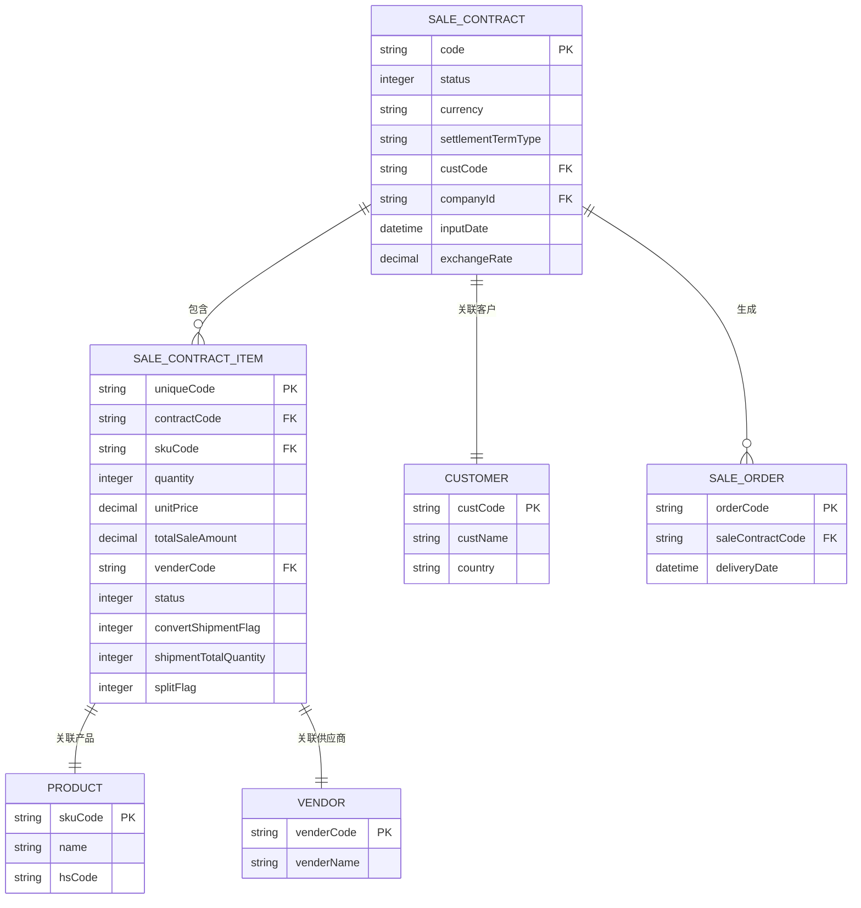

# 销售合同模型

<cite>
**本文档引用文件**  
- [SaleContractApi.java](file://eplus-module-sms/eplus-module-sms-api/src/main/java/com/syj/eplus/module/sms/api/SaleContractApi.java)
- [SaleContractDTO.java](file://eplus-module-sms/eplus-module-sms-api/src/main/java/com/syj/eplus/module/sms/api/dto/SaleContractDTO.java)
- [SaleContractItemDTO.java](file://eplus-module-sms/eplus-module-sms-api/src/main/java/com/syj/eplus/module/sms/api/dto/SaleContractItemDTO.java)
- [SaleContractApiImpl.java](file://eplus-module-sms/eplus-module-sms-biz/src/main/java/com/syj/eplus/module/sms/api/SaleContractApiImpl.java)
- [SaleContractDO.java](file://eplus-module-sms/eplus-module-sms-biz/src/main/java/com/syj/eplus/module/sms/dal/dataobject/salecontract/SaleContractDO.java)
- [SaleContractItem.java](file://eplus-module-sms/eplus-module-sms-biz/src/main/java/com/syj/eplus/module/sms/dal/dataobject/salecontractitem/SaleContractItem.java)
- [SaleContractItemMapper.java](file://eplus-module-sms/eplus-module-sms-biz/src/main/java/com/syj/eplus/module/sms/dal/mysql/salecontractitem/SaleContractItemMapper.java)
- [SaleContractStatusEnum.java](file://eplus-framework/eplus-common/src/main/java/com/syj/eplus/framework/common/enums/SaleContractStatusEnum.java)
- [SaleContractDict.java](file://eplus-framework/eplus-common/src/main/java/com/syj/eplus/framework/common/dict/SaleContractDict.java)
- [V1_0_0_320__销售明细增加转采购标识字段.java](file://eplus-flyway/src/main/java/db/migration/common/V1_0_0_320__销售明细增加转采购标识字段.java)
- [V1_0_0_254__销售合同明细增加转出运标识.java](file://eplus-flyway/src/main/java/db/migration/common/V1_0_0_254__销售合同明细增加转出运标识.java)
- [V1_0_0_308__销售明细增加已转出运明细总数.java](file://eplus-flyway/src/main/java/db/migration/common/V1_0_0_308__销售明细增加已转出运明细总数.java)
- [V1_0_0_417__销售明细增加拆分标识字段.java](file://eplus-flyway/src/main/java/db/migration/common/V1_0_0_417__销售明细增加拆分标识字段.java)
</cite>

## 目录
1. [引言](#引言)
2. [销售合同主表设计](#销售合同主表设计)
3. [销售合同明细表设计](#销售合同明细表设计)
4. [合同编号生成规则](#合同编号生成规则)
5. [合同状态机流转机制](#合同状态机流转机制)
6. [关键业务字段说明](#关键业务字段说明)
7. [实体关系图](#实体关系图)
8. [MyBatis Mapper配置与典型查询](#mybatis-mapper配置与典型查询)
9. [结论](#结论)

## 引言

销售合同模型是企业销售管理的核心模块，用于管理与客户签订的销售合同及其明细信息。该模型不仅记录了合同的基本信息，还涵盖了合同状态、金额计算、付款条款、交货期等关键业务数据。本文档旨在详细描述销售合同主表和明细表的设计，解释合同编号生成规则、合同状态机的流转机制，并说明关键字段的业务含义和计算逻辑。此外，文档还提供了销售合同与客户、产品、销售订单等实体的关系图，以及MyBatis Mapper配置示例和典型查询SQL，为开发者提供合同数据操作的指导。

**本文档引用文件**  
- [SaleContractApi.java](file://eplus-module-sms/eplus-module-sms-api/src/main/java/com/syj/eplus/module/sms/api/SaleContractApi.java)
- [SaleContractDTO.java](file://eplus-module-sms/eplus-module-sms-api/src/main/java/com/syj/eplus/module/sms/api/dto/SaleContractDTO.java)
- [SaleContractItemDTO.java](file://eplus-module-sms/eplus-module-sms-api/src/main/java/com/syj/eplus/module/sms/api/dto/SaleContractItemDTO.java)
- [SaleContractApiImpl.java](file://eplus-module-sms/eplus-module-sms-biz/src/main/java/com/syj/eplus/module/sms/api/SaleContractApiImpl.java)
- [SaleContractDO.java](file://eplus-module-sms/eplus-module-sms-biz/src/main/java/com/syj/eplus/module/sms/dal/dataobject/salecontract/SaleContractDO.java)
- [SaleContractItem.java](file://eplus-module-sms/eplus-module-sms-biz/src/main/java/com/syj/eplus/module/sms/dal/dataobject/salecontractitem/SaleContractItem.java)
- [SaleContractItemMapper.java](file://eplus-module-sms/eplus-module-sms-biz/src/main/java/com/syj/eplus/module/sms/dal/mysql/salecontractitem/SaleContractItemMapper.java)
- [SaleContractStatusEnum.java](file://eplus-framework/eplus-common/src/main/java/com/syj/eplus/framework/common/enums/SaleContractStatusEnum.java)
- [SaleContractDict.java](file://eplus-framework/eplus-common/src/main/java/com/syj/eplus/framework/common/dict/SaleContractDict.java)
- [V1_0_0_320__销售明细增加转采购标识字段.java](file://eplus-flyway/src/main/java/db/migration/common/V1_0_0_320__销售明细增加转采购标识字段.java)
- [V1_0_0_254__销售合同明细增加转出运标识.java](file://eplus-flyway/src/main/java/db/migration/common/V1_0_0_254__销售合同明细增加转出运标识.java)
- [V1_0_0_308__销售明细增加已转出运明细总数.java](file://eplus-flyway/src/main/java/db/migration/common/V1_0_0_308__销售明细增加已转出运明细总数.java)
- [V1_0_0_417__销售明细增加拆分标识字段.java](file://eplus-flyway/src/main/java/db/migration/common/V1_0_0_417__销售明细增加拆分标识字段.java)

## 销售合同主表设计

销售合同主表（`sms_sale_contract`）用于存储销售合同的基本信息和汇总数据。主表设计遵循规范化原则，确保数据的一致性和完整性。主表包含合同编号、客户信息、交易币别、价格条款、收款方式、客户国别、客户合同号、是否代理、应收客户、收货客户、销售人员、附件、录入日期、贸易国别、出运国、出运口岸、目的口岸、运输方式、客户交期、集装箱信息、费用信息、状态信息等字段。

主表中的关键字段包括：
- **合同编号（code）**：唯一标识销售合同的编号，生成规则见[合同编号生成规则](#合同编号生成规则)。
- **客户信息（custId, custCode, custName）**：关联客户实体，记录客户主键、编号和名称。
- **交易币别（currency）**：记录合同交易的币种。
- **价格条款（settlementTermType）**：记录合同的价格条款。
- **收款方式（settlementId, settlementName）**：关联收款方式实体，记录收款方式主键和名称。
- **客户国别（custCountryId, custCountryName）**：记录客户所在国别。
- **客户合同号（custPo）**：记录客户提供的合同号。
- **是否代理（agentFlag）**：标识合同是否为代理合同。
- **应收客户（collectedCustId, collectedCustCode, collectedCustName）**：记录应收客户的主键、编号和名称。
- **收货客户（receiveCustId, receiveCustCode, receiveCustName）**：记录收货客户的主键、编号和名称。
- **销售人员（sales）**：记录销售人员信息。
- **附件（annex）**：存储合同相关的附件信息。
- **录入日期（inputDate）**：记录合同录入系统的时间。
- **贸易国别（tradeCountryId, tradeCountryName）**：记录贸易国别信息。
- **出运国（departureCountryId, departureCountryName）**：记录出运国信息。
- **出运口岸（departurePortId, departurePortName）**：记录出运口岸信息。
- **目的口岸（destinationPortId, destinationPortName）**：记录目的口岸信息。
- **运输方式（transportType）**：记录运输方式。
- **客户交期（custDeliveryDate）**：记录客户要求的交货日期。
- **集装箱信息（twentyFootCabinetNum, fortyFootCabinetNum, fortyFootContainerNum, bulkHandlingVolume）**：记录20尺柜、40尺柜、40尺高柜和散货的数量或体积。
- **费用信息（trailerFee, estimatedTotalFreight, commission, platformFee, insuranceFee, lumpSumFee, sinosureFee, additionAmount, deductionAmount, inspectionFee, estimatedPackingMaterials, accessoriesPurchaseTotal）**：记录拖柜费、预估总运费、佣金、平台费、保险费、一次性费用、中信保费用、加项金额、减项金额、验货费用、预计包材合计、配件采购合计等费用。
- **状态信息（status, changeStatus, auditStatus, confirmFlag, printFlag, printTimes）**：记录合同的状态、变更状态、审核状态、确认状态、打印状态和打印次数。

主表还包含一些计算字段，如箱数合计、毛重合计、净重合计、体积合计、货值合计、采购合计、退税合计、数量合计、订单毛利、毛利率、应收汇款等，这些字段在合同创建或更新时自动计算并存储。

**本文档引用文件**  
- [SaleContractDO.java](file://eplus-module-sms/eplus-module-sms-biz/src/main/java/com/syj/eplus/module/sms/dal/dataobject/salecontract/SaleContractDO.java)
- [SaleContractDTO.java](file://eplus-module-sms/eplus-module-sms-api/src/main/java/com/syj/eplus/module/sms/api/dto/SaleContractDTO.java)

## 销售合同明细表设计

销售合同明细表（`sms_sale_contract_item`）用于存储销售合同中每个产品的详细信息。明细表与主表通过合同ID（`contractId`）关联，形成一对多的关系。明细表设计考虑了产品的多样性，支持多种产品类型和复杂的业务逻辑。

明细表中的关键字段包括：
- **序号（sortNum）**：记录明细项的序号，用于排序。
- **合同ID（contractId）**：关联主表的合同ID。
- **合同编号（contractCode）**：冗余存储合同编号，便于查询。
- **产品编号（skuCode）**：关联产品实体，记录产品编号。
- **中文品名（name）**：记录产品的中文名称。
- **英文品名（nameEng）**：记录产品的英文名称。
- **图片（mainPicture）**：存储产品的主图。
- **客户货号（cskuCode）**：记录客户提供的产品货号。
- **数量（quantity）**：记录产品的销售数量。
- **销售单价（unitPrice）**：记录产品的销售单价。
- **外销总金额（totalSaleAmount）**：记录产品的外销总金额，计算公式为数量乘以销售单价。
- **采购单价（purchaseUnitPrice）**：记录产品的采购单价。
- **真实采购单价（realPurchaseWithTaxPrice）**：记录产品的实际采购单价，含税。
- **包装价（purchasePackagingPrice）**：记录产品的包装费用。
- **运费（purchaseShippingPrice）**：记录产品的运费。
- **含税单价（purchaseWithTaxPrice）**：记录产品的含税采购单价。
- **采购币种（purchaseCurrency）**：记录采购的币种。
- **供应商信息（venderId, venderCode, venderName）**：关联供应商实体，记录供应商主键、编号和名称。
- **佣金信息（commissionType, commissionRate, commissionAmount）**：记录佣金类型、佣金比例和佣金金额。
- **库存信息（inventoryQuantity, currentLockQuantity, realLockQuantity）**：记录产品的库存数量、当前锁定数量和真实锁定数量。
- **真实采购数量（realPurchaseQuantity）**：记录产品的实际采购数量。
- **待采购数量（needPurQuantity）**：记录产品的待采购数量，计算公式为数量减去真实锁定数量。
- **单位（unit）**：记录产品的计量单位。
- **中文说明（description）**：记录产品的中文说明。
- **英文说明（descriptionEng）**：记录产品的英文说明。
- **订单毛利（orderGrossProfit）**：记录产品的订单毛利，计算公式为外销总金额减去采购合计。
- **毛利率（orderGrossProfitRate）**：记录产品的毛利率，计算公式为订单毛利除以外销总金额。
- **工厂交期（venderDeliveryDate）**：记录工厂的交货日期。
- **装量信息（qtyPerOuterbox, qtyPerInnerbox）**：记录外箱装量和内盒装量。
- **箱数（boxCount）**：记录产品的箱数，计算公式为数量除以外箱装量。
- **体积（volume）**：记录产品的体积。
- **是否翻单（reorderFlag）**：标识产品是否为翻单。
- **海关编码（hsCode）**：记录产品的海关编码。
- **包装方式（packageType）**：记录产品的包装方式。
- **退税率（taxRefundRate）**：记录产品的退税率。
- **退税金额（taxRefundPrice）**：记录产品的退税金额，计算公式为采购合计乘以退税率。
- **验货费用（inspectionFee）**：记录产品的验货费用。
- **资金占用费（fundOccupancyFee）**：记录产品的资金占用费。
- **拖柜费（trailerFee）**：记录产品的拖柜费。
- **是否订舱（bookingFlag）**：标识产品是否需要订舱。
- **保险费（insuranceFee）**：记录产品的保险费。
- **平台费（platformFee）**：记录产品的平台费。
- **预估总费用（forecastTotalCost）**：记录产品的预估总费用，计算公式为拖柜费加保险费加平台费。
- **内部核算单价（innerCalcPrice）**：记录产品的内部核算单价。
- **中信保费用（sinosureFee）**：记录产品的中信保费用。
- **状态（status）**：记录明细项的状态。
- **采购员（purchaseUser）**：记录负责采购的人员。
- **变更标志（changeFlag）**：标识明细项是否发生变更。
- **产品主键（skuId）**：关联产品实体，记录产品主键。
- **是否自营（ownBrandFlag）**：标识产品是否为自营产品。
- **客户产品标识（custProFlag）**：记录客户对产品的标识。
- **可选采购员（purchaseUserList）**：记录可选的采购员列表。
- **内部法人单位信息（companyId, companyName）**：记录内部法人单位的主键和名称。
- **产品类型（skuType）**：记录产品的类型。
- **是否商检（commodityInspectionFlag）**：标识产品是否需要商检。
- **已出运数（shippedQuantity）**：记录产品的已出运数量。
- **已转出运数（transferShippedQuantity）**：记录产品的已转出运数量。
- **唯一编号（uniqueCode）**：记录明细项的唯一编号，用于标识和追踪。
- **来源编号（sourceUniqueCode）**：记录明细项的来源编号，用于追溯。
- **海关计量单位（hsMeasureUnit）**：记录产品的海关计量单位。
- **入库状态（billStatus）**：记录明细项的入库状态。
- **异常状态（abnormalStatus）**：记录明细项的异常状态。
- **异常说明（abnormalRemark）**：记录明细项的异常说明。
- **已入库数量（billQuantity）**：记录明细项的已入库数量。
- **转出运标识（convertShipmentFlag）**：标识明细项是否已转出运。
- **跟单员（manager）**：记录负责跟单的人员。
- **已转出运明细总数（shipmentTotalQuantity）**：记录明细项的已转出运明细总数。
- **重新锁库标记（reLockFlag）**：标识明细项是否可以重新锁库。
- **税率（taxRate）**：记录产品的税率。
- **计量单位（measureUnit）**：记录产品的计量单位。
- **拆分标识（splitFlag）**：标识明细项是否被拆分。
- **是否拆分采购（splitPurchaseFlag）**：标识明细项是否需要拆分采购。
- **拆分采购数量（splitPurchaseQuantity）**：记录明细项的拆分采购数量。
- **拆分采购信息（splitPurchaseList）**：记录明细项的拆分采购信息。
- **规格（specificationList）**：记录产品的规格信息。
- **是否分箱（splitBoxFlag）**：标识产品是否需要分箱。
- **业务员（sales）**：记录负责销售的人员。
- **条形码（barcode）**：记录产品的条形码。

明细表还包含一些扩展字段，如锁库信息、同步标记、真实采购信息等，以支持复杂的业务需求。

**本文档引用文件**  
- [SaleContractItem.java](file://eplus-module-sms/eplus-module-sms-biz/src/main/java/com/syj/eplus/module/sms/dal/dataobject/salecontractitem/SaleContractItem.java)
- [SaleContractItemDTO.java](file://eplus-module-sms/eplus-module-sms-api/src/main/java/com/syj/eplus/module/sms/api/dto/SaleContractItemDTO.java)
- [V1_0_0_320__销售明细增加转采购标识字段.java](file://eplus-flyway/src/main/java/db/migration/common/V1_0_0_320__销售明细增加转采购标识字段.java)
- [V1_0_0_254__销售合同明细增加转出运标识.java](file://eplus-flyway/src/main/java/db/migration/common/V1_0_0_254__销售合同明细增加转出运标识.java)
- [V1_0_0_308__销售明细增加已转出运明细总数.java](file://eplus-flyway/src/main/java/db/migration/common/V1_0_0_308__销售明细增加已转出运明细总数.java)
- [V1_0_0_417__销售明细增加拆分标识字段.java](file://eplus-flyway/src/main/java/db/migration/common/V1_0_0_417__销售明细增加拆分标识字段.java)

## 合同编号生成规则

销售合同编号的生成遵循一定的规则，以确保编号的唯一性和可读性。合同编号通常由前缀、年份、月份、序列号等部分组成。前缀用于标识合同类型，如“XSH”表示销售合同。年份和月份用于标识合同的创建时间，序列号用于确保同一时间内的合同编号唯一。

具体生成规则如下：
1. **前缀**：根据合同类型确定，销售合同的前缀为“XSH”。
2. **年份**：取合同创建年份的后两位，如2024年取“24”。
3. **月份**：取合同创建月份的两位数字，如1月取“01”，12月取“12”。
4. **序列号**：从0001开始递增，确保同一月份内的合同编号唯一。

例如，2024年7月创建的第一个销售合同编号为“XSH24070001”。

合同编号的生成通常在合同创建时由系统自动生成，并存储在主表的`code`字段中。生成规则可能因业务需求而调整，但基本原则是确保编号的唯一性和可追溯性。

**本文档引用文件**  
- [SaleContractDO.java](file://eplus-module-sms/eplus-module-sms-biz/src/main/java/com/syj/eplus/module/sms/dal/dataobject/salecontract/SaleContractDO.java)
- [SaleContractApiImpl.java](file://eplus-module-sms/eplus-module-sms-biz/src/main/java/com/syj/eplus/module/sms/api/SaleContractApiImpl.java)

## 合同状态机流转机制

销售合同的状态机定义了合同在其生命周期内的各种状态及其流转规则。合同状态包括草稿、审批中、已生效、已完成、已关闭等。状态机的流转由业务流程驱动，确保合同的每个状态变更都符合业务逻辑。

合同状态的定义如下：
- **草稿（1）**：合同创建后处于草稿状态，此时合同信息可以编辑。
- **审批中（2）**：合同提交审批后进入审批中状态，等待审批结果。
- **已生效（3）**：合同通过审批后进入已生效状态，合同正式生效。
- **已完成（7）**：合同所有业务流程完成后进入已完成状态。
- **已作废（8）**：合同被取消或作废后进入已作废状态。

状态机的流转规则如下：
1. **草稿 → 审批中**：合同创建后，用户提交审批，合同状态从草稿变为审批中。
2. **审批中 → 已生效**：合同通过审批，状态从审批中变为已生效。
3. **审批中 → 草稿**：合同审批被驳回，状态从审批中返回草稿，用户可修改后重新提交。
4. **已生效 → 已完成**：合同所有业务流程完成，状态从已生效变为已完成。
5. **已生效 → 已作废**：合同被取消或作废，状态从已生效变为已作废。
6. **已完成 → 已作废**：已完成的合同被取消或作废，状态从已完成变为已作废。

状态机的实现通过状态字段（`status`）和状态变更方法来完成。每次状态变更都需要记录变更日志，以便追溯合同的历史状态。

**本文档引用文件**  
- [SaleContractStatusEnum.java](file://eplus-framework/eplus-common/src/main/java/com/syj/eplus/framework/common/enums/SaleContractStatusEnum.java)
- [SaleContractDO.java](file://eplus-module-sms/eplus-module-sms-biz/src/main/java/com/syj/eplus/module/sms/dal/dataobject/salecontract/SaleContractDO.java)
- [SaleContractApiImpl.java](file://eplus-module-sms/eplus-module-sms-biz/src/main/java/com/syj/eplus/module/sms/api/SaleContractApiImpl.java)

## 关键业务字段说明

### 合同金额

合同金额是销售合同的核心数据，包括外销总金额、采购合计、退税合计、订单毛利等。这些金额的计算逻辑如下：
- **外销总金额**：等于销售数量乘以销售单价。
- **采购合计**：等于采购数量乘以采购单价。
- **退税合计**：等于采购合计乘以退税率。
- **订单毛利**：等于外销总金额减去采购合计。
- **毛利率**：等于订单毛利除以外销总金额。

### 币种与汇率

合同涉及多种币种，交易币别（`currency`）记录合同的交易币种，创建时汇率（`exchangeRate`）记录合同创建时的汇率。汇率用于不同币种之间的金额转换。

### 付款条款

付款条款（`settlementTermType`）记录合同的付款方式，如预付款、货到付款、分期付款等。付款条款影响合同的收款计划和资金流。

### 交货期

交货期包括客户交期（`custDeliveryDate`）和工厂交期（`venderDeliveryDate`）。客户交期是客户要求的交货日期，工厂交期是供应商承诺的交货日期。交货期的管理对合同的执行至关重要。

**本文档引用文件**  
- [SaleContractDO.java](file://eplus-module-sms/eplus-module-sms-biz/src/main/java/com/syj/eplus/module/sms/dal/dataobject/salecontract/SaleContractDO.java)
- [SaleContractItem.java](file://eplus-module-sms/eplus-module-sms-biz/src/main/java/com/syj/eplus/module/sms/dal/dataobject/salecontractitem/SaleContractItem.java)
- [SaleContractDict.java](file://eplus-framework/eplus-common/src/main/java/com/syj/eplus/framework/common/dict/SaleContractDict.java)

## 实体关系图



**图表来源**  
- [SaleContractDO.java](file://eplus-module-sms/eplus-module-sms-biz/src/main/java/com/syj/eplus/module/sms/dal/dataobject/salecontract/SaleContractDO.java)
- [SaleContractItem.java](file://eplus-module-sms/eplus-module-sms-biz/src/main/java/com/syj/eplus/module/sms/dal/dataobject/salecontractitem/SaleContractItem.java)

## MyBatis Mapper配置与典型查询

### Mapper配置

销售合同的MyBatis Mapper配置在`SaleContractItemMapper.java`中定义，提供了对销售合同明细表的增删改查操作。Mapper接口继承自`BaseMapperX`，支持分页查询、条件查询等高级功能。

```java
@Mapper
public interface SaleContractItemMapper extends BaseMapperX<SaleContractItem> {
    List<SaleContractItem> selectByContractIdStr(@Param("contractIdStr") String contractIdStr);
    List<SaleContractItem> selectByContractIds(@Param("contractIds") List<Long> contractIds);
    IPage<SaleContractProductModeRespVO> selectProductModePage(
        IPage<?> page,
        @Param("req") SaleContractPageReqVO pageReqVO
    );
    SaleContractProductModeSummaryDO selectProductModeSummary(
        @Param("req") SaleContractPageReqVO pageReqVO
    );
}
```

### 典型查询SQL

1. **按合同ID查询明细**：
```sql
SELECT * FROM sms_sale_contract_item WHERE contract_id = #{contractId}
```

2. **按产品编号查询未完成的合同**：
```sql
SELECT DISTINCT p.* 
FROM sms_sale_contract p 
JOIN sms_sale_contract_item t ON p.id = t.contract_id 
WHERE t.sku_code = #{skuCode} 
AND p.status IN (1,2,3,4,5,6)
```

3. **查询合同状态链**：
```sql
SELECT DISTINCT t.STATUS
FROM sms_sale_contract p
JOIN sms_sale_contract_item t ON p.id = t.contract_id
WHERE p.id = (SELECT contract_id FROM sms_sale_contract_item WHERE id = #{itemId})
```

4. **产品模式分页查询**：
```sql
SELECT t.*, p.cust_code, p.currency, p.settlement_term_type
FROM sms_sale_contract_item t
JOIN sms_sale_contract p ON t.contract_id = p.id
WHERE #{req.conditions}
ORDER BY t.id
LIMIT #{page.offset}, #{page.size}
```

这些查询SQL通过MyBatis的动态SQL功能实现，支持复杂的查询条件和分页。

**本文档引用文件**  
- [SaleContractItemMapper.java](file://eplus-module-sms/eplus-module-sms-biz/src/main/java/com/syj/eplus/module/sms/dal/mysql/salecontractitem/SaleContractItemMapper.java)
- [SaleContractItem.java](file://eplus-module-sms/eplus-module-sms-biz/src/main/java/com/syj/eplus/module/sms/dal/dataobject/salecontractitem/SaleContractItem.java)

## 结论

本文档详细描述了销售合同模型的设计，包括主表和明细表的结构、合同编号生成规则、合同状态机的流转机制、关键业务字段的说明、实体关系图以及MyBatis Mapper配置和典型查询SQL。通过这些内容，开发者可以全面了解销售合同模型的实现细节，为系统的开发和维护提供指导。销售合同模型的设计充分考虑了业务需求的复杂性，支持多种业务场景，确保了数据的一致性和完整性。

**本文档引用文件**  
- [SaleContractApi.java](file://eplus-module-sms/eplus-module-sms-api/src/main/java/com/syj/eplus/module/sms/api/SaleContractApi.java)
- [SaleContractDTO.java](file://eplus-module-sms/eplus-module-sms-api/src/main/java/com/syj/eplus/module/sms/api/dto/SaleContractDTO.java)
- [SaleContractItemDTO.java](file://eplus-module-sms/eplus-module-sms-api/src/main/java/com/syj/eplus/module/sms/api/dto/SaleContractItemDTO.java)
- [SaleContractApiImpl.java](file://eplus-module-sms/eplus-module-sms-biz/src/main/java/com/syj/eplus/module/sms/api/SaleContractApiImpl.java)
- [SaleContractDO.java](file://eplus-module-sms/eplus-module-sms-biz/src/main/java/com/syj/eplus/module/sms/dal/dataobject/salecontract/SaleContractDO.java)
- [SaleContractItem.java](file://eplus-module-sms/eplus-module-sms-biz/src/main/java/com/syj/eplus/module/sms/dal/dataobject/salecontractitem/SaleContractItem.java)
- [SaleContractItemMapper.java](file://eplus-module-sms/eplus-module-sms-biz/src/main/java/com/syj/eplus/module/sms/dal/mysql/salecontractitem/SaleContractItemMapper.java)
- [SaleContractStatusEnum.java](file://eplus-framework/eplus-common/src/main/java/com/syj/eplus/framework/common/enums/SaleContractStatusEnum.java)
- [SaleContractDict.java](file://eplus-framework/eplus-common/src/main/java/com/syj/eplus/framework/common/dict/SaleContractDict.java)
- [V1_0_0_320__销售明细增加转采购标识字段.java](file://eplus-flyway/src/main/java/db/migration/common/V1_0_0_320__销售明细增加转采购标识字段.java)
- [V1_0_0_254__销售合同明细增加转出运标识.java](file://eplus-flyway/src/main/java/db/migration/common/V1_0_0_254__销售合同明细增加转出运标识.java)
- [V1_0_0_308__销售明细增加已转出运明细总数.java](file://eplus-flyway/src/main/java/db/migration/common/V1_0_0_308__销售明细增加已转出运明细总数.java)
- [V1_0_0_417__销售明细增加拆分标识字段.java](file://eplus-flyway/src/main/java/db/migration/common/V1_0_0_417__销售明细增加拆分标识字段.java)