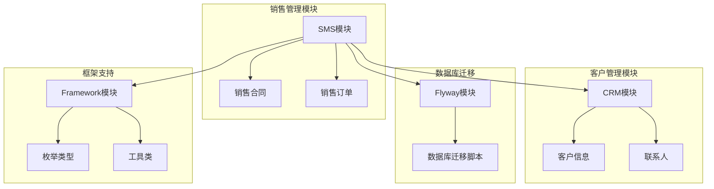
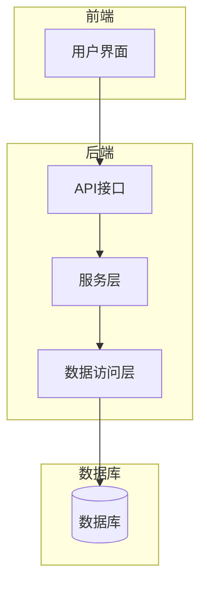
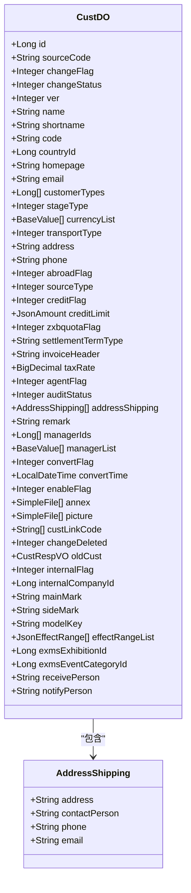
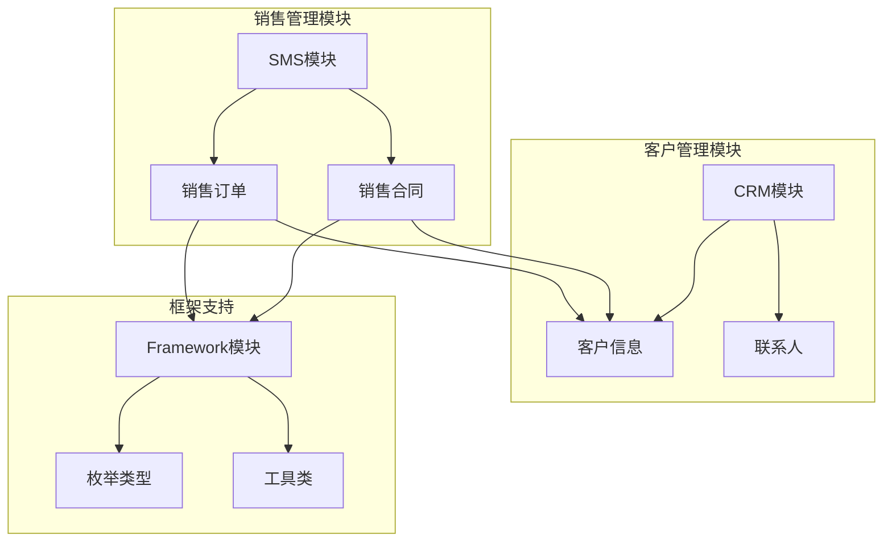

```mermaid
classDiagram
class SaleContractDO {
+Long id
+String code
+Integer confirmFlag
+Long companyId
+String companyName
+Long custId
+String custCode
+String custName
+String currency
+String settlementTermType
+Long settlementId
+String settlementName
+Long custCountryId
+String custCountryName
+String custPo
+Integer agentFlag
+Long collectedCustId
+String collectedCustCode
+String collectedCustName
+Long receiveCustId
+String receiveCustCode
+String receiveCustName
+UserDept sales
+SimpleFile[] annex
+LocalDateTime inputDate
+Long tradeCountryId
+String tradeCountryName
+String tradeCountryArea
+Long departureCountryId
+String departureCountryName
+String departureCountryArea
+Long departurePortId
+String departurePortName
+Long destinationPortId
+String destinationPortName
+Integer transportType
+LocalDateTime custDeliveryDate
+Integer twentyFootCabinetNum
+Integer fortyFootCabinetNum
+Integer fortyFootContainerNum
+BigDecimal bulkHandlingVolume
+JsonAmount trailerFee
+JsonAmount estimatedTotalFreight
+Integer bookingFlag
+JsonAmount commission
+JsonAmount platformFee
+JsonAmount insuranceFee
+JsonAmount lumpSumFee
+JsonAmount sinosureFee
+JsonAmount additionAmount
+JsonAmount deductionAmount
+JsonAmount inspectionFee
+JsonAmount estimatedPackingMaterials
+JsonAmount accessoriesPurchaseTotal
+Integer totalBoxes
+JsonWeight totalGrossweight
+JsonWeight totalWeight
+BigDecimal totalVolume
+JsonAmount totalGoodsValue
+JsonAmount[] totalPurchase
+JsonAmount totalVatRefund
+Integer totalQuantity
+JsonAmount orderGrossProfit
+BigDecimal grossProfitMargin
+JsonAmount receivableExchange
+Integer saleType
+Integer auditStatus
+Integer convertPurchaseFlag
+LocalDateTime convertPurchaseTime
+String processInstanceId
+UserDept signBackUser
+LocalDateTime signBackDate
+Integer status
+Integer changeStatus
+Integer autoFlag
+String[] linkCodeList
+SimpleFile[] designDraftList
+SimpleFile[] signBackAnnex
+Integer signBackFlag
+String signBackDesc
+Long collectionAccountId
+String collectionAccountBankCode
+BigDecimal exchangeRate
+Long sourceContractId
+String sourceContractCode
+String deliveryAddress
+Integer printFlag
+Integer printTimes
+JsonAmount totalAmount
+JsonAmount totalAmountUsd
+Long foreignTradeCompanyId
+String genContractUniqueCode
+JsonAmount realOrderGrossProfit
+BigDecimal realGrossProfitMargin
+JsonAmount realPurchaseTotal
+BigDecimal realTotalVolume
+Integer realTwentyFootCabinetNum
+Integer realFortyFootCabinetNum
+Integer realFortyFootContainerNum
+BigDecimal realBulkHandlingVolume
+JsonAmount realEstimatedTotalFreight
+Integer realTotalBoxes
+JsonWeight realTotalGrossweight
+JsonWeight realTotalWeight
+JsonAmount realTotalVatRefund
+JsonAmount realAccessoriesPurchaseTotal
+UserDept[] purchaseUserList
+BigDecimal usdRate
+LocalDateTime saleContractDate
+long syncCode
+JsonAmount totalStockCost
+JsonAmount collectionTotal
+UserDept manager
+JsonAmount totalAmountThisCurrency
+String remark
}
class SaleContractItem {
+Long id
+Integer sortNum
+Long contractId
+String contractCode
+String skuCode
+String basicSkuCode
+String name
+String nameEng
+SimpleFile mainPicture
+String thumbnail
+String cskuCode
+Integer quantity
+JsonAmount unitPrice
+JsonAmount totalSaleAmount
+JsonAmount purchaseUnitPrice
+JsonAmount realPurchaseWithTaxPrice
+JsonAmount purchasePackagingPrice
+JsonAmount purchaseShippingPrice
+JsonAmount purchaseWithTaxPrice
+JsonAmount purchaseTotalPrice
+String purchaseCurrency
+String venderName
+Long venderId
+String venderCode
+Integer commissionType
+BigDecimal commissionRate
+Integer commissionSubTotal
+JsonAmount commissionAmount
+Integer inventoryQuantity
+Integer currentLockQuantity
+Integer realLockQuantity
+Integer realPurchaseQuantity
+Integer needPurQuantity
+String unit
+String description
+String descriptionEng
+JsonAmount orderGrossProfit
+BigDecimal orderGrossProfitRate
+LocalDateTime venderDeliveryDate
+Integer qtyPerOuterbox
+Integer qtyPerInnerbox
+Integer boxCount
+BigDecimal volume
+Integer reorderFlag
+String hsCode
+Long[] packageType
+String packageTypeName
+String packageTypeEngName
+BigDecimal taxRefundRate
+BigDecimal realTaxRefundRate
+JsonAmount taxRefundPrice
+JsonAmount inspectionFee
+JsonAmount fundOccupancyFee
+JsonAmount trailerFee
+Integer bookingFlag
+JsonAmount insuranceFee
+JsonAmount platformFee
+JsonAmount forecastTotalCost
+JsonAmount innerCalcPrice
+JsonAmount sinosureFee
+Integer status
+UserDept purchaseUser
+Integer changeFlag
+Long skuId
+Integer ownBrandFlag
+Integer custProFlag
+UserDept[] purchaseUserList
+Long companyId
+String companyName
+Integer skuType
+Integer commodityInspectionFlag
+Integer shippedQuantity
+Integer transferShippedQuantity
+StockLockSaveReqVO[] stockLockSaveReqVOList
+StockDetailRespVO[] stockDetailRespVOList
+String sourceCode
+JsonEffectRange[] effectRangeList
+String uniqueCode
+String sourceUniqueCode
+String hsMeasureUnit
+Integer billStatus
+Integer abnormalStatus
+String abnormalRemark
+Integer billQuantity
+Integer convertShipmentFlag
+UserDept manager
+Integer shipmentTotalQuantity
+Integer skuDeletedFlag
+Integer convertPurchaseFlag
+JsonLock[] lockMsg
+Integer reLockFlag
+Long[] companyIdList
+BigDecimal taxRate
+Integer measureUnit
+Integer splitFlag
+Integer splitPurchaseFlag
+Integer splitPurchaseQuantity
+SplitPurchase[] splitPurchaseList
+Long purchaseCompanyId
+Long purchaseUserId
+JsonAmount stockLockPrice
+JsonAmount stockLockTotalPrice
+Integer converNoticeFlag
+String purchaseContractCode
+UserDept sales
+JsonSpecificationEntity[] specificationList
+Integer splitBoxFlag
+String realPrchaseCurrency
+JsonAmount realPackagingPrice
+JsonAmount realShippingPrice
+JsonSpecificationEntity[] realSpecificationList
+Integer realSplitBoxFlag
+Long realVenderId
+String realVenderName
+String realVenderCode
+JsonAmount realTaxRefundPrice
+Integer realBoxCount
+Integer freeFlag
+Integer purchaseFreeQuantity
+JsonAmount withTaxPriceRemoveFree
+long syncCode
+String oskuCode
+String barcode
+JsonAmount totalSaleAmountUsd
}
SaleContractDO --> SaleContractItem : "包含"
```

# 销售数据模型

<cite>
**本文档引用的文件**   
- [SaleContractDO.java](file://eplus-module-sms/eplus-module-sms-biz/src/main/java/com/syj/eplus/module/sms/dal/dataobject/salecontract/SaleContractDO.java)
- [SaleContractItem.java](file://eplus-module-sms/eplus-module-sms-biz/src/main/java/com/syj/eplus/module/sms/dal/dataobject/salecontractitem/SaleContractItem.java)
- [CustDO.java](file://eplus-module-crm/eplus-module-crm-biz/src/main/java/com/syj/eplus/module/crm/dal/dataobject/cust/CustDO.java)
- [SaleContractStatusEnum.java](file://eplus-framework/eplus-common/src/main/java/com/syj/eplus/framework/common/enums/SaleContractStatusEnum.java)
- [SaleTypeEnum.java](file://eplus-framework/eplus-common/src/main/java/com/syj/eplus/framework/common/enums/SaleTypeEnum.java)
- [V1_0_0_002__Eplus初始化.sql](file://eplus-flyway/src/main/resources/db/migration/common/V1_0_0_002__Eplus初始化.sql)
- [SaleContractService.java](file://eplus-module-sms/eplus-module-sms-biz/src/main/java/com/syj/eplus/module/sms/service/salecontract/SaleContractService.java)
- [SaleContractItemMapper.java](file://eplus-module-sms/eplus-module-sms-biz/src/main/java/com/syj/eplus/module/sms/dal/mysql/salecontractitem/SaleContractItemMapper.java)
</cite>

## 目录
1. [引言](#引言)
2. [项目结构](#项目结构)
3. [核心组件](#核心组件)
4. [架构概述](#架构概述)
5. [详细组件分析](#详细组件分析)
6. [依赖分析](#依赖分析)
7. [性能考虑](#性能考虑)
8. [故障排除指南](#故障排除指南)
9. [结论](#结论)
10. [附录](#附录) (如有必要)

## 引言
本文档旨在详细描述销售数据模型的设计，重点介绍销售合同、销售订单和客户管理等核心实体。文档将解释销售业务流程中的数据流转机制，包括销售机会管理、合同签订和订单执行等环节的数据结构。通过提供实体关系图（ER图）展示销售相关表之间的关系，详细说明销售合同的状态机设计、价格条款和交付条件等关键字段的业务含义。此外，文档还将包含实际的SQL建表语句和MyBatis Mapper配置示例，为开发者提供销售数据建模的指导和最佳实践。

## 项目结构
项目结构清晰地划分了不同的模块，每个模块负责特定的功能。`eplus-module-sms` 模块专注于销售管理，包含了销售合同和销售订单的核心逻辑。`eplus-module-crm` 模块则负责客户关系管理，处理客户信息和相关业务。`eplus-flyway` 模块用于数据库迁移，确保数据库结构的一致性和可维护性。`eplus-framework` 模块提供了通用的框架支持，包括枚举类型和公共工具类。



**图表来源**
- [SaleContractDO.java](file://eplus-module-sms/eplus-module-sms-biz/src/main/java/com/syj/eplus/module/sms/dal/dataobject/salecontract/SaleContractDO.java)
- [CustDO.java](file://eplus-module-crm/eplus-module-crm-biz/src/main/java/com/syj/eplus/module/crm/dal/dataobject/cust/CustDO.java)
- [V1_0_0_002__Eplus初始化.sql](file://eplus-flyway/src/main/resources/db/migration/common/V1_0_0_002__Eplus初始化.sql)

**章节来源**
- [eplus-module-sms](file://eplus-module-sms)
- [eplus-module-crm](file://eplus-module-crm)
- [eplus-flyway](file://eplus-flyway)
- [eplus-framework](file://eplus-framework)

## 核心组件
销售数据模型的核心组件包括销售合同、销售订单和客户管理。这些组件通过精心设计的数据结构和业务逻辑，支持销售业务的全流程管理。

**章节来源**
- [SaleContractDO.java](file://eplus-module-sms/eplus-module-sms-biz/src/main/java/com/syj/eplus/module/sms/dal/dataobject/salecontract/SaleContractDO.java)
- [SaleContractItem.java](file://eplus-module-sms/eplus-module-sms-biz/src/main/java/com/syj/eplus/module/sms/dal/dataobject/salecontractitem/SaleContractItem.java)
- [CustDO.java](file://eplus-module-crm/eplus-module-crm-biz/src/main/java/com/syj/eplus/module/crm/dal/dataobject/cust/CustDO.java)

## 架构概述
销售数据模型的架构设计遵循分层原则，确保各模块之间的职责分离和高内聚低耦合。核心业务逻辑集中在`eplus-module-sms`模块中，通过服务层（Service Layer）和数据访问层（DAO Layer）实现业务操作和数据持久化。客户管理功能由`eplus-module-crm`模块提供，通过API接口与销售管理模块进行交互。数据库迁移脚本位于`eplus-flyway`模块，确保数据库结构的版本控制和一致性。



**图表来源**
- [SaleContractService.java](file://eplus-module-sms/eplus-module-sms-biz/src/main/java/com/syj/eplus/module/sms/service/salecontract/SaleContractService.java)
- [SaleContractItemMapper.java](file://eplus-module-sms/eplus-module-sms-biz/src/main/java/com/syj/eplus/module/sms/dal/mysql/salecontractitem/SaleContractItemMapper.java)

## 详细组件分析
### 销售合同分析
销售合同是销售数据模型中的核心实体，包含合同的基本信息、客户信息、价格条款和交付条件等关键字段。通过状态机设计，销售合同可以经历从创建到完成的多个状态，确保业务流程的可控性和可追溯性。

#### 对象导向组件


**图表来源**
- [SaleContractDO.java](file://eplus-module-sms/eplus-module-sms-biz/src/main/java/com/syj/eplus/module/sms/dal/dataobject/salecontract/SaleContractDO.java)
- [SaleContractItem.java](file://eplus-module-sms/eplus-module-sms-biz/src/main/java/com/syj/eplus/module/sms/dal/dataobject/salecontractitem/SaleContractItem.java)

**章节来源**
- [SaleContractDO.java](file://eplus-module-sms/eplus-module-sms-biz/src/main/java/com/syj/eplus/module/sms/dal/dataobject/salecontract/SaleContractDO.java)
- [SaleContractItem.java](file://eplus-module-sms/eplus-module-sms-biz/src/main/java/com/syj/eplus/module/sms/dal/dataobject/salecontractitem/SaleContractItem.java)

### 客户管理分析
客户管理模块负责维护客户的基本信息、联系人信息和业务关系。通过客户实体的设计，系统能够有效地管理客户资料，支持销售业务的开展。

#### 对象导向组件


**图表来源**
- [CustDO.java](file://eplus-module-crm/eplus-module-crm-biz/src/main/java/com/syj/eplus/module/crm/dal/dataobject/cust/CustDO.java)

**章节来源**
- [CustDO.java](file://eplus-module-crm/eplus-module-crm-biz/src/main/java/com/syj/eplus/module/crm/dal/dataobject/cust/CustDO.java)

## 依赖分析
销售数据模型中的各个组件之间存在复杂的依赖关系。销售合同依赖于客户管理模块提供的客户信息，同时通过服务层和数据访问层与数据库进行交互。客户管理模块则依赖于框架支持模块提供的枚举类型和工具类。



**图表来源**
- [SaleContractDO.java](file://eplus-module-sms/eplus-module-sms-biz/src/main/java/com/syj/eplus/module/sms/dal/dataobject/salecontract/SaleContractDO.java)
- [CustDO.java](file://eplus-module-crm/eplus-module-crm-biz/src/main/java/com/syj/eplus/module/crm/dal/dataobject/cust/CustDO.java)
- [SaleTypeEnum.java](file://eplus-framework/eplus-common/src/main/java/com/syj/eplus/framework/common/enums/SaleTypeEnum.java)

**章节来源**
- [SaleContractDO.java](file://eplus-module-sms/eplus-module-sms-biz/src/main/java/com/syj/eplus/module/sms/dal/dataobject/salecontract/SaleContractDO.java)
- [CustDO.java](file://eplus-module-crm/eplus-module-crm-biz/src/main/java/com/syj/eplus/module/crm/dal/dataobject/cust/CustDO.java)
- [SaleTypeEnum.java](file://eplus-framework/eplus-common/src/main/java/com/syj/eplus/framework/common/enums/SaleTypeEnum.java)

## 性能考虑
在设计销售数据模型时，性能是一个重要的考虑因素。通过合理的索引设计和查询优化，可以显著提高系统的响应速度和处理能力。例如，在销售合同表中，对`custId`和`status`字段建立索引，可以加快按客户和状态查询的速度。此外，使用缓存技术可以减少数据库的访问频率，提高系统的整体性能。

## 故障排除指南
在使用销售数据模型时，可能会遇到各种问题。以下是一些常见的故障排除建议：
- **数据不一致**：检查数据库迁移脚本是否正确执行，确保数据库结构的一致性。
- **性能问题**：分析慢查询日志，优化查询语句和索引设计。
- **业务逻辑错误**：检查服务层和数据访问层的实现，确保业务逻辑的正确性。

**章节来源**
- [SaleContractService.java](file://eplus-module-sms/eplus-module-sms-biz/src/main/java/com/syj/eplus/module/sms/service/salecontract/SaleContractService.java)
- [SaleContractItemMapper.java](file://eplus-module-sms/eplus-module-sms-biz/src/main/java/com/syj/eplus/module/sms/dal/mysql/salecontractitem/SaleContractItemMapper.java)

## 结论
本文档详细描述了销售数据模型的设计，涵盖了销售合同、销售订单和客户管理等核心实体。通过提供实体关系图和详细的字段说明，为开发者提供了全面的指导和最佳实践。希望本文档能够帮助开发者更好地理解和使用销售数据模型，提高开发效率和系统性能。

## 附录
### SQL建表语句
```sql
CREATE TABLE IF NOT EXISTS `sms_sale_contract` (
    `id` bigint NOT NULL AUTO_INCREMENT COMMENT '主键',
    `code` varchar(20) NOT NULL DEFAULT '' COMMENT '编号',
    `confirm_flag` int NOT NULL DEFAULT 0 COMMENT '确认状态',
    `company_id` bigint NOT NULL DEFAULT 0 COMMENT '内部法人单位id',
    `company_name` varchar(100) NOT NULL DEFAULT '' COMMENT '内部法人单位名称',
    `cust_id` bigint NOT NULL DEFAULT 0 COMMENT '客户主键',
    `cust_code` varchar(20) NOT NULL DEFAULT '' COMMENT '客户编号',
    `cust_name` varchar(100) NOT NULL DEFAULT '' COMMENT '客户名称',
    `currency` varchar(10) NOT NULL DEFAULT '' COMMENT '交易币别',
    `settlement_term_type` varchar(20) NOT NULL DEFAULT '' COMMENT '价格条款',
    `settlement_id` bigint NOT NULL DEFAULT 0 COMMENT '收款方式主键',
    `settlement_name` varchar(100) NOT NULL DEFAULT '' COMMENT '收款方式名称',
    `cust_country_id` bigint NOT NULL DEFAULT 0 COMMENT '客户国别主键',
    `cust_country_name` varchar(100) NOT NULL DEFAULT '' COMMENT '客户国别',
    `cust_po` varchar(20) NOT NULL DEFAULT '' COMMENT '客户合同号',
    `agent_flag` int NOT NULL DEFAULT 0 COMMENT '是否代理',
    `collected_cust_id` bigint NOT NULL DEFAULT 0 COMMENT '应收客户主键',
    `collected_cust_code` varchar(20) NOT NULL DEFAULT '' COMMENT '应收客户编号',
    `collected_cust_name` varchar(100) NOT NULL DEFAULT '' COMMENT '应收客户名称',
    `receive_cust_id` bigint NOT NULL DEFAULT 0 COMMENT '收货客户主键',
    `receive_cust_code` varchar(20) NOT NULL DEFAULT '' COMMENT '收货客户编号',
    `receive_cust_name` varchar(100) NOT NULL DEFAULT '' COMMENT '收货客户名称',
    `sales` json NOT NULL DEFAULT (JSON_OBJECT()) COMMENT '销售人员',
    `annex` json NOT NULL DEFAULT (JSON_OBJECT()) COMMENT '附件',
    `input_date` datetime NOT NULL DEFAULT CURRENT_TIMESTAMP COMMENT '录入日期',
    `trade_country_id` bigint NOT NULL DEFAULT 0 COMMENT '贸易国别主键',
    `trade_country_name` varchar(100) NOT NULL DEFAULT '' COMMENT '贸易国别名称',
    `trade_country_area` varchar(100) NOT NULL DEFAULT '' COMMENT '贸易国区域',
    `departure_country_id` bigint NOT NULL DEFAULT 0 COMMENT '出运国主键',
    `departure_country_name` varchar(100) NOT NULL DEFAULT '' COMMENT '出运国名称',
    `departure_country_area` varchar(100) NOT NULL DEFAULT '' COMMENT '出运国区域',
    `departure_port_id` bigint NOT NULL DEFAULT 0 COMMENT '出运口岸主键',
    `departure_port_name` varchar(100) NOT NULL DEFAULT '' COMMENT '出运口岸名称',
    `destination_port_id` bigint NOT NULL DEFAULT 0 COMMENT '目的口岸主键',
    `destination_port_name` varchar(100) NOT NULL DEFAULT '' COMMENT '目的口岸名称',
    `transport_type` int NOT NULL DEFAULT 0 COMMENT '运输方式',
    `cust_delivery_date` datetime NOT NULL DEFAULT CURRENT_TIMESTAMP COMMENT '客户交期',
    `twenty_foot_cabinet_num` int NOT NULL DEFAULT 0 COMMENT '20尺柜',
    `forty_foot_cabinet_num` int NOT NULL DEFAULT 0 COMMENT '40尺柜',
    `forty_foot_container_num` int NOT NULL DEFAULT 0 COMMENT '40尺高柜',
    `bulk_handling_volume` decimal(19, 6) NOT NULL DEFAULT 0 COMMENT '散货',
    `trailer_fee` json NOT NULL DEFAULT (JSON_OBJECT()) COMMENT '拖柜费',
    `estimated_total_freight` json NOT NULL DEFAULT (JSON_OBJECT()) COMMENT '预估总运费',
    `booking_flag` int NOT NULL DEFAULT 0 COMMENT '是否订舱',
    `commission` json NOT NULL DEFAULT (JSON_OBJECT()) COMMENT '佣金',
    `platform_fee` json NOT NULL DEFAULT (JSON_OBJECT()) COMMENT '平台费',
    `insurance_fee` json NOT NULL DEFAULT (JSON_OBJECT()) COMMENT '保险费',
    `lump_sum_fee` json NOT NULL DEFAULT (JSON_OBJECT()) COMMENT '加项金额',
    `sinosure_fee` json NOT NULL DEFAULT (JSON_OBJECT()) COMMENT '中信保费用',
    `addition_amount` json NOT NULL DEFAULT (JSON_OBJECT()) COMMENT '加项金额',
    `deduction_amount` json NOT NULL DEFAULT (JSON_OBJECT()) COMMENT '减项金额',
    `inspection_fee` json NOT NULL DEFAULT (JSON_OBJECT()) COMMENT '验货费用',
    `estimated_packing_materials` json NOT NULL DEFAULT (JSON_OBJECT()) COMMENT '预计包材合计',
    `accessories_purchase_total` json NOT NULL DEFAULT (JSON_OBJECT()) COMMENT '配件采购合计',
    `total_boxes` int NOT NULL DEFAULT 0 COMMENT '箱数合计',
    `total_grossweight` json NOT NULL DEFAULT (JSON_OBJECT()) COMMENT '毛重合计',
    `total_weight` json NOT NULL DEFAULT (JSON_OBJECT()) COMMENT '净重合计',
    `total_volume` decimal(19, 6) NOT NULL DEFAULT 0 COMMENT '体积合计',
    `total_goods_value` json NOT NULL DEFAULT (JSON_OBJECT()) COMMENT '货值合计',
    `total_purchase` json NOT NULL DEFAULT (JSON_OBJECT()) COMMENT '采购合计',
    `total_vat_refund` json NOT NULL DEFAULT (JSON_OBJECT()) COMMENT '退税合计',
    `total_quantity` int NOT NULL DEFAULT 0 COMMENT '数量合计',
    `order_gross_profit` json NOT NULL DEFAULT (JSON_OBJECT()) COMMENT '订单毛利',
    `gross_profit_margin` decimal(19, 6) NOT NULL DEFAULT 0 COMMENT '毛利率',
    `receivable_exchange` json NOT NULL DEFAULT (JSON_OBJECT()) COMMENT '应收汇款',
    `sale_type` int NOT NULL DEFAULT 0 COMMENT '销售合同类型',
    `audit_status` int NOT NULL DEFAULT 0 COMMENT '审核状态',
    `convert_purchase_flag` int NOT NULL DEFAULT 0 COMMENT '转采购计划标记',
    `convert_purchase_time` datetime DEFAULT NULL COMMENT '转采购计划时间',
    `process_instance_id` varchar(100) NOT NULL DEFAULT '' COMMENT '流程id',
    `sign_back_user` json NOT NULL DEFAULT (JSON_OBJECT()) COMMENT '回签人',
    `sign_back_date` datetime DEFAULT NULL COMMENT '回签日期',
    `status` int NOT NULL DEFAULT 0 COMMENT '状态',
    `change_status` int NOT NULL DEFAULT 0 COMMENT '变更状态',
    `auto_flag` int NOT NULL DEFAULT 0 COMMENT '自动生成标识',
    `link_code_list` json NOT NULL DEFAULT (JSON_OBJECT()) COMMENT '订单链路编号',
    `design_draft_list` json NOT NULL DEFAULT (JSON_OBJECT()) COMMENT '设计稿',
    `sign_back_annex` json NOT NULL DEFAULT (JSON_OBJECT()) COMMENT '回签附件',
    `sign_back_flag` int NOT NULL DEFAULT 0 COMMENT '回签标记',
    `sign_back_desc` varchar(1000) NOT NULL DEFAULT '' COMMENT '回签描述',
    `collection_account_id` bigint NOT NULL DEFAULT 0 COMMENT '客户收款账号id',
    `collection_account_bank_code` varchar(100) NOT NULL DEFAULT '' COMMENT '客户收款账号',
    `exchange_rate` decimal(19, 6) NOT NULL DEFAULT 0 COMMENT '创建时汇率',
    `source_contract_id` bigint NOT NULL DEFAULT 0 COMMENT '销售合同主键',
    `source_contract_code` varchar(20) NOT NULL DEFAULT '' COMMENT '销售合同编码',
    `delivery_address` varchar(100) NOT NULL DEFAULT '' COMMENT '送货地址',
    `print_flag` int NOT NULL DEFAULT 0 COMMENT '打印状态',
    `print_times` int NOT NULL DEFAULT 0 COMMENT '打印次数',
    `total_amount` json NOT NULL DEFAULT (JSON_OBJECT()) COMMENT '销售总金额',
    `total_amount_usd` json NOT NULL DEFAULT (JSON_OBJECT()) COMMENT '销售总金额USD',
    `foreign_trade_company_id` bigint NOT NULL DEFAULT 0 COMMENT '外贸主体ID',
    `gen_contract_unique_code` varchar(100) NOT NULL DEFAULT '' COMMENT '内部生成编号',
    `real_order_gross_profit` json NOT NULL DEFAULT (JSON_OBJECT()) COMMENT '真实订单毛利',
    `real_gross_profit_margin` decimal(19, 6) NOT NULL DEFAULT 0 COMMENT '真实毛利率',
    `real_purchase_total` json NOT NULL DEFAULT (JSON_OBJECT()) COMMENT '真实采购合计',
    `real_total_volume` decimal(19, 6) NOT NULL DEFAULT 0 COMMENT '真实体积合计',
    `real_twenty_foot_cabinet_num` int NOT NULL DEFAULT 0 COMMENT '真实20尺柜',
    `real_forty_foot_cabinet_num` int NOT NULL DEFAULT 0 COMMENT '真实40尺柜',
    `real_forty_foot_container_num` int NOT NULL DEFAULT 0 COMMENT '真实40尺高柜',
    `real_bulk_handling_volume` decimal(19, 6) NOT NULL DEFAULT 0 COMMENT '真实散货',
    `real_estimated_total_freight` json NOT NULL DEFAULT (JSON_OBJECT()) COMMENT '真实预估总运费',
    `real_total_boxes` int NOT NULL DEFAULT 0 COMMENT '真实箱数合计',
    `real_total_grossweight` json NOT NULL DEFAULT (JSON_OBJECT()) COMMENT '真实毛重合计',
    `real_total_weight` json NOT NULL DEFAULT (JSON_OBJECT()) COMMENT '真实净重合计',
    `real_total_vat_refund` json NOT NULL DEFAULT (JSON_OBJECT()) COMMENT '真实退税合计',
    `real_accessories_purchase_total` json NOT NULL DEFAULT (JSON_OBJECT()) COMMENT '真实配件采购合计',
    `purchase_user_list` json NOT NULL DEFAULT (JSON_OBJECT()) COMMENT '采购员',
    `usd_rate` decimal(19, 6) NOT NULL DEFAULT 0 COMMENT '美元汇率',
    `sale_contract_date` datetime NOT NULL DEFAULT CURRENT_TIMESTAMP COMMENT '销售合同日期',
    `sync_code` bigint NOT NULL DEFAULT 0 COMMENT '同步标记',
    `total_stock_cost` json NOT NULL DEFAULT (JSON_OBJECT()) COMMENT '库存成本合计',
    `collection_total` json NOT NULL DEFAULT (JSON_OBJECT()) COMMENT '收款合计',
    `manager` json NOT NULL DEFAULT (JSON_OBJECT()) COMMENT '跟单员',
    `total_amount_this_currency` json NOT NULL DEFAULT (JSON_OBJECT()) COMMENT '销售总金额(原币种)',
    `remark` varchar(1000) NOT NULL DEFAULT '' COMMENT '备注',
    `creator` int UNSIGNED NULL DEFAULT NULL COMMENT '创建人',
    `create_time` datetime NULL DEFAULT CURRENT_TIMESTAMP COMMENT '创建时间',
    `updater` int UNSIGNED NULL DEFAULT NULL COMMENT '修改人',
    `deleted` tinyint(1) NOT NULL DEFAULT 0 COMMENT '删除',
    `update_time` datetime NULL DEFAULT NULL ON UPDATE CURRENT_TIMESTAMP COMMENT '修改时间',
    PRIMARY KEY (`id`) USING BTREE
) ENGINE = InnoDB
  AUTO_INCREMENT = 1
  CHARACTER SET = utf8mb4
  COLLATE = utf8mb4_general_ci COMMENT = '销售合同'
  ROW_FORMAT = DYNAMIC;
```

### MyBatis Mapper配置示例
```xml
<mapper namespace="com.syj.eplus.module.sms.dal.mysql.salecontractitem.SaleContractItemMapper">
    <resultMap id="BaseResultMap" type="com.syj.eplus.module.sms.dal.dataobject.salecontractitem.SaleContractItem">
        <id column="id" property="id" />
        <result column="sort_num" property="sortNum" />
        <result column="contract_id" property="contractId" />
        <result column="sku_code" property="skuCode" />
        <result column="basic_sku_code" property="basicSkuCode" />
        <result column="name" property="name" />
        <result column="name_eng" property="nameEng" />
        <result column="main_picture" property="mainPicture" typeHandler="com.syj.eplus.framework.common.config.handler.JsonFileTypeHandler" />
        <result column="thumbnail" property="thumbnail" />
        <result column="csku_code" property="cskuCode" />
        <result column="quantity" property="quantity" />
        <result column="unit_price" property="unitPrice" typeHandler="com.syj.eplus.framework.common.config.handler.JsonAmountTypeHandler" />
        <result column="total_sale_amount" property="totalSaleAmount" typeHandler="com.syj.eplus.framework.common.config.handler.JsonAmountTypeHandler" />
        <result column="purchase_unit_price" property="purchaseUnitPrice" typeHandler="com.syj.eplus.framework.common.config.handler.JsonAmountTypeHandler" />
        <result column="real_purchase_with_tax_price" property="realPurchaseWithTaxPrice" typeHandler="com.syj.eplus.framework.common.config.handler.JsonAmountTypeHandler" />
        <result column="purchase_packaging_price" property="purchasePackagingPrice" typeHandler="com.syj.eplus.framework.common.config.handler.JsonAmountTypeHandler" />
        <result column="purchase_shipping_price" property="purchaseShippingPrice" typeHandler="com.syj.eplus.framework.common.config.handler.JsonAmountTypeHandler" />
        <result column="purchase_with_tax_price" property="purchaseWithTaxPrice" typeHandler="com.syj.eplus.framework.common.config.handler.JsonAmountTypeHandler" />
        <result column="purchase_total_price" property="purchaseTotalPrice" typeHandler="com.syj.eplus.framework.common.config.handler.JsonAmountTypeHandler" />
        <result column="purchase_currency" property="purchaseCurrency" />
        <result column="vender_name" property="venderName" />
        <result column="vender_id" property="venderId" />
        <result column="vender_code" property="venderCode" />
        <result column="commission_type" property="commissionType" />
        <result column="commission_rate" property="commissionRate" />
        <result column="commission_sub_total" property="commissionSubTotal" />
        <result column="commission_amount" property="commissionAmount" typeHandler="com.syj.eplus.framework.common.config.handler.JsonAmountTypeHandler" />
        <result column="inventory_quantity" property="inventoryQuantity" />
        <result column="current_lock_quantity" property="currentLockQuantity" />
        <result column="real_lock_quantity" property="realLockQuantity" />
        <result column="real_purchase_quantity" property="realPurchaseQuantity" />
        <result column="need_pur_quantity" property="needPurQuantity" />
        <result column="unit" property="unit" />
        <result column="description" property="description" />
        <result column="description_eng" property="descriptionEng" />
        <result column="order_gross_profit" property="orderGrossProfit" typeHandler="com.syj.eplus.framework.common.config.handler.JsonAmountTypeHandler" />
        <result column="order_gross_profit_rate" property="orderGrossProfitRate" />
        <result column="vender_delivery_date" property="venderDeliveryDate" />
        <result column="qty_per_outerbox" property="qtyPerOuterbox" />
        <result column="qty_per_innerbox" property="qtyPerInnerbox" />
        <result column="box_count" property="boxCount" />
        <result column="volume" property="volume" />
        <result column="reorder_flag" property="reorderFlag" />
        <result column="hs_code" property="hsCode" />
        <result column="package_type" property="packageType" typeHandler="com.syj.eplus.framework.common.config.handler.LongListTypeHandler" />
        <result column="package_type_name" property="packageTypeName" />
        <result column="package_type_eng_name" property="packageTypeEngName" />
        <result column="tax_refund_rate" property="taxRefundRate" />
        <result column="real_tax_refund_rate" property="realTaxRefundRate" />
        <result column="tax_refund_price" property="taxRefundPrice" typeHandler="com.syj.eplus.framework.common.config.handler.JsonAmountTypeHandler" />
        <result column="inspection_fee" property="inspectionFee" typeHandler="com.syj.eplus.framework.common.config.handler.JsonAmountTypeHandler" />
        <result column="fund_occupancy_fee" property="fundOccupancyFee" typeHandler="com.syj.eplus.framework.common.config.handler.JsonAmountTypeHandler" />
        <result column="trailer_fee" property="trailerFee" typeHandler="com.syj.eplus.framework.common.config.handler.JsonAmountTypeHandler" />
        <result column="booking_flag" property="bookingFlag" />
        <result column="insurance_fee" property="insuranceFee" typeHandler="com.syj.eplus.framework.common.config.handler.JsonAmountTypeHandler" />
        <result column="platform_fee" property="platformFee" typeHandler="com.syj.eplus.framework.common.config.handler.JsonAmountTypeHandler" />
        <result column="forecast_total_cost" property="forecastTotalCost" typeHandler="com.syj.eplus.framework.common.config.handler.JsonAmountTypeHandler" />
        <result column="inner_calc_price" property="innerCalcPrice" typeHandler="com.syj.eplus.framework.common.config.handler.JsonAmountTypeHandler" />
        <result column="sinosure_fee" property="sinosureFee" typeHandler="com.syj.eplus.framework.common.config.handler.JsonAmountTypeHandler" />
        <result column="status" property="status" />
        <result column="purchase_user" property="purchaseUser" typeHandler="com.syj.eplus.framework.common.config.handler.JsonUserDeptTypeHandler" />
        <result column="change_flag" property="changeFlag" />
        <result column="sku_id" property="skuId" />
        <result column="own_brand_flag" property="ownBrandFlag" />
        <result column="cust_pro_flag" property="custProFlag" />
        <result column="purchase_user_list" property="purchaseUserList" typeHandler="com.syj.eplus.framework.common.config.handler.JsonUserDeptListTypeHandler" />
        <result column="company_id" property="companyId" />
        <result column="company_name" property="companyName" />
        <result column="sku_type" property="skuType" />
        <result column="commodity_inspection_flag" property="commodityInspectionFlag" />
        <result column="shipped_quantity" property="shippedQuantity" />
        <result column="transfer_shipped_quantity" property="transferShippedQuantity" />
        <result column="stock_lock_save_req_vo_list" property="stockLockSaveReqVOList" typeHandler="com.syj.eplus.framework.common.config.handler.JsonsTockLockSaveReqTypeHandler" />
        <result column="stock_detail_resp_vo_list" property="stockDetailRespVOList" />
        <result column="source_code" property="sourceCode" />
        <result column="effect_range_list" property="effectRangeList" typeHandler="com.syj.eplus.framework.common.config.handler.JsonEffectRangeTypeHandler" />
        <result column="unique_code" property="uniqueCode" />
        <result column="source_unique_code" property="sourceUniqueCode" />
        <result column="hs_measure_unit" property="hsMeasureUnit" />
        <result column="bill_status" property="billStatus" />
        <result column="abnormal_status" property="abnormalStatus" />
        <result column="abnormal_remark" property="abnormalRemark" />
        <result column="bill_quantity" property="billQuantity" />
        <result column="convert_shipment_flag" property="convertShipmentFlag" />
        <result column="manager" property="manager" typeHandler="com.syj.eplus.framework.common.config.handler.JsonUserDeptTypeHandler" />
        <result column="shipment_total_quantity" property="shipmentTotalQuantity" />
        <result column="sku_deleted_flag" property="skuDeletedFlag" />
        <result column="convert_purchase_flag" property="convertPurchaseFlag" />
        <result column="lock_msg" property="lockMsg" typeHandler="com.syj.eplus.framework.common.config.handler.JsonLockListTypeHandler" />
        <result column="re_lock_flag" property="reLockFlag" />
        <result column="company_id_list" property="companyIdList" typeHandler="com.syj.eplus.framework.common.config.handler.LongListTypeHandler" />
        <result column="tax_rate" property="taxRate" />
        <result column="measure_unit" property="measureUnit" />
        <result column="split_flag" property="splitFlag" />
        <result column="split_purchase_flag" property="splitPurchaseFlag" />
        <result column="split_purchase_quantity" property="splitPurchaseQuantity" />
        <result column="split_purchase_list" property="splitPurchaseList" typeHandler="com.syj.eplus.framework.common.config.handler.JsonSplitPurchaseListTypeHandler" />
        <result column="purchase_company_id" property="purchaseCompanyId" />
        <result column="purchase_user_id" property="purchaseUserId" />
        <result column="stock_lock_price" property="stockLockPrice" typeHandler="com.syj.eplus.framework.common.config.handler.JsonAmountTypeHandler" />
        <result column="stock_lock_total_price" property="stockLockTotalPrice" typeHandler="com.syj.eplus.framework.common.config.handler.JsonAmountTypeHandler" />
        <result column="conver_notice_flag" property="converNoticeFlag" />
        <result column="purchase_contract_code" property="purchaseContractCode" />
        <result column="sales" property="sales" typeHandler="com.syj.eplus.framework.common.config.handler.JsonUserDeptTypeHandler" />
        <result column="specification_list" property="specificationList" typeHandler="com.syj.eplus.framework.common.config.handler.JsonSpecificationEntityListHandler" />
        <result column="split_box_flag" property="splitBoxFlag" />
        <result column="real_prchase_currency" property="realPrchaseCurrency" />
        <result column="real_packaging_price" property="realPackagingPrice" typeHandler="com.syj.eplus.framework.common.config.handler.JsonAmountTypeHandler" />
        <result column="real_shipping_price" property="realShippingPrice" typeHandler="com.syj.eplus.framework.common.config.handler.JsonAmountTypeHandler" />
        <result column="real_specification_list" property="realSpecificationList" typeHandler="com.syj.eplus.framework.common.config.handler.JsonSpecificationEntityListHandler" />
        <result column="real_split_box_flag" property="realSplitBoxFlag" />
        <result column="real_vender_id" property="realVenderId" />
        <result column="real_vender_name" property="realVenderName" />
        <result column="real_vender_code" property="realVenderCode" />
        <result column="real_tax_refund_price" property="realTaxRefundPrice" typeHandler="com.syj.eplus.framework.common.config.handler.JsonAmountTypeHandler" />
        <result column="real_box_count" property="realBoxCount" />
        <result column="free_flag" property="freeFlag" />
        <result column="purchase_free_quantity" property="purchaseFreeQuantity" />
        <result column="with_tax_price_remove_free" property="withTaxPriceRemoveFree" typeHandler="com.syj.eplus.framework.common.config.handler.JsonAmountTypeHandler" />
        <result column="sync_code" property="syncCode" />
        <result column="osku_code" property="oskuCode" />
        <result column="barcode" property="barcode" />
        <result column="total_sale_amount_usd" property="totalSaleAmountUsd" typeHandler="com.syj.eplus.framework.common.config.handler.JsonAmountTypeHandler" />
        <result column="creator" property="creator" />
        <result column="create_time" property="createTime" />
        <result column="updater" property="updater" />
        <result column="deleted" property="deleted" />
        <result column="update_time" property="updateTime" />
    </resultMap>

    <select id="selectByContractIdStr" parameterType="string" resultMap="BaseResultMap">
        SELECT * FROM sms_sale_contract_item WHERE FIND_IN_SET(contract_id, #{contractIdStr})
    </select>

    <select id="selectByContractIds" parameterType="list" resultMap="BaseResultMap">
        SELECT * FROM sms_sale_contract_item WHERE contract_id IN
        <foreach item="item" index="index" collection="contractIds" open="(" separator="," close=")">
            #{item}
        </foreach>
    </select>

    <select id="getSaleContractItemStatusLink" parameterType="long" resultType="int">
        SELECT DISTINCT t.STATUS
        FROM sms_sale_contract p
        JOIN sms_sale_contract_item t ON p.id = t.contract_id
        WHERE p.id = (SELECT contract_id FROM sms_sale_contract_item WHERE id = #{itemId})
    </select>

    <select id="getSaleContractItemListBySkuCodeList" parameterType="list" resultMap="BaseResultMap">
        SELECT * FROM sms_sale_contract_item WHERE sku_code IN
        <foreach item="item" index="index" collection="skuCodeList" open="(" separator="," close=")">
            #{item}
        </foreach>
    </select>

    <select id="selectProductModePage" parameterType="map" resultType="com.syj.eplus.module.sms.controller.admin.salecontract.vo.SaleContractProductModeRespVO">
        SELECT 
            sci.id,
            sci.contract_code,
            sci.sku_code,
            sci.basic_sku_code,
            sci.name,
            sci.name_eng,
            sci.csku_code,
            sci.quantity,
            sci.unit_price,
            sci.total_sale_amount,
            sci.purchase_unit_price,
            sci.purchase_packaging_price,
            sci.purchase_shipping_price,
            sci.purchase_with_tax_price,
            sci.purchase_total_price,
            sci.purchase_currency,
            sci.vender_name,
            sci.vender_id,
            sci.vender_code,
            sci.commission_type,
            sci.commission_rate,
            sci.commission_sub_total,
            sci.commission_amount,
            sci.inventory_quantity,
            sci.current_lock_quantity,
            sci.real_lock_quantity,
            sci.real_purchase_quantity,
            sci.need_pur_quantity,
            sci.unit,
            sci.description,
            sci.description_eng,
            sci.order_gross_profit,
            sci.order_gross_profit_rate,
            sci.vender_delivery_date,
            sci.qty_per_outerbox,
            sci.qty_per_innerbox,
            sci.box_count,
            sci.volume,
            sci.reorder_flag,
            sci.hs_code,
            sci.package_type,
            sci.package_type_name,
            sci.package_type_eng_name,
            sci.tax_refund_rate,
            sci.real_tax_refund_rate,
            sci.tax_refund_price,
            sci.inspection_fee,
            sci.fund_occupancy_fee,
            sci.trailer_fee,
            sci.booking_flag,
            sci.insurance_fee,
            sci.platform_fee,
            sci.forecast_total_cost,
            sci.inner_calc_price,
            sci.sinosure_fee,
            sci.status,
            sci.purchase_user,
            sci.change_flag,
            sci.sku_id,
            sci.own_brand_flag,
            sci.cust_pro_flag,
            sci.purchase_user_list,
            sci.company_id,
            sci.company_name,
            sci.sku_type,
            sci.commodity_inspection_flag,
            sci.shipped_quantity,
            sci.transfer_shipped_quantity,
            sci.stock_lock_save_req_vo_list,
            sci.stock_detail_resp_vo_list,
            sci.source_code,
            sci.effect_range_list,
            sci.unique_code,
            sci.source_unique_code,
            sci.hs_measure_unit,
            sci.bill_status,
            sci.abnormal_status,
            sci.abnormal_remark,
            sci.bill_quantity,
            sci.convert_shipment_flag,
            sci.manager,
            sci.shipment_total_quantity,
            sci.sku_deleted_flag,
            sci.convert_purchase_flag,
            sci.lock_msg,
            sci.re_lock_flag,
            sci.company_id_list,
            sci.tax_rate,
            sci.measure_unit,
            sci.split_flag,
            sci.split_purchase_flag,
            sci.split_purchase_quantity,
            sci.split_purchase_list,
            sci.purchase_company_id,
            sci.purchase_user_id,
            sci.stock_lock_price,
            sci.stock_lock_total_price,
            sci.conver_notice_flag,
            sci.purchase_contract_code,
            sci.sales,
            sci.specification_list,
            sci.split_box_flag,
            sci.real_prchase_currency,
            sci.real_packaging_price,
            sci.real_shipping_price,
            sci.real_specification_list,
            sci.real_split_box_flag,
            sci.real_vender_id,
            sci.real_vender_name,
            sci.real_vender_code,
            sci.real_tax_refund_price,
            sci.real_box_count,
            sci.free_flag,
            sci.purchase_free_quantity,
            sci.with_tax_price_remove_free,
            sci.sync_code,
            sci.osku_code,
            sci.barcode,
            sci.total_sale_amount_usd,
            sci.creator,
            sci.create_time,
            sci.updater,
            sci.deleted,
            sci.update_time
        FROM sms_sale_contract_item sci
        INNER JOIN sms_sale_contract sc ON sci.contract_id = sc.id
        WHERE 1=1
        <if test="req.custCode != null and req.custCode != ''">
            AND sc.cust_code = #{req.custCode}
        </if>
        <if test="req.skuCode != null and req.skuCode != ''">
            AND sci.sku_code = #{req.skuCode}
        </if>
        <if test="req.statusList != null and req.statusList.length > 0">
            AND sci.status IN
            <foreach item="item" index="index" collection="req.statusList" open="(" separator="," close=")">
                #{item}
            </foreach>
        </if>
        ORDER BY sci.create_time DESC
    </select>

    <select id="selectProductModeSummary" parameterType="map" resultType="com.syj.eplus.module.sms.dal.dataobject.salecontract.SaleContractProductModeSummaryDO">
        SELECT 
            COUNT(*) as totalCount,
            SUM(sci.quantity) as totalQuantity,
            SUM(sci.total_sale_amount.amount) as totalSaleAmount,
            SUM(sci.purchase_total_price.amount) as totalPurchasePrice
        FROM sms_sale_contract_item sci
        INNER JOIN sms_sale_contract sc ON sci.contract_id = sc.id
        WHERE 1=1
        <if test="req.custCode != null and req.custCode != ''">
            AND sc.cust_code = #{req.custCode}
        </if>
        <if test="req.skuCode != null and req.skuCode != ''">
            AND sci.sku_code = #{req.skuCode}
        </if>
        <if test="req.statusList != null and req.statusList.length > 0">
            AND sci.status IN
            <foreach item="item" index="index" collection="req.statusList" open="(" separator="," close=")">
                #{item}
            </foreach>
        </if>
    </select>
</mapper>
```