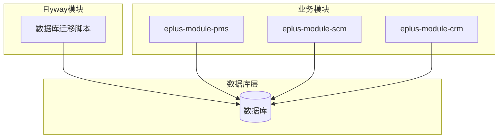
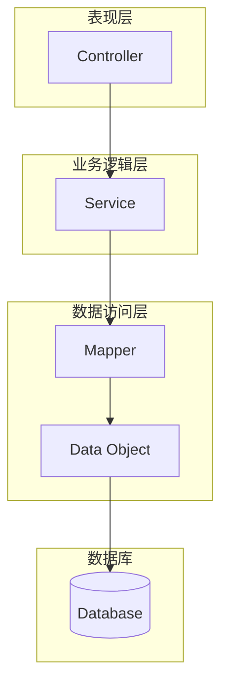
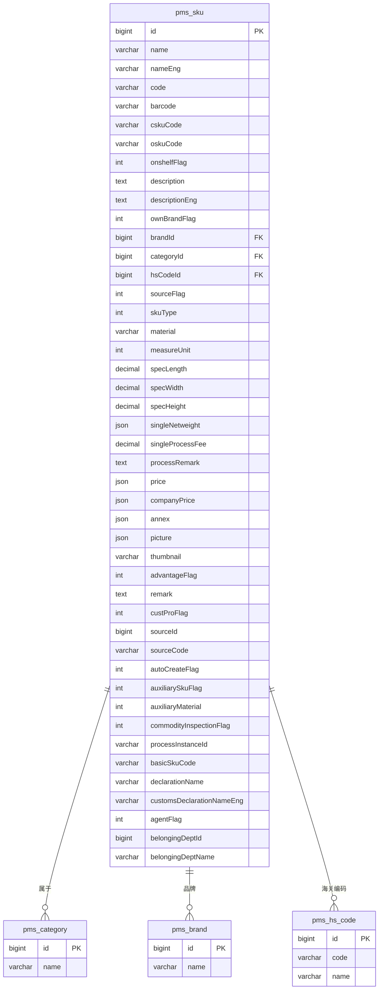
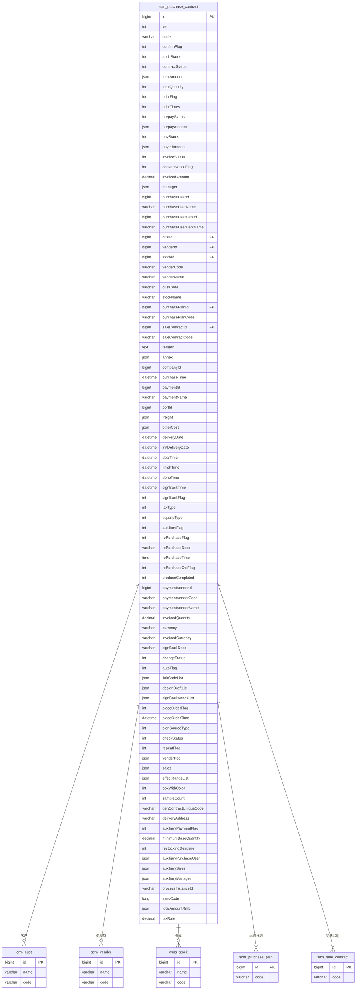
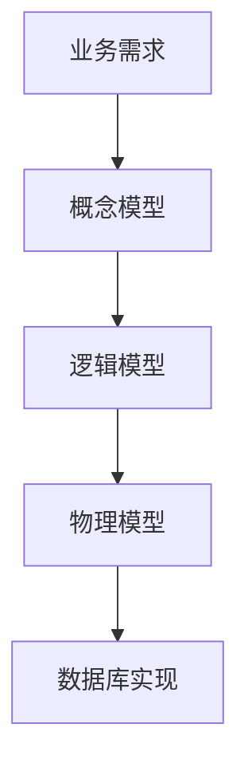
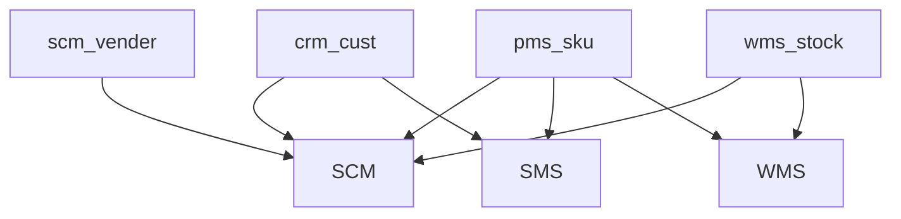

# 数据库设计

<cite>
**本文档引用的文件**   
- [V1_0_0_001__框架初始化.sql](file://eplus-flyway/src/main/resources/db/migration/common/V1_0_0_001__框架初始化.sql)
- [V1_0_0_002__Eplus初始化.sql](file://eplus-flyway/src/main/resources/db/migration/common/V1_0_0_002__Eplus初始化.sql)
- [SkuDO.java](file://eplus-module-pms/eplus-module-pms-biz/src/main/java/com/syj/eplus/module/pms/dal/dataobject/sku/SkuDO.java)
- [PurchaseContractDO.java](file://eplus-module-scm/eplus-module-scm-biz/src/main/java/com/syj/eplus/module/scm/dal/dataobject/purchasecontract/PurchaseContractDO.java)
- [SkuMapper.xml](file://eplus-module-pms/eplus-module-pms-biz/src/main/resources/mapper/SkuMapper.xml)
- [PurchaseContractMapper.xml](file://eplus-module-scm/eplus-module-scm-biz/src/main/resources/mapper/purchasecontract/PurchaseContractMapper.xml)
</cite>

## 目录
1. [引言](#引言)
2. [项目结构](#项目结构)
3. [核心组件](#核心组件)
4. [架构概述](#架构概述)
5. [详细组件分析](#详细组件分析)
6. [依赖分析](#依赖分析)
7. [性能考虑](#性能考虑)
8. [故障排除指南](#故障排除指南)
9. [结论](#结论)
10. [附录](#附录) (如有必要)

## 引言
本文档旨在全面描述企业管理系统的核心数据模型和表结构设计。系统围绕产品、订单、客户、供应商等核心业务实体构建，通过精细化的数据建模支持复杂的业务流程。文档将重点分析SKU（库存保有单位）、采购合同、销售合同等关键模块的表结构设计原则，包括字段命名规范、数据类型选择、主键和外键约束等。通过ER图可视化实体关系，并提供实际的SQL建表语句和MyBatis Mapper配置示例，为开发者提供数据建模的最佳实践指导。

## 项目结构
项目采用模块化设计，每个业务模块（如CRM、SCM、PMS等）拥有独立的数据库访问层（DAL）和MyBatis Mapper配置。核心数据模型分布在`eplus-flyway`模块的数据库迁移脚本中，而具体的实体类（DO）和Mapper接口则位于各业务模块的`-biz`子模块中。这种结构确保了数据定义与业务逻辑的分离，便于维护和扩展。

**Diagram sources**
- [V1_0_0_001__框架初始化.sql](file://eplus-flyway/src/main/resources/db/migration/common/V1_0_0_001__框架初始化.sql)
- [SkuDO.java](file://eplus-module-pms/eplus-module-pms-biz/src/main/java/com/syj/eplus/module/pms/dal/dataobject/sku/SkuDO.java)
- [PurchaseContractDO.java](file://eplus-module-scm/eplus-module-scm-biz/src/main/java/com/syj/eplus/module/scm/dal/dataobject/purchasecontract/PurchaseContractDO.java)

**Section sources**
- [V1_0_0_001__框架初始化.sql](file://eplus-flyway/src/main/resources/db/migration/common/V1_0_0_001__框架初始化.sql)
- [V1_0_0_002__Eplus初始化.sql](file://eplus-flyway/src/main/resources/db/migration/common/V1_0_0_002__Eplus初始化.sql)

## 核心组件
系统的核心数据模型围绕产品（SKU）、客户（Customer）、供应商（Vendor）和合同（Contract）四大实体构建。`SkuDO`类定义了产品的详细信息，包括名称、编码、规格、价格等。`PurchaseContractDO`类则定义了采购合同的完整生命周期，从创建、审核到付款、开票。这些实体通过外键关联，形成复杂但清晰的业务关系网络。

**Section sources**
- [SkuDO.java](file://eplus-module-pms/eplus-module-pms-biz/src/main/java/com/syj/eplus/module/pms/dal/dataobject/sku/SkuDO.java)
- [PurchaseContractDO.java](file://eplus-module-scm/eplus-module-scm-biz/src/main/java/com/syj/eplus/module/scm/dal/dataobject/purchasecontract/PurchaseContractDO.java)

## 架构概述
系统采用分层架构，数据访问层（DAL）通过MyBatis框架与数据库交互。实体类（Data Object, DO）映射数据库表，Mapper接口定义SQL操作。业务逻辑层（Service）调用Mapper接口，实现复杂的业务规则。这种架构模式清晰地分离了关注点，提高了代码的可维护性和可测试性。

**Diagram sources**
- [SkuDO.java](file://eplus-module-pms/eplus-module-pms-biz/src/main/java/com/syj/eplus/module/pms/dal/dataobject/sku/SkuDO.java)
- [PurchaseContractDO.java](file://eplus-module-scm/eplus-module-scm-biz/src/main/java/com/syj/eplus/module/scm/dal/dataobject/purchasecontract/PurchaseContractDO.java)
- [SkuMapper.xml](file://eplus-module-pms/eplus-module-pms-biz/src/main/resources/mapper/SkuMapper.xml)

## 详细组件分析

### SKU模块分析
SKU模块是产品管理的核心，`pms_sku`表存储了所有产品的详细信息。该表设计遵循了高内聚、低耦合的原则，将产品信息、规格、价格、附件等属性集中管理。

#### SKU实体关系图

**Diagram sources**
- [SkuDO.java](file://eplus-module-pms/eplus-module-pms-biz/src/main/java/com/syj/eplus/module/pms/dal/dataobject/sku/SkuDO.java)
- [V1_0_0_001__框架初始化.sql](file://eplus-flyway/src/main/resources/db/migration/common/V1_0_0_001__框架初始化.sql)

#### SKU表设计原则
- **字段命名规范**：采用小写字母和下划线分隔的命名方式（snake_case），如`spec_length`、`single_netweight`。
- **数据类型选择**：使用`bigint`作为主键类型，`varchar`存储文本，`decimal`存储精确数值，`json`存储复杂对象（如重量、金额、文件列表）。
- **主键和外键约束**：`id`字段为主键，`brandId`、`categoryId`、`hsCodeId`为外键，关联到相应的字典表。
- **软删除**：通过`deleted`位字段实现软删除，而非物理删除数据。

**Section sources**
- [SkuDO.java](file://eplus-module-pms/eplus-module-pms-biz/src/main/java/com/syj/eplus/module/pms/dal/dataobject/sku/SkuDO.java)
- [V1_0_0_001__框架初始化.sql](file://eplus-flyway/src/main/resources/db/migration/common/V1_0_0_001__框架初始化.sql)

### 采购合同模块分析
采购合同模块管理采购业务的完整生命周期，`scm_purchase_contract`表是该模块的核心。

#### 采购合同实体关系图

**Diagram sources**
- [PurchaseContractDO.java](file://eplus-module-scm/eplus-module-scm-biz/src/main/java/com/syj/eplus/module/scm/dal/dataobject/purchasecontract/PurchaseContractDO.java)
- [V1_0_0_002__Eplus初始化.sql](file://eplus-flyway/src/main/resources/db/migration/common/V1_0_0_002__Eplus初始化.sql)

#### 采购合同表设计原则
- **状态机设计**：通过`confirmFlag`、`auditStatus`、`contractStatus`、`payStatus`、`invoiceStatus`等多个状态字段，精确描述合同的生命周期。
- **金额处理**：使用`json`类型字段（如`totalAmount`、`prepayAmount`）存储包含币种和金额的复合对象，确保数据的完整性和灵活性。
- **关联关系**：通过外键`custId`、`venderId`、`stockId`、`purchasePlanId`、`saleContractId`建立与客户、供应商、仓库、采购计划和销售合同的关联。
- **扩展性**：使用`json`字段存储`manager`、`sales`、`venderPoc`等复杂对象，避免了表结构的过度膨胀。

**Section sources**
- [PurchaseContractDO.java](file://eplus-module-scm/eplus-module-scm-biz/src/main/java/com/syj/eplus/module/scm/dal/dataobject/purchasecontract/PurchaseContractDO.java)
- [V1_0_0_002__Eplus初始化.sql](file://eplus-flyway/src/main/resources/db/migration/common/V1_0_0_002__Eplus初始化.sql)

### 概念概述
数据模型的设计遵循了规范化原则，同时根据业务需求进行了适度的反规范化以提高查询性能。例如，`scm_purchase_contract`表中直接存储了`venderName`和`custCode`，避免了在查询时进行复杂的表连接。

## 依赖分析
系统各模块通过共享的数据库表进行数据交互。例如，`pms_sku`表被`scm`（供应链管理）、`sms`（销售管理）、`wms`（仓库管理）等多个模块共同使用，确保了产品信息的一致性。

**Diagram sources**
- [SkuDO.java](file://eplus-module-pms/eplus-module-pms-biz/src/main/java/com/syj/eplus/module/pms/dal/dataobject/sku/SkuDO.java)
- [PurchaseContractDO.java](file://eplus-module-scm/eplus-module-scm-biz/src/main/java/com/syj/eplus/module/scm/dal/dataobject/purchasecontract/PurchaseContractDO.java)

**Section sources**
- [SkuDO.java](file://eplus-module-pms/eplus-module-pms-biz/src/main/java/com/syj/eplus/module/pms/dal/dataobject/sku/SkuDO.java)
- [PurchaseContractDO.java](file://eplus-module-scm/eplus-module-scm-biz/src/main/java/com/syj/eplus/module/scm/dal/dataobject/purchasecontract/PurchaseContractDO.java)

## 性能考虑
为了优化查询性能，对频繁查询的字段（如`code`、`name`）建立了索引。对于`json`类型字段，利用MySQL的JSON函数进行高效查询。在高并发场景下，应考虑使用缓存（如Redis）来减轻数据库压力。

## 故障排除指南
- **数据不一致**：检查外键约束是否正确，确保关联数据的完整性。
- **查询性能低下**：使用`EXPLAIN`命令分析SQL执行计划，检查是否使用了正确的索引。
- **JSON字段解析错误**：确保JSON数据格式正确，并使用适当的TypeHandler进行序列化和反序列化。

**Section sources**
- [SkuDO.java](file://eplus-module-pms/eplus-module-pms-biz/src/main/java/com/syj/eplus/module/pms/dal/dataobject/sku/SkuDO.java)
- [PurchaseContractDO.java](file://eplus-module-scm/eplus-module-scm-biz/src/main/java/com/syj/eplus/module/scm/dal/dataobject/purchasecontract/PurchaseContractDO.java)

## 结论
本文档详细描述了企业管理系统的核心数据模型和表结构设计。通过分析SKU和采购合同等核心模块，展示了如何通过合理的数据建模来支持复杂的业务流程。建议开发者在进行数据操作时，严格遵守字段命名规范和数据类型约定，并充分利用MyBatis框架提供的强大功能。