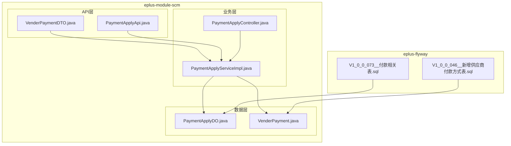
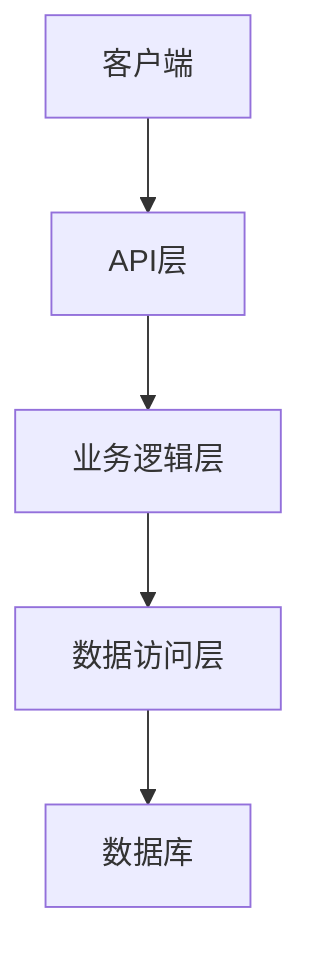
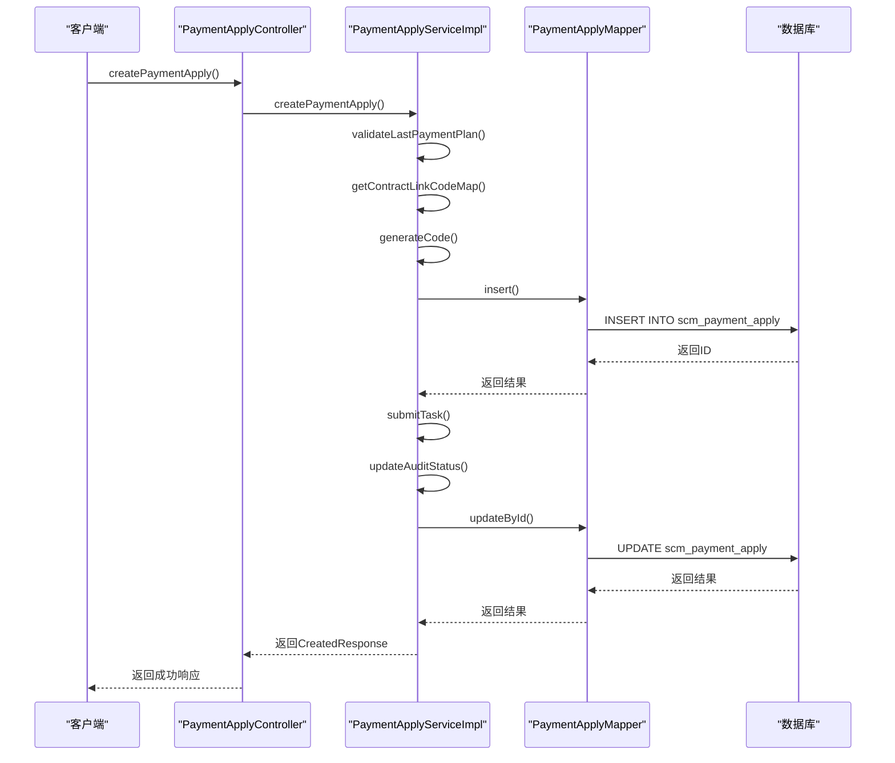

# 供应商付款

<cite>
**本文档引用文件**   
- [VenderPaymentDTO.java](file://eplus-module-scm/eplus-module-scm-api/src/main/java/com/syj/eplus/module/scm/api/vender/dto/VenderPaymentDTO.java)
- [VenderPayment.java](file://eplus-module-scm/eplus-module-scm-biz/src/main/java/com/syj/eplus/module/scm/dal/dataobject/venderpayment/VenderPayment.java)
- [PaymentApplyServiceImpl.java](file://eplus-module-scm/eplus-module-scm-biz/src/main/java/com/syj/eplus/module/scm/service/paymentapply/PaymentApplyServiceImpl.java)
- [PaymentApplyApi.java](file://eplus-module-scm/eplus-module-scm-api/src/main/java/com/syj/eplus/module/scm/api/paymentapply/PaymentApplyApi.java)
- [PaymentApplyDO.java](file://eplus-module-scm/eplus-module-scm-biz/src/main/java/com/syj/eplus/module/scm/dal/dataobject/paymentapply/PaymentApplyDO.java)
- [PaymentApplyController.java](file://eplus-module-scm/eplus-module-scm-biz/src/main/java/com/syj/eplus/module/scm/controller/admin/paymentapply/PaymentApplyController.java)
- [V1_0_0_046__新增供应商付款方式表.sql](file://eplus-flyway/src/main/resources/db/migration/common/V1_0_0_046__新增供应商付款方式表.sql)
- [V1_0_0_073__付款相关表.sql](file://eplus-flyway/src/main/resources/db/migration/common/V1_0_0_073__付款相关表.sql)
- [ApplyPaymentPlan.java](file://eplus-module-scm/eplus-module-scm-biz/src/main/java/com/syj/eplus/module/scm/entity/ApplyPaymentPlan.java)
- [ApplyerPurchaseContractItem.java](file://eplus-module-scm/eplus-module-scm-biz/src/main/java/com/syj/eplus/module/scm/entity/ApplyerPurchaseContractItem.java)
- [fms_bank_registration.sql](file://eplus-flyway/src/main/resources/db/migration/common/V1_0_0_005__新建银行登记表.sql)
</cite>

## 目录
1. [引言](#引言)
2. [项目结构](#项目结构)
3. [核心组件](#核心组件)
4. [架构概述](#架构概述)
5. [详细组件分析](#详细组件分析)
6. [依赖分析](#依赖分析)
7. [性能考虑](#性能考虑)
8. [故障排除指南](#故障排除指南)
9. [结论](#结论)
10. [附录](#附录)

## 引言
本文档旨在为开发者提供供应商付款功能的全面开发参考。文档详细描述了供应商付款的处理流程、数据结构和业务规则，包括付款单的创建、核销、对账等环节的实现机制。重点介绍了付款单的字段设计、状态管理以及与应付账款的关联关系。文档还提供了供应商付款的实体关系图（ER图），展示了付款单与应付单、银行流水、合同等实体的关系。此外，文档详细说明了供应商付款的批量处理、多币种结算、手续费计算等关键功能，并包含核心SQL语句和Service层实现细节。

## 项目结构
供应商付款功能主要位于`eplus-module-scm`模块中，该模块负责供应链管理。核心功能分布在API接口、业务逻辑和数据访问层。数据库表结构定义在`eplus-flyway`模块的迁移脚本中。



**图示来源**
- [VenderPaymentDTO.java](file://eplus-module-scm/eplus-module-scm-api/src/main/java/com/syj/eplus/module/scm/api/vender/dto/VenderPaymentDTO.java)
- [PaymentApplyApi.java](file://eplus-module-scm/eplus-module-scm-api/src/main/java/com/syj/eplus/module/scm/api/paymentapply/PaymentApplyApi.java)
- [PaymentApplyServiceImpl.java](file://eplus-module-scm/eplus-module-scm-biz/src/main/java/com/syj/eplus/module/scm/service/paymentapply/PaymentApplyServiceImpl.java)
- [PaymentApplyController.java](file://eplus-module-scm/eplus-module-scm-biz/src/main/java/com/syj/eplus/module/scm/controller/admin/paymentapply/PaymentApplyController.java)
- [PaymentApplyDO.java](file://eplus-module-scm/eplus-module-scm-biz/src/main/java/com/syj/eplus/module/scm/dal/dataobject/paymentapply/PaymentApplyDO.java)
- [VenderPayment.java](file://eplus-module-scm/eplus-module-scm-biz/src/main/java/com/syj/eplus/module/scm/dal/dataobject/venderpayment/VenderPayment.java)
- [V1_0_0_046__新增供应商付款方式表.sql](file://eplus-flyway/src/main/resources/db/migration/common/V1_0_0_046__新增供应商付款方式表.sql)
- [V1_0_0_073__付款相关表.sql](file://eplus-flyway/src/main/resources/db/migration/common/V1_0_0_073__付款相关表.sql)

**章节来源**
- [VenderPaymentDTO.java](file://eplus-module-scm/eplus-module-scm-api/src/main/java/com/syj/eplus/module/scm/api/vender/dto/VenderPaymentDTO.java)
- [PaymentApplyApi.java](file://eplus-module-scm/eplus-module-scm-api/src/main/java/com/syj/eplus/module/scm/api/paymentapply/PaymentApplyApi.java)
- [PaymentApplyServiceImpl.java](file://eplus-module-scm/eplus-module-scm-biz/src/main/java/com/syj/eplus/module/scm/service/paymentapply/PaymentApplyServiceImpl.java)
- [PaymentApplyController.java](file://eplus-module-scm/eplus-module-scm-biz/src/main/java/com/syj/eplus/module/scm/controller/admin/paymentapply/PaymentApplyController.java)
- [PaymentApplyDO.java](file://eplus-module-scm/eplus-module-scm-biz/src/main/java/com/syj/eplus/module/scm/dal/dataobject/paymentapply/PaymentApplyDO.java)
- [VenderPayment.java](file://eplus-module-scm/eplus-module-scm-biz/src/main/java/com/syj/eplus/module/scm/dal/dataobject/venderpayment/VenderPayment.java)
- [V1_0_0_046__新增供应商付款方式表.sql](file://eplus-flyway/src/main/resources/db/migration/common/V1_0_0_046__新增供应商付款方式表.sql)
- [V1_0_0_073__付款相关表.sql](file://eplus-flyway/src/main/resources/db/migration/common/V1_0_0_073__付款相关表.sql)

## 核心组件
供应商付款功能的核心组件包括付款申请服务（PaymentApplyService）、供应商付款方式实体（VenderPayment）和付款申请数据对象（PaymentApplyDO）。这些组件共同实现了供应商付款的创建、核销和对账等核心业务流程。

**章节来源**
- [PaymentApplyServiceImpl.java](file://eplus-module-scm/eplus-module-scm-biz/src/main/java/com/syj/eplus/module/scm/service/paymentapply/PaymentApplyServiceImpl.java)
- [VenderPayment.java](file://eplus-module-scm/eplus-module-scm-biz/src/main/java/com/syj/eplus/module/scm/dal/dataobject/venderpayment/VenderPayment.java)
- [PaymentApplyDO.java](file://eplus-module-scm/eplus-module-scm-biz/src/main/java/com/syj/eplus/module/scm/dal/dataobject/paymentapply/PaymentApplyDO.java)

## 架构概述
供应商付款功能采用典型的分层架构，包括API层、业务逻辑层和数据访问层。API层提供外部接口，业务逻辑层处理核心业务规则，数据访问层负责与数据库交互。



**图示来源**
- [PaymentApplyController.java](file://eplus-module-scm/eplus-module-scm-biz/src/main/java/com/syj/eplus/module/scm/controller/admin/paymentapply/PaymentApplyController.java)
- [PaymentApplyServiceImpl.java](file://eplus-module-scm/eplus-module-scm-biz/src/main/java/com/syj/eplus/module/scm/service/paymentapply/PaymentApplyServiceImpl.java)
- [PaymentApplyDO.java](file://eplus-module-scm/eplus-module-scm-biz/src/main/java/com/syj/eplus/module/scm/dal/dataobject/paymentapply/PaymentApplyDO.java)
- [V1_0_0_073__付款相关表.sql](file://eplus-flyway/src/main/resources/db/migration/common/V1_0_0_073__付款相关表.sql)

## 详细组件分析

### 付款申请服务分析
付款申请服务（PaymentApplyServiceImpl）是供应商付款功能的核心，负责处理付款申请的创建、更新、删除和审核等操作。

#### 对象关系图

```mermaid
classDiagram
class PaymentApplyDO {
+Long id
+String code
+Long companyId
+String companyName
+UserDept applyer
+LocalDateTime applyDate
+Integer printFlag
+Integer step
+BigDecimal applyTotalAmount
+BigDecimal goodsTotalAmount
+LocalDateTime applyPaymentDate
+String remark
+Long venderId
+String venderCode
+String venderName
+String currency
+Long paymentId
+String paymentName
+BigDecimal taxRate
+String bankAccount
+String bank
+String processInstanceId
+String paymentPlan
+Integer auditStatus
+ApplyPaymentPlan[] applyPaymentPlanList
+ApplyerPurchaseContractItem[] applyerPurchaseItemList
+PurchaseAddSubTerm[] purchaseAddSubTermList
+String[] purchaseContractCodeList
+LocalDateTime paymentDate
+UserDept paymentUser
+Integer paymentStatus
+BigDecimal realPaymentAmount
+String venderBankAccount
+String venderBank
+String venderBankPoc
+String[] linkCodeList
+UserDept[] purchaseUserList
+Integer paymentMarkType
+SimpleFile[] annex
+Integer acceptanceDays
+Integer paymentMethod
+JsonAmount subAddTotalAmount
+LocalDateTime cancelTime
+String cancelReason
+UserDept cancelUser
}
class ApplyPaymentPlan {
+Long id
+String contractCode
+Integer step
+Integer paymentMethod
+Integer dateType
+LocalDateTime startDate
+Integer days
+LocalDateTime expectedReceiptDate
+BigDecimal paymentRatio
+JsonAmount receivableAmount
+JsonAmount receivedAmount
+JsonAmount appliedAmount
+Integer controlPurchaseFlag
+Integer exeStatus
+Integer changeFlag
+BigDecimal goodsApplyAmount
+BigDecimal applyAmount
+BigDecimal realPaymentRatio
+String paymentName
+Integer controlInvoiceFlag
}
class ApplyerPurchaseContractItem {
+Long id
+Integer ver
+Integer sortNum
+Long skuId
+String skuCode
+Long custId
+String custCode
+String cskuCode
+Integer quantity
+Long venderId
+String venderCode
+LocalDateTime planArriveDate
+Integer checkStatus
+Integer checkedQuantity
+Integer receiveStatus
+Integer receivedQuantity
+Integer exchangeQuantity
+Integer returnQuantity
+Long purchaseContractId
+String purchaseContractCode
+Integer qtyPerInnerbox
+Integer qtyPerOuterbox
+BigDecimal packageLength
+Integer syncQuoteFlag
+BigDecimal packageWidth
+BigDecimal packageHeight
+Integer packageUnit
+JsonWeight singleGrossweight
+JsonAmount packagingPrice
+JsonAmount shippingPrice
+JsonAmount unitPrice
+JsonAmount totalPrice
+JsonAmount withTaxPrice
+BigDecimal taxRate
+Integer purchaseType
+Long purchaseUserId
+String purchaseUserName
+Long purchaseUserDeptId
+String purchaseUserDeptName
+String venderProdCode
+LocalDateTime quoteDate
+Integer freightFlag
+Integer packageFlag
+Long[] packageType
+String currency
+Integer faxFlag
+Integer moq
+Integer boxCount
+Integer warehousingType
+String wmsIds
+String wmsNames
+Integer freeFlag
+Integer delivery
+String purchaseUrl
+String remark
+Integer auxiliarySkuFlag
+Integer auxiliarySkuType
+String specRemark
+SimpleFile[] annex
+String auxiliarySaleContractCode
+String auxiliaryPurchaseContractCode
+Long auxiliarySkuId
+String auxiliarySkuCode
+String auxiliaryCskuCode
+JsonAmount checkCost
+String skuUnit
+Integer ownBrandFlag
+Integer custProFlag
+JsonAmount packageCost
+Long saleContractItemId
+Integer invoiceStatus
+Integer invoicedQuantity
+String invoicedCurrency
+BigDecimal invoicedAmount
+BigDecimal paymentAmount
+Integer changeFlag
+BigDecimal appliedAmount
+BigDecimal applyAmount
+BigDecimal realApplyAmount
+String saleContractCode
+String skuName
+Integer handleFlag
+LocalDateTime inspectionTime
+JsonSpecificationEntity[] specificationList
+Integer splitBoxFlag
+LocalDateTime estDepartureTime
+Integer billStatus
}
class VenderPayment {
+Long id
+Long paymentId
+Long venderId
+Integer defaultFlag
}
PaymentApplyDO --> ApplyPaymentPlan : "包含"
PaymentApplyDO --> ApplyerPurchaseContractItem : "包含"
PaymentApplyDO --> VenderPayment : "关联"
```


**图示来源**
- [PaymentApplyDO.java](file://eplus-module-scm/eplus-module-scm-biz/src/main/java/com/syj/eplus/module/scm/dal/dataobject/paymentapply/PaymentApplyDO.java)
- [ApplyPaymentPlan.java](file://eplus-module-scm/eplus-module-scm-biz/src/main/java/com/syj/eplus/module/scm/entity/ApplyPaymentPlan.java)
- [ApplyerPurchaseContractItem.java](file://eplus-module-scm/eplus-module-scm-biz/src/main/java/com/syj/eplus/module/scm/entity/ApplyerPurchaseContractItem.java)
- [VenderPayment.java](file://eplus-module-scm/eplus-module-scm-biz/src/main/java/com/syj/eplus/module/scm/dal/dataobject/venderpayment/VenderPayment.java)

#### 付款申请流程序列图


**图示来源**
- [PaymentApplyController.java](file://eplus-module-scm/eplus-module-scm-biz/src/main/java/com/syj/eplus/module/scm/controller/admin/paymentapply/PaymentApplyController.java)
- [PaymentApplyServiceImpl.java](file://eplus-module-scm/eplus-module-scm-biz/src/main/java/com/syj/eplus/module/scm/service/paymentapply/PaymentApplyServiceImpl.java)
- [PaymentApplyMapper.java](file://eplus-module-scm/eplus-module-scm-biz/src/main/java/com/syj/eplus/module/scm/dal/mysql/paymentapply/PaymentApplyMapper.java)
- [V1_0_0_073__付款相关表.sql](file://eplus-flyway/src/main/resources/db/migration/common/V1_0_0_073__付款相关表.sql)

**章节来源**
- [PaymentApplyController.java](file://eplus-module-scm/eplus-module-scm-biz/src/main/java/com/syj/eplus/module/scm/controller/admin/paymentapply/PaymentApplyController.java)
- [PaymentApplyServiceImpl.java](file://eplus-module-scm/eplus-module-scm-biz/src/main/java/com/syj/eplus/module/scm/service/paymentapply/PaymentApplyServiceImpl.java)
- [PaymentApplyMapper.java](file://eplus-module-scm/eplus-module-scm-biz/src/main/java/com/syj/eplus/module/scm/dal/mysql/paymentapply/PaymentApplyMapper.java)
- [V1_0_0_073__付款相关表.sql](file://eplus-flyway/src/main/resources/db/migration/common/V1_0_0_073__付款相关表.sql)

### 供应商付款方式分析
供应商付款方式功能管理供应商的付款信息，包括付款方式、银行账户等。

#### 供应商付款方式实体关系图

```mermaid
erDiagram
VENDER_PAYMENT {
bigint id PK
bigint payment_id FK
bigint vender_id FK
bigint default_flag
int creator
datetime create_time
int updater
datetime update_time
tinyint deleted
}
PAYMENT_APPLY {
bigint id PK
varchar code UK
bigint payment_plan_id FK
bigint company_id FK
varchar company_name
json applyer
datetime apply_date
tinyint print_flag
tinyint step
decimal apply_total_amount
decimal goods_total_amount
datetime apply_payment_date
varchar remark
bigint vender_id FK
varchar vender_code
varchar vender_name
varchar currency
bigint payment_id FK
varchar payment_name
decimal tax_rate
varchar bank_account
varchar bank
varchar process_instance_id
json payment_plan
json apply_payment_plan_list
json applyer_purchase_item_list
json add_sub_term_list
int creator
datetime create_time
int updater
datetime update_time
tinyint deleted
tinyint audit_status
json scm_payment_apply
varchar purchase_contract_code_list
}
FMS_BANK_REGISTRATION {
bigint id PK
varchar code UK
json registered_by
datetime registration_date
bigint company_id FK
varchar company_name
varchar company_title
datetime bank_posting_date
varchar bank
varchar bank_account
varchar bank_address
varchar bank_poc
varchar bank_code
varchar currency
decimal amount
varchar remark
}
VENDER_PAYMENT ||--o{ PAYMENT_APPLY : "供应商付款方式"
PAYMENT_APPLY ||--o{ FMS_BANK_REGISTRATION : "银行登记"
```


**图示来源**
- [VenderPayment.java](file://eplus-module-scm/eplus-module-scm-biz/src/main/java/com/syj/eplus/module/scm/dal/dataobject/venderpayment/VenderPayment.java)
- [PaymentApplyDO.java](file://eplus-module-scm/eplus-module-scm-biz/src/main/java/com/syj/eplus/module/scm/dal/dataobject/paymentapply/PaymentApplyDO.java)
- [fms_bank_registration.sql](file://eplus-flyway/src/main/resources/db/migration/common/V1_0_0_005__新建银行登记表.sql)

**章节来源**
- [VenderPayment.java](file://eplus-module-scm/eplus-module-scm-biz/src/main/java/com/syj/eplus/module/scm/dal/dataobject/venderpayment/VenderPayment.java)
- [PaymentApplyDO.java](file://eplus-module-scm/eplus-module-scm-biz/src/main/java/com/syj/eplus/module/scm/dal/dataobject/paymentapply/PaymentApplyDO.java)
- [fms_bank_registration.sql](file://eplus-flyway/src/main/resources/db/migration/common/V1_0_0_005__新建银行登记表.sql)

## 依赖分析
供应商付款功能依赖于多个外部服务和模块，包括流程引擎、用户管理、公司信息、字典数据等。

```mermaid
graph TD
PaymentApplyServiceImpl["PaymentApplyServiceImpl"]
BpmProcessInstanceApi["BpmProcessInstanceApi"]
CompanyApi["CompanyApi"]
AdminUserApi["AdminUserApi"]
DictDataApi["DictDataApi"]
PaymentItemApi["PaymentItemApi"]
OrderLinkApi["OrderLinkApi"]
ReportApi["ReportApi"]
SkuApi["SkuApi"]
RateApi["RateApi"]
SaleContractApi["SaleContractApi"]
ShipmentApi["ShipmentApi"]
IStockApi["IStockApi"]
PaymentApplyServiceImpl --> BpmProcessInstanceApi
PaymentApplyServiceImpl --> CompanyApi
PaymentApplyServiceImpl --> AdminUserApi
PaymentApplyServiceImpl --> DictDataApi
PaymentApplyServiceImpl --> PaymentItemApi
PaymentApplyServiceImpl --> OrderLinkApi
PaymentApplyServiceImpl --> ReportApi
PaymentApplyServiceImpl --> SkuApi
PaymentApplyServiceImpl --> RateApi
PaymentApplyServiceImpl --> SaleContractApi
PaymentApplyServiceImpl --> ShipmentApi
PaymentApplyServiceImpl --> IStockApi
```



**图示来源**
- [PaymentApplyServiceImpl.java](file://eplus-module-scm/eplus-module-scm-biz/src/main/java/com/syj/eplus/module/scm/service/paymentapply/PaymentApplyServiceImpl.java)

**章节来源**
- [PaymentApplyServiceImpl.java](file://eplus-module-scm/eplus-module-scm-biz/src/main/java/com/syj/eplus/module/scm/service/paymentapply/PaymentApplyServiceImpl.java)

## 性能考虑
供应商付款功能在设计时考虑了性能优化，包括批量操作、缓存使用和数据库索引等。建议在高并发场景下对关键接口进行压力测试，并根据实际负载调整数据库连接池大小和缓存策略。

## 故障排除指南
当遇到供应商付款功能问题时，可以按照以下步骤进行排查：
1. 检查付款申请的状态是否正确
2. 验证供应商信息是否完整
3. 确认流程实例是否正常
4. 检查数据库连接是否正常
5. 查看日志文件中的错误信息

**章节来源**
- [PaymentApplyServiceImpl.java](file://eplus-module-scm/eplus-module-scm-biz/src/main/java/com/syj/eplus/module/scm/service/paymentapply/PaymentApplyServiceImpl.java)
- [PaymentApplyController.java](file://eplus-module-scm/eplus-module-scm-biz/src/main/java/com/syj/eplus/module/scm/controller/admin/paymentapply/PaymentApplyController.java)

## 结论
供应商付款功能通过清晰的分层架构和完善的业务逻辑，实现了从付款申请创建到核销的完整流程。通过本文档提供的详细信息，开发者可以更好地理解和维护该功能。

## 附录
### 核心SQL语句
```sql
-- 创建付款申请主表
CREATE TABLE IF NOT EXISTS `scm_payment_apply` (
    `id` bigint UNSIGNED NOT NULL AUTO_INCREMENT COMMENT '主键',
    `code` varchar(20) NOT NULL DEFAULT '' COMMENT '编号',
    `company_id` bigint NULL DEFAULT NULL COMMENT '下单主体主键',
    `company_name` VARCHAR(100) NOT NULL DEFAULT '' COMMENT '下单主体',
    `applyer` json NOT NULL DEFAULT (json_object()) COMMENT '申请人id',
    `apply_date` datetime NULL DEFAULT NULL COMMENT '申请日期',
    `print_flag` TINYINT UNSIGNED NOT NULL DEFAULT 0 COMMENT '打印状态',
    `step` tinyint NULL DEFAULT NULL COMMENT '申请类型',
    `apply_total_amount` decimal(19, 6) NOT NULL DEFAULT 0 COMMENT '申请总金额',
    `goods_total_amount` decimal(19, 6) NOT NULL DEFAULT 0 COMMENT '货款总金额',
    `apply_payment_date` datetime NULL DEFAULT NULL COMMENT '申请付款日',
    `remark` varchar(500) NOT NULL DEFAULT '' COMMENT '申请备注',
    `vender_id` bigint DEFAULT NULL COMMENT '应付供应商主键',
    `vender_code` varchar(20) NOT NULL DEFAULT '' COMMENT '应付供应商编码',
    `vender_name` varchar(100) NOT NULL DEFAULT '' COMMENT '应付供应商名称',
    `currency` varchar(10) NOT NULL DEFAULT '' COMMENT '应付币种',
    `payment_id` bigint NULL DEFAULT NULL COMMENT '付款方式id',
    `payment_name` varchar(100) NULL DEFAULT NULL COMMENT '付款方式名称',
    `tax_rate` decimal(19, 6) NULL DEFAULT 0 COMMENT '税率',
    `bank_account` varchar(100) NOT NULL DEFAULT '' COMMENT '银行账号',
    `bank` varchar(100) NOT NULL DEFAULT '' COMMENT '开户行',
    `process_instance_id` varchar(64) NOT NULL DEFAULT '' COMMENT '流程实例的编号',
    `payment_plan` json NOT NULL DEFAULT (json_object()) COMMENT '流程实例状态',
    `apply_payment_plan_list` json NOT NULL DEFAULT (JSON_OBJECT()) COMMENT '付款计划信息',
    `applyer_purchase_item_list` json NOT NULL DEFAULT (JSON_OBJECT()) COMMENT '采购明细',
    `addSubTermList` json NOT NULL DEFAULT (JSON_OBJECT()) COMMENT '加减项',
    `creator` int UNSIGNED NULL DEFAULT NULL COMMENT '创建人',
    `create_time` datetime NULL DEFAULT CURRENT_TIMESTAMP COMMENT '创建时间',
    `updater` int UNSIGNED NULL DEFAULT NULL COMMENT '修改人',
    `update_time` datetime NULL DEFAULT NULL ON UPDATE CURRENT_TIMESTAMP COMMENT '修改时间',
    `deleted` tinyint(1) NOT NULL DEFAULT 0 COMMENT '删除  0：有效 1：删除',
    `audit_status` tinyint NOT NULL COMMENT '审核状态',
    PRIMARY KEY (`id`) USING BTREE
) ENGINE = InnoDB
  AUTO_INCREMENT = 1
  CHARACTER SET = utf8mb4
  COLLATE = utf8mb4_general_ci COMMENT = '付款申请主表'
  ROW_FORMAT = DYNAMIC;
```

**章节来源**
- [V1_0_0_073__付款相关表.sql](file://eplus-flyway/src/main/resources/db/migration/common/V1_0_0_073__付款相关表.sql)