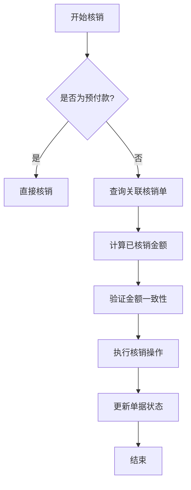
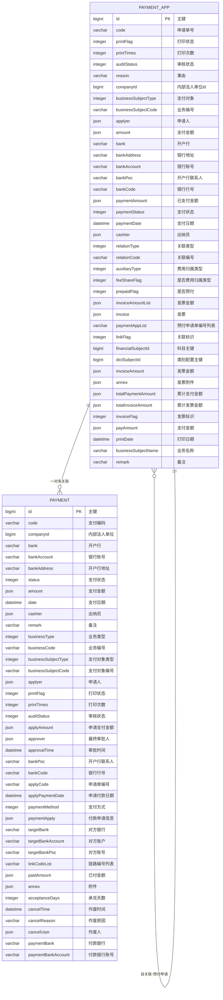
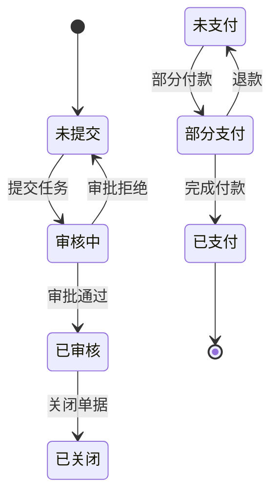
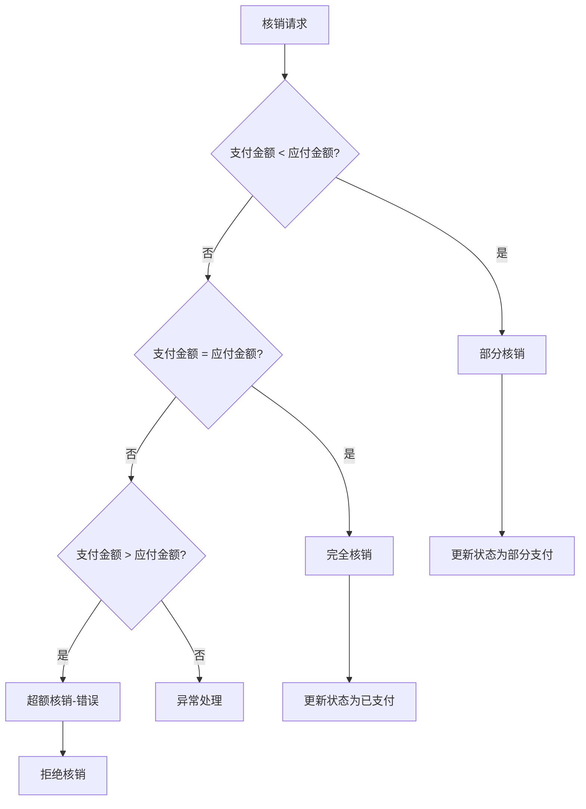
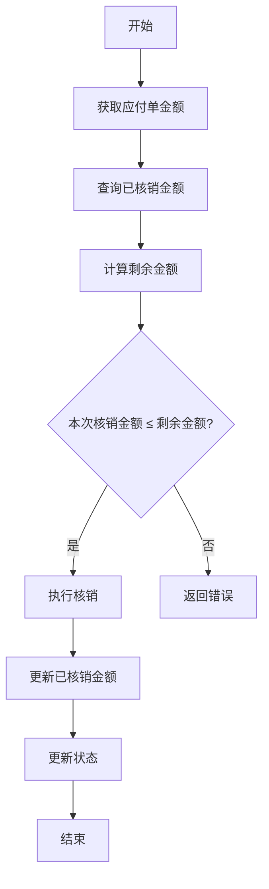

# 应付核销

<cite>
**本文档引用文件**   
- [PaymentAppServiceImpl.java](file://eplus-module-oa/eplus-module-oa-biz/src/main/java/com/syj/eplus/module/oa/service/paymentapp/PaymentAppServiceImpl.java)
- [PaymentServiceImpl.java](file://eplus-module-fms/eplus-module-fms-biz/src/main/java/com/syj/eplus/module/fms/service/payment/PaymentServiceImpl.java)
- [PaymentAppDO.java](file://eplus-module-oa/eplus-module-oa-biz/src/main/java/com/syj/eplus/module/oa/dal/dataobject/paymentapp/PaymentAppDO.java)
- [PaymentDO.java](file://eplus-module-fms/eplus-module-fms-biz/src/main/java/com/syj/eplus/module/fms/dal/dataobject/payment/PaymentDO.java)
- [V1_0_0_073__付款相关表.sql](file://eplus-flyway/src/main/resources/db/migration/common/V1_0_0_073__付款相关表.sql)
- [V1_0_0_046__新增供应商付款方式表.sql](file://eplus-flyway/src/main/resources/db/migration/common/V1_0_0_046__新增供应商付款方式表.sql)
</cite>

## 目录
1. [引言](#引言)
2. [应付核销业务逻辑](#应付核销业务逻辑)
3. [数据模型与ER图](#数据模型与er图)
4. [核销单字段设计](#核销单字段设计)
5. [状态流转机制](#状态流转机制)
6. [特殊场景处理](#特殊场景处理)
7. [核销算法实现](#核销算法实现)
8. [MyBatis配置示例](#mybatis配置示例)
9. [开发指南](#开发指南)

## 引言
应付核销是企业财务管理中的核心功能，用于处理供应商付款与相关财务单据之间的核销关系。本文档详细描述了应付核销的业务逻辑、数据模型和实现方式，重点说明了核销的匹配规则、金额分配、多对多核销等处理机制。文档还提供了核销单的字段设计、状态流转、与付款单和应付单的关联关系，并详细说明了部分核销、超额核销、预付款核销等特殊场景的处理逻辑。

**本文档引用文件**   
- [PaymentAppServiceImpl.java](file://eplus-module-oa/eplus-module-oa-biz/src/main/java/com/syj/eplus/module/oa/service/paymentapp/PaymentAppServiceImpl.java)
- [PaymentServiceImpl.java](file://eplus-module-fms/eplus-module-fms-biz/src/main/java/com/syj/eplus/module/fms/service/payment/PaymentServiceImpl.java)

## 应付核销业务逻辑

应付核销功能主要通过`PaymentAppServiceImpl`和`PaymentServiceImpl`两个核心服务类实现。核销的核心逻辑包括匹配规则、金额分配和多对多核销处理。

核销匹配规则基于业务主体类型（`businessSubjectType`）和业务主体编码（`businessSubjectCode`）进行关联。系统支持多种核销类型，包括预付（PRE_PAID）、付款（PAYMENT）和冲账（OFF_SET），通过`prepaidFlag`字段进行区分。

金额分配机制采用精确匹配原则，确保核销金额与应付金额一致。在多对多核销场景中，系统通过`paymentAppList`字段维护核销关系链，支持一个核销单关联多个应付单，或多个核销单共同核销一个应付单。

核销流程中，系统会验证付款状态、审核状态和金额一致性，确保核销操作的准确性和完整性。当核销完成后，相关单据的状态会同步更新，确保财务数据的一致性。



**图示来源**
- [PaymentAppServiceImpl.java](file://eplus-module-oa/eplus-module-oa-biz/src/main/java/com/syj/eplus/module/oa/service/paymentapp/PaymentAppServiceImpl.java#L786-L806)
- [PaymentServiceImpl.java](file://eplus-module-fms/eplus-module-fms-biz/src/main/java/com/syj/eplus/module/fms/service/payment/PaymentServiceImpl.java#L309-L329)

## 数据模型与ER图

应付核销涉及的核心数据模型包括核销单（PaymentAppDO）和付款单（PaymentDO），两者通过业务编码和业务类型进行关联。



**图示来源**
- [PaymentAppDO.java](file://eplus-module-oa/eplus-module-oa-biz/src/main/java/com/syj/eplus/module/oa/dal/dataobject/paymentapp/PaymentAppDO.java)
- [PaymentDO.java](file://eplus-module-fms/eplus-module-fms-biz/src/main/java/com/syj/eplus/module/fms/dal/dataobject/payment/PaymentDO.java)

## 核销单字段设计

核销单（PaymentAppDO）包含以下核心字段：

**基本信息**
- `id`: 主键，bigint类型
- `code`: 申请单号，varchar(64)类型
- `printFlag`: 打印状态，integer类型
- `printTimes`: 打印次数，integer类型
- `auditStatus`: 审核状态，integer类型
- `reason`: 事由，varchar(500)类型

**财务信息**
- `amount`: 支付金额，json类型，包含金额和币种
- `paymentAmount`: 已支付金额，json类型
- `paymentStatus`: 支付状态，integer类型
- `paymentDate`: 支付日期，datetime类型
- `invoiceAmountList`: 发票金额列表，json类型

**关联信息**
- `paymentAppList`: 预付申请单编号列表，varchar类型，存储关联的核销单编号
- `relationType`: 关联类型，integer类型
- `relationCode`: 关联编号，varchar类型
- `linkFlag`: 关联标识，integer类型，用于标识是否已被关联

**状态信息**
- `prepaidFlag`: 是否预付，integer类型，区分预付、付款和冲账
- `feeShareFlag`: 是否费用归属类型，integer类型
- `invoiceFlag`: 发票标识，integer类型

这些字段共同构成了核销单的完整信息模型，支持复杂的核销业务场景。

**本文档引用文件**   
- [PaymentAppDO.java](file://eplus-module-oa/eplus-module-oa-biz/src/main/java/com/syj/eplus/module/oa/dal/dataobject/paymentapp/PaymentAppDO.java)

## 状态流转机制

应付核销的状态流转机制通过`auditStatus`和`paymentStatus`两个核心字段实现，确保核销流程的完整性和可追溯性。

**审核状态流转**
审核状态（`auditStatus`）遵循以下流转路径：
- 未提交（UNSUBMITTED）→ 审核中（PROCESS）→ 已审核（APPROVE）→ 已关闭（CLOSE）

**支付状态流转**
支付状态（`paymentStatus`）的流转机制如下：
- 未支付（UNPAID）→ 部分支付（PART_PAID）→ 已支付（PAID）

状态流转通过服务层的方法调用实现，主要涉及以下关键方法：
- `submitTask`: 提交任务，将审核状态从"未提交"变为"审核中"
- `approveTask`: 审批通过，将审核状态变为"已审核"
- `confirmPayment`: 确认支付，更新支付状态
- `batchConfirmPayment`: 批量确认支付，处理多笔支付的状态更新

状态流转过程中，系统会进行严格的校验，确保状态变更的合法性。例如，在支付前必须确保单据已通过审核，在关闭单据前必须确保所有款项已支付完成。



**图示来源**
- [PaymentAppServiceImpl.java](file://eplus-module-oa/eplus-module-oa-biz/src/main/java/com/syj/eplus/module/oa/service/paymentapp/PaymentAppServiceImpl.java#L435-L446)
- [PaymentServiceImpl.java](file://eplus-module-fms/eplus-module-fms-biz/src/main/java/com/syj/eplus/module/fms/service/payment/PaymentServiceImpl.java#L393-L399)

## 特殊场景处理

应付核销系统需要处理多种特殊场景，包括部分核销、超额核销和预付款核销。

**部分核销**
部分核销指支付金额小于应付金额的情况。系统通过`paymentStatus`字段标记为"部分支付"（PART_PAID），并记录已支付金额。剩余金额可在未来进行后续核销。

**超额核销**
超额核销指支付金额大于应付金额的情况。系统会进行严格校验，通常不允许超额核销。如果发生超额支付，系统会将其视为错误并阻止核销操作。

**预付款核销**
预付款核销是特殊的核销场景，通过`prepaidFlag`字段标识。预付款可以用于核销后续的应付账款，系统会自动计算已使用的预付款金额。

**多对多核销**
系统支持复杂的多对多核销关系，通过`paymentAppList`字段维护核销链。一个核销单可以关联多个应付单，多个核销单也可以共同核销一个应付单。

**冲账处理**
冲账（OFF_SET）是一种特殊的核销类型，用于调整账务。系统会记录冲账原因和相关凭证，确保财务数据的准确性和可追溯性。

这些特殊场景的处理逻辑在`PaymentAppServiceImpl`的`getPaymentAppList`方法中实现，通过递归查询处理复杂的核销链关系。



**图示来源**
- [PaymentAppServiceImpl.java](file://eplus-module-oa/eplus-module-oa-biz/src/main/java/com/syj/eplus/module/oa/service/paymentapp/PaymentAppServiceImpl.java#L542-L563)
- [PaymentServiceImpl.java](file://eplus-module-fms/eplus-module-fms-biz/src/main/java/com/syj/eplus/module/fms/service/payment/PaymentServiceImpl.java#L393-L399)

## 核销算法实现

应付核销的核心算法实现在`PaymentAppServiceImpl`和`PaymentServiceImpl`两个服务类中，主要涉及核销金额计算、状态更新和关联处理。

**核销金额计算算法**
核销金额计算采用精确匹配原则，核心逻辑如下：
1. 获取应付单的总金额
2. 查询已核销金额（通过关联的核销单）
3. 计算剩余可核销金额
4. 验证本次核销金额不超过剩余金额



**递归核销链处理**
系统支持复杂的核销链关系，通过递归算法处理：
```java
private List<PaymentAppDO> recursionGetPaymentDO(List<PaymentAppDO> paymentAppDOList, List<PaymentAppDO> result) {
    if (CollUtil.isEmpty(paymentAppDOList)) {
        return result;
    }
    List<String> list = paymentAppDOList.stream()
        .flatMap(s -> s.getPaymentAppList().stream())
        .distinct().toList();
    if (CollUtil.isEmpty(list)) {
        return result;
    }
    List<PaymentAppDO> paymentAppList = paymentAppMapper.selectList(PaymentAppDO::getCode, list);
    result.addAll(paymentAppList);
    recursionGetPaymentDO(paymentAppList, result);
    return result;
}
```

**批量核销算法**
批量核销通过`batchConfirmPayment`方法实现，核心逻辑包括：
1. 验证所有付款单存在
2. 计算每笔付款的已付金额
3. 更新付款状态（完全支付或部分支付）
4. 回写关联单据信息

**本文档引用文件**   
- [PaymentAppServiceImpl.java](file://eplus-module-oa/eplus-module-oa-biz/src/main/java/com/syj/eplus/module/oa/service/paymentapp/PaymentAppServiceImpl.java#L542-L563)
- [PaymentServiceImpl.java](file://eplus-module-fms/eplus-module-fms-biz/src/main/java/com/syj/eplus/module/fms/service/payment/PaymentServiceImpl.java#L359-L472)

## MyBatis配置示例

应付核销功能的MyBatis配置主要涉及数据对象的类型处理器和SQL映射。

**类型处理器配置**
系统使用自定义类型处理器处理复杂数据类型：
- `JsonAmountTypeHandler`: 处理金额JSON字段
- `JsonUserDeptTypeHandler`: 处理用户部门JSON字段
- `StringListTypeHandler`: 处理字符串列表字段

```java
@TableName(value = "oa_payment_app", autoResultMap = true)
@Data
public class PaymentAppDO extends BaseDO {
    /**
     * 支付金额
     */
    @TableField(typeHandler = JsonAmountTypeHandler.class)
    private JsonAmount amount;
    
    /**
     * 申请人
     */
    @TableField(typeHandler = JsonUserDeptTypeHandler.class)
    private UserDept applyer;
    
    /**
     * 预付申请单编号列表
     */
    @TableField(typeHandler = StringListTypeHandler.class)
    private List<String> paymentAppList;
}
```

**SQL映射示例**
数据库表结构定义了核销单的核心字段：

```sql
CREATE TABLE `oa_payment_app` (
  `id` bigint NOT NULL AUTO_INCREMENT COMMENT '主键',
  `code` varchar(64) NOT NULL DEFAULT '' COMMENT '申请单号',
  `printFlag` int DEFAULT NULL COMMENT '打印状态',
  `printTimes` int DEFAULT NULL COMMENT '打印次数',
  `auditStatus` int DEFAULT NULL COMMENT '审核状态',
  `reason` varchar(500) NOT NULL DEFAULT '' COMMENT '事由',
  `companyId` bigint DEFAULT NULL COMMENT '内部法人单位id',
  `businessSubjectType` int DEFAULT NULL COMMENT '支付对象',
  `businessSubjectCode` varchar(64) NOT NULL DEFAULT '' COMMENT '业务编号',
  `applyer` json DEFAULT NULL COMMENT '申请人',
  `amount` json DEFAULT NULL COMMENT '支付金额',
  `bank` varchar(100) NOT NULL DEFAULT '' COMMENT '开户行',
  `bankAddress` varchar(255) DEFAULT NULL COMMENT '银行地址',
  `bankAccount` varchar(100) NOT NULL DEFAULT '' COMMENT '银行账号',
  `bankPoc` varchar(100) DEFAULT NULL COMMENT '开户行联系人',
  `bankCode` varchar(50) DEFAULT NULL COMMENT '银行行号',
  `paymentAmount` json DEFAULT NULL COMMENT '已支付金额',
  `paymentStatus` int DEFAULT NULL COMMENT '支付状态',
  `paymentDate` datetime DEFAULT NULL COMMENT '支付日期',
  `cashier` json DEFAULT NULL COMMENT '出纳员',
  `relationType` int DEFAULT NULL COMMENT '关联类型',
  `relationCode` json DEFAULT NULL COMMENT '关联编号',
  `auxiliaryType` int DEFAULT NULL COMMENT '费用归属类型',
  `feeShareFlag` int DEFAULT NULL COMMENT '是否费用归属类型',
  `prepaidFlag` int DEFAULT NULL COMMENT '是否预付',
  `invoiceAmountList` json DEFAULT NULL COMMENT '发票金额',
  `invoice` json DEFAULT NULL COMMENT '发票',
  `paymentAppList` json DEFAULT NULL COMMENT '预付申请单编号列表',
  `linkFlag` int DEFAULT NULL COMMENT '关联标识',
  `financialSubjectId` bigint DEFAULT NULL COMMENT '科目主键',
  `dictSubjectId` bigint DEFAULT NULL COMMENT '类别配置主键',
  PRIMARY KEY (`id`),
  UNIQUE KEY `uk_code` (`code`)
) ENGINE=InnoDB DEFAULT CHARSET=utf8mb4 COLLATE=utf8mb4_unicode_ci COMMENT='公对公申请';
```

**本文档引用文件**   
- [V1_0_0_073__付款相关表.sql](file://eplus-flyway/src/main/resources/db/migration/common/V1_0_0_073__付款相关表.sql)
- [PaymentAppDO.java](file://eplus-module-oa/eplus-module-oa-biz/src/main/java/com/syj/eplus/module/oa/dal/dataobject/paymentapp/PaymentAppDO.java)

## 开发指南

开发应付核销功能时，应遵循以下指南：

**核心服务类**
- `PaymentAppServiceImpl`: 处理核销单的创建、更新、删除和查询
- `PaymentServiceImpl`: 处理付款单的支付确认和状态更新

**关键方法**
- `createPaymentApp`: 创建核销单
- `updatePaymentApp`: 更新核销单
- `getPaymentApp`: 查询核销单详情
- `batchConfirmPayment`: 批量确认支付

**事务管理**
所有核销操作都应在事务中执行，确保数据一致性。使用`@Transactional`注解管理事务边界。

**异常处理**
系统定义了专门的错误码处理核销相关的异常：
- `PAYMENT_APP_NOT_EXISTS`: 核销单不存在
- `COMPANY_NOT_MATCH`: 公司不匹配
- `PAYMENT_CODE_EMPTY`: 付款编码为空

**性能优化**
- 使用批量操作处理多笔核销
- 缓存常用数据（如公司信息、供应商信息）
- 合理使用数据库索引

**测试要点**
- 验证核销金额计算的准确性
- 测试各种状态流转场景
- 验证多对多核销的正确性
- 测试并发核销的处理能力

**本文档引用文件**   
- [PaymentAppServiceImpl.java](file://eplus-module-oa/eplus-module-oa-biz/src/main/java/com/syj/eplus/module/oa/service/paymentapp/PaymentAppServiceImpl.java)
- [PaymentServiceImpl.java](file://eplus-module-fms/eplus-module-fms-biz/src/main/java/com/syj/eplus/module/fms/service/payment/PaymentServiceImpl.java)