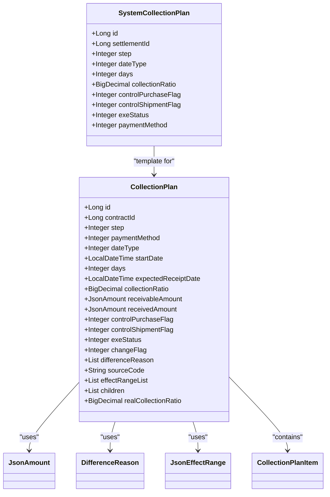
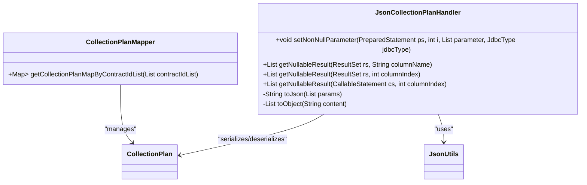
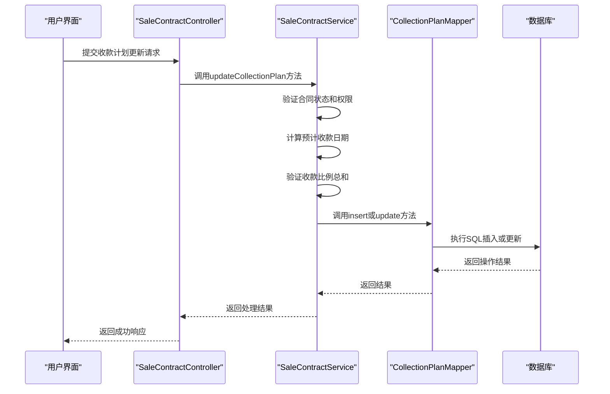
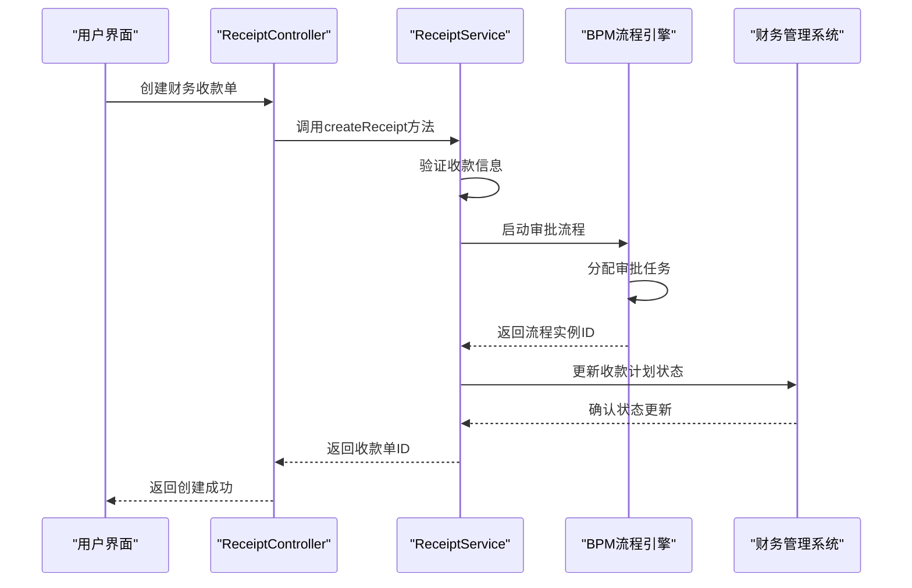
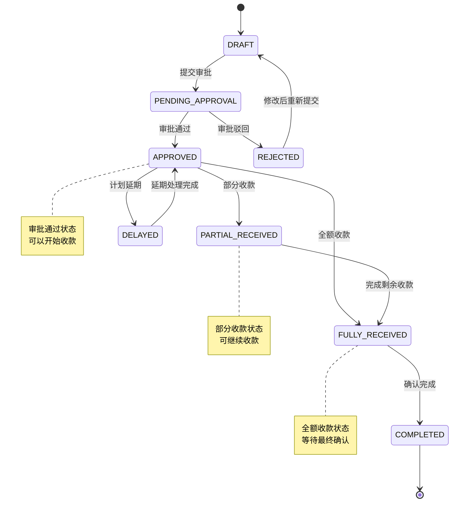
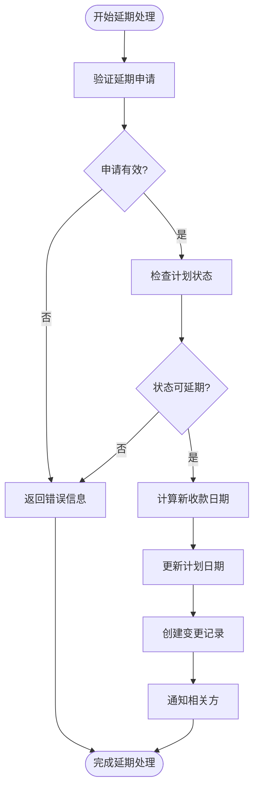
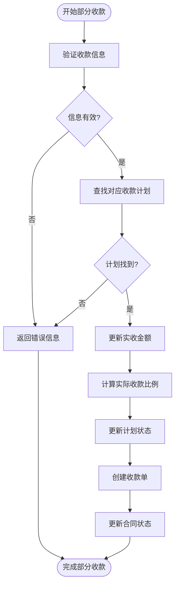
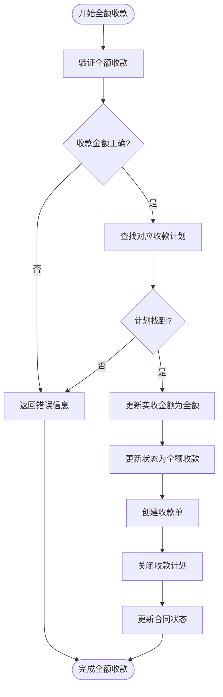

# 收款计划

<cite>
**本文档引用文件**   
- [V1_0_0_002__Eplus初始化.sql](file://eplus-flyway/src/main/resources/db/migration/common/V1_0_0_002__Eplus初始化.sql)
- [CollectionPlan.java](file://eplus-module-sms/eplus-module-sms-biz/src/main/java/com/syj/eplus/module/sms/dal/dataobject/collectionplan/CollectionPlan.java)
- [SystemCollectionPlan.java](file://eplus-module-infra/eplus-module-infra-biz/src/main/java/com/syj/eplus/module/infra/dal/dataobject/collectionplan/SystemCollectionPlan.java)
- [JsonCollectionPlanHandler.java](file://eplus-module-sms/eplus-module-sms-biz/src/main/java/com/syj/eplus/module/sms/handler/JsonCollectionPlanHandler.java)
- [UpdateCollectionPlanReq.java](file://eplus-module-sms/eplus-module-sms-biz/src/main/java/com/syj/eplus/module/sms/controller/admin/salecontract/vo/UpdateCollectionPlanReq.java)
- [ReceiptServiceImpl.java](file://eplus-module-fms/eplus-module-fms-biz/src/main/java/com/syj/eplus/module/fms/service/receipt/ReceiptServiceImpl.java)
- [ReceiptApiImpl.java](file://eplus-module-fms/eplus-module-fms-biz/src/main/java/com/syj/eplus/module/fms/api/receipt/ReceiptApiImpl.java)
- [CollectionPlanMapper.java](file://eplus-module-sms/eplus-module-sms-biz/src/main/java/com/syj/eplus/module/sms/dal/mysql/collectionplan/CollectionPlanMapper.java)
</cite>

## 目录
1. [引言](#引言)
2. [收款计划数据模型](#收款计划数据模型)
3. [核心组件分析](#核心组件分析)
4. [创建流程与审批机制](#创建流程与审批机制)
5. [状态流转与业务场景](#状态流转与业务场景)
6. [关联关系分析](#关联关系分析)
7. [ER图展示](#er图展示)
8. [SQL建表语句](#sql建表语句)
9. [MyBatis查询配置](#mybatis查询配置)
10. [最佳实践](#最佳实践)

## 引言
收款计划是企业财务管理中的核心模块，用于规划和管理客户应收款项的收取。本文档详细描述了收款计划的数据模型设计，包括计划金额、计划日期、客户信息、状态管理等字段定义。文档还解释了收款计划的创建流程、审批机制和状态流转，以及与销售合同、应收单据的关联关系。通过ER图展示收款计划表与其他相关表（如客户表、合同表）的关系，并详细说明收款计划的延期处理、部分收款、全额收款等业务场景的数据处理逻辑。

## 收款计划数据模型
收款计划数据模型主要包含两个核心表：`sms_collection_plan`（销售合同收款计划）和`system_collection_plan`（系统收款计划模板）。这两个表共同构成了完整的收款计划体系。

### 计划金额与日期字段
收款计划表中的金额和日期字段是核心数据，用于精确规划收款时间和金额。

**计划金额字段**
- `receivable_amount`：应收金额，使用JSON格式存储，包含金额数值和币种信息
- `received_amount`：实收金额，使用JSON格式存储，记录实际收到的金额
- `collection_ratio`：收款比例，decimal类型，表示该计划的收款占合同总额的比例
- `real_collection_ratio`：实际收款比例，decimal类型，记录实际收款与应收金额的比例

**计划日期字段**
- `start_date`：起始日，datetime类型，表示收款计划的起始日期
- `days`：天数，int类型，表示从起始日到预计收款日的天数
- `expected_receipt_date`：预计收款日，datetime类型，根据起始日和天数计算得出

### 客户信息与状态管理字段
客户信息和状态管理字段用于跟踪收款计划的执行情况和控制业务流程。

**客户信息相关字段**
- `contract_id`：合同id，bigint类型，关联销售合同主键
- `payment_method`：支付方式，tinyint类型，表示收款的支付方式
- `date_type`：起始点，tinyint类型，表示起始日的计算基准

**状态管理字段**
- `exe_status`：状态，tinyint类型，表示收款计划的执行状态
- `control_purchase_flag`：是否控制采购，tinyint类型，用于控制采购流程
- `control_shipment_flag`：是否控制出运，int类型，用于控制出运流程
- `creator`：创建人，int UNSIGNED类型，记录创建该计划的用户ID
- `create_time`：创建时间，datetime类型，记录计划创建的时间戳

**Section sources**
- [V1_0_0_002__Eplus初始化.sql](file://eplus-flyway/src/main/resources/db/migration/common/V1_0_0_002__Eplus初始化.sql#L2712-L2728)
- [CollectionPlan.java](file://eplus-module-sms/eplus-module-sms-biz/src/main/java/com/syj/eplus/module/sms/dal/dataobject/collectionplan/CollectionPlan.java#L50-L158)

## 核心组件分析
收款计划功能的核心组件包括数据对象、数据访问层、业务服务层和控制器层，这些组件协同工作以实现完整的收款计划管理功能。

### 数据对象组件
数据对象组件定义了收款计划的核心数据结构和属性。



**Diagram sources**
- [CollectionPlan.java](file://eplus-module-sms/eplus-module-sms-biz/src/main/java/com/syj/eplus/module/sms/dal/dataobject/collectionplan/CollectionPlan.java#L36-L159)
- [SystemCollectionPlan.java](file://eplus-module-infra/eplus-module-infra-biz/src/main/java/com/syj/eplus/module/infra/dal/dataobject/collectionplan/SystemCollectionPlan.java#L17-L76)

### 数据访问层组件
数据访问层组件负责与数据库交互，提供对收款计划数据的增删改查操作。



**Diagram sources**
- [CollectionPlanMapper.java](file://eplus-module-sms/eplus-module-sms-biz/src/main/java/com/syj/eplus/module/sms/dal/mysql/collectionplan/CollectionPlanMapper.java#L18-L34)
- [JsonCollectionPlanHandler.java](file://eplus-module-sms/eplus-module-sms-biz/src/main/java/com/syj/eplus/module/sms/handler/JsonCollectionPlanHandler.java#L23-L69)

**Section sources**
- [CollectionPlanMapper.java](file://eplus-module-sms/eplus-module-sms-biz/src/main/java/com/syj/eplus/module/sms/dal/mysql/collectionplan/CollectionPlanMapper.java#L1-L34)
- [JsonCollectionPlanHandler.java](file://eplus-module-sms/eplus-module-sms-biz/src/main/java/com/syj/eplus/module/sms/handler/JsonCollectionPlanHandler.java#L1-L69)

## 创建流程与审批机制
收款计划的创建流程和审批机制是确保财务数据准确性和业务合规性的关键环节。

### 创建流程
收款计划的创建流程主要通过销售合同模块触发，具体流程如下：



**Diagram sources**
- [UpdateCollectionPlanReq.java](file://eplus-module-sms/eplus-module-sms-biz/src/main/java/com/syj/eplus/module/sms/controller/admin/salecontract/vo/UpdateCollectionPlanReq.java#L1-L12)
- [CollectionPlan.java](file://eplus-module-sms/eplus-module-sms-biz/src/main/java/com/syj/eplus/module/sms/dal/dataobject/collectionplan/CollectionPlan.java#L45-L159)

### 审批机制
收款计划的审批机制通过与财务模块的集成实现，确保收款计划的变更经过适当的审批流程。



**Diagram sources**
- [ReceiptServiceImpl.java](file://eplus-module-fms/eplus-module-fms-biz/src/main/java/com/syj/eplus/module/fms/service/receipt/ReceiptServiceImpl.java#L85-L97)
- [ReceiptApiImpl.java](file://eplus-module-fms/eplus-module-fms-biz/src/main/java/com/syj/eplus/module/fms/api/receipt/ReceiptApiImpl.java#L24-L31)

**Section sources**
- [ReceiptServiceImpl.java](file://eplus-module-fms/eplus-module-fms-biz/src/main/java/com/syj/eplus/module/fms/service/receipt/ReceiptServiceImpl.java#L58-L107)
- [ReceiptApiImpl.java](file://eplus-module-fms/eplus-module-fms-biz/src/main/java/com/syj/eplus/module/fms/api/receipt/ReceiptApiImpl.java#L1-L37)

## 状态流转与业务场景
收款计划的状态流转和业务场景处理是确保财务流程顺畅运行的关键。

### 状态流转
收款计划的状态流转图展示了计划从创建到完成的完整生命周期。



**Diagram sources**
- [CollectionPlan.java](file://eplus-module-sms/eplus-module-sms-biz/src/main/java/com/syj/eplus/module/sms/dal/dataobject/collectionplan/CollectionPlan.java#L126-L127)
- [SystemCollectionPlan.java](file://eplus-module-infra/eplus-module-infra-biz/src/main/java/com/syj/eplus/module/infra/dal/dataobject/collectionplan/SystemCollectionPlan.java#L68-L69)

### 业务场景处理
不同的业务场景需要不同的数据处理逻辑，以下是主要业务场景的处理流程。

#### 延期处理
当客户无法按时付款时，需要对收款计划进行延期处理。



#### 部分收款
当客户只支付部分款项时，需要更新收款计划的实收金额。



#### 全额收款
当客户支付全部款项时，需要将收款计划标记为完成。



**Section sources**
- [CollectionPlan.java](file://eplus-module-sms/eplus-module-sms-biz/src/main/java/com/syj/eplus/module/sms/dal/dataobject/collectionplan/CollectionPlan.java#L104-L111)
- [ReceiptServiceImpl.java](file://eplus-module-fms/eplus-module-fms-biz/src/main/java/com/syj/eplus/module/fms/service/receipt/ReceiptServiceImpl.java#L85-L107)

## 关联关系分析
收款计划与其他业务实体的关联关系是理解系统整体架构的关键。

### 与销售合同的关联
收款计划与销售合同之间存在一对多的关系，一个销售合同可以有多个收款计划。

```mermaid
erDiagram
SALE_CONTRACT ||--o{ COLLECTION_PLAN : "包含"
SALE_CONTRACT {
bigint id PK
varchar(20) code
bigint cust_id FK
varchar(20) cust_code
varchar(100) cust_name
varchar(3) currency
bigint settlement_id FK
varchar(100) settlement_name
}
COLLECTION_PLAN {
bigint id PK
bigint contract_id FK
tinyint step
tinyint payment_method
tinyint date_type
datetime start_date
int days
datetime expected_receipt_date
decimal(19,6) collection_ratio
json receivable_amount
json received_amount
tinyint control_purchase_flag
tinyint exe_status
}
```

**Diagram sources**
- [V1_0_0_002__Eplus初始化.sql](file://eplus-flyway/src/main/resources/db/migration/common/V1_0_0_002__Eplus初始化.sql#L2526-L2541)
- [V1_0_0_002__Eplus初始化.sql](file://eplus-flyway/src/main/resources/db/migration/common/V1_0_0_002__Eplus初始化.sql#L2712-L2728)

### 与应收单据的关联
收款计划与财务收款单之间存在关联关系，收款计划的执行会生成相应的应收单据。

```mermaid
erDiagram
COLLECTION_PLAN ||--o{ RECEIPT : "生成"
COLLECTION_PLAN {
bigint id PK
bigint contract_id FK
decimal(19,6) collection_ratio
json receivable_amount
json received_amount
tinyint exe_status
}
RECEIPT {
bigint id PK
varchar(20) code
bigint contract_id FK
json amount
datetime receipt_date
varchar(20) creator
datetime create_time
tinyint status
}
```

**Diagram sources**
- [CollectionPlan.java](file://eplus-module-sms/eplus-module-sms-biz/src/main/java/com/syj/eplus/module/sms/dal/dataobject/collectionplan/CollectionPlan.java#L45-L159)
- [ReceiptServiceImpl.java](file://eplus-module-fms/eplus-module-fms-biz/src/main/java/com/syj/eplus/module/fms/service/receipt/ReceiptServiceImpl.java#L58-L107)

**Section sources**
- [CollectionPlan.java](file://eplus-module-sms/eplus-module-sms-biz/src/main/java/com/syj/eplus/module/sms/dal/dataobject/collectionplan/CollectionPlan.java#L50-L158)
- [ReceiptServiceImpl.java](file://eplus-module-fms/eplus-module-fms-biz/src/main/java/com/syj/eplus/module/fms/service/receipt/ReceiptServiceImpl.java#L85-L107)

## ER图展示
以下是收款计划相关表的完整ER图，展示了各表之间的关系。

```mermaid
erDiagram
CUSTOMER ||--o{ SALE_CONTRACT : "签订"
SALE_CONTRACT ||--o{ COLLECTION_PLAN : "包含"
SETTLEMENT ||--o{ SYSTEM_COLLECTION_PLAN : "定义"
SYSTEM_COLLECTION_PLAN ||--o{ COLLECTION_PLAN : "实例化"
COLLECTION_PLAN ||--o{ RECEIPT : "生成"
CUSTOMER ||--o{ RECEIPT : "支付"
CUSTOMER {
bigint id PK
varchar(10) code
varchar(100) name
varchar(20) cust_code
varchar(100) cust_name
varchar(3) currency
}
SALE_CONTRACT {
bigint id PK
varchar(20) code
bigint cust_id FK
varchar(20) cust_code
varchar(100) cust_name
varchar(3) currency
bigint settlement_id FK
varchar(100) settlement_name
}
SETTLEMENT {
bigint id PK
varchar(100) name
tinyint date_type
int duration
}
SYSTEM_COLLECTION_PLAN {
bigint id PK
bigint settlement_id FK
tinyint step
tinyint date_type
int days
decimal(19,6) collection_ratio
tinyint control_purchase_flag
tinyint control_shipment_flag
}
COLLECTION_PLAN {
bigint id PK
bigint contract_id FK
tinyint step
tinyint payment_method
tinyint date_type
datetime start_date
int days
datetime expected_receipt_date
decimal(19,6) collection_ratio
json receivable_amount
json received_amount
decimal(19,6) real_collection_ratio
tinyint control_purchase_flag
int control_shipment_flag
tinyint exe_status
}
RECEIPT {
bigint id PK
varchar(20) code
bigint contract_id FK
json amount
datetime receipt_date
varchar(20) creator
datetime create_time
tinyint status
}
```

**Diagram sources**
- [V1_0_0_002__Eplus初始化.sql](file://eplus-flyway/src/main/resources/db/migration/common/V1_0_0_002__Eplus初始化.sql#L2526-L2541)
- [V1_0_0_002__Eplus初始化.sql](file://eplus-flyway/src/main/resources/db/migration/common/V1_0_0_002__Eplus初始化.sql#L2712-L2728)
- [SystemCollectionPlan.java](file://eplus-module-infra/eplus-module-infra-biz/src/main/java/com/syj/eplus/module/infra/dal/dataobject/collectionplan/SystemCollectionPlan.java#L17-L76)

## SQL建表语句
以下是收款计划相关表的SQL建表语句，包含了完整的字段定义和约束。

```sql
-- 销售合同收款计划表
CREATE TABLE IF NOT EXISTS `sms_collection_plan`
(
    `id`                    bigint         NOT NULL AUTO_INCREMENT COMMENT '主键',
    `contract_id`           bigint         NULL     DEFAULT NULL COMMENT '合同id',
    `step`                  tinyint        NULL     DEFAULT NULL COMMENT '步骤',
    `payment_method`        tinyint        NULL     DEFAULT NULL COMMENT '支付方式',
    `date_type`             tinyint        NULL     DEFAULT NULL COMMENT '起始点',
    `start_date`            datetime       NULL     DEFAULT NULL COMMENT '起始日',
    `days`                  int            NOT NULL DEFAULT 0 COMMENT '天数',
    `expected_receipt_date` datetime       NULL     DEFAULT NULL COMMENT '预计收款日',
    `collection_ratio`      decimal(19, 6) NOT NULL DEFAULT 0 COMMENT '收款比例',
    `receivable_amount`     json           NOT NULL DEFAULT (JSON_OBJECT()) COMMENT '应收金额',
    `received_amount`       json           NOT NULL DEFAULT (JSON_OBJECT()) COMMENT '实收金额',
    `control_purchase_flag` tinyint        NOT NULL DEFAULT 0 COMMENT '是否控制采购',
    `control_shipment_flag` int            NOT NULL DEFAULT 0 COMMENT '是否控制出运',
    `exe_status`            tinyint        NOT NULL DEFAULT 0 COMMENT '状态',
    `creator`               int UNSIGNED   NULL     DEFAULT NULL COMMENT '创建人',
    `create_time`           datetime       NULL     DEFAULT CURRENT_TIMESTAMP COMMENT '创建时间',
    `updater`               int UNSIGNED   NULL     DEFAULT NULL COMMENT '修改人',
    `update_time`           datetime       NULL     DEFAULT NULL ON UPDATE CURRENT_TIMESTAMP COMMENT '修改时间',
    `deleted`               tinyint(1)     NOT NULL DEFAULT 0 COMMENT '删除',
    PRIMARY KEY (`id`) USING BTREE
) ENGINE = InnoDB
  AUTO_INCREMENT = 1
  CHARACTER SET = utf8mb4
  COLLATE = utf8mb4_general_ci COMMENT = '销售合同收款计划'
  ROW_FORMAT = DYNAMIC;
```

```sql
-- 系统收款计划模板表
CREATE TABLE IF NOT EXISTS `system_collection_plan`
(
    `id`                    bigint         NOT NULL AUTO_INCREMENT COMMENT '主键',
    `settlement_id`         bigint         NULL     DEFAULT NULL COMMENT '收款方式主键',
    `step`                  tinyint        NULL     DEFAULT NULL COMMENT '步骤',
    `payment_method`        tinyint        NULL     DEFAULT NULL COMMENT '支付方式',
    `date_type`             tinyint        NULL     DEFAULT NULL COMMENT '起始点',
    `days`                  int            NOT NULL DEFAULT 0 COMMENT '天数',
    `collection_ratio`      decimal(19, 6) NOT NULL DEFAULT 0 COMMENT '收款比例',
    `control_purchase_flag` tinyint        NOT NULL DEFAULT 0 COMMENT '是否控制采购',
    `control_shipment_flag` int            NOT NULL DEFAULT 0 COMMENT '是否控制出运',
    `exe_status`            tinyint        NOT NULL DEFAULT 0 COMMENT '状态',
    `creator`               int UNSIGNED   NULL     DEFAULT NULL COMMENT '创建人',
    `create_time`           datetime       NULL     DEFAULT CURRENT_TIMESTAMP COMMENT '创建时间',
    `updater`               int UNSIGNED   NULL     DEFAULT NULL COMMENT '修改人',
    `update_time`           datetime       NULL     DEFAULT NULL ON UPDATE CURRENT_TIMESTAMP COMMENT '修改时间',
    `deleted`               tinyint(1)     NOT NULL DEFAULT 0 COMMENT '删除',
    PRIMARY KEY (`id`) USING BTREE
) ENGINE = InnoDB
  AUTO_INCREMENT = 1
  CHARACTER SET = utf8mb4
  COLLATE = utf8mb4_general_ci COMMENT = '系统收款计划'
  ROW_FORMAT = DYNAMIC;
```

**Section sources**
- [V1_0_0_002__Eplus初始化.sql](file://eplus-flyway/src/main/resources/db/migration/common/V1_0_0_002__Eplus初始化.sql#L2712-L2728)

## MyBatis查询配置
以下是收款计划相关的MyBatis查询配置示例，展示了如何通过MyBatis进行数据访问。

```xml
<!-- CollectionPlanMapper.xml -->
<?xml version="1.0" encoding="UTF-8"?>
<!DOCTYPE mapper PUBLIC "-//mybatis.org//DTD Mapper 3.0//EN" "http://mybatis.org/dtd/mybatis-3-mapper.dtd">
<mapper namespace="com.syj.eplus.module.sms.dal.mysql.collectionplan.CollectionPlanMapper">

    <!-- 根据合同ID列表查询收款计划 -->
    <select id="selectListByContractIds" resultType="com.syj.eplus.module.sms.dal.dataobject.collectionplan.CollectionPlan">
        SELECT 
            id,
            contract_id,
            step,
            payment_method,
            date_type,
            start_date,
            days,
            expected_receipt_date,
            collection_ratio,
            receivable_amount,
            received_amount,
            control_purchase_flag,
            control_shipment_flag,
            exe_status,
            creator,
            create_time,
            updater,
            update_time
        FROM sms_collection_plan 
        WHERE contract_id IN 
        <foreach item="contractId" collection="contractIdList" open="(" separator="," close=")">
            #{contractId}
        </foreach>
        AND deleted = 0
        ORDER BY step
    </select>

    <!-- 插入收款计划 -->
    <insert id="insert" parameterType="com.syj.eplus.module.sms.dal.dataobject.collectionplan.CollectionPlan" useGeneratedKeys="true" keyProperty="id">
        INSERT INTO sms_collection_plan (
            contract_id,
            step,
            payment_method,
            date_type,
            start_date,
            days,
            expected_receipt_date,
            collection_ratio,
            receivable_amount,
            received_amount,
            control_purchase_flag,
            control_shipment_flag,
            exe_status,
            creator,
            create_time
        ) VALUES (
            #{contractId},
            #{step},
            #{paymentMethod},
            #{dateType},
            #{startDate},
            #{days},
            #{expectedReceiptDate},
            #{collectionRatio},
            #{receivableAmount, typeHandler=com.syj.eplus.framework.common.config.handler.JsonAmountTypeHandler},
            #{receivedAmount, typeHandler=com.syj.eplus.framework.common.config.handler.JsonAmountTypeHandler},
            #{controlPurchaseFlag},
            #{controlShipmentFlag},
            #{exeStatus},
            #{creator},
            #{createTime}
        )
    </insert>

    <!-- 更新收款计划 -->
    <update id="update" parameterType="com.syj.eplus.module.sms.dal.dataobject.collectionplan.CollectionPlan">
        UPDATE sms_collection_plan 
        SET 
            step = #{step},
            payment_method = #{paymentMethod},
            date_type = #{dateType},
            start_date = #{startDate},
            days = #{days},
            expected_receipt_date = #{expectedReceiptDate},
            collection_ratio = #{collectionRatio},
            receivable_amount = #{receivableAmount, typeHandler=com.syj.eplus.framework.common.config.handler.JsonAmountTypeHandler},
            received_amount = #{receivedAmount, typeHandler=com.syj.eplus.framework.common.config.handler.JsonAmountTypeHandler},
            control_purchase_flag = #{controlPurchaseFlag},
            control_shipment_flag = #{controlShipmentFlag},
            exe_status = #{exeStatus},
            updater = #{updater},
            update_time = NOW()
        WHERE id = #{id} AND deleted = 0
    </update>

</mapper>
```

**Section sources**
- [CollectionPlanMapper.java](file://eplus-module-sms/eplus-module-sms-biz/src/main/java/com/syj/eplus/module/sms/dal/mysql/collectionplan/CollectionPlanMapper.java#L18-L34)

## 最佳实践
以下是收款计划功能开发的最佳实践建议，帮助开发者更好地实现和维护该功能。

### 数据一致性保障
为确保数据一致性，建议采用以下实践：

1. **事务管理**：在更新收款计划和相关实体时，使用Spring的@Transactional注解确保操作的原子性
2. **数据校验**：在服务层对收款比例总和进行校验，确保所有计划的收款比例之和不超过100%
3. **并发控制**：使用乐观锁机制防止并发更新冲突，通过version字段或update_time字段实现

### 性能优化建议
为提高系统性能，建议采用以下优化措施：

1. **批量操作**：对于大量收款计划的创建或更新，使用MyBatis的批量插入功能减少数据库交互次数
2. **缓存策略**：对频繁访问的收款计划模板数据使用Redis缓存，减少数据库查询压力
3. **索引优化**：在contract_id、exe_status等常用查询字段上创建索引，提高查询效率

### 错误处理与日志
为确保系统的稳定性和可维护性，建议采用以下错误处理和日志记录实践：

1. **异常处理**：使用统一的异常处理机制，对业务异常和系统异常进行区分处理
2. **详细日志**：在关键操作点记录详细的日志信息，包括操作前后的数据状态
3. **监控告警**：对收款计划相关的关键指标设置监控和告警，及时发现和处理异常情况

**Section sources**
- [CollectionPlan.java](file://eplus-module-sms/eplus-module-sms-biz/src/main/java/com/syj/eplus/module/sms/dal/dataobject/collectionplan/CollectionPlan.java#L45-L159)
- [ReceiptServiceImpl.java](file://eplus-module-fms/eplus-module-fms-biz/src/main/java/com/syj/eplus/module/fms/service/receipt/ReceiptServiceImpl.java#L58-L107)