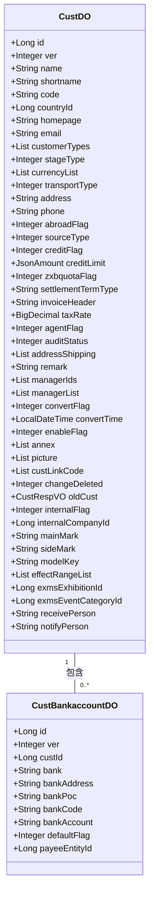
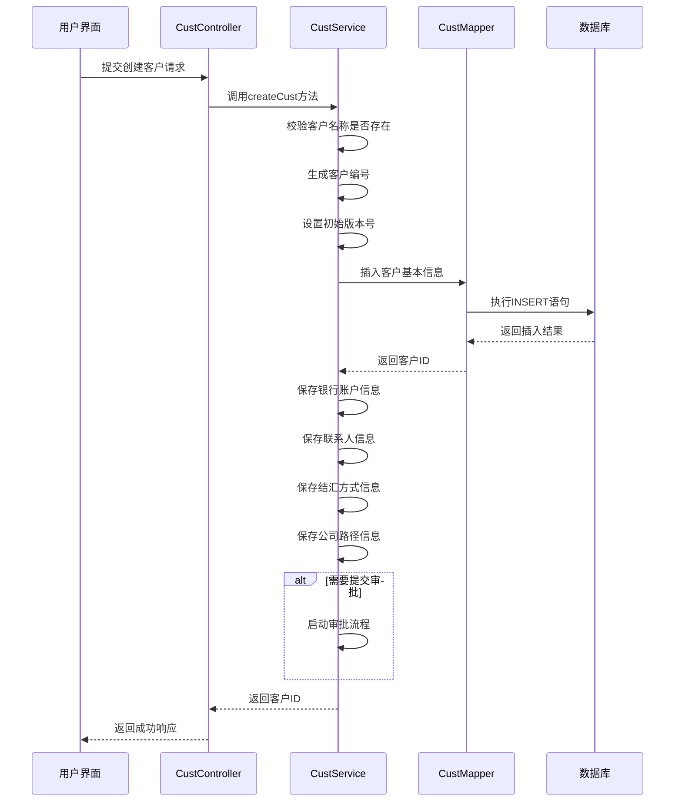
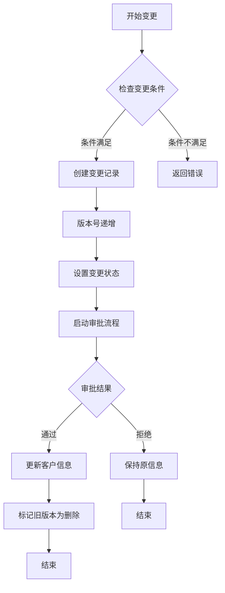
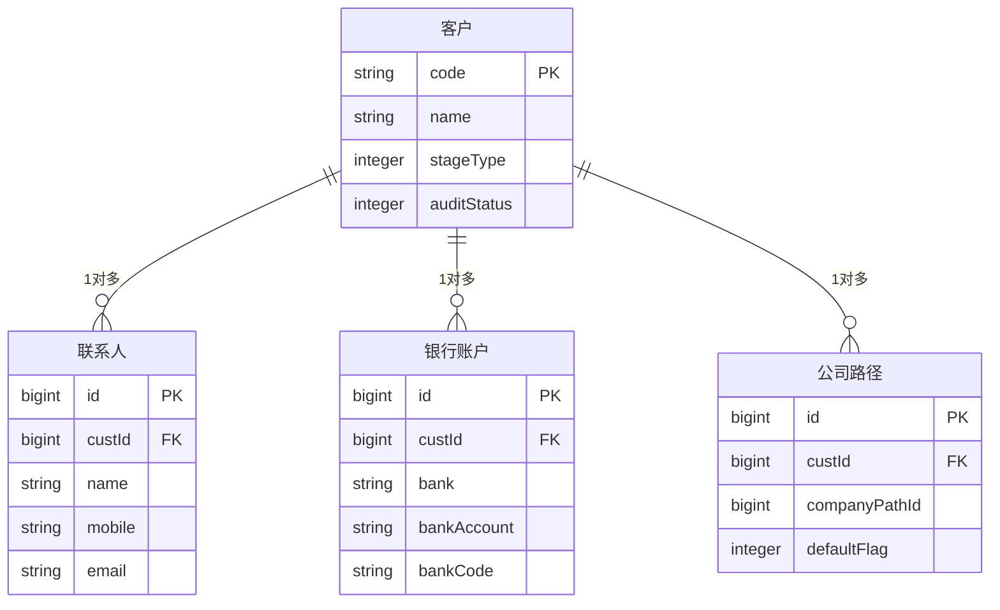
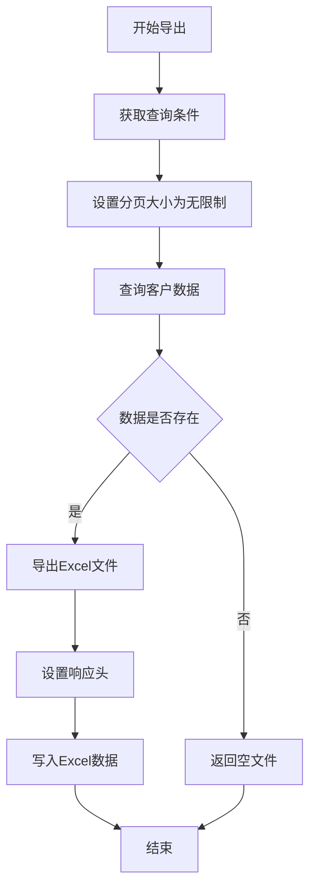

# 客户信息维护

<cite>
**本文档引用文件**   
- [CustService.java](file://eplus-module-crm/eplus-module-crm-biz/src/main/java/com/syj/eplus/module/crm/service/cust/CustService.java)
- [CustController.java](file://eplus-module-crm/eplus-module-crm-biz/src/main/java/com/syj/eplus/module/crm/controller/admin/cust/CustController.java)
- [CustDO.java](file://eplus-module-crm/eplus-module-crm-biz/src/main/java/com/syj/eplus/module/crm/dal/dataobject/cust/CustDO.java)
- [CustMapper.java](file://eplus-module-crm/eplus-module-crm-biz/src/main/java/com/syj/eplus/module/crm/dal/mysql/cust/CustMapper.java)
- [CustServiceImpl.java](file://eplus-module-crm/eplus-module-crm-biz/src/main/java/com/syj/eplus/module/crm/service/cust/CustServiceImpl.java)
- [CustInfoSaveReqVO.java](file://eplus-module-crm/eplus-module-crm-biz/src/main/java/com/syj/eplus/module/crm/controller/admin/cust/vo/CustInfoSaveReqVO.java)
- [CustBankaccountDO.java](file://eplus-module-crm/eplus-module-crm-biz/src/main/java/com/syj/eplus/module/crm/dal/dataobject/custbankaccount/CustBankaccountDO.java)
</cite>

## 目录
1. [客户信息管理概述](#客户信息管理概述)
2. [客户基本信息设计](#客户基本信息设计)
3. [客户信息操作流程](#客户信息操作流程)
4. [客户信息变更历史记录](#客户信息变更历史记录)
5. [客户信息关联关系](#客户信息关联关系)
6. [客户信息导入导出功能](#客户信息导入导出功能)
7. [客户信息界面操作指南](#客户信息界面操作指南)
8. [常见问题处理方法](#常见问题处理方法)

## 客户信息管理概述

客户信息管理是企业资源规划系统中的核心模块，负责维护客户的基本信息、联系方式、地址信息、银行账户等关键数据。该模块提供了完整的增删改查操作功能，支持客户信息的变更历史记录和关联管理。系统通过权限控制确保数据安全，同时提供导入导出功能以支持批量数据处理。

**Section sources**
- [CustController.java](file://eplus-module-crm/eplus-module-crm-biz/src/main/java/com/syj/eplus/module/crm/controller/admin/cust/CustController.java#L41-L45)

## 客户基本信息设计

客户基本信息包含多个关键字段，这些字段共同构成了完整的客户档案。主要字段包括：

### 基本信息字段
- **客户编号**：系统自动生成的唯一标识符，格式为"C"前缀加数字
- **企业名称**：客户的正式注册名称
- **简称**：客户的常用简称
- **客户阶段**：标识客户状态（潜在客户、正式客户、退休客户）
- **客户类型**：包括电商、进口商、零售商、贸易商、批发商、售后公司、邮购商等

### 联系信息字段
- **电子邮件**：客户的主要联系邮箱
- **联系电话**：客户的联系电话
- **官网**：客户的官方网站地址
- **地址**：客户的营业地址

### 财务信息字段
- **币种**：客户交易使用的币种列表
- **信用额度**：客户的信用限额
- **启用信用额度标志**：0表示不启用，1表示启用
- **开票抬头**：发票开具的抬头名称
- **税率**：适用的税率
- **价格条款**：如CIF、FOB、CIP等

### 银行账户信息
银行账户信息存储在独立的`crm_cust_bankaccount`表中，与客户主表通过`custId`关联。主要字段包括：
- **开户行**：银行名称
- **开户行地址**：银行所在地址
- **开户行联系人**：银行联系人姓名
- **银行账号**：银行账号号码
- **银行账户**：账户名称
- **是否默认账户**：0表示否，1表示是

**Diagram sources **
- [CustDO.java](file://eplus-module-crm/eplus-module-crm-biz/src/main/java/com/syj/eplus/module/crm/dal/dataobject/cust/CustDO.java#L37-L260)
- [CustBankaccountDO.java](file://eplus-module-crm/eplus-module-crm-biz/src/main/java/com/syj/eplus/module/crm/dal/dataobject/custbankaccount/CustBankaccountDO.java#L23-L68)

**Section sources**
- [CustDO.java](file://eplus-module-crm/eplus-module-crm-biz/src/main/java/com/syj/eplus/module/crm/dal/dataobject/cust/CustDO.java#L37-L260)
- [CustBankaccountDO.java](file://eplus-module-crm/eplus-module-crm-biz/src/main/java/com/syj/eplus/module/crm/dal/dataobject/custbankaccount/CustBankaccountDO.java#L23-L68)

## 客户信息操作流程

### 创建客户流程
创建客户信息的流程如下：
1. 系统校验客户名称是否已存在
2. 生成客户编号（格式为"C"前缀加数字）
3. 设置初始版本号为1
4. 插入客户基本信息到数据库
5. 同时保存关联的银行账户、联系人、结汇方式等信息
6. 根据提交标志决定是否启动审批流程

**Diagram sources **
- [CustController.java](file://eplus-module-crm/eplus-module-crm-biz/src/main/java/com/syj/eplus/module/crm/controller/admin/cust/CustController.java#L55-L67)
- [CustServiceImpl.java](file://eplus-module-crm/eplus-module-crm-biz/src/main/java/com/syj/eplus/module/crm/service/cust/CustServiceImpl.java#L284-L299)

**Section sources**
- [CustController.java](file://eplus-module-crm/eplus-module-crm-biz/src/main/java/com/syj/eplus/module/crm/controller/admin/cust/CustController.java#L55-L67)
- [CustServiceImpl.java](file://eplus-module-crm/eplus-module-crm-biz/src/main/java/com/syj/eplus/module/crm/service/cust/CustServiceImpl.java#L284-L299)

### 更新客户流程
更新客户信息的流程如下：
1. 校验客户是否存在
2. 检查客户是否处于审核中状态（不允许修改）
3. 更新客户基本信息
4. 删除原有的关联信息（银行账户、联系人等）
5. 保存新的关联信息
6. 根据提交标志决定是否启动审批流程

### 删除客户流程
删除客户信息分为两种情况：
- **普通删除**：将客户标记为已删除状态
- **管理员删除**：彻底删除客户信息

删除操作会同时清理相关的银行账户、联系人等关联数据。

## 客户信息变更历史记录

系统通过版本控制和变更状态管理来记录客户信息的变更历史。

### 变更状态字段
- **changeFlag**：是否变更标志（0-否，1-是）
- **changeStatus**：变更状态
  - 0：未变更
  - 1：变更中
- **ver**：版本号，每次变更后递增
- **changeDeleted**：变更是否删除标志

### 变更流程
1. 系统检查是否存在更高版本的客户信息
2. 验证当前客户是否已在变更中
3. 创建变更记录，版本号递增
4. 设置变更状态为"变更中"
5. 启动变更审批流程
6. 审批通过后，旧版本客户信息被标记为删除

**Diagram sources **
- [CustServiceImpl.java](file://eplus-module-crm/eplus-module-crm-biz/src/main/java/com/syj/eplus/module/crm/service/cust/CustServiceImpl.java#L446-L509)
- [V1_0_0_105__客户增加是否变更字段.java](file://eplus-flyway/src/main/java/db/migration/common/V1_0_0_105__客户增加是否变更字段.java#L1-L15)

**Section sources**
- [CustServiceImpl.java](file://eplus-module-crm/eplus-module-crm-biz/src/main/java/com/syj/eplus/module/crm/service/cust/CustServiceImpl.java#L446-L509)
- [V1_0_0_105__客户增加是否变更字段.java](file://eplus-flyway/src/main/java/db/migration/common/V1_0_0_105__客户增加是否变更字段.java#L1-L15)

## 客户信息关联关系

客户信息与其他实体存在多种关联关系，这些关系通过外键或JSON字段实现。

### 与联系人的关联
每个客户可以有多个联系人，存储在`crm_cust_poc`表中，通过`custId`字段与客户主表关联。

### 与供应商的关联
客户可以与供应商建立关联关系，通过`custLinkCode`字段存储关联的供应商编号列表。

### 与业务员的关联
客户与业务员的关联通过`managerIds`（用户ID列表）和`managerList`（包含用户和部门信息的JSON列表）字段实现。

### 与公司的关联
系统支持内部客户标识，通过`internalFlag`和`internalCompanyId`字段关联到具体的公司实体。

**Diagram sources **
- [CustDO.java](file://eplus-module-crm/eplus-module-crm-biz/src/main/java/com/syj/eplus/module/crm/dal/dataobject/cust/CustDO.java#L37-L260)
- [CustPocDO.java](file://eplus-module-crm/eplus-module-crm-biz/src/main/java/com/syj/eplus/module/crm/dal/dataobject/custpoc/CustPocDO.java#L22-L83)
- [CustBankaccountDO.java](file://eplus-module-crm/eplus-module-crm-biz/src/main/java/com/syj/eplus/module/crm/dal/dataobject/custbankaccount/CustBankaccountDO.java#L23-L68)

**Section sources**
- [CustDO.java](file://eplus-module-crm/eplus-module-crm-biz/src/main/java/com/syj/eplus/module/crm/dal/dataobject/cust/CustDO.java#L37-L260)
- [CustPocDO.java](file://eplus-module-crm/eplus-module-crm-biz/src/main/java/com/syj/eplus/module/crm/dal/dataobject/custpoc/CustPocDO.java#L22-L83)
- [CustBankaccountDO.java](file://eplus-module-crm/eplus-module-crm-biz/src/main/java/com/syj/eplus/module/crm/dal/dataobject/custbankaccount/CustBankaccountDO.java#L23-L68)

## 客户信息导入导出功能

### 导出功能
系统支持客户信息的Excel导出功能，主要特点包括：
- 导出所有符合条件的客户数据
- 包含客户基本信息、联系人、银行账户等完整信息
- 支持分页导出，避免内存溢出
- 导出文件格式为.xls

导出功能通过`exportCustExcel`接口实现，需要`crm:cust:export`权限。

### 导入功能
虽然代码中未直接显示导入功能的实现，但根据系统设计，导入功能应具备以下特性：
- 支持Excel格式的数据导入
- 数据校验包括：
  - 客户名称唯一性校验
  - 必填字段完整性校验
  - 数据格式正确性校验
- 支持批量导入和更新操作
- 导入过程应有错误处理和日志记录机制

**Diagram sources **
- [CustController.java](file://eplus-module-crm/eplus-module-crm-biz/src/main/java/com/syj/eplus/module/crm/controller/admin/cust/CustController.java#L149-L163)
- [CustMapper.java](file://eplus-module-crm/eplus-module-crm-biz/src/main/java/com/syj/eplus/module/crm/dal/mysql/cust/CustMapper.java#L35-L75)

**Section sources**
- [CustController.java](file://eplus-module-crm/eplus-module-crm-biz/src/main/java/com/syj/eplus/module/crm/controller/admin/cust/CustController.java#L149-L163)
- [CustMapper.java](file://eplus-module-crm/eplus-module-crm-biz/src/main/java/com/syj/eplus/module/crm/dal/mysql/cust/CustMapper.java#L35-L75)

## 客户信息界面操作指南

### 创建客户操作步骤
1. 进入客户管理界面，点击"创建"按钮
2. 填写客户基本信息，包括企业名称、简称、国家、联系方式等
3. 添加银行账户信息，指定开户行、账号、联系人等
4. 添加联系人信息，包括姓名、职位、联系方式等
5. 设置结汇方式和公司路径
6. 选择是否立即提交审批
7. 点击"保存"按钮完成创建

### 查询客户操作步骤
1. 在客户列表界面，可通过多种条件筛选：
   - 客户编号
   - 企业名称
   - 国家/地区
   - 客户阶段
   - 业务员
2. 点击"查询"按钮获取结果
3. 在结果列表中点击客户名称可查看详细信息

### 变更客户操作步骤
1. 选择需要变更的客户，点击"变更"按钮
2. 系统会复制当前客户信息到新版本
3. 修改需要变更的字段
4. 系统自动计算变更影响范围
5. 提交变更申请进行审批
6. 审批通过后，新版本信息生效，旧版本被归档

### 删除客户操作步骤
1. 选择需要删除的客户
2. 点击"删除"按钮
3. 系统会检查客户是否有关联业务数据
4. 确认删除操作
5. 客户状态被标记为已删除

## 常见问题处理方法

### 客户名称重复问题
**问题描述**：创建客户时提示名称已存在
**解决方案**：
1. 使用系统提供的"查找相似名称"功能
2. 检查是否已有相同或相似名称的客户
3. 如果是新客户，考虑使用不同的名称或添加后缀区分

### 审核中无法修改问题
**问题描述**：无法修改正在审核中的客户信息
**解决方案**：
1. 检查客户当前的审核状态
2. 如果需要修改，先取消当前的审核流程
3. 修改信息后重新提交审核

### 变更冲突问题
**问题描述**：提示"已经有高版本客户信息，无法变更"
**解决方案**：
1. 检查是否存在更高版本的变更记录
2. 如果有未完成的变更，先处理完该变更
3. 或联系管理员清理异常的变更记录

### 数据导出失败问题
**问题描述**：导出客户数据时失败或数据不完整
**解决方案**：
1. 检查查询条件是否过于宽泛导致数据量过大
2. 尝试缩小时间范围或其他筛选条件
3. 检查用户是否具有导出权限
4. 查看系统日志获取具体错误信息

### 银行账户信息不同步问题
**问题描述**：客户信息更新后，关联的合同或订单中银行账户信息未更新
**解决方案**：
1. 检查变更影响范围设置是否包含相关业务模块
2. 确认变更审批流程已完全通过
3. 手动触发数据同步机制（如有）