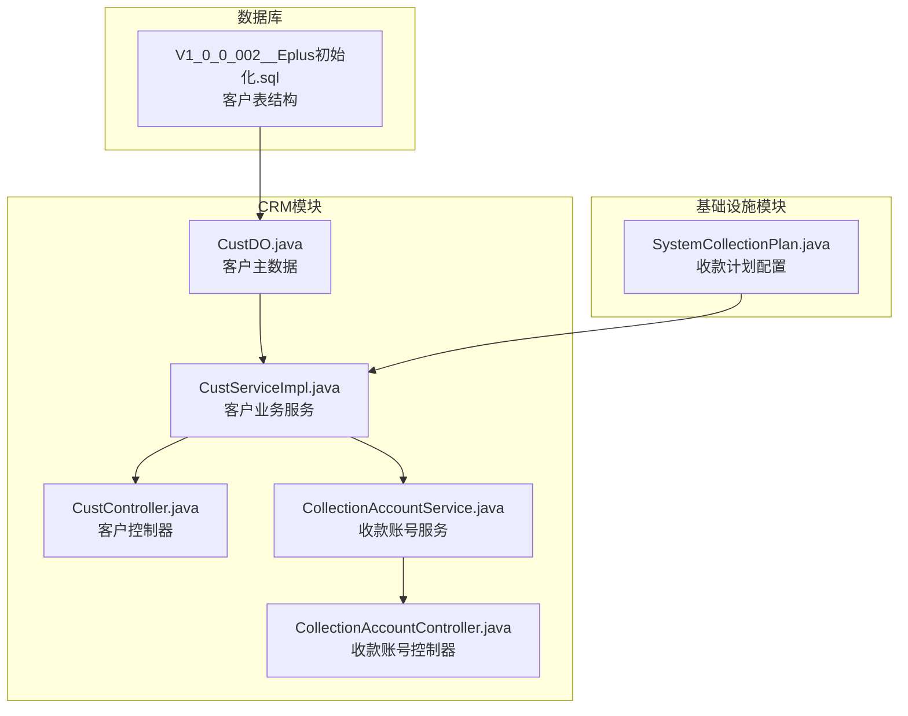
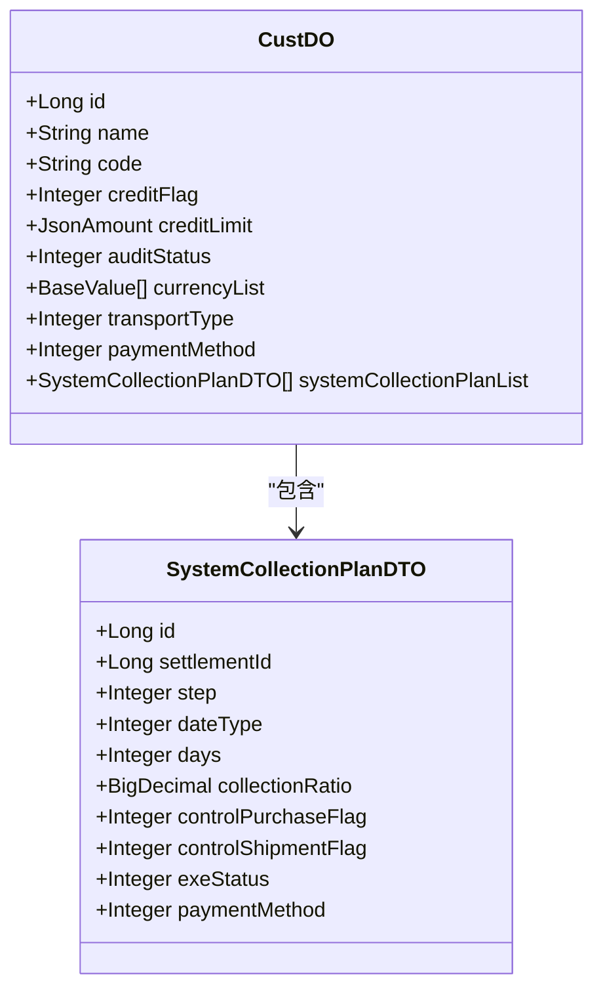
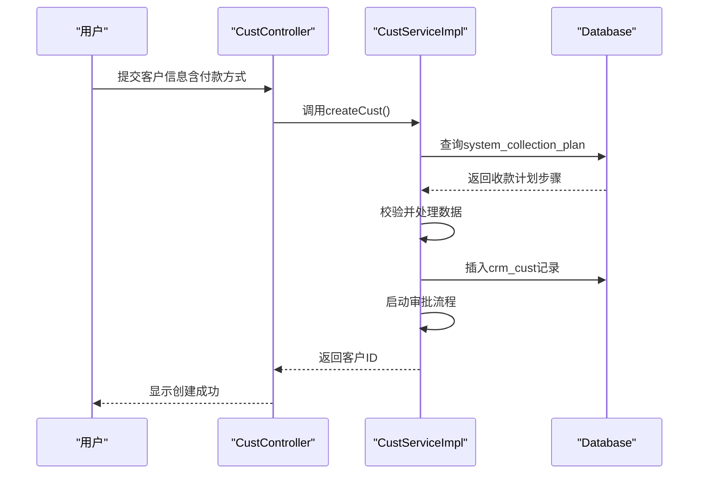

# 客户信用管理

<cite>
**本文档引用的文件**   
- [CustDO.java](file://eplus-module-crm/eplus-module-crm-biz/src/main/java/com/syj/eplus/module/crm/dal/dataobject/cust/CustDO.java)
- [CustServiceImpl.java](file://eplus-module-crm/eplus-module-crm-biz/src/main/java/com/syj/eplus/module/crm/service/cust/CustServiceImpl.java)
- [CustController.java](file://eplus-module-crm/eplus-module-crm-biz/src/main/java/com/syj/eplus/module/crm/controller/admin/cust/CustController.java)
- [CollectionAccountService.java](file://eplus-module-crm/eplus-module-crm-biz/src/main/java/com/syj/eplus/module/crm/service/collectionaccount/CollectionAccountService.java)
- [CollectionAccountController.java](file://eplus-module-crm/eplus-module-crm-biz/src/main/java/com/syj/eplus/module/crm/controller/admin/collectionaccount/CollectionAccountController.java)
- [SystemCollectionPlan.java](file://eplus-module-infra/eplus-module-infra-biz/src/main/java/com/syj/eplus/module/infra/dal/dataobject/collectionplan/SystemCollectionPlan.java)
- [SystemCollectionPlanDTO.java](file://eplus-module-crm/eplus-module-crm-api/src/main/java/com/syj/eplus/module/crm/api/cust/dto/SystemCollectionPlanDTO.java)
- [V1_0_0_002__Eplus初始化.sql](file://eplus-flyway/src/main/resources/db/migration/common/V1_0_0_002__Eplus初始化.sql)
</cite>

## 目录
1. [引言](#引言)
2. [项目结构](#项目结构)
3. [核心组件](#核心组件)
4. [信用额度与账期管理设计](#信用额度与账期管理设计)
5. [付款条件与收款计划](#付款条件与收款计划)
6. [客户信用等级评定](#客户信用等级评定)
7. [应收款项与信用风险预警](#应收款项与信用风险预警)
8. [信用管理报表查询](#信用管理报表查询)
9. [结论](#结论)

## 引言

本系统中的客户信用管理功能主要围绕客户信用额度、账期、付款条件等核心要素展开，旨在通过精细化的信用控制机制，保障企业资金安全，优化客户交易流程。系统通过在客户主数据中配置信用额度和账期，并结合收款计划、应收款项监控等模块，实现对客户信用的全生命周期管理。信用管理功能贯穿于客户创建、变更、交易执行和风险预警等多个环节，确保企业在拓展业务的同时有效控制信用风险。

## 项目结构

客户信用管理功能主要分布在CRM模块中，其核心数据结构和业务逻辑集中在`eplus-module-crm`模块。该模块包含API接口定义、业务服务实现和数据访问对象，形成了完整的MVC架构。信用管理相关的数据表通过Flyway数据库迁移脚本进行版本控制，确保了数据结构的演进与代码变更同步。此外，收款计划等共享配置信息由`eplus-module-infra`模块提供，实现了跨业务模块的数据复用。

**图源**
- [CustDO.java](file://eplus-module-crm/eplus-module-crm-biz/src/main/java/com/syj/eplus/module/crm/dal/dataobject/cust/CustDO.java)
- [CustServiceImpl.java](file://eplus-module-crm/eplus-module-crm-biz/src/main/java/com/syj/eplus/module/crm/service/cust/CustServiceImpl.java)
- [CustController.java](file://eplus-module-crm/eplus-module-crm-biz/src/main/java/com/syj/eplus/module/crm/controller/admin/cust/CustController.java)
- [CollectionAccountService.java](file://eplus-module-crm/eplus-module-crm-biz/src/main/java/com/syj/eplus/module/crm/service/collectionaccount/CollectionAccountService.java)
- [CollectionAccountController.java](file://eplus-module-crm/eplus-module-crm-biz/src/main/java/com/syj/eplus/module/crm/controller/admin/collectionaccount/CollectionAccountController.java)
- [SystemCollectionPlan.java](file://eplus-module-infra/eplus-module-infra-biz/src/main/java/com/syj/eplus/module/infra/dal/dataobject/collectionplan/SystemCollectionPlan.java)
- [V1_0_0_002__Eplus初始化.sql](file://eplus-flyway/src/main/resources/db/migration/common/V1_0_0_002__Eplus初始化.sql)

**节源**
- [CustDO.java](file://eplus-module-crm/eplus-module-crm-biz/src/main/java/com/syj/eplus/module/crm/dal/dataobject/cust/CustDO.java)
- [CustServiceImpl.java](file://eplus-module-crm/eplus-module-crm-biz/src/main/java/com/syj/eplus/module/crm/service/cust/CustServiceImpl.java)
- [CustController.java](file://eplus-module-crm/eplus-module-crm-biz/src/main/java/com/syj/eplus/module/crm/controller/admin/cust/CustController.java)
- [CollectionAccountService.java](file://eplus-module-crm/eplus-module-crm-biz/src/main/java/com/syj/eplus/module/crm/service/collectionaccount/CollectionAccountService.java)
- [CollectionAccountController.java](file://eplus-module-crm/eplus-module-crm-biz/src/main/java/com/syj/eplus/module/crm/controller/admin/collectionaccount/CollectionAccountController.java)
- [SystemCollectionPlan.java](file://eplus-module-infra/eplus-module-infra-biz/src/main/java/com/syj/eplus/module/infra/dal/dataobject/collectionplan/SystemCollectionPlan.java)
- [V1_0_0_002__Eplus初始化.sql](file://eplus-flyway/src/main/resources/db/migration/common/V1_0_0_002__Eplus初始化.sql)

## 核心组件

客户信用管理的核心组件包括客户主数据（CustDO）、客户业务服务（CustServiceImpl）和收款计划配置（SystemCollectionPlan）。客户主数据实体类定义了信用额度、账期、付款条件等关键字段，是信用管理的基石。客户业务服务负责处理客户创建、更新、变更等核心业务逻辑，并在过程中执行信用相关的校验和处理。收款计划配置则定义了不同付款条件下的具体收款步骤和比例，为信用管理提供了灵活的策略支持。

**节源**
- [CustDO.java](file://eplus-module-crm/eplus-module-crm-biz/src/main/java/com/syj/eplus/module/crm/dal/dataobject/cust/CustDO.java)
- [CustServiceImpl.java](file://eplus-module-crm/eplus-module-crm-biz/src/main/java/com/syj/eplus/module/crm/service/cust/CustServiceImpl.java)
- [SystemCollectionPlan.java](file://eplus-module-infra/eplus-module-infra-biz/src/main/java/com/syj/eplus/module/infra/dal/dataobject/collectionplan/SystemCollectionPlan.java)

## 信用额度与账期管理设计

### 信用额度字段设计

在客户主数据表`crm_cust`中，通过`credit_flag`和`credit_limit`两个字段来管理信用额度。`credit_flag`是一个布尔类型的标志位，用于指示是否为该客户启用信用额度控制（0：不启用，1：启用）。`credit_limit`字段则存储具体的信用额度值，其数据类型为`json`，允许存储包含金额和币种的复杂对象，以支持多币种信用额度管理。

### 信用额度审批与调整

当创建或更新客户信息时，如果启用了信用额度，系统会将客户资料提交至工作流进行审批。审批流程由`CustServiceImpl`中的`submitTask`方法触发，通过集成的BPM（业务流程管理）引擎实现。审批通过后，信用额度正式生效。对于信用额度的调整，系统提供了独立的变更流程。用户发起变更请求后，系统会创建一个新的变更版本，并启动变更审批流程。只有审批通过后，新的信用额度才会覆盖旧值，确保了变更过程的严谨性和可追溯性。

### 超信用额度交易控制

系统通过在交易环节（如销售合同创建、出运计划生成）进行前置校验来控制超信用额度交易。当用户尝试创建交易时，系统会查询该客户的信用额度和当前应收款项余额，计算出可用信用额度。如果交易金额超过了可用信用额度，系统将阻止交易的创建，并提示用户“超出信用额度”。这种控制策略有效地防止了因过度授信而导致的资金风险。

**图源**
- [CustDO.java](file://eplus-module-crm/eplus-module-crm-biz/src/main/java/com/syj/eplus/module/crm/dal/dataobject/cust/CustDO.java)
- [SystemCollectionPlanDTO.java](file://eplus-module-crm/eplus-module-crm-api/src/main/java/com/syj/eplus/module/crm/api/cust/dto/SystemCollectionPlanDTO.java)

**节源**
- [CustDO.java](file://eplus-module-crm/eplus-module-crm-biz/src/main/java/com/syj/eplus/module/crm/dal/dataobject/cust/CustDO.java)
- [CustServiceImpl.java](file://eplus-module-crm/eplus-module-crm-biz/src/main/java/com/syj/eplus/module/crm/service/cust/CustServiceImpl.java)
- [V1_0_0_002__Eplus初始化.sql](file://eplus-flyway/src/main/resources/db/migration/common/V1_0_0_002__Eplus初始化.sql)

## 付款条件与收款计划

### 付款条件配置

付款条件在系统中被称为“收款计划”，它定义了客户应如何分期支付货款。收款计划的配置信息存储在`system_collection_plan`表中，由`SystemCollectionPlan`实体类表示。一个收款计划可以包含多个步骤，每个步骤定义了收款的起始点（如发货日、到港日）、天数、收款比例以及是否控制采购或出运等。

### 付款计划关联与应用

在客户主数据中，通过`paymentMethod`字段关联具体的付款方式。当用户选择一个付款方式时，系统会根据该方式的ID查询`system_collection_plan`表，获取对应的收款计划步骤。这些步骤会以列表的形式展示给用户，使其清晰地了解整个付款流程。在交易执行过程中，系统会根据收款计划的规则，自动生成相应的应收款项记录，并设置预计收款日期。

### 付款条件审批流程

与信用额度类似，付款条件的设置和变更也需要经过审批流程。当用户在客户资料中修改`paymentMethod`或相关字段时，如果提交了变更，系统会启动工作流审批。审批通过后，新的付款条件才会生效。这确保了关键交易条款的变更受到严格管控。

**图源**
- [CustController.java](file://eplus-module-crm/eplus-module-crm-biz/src/main/java/com/syj/eplus/module/crm/controller/admin/cust/CustController.java)
- [CustServiceImpl.java](file://eplus-module-crm/eplus-module-crm-biz/src/main/java/com/syj/eplus/module/crm/service/cust/CustServiceImpl.java)
- [SystemCollectionPlan.java](file://eplus-module-infra/eplus-module-infra-biz/src/main/java/com/syj/eplus/module/infra/dal/dataobject/collectionplan/SystemCollectionPlan.java)

**节源**
- [CustServiceImpl.java](file://eplus-module-crm/eplus-module-crm-biz/src/main/java/com/syj/eplus/module/crm/service/cust/CustServiceImpl.java)
- [CollectionAccountService.java](file://eplus-module-crm/eplus-module-crm-biz/src/main/java/com/syj/eplus/module/crm/service/collectionaccount/CollectionAccountService.java)
- [SystemCollectionPlan.java](file://eplus-module-infra/eplus-module-infra-biz/src/main/java/com/syj/eplus/module/infra/dal/dataobject/collectionplan/SystemCollectionPlan.java)

## 客户信用等级评定

当前系统代码中未直接实现基于算法的客户信用等级自动评定功能。信用等级的管理更多地体现在客户阶段（`stageType`）上，如“潜在客户”、“正式客户”、“退休客户”等。这些阶段由`CustomerStageEnum`枚举定义，主要反映客户生命周期的不同状态，而非严格的信用评分。

信用风险的评估和控制主要通过以下方式间接实现：
1.  **信用额度**：直接设定客户的最高赊销金额。
2.  **账期**：通过收款计划中的天数（`days`）字段控制回款周期。
3.  **付款条件**：通过收款计划的步骤和比例控制回款节奏。
4.  **审批流程**：对高风险客户或大额信用额度的设置进行人工审批。

系统通过这些硬性控制措施来管理信用风险，而不是依赖一个动态的信用评分模型。未来如需实现动态信用等级评定，可以在`CustDO`中增加一个`creditRating`字段，并开发相应的评分引擎服务。

**节源**
- [CustDO.java](file://eplus-module-crm/eplus-module-crm-biz/src/main/java/com/syj/eplus/module/crm/dal/dataobject/cust/CustDO.java)
- [CustServiceImpl.java](file://eplus-module-crm/eplus-module-crm-biz/src/main/java/com/syj/eplus/module/crm/service/cust/CustServiceImpl.java)
- [CustomerStageEnum.java](file://eplus-module-crm/eplus-module-crm-api/src/main/java/com/syj/eplus/module/crm/enums/cust/CustomerStageEnum.java)

## 应收款项与信用风险预警

### 应收款项与信用管理的关联

系统的应收款项管理与信用管理紧密关联。当销售合同或出运单据生成后，系统会根据关联的收款计划（`systemCollectionPlanList`）自动生成多笔应收款项（Receivable），每笔款项对应收款计划中的一个步骤。应收款项的总金额和到期日直接决定了客户的当前信用占用情况。

在`CustServiceImpl`中，虽然没有直接计算可用信用额度的方法，但其`getCust`等方法会加载完整的客户信息，包括收款计划。上层应用（如订单系统）在创建交易前，会调用这些服务获取客户信息，并结合应收款项模块的数据，计算出客户的可用信用额度。

### 信用风险预警机制

系统通过以下机制实现信用风险预警：
1.  **交易拦截**：在创建新交易时，系统会进行信用额度校验。如果交易金额加上现有应收款项总额超过信用额度，交易将被阻止。
2.  **账期监控**：系统会监控应收款项的到期日。对于即将到期或已逾期的款项，可以通过定时任务或消息通知提醒相关业务员。
3.  **审批控制**：对于信用额度接近上限或存在逾期记录的客户，其新的交易或信用额度调整请求可能会被路由到更高级别的审批人。

虽然代码中未发现专门的“预警”服务，但这些控制逻辑内嵌在业务流程中，构成了一个被动的预警系统。未来可以在此基础上开发主动的预警功能，例如通过定时任务扫描高风险客户并发送邮件或消息通知。

**节源**
- [CustServiceImpl.java](file://eplus-module-crm/eplus-module-crm-biz/src/main/java/com/syj/eplus/module/crm/service/cust/CustServiceImpl.java)
- [CollectionAccountService.java](file://eplus-module-crm/eplus-module-crm-biz/src/main/java/com/syj/eplus/module/crm/service/collectionaccount/CollectionAccountService.java)

## 信用管理报表查询

系统提供了基础的客户信息查询和导出功能，可以作为信用管理报表的基础。通过`CustController`中的`getCustPage`和`exportCustExcel`接口，用户可以分页查询客户列表，并将结果导出为Excel文件。导出的报表包含客户名称、编号、信用额度、账期、付款方式等关键信息。

此外，`CollectionAccountController`提供了收款账号的查询和导出功能，可以生成与客户信用相关的银行信息报表。虽然目前没有专门的“信用风险分析”或“超额度交易统计”等高级报表，但现有的数据导出功能为后续的报表开发提供了数据基础。用户可以将导出的数据导入BI工具进行更深入的分析。

**节源**
- [CustController.java](file://eplus-module-crm/eplus-module-crm-biz/src/main/java/com/syj/eplus/module/crm/controller/admin/cust/CustController.java)
- [CollectionAccountController.java](file://eplus-module-crm/eplus-module-crm-biz/src/main/java/com/syj/eplus/module/crm/controller/admin/collectionaccount/CollectionAccountController.java)

## 结论

综上所述，该系统的客户信用管理功能设计以客户主数据为核心，通过`credit_flag`和`credit_limit`字段实现信用额度的启用与配置，并结合收款计划（`system_collection_plan`）来管理账期和付款条件。所有关键信用参数的变更都需经过工作流审批，确保了操作的合规性。系统通过在交易环节进行信用额度校验来控制超限交易，有效防范了资金风险。尽管目前缺乏动态的信用等级评定模型，但通过额度、账期和审批的组合控制，已构建了一个稳健的信用管理体系。未来可在此基础上，增加更智能的信用评分和主动预警功能，以进一步提升风险管理能力。