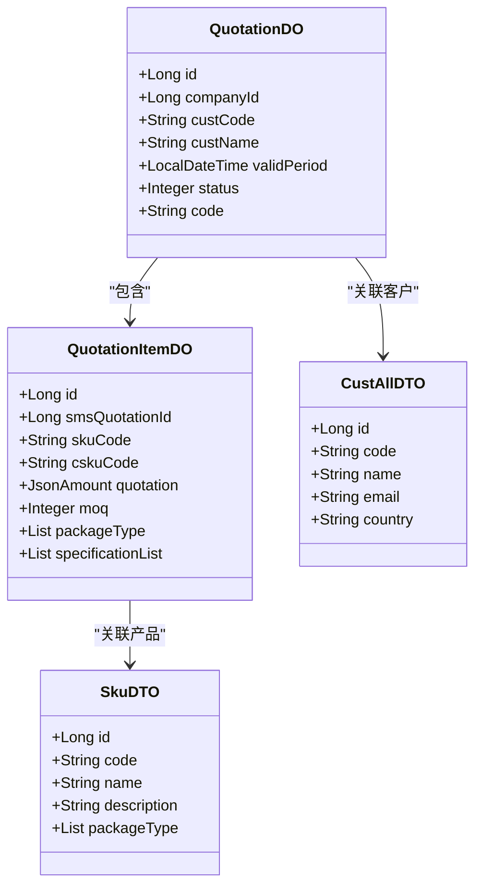
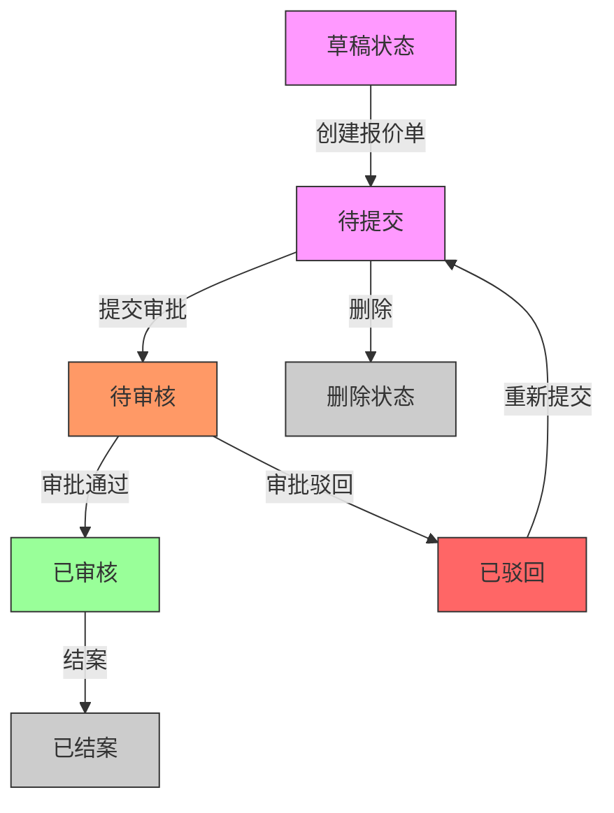
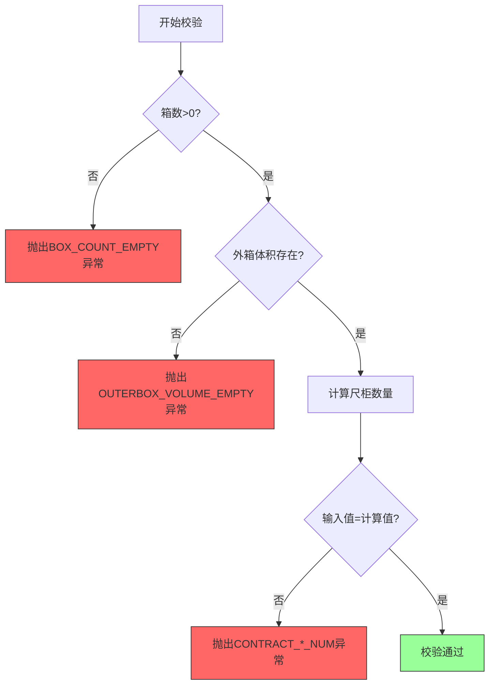

# 报价创建

<cite>
**本文档引用的文件**   
- [QuotationServiceImpl.java](file://eplus-module-sms/eplus-module-sms-biz/src/main/java/com/syj/eplus/module/sms/service/quotation/QuotationServiceImpl.java)
- [QuotationService.java](file://eplus-module-sms/eplus-module-sms-biz/src/main/java/com/syj/eplus/module/sms/service/quotation/QuotationService.java)
- [QuotationDO.java](file://eplus-module-sms/eplus-module-sms-biz/src/main/java/com/syj/eplus/module/sms/dal/dataobject/quotation/QuotationDO.java)
- [QuotationItemDO.java](file://eplus-module-sms/eplus-module-sms-biz/src/main/java/com/syj/eplus/module/sms/dal/dataobject/quotationitem/QuotationItemDO.java)
- [QuotationSaveReqVO.java](file://eplus-module-sms/eplus-module-sms-biz/src/main/java/com/syj/eplus/module/sms/controller/admin/quotation/vo/QuotationSaveReqVO.java)
- [QuotationEnum.java](file://eplus-framework/eplus-common/src/main/java/com/syj/eplus/framework/common/enums/QuotationEnum.java)
- [QuotationController.java](file://eplus-module-sms/eplus-module-sms-biz/src/main/java/com/syj/eplus/module/sms/controller/admin/quotation/QuotationController.java)
- [QuotationConvert.java](file://eplus-module-sms/eplus-module-sms-biz/src/main/java/com/syj/eplus/module/sms/convert/quotation/QuotationConvert.java)
</cite>

## 目录
1. [报价基本信息录入](#报价基本信息录入)
2. [报价明细数据录入](#报价明细数据录入)
3. [数据关联机制](#数据关联机制)
4. [报价单状态管理](#报价单状态管理)
5. [数据校验规则](#数据校验规则)

## 报价基本信息录入

报价单创建时需要录入的基本信息包括报价编号、客户信息和有效期等关键字段。系统通过`QuotationSaveReqVO`数据传输对象来接收前端传入的报价单创建请求，其中包含以下核心字段：

- **报价编号**：由系统自动生成，通过`CodeGeneratorApi`服务根据预设规则生成唯一编码，前缀为"SQ"
- **客户信息**：包括客户主键(custId)、客户编号(custCode)、客户名称(custName)、客户联系人(custPocName)等
- **有效期**：通过`validPeriod`字段设置报价单的有效期限
- **业务员**：通过`manager`字段记录负责该报价单的业务员信息
- **内部法人单位**：通过`companyId`和`companyName`字段关联归属公司信息
- **价格条款和币种**：记录结算方式和报价货币类型

当创建报价单时，系统会自动设置初始状态为"待提交"，并记录创建人和创建时间等审计信息。

**Section sources**
- [QuotationSaveReqVO.java](file://eplus-module-sms/eplus-module-sms-biz/src/main/java/com/syj/eplus/module/sms/controller/admin/quotation/vo/QuotationSaveReqVO.java#L14-L83)
- [QuotationDO.java](file://eplus-module-sms/eplus-module-sms-biz/src/main/java/com/syj/eplus/module/sms/dal/dataobject/quotation/QuotationDO.java#L28-L129)

## 报价明细数据录入

报价明细的录入包括产品信息、数量和单价等关键数据。系统通过`QuotationItemDO`实体类来管理报价单明细，主要包含以下信息：

- **产品信息**：包括产品编码(skuCode)、客户货号(cskuCode)、中英文名称(name/nameEng)和说明(description/descriptionEng)
- **报价信息**：通过`quotation`字段记录单价，包含金额和货币类型
- **数量信息**：包括最小起订量(moq)、箱数(boxCount)等
- **包装信息**：记录内箱装量(qtyPerInnerbox)、外箱装量(qtyPerOuterbox)和包装方式(packageType)
- **规格信息**：通过`specificationList`字段存储产品规格详情，包括外箱长宽高、毛净重等
- **供应商信息**：关联供应商编号(venderCode)和名称(venderName)

报价明细支持多规格产品的管理，每个产品可以关联多个规格，系统会自动计算外箱体积等衍生数据。

**Section sources**
- [QuotationItemDO.java](file://eplus-module-sms/eplus-module-sms-biz/src/main/java/com/syj/eplus/module/sms/dal/dataobject/quotationitem/QuotationItemDO.java#L36-L200)
- [QuotationSaveReqVO.java](file://eplus-module-sms/eplus-module-sms-biz/src/main/java/com/syj/eplus/module/sms/controller/admin/quotation/vo/QuotationSaveReqVO.java#L76-L80)

## 数据关联机制

报价单系统通过多种方式与产品目录和客户信息进行数据关联，确保数据的一致性和完整性。

### 与产品目录的关联

报价单通过产品编码(skuCode)与产品目录进行关联。系统通过`SkuApi`服务获取产品详细信息，包括：
- 产品基础信息（名称、描述等）
- 包装方式信息，通过`PackageTypeApi`获取包装类型详情
- 产品规格信息，用于计算体积和重量等参数

当报价单创建或更新时，系统会自动从产品目录中获取最新的产品信息，确保报价数据的准确性。

### 与客户信息的关联

报价单通过客户编号(custCode)与客户信息进行关联。系统通过`CustApi`服务获取客户详细信息，包括：
- 客户基本信息（名称、联系人等）
- 客户的结算条款和币种偏好
- 客户的国家和地区信息

这种关联机制确保了报价单中的客户信息始终与客户主数据保持同步。

**Diagram sources **
- [QuotationDO.java](file://eplus-module-sms/eplus-module-sms-biz/src/main/java/com/syj/eplus/module/sms/dal/dataobject/quotation/QuotationDO.java)
- [QuotationItemDO.java](file://eplus-module-sms/eplus-module-sms-biz/src/main/java/com/syj/eplus/module/sms/dal/dataobject/quotationitem/QuotationItemDO.java)
- [QuotationServiceImpl.java](file://eplus-module-sms/eplus-module-sms-biz/src/main/java/com/syj/eplus/module/sms/service/quotation/QuotationServiceImpl.java#L342-L345)

## 报价单状态管理

报价单的生命周期通过状态机进行管理，从草稿到最终结案的完整流程如下：

### 状态定义

系统定义了五种报价单状态，通过`QuotationEnum`枚举类进行管理：
- **待提交(1)**：报价单创建后的初始状态
- **待审核(2)**：报价单提交后进入审批流程
- **已审核(3)**：报价单通过审批
- **已驳回(4)**：报价单被审批人驳回
- **已结案(5)**：报价单完成或作废

### 状态流转

报价单的状态流转通过`QuotationService`服务进行管理，主要流程如下：

**Diagram sources **
- [QuotationEnum.java](file://eplus-framework/eplus-common/src/main/java/com/syj/eplus/framework/common/enums/QuotationEnum.java#L13-L27)
- [QuotationServiceImpl.java](file://eplus-module-sms/eplus-module-sms-biz/src/main/java/com/syj/eplus/module/sms/service/quotation/QuotationServiceImpl.java#L290-L315)

### 状态管理实现

状态管理的核心实现位于`QuotationServiceImpl`类中：
- **创建时**：默认设置为"待提交"状态
- **提交时**：调用`submitTask`方法，启动工作流并更新状态为"待审核"
- **审批时**：通过`approveTask`和`rejectTask`方法处理审批结果
- **更新状态**：`updateAuditStatus`方法根据审批结果更新报价单状态

系统还集成了BPM工作流引擎，通过`bpmProcessInstanceApi`服务管理审批流程的生命周期。

**Section sources**
- [QuotationEnum.java](file://eplus-framework/eplus-common/src/main/java/com/syj/eplus/framework/common/enums/QuotationEnum.java#L13-L27)
- [QuotationServiceImpl.java](file://eplus-module-sms/eplus-module-sms-biz/src/main/java/com/syj/eplus/module/sms/service/quotation/QuotationServiceImpl.java#L144-L175)

## 数据校验规则

系统在报价单创建和更新过程中实施了严格的数据校验规则，确保数据的完整性和准确性。

### 价格精度校验

系统对价格数据实施了精度控制，确保报价金额的准确性：
- 价格计算使用`BigDecimal`类型，避免浮点数精度丢失
- 货币转换时使用`CurrencyUtil`工具类进行精确换算
- 显示格式通过`NumberFormatUtil`进行标准化处理

### 数量范围校验

对数量相关字段实施了严格的范围校验：
- 箱数(boxCount)必须大于0，否则抛出`BOX_COUNT_EMPTY`异常
- 最小起订量(moq)必须为正整数
- 内外箱装量必须与实际包装规格匹配

### 尺柜数量校验

系统实现了智能的尺柜数量计算和校验：
- 根据产品外箱体积和箱数自动计算20尺柜、40尺柜和40尺高柜的数量
- 使用`CalcSaleContactUtil.calcCabinetNum`方法进行精确计算
- 校验用户输入的尺柜数量是否与计算结果一致

**Diagram sources **
- [QuotationServiceImpl.java](file://eplus-module-sms/eplus-module-sms-biz/src/main/java/com/syj/eplus/module/sms/service/quotation/QuotationServiceImpl.java#L184-L222)

### 其他校验规则

系统还实施了其他多项数据校验：
- 必填字段校验：客户信息、有效期等关键字段不能为空
- 数据一致性校验：确保报价单与产品目录、客户信息的数据一致性
- 业务规则校验：如新客户标识、价格条款等业务特定规则

这些校验规则通过服务层的`validateCabiinetNum`等方法实现，确保只有符合所有规则的报价单才能被创建或更新。

**Section sources**
- [QuotationServiceImpl.java](file://eplus-module-sms/eplus-module-sms-biz/src/main/java/com/syj/eplus/module/sms/service/quotation/QuotationServiceImpl.java#L184-L222)
- [QuotationService.java](file://eplus-module-sms/eplus-module-sms-biz/src/main/java/com/syj/eplus/module/sms/service/quotation/QuotationService.java#L24-L31)