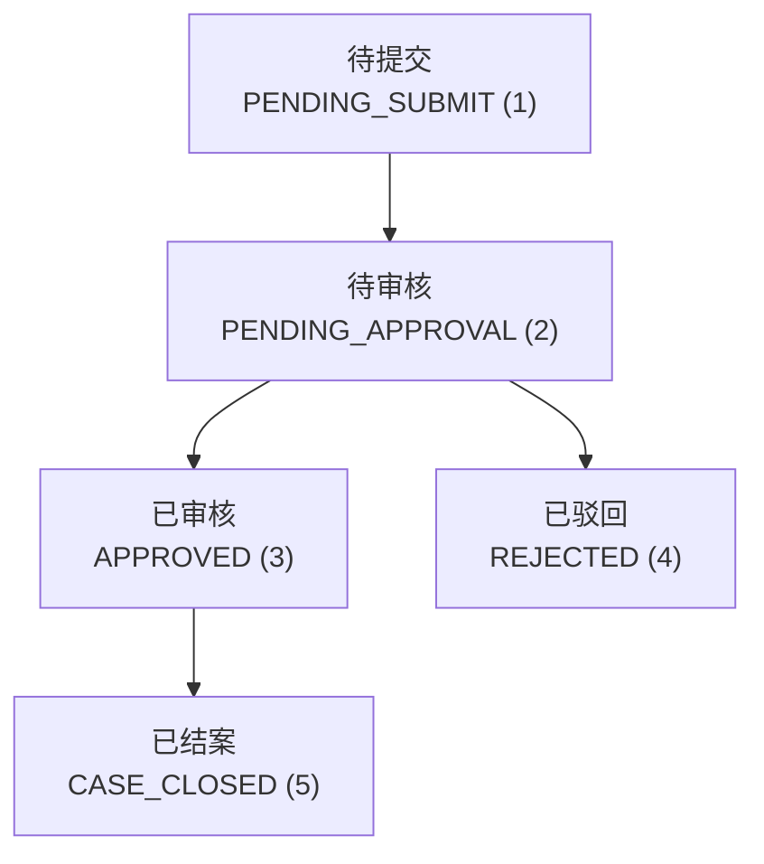
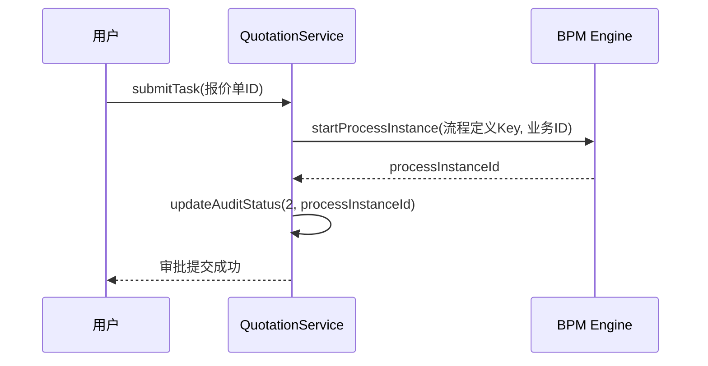
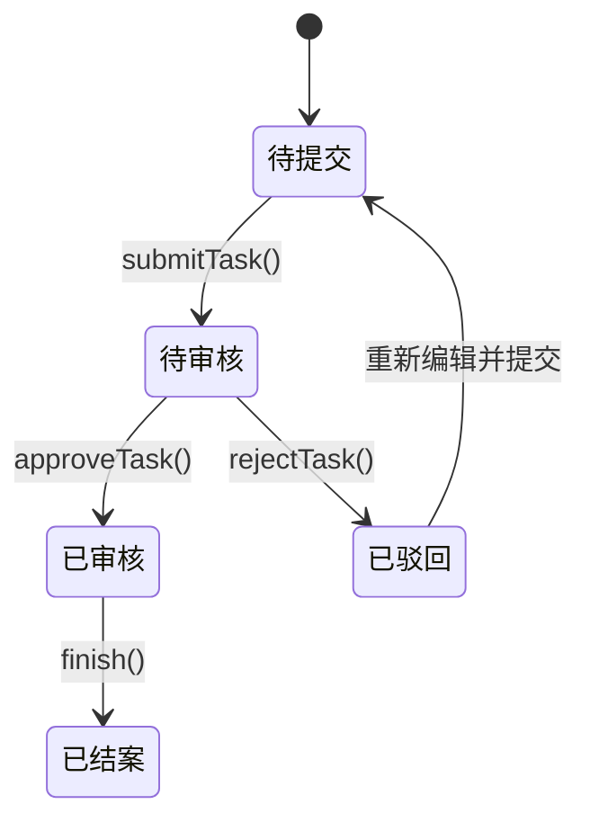

# 报价审批

<cite>
**本文档引用的文件**  
- [QuotationEnum.java](file://eplus-framework/eplus-common/src/main/java/com/syj/eplus/framework/common/enums/QuotationEnum.java)
- [QuotationService.java](file://eplus-module-sms/eplus-module-sms-biz/src/main/java/com/syj/eplus/module/sms/service/quotation/QuotationService.java)
- [QuotationController.java](file://eplus-module-sms/eplus-module-sms-biz/src/main/java/com/syj/eplus/module/sms/controller/admin/quotation/QuotationController.java)
- [QuoteItemDO.java](file://eplus-module-scm/eplus-module-scm-biz/src/main/java/com/syj/eplus/module/scm/dal/dataobject/quoteitem/QuoteItemDO.java)
- [BpmProcessInstanceResultEnum.java](file://yudao-module-bpm/yudao-module-bpm-api/src/main/java/cn/iocoder/yudao/module/bpm/enums/task/BpmProcessInstanceResultEnum.java)
</cite>

## 目录
1. [引言](#引言)
2. [报价审批状态设计](#报价审批状态设计)
3. [审批信息存储结构](#审批信息存储结构)
4. [多级审批机制支持](#多级审批机制支持)
5. [报价单锁定机制](#报价单锁定机制)
6. [审批流程状态转换](#审批流程状态转换)
7. [结论](#结论)

## 引言

报价审批流程是企业采购与销售管理中的关键环节，确保报价的合规性、准确性和及时性。本系统通过集成BPM（业务流程管理）引擎，实现了完整的报价审批生命周期管理。文档将深入解析报价审批流程的数据结构设计，包括审批状态、审批意见、审批人、审批时间等信息的存储方式，以及多级审批机制和报价单锁定机制的技术实现。

## 报价审批状态设计

报价审批流程定义了清晰的状态机，用于跟踪报价单在其生命周期中的各个阶段。这些状态通过枚举类 `QuotationEnum` 进行定义，确保了状态值的统一和类型安全。

**图示说明**：报价单从创建后的“待提交”状态开始，提交后进入“待审核”状态。在审核阶段，流程可以走向“已审核”或“已驳回”。一旦审核通过，最终可以被“已结案”。

**Diagram sources**
- [QuotationEnum.java](file://eplus-framework/eplus-common/src/main/java/com/syj/eplus/framework/common/enums/QuotationEnum.java#L14-L27)

**Section sources**
- [QuotationEnum.java](file://eplus-framework/eplus-common/src/main/java/com/syj/eplus/framework/common/enums/QuotationEnum.java#L1-L27)

## 审批信息存储结构

审批信息的存储主要围绕两个核心实体：报价单主数据和BPM流程实例。

1.  **报价单主数据 (`QuoteItemDO`)**:
    *   **`auditStatus`**: 存储报价单当前的审核状态，其值对应 `QuotationEnum` 中的 `code`。
    *   **`processInstanceId`**: 存储与该报价单关联的BPM流程实例ID，用于关联BPM引擎中的详细审批记录。
    *   其他字段如 `create_time`, `update_time` 等也用于记录关键时间点。

2.  **BPM流程实例数据**:
    *   系统使用独立的BPM模块来管理流程。`BpmProcessInstanceResultEnum` 枚举定义了更细粒度的流程状态，如“处理中”、“通过”、“不通过”、“驳回”等。
    *   审批意见、审批人、审批时间等详细信息由BPM引擎在流程执行过程中自动记录在流程任务表中，无需在报价单主表中重复存储。

**Section sources**
- [QuoteItemDO.java](file://eplus-module-scm/eplus-module-scm-biz/src/main/java/com/syj/eplus/module/scm/dal/dataobject/quoteitem/QuoteItemDO.java#L36-L248)
- [BpmProcessInstanceResultEnum.java](file://yudao-module-bpm/yudao-module-bpm-api/src/main/java/cn/iocoder/yudao/module/bpm/enums/task/BpmProcessInstanceResultEnum.java#L1-L92)

## 多级审批机制支持

多级审批机制由BPM引擎提供支持，其数据结构设计确保了流程的灵活性和可追溯性。

*   **流程定义 (`processDefinitionKey`)**: 每个审批流程都有一个唯一的流程定义Key。`QuotationService` 接口中的 `getProcessDefinitionKey()` 方法返回报价审批流程的定义标识，BPM引擎根据此定义来创建和执行流程实例。
*   **流程实例 (`processInstanceId`)**: 当一个报价单提交审批时，系统会调用BPM引擎创建一个新的流程实例，并将返回的 `processInstanceId` 存储在 `QuoteItemDO` 的 `processInstanceId` 字段中。
*   **审批节点与权限**: 审批节点的顺序和每个节点的审批人权限在BPM流程定义中配置。例如，一个流程可能定义为“采购员提交 -> 部门经理审批 -> 财务总监审批”。具体的审批人可以是固定用户、用户组或通过表达式动态计算得出。

**Diagram sources**
- [QuotationService.java](file://eplus-module-sms/eplus-module-sms-biz/src/main/java/com/syj/eplus/module/sms/service/quotation/QuotationService.java#L60-L83)
- [QuoteItemDO.java](file://eplus-module-scm/eplus-module-scm-biz/src/main/java/com/syj/eplus/module/scm/dal/dataobject/quoteitem/QuoteItemDO.java#L46)

**Section sources**
- [QuotationService.java](file://eplus-module-sms/eplus-module-sms-biz/src/main/java/com/syj/eplus/module/sms/service/quotation/QuotationService.java#L1-L130)
- [QuotationController.java](file://eplus-module-sms/eplus-module-sms-biz/src/main/java/com/syj/eplus/module/sms/controller/admin/quotation/QuotationController.java#L120-L125)

## 报价单锁定机制

为了防止在审批期间报价单被意外修改，系统通过状态机和业务逻辑相结合的方式实现了锁定机制。

1.  **状态驱动锁定**: 当报价单的 `auditStatus` 为“待审核”(2) 或“已审核”(3) 时，系统认为该报价单处于“锁定”状态。
2.  **业务逻辑控制**: 在 `QuotationService` 的 `updateQuotation` 方法中，会检查当前报价单的状态。如果状态为“待审核”或更高，更新操作将被拒绝，从而保证了数据的一致性。
3.  **BPM流程控制**: 提交审批后，所有对报价单的修改权限实际上被BPM流程接管。只有当流程被驳回或作废，状态回退到“待提交”时，用户才能再次编辑报价单。

**Section sources**
- [QuotationService.java](file://eplus-module-sms/eplus-module-sms-biz/src/main/java/com/syj/eplus/module/sms/service/quotation/QuotationService.java#L26-L31)
- [QuotationEnum.java](file://eplus-framework/eplus-common/src/main/java/com/syj/eplus/framework/common/enums/QuotationEnum.java#L16-L18)

## 审批流程状态转换

报价审批流程的状态转换由一系列服务方法驱动，这些方法在用户执行操作时被调用。

**图示说明**：此状态图描述了报价单在核心业务逻辑下的状态流转。`submitTask()` 方法触发从“待提交”到“待审核”的转换，并启动BPM流程。`approveTask()` 和 `rejectTask()` 方法由BPM任务完成事件触发，分别将状态更新为“已审核”或“已驳回”。`finish()` 方法用于将已通过的报价单最终结案。

**Diagram sources**
- [QuotationService.java](file://eplus-module-sms/eplus-module-sms-biz/src/main/java/com/syj/eplus/module/sms/service/quotation/QuotationService.java#L67-L98)

**Section sources**
- [QuotationService.java](file://eplus-module-sms/eplus-module-sms-biz/src/main/java/com/syj/eplus/module/sms/service/quotation/QuotationService.java#L67-L98)
- [QuotationController.java](file://eplus-module-sms/eplus-module-sms-biz/src/main/java/com/syj/eplus/module/sms/controller/admin/quotation/QuotationController.java#L104-L117)

## 结论

本系统的报价审批流程通过清晰的枚举定义、与BPM引擎的深度集成以及严谨的业务逻辑，实现了高效且安全的审批管理。`QuotationEnum` 定义了报价单的业务状态，而BPM引擎则负责处理复杂的多级审批流程和记录详细的审批轨迹。通过 `processInstanceId` 字段将两者关联，并利用状态机控制数据的可编辑性，有效地实现了审批期间的报价单锁定，确保了业务数据的完整性和流程的规范性。