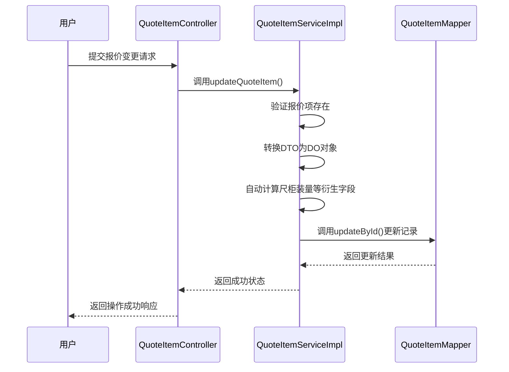
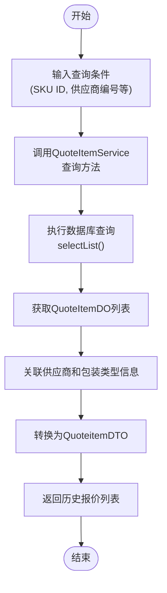
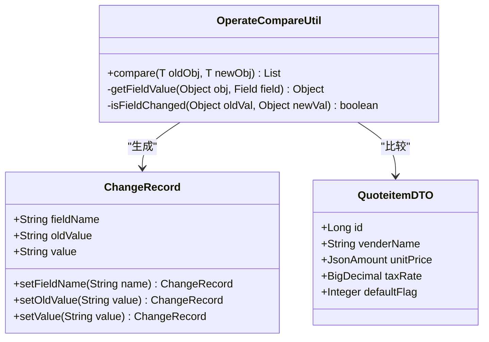

# 报价版本管理

<cite>
**本文档引用的文件**   
- [QuoteitemApi.java](file://eplus-module-scm/eplus-module-scm-api/src/main/java/com/syj/eplus/module/scm/api/quoteitem/QuoteitemApi.java)
- [QuoteItemDO.java](file://eplus-module-scm/eplus-module-scm-biz/src/main/java/com/syj/eplus/module/scm/dal/dataobject/quoteitem/QuoteItemDO.java)
- [QuoteItemServiceImpl.java](file://eplus-module-scm/eplus-module-scm-biz/src/main/java/com/syj/eplus/module/scm/service/quoteitem/QuoteItemServiceImpl.java)
- [QuoteItemController.java](file://eplus-module-scm/eplus-module-scm-biz/src/main/java/com/syj/eplus/module/scm/controller/admin/quoteitem/QuoteItemController.java)
- [QuoteItemSaveReqVO.java](file://eplus-module-scm/eplus-module-scm-biz/src/main/java/com/syj/eplus/module/scm/controller/admin/quoteitem/vo/QuoteItemSaveReqVO.java)
- [VenderServiceImpl.java](file://eplus-module-scm/eplus-module-scm-biz/src/main/java/com/syj/eplus/module/scm/service/vender/VenderServiceImpl.java)
- [SkuServiceImpl.java](file://eplus-module-pms/eplus-module-pms-biz/src/main/java/com/syj/eplus/module/pms/service/sku/SkuServiceImpl.java)
- [V1_0_0_295__修改报价单产品描述字段长度.java](file://eplus-flyway/src/main/java/db/migration/common/V1_0_0_295__修改报价单产品描述字段长度.java)
</cite>

## 目录
1. [报价版本管理机制概述](#报价版本管理机制概述)
2. [版本号递增策略](#版本号递增策略)
3. [历史报价版本存储方式](#历史报价版本存储方式)
4. [按版本号查询历史报价](#按版本号查询历史报价)
5. [版本间差异对比功能](#版本间差异对比功能)
6. [版本回滚机制](#版本回滚机制)

## 报价版本管理机制概述

报价版本管理机制是系统中用于追踪和管理供应商报价变更的核心功能。该机制通过版本控制确保所有报价变更都有据可查，支持历史版本的追溯、对比和恢复。系统通过在数据对象中维护版本号（ver）字段来实现版本控制，每次报价变更时版本号自动递增，从而形成完整的版本历史链。

**Section sources**
- [QuoteItemDO.java](file://eplus-module-scm/eplus-module-scm-biz/src/main/java/com/syj/eplus/module/scm/dal/dataobject/quoteitem/QuoteItemDO.java)
- [VenderServiceImpl.java](file://eplus-module-scm/eplus-module-scm-biz/src/main/java/com/syj/eplus/module/scm/service/vender/VenderServiceImpl.java)

## 版本号递增策略

系统的版本号递增策略采用自动递增模式，确保每次报价变更都能生成一个新的、唯一的版本。当用户提交报价变更请求时，系统会自动将当前版本号加1作为新版本号。

在供应商信息变更的实现中，`VenderServiceImpl` 类的 `updateById` 方法展示了版本递增的具体逻辑：首先将 `vender` 对象的版本号（ver）增加1，然后更新数据库记录。这种策略确保了版本号的连续性和唯一性，防止了版本冲突和数据覆盖。



**Diagram sources**
- [QuoteItemServiceImpl.java](file://eplus-module-scm/eplus-module-scm-biz/src/main/java/com/syj/eplus/module/scm/service/quoteitem/QuoteItemServiceImpl.java#L90-L97)
- [QuoteItemController.java](file://eplus-module-scm/eplus-module-scm-biz/src/main/java/com/syj/eplus/module/scm/controller/admin/quoteitem/QuoteItemController.java#L48-L54)

## 历史报价版本存储方式

系统采用数据库表直接存储的方式管理历史报价版本。每个报价项的所有历史版本都存储在 `scm_quote_item` 表中，通过主键（id）和相关业务字段（如skuId、venderCode等）进行关联。

`QuoteItemDO` 类定义了报价项的所有字段，包括报价日期、价格、包装信息、交期等关键数据。这些字段的组合构成了报价的完整快照，每次变更都会生成一条新的记录（或更新现有记录），从而形成历史版本链。系统通过 `BaseDO` 基类继承了创建时间、更新时间等审计字段，为版本追踪提供了时间维度的支持。

**Section sources**
- [QuoteItemDO.java](file://eplus-module-scm/eplus-module-scm-biz/src/main/java/com/syj/eplus/module/scm/dal/dataobject/quoteitem/QuoteItemDO.java)
- [V1_0_0_295__修改报价单产品描述字段长度.java](file://eplus-flyway/src/main/java/db/migration/common/V1_0_0_295__修改报价单产品描述字段长度.java)

## 按版本号查询历史报价

系统支持通过多种方式查询历史报价内容。`QuoteItemService` 接口提供了丰富的查询方法，允许用户根据SKU ID、供应商编号等条件获取历史报价数据。

`QuoteItemServiceImpl` 类实现了 `getQuoteitemDTOBySkuId` 和 `getQuoteItemDTOListBySkuIdList` 等方法，这些方法通过 `quoteItemMapper` 从数据库中查询指定SKU的历史报价记录。查询结果会自动关联供应商信息和包装类型信息，提供完整的报价视图。`QuoteItemController` 提供了相应的REST API端点，如 `/list-by-skuid` 和 `/list-by-skucode`，使前端应用能够方便地获取历史报价数据。



**Diagram sources**
- [QuoteItemServiceImpl.java](file://eplus-module-scm/eplus-module-scm-biz/src/main/java/com/syj/eplus/module/scm/service/quoteitem/QuoteItemServiceImpl.java#L161-L189)
- [QuoteItemController.java](file://eplus-module-scm/eplus-module-scm-biz/src/main/java/com/syj/eplus/module/scm/controller/admin/quoteitem/QuoteItemController.java#L74-L89)

## 版本间差异对比功能

系统提供了强大的版本间差异对比功能，能够清晰展示每次报价变更的具体内容。这一功能主要通过 `OperateCompareUtil` 工具类实现，该工具类能够比较两个对象的差异并生成变更记录。

在 `SkuServiceImpl` 的实现中，系统通过 `compare` 方法比较新旧报价对象，生成包含字段名、旧值和新值的 `ChangeRecord` 列表。这些变更记录会添加到总的变更记录集合中，用于后续的审计和展示。对于新增的报价项，系统也会生成相应的"新增供应商报价"记录，确保所有变更都有完整的记录。



**Diagram sources**
- [SkuServiceImpl.java](file://eplus-module-pms/eplus-module-pms-biz/src/main/java/com/syj/eplus/module/pms/service/sku/SkuServiceImpl.java#L1984-L2006)
- [QuoteitemDTO.java](file://eplus-module-scm/eplus-module-scm-api/src/main/java/com/syj/eplus/module/scm/api/quoteitem/dto/QuoteitemDTO.java)

## 版本回滚机制

系统的版本回滚机制通过查询指定历史版本的数据并重新提交来实现。虽然没有直接的"回滚"API，但系统提供了获取历史版本数据的能力，结合更新接口即可实现回滚功能。

`VenderServiceImpl` 类中的 `getSimpleOldVenderMap` 方法展示了如何根据供应商编号和版本号获取历史版本数据。该方法通过查询数据库中所有未删除的供应商记录，并按供应商编号和版本号进行分组，构建了一个版本映射，使得可以轻松获取任意历史版本的数据。用户可以通过查询特定版本的历史报价，然后使用更新接口将当前报价设置为历史版本的内容，从而实现版本回滚。

```mermaid
flowchart LR
A[用户请求回滚] --> B{选择目标版本}
B --> C[查询历史版本数据]
C --> D[获取指定版本的QuoteItemDO]
D --> E[转换为更新请求对象]
E --> F[调用updateQuoteItem()]
F --> G[版本号自动递增]
G --> H[保存为新版本]
H --> I[回滚完成]
```

**Diagram sources**
- [VenderServiceImpl.java](file://eplus-module-scm/eplus-module-scm-biz/src/main/java/com/syj/eplus/module/scm/service/vender/VenderServiceImpl.java#L705-L723)
- [QuoteItemServiceImpl.java](file://eplus-module-scm/eplus-module-scm-biz/src/main/java/com/syj/eplus/module/scm/service/quoteitem/QuoteItemServiceImpl.java#L90-L97)