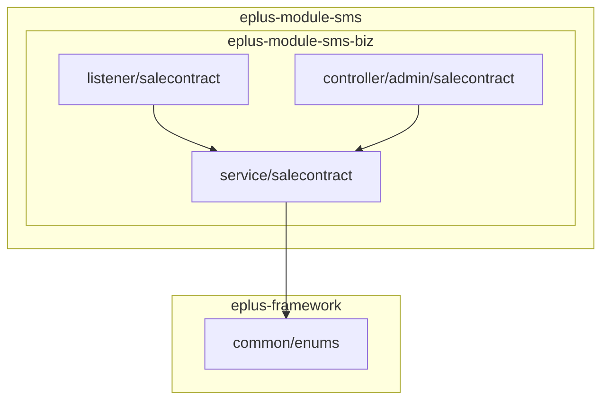
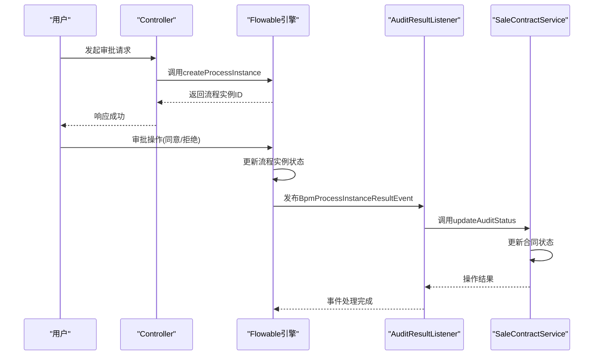
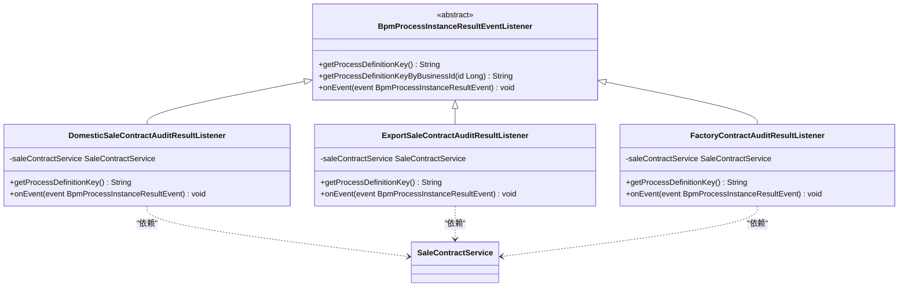
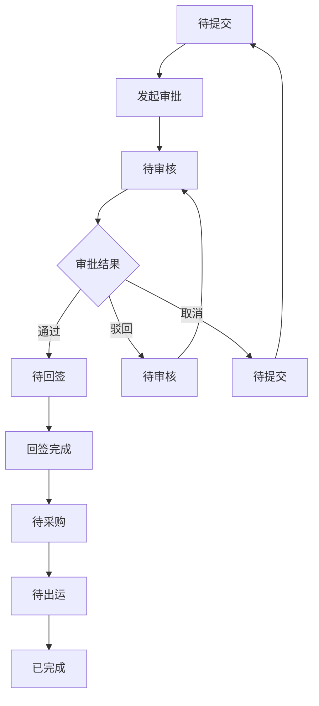
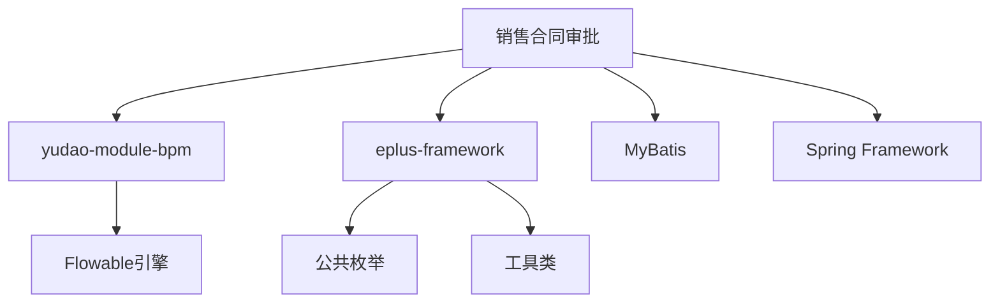

# 销售合同审批机制

<cite>
**本文档引用的文件**  
- [SaleContractServiceImpl.java](file://eplus-module-sms/eplus-module-sms-biz/src/main/java/com/syj/eplus/module/sms/service/salecontract/SaleContractServiceImpl.java)
- [DomesticSaleContractAuditResultListener.java](file://eplus-module-sms/eplus-module-sms-biz/src/main/java/com/syj/eplus/module/sms/listener/salecontract/DomesticSaleContractAuditResultListener.java)
- [ExportSaleContractAuditResultListener.java](file://eplus-module-sms/eplus-module-sms-biz/src/main/java/com/syj/eplus/module/sms/listener/salecontract/ExportSaleContractAuditResultListener.java)
- [FactoryContractAuditResultListener.java](file://eplus-module-sms/eplus-module-sms-biz/src/main/java/com/syj/eplus/module/sms/listener/salecontract/FactoryContractAuditResultListener.java)
- [SaleContractStatusEnum.java](file://eplus-framework/eplus-common/src/main/java/com/syj/eplus/framework/common/enums/SaleContractStatusEnum.java)
- [BpmProcessInstanceResultEventListener.java](file://yudao-module-bpm/yudao-module-bpm-api/src/main/java/cn/iocoder/yudao/module/bpm/api/event/BpmProcessInstanceResultEventListener.java)
- [BpmProcessInstanceResultEvent.java](file://yudao-module-bpm/yudao-module-bpm-api/src/main/java/cn/iocoder/yudao/module/bpm/api/event/BpmProcessInstanceResultEvent.java)
- [BpmFlowableConfiguration.java](file://yudao-module-bpm/yudao-module-bpm-biz/src/main/java/cn/iocoder/yudao/module/bpm/framework/flowable/config/BpmFlowableConfiguration.java)
</cite>

## 目录
1. [引言](#引言)
2. [项目结构](#项目结构)
3. [核心组件](#核心组件)
4. [架构概述](#架构概述)
5. [详细组件分析](#详细组件分析)
6. [依赖分析](#依赖分析)
7. [性能考虑](#性能考虑)
8. [故障排除指南](#故障排除指南)
9. [结论](#结论)

## 引言
本文档深入解析销售合同审批机制的实现原理，重点说明基于Flowable工作流引擎的审批流程配置。文档将详细描述各类合同审批结果监听器如何监听审批结果并更新合同状态，解释审批过程中合同状态的流转逻辑及数据一致性保障机制。同时，说明审批意见的存储方式和历史记录查询功能，并提供工作流定义文件（BPMN）的关键配置分析，包括审批节点设置、条件路由、会签规则等。此外，还将涵盖审批超时处理、加签、转办等高级功能的实现细节。

## 项目结构
销售合同审批功能主要分布在`eplus-module-sms`模块中，该模块负责销售管理系统的业务逻辑。审批机制的核心实现位于`eplus-module-sms-biz`子模块的`listener/salecontract`包中，包含针对不同类型销售合同的审批结果监听器。业务逻辑服务由`SaleContractService`接口及其实现类`SaleContractServiceImpl`提供，位于`service/salecontract`包中。状态枚举定义在`eplus-framework`模块的`common/enums`包中。

**图示来源**  
- [DomesticSaleContractAuditResultListener.java](file://eplus-module-sms/eplus-module-sms-biz/src/main/java/com/syj/eplus/module/sms/listener/salecontract/DomesticSaleContractAuditResultListener.java)
- [SaleContractServiceImpl.java](file://eplus-module-sms/eplus-module-sms-biz/src/main/java/com/syj/eplus/module/sms/service/salecontract/SaleContractServiceImpl.java)
- [SaleContractStatusEnum.java](file://eplus-framework/eplus-common/src/main/java/com/syj/eplus/framework/common/enums/SaleContractStatusEnum.java)

**本节来源**  
- [eplus-module-sms](file://eplus-module-sms)

## 核心组件
销售合同审批机制的核心组件包括基于Flowable工作流引擎的审批流程配置、审批结果监听器、合同状态管理服务以及状态枚举定义。系统通过事件驱动架构，当审批流程实例结果发生变化时，触发相应的监听器，进而调用业务服务更新合同状态和相关数据。

**本节来源**  
- [SaleContractServiceImpl.java](file://eplus-module-sms/eplus-module-sms-biz/src/main/java/com/syj/eplus/module/sms/service/salecontract/SaleContractServiceImpl.java)
- [BpmProcessInstanceResultEventListener.java](file://yudao-module-bpm/yudao-module-bpm-api/src/main/java/cn/iocoder/yudao/module/bpm/api/event/BpmProcessInstanceResultEventListener.java)

## 架构概述
系统采用基于Flowable工作流引擎的事件驱动架构来实现销售合同审批。当用户发起审批请求时，系统通过`BpmProcessInstanceApi`创建流程实例。审批过程中，每个节点的审批结果会触发`BpmProcessInstanceResultEvent`事件。系统中注册了多个`BpmProcessInstanceResultEventListener`的实现类，这些监听器会根据流程定义Key识别并处理特定类型的审批事件。监听器处理事件时，会调用`SaleContractService`来更新合同状态和相关业务数据，确保业务状态与审批流程状态保持一致。

**图示来源**  
- [BpmProcessInstanceApiImpl.java](file://yudao-module-bpm/yudao-module-bpm-biz/src/main/java/cn/iocoder/yudao/module/bpm/api/task/BpmProcessInstanceApiImpl.java)
- [BpmProcessInstanceResultEventListener.java](file://yudao-module-bpm/yudao-module-bpm-api/src/main/java/cn/iocoder/yudao/module/bpm/api/event/BpmProcessInstanceResultEventListener.java)
- [SaleContractServiceImpl.java](file://eplus-module-sms/eplus-module-sms-biz/src/main/java/com/syj/eplus/module/sms/service/salecontract/SaleContractServiceImpl.java)

## 详细组件分析

### 审批结果监听器分析
系统为不同类型的销售合同实现了专门的审批结果监听器，包括`DomesticSaleContractAuditResultListener`（内销合同）、`ExportSaleContractAuditResultListener`（外销合同）和`FactoryContractAuditResultListener`（外币采购合同）。这些监听器均继承自`BpmProcessInstanceResultEventListener`抽象类，实现了对审批结果事件的监听和处理。

#### 监听器类图

**图示来源**  
- [DomesticSaleContractAuditResultListener.java](file://eplus-module-sms/eplus-module-sms-biz/src/main/java/com/syj/eplus/module/sms/listener/salecontract/DomesticSaleContractAuditResultListener.java)
- [ExportSaleContractAuditResultListener.java](file://eplus-module-sms/eplus-module-sms-biz/src/main/java/com/syj/eplus/module/sms/listener/salecontract/ExportSaleContractAuditResultListener.java)
- [FactoryContractAuditResultListener.java](file://eplus-module-sms/eplus-module-sms-biz/src/main/java/com/syj/eplus/module/sms/listener/salecontract/FactoryContractAuditResultListener.java)

**本节来源**  
- [DomesticSaleContractAuditResultListener.java](file://eplus-module-sms/eplus-module-sms-biz/src/main/java/com/syj/eplus/module/sms/listener/salecontract/DomesticSaleContractAuditResultListener.java)
- [ExportSaleContractAuditResultListener.java](file://eplus-module-sms/eplus-module-sms-biz/src/main/java/com/syj/eplus/module/sms/listener/salecontract/ExportSaleContractAuditResultListener.java)
- [FactoryContractAuditResultListener.java](file://eplus-module-sms/eplus-module-sms-biz/src/main/java/com/syj/eplus/module/sms/listener/salecontract/FactoryContractAuditResultListener.java)

### 合同状态流转逻辑
合同状态的流转由`SaleContractService`的`updateAuditStatus`方法管理。当审批结果为"通过"时，合同状态会更新为"待回签"；当审批结果为"驳回"或"取消"时，合同状态会更新为"待审核"或"待提交"。系统通过`SaleContractStatusEnum`枚举定义了所有可能的合同状态，确保状态值的类型安全和一致性。

#### 状态流转流程图

**图示来源**  
- [SaleContractServiceImpl.java](file://eplus-module-sms/eplus-module-sms-biz/src/main/java/com/syj/eplus/module/sms/service/salecontract/SaleContractServiceImpl.java)
- [SaleContractStatusEnum.java](file://eplus-framework/eplus-common/src/main/java/com/syj/eplus/framework/common/enums/SaleContractStatusEnum.java)

**本节来源**  
- [SaleContractServiceImpl.java](file://eplus-module-sms/eplus-module-sms-biz/src/main/java/com/syj/eplus/module/sms/service/salecontract/SaleContractServiceImpl.java)
- [SaleContractStatusEnum.java](file://eplus-framework/eplus-common/src/main/java/com/syj/eplus/framework/common/enums/SaleContractStatusEnum.java)

## 依赖分析
销售合同审批机制依赖于多个模块和组件。核心依赖包括`yudao-module-bpm`模块提供的工作流引擎API和事件机制，`eplus-framework`模块提供的公共枚举和工具类，以及MyBatis等持久层框架。系统通过Spring的依赖注入机制管理这些依赖关系，确保组件间的松耦合。

**图示来源**  
- [pom.xml](file://eplus-module-sms/eplus-module-sms-biz/pom.xml)
- [BpmProcessInstanceResultEventListener.java](file://yudao-module-bpm/yudao-module-bpm-api/src/main/java/cn/iocoder/yudao/module/bpm/api/event/BpmProcessInstanceResultEventListener.java)

**本节来源**  
- [pom.xml](file://eplus-module-sms/eplus-module-sms-biz/pom.xml)

## 性能考虑
审批机制的性能主要受工作流引擎处理能力和数据库操作效率的影响。系统通过批量更新合同项、合理使用缓存以及异步处理非关键操作来优化性能。此外，工作流定义的复杂度也会影响审批流程的执行效率，因此建议保持BPMN流程定义的简洁性。

## 故障排除指南
当审批流程无法正常触发或合同状态未正确更新时，应首先检查相关监听器是否已正确注册到Spring容器中。其次，验证流程定义Key是否与监听器中配置的Key匹配。最后，检查数据库事务是否正常提交，确保状态更新操作不会因异常而回滚。

**本节来源**  
- [BpmProcessInstanceResultEventListener.java](file://yudao-module-bpm/yudao-module-bpm-api/src/main/java/cn/iocoder/yudao/module/bpm/api/event/BpmProcessInstanceResultEventListener.java)
- [SaleContractServiceImpl.java](file://eplus-module-sms/eplus-module-sms-biz/src/main/java/com/syj/eplus/module/sms/service/salecontract/SaleContractServiceImpl.java)

## 结论
本文档详细解析了基于Flowable工作流引擎的销售合同审批机制。系统通过事件驱动架构实现了审批流程与业务逻辑的解耦，确保了审批结果能够及时、准确地反映在合同状态上。通过为不同类型的合同实现专门的监听器，系统具备了良好的扩展性和维护性。未来可进一步优化审批流程的可视化配置和监控能力。