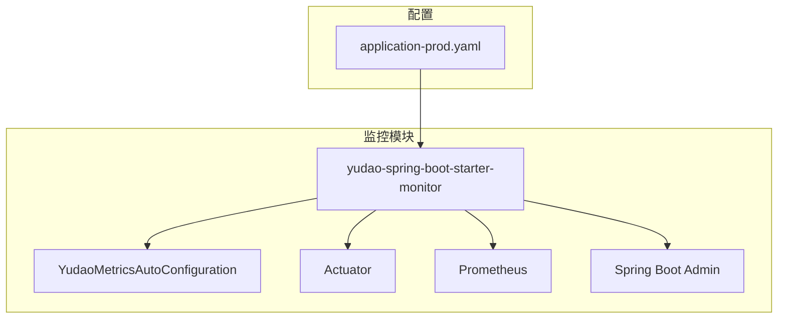
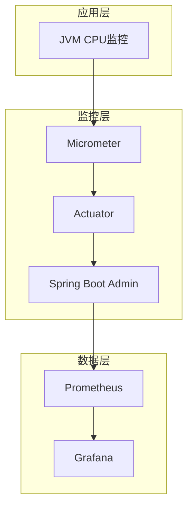
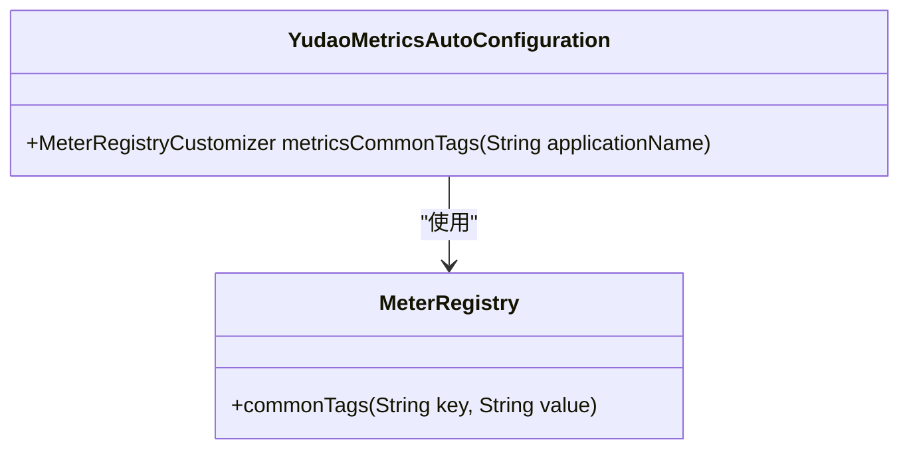
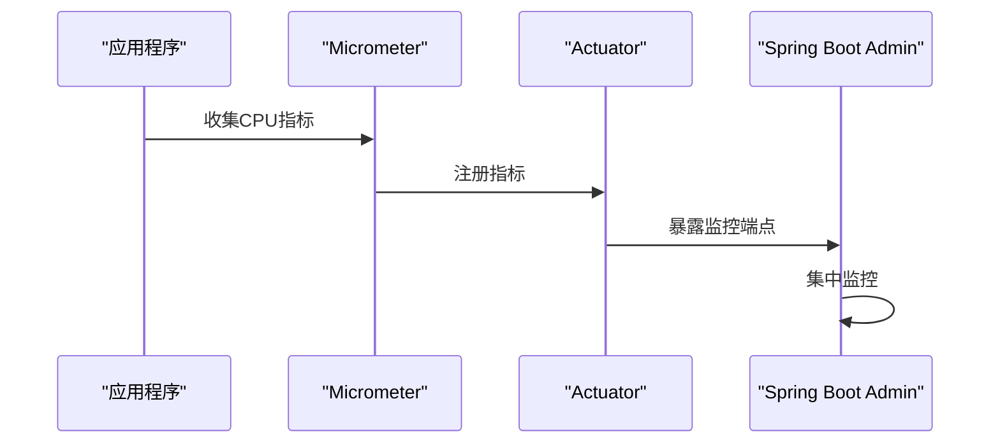
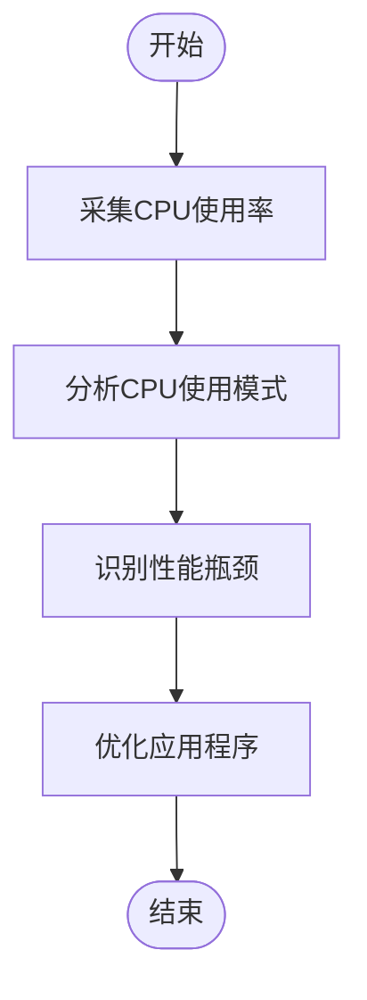
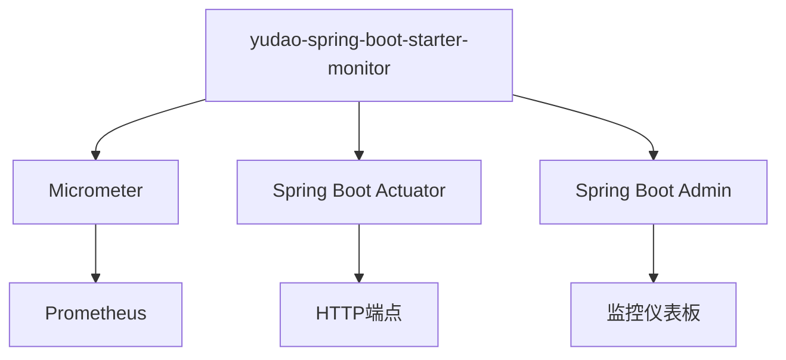

# JVM CPU监控

<cite>
**本文档引用的文件**  
- [YudaoMetricsAutoConfiguration.java](file://yudao-framework/yudao-spring-boot-starter-monitor/src/main/java/cn/iocoder/yudao/framework/tracer/config/YudaoMetricsAutoConfiguration.java)
- [application-prod.yaml](file://yudao-server/src/main/resources/application-prod.yaml)
- [RedisMonitorRespVO.java](file://yudao-module-infra/yudao-module-infra-biz/src/main/java/cn/iocoder/yudao/module/infra/controller/admin/redis/vo/RedisMonitorRespVO.java)
- [pom.xml](file://yudao-framework/yudao-spring-boot-starter-monitor/pom.xml)
</cite>

## 目录
1. [引言](#引言)
2. [项目结构](#项目结构)
3. [核心组件](#核心组件)
4. [架构概述](#架构概述)
5. [详细组件分析](#详细组件分析)
6. [依赖分析](#依赖分析)
7. [性能考虑](#性能考虑)
8. [故障排除指南](#故障排除指南)
9. [结论](#结论)
10. [附录](#附录)（如有必要）

## 引言
本文档详细阐述了JVM CPU监控机制，特别是getJvmCpu接口采集CPU使用率的实现原理。文档解释了CPU使用率的计算原理和采样间隔，说明了如何区分应用CPU占用和系统CPU占用。同时提供了高CPU使用率的诊断流程，包括线程栈分析、热点方法定位和GC影响评估。文档还给出了CPU性能瓶颈的常见场景和优化建议，如减少锁竞争、优化算法复杂度等，并包含CPU使用率的正常范围和告警阈值设置建议。

## 项目结构
本项目采用模块化设计，主要包含多个业务模块和基础设施模块。JVM监控功能主要集中在yudao-framework模块下的yudao-spring-boot-starter-monitor组件中。该组件通过Micrometer和Spring Boot Actuator提供监控能力，并通过Spring Boot Admin进行集中管理。

**图表来源**  
- [YudaoMetricsAutoConfiguration.java](file://yudao-framework/yudao-spring-boot-starter-monitor/src/main/java/cn/iocoder/yudao/framework/tracer/config/YudaoMetricsAutoConfiguration.java)
- [application-prod.yaml](file://yudao-server/src/main/resources/application-prod.yaml)

**章节来源**
- [YudaoMetricsAutoConfiguration.java](file://yudao-framework/yudao-spring-boot-starter-monitor/src/main/java/cn/iocoder/yudao/framework/tracer/config/YudaoMetricsAutoConfiguration.java)
- [application-prod.yaml](file://yudao-server/src/main/resources/application-prod.yaml)

## 核心组件
JVM CPU监控的核心组件包括Micrometer指标收集器、Spring Boot Actuator监控端点和Spring Boot Admin客户端。这些组件共同工作，实现JVM CPU使用率的采集和监控。

**章节来源**
- [YudaoMetricsAutoConfiguration.java](file://yudao-framework/yudao-spring-boot-starter-monitor/src/main/java/cn/iocoder/yudao/framework/tracer/config/YudaoMetricsAutoConfiguration.java)
- [pom.xml](file://yudao-framework/yudao-spring-boot-starter-monitor/pom.xml)

## 架构概述
系统采用分层监控架构，底层使用Micrometer收集JVM指标，中间层通过Spring Boot Actuator暴露监控端点，上层通过Spring Boot Admin进行集中监控和管理。

**图表来源**  
- [YudaoMetricsAutoConfiguration.java](file://yudao-framework/yudao-spring-boot-starter-monitor/src/main/java/cn/iocoder/yudao/framework/tracer/config/YudaoMetricsAutoConfiguration.java)
- [application-prod.yaml](file://yudao-server/src/main/resources/application-prod.yaml)

## 详细组件分析

### CPU监控组件分析
JVM CPU监控组件通过Micrometer收集CPU使用率指标，并通过Spring Boot Actuator暴露为HTTP端点。Spring Boot Admin客户端注册到Spring Boot Admin Server，实现集中监控。

#### 对于监控组件：

**图表来源**  
- [YudaoMetricsAutoConfiguration.java](file://yudao-framework/yudao-spring-boot-starter-monitor/src/main/java/cn/iocoder/yudao/framework/tracer/config/YudaoMetricsAutoConfiguration.java)

#### 对于监控流程：

**图表来源**  
- [YudaoMetricsAutoConfiguration.java](file://yudao-framework/yudao-spring-boot-starter-monitor/src/main/java/cn/iocoder/yudao/framework/tracer/config/YudaoMetricsAutoConfiguration.java)
- [application-prod.yaml](file://yudao-server/src/main/resources/application-prod.yaml)

**章节来源**
- [YudaoMetricsAutoConfiguration.java](file://yudao-framework/yudao-spring-boot-starter-monitor/src/main/java/cn/iocoder/yudao/framework/tracer/config/YudaoMetricsAutoConfiguration.java)
- [application-prod.yaml](file://yudao-server/src/main/resources/application-prod.yaml)

### 概念概述
JVM CPU监控通过采集JVM的CPU使用率指标，帮助开发者了解应用程序的CPU消耗情况。通过分析这些指标，可以识别性能瓶颈，优化应用程序性能。

[无来源，因为此图表显示的是概念工作流，而不是实际代码结构]

[无来源，因为此章节不分析特定源文件]

## 依赖分析
JVM CPU监控功能依赖于多个组件，包括Micrometer、Spring Boot Actuator和Spring Boot Admin。这些组件通过Maven依赖管理，确保版本兼容性。

**图表来源**  
- [pom.xml](file://yudao-framework/yudao-spring-boot-starter-monitor/pom.xml)

**章节来源**
- [pom.xml](file://yudao-framework/yudao-spring-boot-starter-monitor/pom.xml)

## 性能考虑
JVM CPU监控对应用程序性能的影响较小，因为指标采集是异步进行的。然而，频繁的监控请求可能会增加网络开销。建议合理设置监控采样间隔，平衡监控精度和性能开销。

[无来源，因为此章节提供一般性指导]

## 故障排除指南
当遇到高CPU使用率问题时，应首先分析线程栈，识别热点方法。然后评估GC影响，检查是否存在频繁的垃圾回收。最后，检查是否存在锁竞争，优化算法复杂度。

**章节来源**
- [YudaoMetricsAutoConfiguration.java](file://yudao-framework/yudao-spring-boot-starter-monitor/src/main/java/cn/iocoder/yudao/framework/tracer/config/YudaoMetricsAutoConfiguration.java)
- [application-prod.yaml](file://yudao-server/src/main/resources/application-prod.yaml)

## 结论
JVM CPU监控是确保应用程序性能稳定的重要手段。通过合理配置监控组件，可以及时发现性能瓶颈，优化应用程序性能。建议设置合理的告警阈值，及时响应高CPU使用率问题。

[无来源，因为此章节总结而不分析特定源文件]