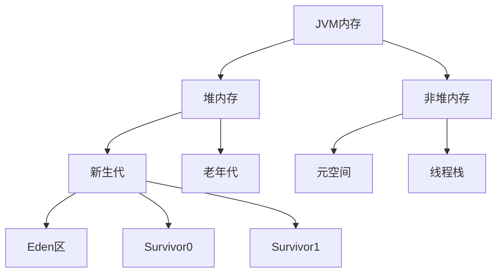
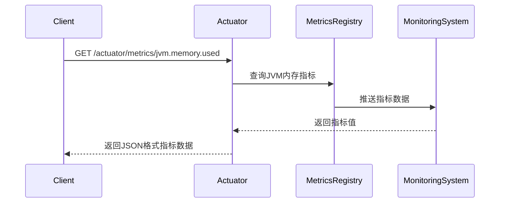

# JVM内存监控

<cite>
**本文档引用文件**  
- [YudaoMetricsAutoConfiguration.java](file://yudao-framework/yudao-spring-boot-starter-monitor/src/main/java/cn/iocoder/yudao/framework/tracer/config/YudaoMetricsAutoConfiguration.java)
- [application-dev.yaml](file://yudao-server/src/main/resources/application-dev.yaml)
- [application-prod.yaml](file://yudao-server/src/main/resources/application-prod.yaml)
- [RedisConvert.java](file://yudao-module-infra/yudao-module-infra-biz/src/main/java/cn/iocoder/yudao/module/infra/convert/redis/RedisConvert.java)
- [《芋道 Spring Boot 监控端点 Actuator 入门》.md](file://yudao-framework/yudao-spring-boot-starter-monitor/《芋道 Spring Boot 监控端点 Actuator 入门》.md)
</cite>

## 目录
1. [引言](#引言)
2. [JVM内存结构概述](#jvm内存结构概述)
3. [堆内存与非堆内存指标解析](#堆内存与非堆内存指标解析)
4. [内存区域分布与监控要点](#内存区域分布与监控要点)
5. [内存泄漏诊断方法](#内存泄漏诊断方法)
6. [内存使用率阈值与告警建议](#内存使用率阈值与告警建议)
7. [内存溢出(OOM)常见原因与排查工具](#内存溢出oom常见原因与排查工具)
8. [监控配置与实现](#监控配置与实现)
9. [结论](#结论)

## 引言

JVM内存监控是保障Java应用稳定运行的关键环节。通过对JVM内存使用情况的持续监控，可以及时发现内存泄漏、内存溢出等潜在问题，优化应用性能。本文档详细解释JVM内存监控的核心概念、指标计算方法、监控策略及故障排查方法，为系统运维和开发人员提供全面的指导。

## JVM内存结构概述

Java虚拟机（JVM）内存主要分为堆内存（Heap Memory）和非堆内存（Non-Heap Memory）两大区域。堆内存用于存储对象实例，是垃圾回收的主要区域；非堆内存包括方法区、元空间、线程栈等，用于存储类信息、常量、静态变量等。

JVM内存结构的设计直接影响应用的性能和稳定性。合理的内存分配和高效的垃圾回收机制是保障应用高效运行的基础。通过监控JVM内存使用情况，可以深入了解应用的内存行为，为性能优化提供数据支持。

## 堆内存与非堆内存指标解析

### 已用内存、最大内存、提交内存的计算方法

JVM内存监控主要关注三个核心指标：已用内存（Used Memory）、最大内存（Max Memory）和提交内存（Committed Memory）。

- **已用内存**：当前已分配给对象使用的内存量，通过`MemoryMXBean.getHeapMemoryUsage().getUsed()`获取。
- **最大内存**：JVM堆内存的最大可扩展大小，通过`MemoryMXBean.getHeapMemoryUsage().getMax()`获取。
- **提交内存**：JVM向操作系统申请的内存大小，可能大于已用内存，通过`MemoryMXBean.getHeapMemoryUsage().getCommitted()`获取。

这些指标的监控意义在于：
- **已用内存**反映当前应用的内存压力，持续增长可能预示内存泄漏。
- **最大内存**是内存溢出的硬性限制，超过此值将触发OutOfMemoryError。
- **提交内存**体现JVM实际占用的系统资源，有助于评估系统整体资源使用情况。

**Section sources**
- [YudaoMetricsAutoConfiguration.java](file://yudao-framework/yudao-spring-boot-starter-monitor/src/main/java/cn/iocoder/yudao/framework/tracer/config/YudaoMetricsAutoConfiguration.java)

## 内存区域分布与监控要点

### 新生代（Eden、Survivor）、老年代和元空间

JVM堆内存进一步划分为新生代和老年代，新生代又分为Eden区和两个Survivor区（S0、S1）。



**Diagram sources**
- [YudaoMetricsAutoConfiguration.java](file://yudao-framework/yudao-spring-boot-starter-monitor/src/main/java/cn/iocoder/yudao/framework/tracer/config/YudaoMetricsAutoConfiguration.java)

**监控要点**：
- **Eden区**：对象首先分配在此区域，监控其使用率可了解对象创建频率。
- **Survivor区**：经过一次GC后存活的对象移至此区域，监控其变化可评估对象生命周期。
- **老年代**：长期存活的对象存放于此，使用率持续增长可能预示内存泄漏。
- **元空间**：存储类元数据，监控其使用可发现类加载异常或动态生成类过多的问题。

## 内存泄漏诊断方法

### 对象增长趋势分析

内存泄漏的典型特征是老年代内存使用率持续增长，即使经过多次Full GC也无法释放。诊断方法包括：
1. 使用`jstat -gc`命令定期采集GC数据，分析老年代使用量变化趋势。
2. 使用`jmap -histo`命令统计各类型对象数量，识别异常增长的对象类型。
3. 通过`jmap -dump`生成堆转储文件，使用MAT等工具进行深入分析。

### GC前后内存变化观察

观察GC前后内存变化是诊断内存问题的重要手段：
- **Minor GC后**：Eden区应接近清空，Survivor区对象数量变化应符合预期。
- **Full GC后**：老年代使用率应有明显下降，若下降不明显则可能存在内存泄漏。
- 通过对比GC日志中的内存使用数据，可判断GC效果和内存回收情况。

**Section sources**
- [YudaoMetricsAutoConfiguration.java](file://yudao-framework/yudao-spring-boot-starter-monitor/src/main/java/cn/iocoder/yudao/framework/tracer/config/YudaoMetricsAutoConfiguration.java)

## 内存使用率阈值与告警建议

### 各内存区域合理使用率阈值

| 内存区域 | 健康范围 | 警告阈值 | 危险阈值 |
|---------|---------|---------|---------|
| Eden区 | <70% | 70%-90% | >90% |
| Survivor区 | <50% | 50%-80% | >80% |
| 老年代 | <60% | 60%-80% | >80% |
| 元空间 | <70% | 70%-90% | >90% |

### 告警建议

- **Eden区高使用率**：可能表示对象创建过于频繁，需检查业务逻辑或考虑增大新生代。
- **Survivor区高使用率**：可能表示对象过早进入老年代，需调整新生代内部比例。
- **老年代持续增长**：极可能内存泄漏，需立即进行堆转储分析。
- **元空间溢出**：检查是否有过多动态类生成或类加载器泄漏。

## 内存溢出(OOM)常见原因与排查工具

### OOM常见原因

1. **堆内存溢出**：对象持续创建且无法回收，最常见于缓存未设置大小限制。
2. **元空间溢出**：动态生成大量类（如使用CGLIB、反射等）或类加载器泄漏。
3. **栈溢出**：递归调用过深或线程创建过多。
4. **直接内存溢出**：使用NIO时ByteBuffer分配过多且未及时释放。

### 排查工具使用指南

- **jstat**：实时监控GC和内存使用情况，适合长期观察。
- **jmap**：生成堆转储文件或查看对象统计，用于深入分析。
- **jstack**：查看线程堆栈，诊断死锁或线程阻塞问题。
- **MAT**：分析堆转储文件，定位内存泄漏根源。
- **VisualVM**：集成式监控工具，提供全面的JVM运行时信息。

**Section sources**
- [YudaoMetricsAutoConfiguration.java](file://yudao-framework/yudao-spring-boot-starter-monitor/src/main/java/cn/iocoder/yudao/framework/tracer/config/YudaoMetricsAutoConfiguration.java)

## 监控配置与实现

### Actuator监控端点配置

本系统通过Spring Boot Actuator提供JVM监控端点，相关配置位于`application-dev.yaml`和`application-prod.yaml`中：

```yaml
management:
  endpoints:
    web:
      base-path: /actuator
      exposure:
        include: '*'
```

此配置开放所有监控端点，包括`/actuator/metrics/jvm.memory.used`、`/actuator/metrics/jvm.gc.pause`等，可通过HTTP接口获取详细的JVM内存和GC指标。

### Metrics监控实现

系统使用Micrometer实现指标收集，通过`YudaoMetricsAutoConfiguration`配置通用标签，将应用名称作为指标的公共标签，便于多实例监控和数据聚合。



**Diagram sources**
- [YudaoMetricsAutoConfiguration.java](file://yudao-framework/yudao-spring-boot-starter-monitor/src/main/java/cn/iocoder/yudao/framework/tracer/config/YudaoMetricsAutoConfiguration.java)
- [application-dev.yaml](file://yudao-server/src/main/resources/application-dev.yaml)

**Section sources**
- [YudaoMetricsAutoConfiguration.java](file://yudao-framework/yudao-spring-boot-starter-monitor/src/main/java/cn/iocoder/yudao/framework/tracer/config/YudaoMetricsAutoConfiguration.java)
- [application-dev.yaml](file://yudao-server/src/main/resources/application-dev.yaml)
- [application-prod.yaml](file://yudao-server/src/main/resources/application-prod.yaml)

## 结论

JVM内存监控是保障Java应用稳定运行的重要手段。通过监控堆内存、非堆内存各区域的使用情况，分析对象增长趋势和GC行为，可以及时发现并解决内存泄漏、内存溢出等问题。合理的阈值设置和告警机制，结合有效的排查工具，能够显著提升系统的可靠性和可维护性。建议定期进行内存分析，优化内存使用，预防潜在的性能问题。