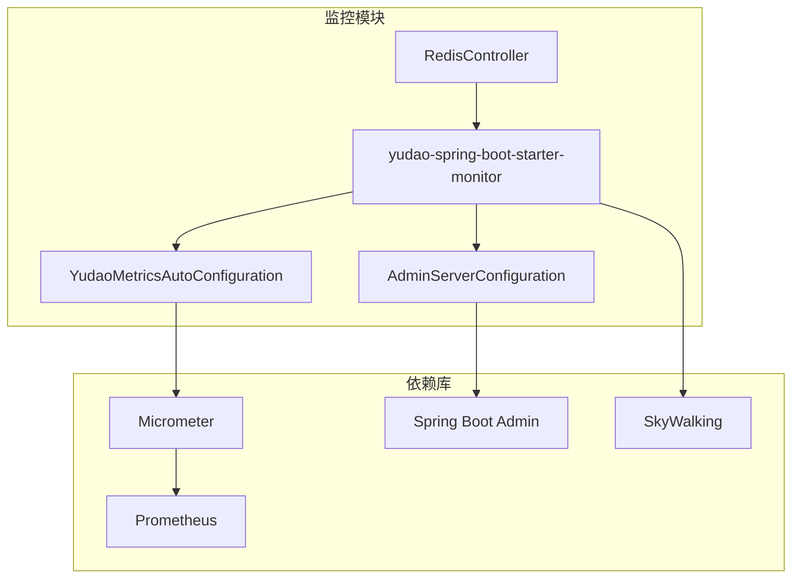
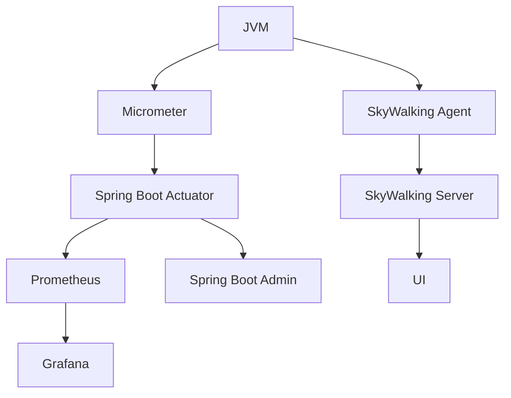
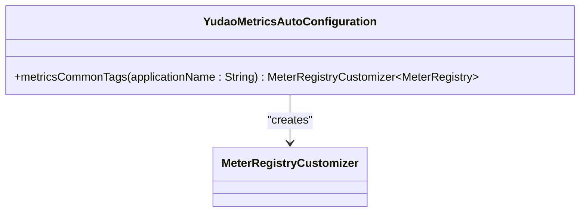
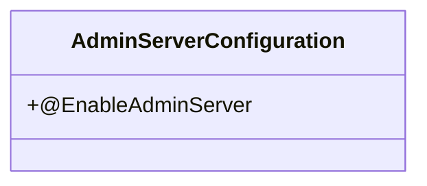
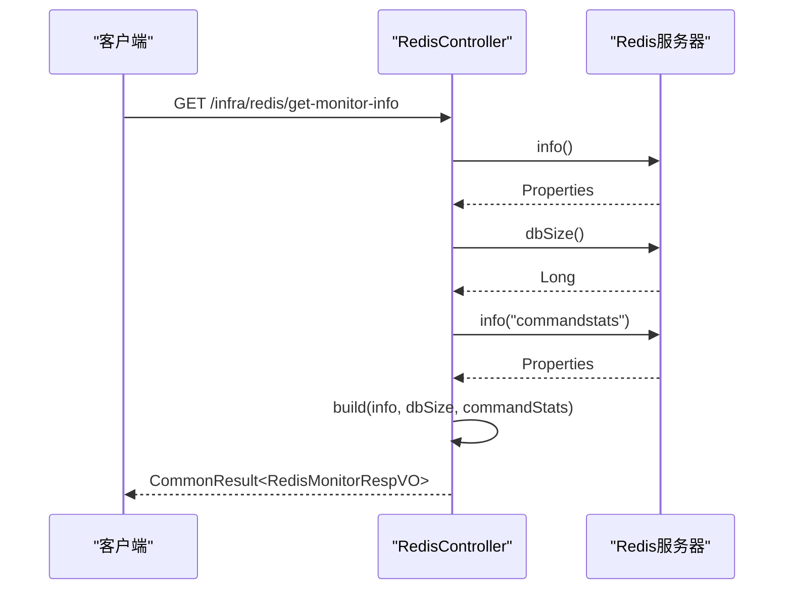
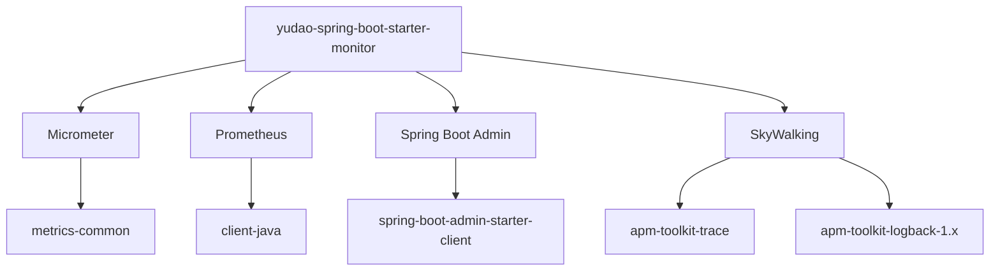

# JVM垃圾回收监控

<cite>
**本文档引用的文件**  
- [YudaoMetricsAutoConfiguration.java](file://yudao-framework/yudao-spring-boot-starter-monitor/src/main/java/cn/iocoder/yudao/framework/tracer/config/YudaoMetricsAutoConfiguration.java)
- [AdminServerConfiguration.java](file://yudao-module-infra/yudao-module-infra-biz/src/main/java/cn/iocoder/yudao/module/infra/framework/monitor/config/AdminServerConfiguration.java)
- [RedisController.java](file://yudao-module-infra/yudao-module-infra-biz/src/main/java/cn/iocoder/yudao/module/infra/controller/admin/redis/RedisController.java)
- [pom.xml](file://yudao-framework/yudao-spring-boot-starter-monitor/pom.xml)
- [《芋道 Spring Boot 监控工具 Admin 入门》.md](file://yudao-framework/yudao-spring-boot-starter-monitor/《芋道 Spring Boot 监控工具 Admin 入门》.md)
- [《芋道 Spring Boot 监控端点 Actuator 入门》.md](file://yudao-framework/yudao-spring-boot-starter-monitor/《芋道 Spring Boot 监控端点 Actuator 入门》.md)
- [《芋道 Spring Boot 链路追踪 SkyWalking 入门》.md](file://yudao-framework/yudao-spring-boot-starter-monitor/《芋道 Spring Boot 链路追踪 SkyWalking 入门》.md)
</cite>

## 目录
1. [引言](#引言)
2. [项目结构](#项目结构)
3. [核心组件](#核心组件)
4. [架构概述](#架构概述)
5. [详细组件分析](#详细组件分析)
6. [依赖分析](#依赖分析)
7. [性能考虑](#性能考虑)
8. [故障排除指南](#故障排除指南)
9. [结论](#结论)
10. [附录](#附录)（如有必要）

## 引言
本文档旨在系统讲解JVM垃圾回收（GC）监控机制，重点分析`getJvmGc`接口返回的GC性能指标。通过本项目中的监控组件，我们可以获取Young GC和Full GC的次数、耗时、频率和内存回收量等关键指标。文档将解释不同GC算法（如ZGC、G1、CMS等）的监控侧重点，提供GC性能问题的诊断方法，并给出JVM垃圾回收调优建议。同时，文档包含GC监控的告警阈值设置和性能基准参考，帮助运维和开发人员更好地理解和优化JVM性能。

## 项目结构
本项目采用模块化设计，其中JVM垃圾回收监控功能主要由`yudao-framework`下的`yudao-spring-boot-starter-monitor`模块实现。该模块集成了Micrometer、Prometheus、Spring Boot Admin和SkyWalking等监控技术，提供了全面的应用性能监控能力。

**图表来源**
- [YudaoMetricsAutoConfiguration.java](file://yudao-framework/yudao-spring-boot-starter-monitor/src/main/java/cn/iocoder/yudao/framework/tracer/config/YudaoMetricsAutoConfiguration.java)
- [AdminServerConfiguration.java](file://yudao-module-infra/yudao-module-infra-biz/src/main/java/cn/iocoder/yudao/module/infra/framework/monitor/config/AdminServerConfiguration.java)
- [RedisController.java](file://yudao-module-infra/yudao-module-infra-biz/src/main/java/cn/iocoder/yudao/module/infra/controller/admin/redis/RedisController.java)

**章节来源**
- [YudaoMetricsAutoConfiguration.java](file://yudao-framework/yudao-spring-boot-starter-monitor/src/main/java/cn/iocoder/yudao/framework/tracer/config/YudaoMetricsAutoConfiguration.java)
- [pom.xml](file://yudao-framework/yudao-spring-boot-starter-monitor/pom.xml)

## 核心组件
JVM垃圾回收监控的核心组件包括Micrometer指标收集器、Spring Boot Actuator端点和Spring Boot Admin客户端。`YudaoMetricsAutoConfiguration`类配置了Micrometer的通用标签，将应用名称作为指标的公共标签。通过集成Spring Boot Admin，我们可以集中管理和监控多个微服务实例的JVM性能指标。

**章节来源**
- [YudaoMetricsAutoConfiguration.java](file://yudao-framework/yudao-spring-boot-starter-monitor/src/main/java/cn/iocoder/yudao/framework/tracer/config/YudaoMetricsAutoConfiguration.java)
- [《芋道 Spring Boot 监控工具 Admin 入门》.md](file://yudao-framework/yudao-spring-boot-starter-monitor/《芋道 Spring Boot 监控工具 Admin 入门》.md)

## 架构概述
本项目的监控架构采用分层设计，底层使用Micrometer收集JVM和应用指标，中层通过Spring Boot Actuator暴露监控端点，上层使用Spring Boot Admin进行集中展示和管理。同时，通过SkyWalking实现分布式链路追踪，全面监控应用性能。

**图表来源**
- [YudaoMetricsAutoConfiguration.java](file://yudao-framework/yudao-spring-boot-starter-monitor/src/main/java/cn/iocoder/yudao/framework/tracer/config/YudaoMetricsAutoConfiguration.java)
- [AdminServerConfiguration.java](file://yudao-module-infra/yudao-module-infra-biz/src/main/java/cn/iocoder/yudao/module/infra/framework/monitor/config/AdminServerConfiguration.java)
- [《芋道 Spring Boot 监控端点 Actuator 入门》.md](file://yudao-framework/yudao-spring-boot-starter-monitor/《芋道 Spring Boot 监控端点 Actuator 入门》.md)

## 详细组件分析

### 监控配置分析
`YudaoMetricsAutoConfiguration`类是监控配置的核心，它通过`@ConditionalOnClass`和`@ConditionalOnProperty`注解确保在类路径中存在`MeterRegistryCustomizer`且`yudao.metrics.enable`属性为true时才启用监控配置。

#### 配置类分析

**图表来源**
- [YudaoMetricsAutoConfiguration.java](file://yudao-framework/yudao-spring-boot-starter-monitor/src/main/java/cn/iocoder/yudao/framework/tracer/config/YudaoMetricsAutoConfiguration.java)

**章节来源**
- [YudaoMetricsAutoConfiguration.java](file://yudao-framework/yudao-spring-boot-starter-monitor/src/main/java/cn/iocoder/yudao/framework/tracer/config/YudaoMetricsAutoConfiguration.java)

### 监控服务分析
`AdminServerConfiguration`类通过`@EnableAdminServer`注解启用Spring Boot Admin服务端功能，实现对微服务实例的集中监控。

#### 服务配置分析

**图表来源**
- [AdminServerConfiguration.java](file://yudao-module-infra/yudao-module-infra-biz/src/main/java/cn/iocoder/yudao/module/infra/framework/monitor/config/AdminServerConfiguration.java)

**章节来源**
- [AdminServerConfiguration.java](file://yudao-module-infra/yudao-module-infra-biz/src/main/java/cn/iocoder/yudao/module/infra/framework/monitor/config/AdminServerConfiguration.java)

### Redis监控分析
`RedisController`提供了获取Redis监控信息的接口，展示了如何通过Spring Data Redis获取Redis服务器的统计信息。

#### 接口调用流程

**图表来源**
- [RedisController.java](file://yudao-module-infra/yudao-module-infra-biz/src/main/java/cn/iocoder/yudao/module/infra/controller/admin/redis/RedisController.java)

**章节来源**
- [RedisController.java](file://yudao-module-infra/yudao-module-infra-biz/src/main/java/cn/iocoder/yudao/module/infra/controller/admin/redis/RedisController.java)

## 依赖分析
监控模块的依赖关系清晰，主要依赖Micrometer、Prometheus、Spring Boot Admin和SkyWalking等开源监控组件。这些依赖通过Maven的依赖管理机制进行版本控制，确保了监控功能的稳定性和兼容性。

**图表来源**
- [pom.xml](file://yudao-framework/yudao-spring-boot-starter-monitor/pom.xml)

**章节来源**
- [pom.xml](file://yudao-framework/yudao-spring-boot-starter-monitor/pom.xml)

## 性能考虑
在JVM垃圾回收监控中，性能考虑至关重要。Micrometer的指标收集对应用性能的影响极小，因为它采用异步和批处理的方式收集和上报指标。Spring Boot Admin的监控数据通过HTTP端点获取，建议合理设置采集间隔，避免频繁请求对应用造成额外负担。

## 故障排除指南
当遇到JVM性能问题时，可以通过以下步骤进行排查：
1. 查看Spring Boot Admin界面中的JVM内存使用情况
2. 分析GC日志，关注Young GC和Full GC的频率和耗时
3. 检查线程状态，识别潜在的线程阻塞问题
4. 使用SkyWalking分析分布式调用链路，定位性能瓶颈

**章节来源**
- [《芋道 Spring Boot 监控工具 Admin 入门》.md](file://yudao-framework/yudao-spring-boot-starter-monitor/《芋道 Spring Boot 监控工具 Admin 入门》.md)
- [《芋道 Spring Boot 链路追踪 SkyWalking 入门》.md](file://yudao-framework/yudao-spring-boot-starter-monitor/《芋道 Spring Boot 链路追踪 SkyWalking 入门》.md)

## 结论
本文档详细介绍了基于`yudao-spring-boot-starter-monitor`模块的JVM垃圾回收监控方案。通过集成Micrometer、Spring Boot Actuator、Spring Boot Admin和SkyWalking等技术，实现了全面的应用性能监控。该方案不仅能够有效监控JVM的GC行为，还能提供丰富的应用运行时指标，为性能优化和故障排查提供了有力支持。

## 附录
### 监控相关文档
- [《芋道 Spring Boot 监控工具 Admin 入门》.md](file://yudao-framework/yudao-spring-boot-starter-monitor/《芋道 Spring Boot 监控工具 Admin 入门》.md)
- [《芋道 Spring Boot 监控端点 Actuator 入门》.md](file://yudao-framework/yudao-spring-boot-starter-monitor/《芋道 Spring Boot 监控端点 Actuator 入门》.md)
- [《芋道 Spring Boot 链路追踪 SkyWalking 入门》.md](file://yudao-framework/yudao-spring-boot-starter-monitor/《芋道 Spring Boot 链路追踪 SkyWalking 入门》.md)