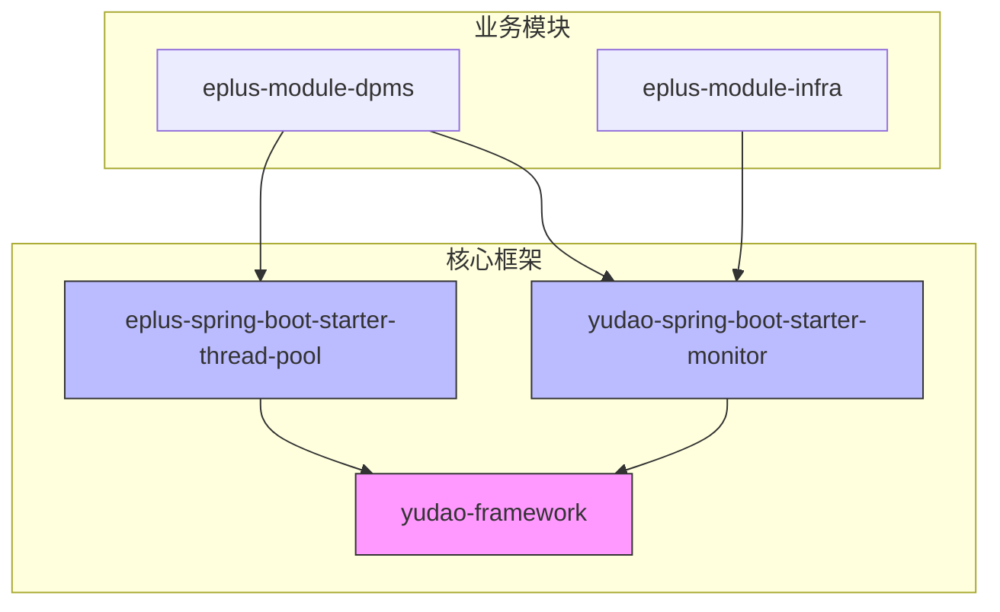
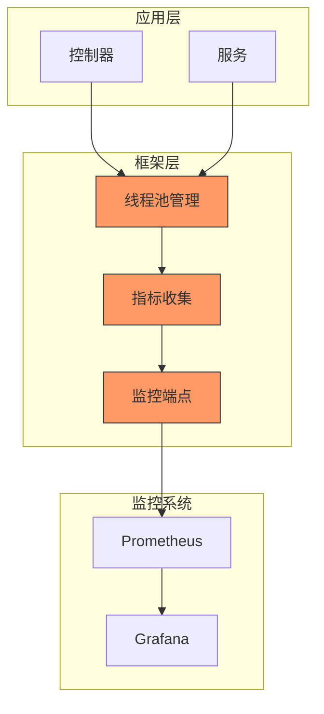
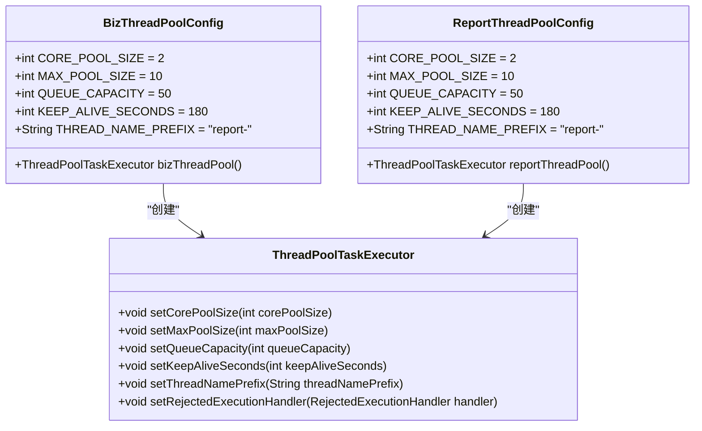
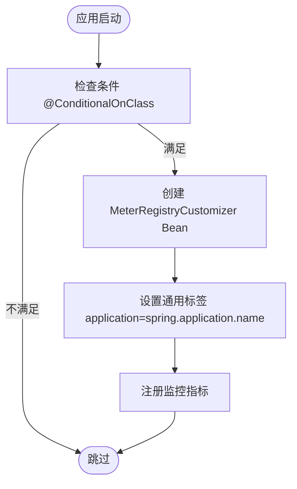
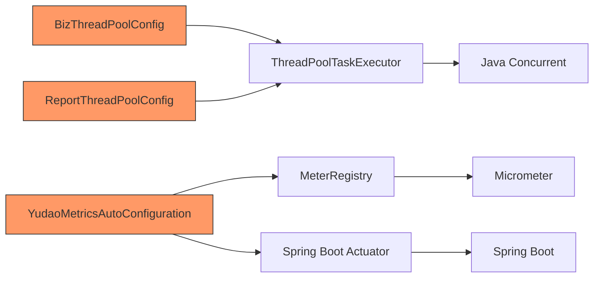

# JVM线程监控

<cite>
**本文档引用的文件**  
- [BizThreadPoolConfig.java](file://yudao-framework/eplus-spring-boot-starter-thread-pool/src/main/java/com/syj/eplus/framework/thread/pool/BizThreadPoolConfig.java)
- [ReportThreadPoolConfig.java](file://eplus-module-dpms/eplus-module-dpms-biz/src/main/java/com/syj/eplus/module/dpms/config/ReportThreadPoolConfig.java)
- [YudaoMetricsAutoConfiguration.java](file://yudao-framework/yudao-spring-boot-starter-monitor/src/main/java/cn/iocoder/yudao/framework/tracer/config/YudaoMetricsAutoConfiguration.java)
- [org.springframework.boot.autoconfigure.AutoConfiguration.imports](file://yudao-framework/eplus-spring-boot-starter-thread-pool/src/main/resources/META-INF/spring/org.springframework.boot.autoconfigure.AutoConfiguration.imports)
</cite>

## 目录
1. [引言](#引言)
2. [项目结构](#项目结构)
3. [核心组件](#核心组件)
4. [架构概述](#架构概述)
5. [详细组件分析](#详细组件分析)
6. [依赖分析](#依赖分析)
7. [性能考虑](#性能考虑)
8. [故障排除指南](#故障排除指南)
9. [结论](#结论)

## 引言
本文档旨在深入解析JVM线程监控机制，重点分析`getJvmThread`接口提供的线程统计信息。文档将详细说明线程总数、运行中线程、等待线程、阻塞线程和守护线程的监控意义，提供线程死锁检测方法和线程转储分析技巧。同时，阐述线程池监控的重要性，包括活跃线程数、队列大小和拒绝策略监控，并给出线程资源耗尽的预防措施和调优建议。

## 项目结构
本项目采用模块化架构，核心线程池配置位于`yudao-framework`模块中，具体实现分布在各个业务模块。线程监控功能通过Spring Boot Actuator和Micrometer集成实现。



**图示来源**  
- [yudao-framework](file://yudao-framework)
- [eplus-spring-boot-starter-thread-pool](file://yudao-framework/eplus-spring-boot-starter-thread-pool)
- [yudao-spring-boot-starter-monitor](file://yudao-framework/yudao-spring-boot-starter-monitor)

**章节来源**  
- [yudao-framework](file://yudao-framework)
- [eplus-module-dpms](file://eplus-module-dpms)

## 核心组件
系统中的核心线程监控组件包括：
- `BizThreadPoolConfig`：基础业务线程池配置
- `ReportThreadPoolConfig`：报表模块专用线程池配置
- `YudaoMetricsAutoConfiguration`：监控指标自动配置

这些组件共同构成了系统的线程管理和监控体系。

**章节来源**  
- [BizThreadPoolConfig.java](file://yudao-framework/eplus-spring-boot-starter-thread-pool/src/main/java/com/syj/eplus/framework/thread/pool/BizThreadPoolConfig.java)
- [ReportThreadPoolConfig.java](file://eplus-module-dpms/eplus-module-dpms-biz/src/main/java/com/syj/eplus/module/dpms/config/ReportThreadPoolConfig.java)
- [YudaoMetricsAutoConfiguration.java](file://yudao-framework/yudao-spring-boot-starter-monitor/src/main/java/cn/iocoder/yudao/framework/tracer/config/YudaoMetricsAutoConfiguration.java)

## 架构概述
系统采用分层架构设计，线程监控功能集成在框架层，通过Micrometer暴露监控指标，支持Prometheus等监控系统采集。



**图示来源**  
- [BizThreadPoolConfig.java](file://yudao-framework/eplus-spring-boot-starter-thread-pool/src/main/java/com/syj/eplus/framework/thread/pool/BizThreadPoolConfig.java)
- [YudaoMetricsAutoConfiguration.java](file://yudao-framework/yudao-spring-boot-starter-monitor/src/main/java/cn/iocoder/yudao/framework/tracer/config/YudaoMetricsAutoConfiguration.java)

## 详细组件分析

### 线程池配置分析
系统提供了两种线程池配置：通用业务线程池和专用报表线程池。

#### 线程池类图


**图示来源**  
- [BizThreadPoolConfig.java](file://yudao-framework/eplus-spring-boot-starter-thread-pool/src/main/java/com/syj/eplus/framework/thread/pool/BizThreadPoolConfig.java)
- [ReportThreadPoolConfig.java](file://eplus-module-dpms/eplus-module-dpms-biz/src/main/java/com/syj/eplus/module/dpms/config/ReportThreadPoolConfig.java)

**章节来源**  
- [BizThreadPoolConfig.java](file://yudao-framework/eplus-spring-boot-starter-thread-pool/src/main/java/com/syj/eplus/framework/thread/pool/BizThreadPoolConfig.java)
- [ReportThreadPoolConfig.java](file://eplus-module-dpms/eplus-module-dpms-biz/src/main/java/com/syj/eplus/module/dpms/config/ReportThreadPoolConfig.java)

### 监控配置分析
监控配置组件负责初始化和配置系统监控指标。

#### 监控配置流程图


**图示来源**  
- [YudaoMetricsAutoConfiguration.java](file://yudao-framework/yudao-spring-boot-starter-monitor/src/main/java/cn/iocoder/yudao/framework/tracer/config/YudaoMetricsAutoConfiguration.java)

**章节来源**  
- [YudaoMetricsAutoConfiguration.java](file://yudao-framework/yudao-spring-boot-starter-monitor/src/main/java/cn/iocoder/yudao/framework/tracer/config/YudaoMetricsAutoConfiguration.java)

## 依赖分析
系统线程监控功能依赖于多个核心组件和外部库。



**图示来源**  
- [BizThreadPoolConfig.java](file://yudao-framework/eplus-spring-boot-starter-thread-pool/src/main/java/com/syj/eplus/framework/thread/pool/BizThreadPoolConfig.java)
- [ReportThreadPoolConfig.java](file://eplus-module-dpms/eplus-module-dpms-biz/src/main/java/com/syj/eplus/module/dpms/config/ReportThreadPoolConfig.java)
- [YudaoMetricsAutoConfiguration.java](file://yudao-framework/yudao-spring-boot-starter-monitor/src/main/java/cn/iocoder/yudao/framework/tracer/config/YudaoMetricsAutoConfiguration.java)

**章节来源**  
- [BizThreadPoolConfig.java](file://yudao-framework/eplus-spring-boot-starter-thread-pool/src/main/java/com/syj/eplus/framework/thread/pool/BizThreadPoolConfig.java)
- [ReportThreadPoolConfig.java](file://eplus-module-dpms/eplus-module-dpms-biz/src/main/java/com/syj/eplus/module/dpms/config/ReportThreadPoolConfig.java)
- [YudaoMetricsAutoConfiguration.java](file://yudao-framework/yudao-spring-boot-starter-monitor/src/main/java/cn/iocoder/yudao/framework/tracer/config/YudaoMetricsAutoConfiguration.java)

## 性能考虑
### 线程池参数调优建议
根据系统负载情况，建议调整以下参数：

| 参数 | 当前值 | 建议值 | 说明 |
|------|--------|--------|------|
| 核心线程数 | 2 | 4-8 | 根据CPU核心数调整 |
| 最大线程数 | 10 | 20-50 | 根据并发需求调整 |
| 队列容量 | 50 | 100-200 | 避免任务丢失 |
| 保持活跃时间 | 180秒 | 60-300秒 | 平衡资源利用率 |

### 线程监控指标
关键监控指标包括：

| 指标 | 说明 | 告警阈值 |
|------|------|----------|
| jvm.threads.live | 活跃线程数 | >80%最大线程数 |
| jvm.threads.daemon | 守护线程数 | 异常波动 |
| jvm.threads.peak | 线程峰值 | 持续接近最大值 |
| thread.pool.active | 线程池活跃线程 | 持续高位 |
| thread.pool.queue.size | 队列大小 | 接近队列容量 |

**章节来源**  
- [BizThreadPoolConfig.java](file://yudao-framework/eplus-spring-boot-starter-thread-pool/src/main/java/com/syj/eplus/framework/thread/pool/BizThreadPoolConfig.java)
- [ReportThreadPoolConfig.java](file://eplus-module-dpms/eplus-module-dpms-biz/src/main/java/com/syj/eplus/module/dpms/config/ReportThreadPoolConfig.java)

## 故障排除指南
### 线程死锁检测
使用以下命令检测线程死锁：
```bash
# 获取线程转储
jstack <pid> > thread_dump.txt

# 或使用JMX
jcmd <pid> Thread.print
```

### 常见问题及解决方案
| 问题现象 | 可能原因 | 解决方案 |
|---------|---------|---------|
| 线程数持续增长 | 线程泄漏 | 检查线程池关闭逻辑 |
| 任务处理延迟 | 队列积压 | 增加核心线程数或队列容量 |
| 拒绝任务过多 | 负载过高 | 优化拒绝策略或扩容 |
| CPU使用率高 | 线程竞争 | 优化同步代码或减少线程数 |

**章节来源**  
- [BizThreadPoolConfig.java](file://yudao-framework/eplus-spring-boot-starter-thread-pool/src/main/java/com/syj/eplus/framework/thread/pool/BizThreadPoolConfig.java)
- [ReportThreadPoolConfig.java](file://eplus-module-dpms/eplus-module-dpms-biz/src/main/java/com/syj/eplus/module/dpms/config/ReportThreadPoolConfig.java)

## 结论
本文档详细分析了系统的JVM线程监控机制，包括线程池配置、监控指标收集和性能调优建议。通过合理配置线程池参数和监控关键指标，可以有效预防线程资源耗尽问题，确保系统稳定运行。建议定期检查线程状态，及时发现和解决潜在的线程问题。