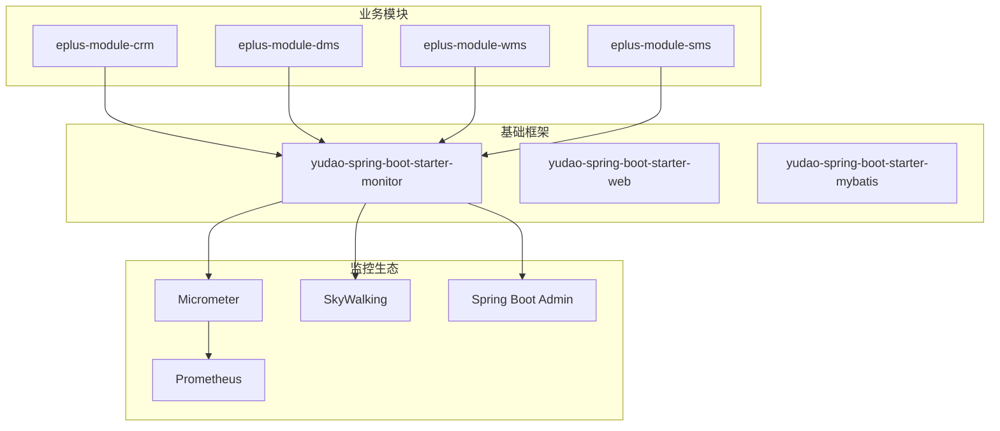
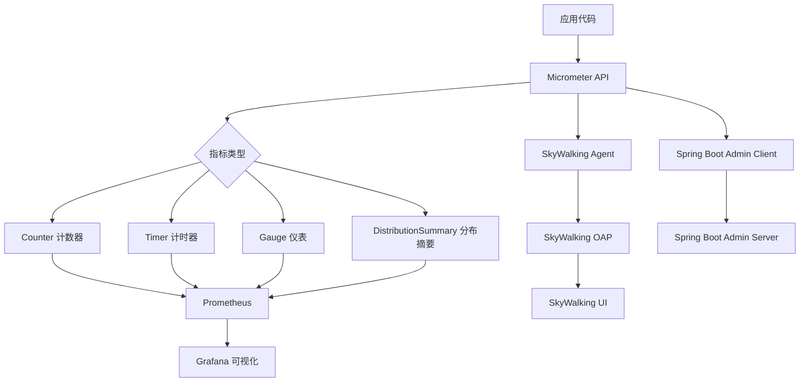
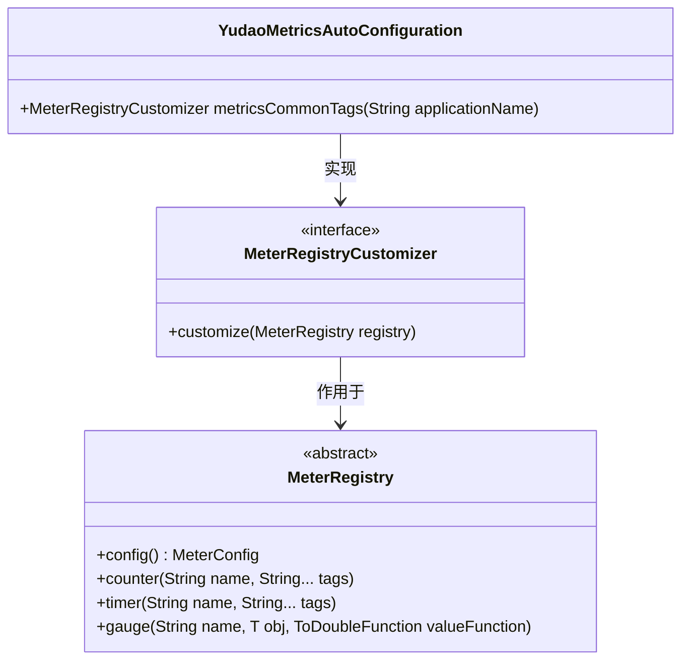
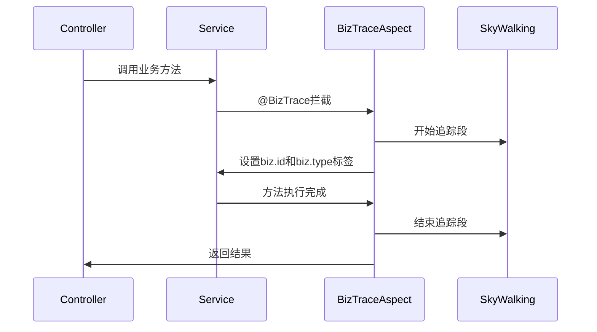
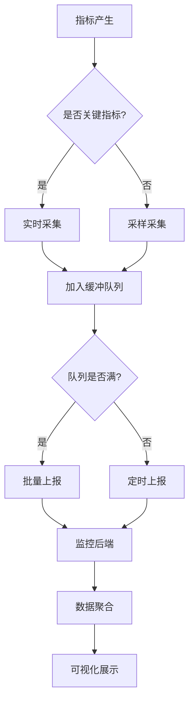

# 指标采集方法

<cite>
**本文档引用文件**  
- [YudaoMetricsAutoConfiguration.java](file://yudao-framework/yudao-spring-boot-starter-monitor/src/main/java/cn/iocoder/yudao/framework/tracer/config/YudaoMetricsAutoConfiguration.java)
- [BizTrace.java](file://yudao-framework/yudao-spring-boot-starter-monitor/src/main/java/cn/iocoder/yudao/framework/tracer/core/annotation/BizTrace.java)
- [yudao-spring-boot-starter-monitor/pom.xml](file://yudao-framework/yudao-spring-boot-starter-monitor/pom.xml)
- [eplus-spring-boot-starter-thread-pool/BizThreadPoolConfig.java](file://eplus-framework/eplus-spring-boot-starter-thread-pool/src/main/java/com/syj/eplus/framework/thread/pool/BizThreadPoolConfig.java)
</cite>

## 目录
1. [引言](#引言)
2. [项目结构](#项目结构)
3. [核心组件](#核心组件)
4. [架构概述](#架构概述)
5. [详细组件分析](#详细组件分析)
6. [依赖分析](#依赖分析)
7. [性能考虑](#性能考虑)
8. [故障排除指南](#故障排除指南)
9. [结论](#结论)

## 引言
本文档详细介绍了在Spring Boot应用中实现业务指标采集的方法和技术。通过分析项目中的监控组件，重点阐述了如何使用注解和编程方式注册指标采集器，以及在不同层级（Service、Controller、DAO）的指标埋点策略。同时，文档还探讨了异步与同步采集的权衡、批量采集对系统性能的影响，并提供了关键业务指标的具体采集示例。

## 项目结构
该项目采用模块化架构设计，包含多个业务模块（如CRM、DMS、WMS等）和基础框架模块。监控功能主要集中在`yudao-framework`模块下的`yudao-spring-boot-starter-monitor`组件中，该组件集成了Micrometer、SkyWalking等主流监控工具，为整个系统提供统一的指标采集能力。



**图表来源**  
- [yudao-spring-boot-starter-monitor/pom.xml](file://yudao-framework/yudao-spring-boot-starter-monitor/pom.xml)

**章节来源**  
- [yudao-spring-boot-starter-monitor/pom.xml](file://yudao-framework/yudao-spring-boot-starter-monitor/pom.xml)

## 核心组件
本项目的核心监控组件基于Micrometer实现，通过`YudaoMetricsAutoConfiguration`配置类完成自动装配。系统利用`@BizTrace`注解在方法级别进行业务追踪标记，结合SkyWalking实现分布式链路追踪。同时，通过Spring Boot Actuator暴露`/actuator/metrics`端点，支持Prometheus抓取指标数据。

**章节来源**  
- [YudaoMetricsAutoConfiguration.java](file://yudao-framework/yudao-spring-boot-starter-monitor/src/main/java/cn/iocoder/yudao/framework/tracer/config/YudaoMetricsAutoConfiguration.java)
- [BizTrace.java](file://yudao-framework/yudao-spring-boot-starter-monitor/src/main/java/cn/iocoder/yudao/framework/tracer/core/annotation/BizTrace.java)

## 架构概述
系统采用分层监控架构，从应用层到基础设施层全面覆盖。在应用层，通过Micrometer提供统一的指标API；在传输层，支持多种监控后端（Prometheus、SkyWalking等）；在展示层，集成Spring Boot Admin和Prometheus+Grafana方案，实现可视化监控。



**图表来源**  
- [yudao-spring-boot-starter-monitor/pom.xml](file://yudao-framework/yudao-spring-boot-starter-monitor/pom.xml)
- [YudaoMetricsAutoConfiguration.java](file://yudao-framework/yudao-spring-boot-starter-monitor/src/main/java/cn/iocoder/yudao/framework/tracer/config/YudaoMetricsAutoConfiguration.java)

## 详细组件分析

### 指标采集配置分析
系统通过`YudaoMetricsAutoConfiguration`类配置Micrometer，为所有指标添加统一的标签（如应用名称），便于多实例环境下的指标区分和聚合。



**图表来源**  
- [YudaoMetricsAutoConfiguration.java](file://yudao-framework/yudao-spring-boot-starter-monitor/src/main/java/cn/iocoder/yudao/framework/tracer/config/YudaoMetricsAutoConfiguration.java)

**章节来源**  
- [YudaoMetricsAutoConfiguration.java](file://yudao-framework/yudao-spring-boot-starter-monitor/src/main/java/cn/iocoder/yudao/framework/tracer/config/YudaoMetricsAutoConfiguration.java)

### 业务追踪注解分析
`@BizTrace`注解用于标记需要追踪的业务方法，通过AOP切面自动采集业务编号和业务类型等上下文信息，并注入到SkyWalking追踪链路中。



**图表来源**  
- [BizTrace.java](file://yudao-framework/yudao-spring-boot-starter-monitor/src/main/java/cn/iocoder/yudao/framework/tracer/core/annotation/BizTrace.java)

**章节来源**  
- [BizTrace.java](file://yudao-framework/yudao-spring-boot-starter-monitor/src/main/java/cn/iocoder/yudao/framework/tracer/core/annotation/BizTrace.java)

## 依赖分析
系统通过Maven依赖管理集成了完整的监控生态。核心依赖包括Micrometer作为指标采集标准，SkyWalking作为分布式追踪解决方案，以及Spring Boot Admin作为应用监控管理平台。

```mermaid
erDiagram
MICROMETER ||--o{ PROMETHEUS : "支持"
MICROMETER ||--o{ SKYWALKING : "集成"
MICROMETER ||--o{ SPRING_BOOT_ADMIN : "客户端"
SPRING_BOOT_ADMIN ||--o{ CLIENT : "监控"
SKYWALKING ||--o{ OAP_SERVER : "数据处理"
OAP_SERVER ||--o{ STORAGE : "存储"
STORAGE ||--o{ UI : "展示"
class MICROMETER {
指标采集引擎
}
class PROMETHEUS {
时序数据库
}
class SKYWALKING {
APM系统
}
class SPRING_BOOT_ADMIN {
监控管理平台
}
```

**图表来源**  
- [yudao-spring-boot-starter-monitor/pom.xml](file://yudao-framework/yudao-spring-boot-starter-monitor/pom.xml)

**章节来源**  
- [yudao-spring-boot-starter-monitor/pom.xml](file://yudao-framework/yudao-spring-boot-starter-monitor/pom.xml)

## 性能考虑
在指标采集过程中，需要权衡监控粒度与系统性能。系统通过以下方式优化性能影响：
1. 使用异步线程池处理监控数据上报
2. 合理设置采样率，避免过度采集
3. 批量上报指标数据，减少网络开销
4. 为关键指标设置采集频率控制



**图表来源**  
- [eplus-spring-boot-starter-thread-pool/BizThreadPoolConfig.java](file://eplus-framework/eplus-spring-boot-starter-thread-pool/src/main/java/com/syj/eplus/framework/thread/pool/BizThreadPoolConfig.java)

**章节来源**  
- [eplus-spring-boot-starter-thread-pool/BizThreadPoolConfig.java](file://eplus-framework/eplus-spring-boot-starter-thread-pool/src/main/java/com/syj/eplus/framework/thread/pool/BizThreadPoolConfig.java)

## 故障排除指南
当遇到指标采集问题时，可按以下步骤排查：
1. 检查`yudao.metrics.enable`配置是否启用
2. 验证Micrometer相关依赖是否正确引入
3. 确认监控端点（如/actuator/metrics）是否可访问
4. 检查网络连接是否正常
5. 查看日志中是否有相关错误信息

**章节来源**  
- [YudaoMetricsAutoConfiguration.java](file://yudao-framework/yudao-spring-boot-starter-monitor/src/main/java/cn/iocoder/yudao/framework/tracer/config/YudaoMetricsAutoConfiguration.java)
- [yudao-spring-boot-starter-monitor/pom.xml](file://yudao-framework/yudao-spring-boot-starter-monitor/pom.xml)

## 结论
本项目通过集成Micrometer和SkyWalking等成熟监控组件，构建了完善的指标采集体系。通过注解方式简化了指标埋点操作，同时提供了灵活的配置选项来平衡监控需求与系统性能。建议在实际使用中根据业务重要性设置不同的采集策略，避免对系统造成不必要的性能负担。