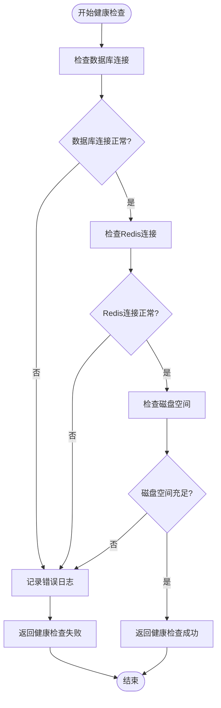
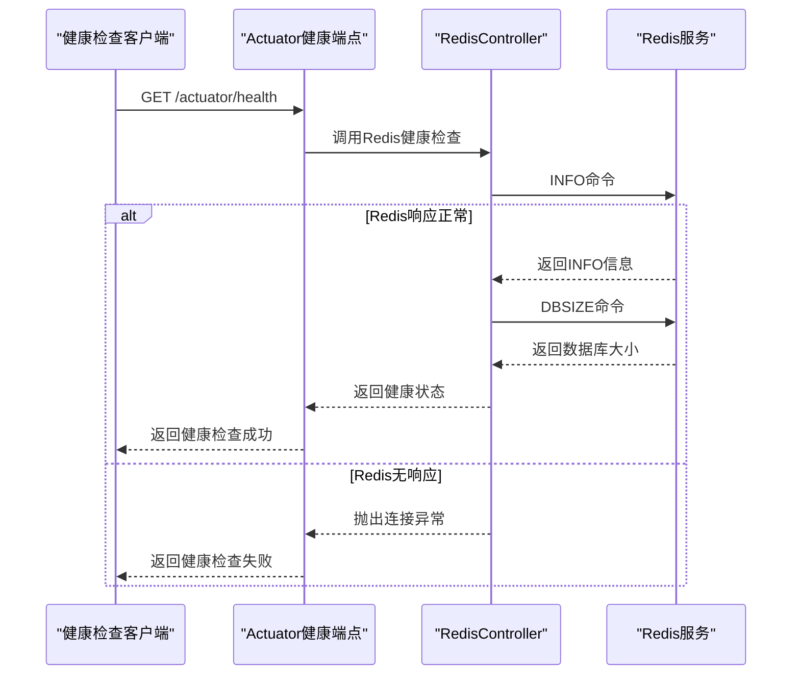
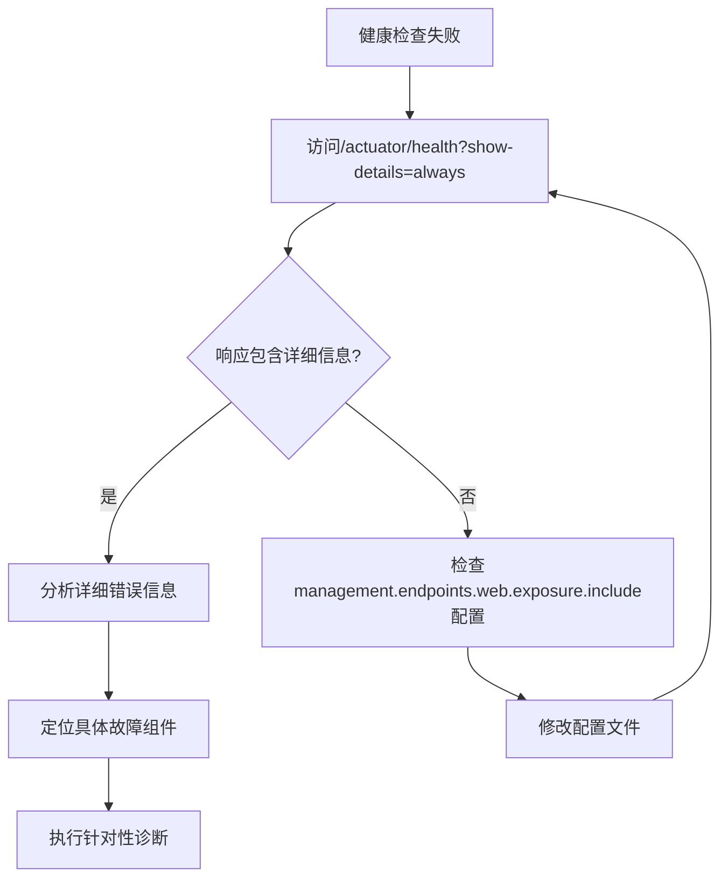
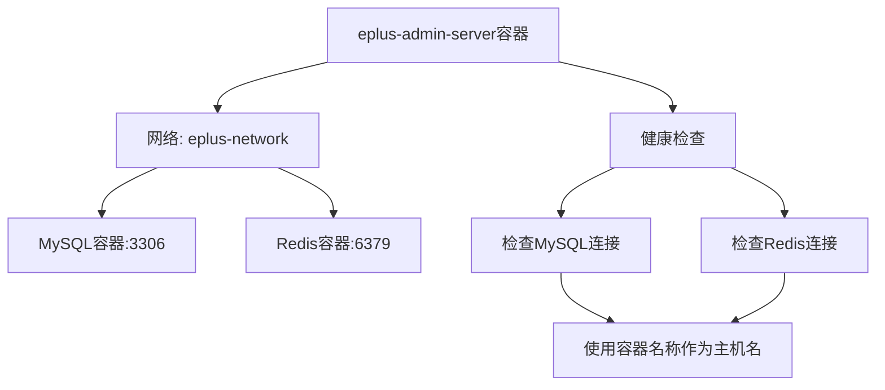

# 健康检查故障排查

<cite>
**本文档引用文件**   
- [application.yaml](file://yudao-server/src/main/resources/application.yaml)
- [application-prod.yaml](file://yudao-server/src/main/resources/application-prod.yaml)
- [RedisController.java](file://yudao-module-infra/yudao-module-infra-biz/src/main/java/cn/iocoder/yudao/module/infra/controller/admin/redis/RedisController.java)
- [RedisMonitorRespVO.java](file://yudao-module-infra/yudao-module-infra-biz/src/main/java/cn/iocoder/yudao/module/infra/controller/admin/redis/vo/RedisMonitorRespVO.java)
- [docker-compose.yml](file://docker-compose.yml)
- [DataSourceConfigServiceImpl.java](file://yudao-module-infra/yudao-module-infra-biz/src/main/java/cn/iocoder/yudao/module/infra/service/db/DataSourceConfigServiceImpl.java)
- [JdbcUtils.java](file://yudao-framework/yudao-spring-boot-starter-mybatis/src/main/java/cn/iocoder/yudao/framework/mybatis/core/util/JdbcUtils.java)
</cite>

## 目录
1. [引言](#引言)
2. [健康检查配置分析](#健康检查配置分析)
3. [常见健康检查失败场景](#常见健康检查失败场景)
4. [分步诊断流程](#分步诊断流程)
5. [容器化环境中的健康检查](#容器化环境中的健康检查)
6. [结论](#结论)

## 引言
本文档旨在为eplus-admin-server系统提供全面的健康检查故障排查指南。通过系统性地分析健康检查失败的常见原因及解决方案，帮助运维和开发人员快速定位和解决健康检查相关问题。文档涵盖了网络连接问题、数据库连接池耗尽、Redis服务不可用、外部API超时等典型场景，并提供详细的诊断流程和工具使用方法。

## 健康检查配置分析

本文档的健康检查功能基于Spring Boot Actuator实现，相关配置主要位于`application-prod.yaml`文件中。从配置文件可以看出，系统启用了Actuator监控端点，将基础路径设置为`/actuator`，并开放了所有端点（通过`include: '*'`配置），这使得健康检查端点`/actuator/health`可以被访问。

```mermaid
graph TD
A[客户端] --> B[/actuator/health]
B --> C{健康检查组件}
C --> D[数据库连接检查]
C --> E[Redis连接检查]
C --> F[磁盘空间检查]
C --> G[自定义健康检查]
D --> H[DataSourceConfigServiceImpl]
E --> I[RedisController]
H --> J[JdbcUtils]
I --> K[StringRedisTemplate]
```

**图示来源**
- [application-prod.yaml](file://yudao-server/src/main/resources/application-prod.yaml#L137-L158)
- [DataSourceConfigServiceImpl.java](file://yudao-module-infra/yudao-module-infra-biz/src/main/java/cn/iocoder/yudao/module/infra/service/db/DataSourceConfigServiceImpl.java)
- [RedisController.java](file://yudao-module-infra/yudao-module-infra-biz/src/main/java/cn/iocoder/yudao/module/infra/controller/admin/redis/RedisController.java)

**本节来源**
- [application-prod.yaml](file://yudao-server/src/main/resources/application-prod.yaml#L137-L158)
- [application.yaml](file://yudao-server/src/main/resources/application.yaml)

## 常见健康检查失败场景

### 数据库连接问题
数据库连接问题是健康检查失败的常见原因之一。系统通过`DataSourceConfigServiceImpl`服务类管理数据源配置，并使用`JdbcUtils`工具类验证数据库连接的可用性。当数据库服务不可用、网络连接中断或数据库凭证错误时，健康检查将失败。



**图示来源**
- [DataSourceConfigServiceImpl.java](file://yudao-module-infra/yudao-module-infra-biz/src/main/java/cn/iocoder/yudao/module/infra/service/db/DataSourceConfigServiceImpl.java)
- [JdbcUtils.java](file://yudao-framework/yudao-spring-boot-starter-mybatis/src/main/java/cn/iocoder/yudao/framework/mybatis/core/util/JdbcUtils.java)

**本节来源**
- [DataSourceConfigServiceImpl.java](file://yudao-module-infra/yudao-module-infra-biz/src/main/java/cn/iocoder/yudao/module/infra/service/db/DataSourceConfigServiceImpl.java)
- [JdbcUtils.java](file://yudao-framework/yudao-spring-boot-starter-mybatis/src/main/java/cn/iocoder/yudao/framework/mybatis/core/util/JdbcUtils.java)

### Redis服务不可用
Redis作为系统的重要缓存组件，其可用性直接影响健康检查结果。系统通过`RedisController`提供的`/infra/redis/get-monitor-info`接口获取Redis监控信息，当Redis服务不可达或响应超时时，健康检查将失败。



**图示来源**
- [RedisController.java](file://yudao-module-infra/yudao-module-infra-biz/src/main/java/cn/iocoder/yudao/module/infra/controller/admin/redis/RedisController.java)
- [RedisMonitorRespVO.java](file://yudao-module-infra/yudao-module-infra-biz/src/main/java/cn/iocoder/yudao/module/infra/controller/admin/redis/vo/RedisMonitorRespVO.java)

**本节来源**
- [RedisController.java](file://yudao-module-infra/yudao-module-infra-biz/src/main/java/cn/iocoder/yudao/module/infra/controller/admin/redis/RedisController.java)
- [application.yaml](file://yudao-server/src/main/resources/application.yaml#L105-L111)

### 外部API超时
系统可能依赖多个外部API服务，当这些服务响应超时或不可用时，会影响整体健康状态。虽然当前代码库中未直接体现外部API健康检查的具体实现，但根据系统架构，这类问题通常通过配置超时时间和重试机制来处理。

## 分步诊断流程

### 查看/actuator/health详细输出
当健康检查失败时，第一步是访问`/actuator/health`端点获取详细信息。通过设置`show-details`参数，可以获得更详细的故障信息。



**本节来源**
- [application-prod.yaml](file://yudao-server/src/main/resources/application-prod.yaml#L146)

### 分析日志文件
系统日志是诊断健康检查问题的重要资源。根据`application-prod.yaml`中的配置，日志文件存储在`${user.home}/logs/${spring.application.name}.log`路径下。应重点关注以下日志信息：
- 数据库连接错误
- Redis连接异常
- 网络超时错误
- 内存溢出异常

**本节来源**
- [application-prod.yaml](file://yudao-server/src/main/resources/application-prod.yaml#L160-L182)

### 使用show-details参数获取详细信息
通过在健康检查端点URL中添加`show-details=always`参数，可以获取详细的健康信息，这对于定位具体问题非常有帮助。

**本节来源**
- [application-prod.yaml](file://yudao-server/src/main/resources/application-prod.yaml#L146)

## 容器化环境中的健康检查

### Docker环境配置
系统通过`docker-compose.yml`文件定义了MySQL和Redis服务的容器化部署。在容器化环境中进行健康检查时，需要特别注意网络配置和端口映射。



**图示来源**
- [docker-compose.yml](file://docker-compose.yml)

**本节来源**
- [docker-compose.yml](file://docker-compose.yml)
- [application-prod.yaml](file://yudao-server/src/main/resources/application-prod.yaml#L65-L71)

### Kubernetes环境注意事项
虽然当前项目未提供Kubernetes配置文件，但在Kubernetes环境中进行健康检查时，需要注意以下事项：
- 配置适当的liveness和readiness探针
- 设置合理的超时和重试参数
- 考虑Pod间的网络策略
- 监控资源使用情况

## 结论
健康检查是确保系统稳定运行的重要机制。通过本文档提供的故障排查指南，可以系统性地诊断和解决健康检查失败问题。建议定期检查健康检查配置，监控关键组件的运行状态，并建立完善的告警机制，以确保系统的高可用性。