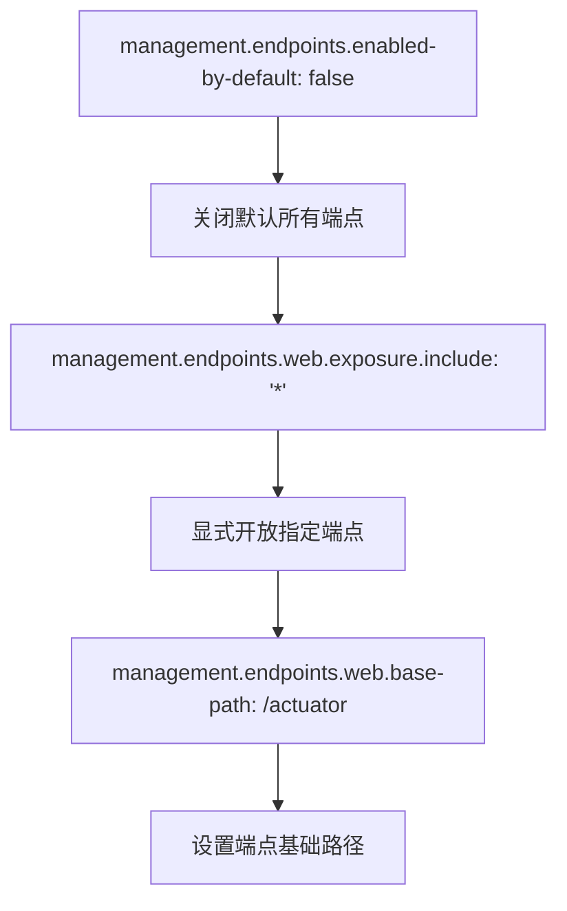
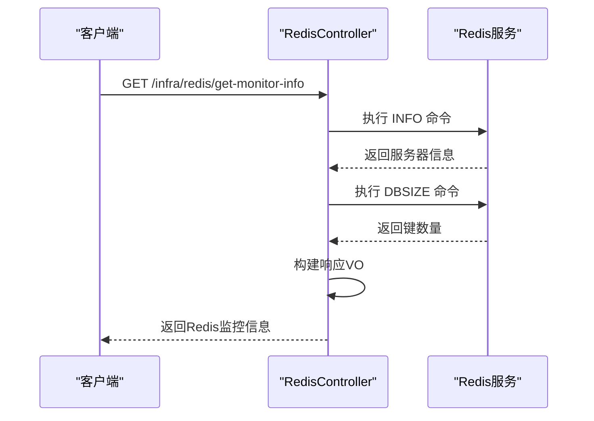
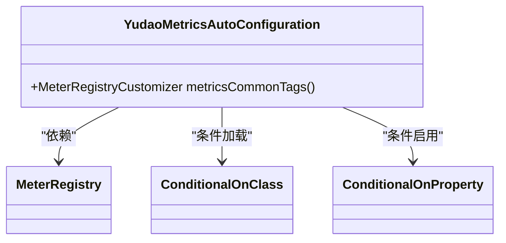
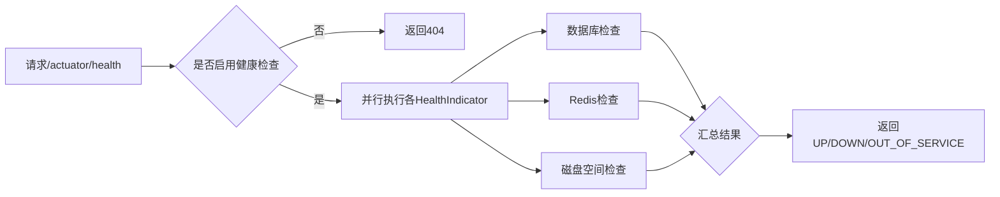

# 系统组件健康检查

<cite>
**本文档引用文件**  
- [application-prod.yaml](file://yudao-server/src/main/resources/application-prod.yaml)
- [application.yaml](file://yudao-server/src/main/resources/application.yaml)
- [YudaoMetricsAutoConfiguration.java](file://yudao-framework/yudao-spring-boot-starter-monitor/src/main/java/cn/iocoder/yudao/framework/tracer/config/YudaoMetricsAutoConfiguration.java)
- [AdminServerConfiguration.java](file://yudao-module-infra/yudao-module-infra-biz/src/main/java/cn/iocoder/yudao/module/infra/framework/monitor/config/AdminServerConfiguration.java)
- [RedisController.java](file://yudao-module-infra/yudao-module-infra-biz/src/main/java/cn/iocoder/yudao/module/infra/controller/admin/redis/RedisController.java)
- [RedisConvert.java](file://yudao-module-infra/yudao-module-infra-biz/src/main/java/cn/iocoder/yudao/module/infra/convert/redis/RedisConvert.java)
- [RedisMonitorRespVO.java](file://yudao-module-infra/yudao-module-infra-biz/src/main/java/cn/iocoder/yudao/module/infra/controller/admin/redis/vo/RedisMonitorRespVO.java)
</cite>

## 目录
1. [引言](#引言)
2. [健康检查端点配置](#健康检查端点配置)
3. [核心组件健康检查机制](#核心组件健康检查机制)
4. [健康状态判定标准](#健康状态判定标准)
5. [自动配置原理](#自动配置原理)
6. [安全访问配置](#安全访问配置)
7. [执行流程与触发时机](#执行流程与触发时机)

## 引言

系统组件健康检查是保障微服务稳定运行的重要机制。本文档详细阐述Spring Boot Actuator中`/actuator/health`端点的实现机制，涵盖数据库连接、Redis连接、磁盘空间等核心组件的健康检查逻辑，解释UP、OUT_OF_SERVICE、DOWN三种状态的判定标准和业务影响，并说明健康检查的自动配置原理与安全访问策略。

## 健康检查端点配置

在生产环境中，通过`application-prod.yaml`文件对Actuator监控端点进行配置，确保仅暴露必要的监控接口并设置访问安全。



**端点来源**  
- [application-prod.yaml](file://yudao-server/src/main/resources/application-prod.yaml#L140-L147)

**配置说明**：
- `enabled-by-default: false`：默认关闭所有监控端点，提升安全性。
- `exposure.include: '*'`：显式开放所有端点（可按需调整为`health,info`等）。
- `base-path: /actuator`：将健康检查端点挂载在`/actuator/health`路径下。

## 核心组件健康检查机制

### 数据库健康检查
系统通过Spring Boot内置的`DataSourceHealthIndicator`自动检测数据库连接状态。当应用启动或运行时，会尝试执行配置的`validation-query`（如`SELECT 1 FROM DUAL`）来验证数据库连接可用性。

### Redis健康检查
系统提供了自定义的Redis监控控制器，用于获取Redis服务的详细运行状态。



**序列图来源**  
- [RedisController.java](file://yudao-module-infra/yudao-module-infra-biz/src/main/java/cn/iocoder/yudao/module/infra/controller/admin/redis/RedisController.java#L32-L40)
- [RedisConvert.java](file://yudao-module-infra/yudao-module-infra-biz/src/main/java/cn/iocoder/yudao/module/infra/convert/redis/RedisConvert.java#L16-L26)

### 磁盘空间健康检查
Spring Boot Actuator默认包含`DiskSpaceHealthIndicator`，用于监控应用运行目录的磁盘使用情况。可通过配置项调整阈值：

```yaml
management:
  health:
    diskspace:
      enabled: true
      threshold: 10MB # 最小可用空间
```

## 健康状态判定标准

| 状态 | 判定条件 | 业务影响 |
|------|--------|--------|
| UP | 所有健康检查项均通过 | 服务正常，可接收流量 |
| OUT_OF_SERVICE | 部分非关键组件异常或服务主动下线 | 服务不可用，但实例仍运行 |
| DOWN | 关键组件（如数据库、Redis）连接失败 | 服务中断，需立即告警处理 |

**状态来源**  
- [YudaoMetricsAutoConfiguration.java](file://yudao-framework/yudao-spring-boot-starter-monitor/src/main/java/cn/iocoder/yudao/framework/tracer/config/YudaoMetricsAutoConfiguration.java#L16-L27)

## 自动配置原理

健康检查功能基于Spring Boot的自动配置机制实现。系统通过`@ConditionalOnClass`和`@ConditionalOnProperty`注解控制配置类的加载条件。



**类图来源**  
- [YudaoMetricsAutoConfiguration.java](file://yudao-framework/yudao-spring-boot-starter-monitor/src/main/java/cn/iocoder/yudao/framework/tracer/config/YudaoMetricsAutoConfiguration.java)

## 安全访问配置

为保障生产环境安全，健康检查端点需配置访问控制策略：

```yaml
# application.yaml
management:
  endpoints:
    web:
      exposure:
        include: health,info
  endpoint:
    health:
      show-details: never # 不显示详细信息
  security:
    enabled: true
```

同时，系统集成Spring Security，通过权限注解`@PreAuthorize`控制访问：

```java
@PreAuthorize("@ss.hasPermission('infra:redis:get-monitor-info')")
public CommonResult<RedisMonitorRespVO> getRedisMonitorInfo()
```

**安全来源**  
- [RedisController.java](file://yudao-module-infra/yudao-module-infra-biz/src/main/java/cn/iocoder/yudao/module/infra/controller/admin/redis/RedisController.java#L31)

## 执行流程与触发时机

### 触发时机
- **系统启动时**：Spring Boot启动过程中自动执行健康检查
- **运行时**：通过HTTP请求`/actuator/health`手动触发
- **定时任务**：配合Spring Boot Admin定期轮询健康状态

### 执行流程


**流程来源**  
- [application-prod.yaml](file://yudao-server/src/main/resources/application-prod.yaml#L140-L147)
- [YudaoMetricsAutoConfiguration.java](file://yudao-framework/yudao-spring-boot-starter-monitor/src/main/java/cn/iocoder/yudao/framework/tracer/config/YudaoMetricsAutoConfiguration.java)