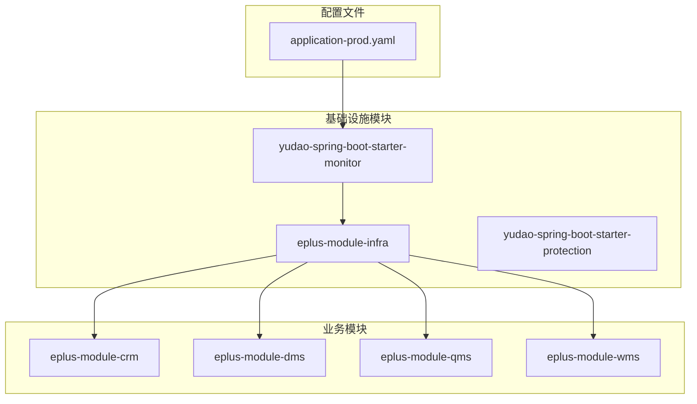
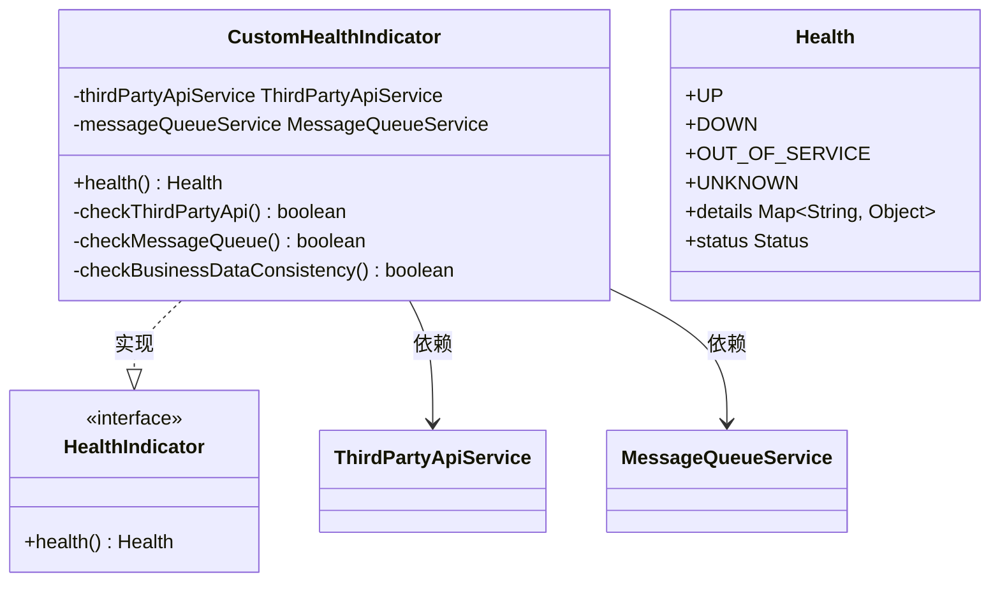
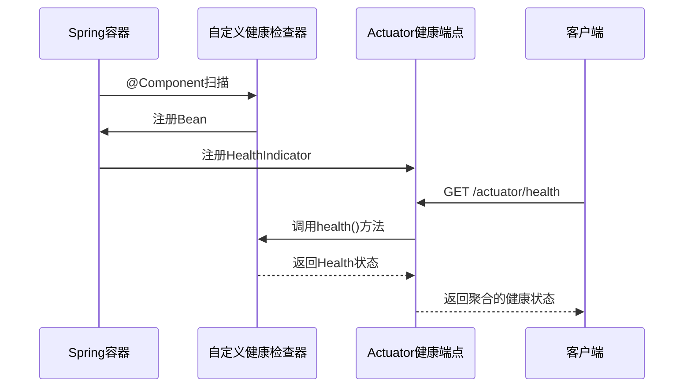
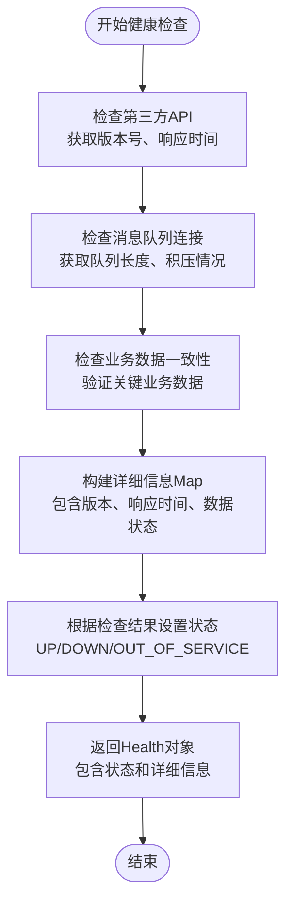
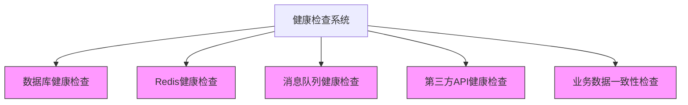
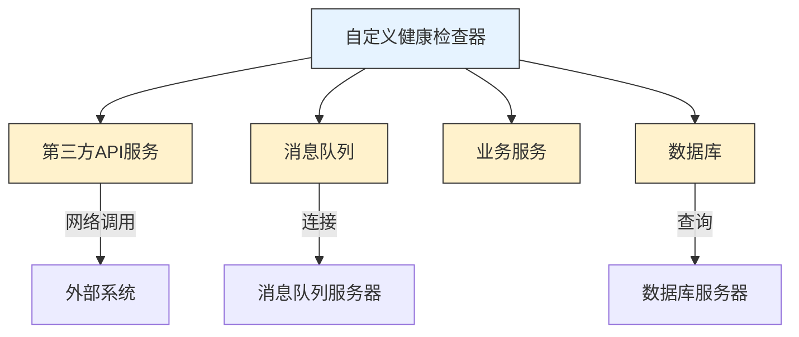

# 自定义健康检查器

<cite>
**本文档引用的文件**  
- [application-prod.yaml](file://yudao-server/src/main/resources/application-prod.yaml#L137-L158)
- [YudaoMetricsAutoConfiguration.java](file://yudao-framework/yudao-spring-boot-starter-monitor/src/main/java/cn/iocoder/yudao/framework/tracer/config/YudaoMetricsAutoConfiguration.java)
- [AdminServerConfiguration.java](file://yudao-module-infra/yudao-module-infra-biz/src/main/java/cn/iocoder/yudao/module/infra/framework/monitor/config/AdminServerConfiguration.java)
</cite>

## 目录
1. [引言](#引言)
2. [项目结构](#项目结构)
3. [核心组件](#核心组件)
4. [架构概述](#架构概述)
5. [详细组件分析](#详细组件分析)
6. [依赖分析](#依赖分析)
7. [性能考虑](#性能考虑)
8. [故障排除指南](#故障排除指南)
9. [结论](#结论)
10. [附录](#附录)（如有必要）

## 引言
本文档旨在提供开发自定义健康检查器的详细实现指南。通过分析现有Spring Boot项目中的监控配置和实现模式，说明如何实现HealthIndicator接口来创建业务特定的健康检查器，例如检查第三方API服务、消息队列连接或业务数据一致性。文档将展示如何注册自定义健康检查器到Spring容器，并在/actuator/health端点中暴露，以及如何根据业务需求返回详细的健康信息（如版本号、服务响应时间）。同时，阐述健康检查器的依赖关系管理策略，避免因检查器自身问题导致系统误判。

## 项目结构
本项目采用模块化架构设计，包含多个业务模块（如eplus-module-*）和基础框架模块（yudao-framework）。健康检查功能主要依赖于Spring Boot Actuator和Spring Boot Admin组件，相关配置分散在不同模块中。核心监控功能由yudao-spring-boot-starter-monitor模块提供，而具体的健康检查实现可能分布在各个业务模块中。



**图表来源**  
- [application-prod.yaml](file://yudao-server/src/main/resources/application-prod.yaml#L137-L158)

**章节来源**  
- [application-prod.yaml](file://yudao-server/src/main/resources/application-prod.yaml#L137-L158)

## 核心组件
项目中的健康检查功能主要依赖于Spring Boot Actuator提供的监控端点和Spring Boot Admin的可视化管理界面。通过配置文件中的management.endpoints.web.exposure.include属性设置为'*'，开放了所有监控端点，包括health端点。Resilience4j的限流器配置中包含register-health-indicator: true，表明限流组件已注册到健康监测系统。

**章节来源**  
- [application-prod.yaml](file://yudao-server/src/main/resources/application-prod.yaml#L137-L158)

## 架构概述
系统的健康检查架构基于Spring Boot Actuator和Spring Boot Admin构建。Actuator提供底层的健康检查端点，而Spring Boot Admin提供统一的监控界面。项目通过yudao-spring-boot-starter-monitor模块集成这些功能，并在各个业务模块中实现具体的健康检查逻辑。

```mermaid
graph TD
Client[客户端] --> |访问| Actuator[/actuator/health]
Actuator --> HealthIndicators[Health Indicators]
HealthIndicators --> Database[数据库检查]
HealthIndicators --> Redis[Redis检查]
HealthIndicators --> MQ[消息队列检查]
HealthIndicators --> Custom[自定义业务检查]
SpringBootAdmin[Spring Boot Admin] --> |收集| Actuator
SpringBootAdmin --> UI[监控界面]
```

**图表来源**  
- [application-prod.yaml](file://yudao-server/src/main/resources/application-prod.yaml#L137-L158)
- [AdminServerConfiguration.java](file://yudao-module-infra/yudao-module-infra-biz/src/main/java/cn/iocoder/yudao/module/infra/framework/monitor/config/AdminServerConfiguration.java)

## 详细组件分析
### 自定义健康检查器实现
要实现自定义健康检查器，需要创建一个类实现HealthIndicator接口，并使用@Component注解将其注册到Spring容器中。健康检查器应专注于特定的业务健康状态检查，如第三方API服务可用性、消息队列连接状态或业务数据一致性。

#### 实现HealthIndicator接口


**图表来源**  
- [YudaoMetricsAutoConfiguration.java](file://yudao-framework/yudao-spring-boot-starter-monitor/src/main/java/cn/iocoder/yudao/framework/tracer/config/YudaoMetricsAutoConfiguration.java)

#### 注册到Spring容器
通过@Component注解将自定义健康检查器注册到Spring容器，使其自动被Actuator发现并集成到/actuator/health端点中。



**图表来源**  
- [YudaoMetricsAutoConfiguration.java](file://yudao-framework/yudao-spring-boot-starter-monitor/src/main/java/cn/iocoder/yudao/framework/tracer/config/YudaoMetricsAutoConfiguration.java)

#### 返回详细健康信息
健康检查器可以返回详细的健康信息，包括版本号、服务响应时间等业务相关指标。



**图表来源**  
- [application-prod.yaml](file://yudao-server/src/main/resources/application-prod.yaml#L137-L158)

**章节来源**  
- [YudaoMetricsAutoConfiguration.java](file://yudao-framework/yudao-spring-boot-starter-monitor/src/main/java/cn/iocoder/yudao/framework/tracer/config/YudaoMetricsAutoConfiguration.java)

### 概念概述
健康检查器的设计应遵循单一职责原则，每个检查器只负责一个特定的健康检查任务。这样可以提高代码的可维护性和可测试性，同时也便于在出现问题时快速定位故障源。



## 依赖分析
健康检查器的依赖关系需要谨慎管理，避免因检查器自身的依赖问题导致系统健康状态误判。建议为健康检查器设置合理的超时时间，并在检查器内部实现适当的错误处理机制。



**图表来源**  
- [application-prod.yaml](file://yudao-server/src/main/resources/application-prod.yaml#L137-L158)

**章节来源**  
- [application-prod.yaml](file://yudao-server/src/main/resources/application-prod.yaml#L137-L158)

## 性能考虑
健康检查器的执行频率和性能开销需要仔细评估。过于频繁或耗时的健康检查可能会影响系统性能。建议为不同的健康检查设置不同的执行策略，例如关键服务的健康检查可以更频繁，而耗时较长的检查可以降低频率。

## 故障排除指南
当健康检查出现问题时，应首先检查相关依赖服务的状态，然后查看健康检查器的日志输出。可以通过/actuator/health端点的详细信息获取具体的错误原因，并根据错误信息进行相应的修复。

**章节来源**  
- [application-prod.yaml](file://yudao-server/src/main/resources/application-prod.yaml#L137-L158)

## 结论
通过实现HealthIndicator接口并合理设计健康检查逻辑，可以创建出满足业务需求的自定义健康检查器。这些检查器能够有效地监控系统的健康状态，并在出现问题时提供详细的诊断信息。合理的依赖管理和性能优化策略可以确保健康检查系统本身不会成为系统的瓶颈。

## 附录
### 配置示例
```yaml
# application.yaml
management:
  endpoints:
    web:
      exposure:
        include: '*'
  endpoint:
    health:
      show-details: ALWAYS
```

### 健康状态说明
- **UP**: 系统运行正常
- **DOWN**: 系统出现故障
- **OUT_OF_SERVICE**: 服务已下线
- **UNKNOWN**: 未知状态