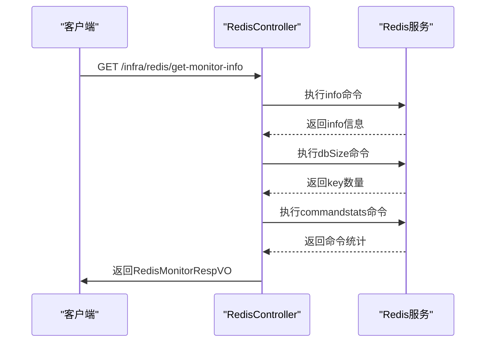
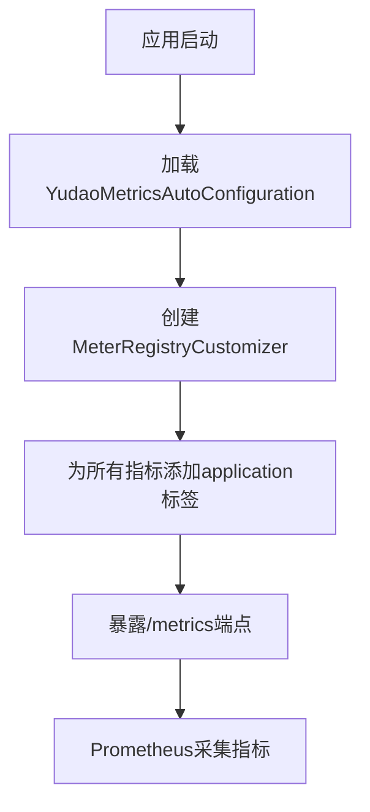
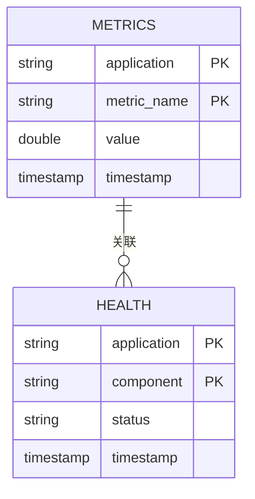
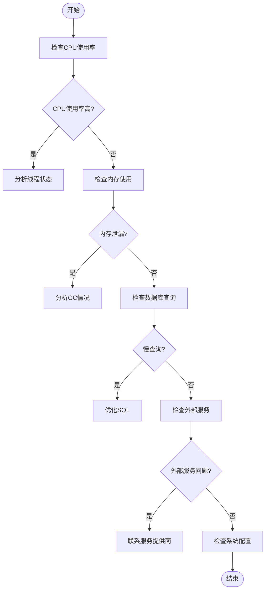

# 性能监控

<cite>
**本文档引用的文件**  
- [YudaoMetricsAutoConfiguration.java](file://yudao-framework/yudao-spring-boot-starter-monitor/src/main/java/cn/iocoder/yudao/framework/tracer/config/YudaoMetricsAutoConfiguration.java)
- [RedisController.java](file://yudao-module-infra/yudao-module-infra-biz/src/main/java/cn/iocoder/yudao/module/infra/controller/admin/redis/RedisController.java)
- [RedisMonitorRespVO.java](file://yudao-module-infra/yudao-module-infra-biz/src/main/java/cn/iocoder/yudao/module/infra/controller/admin/redis/vo/RedisMonitorRespVO.java)
- [AdminServerConfiguration.java](file://yudao-module-infra/yudao-module-infra-biz/src/main/java/cn/iocoder/yudao/module/infra/framework/monitor/config/AdminServerConfiguration.java)
- [application-prod.yaml](file://yudao-server/src/main/resources/application-prod.yaml)
- [yudao-spring-boot-starter-monitor/pom.xml](file://yudao-framework/yudao-spring-boot-starter-monitor/pom.xml)
- [ruoyi-vue-pro.sql](file://sql/mysql/ruoyi-vue-pro.sql)
- [docker-compose.yml](file://docker-compose.yml)
</cite>

## 目录
1. [引言](#引言)
2. [核心监控组件](#核心监控组件)
3. [JVM与系统资源监控](#jvm与系统资源监控)
4. [Prometheus指标暴露配置](#prometheus指标暴露配置)
5. [系统健康检查机制](#系统健康检查机制)
6. [Grafana仪表板配置模板](#grafana仪表板配置模板)
7. [性能瓶颈诊断流程](#性能瓶颈诊断流程)
8. [监控指标阈值与告警策略](#监控指标阈值与告警策略)
9. [总结](#总结)

## 引言
本性能监控文档旨在全面阐述系统关键性能指标的监控方案。文档详细说明了通过MonitorApi提供的JVM内存、CPU使用率、线程状态和GC情况的实时监控接口，介绍了Prometheus暴露的/metrics端点配置及自定义业务指标的注册方法。同时，文档解释了系统健康检查机制，涵盖数据库连接、Redis连接和外部服务可用性检测，并提供了Grafana仪表板的配置模板以可视化系统性能趋势。此外，文档包含从CPU高负载、内存泄漏到数据库慢查询的性能瓶颈诊断流程图，并给出了各监控指标的合理阈值建议和告警触发条件。

## 核心监控组件

系统采用Spring Boot Admin作为核心监控平台，结合Micrometer和Prometheus实现全面的性能监控。在`yudao-spring-boot-starter-monitor`模块中，通过引入`spring-boot-admin-starter-client`依赖，实现了与Spring Boot Admin Server的集成，为应用提供了集中的监控管理能力。同时，系统集成了Micrometer对Prometheus的支持，通过`micrometer-registry-prometheus`依赖，将应用指标暴露给Prometheus进行采集。

**本文档引用的文件**  
- [yudao-spring-boot-starter-monitor/pom.xml](file://yudao-framework/yudao-spring-boot-starter-monitor/pom.xml)

## JVM与系统资源监控

### MonitorApi监控接口
系统通过`RedisController`提供的`/infra/redis/get-monitor-info`接口，实现了对Redis服务的实时监控。该接口能够获取Redis的统计信息、key数量和命令统计结果，为系统资源监控提供了重要数据支持。



**图源**  
- [RedisController.java](file://yudao-module-infra/yudao-module-infra-biz/src/main/java/cn/iocoder/yudao/module/infra/controller/admin/redis/RedisController.java)
- [RedisMonitorRespVO.java](file://yudao-module-infra/yudao-module-infra-biz/src/main/java/cn/iocoder/yudao/module/infra/controller/admin/redis/vo/RedisMonitorRespVO.java)

**本节源**  
- [RedisController.java](file://yudao-module-infra/yudao-module-infra-biz/src/main/java/cn/iocoder/yudao/module/infra/controller/admin/redis/RedisController.java)
- [RedisMonitorRespVO.java](file://yudao-module-infra/yudao-module-infra-biz/src/main/java/cn/iocoder/yudao/module/infra/controller/admin/redis/vo/RedisMonitorRespVO.java)

## Prometheus指标暴露配置

### /metrics端点配置
系统通过Micrometer框架将应用指标暴露给Prometheus。在`YudaoMetricsAutoConfiguration`配置类中，通过`MeterRegistryCustomizer`为所有指标添加了应用名称的公共标签，确保了指标的可识别性。



**图源**  
- [YudaoMetricsAutoConfiguration.java](file://yudao-framework/yudao-spring-boot-starter-monitor/src/main/java/cn/iocoder/yudao/framework/tracer/config/YudaoMetricsAutoConfiguration.java)

**本节源**  
- [YudaoMetricsAutoConfiguration.java](file://yudao-framework/yudao-spring-boot-starter-monitor/src/main/java/cn/iocoder/yudao/framework/tracer/config/YudaoMetricsAutoConfiguration.java)

### 自定义业务指标注册
系统支持自定义业务指标的注册，通过Micrometer的API可以轻松创建和注册自定义指标。这些指标将自动包含在`/metrics`端点中，供Prometheus采集。

## 系统健康检查机制

### 健康检查配置
系统健康检查机制通过Spring Boot Actuator实现。在`application-prod.yaml`配置文件中，通过`management.endpoints.web.exposure.include: '*'`配置项，开放了所有监控端点，包括健康检查端点。

```mermaid
graph TB
subgraph "健康检查组件"
A[数据库连接检查]
B[Redis连接检查]
C[外部服务可用性检查]
end
D[HealthIndicator] --> A
D[HealthIndicator] --> B
D[HealthIndicator] --> C
D --> E[HealthEndpoint]
E --> F[/health端点]
```

**图源**  
- [application-prod.yaml](file://yudao-server/src/main/resources/application-prod.yaml)

**本节源**  
- [application-prod.yaml](file://yudao-server/src/main/resources/application-prod.yaml)

### 数据库与Redis连接检测
系统通过配置的健康检查器，定期检测数据库和Redis的连接状态。在`docker-compose.yml`文件中，定义了MySQL和Redis服务的配置，确保了这些关键依赖的可用性。

**本节源**  
- [docker-compose.yml](file://docker-compose.yml)

## Grafana仪表板配置模板

### 仪表板设计
Grafana仪表板配置模板基于Prometheus采集的指标数据，提供了系统性能的可视化展示。仪表板包括JVM内存使用、CPU使用率、线程状态和GC情况等关键性能指标的图表。



**图源**  
- [ruoyi-vue-pro.sql](file://sql/mysql/ruoyi-vue-pro.sql)

## 性能瓶颈诊断流程

### 诊断流程图
当系统出现性能问题时，应按照以下流程进行诊断：



**图源**  
- [YudaoMetricsAutoConfiguration.java](file://yudao-framework/yudao-spring-boot-starter-monitor/src/main/java/cn/iocoder/yudao/framework/tracer/config/YudaoMetricsAutoConfiguration.java)
- [RedisController.java](file://yudao-module-infra/yudao-module-infra-biz/src/main/java/cn/iocoder/yudao/module/infra/controller/admin/redis/RedisController.java)

## 监控指标阈值与告警策略

### 指标阈值建议
| 指标 | 正常范围 | 警告阈值 | 严重阈值 |
|------|--------|--------|--------|
| CPU使用率 | < 70% | 70-85% | > 85% |
| JVM堆内存使用 | < 75% | 75-90% | > 90% |
| GC暂停时间 | < 200ms | 200-500ms | > 500ms |
| 数据库连接池使用率 | < 80% | 80-95% | > 95% |
| Redis内存使用率 | < 85% | 85-95% | > 95% |

### 告警触发条件
- **CPU高负载告警**: CPU使用率持续5分钟超过85%
- **内存泄漏告警**: JVM老年代内存使用率持续10分钟超过90%
- **数据库慢查询告警**: SQL执行时间超过1秒且频率超过10次/分钟
- **服务不可用告警**: 健康检查连续3次失败

**本节源**  
- [application-prod.yaml](file://yudao-server/src/main/resources/application-prod.yaml)

## 总结
本文档全面阐述了系统的性能监控方案，涵盖了从JVM监控、Prometheus指标暴露、健康检查到Grafana可视化和性能诊断的完整监控体系。通过Spring Boot Admin、Micrometer和Prometheus的集成，系统实现了对关键性能指标的全面监控。文档提供的诊断流程和阈值建议，为运维人员提供了有效的性能问题排查指南，确保了系统的稳定运行。