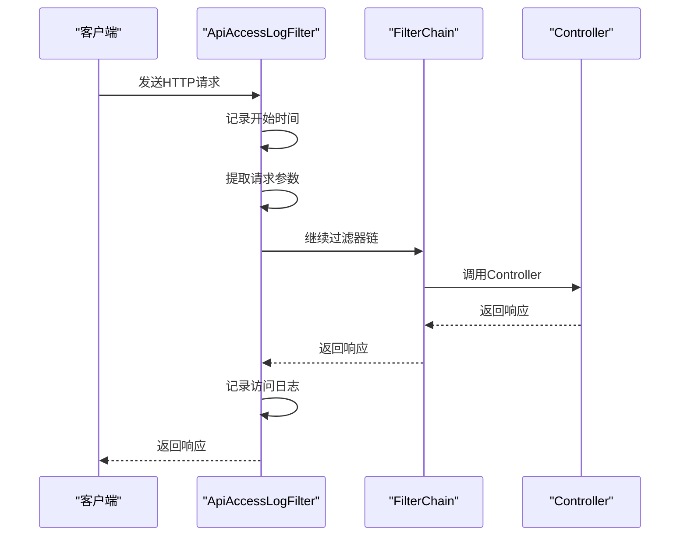
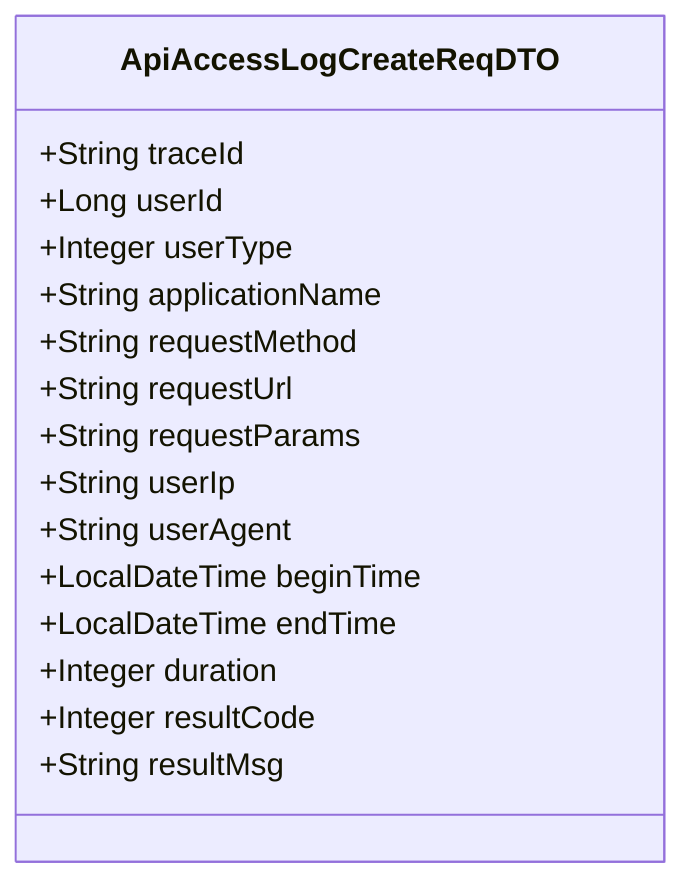
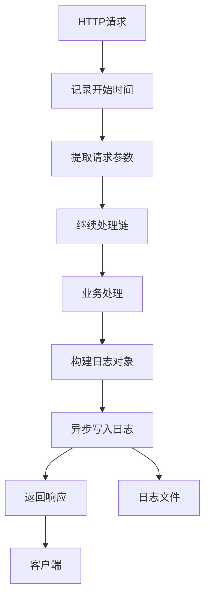
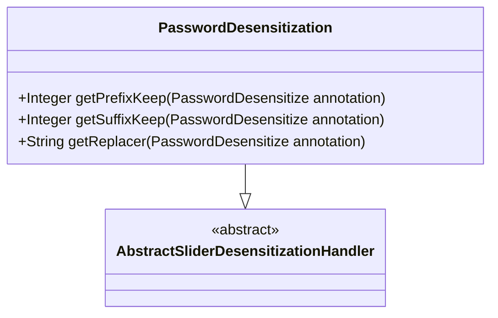

# API访问日志

<cite>
**本文档引用的文件**   
- [YudaoApiLogAutoConfiguration.java](file://yudao-framework/yudao-spring-boot-starter-web/src/main/java/cn/iocoder/yudao/framework/apilog/config/YudaoApiLogAutoConfiguration.java)
- [ApiAccessLogFilter.java](file://yudao-framework/yudao-spring-boot-starter-web/src/main/java/cn/iocoder/yudao/framework/apilog/core/filter/ApiAccessLogFilter.java)
- [ApiAccessLogCreateReqDTO.java](file://yudao-module-infra/yudao-module-infra-api/src/main/java/cn/iocoder/yudao/module/infra/api/logger/dto/ApiAccessLogCreateReqDTO.java)
- [logback-spring.xml](file://yudao-server/src/main/resources/logback-spring.xml)
- [YudaoAsyncAutoConfiguration.java](file://yudao-framework/yudao-spring-boot-starter-job/src/main/java/cn/iocoder/yudao/framework/quartz/config/YudaoAsyncAutoConfiguration.java)
- [PasswordDesensitization.java](file://yudao-framework/yudao-spring-boot-starter-desensitize/src/main/java/cn/iocoder/yudao/framework/desensitize/core/slider/handler/PasswordDesensitization.java)
</cite>

## 目录
1. [简介](#简介)
2. [自动配置机制](#自动配置机制)
3. [切面拦截机制](#切面拦截机制)
4. [数据结构设计](#数据结构设计)
5. [异步处理流程](#异步处理流程)
6. [敏感信息脱敏策略](#敏感信息脱敏策略)
7. [日志查询与链路追踪](#日志查询与链路追踪)
8. [性能监控指标](#性能监控指标)

## 简介
本文档详细说明了API访问日志系统的实现机制，包括自动配置、切面拦截、数据结构设计、异步处理、敏感信息脱敏、日志查询和性能监控等方面。系统通过过滤器和AOP技术实现对Controller层请求的全面监控，为系统运维和问题排查提供有力支持。

## 自动配置机制

API访问日志的自动配置通过`YudaoApiLogAutoConfiguration`类实现。该配置类使用Spring Boot的`@AutoConfiguration`注解，在应用启动时自动加载相关组件。配置类位于`yudao-framework`模块中，确保了日志功能的通用性和可复用性。

自动配置机制的核心是条件化加载，通过`@ConditionalOnProperty`注解控制功能的启用与禁用。开发者可以通过配置`yudao.access-log.enable=false`来禁用访问日志功能，提供了灵活的配置选项。

**本节来源**
- [YudaoApiLogAutoConfiguration.java](file://yudao-framework/yudao-spring-boot-starter-web/src/main/java/cn/iocoder/yudao/framework/apilog/config/YudaoApiLogAutoConfiguration.java#L1-L52)

## 切面拦截机制

系统采用过滤器模式而非AOP切面来拦截Controller层的请求。`ApiAccessLogFilter`实现了`javax.servlet.Filter`接口，在请求处理的早期阶段捕获请求信息。这种设计避免了XSS过滤器对请求参数的预处理影响，确保了日志记录的完整性。

过滤器在`doFilterInternal`方法中记录请求开始时间，然后通过`filterChain.doFilter(request, response)`继续执行后续过滤器链。无论请求正常完成还是抛出异常，都会调用`createApiAccessLog`方法记录访问日志，确保了所有请求都被完整记录。

**图示来源**
- [ApiAccessLogFilter.java](file://yudao-framework/yudao-spring-boot-starter-web/src/main/java/cn/iocoder/yudao/framework/apilog/core/filter/ApiAccessLogFilter.java#L46-L64)

**本节来源**
- [ApiAccessLogFilter.java](file://yudao-framework/yudao-spring-boot-starter-web/src/main/java/cn/iocoder/yudao/framework/apilog/core/filter/ApiAccessLogFilter.java#L36-L101)

## 数据结构设计

`ApiAccessLogCreateReqDTO`数据传输对象定义了API访问日志的核心字段，采用Lombok的`@Data`注解简化代码。数据结构设计充分考虑了日志分析的需求，包含了请求的完整上下文信息。

主要字段包括：
- **traceId**: 链路追踪编号，用于分布式系统中的请求追踪
- **userId** 和 **userType**: 用户标识信息，区分不同用户类型
- **applicationName**: 应用名称，便于多服务环境下的日志归类
- **requestMethod** 和 **requestUrl**: HTTP请求方法和访问地址
- **requestParams**: 请求参数，包含查询参数和请求体
- **userIp** 和 **userAgent**: 客户端信息，用于安全分析
- **beginTime** 和 **endTime**: 请求时间范围
- **duration**: 执行时长（毫秒），用于性能监控
- **resultCode** 和 **resultMsg**: 结果码和提示信息

**图示来源**
- [ApiAccessLogCreateReqDTO.java](file://yudao-module-infra/yudao-module-infra-api/src/main/java/cn/iocoder/yudao/module/infra/api/logger/dto/ApiAccessLogCreateReqDTO.java#L1-L85)

**本节来源**
- [ApiAccessLogCreateReqDTO.java](file://yudao-module-infra/yudao-module-infra-api/src/main/java/cn/iocoder/yudao/module/infra/api/logger/dto/ApiAccessLogCreateReqDTO.java#L1-L85)

## 异步处理流程

日志的写入采用异步处理机制，通过Logback的`AsyncAppender`实现非阻塞写入。在`logback-spring.xml`配置文件中，定义了名为"ASYNC"的异步追加器，将日志写入操作从主线程分离，显著提升了系统性能。

异步处理的关键配置包括：
- **queueSize**: 队列大小设置为256，平衡了内存使用和性能
- **discardingThreshold**: 丢弃阈值设置为0，确保不丢失任何日志
- **appender-ref**: 引用名为"FILE"的文件追加器，实际写入日志文件

此外，系统全局启用了异步任务支持，通过`@EnableAsync`注解激活Spring的异步执行能力。`YudaoAsyncAutoConfiguration`配置类确保了线程池的正确配置，并通过`TtlRunnable`保证了TransmittableThreadLocal的上下文传递。

**图示来源**
- [logback-spring.xml](file://yudao-server/src/main/resources/logback-spring.xml#L42-L48)
- [YudaoAsyncAutoConfiguration.java](file://yudao-framework/yudao-spring-boot-starter-job/src/main/java/cn/iocoder/yudao/framework/quartz/config/YudaoAsyncAutoConfiguration.java#L1-L35)

**本节来源**
- [logback-spring.xml](file://yudao-server/src/main/resources/logback-spring.xml#L38-L65)
- [YudaoAsyncAutoConfiguration.java](file://yudao-framework/yudao-spring-boot-starter-job/src/main/java/cn/iocoder/yudao/framework/quartz/config/YudaoAsyncAutoConfiguration.java#L1-L35)

## 敏感信息脱敏策略

系统实现了完善的敏感信息脱敏机制，通过`yudao-spring-boot-starter-desensitize`模块提供多种脱敏处理器。对于密码字段，采用`PasswordDesensitize`注解和`PasswordDesensitization`处理器实现掩码处理。

脱敏策略的核心是基于注解的字段级控制，开发者可以在DTO类的敏感字段上添加相应的脱敏注解。系统支持多种脱敏方式：
- **滑动脱敏**: 保留前缀和后缀部分字符，中间用掩码替换
- **正则脱敏**: 基于正则表达式的灵活脱敏规则
- **固定替换**: 用固定字符替换敏感信息

测试用例显示，密码字段被成功脱敏为"******"，身份证号脱敏为"530321**********11"，手机号脱敏为"132****5917"，有效保护了用户隐私。

**图示来源**
- [PasswordDesensitization.java](file://yudao-framework/yudao-spring-boot-starter-desensitize/src/main/java/cn/iocoder/yudao/framework/desensitize/core/slider/handler/PasswordDesensitization.java#L1-L25)

**本节来源**
- [PasswordDesensitization.java](file://yudao-framework/yudao-spring-boot-starter-desensitize/src/main/java/cn/iocoder/yudao/framework/desensitize/core/slider/handler/PasswordDesensitization.java#L1-L25)
- [DesensitizeTest.java](file://yudao-framework/yudao-spring-boot-starter-desensitize/src/test/java/cn/iocoder/yudao/framework/desensitize/core/DesensitizeTest.java#L39-L60)

## 日志查询与链路追踪

系统提供了完整的日志查询接口，支持基于用户ID、用户类型、应用名称、请求URL、时间范围和执行时长等多维度的查询条件。`ApiAccessLogMapper`接口定义了分页查询方法，使用MyBatis-Plus的`LambdaQueryWrapperX`构建动态查询条件。

链路追踪通过`traceId`字段实现，该字段由`TracerUtils.getTraceId()`方法生成并注入到日志记录中。在分布式系统中，相同的`traceId`贯穿整个请求链路，使得开发者能够追踪一个请求在多个微服务间的完整执行路径。

日志查询接口的设计考虑了性能因素，避免了全表扫描，通过合理的索引设计确保查询效率。同时，系统提供了定时任务清理过期日志的功能，通过`deleteByCreateTimeLt`方法物理删除指定时间之前的日志记录，防止日志数据无限增长。

**本节来源**
- [ApiAccessLogMapper.java](file://yudao-module-infra/yudao-module-infra-biz/src/main/java/cn/iocoder/yudao/module/infra/dal/mysql/logger/ApiAccessLogMapper.java#L14-L45)
- [ApiAccessLogServiceImplTest.java](file://yudao-module-infra/yudao-module-infra-biz/src/test/java/cn/iocoder/yudao/module/infra/service/logger/ApiAccessLogServiceImplTest.java#L33-L56)

## 性能监控指标

系统采集了丰富的性能监控指标，为系统优化提供了数据支持。核心性能指标包括：

- **P95响应时间**: 通过分析`duration`字段的分布，计算95%请求的响应时间，识别性能瓶颈
- **异常请求统计**: 基于`resultCode`字段统计HTTP状态码分布，及时发现服务异常
- **请求量趋势**: 按时间维度统计请求量，分析系统负载变化
- **慢请求告警**: 配置阈值，对超过指定时长的请求发出告警

这些指标可以通过日志分析工具（如ELK栈）进行可视化展示，生成仪表盘和报表。系统还支持将关键指标上报到监控系统（如Prometheus），实现实时监控和告警。

性能监控的实现不依赖额外的侵入式代码，而是充分利用已有的访问日志数据，降低了系统复杂性和维护成本。通过合理的日志采样策略，可以在保证监控效果的同时控制存储成本。