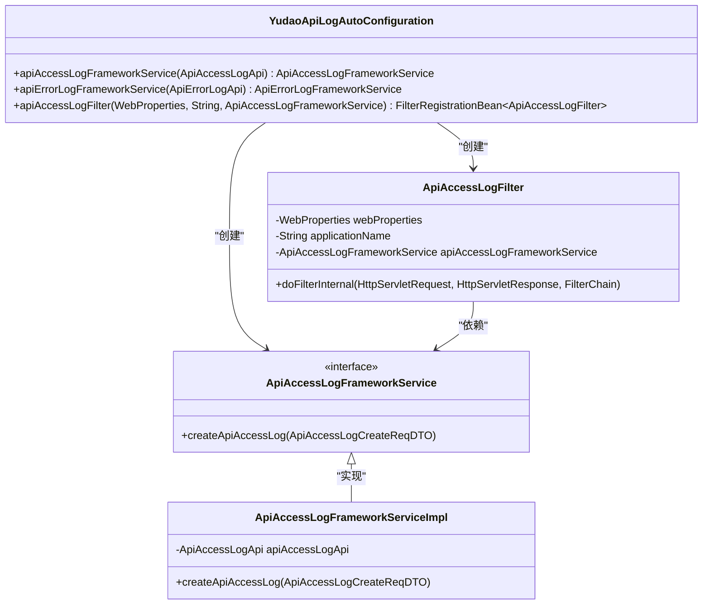
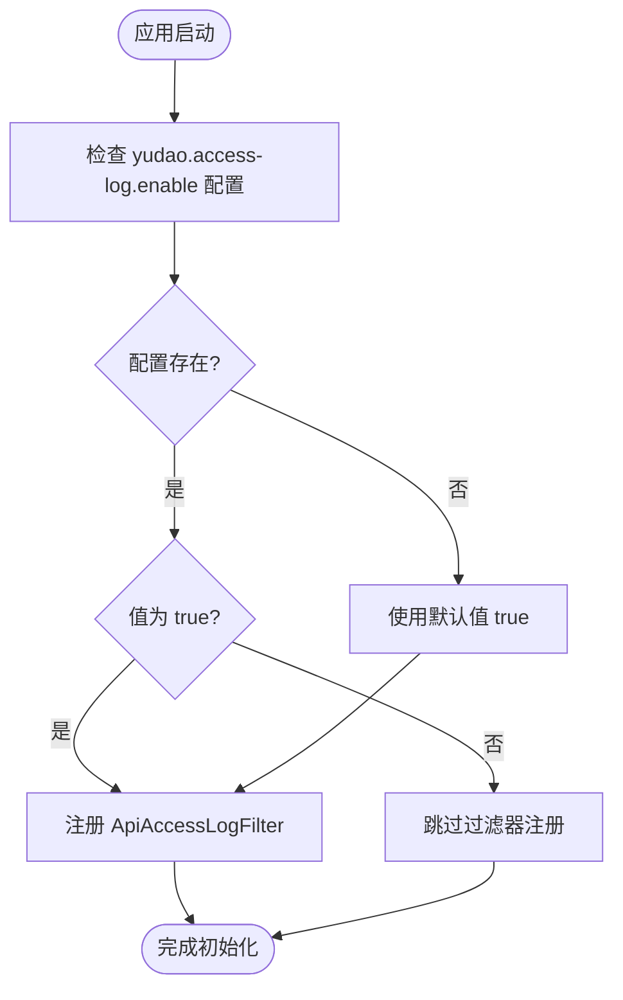
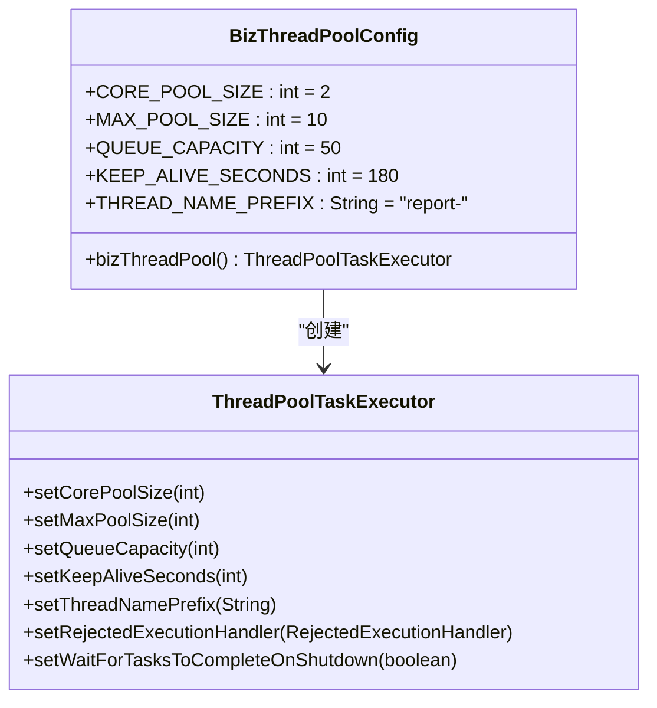

# API访问日志配置

<cite>
**本文档引用的文件**   
- [YudaoApiLogAutoConfiguration.java](file://yudao-framework/yudao-spring-boot-starter-web/src/main/java/cn/iocoder/yudao/framework/apilog/config/YudaoApiLogAutoConfiguration.java)
- [ApiAccessLogFilter.java](file://yudao-framework/yudao-spring-boot-starter-web/src/main/java/cn/iocoder/yudao/framework/apilog/core/filter/ApiAccessLogFilter.java)
- [BizThreadPoolConfig.java](file://yudao-framework/eplus-spring-boot-starter-thread-pool/src/main/java/com/syj/eplus/framework/thread/pool/BizThreadPoolConfig.java)
- [WebFilterOrderEnum.java](file://yudao-framework/yudao-common/src/main/java/cn/iocoder/yudao/framework/common/enums/WebFilterOrderEnum.java)
- [application-dev.yaml](file://yudao-server/src/main/resources/application-dev.yaml)
- [application-prod.yaml](file://yudao-server/src/main/resources/application-prod.yaml)
</cite>

## 目录
1. [简介](#简介)
2. [自动配置机制](#自动配置机制)
3. [AOP代理配置](#aop代理配置)
4. [日志开关配置](#日志开关配置)
5. [异步处理线程池配置](#异步处理线程池配置)
6. [自定义切面拦截规则](#自定义切面拦截规则)
7. [配置示例](#配置示例)
8. [最佳实践](#最佳实践)

## 简介
本文档详细说明了API访问日志的配置机制，重点介绍`YudaoApiLogAutoConfiguration`类的自动配置功能。文档涵盖了通过过滤器实现日志记录、配置日志开关、设置异步处理线程池以及自定义拦截规则等内容，为开发者提供完整的API访问日志集成和调整指南。

## 自动配置机制

`YudaoApiLogAutoConfiguration`类是API访问日志的核心自动配置类，位于`yudao-framework/yudao-spring-boot-starter-web`模块中。该配置类通过Spring Boot的自动配置机制，在应用启动时自动注册必要的组件来实现API访问日志功能。

该配置类的主要功能包括：
- 创建`ApiAccessLogFrameworkService`服务实例，用于处理API访问日志的业务逻辑
- 创建`ApiErrorLogFrameworkService`服务实例，用于处理API错误日志的业务逻辑
- 注册`ApiAccessLogFilter`过滤器，用于拦截HTTP请求并记录访问日志

自动配置的执行顺序通过`@AutoConfiguration(after = YudaoWebAutoConfiguration.class)`注解确保在Web配置之后执行，保证了正确的初始化顺序。

**Section sources**
- [YudaoApiLogAutoConfiguration.java](file://yudao-framework/yudao-spring-boot-starter-web/src/main/java/cn/iocoder/yudao/framework/apilog/config/YudaoApiLogAutoConfiguration.java#L21-L22)

## AOP代理配置

虽然API访问日志主要通过Servlet过滤器实现，但系统中其他日志功能（如操作日志）使用了AspectJ AOP代理。系统通过在配置类中使用`@EnableAspectJAutoProxy`注解来启用AspectJ AOP代理功能。

在`YudaoOperateLogAutoConfiguration`配置中，通过创建`OperateLogAspect`切面来实现操作日志的记录。切面的优先级通过Spring AOP的order属性进行配置，确保在适当的执行顺序中拦截方法调用。

代理模式默认使用JDK动态代理，当目标类没有实现接口时，会自动切换到CGLIB代理模式。这种配置确保了切面能够正确地应用到各种类型的组件上。



**Diagram sources **
- [YudaoApiLogAutoConfiguration.java](file://yudao-framework/yudao-spring-boot-starter-web/src/main/java/cn/iocoder/yudao/framework/apilog/config/YudaoApiLogAutoConfiguration.java)
- [ApiAccessLogFilter.java](file://yudao-framework/yudao-spring-boot-starter-web/src/main/java/cn/iocoder/yudao/framework/apilog/core/filter/ApiAccessLogFilter.java)

**Section sources**
- [YudaoApiLogAutoConfiguration.java](file://yudao-framework/yudao-spring-boot-starter-web/src/main/java/cn/iocoder/yudao/framework/apilog/config/YudaoApiLogAutoConfiguration.java#L21-L52)
- [YudaoOperateLogAutoConfiguration.java](file://yudao-framework/yudao-spring-boot-starter-operatelog/src/main/java/cn/iocoder/yudao/framework/operatelog/config/YudaoOperateLogAutoConfiguration.java#L10-L23)

## 日志开关配置

API访问日志的启用和禁用通过配置属性`yudao.access-log.enable`进行控制。该配置使用Spring Boot的`@ConditionalOnProperty`注解实现条件化配置。

默认情况下，API访问日志是启用的（`matchIfMissing = true`），这意味着如果配置文件中没有明确指定该属性，日志功能将自动启用。要禁用API访问日志，需要在配置文件中设置：

```yaml
yudao:
  access-log:
    enable: false
```

这种设计提供了灵活的配置选项，允许开发者根据环境需求（如生产环境启用、测试环境禁用）来调整日志记录行为。



**Diagram sources **
- [YudaoApiLogAutoConfiguration.java](file://yudao-framework/yudao-spring-boot-starter-web/src/main/java/cn/iocoder/yudao/framework/apilog/config/YudaoApiLogAutoConfiguration.java#L38-L44)

**Section sources**
- [YudaoApiLogAutoConfiguration.java](file://yudao-framework/yudao-spring-boot-starter-web/src/main/java/cn/iocoder/yudao/framework/apilog/config/YudaoApiLogAutoConfiguration.java#L38-L44)

## 异步处理线程池配置

系统中的异步处理功能通过`BizThreadPoolConfig`类进行线程池配置。该配置类定义了业务线程池的各项参数，确保异步任务能够高效执行。

线程池的关键配置参数包括：
- **核心线程数**：2个，表示线程池中始终保持活跃的线程数量
- **最大线程数**：10个，表示线程池中允许的最大线程数量
- **队列容量**：50，表示任务队列的大小
- **空闲时间**：180秒，表示非核心线程在空闲时的存活时间
- **拒绝策略**：CallerRunsPolicy，表示当线程池和队列都满时，由调用线程直接执行任务

这些配置通过`@EnableAsync`注解启用异步支持，并通过`@Bean`注解将配置好的线程池注册为Spring Bean，供系统中的异步任务使用。



**Diagram sources **
- [BizThreadPoolConfig.java](file://yudao-framework/eplus-spring-boot-starter-thread-pool/src/main/java/com/syj/eplus/framework/thread/pool/BizThreadPoolConfig.java)

**Section sources**
- [BizThreadPoolConfig.java](file://yudao-framework/eplus-spring-boot-starter-thread-pool/src/main/java/com/syj/eplus/framework/thread/pool/BizThreadPoolConfig.java#L17-L53)

## 自定义切面拦截规则

虽然API访问日志主要通过过滤器实现，但系统提供了灵活的拦截规则配置机制。通过`WebFilterOrderEnum`枚举类，可以精确控制各种过滤器的执行顺序。

`WebFilterOrderEnum`定义了系统中所有过滤器的执行优先级，确保它们按照预期的顺序执行。对于API访问日志过滤器，其执行顺序被设置为`API_ACCESS_LOG_FILTER = -103`，这确保了它在请求体缓存过滤器之后执行，但在Spring Security过滤器之前执行。

开发者可以通过创建自定义过滤器并设置适当的执行顺序来扩展系统的拦截功能。此外，系统还支持通过配置指定需要记录日志的包路径或排除特定的Controller，提供了细粒度的控制能力。

**Section sources**
- [WebFilterOrderEnum.java](file://yudao-framework/yudao-common/src/main/java/cn/iocoder/yudao/framework/common/enums/WebFilterOrderEnum#L1-L34)
- [ApiAccessLogFilter.java](file://yudao-framework/yudao-spring-boot-starter-web/src/main/java/cn/iocoder/yudao/framework/apilog/core/filter/ApiAccessLogFilter.java#L36-L65)

## 配置示例

以下是在`application.yaml`文件中配置API访问日志的示例：

```yaml
# 芋道相关配置
yudao:
  # 访问日志配置
  access-log:
    enable: true # 是否开启访问日志，默认为 true
    
  # 信息配置
  info:
    base-package: cn.iocoder.yudao

# 日志配置
logging:
  level:
    com.syj.eplus: debug
```

在生产环境中，可以将访问日志禁用以提高性能：

```yaml
# 生产环境配置
yudao:
  access-log:
    enable: false # 生产环境中禁用访问日志
```

**Section sources**
- [application-dev.yaml](file://yudao-server/src/main/resources/application-dev.yaml#L141-L164)
- [application-prod.yaml](file://yudao-server/src/main/resources/application-prod.yaml#L160-L183)

## 最佳实践

1. **环境差异化配置**：在开发和测试环境中启用API访问日志以方便调试，在生产环境中根据性能需求考虑是否启用。

2. **合理设置过滤器顺序**：确保API访问日志过滤器在安全过滤器之前执行，以便记录完整的请求信息。

3. **监控线程池状态**：定期监控业务线程池的使用情况，根据实际负载调整核心线程数、最大线程数和队列容量。

4. **选择性记录**：对于高频率的API接口，考虑通过自定义规则排除，避免日志系统成为性能瓶颈。

5. **错误处理**：确保日志记录过程中的异常不会影响正常业务流程，使用适当的异常处理机制。

6. **日志轮转**：配置适当的日志文件轮转策略，防止日志文件过大占用过多磁盘空间。

7. **敏感信息过滤**：在记录请求参数和响应内容时，注意过滤敏感信息，如密码、身份证号等。

**Section sources**
- [YudaoApiLogAutoConfiguration.java](file://yudao-framework/yudao-spring-boot-starter-web/src/main/java/cn/iocoder/yudao/framework/apilog/config/YudaoApiLogAutoConfiguration.java)
- [BizThreadPoolConfig.java](file://yudao-framework/eplus-spring-boot-starter-thread-pool/src/main/java/com/syj/eplus/framework/thread/pool/BizThreadPoolConfig.java)