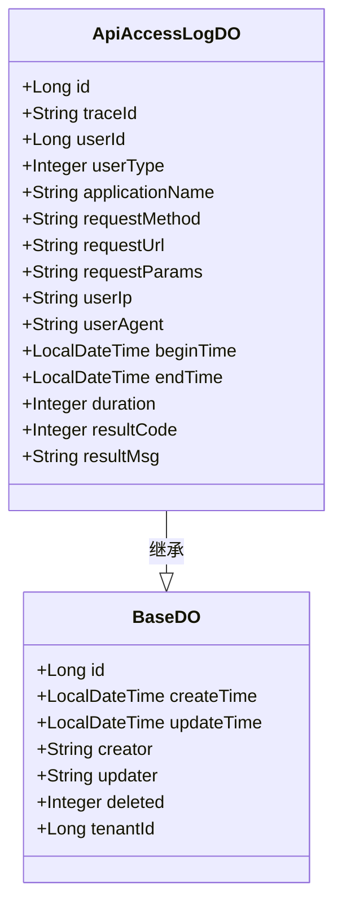
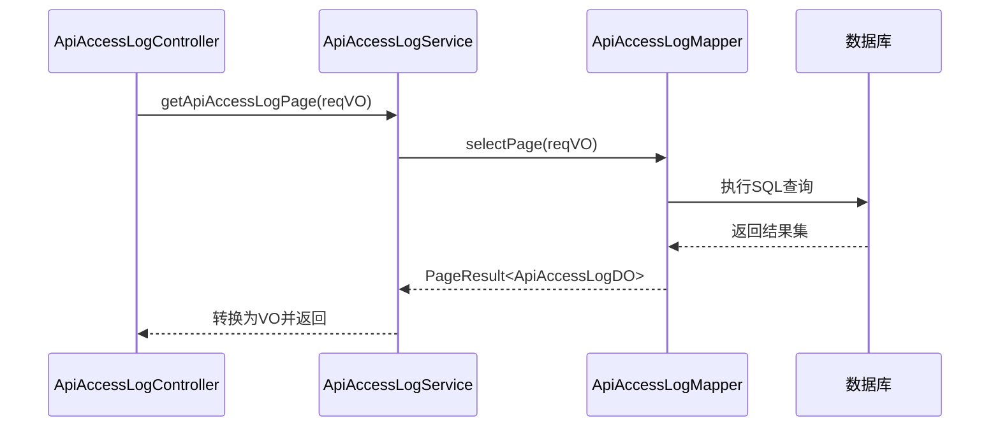
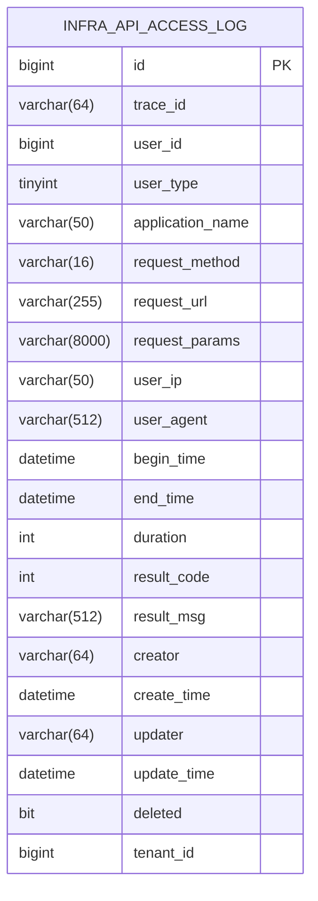

# 数据模型

<cite>
**本文档引用的文件**
- [ApiAccessLogDO.java](file://yudao-module-infra/yudao-module-infra-biz/src/main/java/cn/iocoder/yudao/module/infra/dal/dataobject/logger/ApiAccessLogDO.java)
- [ApiAccessLogMapper.java](file://yudao-module-infra/yudao-module-infra-biz/src/main/java/cn/iocoder/yudao/module/infra/dal/mysql/logger/ApiAccessLogMapper.java)
- [ApiAccessLogServiceImpl.java](file://yudao-module-infra/yudao-module-infra-biz/src/main/java/cn/iocoder/yudao/module/infra/service/logger/ApiAccessLogServiceImpl.java)
- [ApiAccessLogController.java](file://yudao-module-infra/yudao-module-infra-biz/src/main/java/cn/iocoder/yudao/module/infra/controller/admin/logger/ApiAccessLogController.java)
- [ApiAccessLogCreateReqDTO.java](file://yudao-module-infra/yudao-module-infra-api/src/main/java/cn/iocoder/yudao/module/infra/api/logger/dto/ApiAccessLogCreateReqDTO.java)
- [ApiAccessLogPageReqVO.java](file://yudao-module-infra/yudao-module-infra-biz/src/main/java/cn/iocoder/yudao/module/infra/controller/admin/logger/vo/apiaccesslog/ApiAccessLogPageReqVO.java)
- [V1_0_0_001__框架初始化.sql](file://eplus-flyway/src/main/resources/db/migration/common/V1_0_0_001__框架初始化.sql)
- [ApiAccessLogFilter.java](file://yudao-framework/yudao-spring-boot-starter-web/src/main/java/cn/iocoder/yudao/framework/apilog/core/filter/ApiAccessLogFilter.java)
</cite>

## 目录
1. [简介](#简介)
2. [实体类结构分析](#实体类结构分析)
3. [数据库表结构](#数据库表结构)
4. [字段详细说明](#字段详细说明)
5. [MyBatis Plus 操作](#mybatis-plus-操作)
6. [数据模型ER图](#数据模型er图)
7. [查询示例](#查询示例)

## 简介
API访问日志数据模型用于记录系统中所有API接口的访问情况，包括请求信息、执行时间和结果等关键指标。该模型通过`ApiAccessLogDO`实体类实现，与数据库表`infra_api_access_log`进行映射。日志记录由`ApiAccessLogFilter`过滤器自动捕获，支持链路追踪、性能监控和安全审计等功能。

**本节不分析具体源文件**

## 实体类结构分析
`ApiAccessLogDO`类是API访问日志的核心数据对象，继承自`BaseDO`基类，使用Lombok注解简化代码。该类通过`@TableName("infra_api_access_log")`注解映射到对应的数据库表，并使用`@TableId`标识主键字段。实体类包含链路追踪、用户信息、请求参数、执行时间和结果等多个维度的字段。



**图源**
- [ApiAccessLogDO.java](file://yudao-module-infra/yudao-module-infra-biz/src/main/java/cn/iocoder/yudao/module/infra/dal/dataobject/logger/ApiAccessLogDO.java#L18-L109)

**本节来源**
- [ApiAccessLogDO.java](file://yudao-module-infra/yudao-module-infra-biz/src/main/java/cn/iocoder/yudao/module/infra/dal/dataobject/logger/ApiAccessLogDO.java#L1-L109)

## 数据库表结构
`infra_api_access_log`表是API访问日志的持久化存储，采用InnoDB引擎，字符集为utf8mb4。表结构设计考虑了查询性能和存储效率，对创建时间字段建立了索引以支持按时间范围查询。表中包含完整的请求上下文信息，支持后续的分析和审计需求。

```sql
CREATE TABLE `infra_api_access_log` (
    `id` bigint NOT NULL AUTO_INCREMENT COMMENT '日志主键',
    `trace_id` varchar(64) NOT NULL DEFAULT '' COMMENT '链路追踪编号',
    `user_id` bigint NOT NULL DEFAULT 0 COMMENT '用户编号',
    `user_type` tinyint NOT NULL DEFAULT 0 COMMENT '用户类型',
    `application_name` varchar(50) NOT NULL COMMENT '应用名',
    `request_method` varchar(16) NOT NULL DEFAULT '' COMMENT '请求方法名',
    `request_url` varchar(255) NOT NULL DEFAULT '' COMMENT '请求地址',
    `request_params` varchar(8000) NOT NULL DEFAULT '' COMMENT '请求参数',
    `user_ip` varchar(50) NOT NULL COMMENT '用户 IP',
    `user_agent` varchar(512) NOT NULL COMMENT '浏览器 UA',
    `begin_time` datetime NOT NULL COMMENT '开始请求时间',
    `end_time` datetime NOT NULL COMMENT '结束请求时间',
    `duration` int NOT NULL COMMENT '执行时长',
    `result_code` int NOT NULL DEFAULT 0 COMMENT '结果码',
    `result_msg` varchar(512) DEFAULT '' COMMENT '结果提示',
    `creator` varchar(64) DEFAULT '' COMMENT '创建者',
    `create_time` datetime NOT NULL DEFAULT CURRENT_TIMESTAMP COMMENT '创建时间',
    `updater` varchar(64) DEFAULT '' COMMENT '更新者',
    `update_time` datetime NOT NULL DEFAULT CURRENT_TIMESTAMP ON UPDATE CURRENT_TIMESTAMP COMMENT '更新时间',
    `deleted` bit(1) NOT NULL DEFAULT b'0' COMMENT '是否删除',
    `tenant_id` bigint NOT NULL DEFAULT 0 COMMENT '租户编号',
    PRIMARY KEY (`id`) USING BTREE,
    INDEX `idx_create_time`(`create_time` ASC) USING BTREE
) ENGINE = InnoDB AUTO_INCREMENT = 35832 CHARACTER SET = utf8mb4 COLLATE = utf8mb4_unicode_ci COMMENT = 'API 访问日志表';
```

**本节来源**
- [V1_0_0_001__框架初始化.sql](file://eplus-flyway/src/main/resources/db/migration/common/V1_0_0_001__框架初始化.sql#L2682-L2708)

## 字段详细说明
以下是对`ApiAccessLogDO`实体类各字段的详细说明：

### 基础信息字段
- **id**: 主键，自增的长整型，唯一标识每条日志记录
- **traceId**: 链路追踪ID，64字符varchar，用于分布式系统中的请求追踪
- **userId**: 用户ID，长整型，标识发起请求的用户
- **userType**: 用户类型，tinyint，枚举值（1:会员，2:管理员）
- **applicationName**: 应用名，50字符varchar，标识来源应用

### 请求信息字段
- **requestMethod**: 请求方法，16字符varchar，如GET、POST等
- **requestUrl**: 请求URL，255字符varchar，完整的请求路径
- **requestParams**: 请求参数，8000字符varchar，包含query和body参数
- **userIp**: 用户IP，50字符varchar，客户端IP地址
- **userAgent**: 用户代理，512字符varchar，浏览器或客户端信息

### 执行信息字段
- **beginTime**: 开始时间，datetime，请求开始处理的时间
- **endTime**: 结束时间，datetime，请求处理完成的时间
- **duration**: 耗时，int，执行时长（毫秒）
- **resultCode**: 响应码，int，HTTP状态码或业务错误码
- **resultMsg**: 响应消息，512字符varchar，结果描述信息

**本节来源**
- [ApiAccessLogDO.java](file://yudao-module-infra/yudao-module-infra-biz/src/main/java/cn/iocoder/yudao/module/infra/dal/dataobject/logger/ApiAccessLogDO.java#L28-L108)

## MyBatis Plus 操作
API访问日志通过MyBatis Plus框架进行CRUD操作，主要涉及`ApiAccessLogMapper`接口和`ApiAccessLogService`服务类。Mapper继承自`BaseMapperX`，提供基本的增删改查功能，并通过`LambdaQueryWrapperX`构建复杂的查询条件。



**图源**
- [ApiAccessLogServiceImpl.java](file://yudao-module-infra/yudao-module-infra-biz/src/main/java/cn/iocoder/yudao/module/infra/service/logger/ApiAccessLogServiceImpl.java#L36-L38)
- [ApiAccessLogMapper.java](file://yudao-module-infra/yudao-module-infra-biz/src/main/java/cn/iocoder/yudao/module/infra/dal/mysql/logger/ApiAccessLogMapper.java#L22-L33)

**本节来源**
- [ApiAccessLogMapper.java](file://yudao-module-infra/yudao-module-infra-biz/src/main/java/cn/iocoder/yudao/module/infra/dal/mysql/logger/ApiAccessLogMapper.java#L20-L45)
- [ApiAccessLogServiceImpl.java](file://yudao-module-infra/yudao-module-infra-biz/src/main/java/cn/iocoder/yudao/module/infra/service/logger/ApiAccessLogServiceImpl.java#L24-L57)

## 数据模型ER图
以下是API访问日志数据模型的实体关系图，展示了主要字段及其关系。



**图源**
- [ApiAccessLogDO.java](file://yudao-module-infra/yudao-module-infra-biz/src/main/java/cn/iocoder/yudao/module/infra/dal/dataobject/logger/ApiAccessLogDO.java#L18-L109)
- [V1_0_0_001__框架初始化.sql](file://eplus-flyway/src/main/resources/db/migration/common/V1_0_0_001__框架初始化.sql#L2682-L2708)

## 查询示例
以下是API访问日志的典型查询示例，展示如何通过不同条件筛选日志记录：

```java
// 分页查询示例
PageResult<ApiAccessLogDO> pageResult = apiAccessLogService.getApiAccessLogPage(
    new ApiAccessLogPageReqVO()
        .setUserId(2233L)
        .setUserType(UserTypeEnum.ADMIN.getValue())
        .setApplicationName("yudao-test")
        .setRequestUrl("foo")
        .setBeginTime(new LocalDateTime[]{buildTime(2021, 3, 13), buildTime(2021, 3, 13, 23, 59, 59)})
        .setDuration(1000)
        .setResultCode(GlobalErrorCodeConstants.SUCCESS.getCode())
);
```

此查询将返回满足所有条件的API访问日志分页结果，包括指定用户、应用、URL、时间范围、执行时长和结果码的日志记录。

**本节来源**
- [ApiAccessLogServiceImplTest.java](file://yudao-module-infra/yudao-module-infra-biz/src/test/java/cn/iocoder/yudao/module/infra/service/logger/ApiAccessLogServiceImplTest.java#L34-L75)
- [ApiAccessLogPageReqVO.java](file://yudao-module-infra/yudao-module-infra-biz/src/main/java/cn/iocoder/yudao/module/infra/controller/admin/logger/vo/apiaccesslog/ApiAccessLogPageReqVO.java#L1-L43)