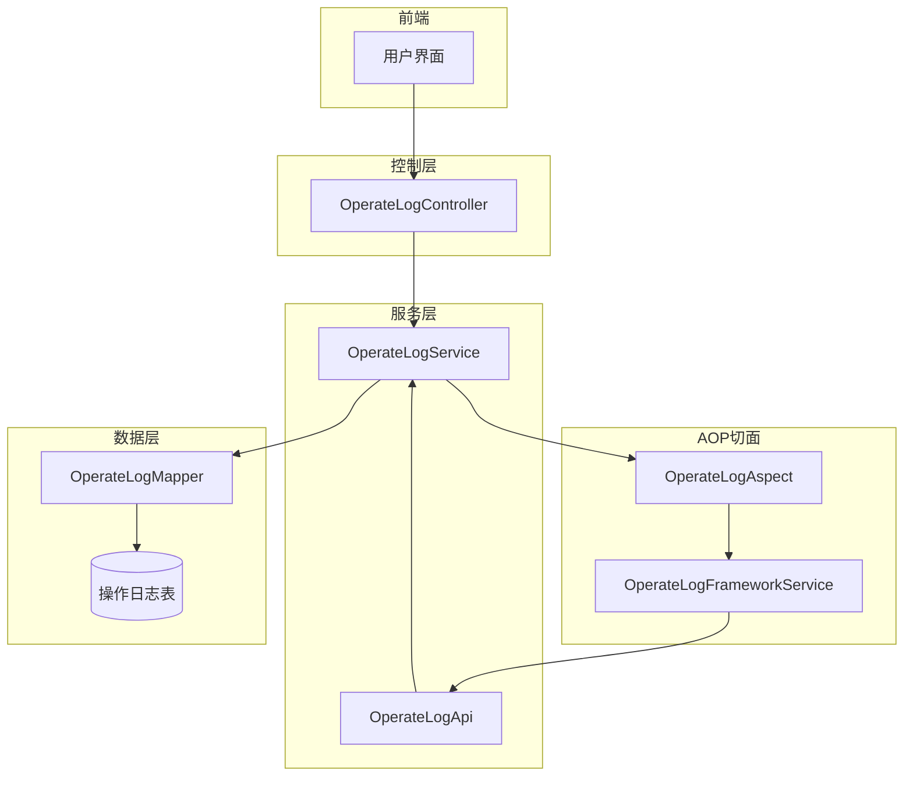
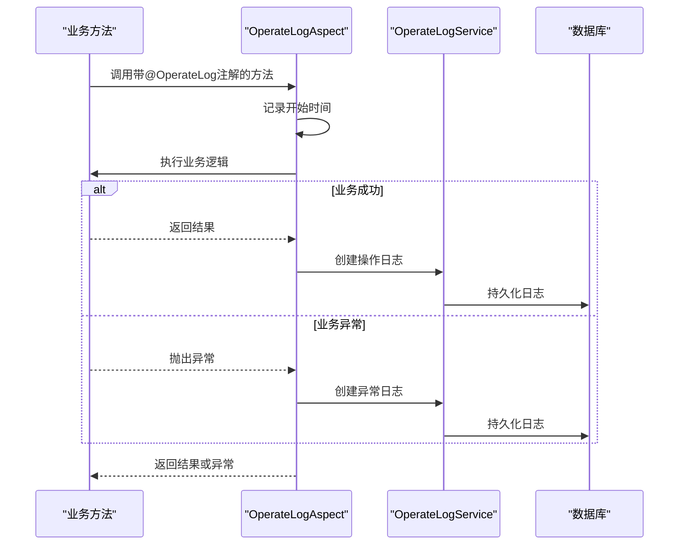
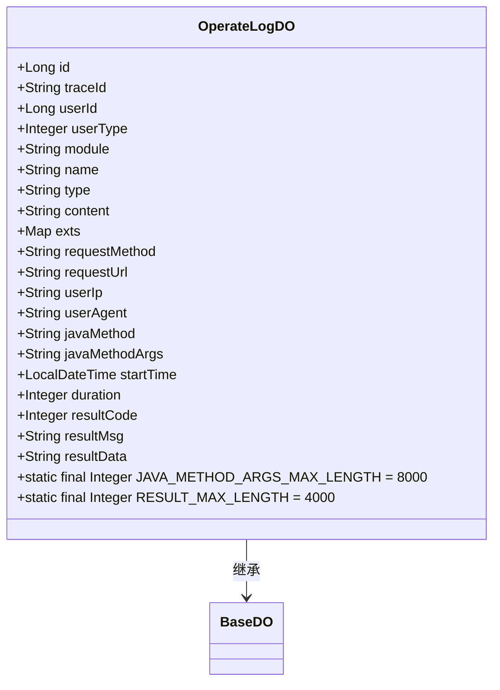
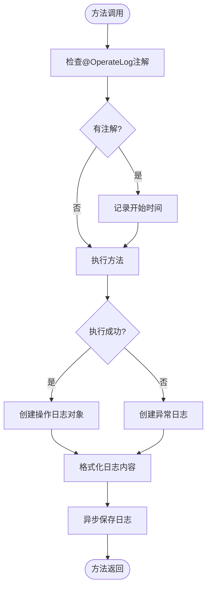
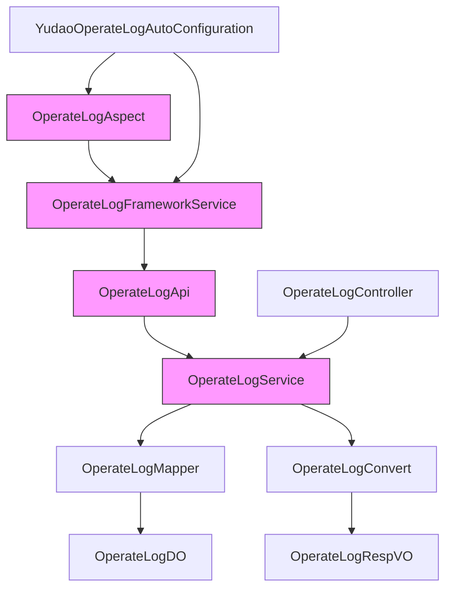

# 操作日志

<cite>
**本文档引用的文件**  
- [OperateLogAspect.java](file://yudao-framework/yudao-spring-boot-starter-operatelog/src/main/java/cn/iocoder/yudao/framework/operatelog/core/aop/OperateLogAspect.java)
- [OperateLog.java](file://yudao-framework/yudao-spring-boot-starter-operatelog/src/main/java/cn/iocoder/yudao/framework/operatelog/core/annotations/OperateLog.java)
- [OperateLogDO.java](file://yudao-module-system/yudao-module-system-biz/src/main/java/cn/iocoder/yudao/module/system/dal/dataobject/logger/OperateLogDO.java)
- [OperateLogServiceImpl.java](file://yudao-module-system/yudao-module-system-biz/src/main/java/cn/iocoder/yudao/module/system/service/logger/OperateLogServiceImpl.java)
- [OperateLogFrameworkServiceImpl.java](file://yudao-framework/yudao-spring-boot-starter-operatelog/src/main/java/cn/iocoder/yudao/framework/operatelog/core/service/OperateLogFrameworkServiceImpl.java)
- [OperateLogApiImpl.java](file://yudao-module-system/yudao-module-system-biz/src/main/java/cn/iocoder/yudao/module/system/api/logger/OperateLogApiImpl.java)
- [OperateLogController.java](file://yudao-module-system/yudao-module-system-biz/src/main/java/cn/iocoder/yudao/module/system/controller/admin/logger/OperateLogController.java)
- [YudaoOperateLogAutoConfiguration.java](file://yudao-framework/yudao-spring-boot-starter-operatelog/src/main/java/cn/iocoder/yudao/framework/operatelog/config/YudaoOperateLogAutoConfiguration.java)
- [OperateTypeEnum.java](file://yudao-framework/yudao-spring-boot-starter-operatelog/src/main/java/cn/iocoder/yudao/framework/operatelog/core/enums/OperateTypeEnum.java)
- [V1_0_0_001__框架初始化.sql](file://eplus-flyway/src/main/resources/db/migration/common/V1_0_0_001__框架初始化.sql)
</cite>

## 目录
1. [简介](#简介)
2. [核心组件](#核心组件)
3. [架构概览](#架构概览)
4. [详细组件分析](#详细组件分析)
5. [依赖分析](#依赖分析)
6. [性能考虑](#性能考虑)
7. [故障排除指南](#故障排除指南)
8. [结论](#结论)

## 简介
操作日志功能是系统审计和追溯的核心组件，用于记录管理员用户的关键操作行为。本系统通过AOP（面向切面编程）技术实现操作日志的自动记录，支持通过`@Log`注解对方法进行标记，从而捕获操作类型、模块名称和操作内容等元数据。日志记录机制确保在业务操作成功后才进行持久化，保证了数据的一致性。系统提供了完整的查询和审计功能，支持按操作人、操作类型和时间范围进行筛选，并支持通过SpEL表达式动态生成操作内容，实现了灵活的日志记录策略。

## 核心组件

操作日志功能由多个核心组件构成，包括AOP切面、注解定义、数据实体、服务接口和控制器。`OperateLogAspect`作为核心切面类，负责拦截带有`@OperateLog`注解的方法调用，提取操作元数据并创建日志记录。`OperateLogDO`实体定义了日志的持久化结构，包含操作人、操作时间、操作结果和操作参数等关键字段。`OperateLogService`提供了日志的创建、查询和导出功能，支持分页查询和条件筛选。整个机制通过Spring的自动配置实现无缝集成，确保日志记录对业务代码的透明性。

**核心组件**
- [OperateLogAspect.java](file://yudao-framework/yudao-spring-boot-starter-operatelog/src/main/java/cn/iocoder/yudao/framework/operatelog/core/aop/OperateLogAspect.java#L1-L387)
- [OperateLogDO.java](file://yudao-module-system/yudao-module-system-biz/src/main/java/cn/iocoder/yudao/module/system/dal/dataobject/logger/OperateLogDO.java#L1-L143)
- [OperateLogServiceImpl.java](file://yudao-module-system/yudao-module-system-biz/src/main/java/cn/iocoder/yudao/module/system/service/logger/OperateLogServiceImpl.java#L1-L55)

## 架构概览

**图示来源**
- [OperateLogController.java](file://yudao-module-system/yudao-module-system-biz/src/main/java/cn/iocoder/yudao/module/system/controller/admin/logger/OperateLogController.java#L1-L72)
- [OperateLogServiceImpl.java](file://yudao-module-system/yudao-module-system-biz/src/main/java/cn/iocoder/yudao/module/system/service/logger/OperateLogServiceImpl.java#L1-L55)
- [OperateLogAspect.java](file://yudao-framework/yudao-spring-boot-starter-operatelog/src/main/java/cn/iocoder/yudao/framework/operatelog/core/aop/OperateLogAspect.java#L1-L387)

## 详细组件分析

### 注解与AOP机制分析

操作日志的实现基于Spring AOP技术，通过自定义注解`@OperateLog`标记需要记录日志的方法。当方法被调用时，AOP切面会拦截执行流程，提取注解中的元数据并记录操作日志。

**图示来源**
- [OperateLogAspect.java](file://yudao-framework/yudao-spring-boot-starter-operatelog/src/main/java/cn/iocoder/yudao/framework/operatelog/core/aop/OperateLogAspect.java#L74-L112)
- [OperateLogServiceImpl.java](file://yudao-module-system/yudao-module-system-biz/src/main/java/cn/iocoder/yudao/module/system/service/logger/OperateLogServiceImpl.java#L50-L55)

**组件来源**
- [OperateLogAspect.java](file://yudao-framework/yudao-spring-boot-starter-operatelog/src/main/java/cn/iocoder/yudao/framework/operatelog/core/aop/OperateLogAspect.java#L1-L387)
- [OperateLog.java](file://yudao-framework/yudao-spring-boot-starter-operatelog/src/main/java/cn/iocoder/yudao/framework/operatelog/core/annotations/OperateLog.java#L1-L58)

### 实体设计分析

`OperateLogDO`实体类定义了操作日志的数据库表结构，包含了操作的完整上下文信息。该实体继承自`BaseDO`，包含了基础的审计字段。

**图示来源**
- [OperateLogDO.java](file://yudao-module-system/yudao-module-system-biz/src/main/java/cn/iocoder/yudao/module/system/dal/dataobject/logger/OperateLogDO.java#L1-L143)
- [V1_0_0_001__框架初始化.sql](file://eplus-flyway/src/main/resources/db/migration/common/V1_0_0_001__框架初始化.sql#L547-L555)

**组件来源**
- [OperateLogDO.java](file://yudao-module-system/yudao-module-system-biz/src/main/java/cn/iocoder/yudao/module/system/dal/dataobject/logger/OperateLogDO.java#L1-L143)

### 事务处理机制分析

操作日志的事务处理机制确保日志记录与业务操作的一致性。系统采用异步记录策略，在业务方法成功执行后才将日志持久化到数据库。

**图示来源**
- [OperateLogAspect.java](file://yudao-framework/yudao-spring-boot-starter-operatelog/src/main/java/cn/iocoder/yudao/framework/operatelog/core/aop/OperateLogAspect.java#L98-L111)
- [OperateLogFrameworkServiceImpl.java](file://yudao-framework/yudao-spring-boot-starter-operatelog/src/main/java/cn/iocoder/yudao/framework/operatelog/core/service/OperateLogFrameworkServiceImpl.java#L22-L26)

**组件来源**
- [OperateLogAspect.java](file://yudao-framework/yudao-spring-boot-starter-operatelog/src/main/java/cn/iocoder/yudao/framework/operatelog/core/aop/OperateLogAspect.java#L1-L387)
- [OperateLogFrameworkServiceImpl.java](file://yudao-framework/yudao-spring-boot-starter-operatelog/src/main/java/cn/iocoder/yudao/framework/operatelog/core/service/OperateLogFrameworkServiceImpl.java#L1-L28)

## 依赖分析

**图示来源**
- [YudaoOperateLogAutoConfiguration.java](file://yudao-framework/yudao-spring-boot-starter-operatelog/src/main/java/cn/iocoder/yudao/framework/operatelog/config/YudaoOperateLogAutoConfiguration.java#L1-L24)
- [OperateLogApiImpl.java](file://yudao-module-system/yudao-module-system-biz/src/main/java/cn/iocoder/yudao/module/system/api/logger/OperateLogApiImpl.java#L1-L39)

**组件来源**
- [YudaoOperateLogAutoConfiguration.java](file://yudao-framework/yudao-spring-boot-starter-operatelog/src/main/java/cn/iocoder/yudao/framework/operatelog/config/YudaoOperateLogAutoConfiguration.java#L1-L24)
- [OperateLogApiImpl.java](file://yudao-module-system/yudao-module-system-biz/src/main/java/cn/iocoder/yudao/module/system/api/logger/OperateLogApiImpl.java#L1-L39)

## 性能考虑

操作日志系统在设计时充分考虑了性能影响，采用了多项优化策略。首先，通过AOP切面的条件判断，只有管理员用户的操作才会被记录，减少了不必要的日志开销。其次，日志记录采用异步方式，通过`@Async`注解将日志持久化操作放入独立线程执行，避免阻塞主业务流程。此外，系统对日志内容进行了长度限制，`javaMethodArgs`字段最大长度为8000字符，`resultData`字段最大长度为4000字符，防止过大的日志数据影响数据库性能。对于高频操作，系统提供了`enable`开关，可以动态控制是否记录日志，提供了灵活的性能调优手段。

## 故障排除指南

当操作日志功能出现问题时，可以按照以下步骤进行排查：首先检查`@OperateLog`注解是否正确应用在目标方法上，确认注解的`module`、`name`和`type`属性设置正确。其次，验证用户类型是否为管理员，因为系统默认只记录管理员用户的操作日志。如果日志未被记录，检查AOP切面是否被正确加载，可以通过查看应用启动日志确认`OperateLogAspect`是否被实例化。对于日志内容不完整的问题，检查`logArgs`和`logResultData`属性设置，确保需要记录的参数和结果数据被包含。如果遇到数据库存储问题，检查`OperateLogDO`实体定义的字段长度限制，特别是`javaMethodArgs`和`resultData`字段的长度约束。最后，通过查看系统日志文件，可以获取AOP切面执行过程中的详细信息，帮助定位具体问题。

**故障排除来源**
- [OperateLogAspect.java](file://yudao-framework/yudao-spring-boot-starter-operatelog/src/main/java/cn/iocoder/yudao/framework/operatelog/core/aop/OperateLogAspect.java#L93-L95)
- [OperateLogDO.java](file://yudao-module-system/yudao-module-system-biz/src/main/java/cn/iocoder/yudao/module/system/dal/dataobject/logger/OperateLogDO.java#L31-L36)

## 结论

操作日志系统通过AOP技术和自定义注解实现了高效、灵活的日志记录机制。系统设计充分考虑了可维护性和性能优化，通过异步记录、长度限制和条件过滤等策略，确保了日志功能对业务系统的影响最小化。`OperateLogDO`实体的字段设计全面覆盖了操作审计所需的关键信息，包括操作人、操作时间、操作结果和操作参数等。查询和审计功能支持多维度筛选，满足了系统监控和问题追溯的需求。通过SpEL表达式的支持，系统实现了动态日志内容生成，提高了日志记录的灵活性和实用性。整体架构清晰，组件职责明确，为系统的安全审计提供了可靠的技术保障。