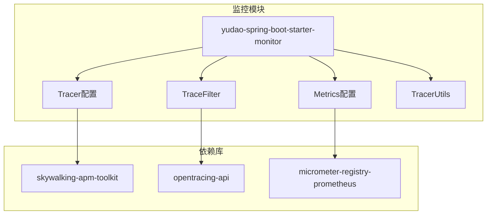
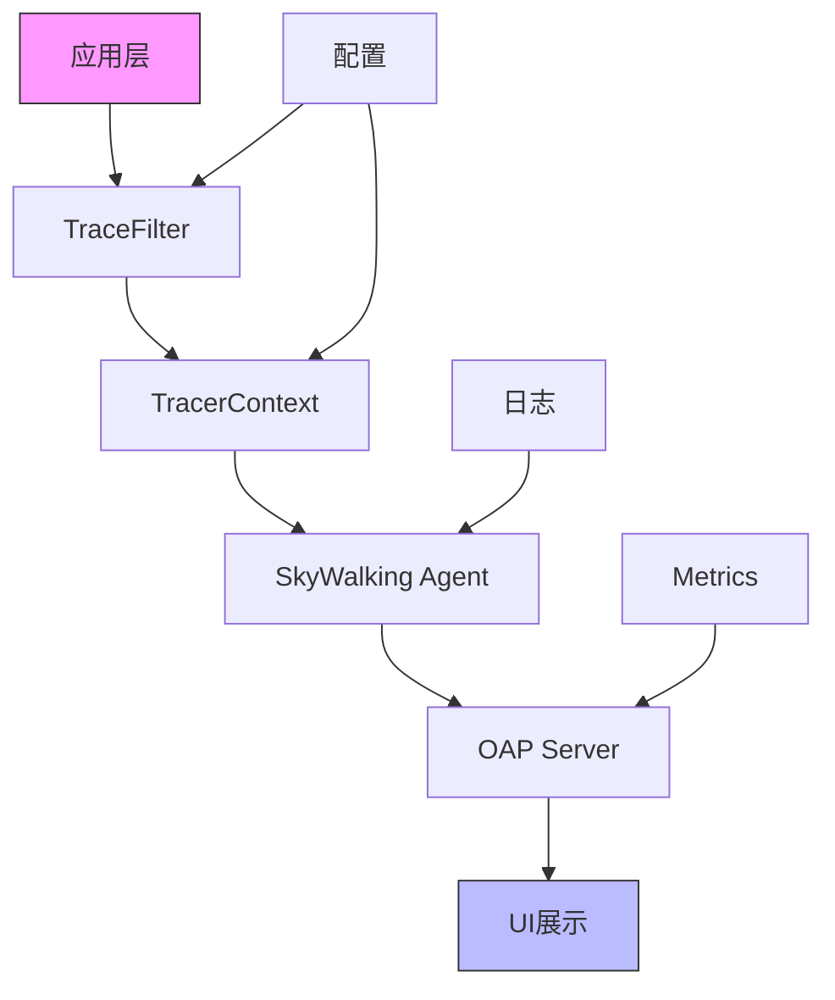
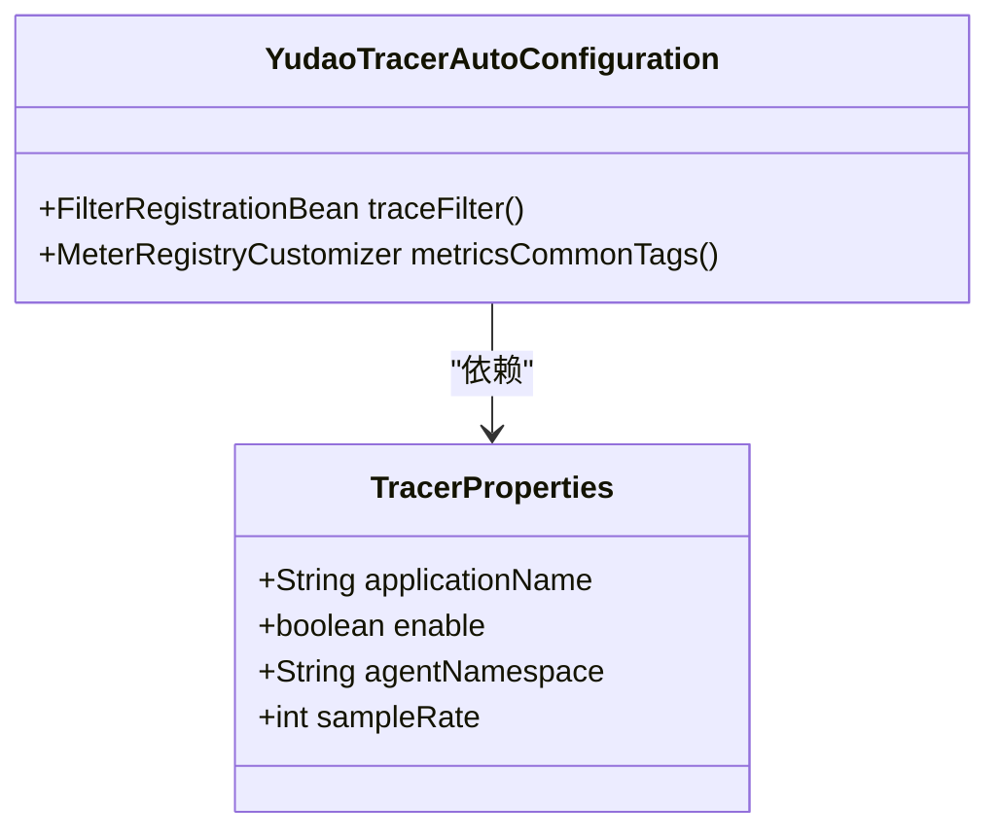
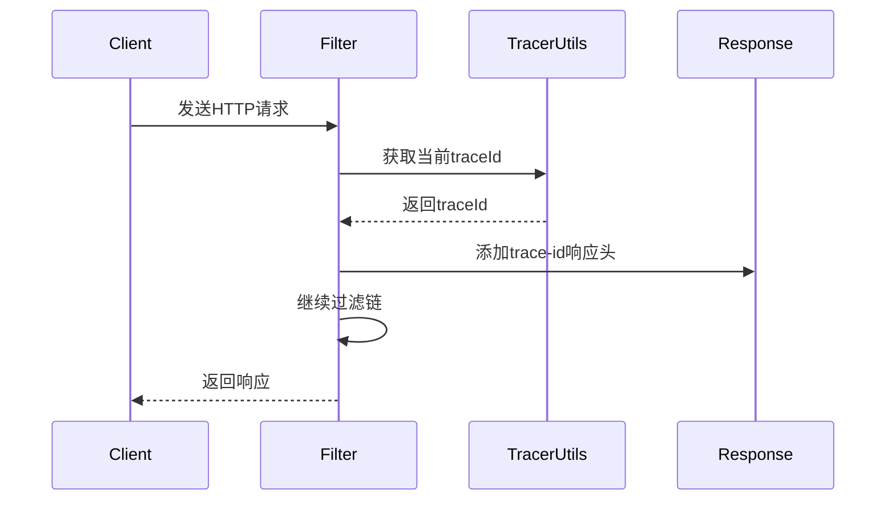
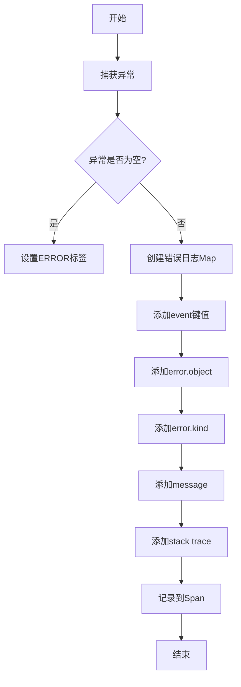
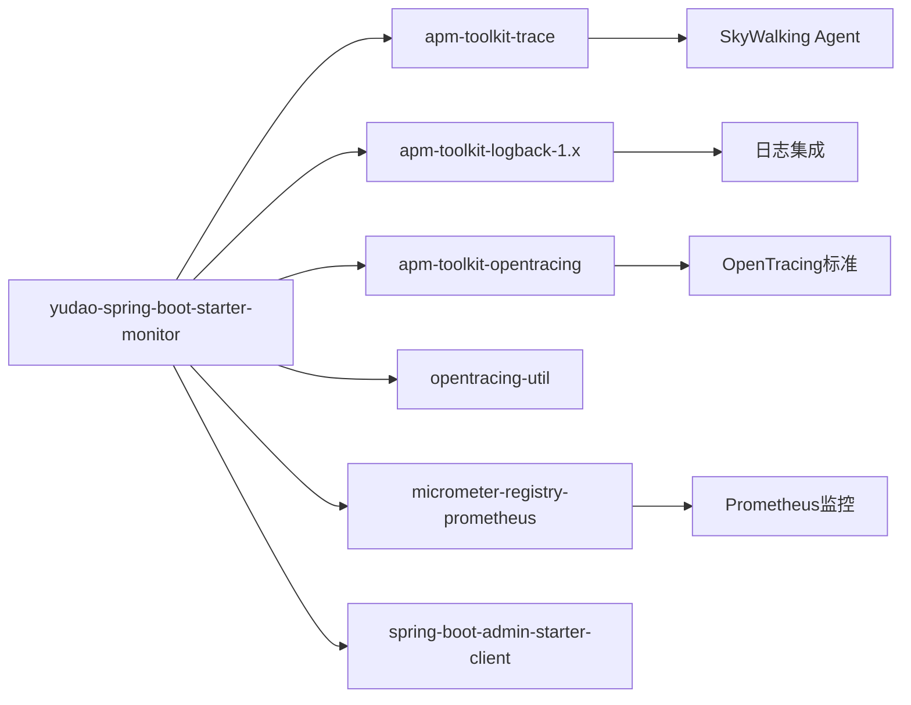

# 链路追踪

<cite>
**本文档引用文件**  
- [TracerProperties.java](file://yudao-framework/yudao-spring-boot-starter-monitor/src/main/java/cn/iocoder/yudao/framework/tracer/config/TracerProperties.java)
- [YudaoTracerAutoConfiguration.java](file://yudao-framework/yudao-spring-boot-starter-monitor/src/main/java/cn/iocoder/yudao/framework/tracer/config/YudaoTracerAutoConfiguration.java)
- [TraceFilter.java](file://yudao-framework/yudao-spring-boot-starter-monitor/src/main/java/cn/iocoder/yudao/framework/tracer/core/filter/TraceFilter.java)
- [TracerFrameworkUtils.java](file://yudao-framework/yudao-spring-boot-starter-monitor/src/main/java/cn/iocoder/yudao/framework/tracer/core/util/TracerFrameworkUtils.java)
- [TracerUtils.java](file://yudao-framework/yudao-common/src/main/java/cn/iocoder/yudao/framework/common/util/monitor/TracerUtils.java)
- [pom.xml](file://yudao-framework/yudao-spring-boot-starter-monitor/pom.xml)
- [logback-spring.xml](file://yudao-server/src/main/resources/logback-spring.xml)
</cite>

## 目录
1. [简介](#简介)
2. [项目结构](#项目结构)
3. [核心组件](#核心组件)
4. [架构概述](#架构概述)
5. [详细组件分析](#详细组件分析)
6. [依赖分析](#依赖分析)
7. [性能考虑](#性能考虑)
8. [故障排除指南](#故障排除指南)
9. [结论](#结论)

## 简介
本文档详细介绍基于SkyWalking的分布式链路追踪系统在本项目中的配置和使用方法。文档涵盖TracerConfiguration自动配置类的实现原理、TraceId生成策略、采样率配置、跨线程上下文传递机制，以及TracerServletFilter如何拦截HTTP请求并注入追踪上下文。同时提供在微服务架构中追踪跨服务调用的完整示例，并指导开发者如何在SkyWalking UI中分析调用链路，定位性能瓶颈。

## 项目结构
本项目的链路追踪功能主要集中在`yudao-framework`模块下的`yudao-spring-boot-starter-monitor`组件中，该组件封装了SkyWalking的集成和配置。

**图示来源**
- [YudaoTracerAutoConfiguration.java](file://yudao-framework/yudao-spring-boot-starter-monitor/src/main/java/cn/iocoder/yudao/framework/tracer/config/YudaoTracerAutoConfiguration.java)
- [pom.xml](file://yudao-framework/yudao-spring-boot-starter-monitor/pom.xml)

**章节来源**
- [yudao-framework/yudao-spring-boot-starter-monitor](file://yudao-framework/yudao-spring-boot-starter-monitor)

## 核心组件
本系统的核心链路追踪组件包括TracerProperties配置类、YudaoTracerAutoConfiguration自动配置类、TraceFilter过滤器以及相关的工具类。这些组件共同实现了基于SkyWalking的分布式追踪功能，支持TraceId的生成与传递、异常记录、日志关联等关键功能。

**章节来源**
- [TracerProperties.java](file://yudao-framework/yudao-spring-boot-starter-monitor/src/main/java/cn/iocoder/yudao/framework/tracer/config/TracerProperties.java)
- [YudaoTracerAutoConfiguration.java](file://yudao-framework/yudao-spring-boot-starter-monitor/src/main/java/cn/iocoder/yudao/framework/tracer/config/YudaoTracerAutoConfiguration.java)

## 架构概述
系统采用Spring Boot自动配置机制集成SkyWalking链路追踪功能，通过OpenTracing API标准与SkyWalking APM Toolkit进行交互。架构分为配置层、过滤器层、工具层和集成层，各层协同工作实现完整的链路追踪能力。

**图示来源**
- [YudaoTracerAutoConfiguration.java](file://yudao-framework/yudao-spring-boot-starter-monitor/src/main/java/cn/iocoder/yudao/framework/tracer/config/YudaoTracerAutoConfiguration.java)
- [TraceFilter.java](file://yudao-framework/yudao-spring-boot-starter-monitor/src/main/java/cn/iocoder/yudao/framework/tracer/core/filter/TraceFilter.java)

## 详细组件分析

### 配置组件分析
TracerProperties类作为配置属性类，通过@ConfigurationProperties注解绑定yudao.tracer前缀的配置项，为链路追踪提供可配置的参数支持。

**图示来源**
- [TracerProperties.java](file://yudao-framework/yudao-spring-boot-starter-monitor/src/main/java/cn/iocoder/yudao/framework/tracer/config/TracerProperties.java)
- [YudaoTracerAutoConfiguration.java](file://yudao-framework/yudao-spring-boot-starter-monitor/src/main/java/cn/iocoder/yudao/framework/tracer/config/YudaoTracerAutoConfiguration.java)

### 过滤器组件分析
TraceFilter作为核心过滤器组件，继承OncePerRequestFilter，在每次请求处理过程中将traceId添加到响应头中，实现链路追踪信息的传递。

**图示来源**
- [TraceFilter.java](file://yudao-framework/yudao-spring-boot-starter-monitor/src/main/java/cn/iocoder/yudao/framework/tracer/core/filter/TraceFilter.java)
- [TracerUtils.java](file://yudao-framework/yudao-common/src/main/java/cn/iocoder/yudao/framework/common/util/monitor/TracerUtils.java)

### 工具类组件分析
TracerFrameworkUtils和TracerUtils提供链路追踪相关的工具方法，包括异常处理、Span创建、上下文传递等功能，是实现完整追踪能力的基础工具。

**图示来源**
- [TracerFrameworkUtils.java](file://yudao-framework/yudao-spring-boot-starter-monitor/src/main/java/cn/iocoder/yudao/framework/tracer/core/util/TracerFrameworkUtils.java)
- [TracerUtils.java](file://yudao-framework/yudao-common/src/main/java/cn/iocoder/yudao/framework/common/util/monitor/TracerUtils.java)

**章节来源**
- [TracerFrameworkUtils.java](file://yudao-framework/yudao-spring-boot-starter-monitor/src/main/java/cn/iocoder/yudao/framework/tracer/core/util/TracerFrameworkUtils.java)
- [TracerUtils.java](file://yudao-framework/yudao-common/src/main/java/cn/iocoder/yudao/framework/common/util/monitor/TracerUtils.java)

## 依赖分析
链路追踪组件依赖于多个关键库，包括SkyWalking APM Toolkit、OpenTracing API和Micrometer等，这些依赖共同构成了完整的监控体系。

**图示来源**
- [pom.xml](file://yudao-framework/yudao-spring-boot-starter-monitor/pom.xml)
- [yudao-dependencies/pom.xml](file://yudao-dependencies/pom.xml)

**章节来源**
- [pom.xml](file://yudao-framework/yudao-spring-boot-starter-monitor/pom.xml)
- [yudao-dependencies/pom.xml](file://yudao-dependencies/pom.xml)

## 性能考虑
在使用链路追踪时，需要注意采样率配置以平衡监控精度和系统性能。过高的采样率会增加系统开销，而过低的采样率可能无法捕获关键问题。建议在生产环境中根据实际负载调整采样率参数。

## 故障排除指南
当链路追踪功能出现问题时，可检查以下方面：确认SkyWalking Agent是否正确启动，验证trace-id是否正确传递到响应头，检查日志中是否有相关错误信息，确保网络连接正常且OAP服务器可达。

**章节来源**
- [TraceFilter.java](file://yudao-framework/yudao-spring-boot-starter-monitor/src/main/java/cn/iocoder/yudao/framework/tracer/core/filter/TraceFilter.java)
- [TracerFrameworkUtils.java](file://yudao-framework/yudao-spring-boot-starter-monitor/src/main/java/cn/iocoder/yudao/framework/tracer/core/util/TracerFrameworkUtils.java)

## 结论
本文档详细介绍了基于SkyWalking的分布式链路追踪系统在本项目中的实现和配置。通过自动配置、过滤器拦截、工具类支持等方式，实现了完整的链路追踪能力，为微服务架构下的性能监控和问题排查提供了有力支持。