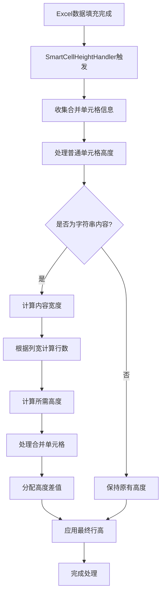

# 智能单元格高度处理器 (SmartCellHeightHandler) 说明文档

## 概述

`SmartCellHeightHandler` 是一个新的 Excel 单元格处理器，用于替代原有的 `CustomCellWriteHandler`。它实现了更加智能和精确的单元格高度自动调整功能。

## 核心功能

### 1. 🎯 **智能内容分析**
- 自动检测单元格内容类型（字符串、数字、公式等）
- 区分中文字符和英文字符的宽度差异
- 处理显式换行符（\n）和自动换行

### 2. 📏 **精确宽度计算**
- 获取单元格实际列宽（支持合并单元格）
- 智能计算内容所需的行数
- 考虑列宽限制，避免极窄列造成异常

### 3. 📐 **智能高度调整**
- 保持原有单元格的上下边距比例（25%）
- 根据行数动态计算文本区域高度（75%）
- 设置合理的行高上限，防止过度拉伸

### 4. 🔗 **合并单元格处理**
- 分两阶段处理：先处理普通单元格，再处理合并单元格
- 合并单元格的最小高度为包含行的高度之和
- 超出部分的高度差值平均分配给各行

## 技术实现特点

### ⚡ **性能优化**
```java
// 每个工作表只处理一次，避免重复计算
private final Set<String> processedSheets = new HashSet<>();
```

### 🛡️ **错误处理**
```java
// 完善的异常处理机制，确保 Excel 生成不受影响
try {
    processSheetRowHeight(sheet);
} catch (Exception e) {
    System.err.println("处理行高时发生异常: " + e.getMessage());
}
```

### 📊 **中英文智能识别**
```java
// 区分中英文字符宽度
private double calculateContentWidth(String content) {
    for (char c : content.toCharArray()) {
        if (isChinese(c)) {
            width += CHINESE_CHAR_WIDTH_FACTOR;  // 中文占2个字符宽度
        } else {
            width += ENGLISH_CHAR_WIDTH_FACTOR;  // 英文占1个字符宽度
        }
    }
}
```

## 配置参数

| 参数 | 默认值 | 说明 |
|-----|-------|------|
| `defaultRowHeight` | 400 | 默认行高（POI单位） |
| `PADDING_RATIO` | 0.25 | 上下边距占总高度比例 |
| `TEXT_RATIO` | 0.75 | 文本区域占总高度比例 |
| `MIN_COLUMN_WIDTH_THRESHOLD` | 768 | 最小列宽阈值 |
| `MAX_LINES_LIMIT` | 15 | 最大行数限制 |

## 使用方式

### 1. **直接使用（已集成）**
```java
// 已经集成到 ExcelUtils.writeByTemplate 方法中
ExcelUtils.writeByTemplate(response, templateInputStream, params, fileName, tableData, tableParams, rowHeight);
```

### 2. **自定义使用**
```java
SmartCellHeightHandler handler = new SmartCellHeightHandler();
handler.setDefaultRowHeight(600);  // 设置默认行高

EasyExcel.write(outputStream)
    .withTemplate(templateInputStream)
    .registerWriteHandler(handler)
    .sheet()
    .doFill(data);
```

## 处理流程



## 核心算法

### 🧮 **行数计算公式**
```java
// 可容纳字符数 = (列宽 / 256) × 0.9
double maxCharsInColumn = (columnWidth / 256.0) * 0.9;

// 内容等效宽度 = 中文字符数 × 2 + 英文字符数 × 1  
double contentWidth = chineseChars * 2.0 + englishChars * 1.0;

// 所需行数 = 向上取整(内容宽度 / 可容纳字符数)
int requiredLines = Math.ceil(contentWidth / maxCharsInColumn);
```

### 📏 **高度计算公式**
```java
// 边距高度 = 原始高度 × 25%
int padding = (int)(originalHeight * 0.25);

// 单行文本高度 = 原始高度 × 75%  
int singleLineHeight = (int)(originalHeight * 0.75);

// 最终高度 = 边距 + (行数 × 单行高度)
int finalHeight = padding + (lines * singleLineHeight);
```

## 优势对比

| 特性 | SmartCellHeightHandler | 原 CustomCellWriteHandler |
|-----|----------------------|-------------------------|
| 中英文区分 | ✅ 智能识别 | ❌ 统一处理 |
| 合并单元格 | ✅ 专门优化 | ⚠️ 基础支持 |
| 性能优化 | ✅ 每表一次处理 | ⚠️ 多次重复处理 |
| 错误处理 | ✅ 完善异常保护 | ⚠️ 基础处理 |
| 代码维护 | ✅ 结构清晰 | ⚠️ 逻辑复杂 |

## 注意事项

1. **列宽阈值**：当列宽小于768单位（约3个字符）时，不调整行高，避免异常
2. **行数限制**：最大行数限制为15行，防止行高过度拉伸
3. **合并单元格**：合并区域的高度分配采用平均分配策略
4. **边距保持**：始终保持原有模板的上下边距比例
5. **异常安全**：任何异常都不会影响Excel文件的正常生成

## 测试建议

建议测试以下场景：
- 长文本内容的自动换行
- 中英文混合内容的高度计算
- 合并单元格的高度分配
- 极窄列的处理
- 大量数据的性能表现